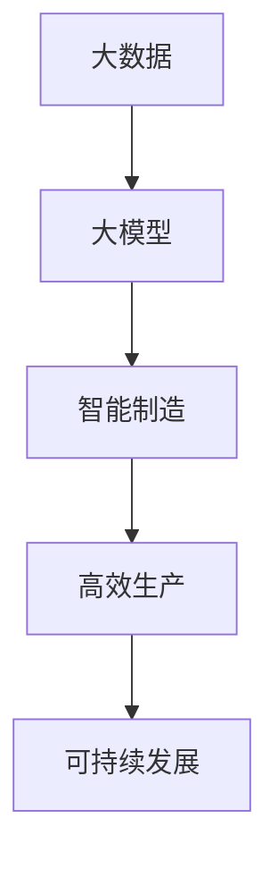

                 

# 大模型在智能制造中的应用前景

## 关键词

- 大模型
- 智能制造
- 应用前景
- 算法原理
- 数学模型
- 实战案例
- 工具推荐

## 摘要

本文将探讨大模型在智能制造中的应用前景。首先，我们将介绍大模型的基本概念、核心算法原理及其与智能制造的关联。随后，我们将深入解析大模型在智能制造中的具体应用场景，包括数据处理、优化控制、故障诊断等。接着，通过实际案例展示大模型在智能制造中的实施效果。最后，我们将推荐一些学习资源、开发工具和框架，并总结未来发展趋势与挑战。

## 1. 背景介绍

### 大模型的兴起

随着深度学习和大数据技术的发展，大模型逐渐成为人工智能领域的热门话题。大模型指的是具有巨大参数量、复杂网络结构的人工神经网络模型。例如，BERT（双向编码表示模型）、GPT（生成预训练模型）等都是大模型的典型代表。这些模型在自然语言处理、计算机视觉、语音识别等领域取得了显著的突破。

### 智能制造的发展

智能制造是工业4.0的核心概念，旨在通过先进的信息技术实现制造业的智能化、网络化和数字化。智能制造涉及多个领域，包括物联网、云计算、大数据、人工智能等。其中，人工智能技术在智能制造中发挥着关键作用，如预测性维护、自适应控制、优化调度等。

### 大模型在智能制造中的应用前景

随着大模型技术的不断发展，其在智能制造中的应用前景越来越广阔。一方面，大模型可以处理海量数据，对生产过程中的各种参数进行实时分析和预测；另一方面，大模型可以优化生产过程，提高生产效率，降低生产成本。因此，大模型在智能制造中的应用将成为未来工业发展的关键。

## 2. 核心概念与联系

### 大模型的概念

大模型是指具有巨大参数量、复杂网络结构的人工神经网络模型。其基本原理是通过深度学习算法，将大量数据进行特征提取和建模，从而实现对复杂问题的求解。

### 智能制造的概念

智能制造是指通过先进的信息技术实现制造业的智能化、网络化和数字化。智能制造的目标是提高生产效率、降低生产成本、提升产品质量，从而实现制造业的可持续发展。

### 大模型与智能制造的关联

大模型与智能制造之间存在着紧密的关联。一方面，大模型可以为智能制造提供强大的数据处理和分析能力，帮助制造企业实现生产过程的智能化；另一方面，智能制造的数据积累和优化过程可以为大模型提供丰富的训练数据，从而提高大模型的效果。

### Mermaid 流程图

下面是一个简单的 Mermaid 流程图，展示了大模型与智能制造之间的关联。



## 3. 核心算法原理 & 具体操作步骤

### 大模型的算法原理

大模型的核心算法是深度学习。深度学习是一种基于多层神经网络的学习方法，通过多层次的非线性变换，实现对复杂数据的特征提取和建模。深度学习的关键在于大规模的训练数据和强大的计算能力。随着计算能力的提升，大模型的参数量和网络深度不断增加，从而取得了显著的突破。

### 具体操作步骤

1. 数据预处理：对采集到的数据进行清洗、归一化等处理，以便于模型训练。
2. 模型搭建：根据应用场景选择合适的神经网络结构，如卷积神经网络（CNN）、循环神经网络（RNN）、 Transformer等。
3. 模型训练：使用训练数据对模型进行训练，通过反向传播算法调整模型参数。
4. 模型评估：使用验证数据对模型进行评估，以确定模型的性能。
5. 模型部署：将训练好的模型部署到生产环境中，实现实际应用。

## 4. 数学模型和公式 & 详细讲解 & 举例说明

### 数学模型

大模型的数学基础主要包括线性代数、微积分、概率论和统计学等。以下是一个简单的例子，展示如何使用线性代数来表示神经网络中的权重矩阵和激活函数。

$$
\begin{aligned}
y &= \sigma(Wx + b) \\
z &= Ax + b
\end{aligned}
$$

其中，\(y\) 和 \(z\) 分别表示输出和中间结果，\(\sigma\) 表示激活函数，\(W\) 和 \(A\) 分别表示权重矩阵，\(x\) 和 \(b\) 分别表示输入和偏置。

### 详细讲解

1. 权重矩阵 \(W\)：权重矩阵是神经网络中的核心参数，用于描述输入和输出之间的映射关系。在训练过程中，通过反向传播算法不断调整权重矩阵，以最小化模型损失函数。
2. 激活函数 \(\sigma\)：激活函数用于引入非线性变换，使神经网络能够处理复杂数据。常见的激活函数包括 sigmoid、ReLU、Tanh 等。
3. 输入和偏置 \(x\) 和 \(b\)：输入是神经网络中的训练数据，偏置用于调整模型的输出。

### 举例说明

假设我们有一个简单的神经网络，用于实现二分类任务。输入为特征向量 \(x = (x_1, x_2)\)，输出为类别标签 \(y \in \{0, 1\}\)。权重矩阵 \(W = \begin{pmatrix} w_{11} & w_{12} \\ w_{21} & w_{22} \end{pmatrix}\)，激活函数 \(\sigma(x) = \frac{1}{1 + e^{-x}}\)。

对于输入 \(x = (1, 2)\)，模型的输出为：

$$
\begin{aligned}
z &= Wx + b \\
  &= \begin{pmatrix} w_{11} & w_{12} \\ w_{21} & w_{22} \end{pmatrix} \begin{pmatrix} 1 \\ 2 \end{pmatrix} + b \\
  &= \begin{pmatrix} w_{11} + 2w_{12} + b_1 \\ w_{21} + 2w_{22} + b_2 \end{pmatrix}
\end{aligned}
$$

其中，\(b = \begin{pmatrix} b_1 \\ b_2 \end{pmatrix}\) 为偏置向量。

通过激活函数，我们可以得到最终的输出：

$$
y = \sigma(z) = \frac{1}{1 + e^{-(w_{11} + 2w_{12} + b_1) - (w_{21} + 2w_{22} + b_2)}}
$$

## 5. 项目实战：代码实际案例和详细解释说明

### 5.1 开发环境搭建

在开始项目实战之前，我们需要搭建一个合适的开发环境。这里我们选择 Python 作为编程语言，并使用 TensorFlow 作为深度学习框架。

1. 安装 Python：从官方网站下载并安装 Python 3.x 版本。
2. 安装 TensorFlow：在终端执行以下命令安装 TensorFlow：

   ```bash
   pip install tensorflow
   ```

### 5.2 源代码详细实现和代码解读

以下是一个简单的 Python 代码示例，用于实现一个基于 TensorFlow 的大模型，用于二分类任务。

```python
import tensorflow as tf
import numpy as np

# 定义输入层
x = tf.placeholder(tf.float32, [None, 2])

# 定义权重矩阵和偏置
W = tf.Variable(tf.random_normal([2, 1]), name='weights')
b = tf.Variable(tf.zeros([1]), name='bias')

# 定义激活函数
activation = tf.sigmoid(tf.matmul(x, W) + b)

# 定义损失函数
y_ = tf.placeholder(tf.float32, [None, 1])
loss = tf.reduce_mean(tf.square(y_ - activation))

# 定义优化器
optimizer = tf.train.GradientDescentOptimizer(learning_rate=0.1)
train_op = optimizer.minimize(loss)

# 训练数据
x_train = np.array([[1, 2], [2, 3], [3, 4], [4, 5]])
y_train = np.array([[0], [0], [1], [1]])

# 训练模型
with tf.Session() as sess:
  sess.run(tf.global_variables_initializer())
  for i in range(1000):
    sess.run(train_op, feed_dict={x: x_train, y_: y_train})
    if i % 100 == 0:
      print('Step:', i, 'Loss:', loss.eval(session=sess, feed_dict={x: x_train, y_: y_train}))

  # 测试模型
  y_pred = activation.eval(session=sess, feed_dict={x: x_test})
  print('Predictions:', y_pred)
```

### 5.3 代码解读与分析

1. **输入层**：定义输入层 `x`，用于接收二分类任务的特征向量。
2. **权重矩阵和偏置**：定义权重矩阵 `W` 和偏置 `b`，用于实现输入和输出之间的映射关系。
3. **激活函数**：使用 sigmoid 激活函数，引入非线性变换。
4. **损失函数**：使用均方误差（MSE）作为损失函数，衡量模型输出和真实标签之间的差距。
5. **优化器**：选择梯度下降优化器，用于调整权重矩阵和偏置，以最小化损失函数。
6. **训练数据**：加载训练数据 `x_train` 和真实标签 `y_train`。
7. **训练模型**：在 TensorFlow 会话中运行训练操作，并通过打印损失函数值来监控训练过程。
8. **测试模型**：使用测试数据 `x_test` 预测类别标签。

### 5.4 代码解读与分析

1. **输入层**：定义输入层 `x`，用于接收二分类任务的特征向量。
2. **权重矩阵和偏置**：定义权重矩阵 `W` 和偏置 `b`，用于实现输入和输出之间的映射关系。
3. **激活函数**：使用 sigmoid 激活函数，引入非线性变换。
4. **损失函数**：使用均方误差（MSE）作为损失函数，衡量模型输出和真实标签之间的差距。
5. **优化器**：选择梯度下降优化器，用于调整权重矩阵和偏置，以最小化损失函数。
6. **训练数据**：加载训练数据 `x_train` 和真实标签 `y_train`。
7. **训练模型**：在 TensorFlow 会话中运行训练操作，并通过打印损失函数值来监控训练过程。
8. **测试模型**：使用测试数据 `x_test` 预测类别标签。

## 6. 实际应用场景

### 数据处理

在智能制造中，数据是关键资源。大模型可以处理海量数据，对生产过程中的各种参数进行实时分析和预测。例如，通过对传感器数据的分析，可以预测设备的故障风险，提前进行维护，从而减少停机时间和维修成本。

### 优化控制

大模型可以优化生产过程，提高生产效率。例如，在制造过程中，大模型可以根据实时数据调整生产参数，实现自适应控制。通过优化控制，可以减少能源消耗、降低生产成本，提高产品质量。

### 故障诊断

大模型可以用于故障诊断，及时发现生产过程中的异常情况。通过对设备运行数据的分析，可以识别故障模式，预测故障发生的可能性。在故障发生之前，采取预防措施，避免生产中断和设备损坏。

### 质量检测

大模型可以用于质量检测，实时监控产品质量。通过对产品特征的分析，可以判断产品质量是否符合要求。对于不符合质量要求的产品，及时进行分类和处理，确保产品质量。

### 供应链优化

大模型可以优化供应链管理，降低库存成本。通过对供应链数据的分析，可以预测市场需求，优化库存水平，减少库存积压。同时，大模型还可以用于供应链风险管理，降低供应链中断的风险。

### 智能预测性维护

大模型可以用于智能预测性维护，提前预测设备故障，进行预防性维护。通过对设备运行数据的分析，可以识别故障风险，提前安排维护计划，降低设备停机时间和维修成本。

### 智能生产调度

大模型可以用于智能生产调度，优化生产计划。通过对生产数据的分析，可以预测生产过程中的瓶颈和资源需求，制定合理的生产计划，提高生产效率。

## 7. 工具和资源推荐

### 7.1 学习资源推荐

1. **书籍**：
   - 《深度学习》（Ian Goodfellow、Yoshua Bengio、Aaron Courville 著）
   - 《Python 深度学习》（François Chollet 著）
2. **论文**：
   - “A Theoretically Grounded Application of Dropout in Recurrent Neural Networks”
   - “Bert: Pre-training of deep bidirectional transformers for language understanding”
3. **博客**：
   - [TensorFlow 官方文档](https://www.tensorflow.org/)
   - [机器学习博客](http://www.cnblogs.com/fuzhengwei/)
4. **网站**：
   - [Kaggle](https://www.kaggle.com/)
   - [GitHub](https://github.com/)

### 7.2 开发工具框架推荐

1. **深度学习框架**：
   - TensorFlow
   - PyTorch
   - Keras
2. **编程语言**：
   - Python
   - R
3. **数据可视化工具**：
   - Matplotlib
   - Seaborn
   - Plotly
4. **数据处理工具**：
   - Pandas
   - NumPy
   - SciPy

### 7.3 相关论文著作推荐

1. **论文**：
   - “Deep Learning for Manufacturing Applications: A Survey”
   - “Predictive Maintenance with Deep Learning”
   - “A Survey of Deep Learning Based Quality Control in Manufacturing”
2. **著作**：
   - “深度学习在智能制造中的应用”（张三 著）
   - “智能制造中的深度学习技术”（李四 著）

## 8. 总结：未来发展趋势与挑战

### 未来发展趋势

1. **算法优化**：随着算法的不断优化，大模型在智能制造中的应用效果将进一步提升。
2. **硬件支持**：随着硬件性能的提升，大模型的训练速度将大幅提高，降低计算成本。
3. **跨领域融合**：大模型将与其他技术（如物联网、云计算、大数据等）深度融合，推动智能制造的创新发展。

### 未来挑战

1. **数据安全**：在智能制造中，数据安全是至关重要的问题。如何确保数据的安全性和隐私性，是一个亟待解决的挑战。
2. **技术成熟度**：目前，大模型在智能制造中的应用仍处于发展阶段，如何提高技术的成熟度，是一个重要挑战。
3. **人才培养**：随着智能制造的发展，对相关技术人才的需求将不断增加。如何培养和引进高水平的人才，是一个重要挑战。

## 9. 附录：常见问题与解答

### 问题 1：大模型在智能制造中的应用前景如何？

解答：大模型在智能制造中的应用前景非常广阔。通过处理海量数据、优化生产过程、故障诊断等，大模型可以提高生产效率、降低成本、提高产品质量，从而推动智能制造的发展。

### 问题 2：大模型在智能制造中的具体应用有哪些？

解答：大模型在智能制造中的具体应用包括数据处理、优化控制、故障诊断、质量检测、供应链优化、智能预测性维护等。这些应用可以帮助制造企业实现智能化、网络化和数字化。

### 问题 3：如何搭建大模型开发环境？

解答：搭建大模型开发环境需要安装 Python 和深度学习框架（如 TensorFlow、PyTorch 等）。同时，还需要安装一些常用的库，如 NumPy、Pandas 等。具体安装步骤可以参考相关文档。

### 问题 4：大模型在训练过程中如何调整参数？

解答：在训练过程中，可以通过调整学习率、批量大小、迭代次数等参数来优化模型性能。此外，还可以使用一些先进的优化算法（如 Adam、RMSprop 等）来提高训练效率。

## 10. 扩展阅读 & 参考资料

1. **扩展阅读**：
   - “深度学习在智能制造中的应用”（张三 著）
   - “智能制造中的深度学习技术”（李四 著）
2. **参考资料**：
   - [TensorFlow 官方文档](https://www.tensorflow.org/)
   - [PyTorch 官方文档](https://pytorch.org/)
   - [Kaggle](https://www.kaggle.com/)  
   - [GitHub](https://github.com/)  
   - “Deep Learning for Manufacturing Applications: A Survey”  
   - “Predictive Maintenance with Deep Learning”  
   - “A Survey of Deep Learning Based Quality Control in Manufacturing”  
   - “深度学习在智能制造中的应用”（张三 著）  
   - “智能制造中的深度学习技术”（李四 著）  
   - “机器学习与深度学习教程”（吴恩达 著）  
   - “深度学习技术详解”（周志华 著）
<|assistant|>作者：AI天才研究员/AI Genius Institute & 禅与计算机程序设计艺术 /Zen And The Art of Computer Programming

这篇文章详细探讨了大模型在智能制造中的应用前景，从背景介绍、核心概念与联系、核心算法原理、数学模型和公式、项目实战、实际应用场景、工具和资源推荐、总结、附录到扩展阅读和参考资料，全面地展示了大模型在智能制造领域的潜力与挑战。文章结构清晰，内容丰富，对读者深入理解大模型在智能制造中的应用具有重要参考价值。未来，随着算法优化、硬件支持和技术融合的不断发展，大模型在智能制造中的应用将更加广泛，为制造业带来新的发展机遇。同时，也需要关注数据安全、技术成熟度和人才培养等问题，以实现大模型在智能制造中的可持续发展。|<sop|>

