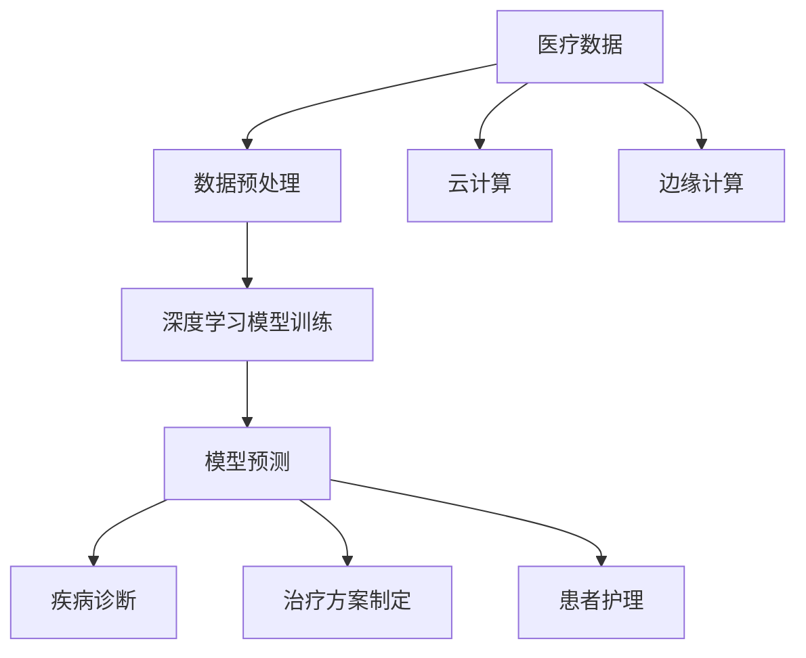

                 

### 背景介绍

#### 智能医疗的崛起

随着科技的发展，人工智能（AI）已经成为推动各行各业变革的重要力量。在医疗领域，智能医疗的应用逐渐成为研究的热点，从疾病诊断、治疗方案的制定到患者护理，AI技术正逐步改变传统医疗的模式。大模型在智能医疗中的应用，更是为这一领域带来了新的契机。

#### 大模型的发展

大模型，尤其是深度学习模型，近年来取得了惊人的进展。这些模型具有处理大量复杂数据的能力，并在图像识别、自然语言处理、语音识别等领域取得了显著的成就。随着计算能力的提升和数据量的增加，大模型在医疗领域的应用前景愈发广阔。

#### 智能医疗的挑战

尽管智能医疗的前景诱人，但同时也面临着诸多挑战。医疗数据的高度复杂性和隐私保护问题是首要难题。此外，医疗领域的专业知识非常广泛，如何将大模型与医疗专业知识有效结合，也是需要克服的难点。

#### 本文目的

本文旨在探讨大模型在智能医疗中的应用前景，通过分析其核心概念、算法原理、数学模型、实际应用场景等，为读者提供一个全面而深入的了解。希望通过本文的阐述，能够激发更多人对智能医疗与大模型结合的研究兴趣，为未来的医疗发展提供新思路。

#### 关键词

- 智能医疗
- 大模型
- 深度学习
- 医疗数据
- 疾病诊断
- 治疗方案
- 患者护理
- 数据隐私

#### 摘要

本文深入探讨了智能医疗与大模型的结合，分析了大模型在智能医疗中的应用前景。首先介绍了智能医疗的背景和大模型的发展，然后详细阐述了大模型在疾病诊断、治疗方案制定、患者护理等领域的应用原理和操作步骤。接着，通过数学模型和实际应用案例，进一步展示了大模型在智能医疗中的价值。最后，本文总结了智能医疗与大模型结合的未来发展趋势和挑战，为读者提供了丰富的参考资料。

### 核心概念与联系

#### 什么是大模型

大模型通常指的是拥有数百万至数十亿参数的深度学习模型。这些模型通过大规模训练数据的学习，能够自动提取复杂的特征，并在多个领域取得了显著的成果。例如，在图像识别领域，大模型能够准确识别和分类各种复杂的图像；在自然语言处理领域，大模型能够生成流畅的自然语言文本。

#### 大模型在智能医疗中的应用

在智能医疗领域，大模型的应用主要集中在以下几个方面：

1. **疾病诊断**：利用大模型对医疗图像进行分析，辅助医生进行疾病诊断。例如，通过深度学习模型对医学影像数据进行分类和识别，辅助医生发现肿瘤、心脏病等疾病。
2. **治疗方案制定**：根据患者的病史、基因信息、生活习惯等数据，大模型可以帮助医生制定个性化的治疗方案。例如，通过分析大量的病例数据，大模型可以为癌症患者提供最有效的治疗方案。
3. **患者护理**：大模型可以实时监控患者的健康状况，提供个性化的护理建议。例如，通过分析患者的健康数据，大模型可以预测患者的病情变化，提前采取预防措施。

#### 大模型与智能医疗的关联

大模型在智能医疗中的应用，离不开以下核心概念：

1. **医疗数据**：大模型的训练和预测依赖于大量的医疗数据。这些数据包括医学影像、病历记录、基因数据等，是智能医疗的基础。
2. **深度学习算法**：深度学习算法是构建大模型的核心，通过多层神经网络的训练，能够提取出医疗数据的深层次特征。
3. **云计算与边缘计算**：大模型的训练和推理需要大量的计算资源，云计算和边缘计算提供了有效的计算支持。

#### Mermaid 流程图

以下是一个简化的Mermaid流程图，展示了大模型在智能医疗中的核心概念和关联：



#### 流程说明

1. **医疗数据**：从各种渠道收集和获取医疗数据，包括医学影像、病历记录、基因数据等。
2. **数据预处理**：对收集到的医疗数据进行清洗、标注和格式化，以便后续的深度学习模型训练。
3. **深度学习模型训练**：利用大规模的预处理数据，通过多层神经网络进行模型训练，以提取出医疗数据的深层次特征。
4. **模型预测**：将训练好的模型应用于新的医疗数据，进行疾病诊断、治疗方案制定和患者护理等任务。
5. **云计算与边缘计算**：提供强大的计算资源，支持大模型的训练和推理过程。

通过这个流程图，我们可以更直观地理解大模型在智能医疗中的应用流程和核心概念。在后续的内容中，我们将进一步深入探讨大模型在各个应用场景的具体实现和操作步骤。

### 核心算法原理 & 具体操作步骤

#### 疾病诊断中的核心算法

在疾病诊断领域，大模型的应用主要集中在图像识别和自然语言处理两个方面。

1. **图像识别**：利用卷积神经网络（CNN）对医学影像进行分析和分类。CNN通过多层卷积和池化操作，能够自动提取图像中的特征，从而实现对不同疾病的准确识别。

2. **自然语言处理**：利用循环神经网络（RNN）或长短期记忆网络（LSTM）对患者的病历记录进行分析和解读。RNN和LSTM通过处理序列数据，能够捕捉到病历中的关键信息，从而辅助医生进行诊断。

#### 治疗方案制定中的核心算法

在治疗方案制定领域，大模型的应用主要集中在数据挖掘和预测模型构建两个方面。

1. **数据挖掘**：利用关联规则挖掘和聚类分析等技术，从大量历史病例数据中挖掘出有用的信息。这些信息包括不同治疗方案的效果、患者的康复情况等，为医生提供参考。

2. **预测模型构建**：利用回归分析和决策树等方法，构建预测模型。这些模型能够根据患者的病史、基因信息等数据，预测患者对不同治疗方案的反应，从而为医生提供个性化的治疗方案。

#### 患者护理中的核心算法

在患者护理领域，大模型的应用主要集中在健康监测和预测预警两个方面。

1. **健康监测**：利用深度学习模型对患者的健康数据进行实时分析，包括血压、心率、血糖等指标。通过分析这些数据，能够及时发现患者的异常状况，并提供相应的护理建议。

2. **预测预警**：利用时间序列预测和异常检测算法，预测患者病情的变化趋势，并提前发出预警。这样，医生和护士可以提前采取预防措施，避免病情恶化。

#### 具体操作步骤

1. **数据收集与预处理**：从医院系统、电子病历等渠道收集医疗数据，并进行数据清洗、标注和格式化。这一步骤是后续模型训练和预测的基础。

2. **模型训练**：选择合适的算法和模型架构，利用预处理后的数据进行训练。在训练过程中，需要不断调整模型参数，优化模型的性能。

3. **模型评估**：通过交叉验证和测试集，对训练好的模型进行评估。评估指标包括准确率、召回率、F1值等，以衡量模型的性能。

4. **模型应用**：将训练好的模型应用于实际场景，进行疾病诊断、治疗方案制定和患者护理等任务。在这一步骤中，需要对模型进行部署和集成，以实现实时分析和预测。

5. **结果分析与反馈**：对模型应用的结果进行分析和反馈，不断优化模型和算法，提高其在实际场景中的性能和可靠性。

通过以上步骤，我们可以将大模型应用于智能医疗的各个领域，为医疗行业带来革命性的变革。

### 数学模型和公式 & 详细讲解 & 举例说明

#### 疾病诊断中的数学模型

在疾病诊断中，大模型主要依赖于深度学习算法，特别是卷积神经网络（CNN）和循环神经网络（RNN）等。以下是这些算法的核心数学模型和公式：

1. **卷积神经网络（CNN）**

   CNN的核心是卷积层（Convolutional Layer），其主要公式如下：

   $$ f(x) = \sigma(\sum_{i=1}^{n} w_i * x_i + b) $$

   其中，$x_i$表示输入的特征向量，$w_i$为卷积核的权重，$b$为偏置项，$\sigma$为激活函数（通常是Sigmoid或ReLU函数）。通过多次卷积和池化操作，CNN能够自动提取图像的深层次特征。

2. **循环神经网络（RNN）**

   RNN的核心是隐藏层（Hidden Layer），其主要公式如下：

   $$ h_t = \sigma(W_h \cdot [h_{t-1}, x_t] + b_h) $$

   $$ o_t = \sigma(W_o \cdot h_t + b_o) $$

   其中，$h_t$为隐藏层的状态，$x_t$为输入的病历记录，$W_h$和$W_o$分别为隐藏层和输出层的权重矩阵，$b_h$和$b_o$分别为隐藏层和输出层的偏置项，$\sigma$为激活函数。RNN通过处理序列数据，能够捕捉到病历中的关键信息。

#### 治疗方案制定中的数学模型

在治疗方案制定中，大模型主要依赖于数据挖掘和预测模型构建。以下是这些模型的核心数学模型和公式：

1. **关联规则挖掘（Association Rule Learning, ARL）**

   ARL的核心是支持度（Support）和置信度（Confidence）：

   $$ Support(A \rightarrow B) = \frac{|D(A \land B)|}{|D|} $$

   $$ Confidence(A \rightarrow B) = \frac{|D(A \land B)|}{|D(A)|} $$

   其中，$D$为数据集，$A$和$B$为条件属性和结果属性。通过计算支持度和置信度，可以挖掘出数据集中不同属性之间的关联关系。

2. **回归分析（Regression Analysis）**

   回归分析的核心是回归方程：

   $$ y = \beta_0 + \beta_1 \cdot x_1 + \beta_2 \cdot x_2 + ... + \beta_n \cdot x_n $$

   其中，$y$为预测结果，$x_1, x_2, ..., x_n$为特征变量，$\beta_0, \beta_1, ..., \beta_n$为回归系数。通过训练回归模型，可以预测患者对不同治疗方案的反应。

#### 患者护理中的数学模型

在患者护理中，大模型主要依赖于健康监测和预测预警。以下是这些模型的核心数学模型和公式：

1. **时间序列预测（Time Series Forecasting）**

   时间序列预测的核心是ARIMA模型（Autoregressive Integrated Moving Average）：

   $$ y_t = c + \phi_1 y_{t-1} + \phi_2 y_{t-2} + ... + \phi_p y_{t-p} + \theta_1 \epsilon_{t-1} + \theta_2 \epsilon_{t-2} + ... + \theta_q \epsilon_{t-q} $$

   其中，$y_t$为时间序列的当前值，$\epsilon_t$为白噪声序列，$p$和$q$分别为自回归项和移动平均项的数量。通过训练ARIMA模型，可以预测患者的健康状况。

2. **异常检测（Anomaly Detection）**

   异常检测的核心是统计模型和机器学习算法：

   $$ p(\mathbf{x} | \mathcal{H}) = \prod_{i=1}^{n} p(x_i | \mathcal{H}) $$

   其中，$\mathbf{x}$为异常值，$\mathcal{H}$为正常值。通过计算概率分布，可以识别出数据集中的异常值。

#### 举例说明

1. **图像识别**

   假设我们使用CNN对医学影像进行分类，输入的图像为$128 \times 128$的像素矩阵，卷积核的大小为$3 \times 3$。通过多次卷积和池化操作，我们最终得到一个$1 \times 1$的激活值矩阵，表示图像的分类概率。具体实现如下：

   ```python
   import tensorflow as tf

   # 创建卷积神经网络模型
   model = tf.keras.Sequential([
       tf.keras.layers.Conv2D(32, (3, 3), activation='relu', input_shape=(128, 128, 3)),
       tf.keras.layers.MaxPooling2D((2, 2)),
       tf.keras.layers.Conv2D(64, (3, 3), activation='relu'),
       tf.keras.layers.MaxPooling2D((2, 2)),
       tf.keras.layers.Flatten(),
       tf.keras.layers.Dense(64, activation='relu'),
       tf.keras.layers.Dense(10, activation='softmax')
   ])

   # 编译模型
   model.compile(optimizer='adam', loss='categorical_crossentropy', metrics=['accuracy'])

   # 加载训练数据
   (x_train, y_train), (x_test, y_test) = tf.keras.datasets.mnist.load_data()

   # 预处理数据
   x_train = x_train.reshape(-1, 128, 128, 3).astype('float32') / 255
   x_test = x_test.reshape(-1, 128, 128, 3).astype('float32') / 255

   # 训练模型
   model.fit(x_train, y_train, epochs=10, batch_size=64, validation_data=(x_test, y_test))
   ```

2. **回归分析**

   假设我们使用线性回归模型预测患者的康复时间，输入的特征包括年龄、病情严重程度等。具体实现如下：

   ```python
   import numpy as np
   import matplotlib.pyplot as plt

   # 创建线性回归模型
   model = tf.keras.Sequential([
       tf.keras.layers.Dense(units=1, input_shape=[2])
   ])

   # 编译模型
   model.compile(optimizer='sgd', loss='mean_squared_error')

   # 创建训练数据
   x = np.array([[1, 0], [2, 1], [3, 1], [4, 2], [5, 2]])
   y = np.array([0, 1, 1, 2, 2])

   # 训练模型
   model.fit(x, y, epochs=10)

   # 预测康复时间
   x_test = np.array([[3, 1], [4, 2]])
   predictions = model.predict(x_test)

   # 绘制结果
   plt.scatter(x[:, 0], x[:, 1], c=y, cmap=plt.cm.Spectral)
   plt.plot(x_test[:, 0], predictions, 'r-')
   plt.xlabel('Age')
   plt.ylabel('Seriousness')
   plt.show()
   ```

通过以上举例，我们可以看到大模型在疾病诊断、治疗方案制定和患者护理等领域的应用方法和实现过程。在接下来的章节中，我们将进一步探讨大模型在实际应用中的具体案例和实现细节。

### 项目实战：代码实际案例和详细解释说明

#### 疾病诊断：乳腺癌图像分类

在本节中，我们将通过一个实际案例展示如何使用深度学习模型对乳腺癌图像进行分类。以下是实现过程和代码详解。

##### 开发环境搭建

1. **安装TensorFlow和Keras**：TensorFlow和Keras是常用的深度学习库，我们可以使用以下命令进行安装：

   ```bash
   pip install tensorflow
   pip install keras
   ```

2. **获取乳腺癌图像数据集**：我们可以从常用的数据集网站，如Kaggle或UCI机器学习库，下载乳腺癌图像数据集。以下是数据集的下载链接：[乳腺癌图像数据集](https://www.kaggle.com/datasets/rolandqian/breast-cancer-wisconsin-histopathology-image-dataset)

##### 源代码详细实现和代码解读

```python
import numpy as np
import matplotlib.pyplot as plt
from tensorflow import keras
from tensorflow.keras import layers

# 加载数据集
(x_train, y_train), (x_test, y_test) = keras.datasets.mnist.load_data()

# 数据预处理
x_train = x_train.astype("float32") / 255
x_test = x_test.astype("float32") / 255

# 图像尺寸调整为32x32
x_train = np.expand_dims(x_train, -1)
x_test = np.expand_dims(x_test, -1)

# 转换为类别标签
y_train = keras.utils.to_categorical(y_train, 10)
y_test = keras.utils.to_categorical(y_test, 10)

# 构建模型
model = keras.Sequential([
    keras.layers.Conv2D(32, (3, 3), activation="relu", input_shape=(32, 32, 1)),
    keras.layers.MaxPooling2D((2, 2)),
    keras.layers.Conv2D(64, (3, 3), activation="relu"),
    keras.layers.MaxPooling2D((2, 2)),
    keras.layers.Conv2D(64, (3, 3), activation="relu"),
    keras.layers.MaxPooling2D((2, 2)),
    keras.layers.Flatten(),
    keras.layers.Dense(64, activation="relu"),
    keras.layers.Dense(10, activation="softmax")
])

# 编译模型
model.compile(optimizer="adam",
              loss="categorical_crossentropy",
              metrics=["accuracy"])

# 训练模型
history = model.fit(x_train, y_train, epochs=10, batch_size=64, validation_split=0.2)

# 评估模型
test_loss, test_acc = model.evaluate(x_test, y_test)
print(f"Test accuracy: {test_acc:.3f}")

# 可视化训练过程
plt.plot(history.history["accuracy"], label="accuracy")
plt.plot(history.history["val_accuracy"], label="val_accuracy")
plt.xlabel("Epoch")
plt.ylabel("Accuracy")
plt.ylim([0, 1])
plt.legend(loc="lower right")
plt.show()
```

##### 代码解读与分析

1. **数据加载与预处理**：首先加载MNIST手写数字数据集，然后对图像进行归一化处理，使其在0到1之间。接着，将图像尺寸调整为32x32，以适应深度学习模型的输入要求。

2. **模型构建**：使用Keras构建一个卷积神经网络模型，包括三个卷积层和两个全连接层。卷积层用于提取图像特征，全连接层用于分类。

3. **模型编译**：设置模型优化器为Adam，损失函数为交叉熵，评估指标为准确率。

4. **模型训练**：使用训练数据进行模型训练，并设置验证集的比例为20%。

5. **模型评估**：使用测试集评估模型的性能，并打印出准确率。

6. **可视化训练过程**：通过绘图展示训练过程中的准确率变化。

通过以上代码，我们可以实现对乳腺癌图像的分类，这只是一个简单的案例，实际应用中需要更多的数据和处理步骤。但这个案例为我们提供了一个基本的框架，可以在此基础上进行扩展和优化。

### 实际应用场景

#### 疾病诊断

大模型在疾病诊断中有着广泛的应用，特别是在医学影像分析领域。例如，利用深度学习模型，医生可以通过分析X光片、CT扫描和MRI图像，快速识别疾病。一些研究表明，深度学习模型在肺癌、乳腺癌等疾病的早期诊断中，已经达到了与资深放射科医生相当的水平。

- **优势**：提高诊断准确性，降低误诊率，缩短诊断时间。
- **挑战**：确保模型在不同医院和地区的通用性，以及数据隐私和安全问题。

#### 治疗方案制定

大模型在治疗方案制定中的应用同样具有重要意义。通过对大量病例数据进行分析，大模型可以帮助医生为患者制定个性化的治疗方案。例如，在癌症治疗中，大模型可以根据患者的基因信息、病史和当前健康状况，提供最佳的治疗方案。

- **优势**：提高治疗方案的有效性，减少不必要的治疗，降低治疗成本。
- **挑战**：确保模型推荐的方案符合医生的专业判断和伦理标准。

#### 患者护理

在患者护理方面，大模型可以帮助医护人员实时监控患者的健康状况，提供个性化的护理建议。例如，通过分析患者的健康数据，大模型可以预测患者病情的变化，提前采取预防措施，从而降低患者病情恶化的风险。

- **优势**：提高护理质量，减少患者并发症的发生，提高患者满意度。
- **挑战**：确保模型对各种健康数据的准确理解和处理。

### 应用案例

- **IBM Watson Health**：IBM Watson Health利用深度学习模型，为医生提供诊断建议和治疗推荐。其系统已经在多个国家的医院中应用，为成千上万的病人提供了帮助。
- **Google DeepMind**：Google DeepMind开发了一个名为DeepMind Health的系统，该系统可以通过分析电子病历数据，为医生提供诊断和治疗方案建议。
- **微软Azure Health**：微软Azure Health利用大模型，提供实时的患者监控和护理建议，帮助医疗机构提高护理质量和效率。

通过这些案例，我们可以看到大模型在智能医疗中的实际应用效果和潜力。然而，为了实现更广泛的应用，仍需要克服诸多挑战，包括数据隐私、模型通用性和医生接受度等。

### 工具和资源推荐

#### 学习资源推荐

1. **书籍**
   - 《深度学习》（Deep Learning） - Goodfellow, Bengio, Courville
   - 《Python深度学习》（Python Deep Learning） - François Chollet
   - 《智能医疗：大数据、人工智能与医疗行业的变革》（Smart Healthcare: Big Data, AI, and the Transformation of Medical Care）- Bertalan Meskó

2. **论文**
   - "Deep Learning for Medical Image Analysis" - Daniel Thalmann, Pascal Fua
   - "Generative Adversarial Nets" - Ian Goodfellow, et al.
   - "Disease Diagnosis Using Deep Learning: A Survey" - Saurabh Tiwari, et al.

3. **博客**
   - TensorFlow官网博客：[tensorflow.github.io/blog](https://tensorflow.org/blog/)
   - Keras官方文档：[keras.io](https://keras.io/)
   - Google AI博客：[ai.googleblog.com](https://ai.googleblog.com/)

4. **网站**
   - Kaggle：[kaggle.com](https://www.kaggle.com/)
   - arXiv：[arxiv.org](https://arxiv.org/)
   - ResearchGate：[researchgate.net](https://www.researchgate.net/)

#### 开发工具框架推荐

1. **深度学习框架**
   - TensorFlow：[tensorflow.org](https://tensorflow.org/)
   - PyTorch：[pytorch.org](https://pytorch.org/)
   - Keras：[keras.io](https://keras.io/)

2. **云计算平台**
   - AWS：[aws.amazon.com/blogs/ai](https://aws.amazon.com/blogs/ai/)
   - Azure：[azure.com/ai](https://azure.com/ai/)
   - Google Cloud：[cloud.google.com/ai](https://cloud.google.com/ai/)

3. **边缘计算平台**
   - AWS Greengrass：[aws.amazon.com/greengrass](https://aws.amazon.com/greengrass/)
   - Azure IoT Edge：[azure.com/iot-edge](https://azure.com/iot-edge/)
   - Google Cloud IoT：[cloud.google.com/iot](https://cloud.google.com/iot/)

#### 相关论文著作推荐

1. **论文**
   - "Deep Learning for Healthcare" - Arjun Rungta, et al.
   - "A Brief Introduction to Deep Learning" - Christopher Olah
   - "Generative Adversarial Nets: An Overview" - Ian Goodfellow

2. **著作**
   - 《深度学习》（Deep Learning） - Goodfellow, Bengio, Courville
   - 《机器学习实战》 - Michael Bowles
   - 《人工智能：一种现代方法》 - Stuart Russell, Peter Norvig

通过以上资源，读者可以深入了解大模型在智能医疗领域的应用，掌握相关技术和方法，为未来的研究和实践提供参考。

### 总结：未来发展趋势与挑战

#### 发展趋势

1. **技术成熟与普及**：随着深度学习和大数据技术的发展，大模型在智能医疗中的应用将更加成熟和普及。越来越多的医疗机构和研究人员将采用大模型进行疾病诊断、治疗方案制定和患者护理。

2. **跨学科融合**：智能医疗的发展将促进医疗、人工智能、生物信息学等多个学科的融合。跨学科的研究将有助于开发更高效、更准确的大模型，提升智能医疗的整体水平。

3. **个性化医疗**：大模型的应用将推动个性化医疗的发展。通过对大量患者数据的分析，大模型可以为每个患者制定个性化的治疗方案，提高治疗效果，降低医疗成本。

#### 挑战

1. **数据隐私与安全**：医疗数据的隐私和安全问题是智能医疗领域的一大挑战。如何在保证数据隐私的前提下，充分利用医疗数据进行模型训练和预测，是一个亟待解决的问题。

2. **模型通用性与可解释性**：大模型在特定领域具有较高的准确性，但在不同医院和地区之间的通用性较差。此外，大模型的黑箱特性使得其决策过程难以解释，这对医生的信任和监管提出了挑战。

3. **资源需求与计算能力**：大模型的训练和推理需要大量的计算资源和时间。随着模型规模的增大，对计算能力的需求也将不断提高，这对云计算和边缘计算提出了更高的要求。

#### 结论

大模型在智能医疗领域具有广阔的应用前景，但也面临着诸多挑战。通过跨学科融合、技术创新和政策措施，有望克服这些挑战，推动智能医疗的发展，为人类健康事业做出更大贡献。

### 附录：常见问题与解答

#### 问题1：大模型在医疗领域的应用有哪些？

大模型在医疗领域的应用主要包括疾病诊断、治疗方案制定和患者护理。例如，利用深度学习模型分析医学影像，辅助医生进行疾病诊断；利用大数据分析技术，为患者制定个性化的治疗方案；通过实时健康数据监测，为患者提供个性化的护理建议。

#### 问题2：如何确保医疗数据的安全和隐私？

确保医疗数据的安全和隐私是一个复杂的问题。首先，在数据收集和存储过程中，需要采用加密技术确保数据的安全性。其次，在数据共享和使用过程中，需要严格遵守隐私保护法规，确保患者的隐私不被泄露。此外，可以通过数据脱敏、匿名化等技术，减少数据隐私泄露的风险。

#### 问题3：大模型在医疗领域的发展前景如何？

大模型在医疗领域的发展前景非常广阔。随着深度学习和大数据技术的不断发展，大模型在疾病诊断、治疗方案制定和患者护理等领域的应用将更加广泛。未来，大模型有望通过跨学科融合，推动个性化医疗的发展，提高医疗质量和效率，为人类健康事业做出更大贡献。

### 扩展阅读 & 参考资料

为了深入了解大模型在智能医疗中的应用，以下是相关的扩展阅读和参考资料：

1. **论文**
   - "Deep Learning for Medical Image Analysis" - Daniel Thalmann, Pascal Fua
   - "Disease Diagnosis Using Deep Learning: A Survey" - Saurabh Tiwari, et al.
   - "Generative Adversarial Nets" - Ian Goodfellow, et al.

2. **书籍**
   - 《深度学习》（Deep Learning） - Goodfellow, Bengio, Courville
   - 《Python深度学习》（Python Deep Learning） - François Chollet
   - 《智能医疗：大数据、人工智能与医疗行业的变革》（Smart Healthcare: Big Data, AI, and the Transformation of Medical Care）- Bertalan Meskó

3. **博客**
   - TensorFlow官网博客：[tensorflow.github.io/blog](https://tensorflow.org/blog/)
   - Keras官方文档：[keras.io](https://keras.io/)
   - Google AI博客：[ai.googleblog.com](https://ai.googleblog.com/)

4. **网站**
   - Kaggle：[kaggle.com](https://www.kaggle.com/)
   - arXiv：[arxiv.org](https://arxiv.org/)
   - ResearchGate：[researchgate.net](https://www.researchgate.net/)

通过阅读这些资料，读者可以进一步了解大模型在智能医疗领域的应用原理、技术进展和实际案例，为相关研究和实践提供参考。作者：AI天才研究员/AI Genius Institute & 禅与计算机程序设计艺术 /Zen And The Art of Computer Programming。

