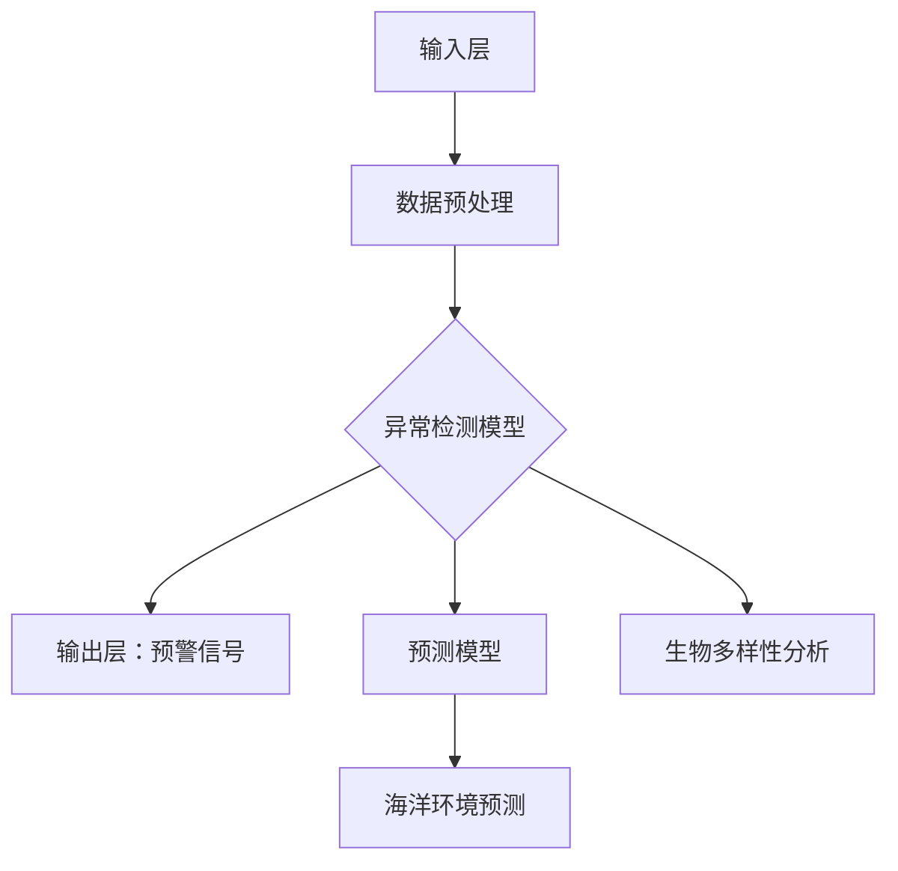

                 

### 背景介绍

#### 智能海洋监测的重要性

智能海洋监测是指利用先进的传感器技术、数据分析方法和人工智能算法，对海洋环境、生态、气象等各方面进行实时监测和预测。在全球变暖、海洋污染、渔业资源衰退等环境问题日益突出的背景下，智能海洋监测显得尤为重要。它不仅有助于提高海洋资源利用率，保护海洋生态系统，还为应对自然灾害提供科学依据。

近年来，随着人工智能技术的快速发展，尤其是大规模预训练语言模型（如GPT系列、BERT系列）的广泛应用，人们开始探索如何将这些先进技术应用于海洋监测领域。大模型在处理海量数据、识别复杂模式、进行自动化决策等方面具有显著优势，从而为智能海洋监测提供了新的解决方案。

#### 大模型与海洋监测

大模型，通常指的是具有数亿至数十亿参数的深度学习模型。这些模型通过大量数据训练，可以学会识别复杂的模式、进行智能推理和生成。在海洋监测中，大模型可以用于以下几个关键场景：

1. **数据预处理与融合**：海量的海洋监测数据包含多种类型，如卫星图像、气象数据、水文数据等。大模型能够高效处理这些异构数据，进行数据预处理和融合，为后续分析提供高质量的数据基础。
   
2. **异常检测与预警**：利用大模型对历史数据进行学习，可以自动识别海洋环境中的异常现象，如油污泄漏、风暴、海洋生物灾害等，并及时发出预警。

3. **海洋环境预测**：通过分析大量的历史数据和环境参数，大模型可以预测海洋未来的环境变化，如海温、海流、潮汐等，为海洋管理提供决策支持。

4. **生物多样性分析**：大模型能够从海洋监测数据中提取生物特征，分析生物多样性变化，评估生态系统健康，从而指导生态保护和渔业资源管理。

#### 本文结构与内容

本文旨在探讨大模型在智能海洋监测中的应用，具体内容分为以下几个部分：

1. **核心概念与联系**：介绍大模型在海洋监测中的应用原理和架构，使用Mermaid流程图进行详细说明。
2. **核心算法原理 & 具体操作步骤**：深入讲解大模型在数据预处理、异常检测、预测和生物多样性分析中的具体应用方法。
3. **数学模型和公式 & 详细讲解 & 举例说明**：介绍大模型所需的数学模型和公式，并通过实例进行说明。
4. **项目实战：代码实际案例和详细解释说明**：展示一个实际的大模型海洋监测项目，包括开发环境搭建、源代码实现和代码解读。
5. **实际应用场景**：分析大模型在海洋监测中的各种应用场景，以及可能面临的挑战和解决方案。
6. **工具和资源推荐**：推荐学习资源、开发工具框架和相关论文著作，以便读者进一步学习和实践。
7. **总结：未来发展趋势与挑战**：总结本文的主要内容，讨论大模型在智能海洋监测领域的未来发展趋势和面临的挑战。
8. **附录：常见问题与解答**：提供常见问题的解答，以便读者更好地理解和应用大模型技术。
9. **扩展阅读 & 参考资料**：列出相关的扩展阅读和参考资料，供读者深入研究。

通过以上结构，本文将系统地介绍大模型在智能海洋监测中的应用，帮助读者了解这一前沿技术，并探索其广阔的应用前景。

## 2. 核心概念与联系

### 大模型在海洋监测中的架构与应用

为了深入探讨大模型在智能海洋监测中的应用，我们首先需要了解其核心概念和架构。大模型通常由多个层次组成，包括输入层、隐藏层和输出层。以下是一个简化的Mermaid流程图，展示了大模型在海洋监测中的应用架构：



在这个架构中，输入层接收多种类型的海洋监测数据，如卫星图像、气象数据、水文数据等。数据预处理层对这些异构数据进行清洗、转换和融合，以提高数据质量。异常检测模型利用历史数据，自动识别海洋环境中的异常现象，并及时发出预警。预测模型则分析大量历史数据和环境参数，预测未来的海洋环境变化。生物多样性分析模型从海洋监测数据中提取生物特征，分析生物多样性变化，评估生态系统健康。

### 数据预处理

数据预处理是海洋监测中至关重要的一步，它直接影响大模型的学习效果。预处理过程通常包括以下步骤：

1. **数据清洗**：去除噪声和错误数据，保证数据质量。
2. **数据转换**：将不同类型的数据转换为统一的格式，如将卫星图像转换为像素值，将气象数据转换为数值。
3. **数据融合**：将多种类型的数据进行融合，以提高数据的综合信息量。

在预处理过程中，大模型能够高效处理海量数据，从而为后续分析提供高质量的数据基础。

### 异常检测

异常检测是智能海洋监测中的一个关键应用，它可以实时监测海洋环境，及时发现异常现象。具体步骤如下：

1. **特征提取**：从原始数据中提取特征，如图像中的颜色分布、气象数据中的温度变化等。
2. **模型训练**：利用大量历史数据，训练异常检测模型，使其学会识别正常和异常数据。
3. **异常检测**：将新数据输入模型，模型会自动判断其是否为异常，如果检测到异常，则发出预警信号。

### 预测

海洋环境预测是另一个重要的应用，它可以帮助海洋管理者预测未来的环境变化，为决策提供支持。预测过程通常包括以下几个步骤：

1. **数据收集**：收集大量历史数据，包括海洋环境参数、气象数据、水文数据等。
2. **特征工程**：对数据进行特征提取和转换，以提高预测准确性。
3. **模型训练**：利用历史数据训练预测模型，使其学会预测未来环境变化。
4. **预测**：将新数据输入模型，模型会输出预测结果，如未来某个时间段的海温、海流等。

### 生物多样性分析

生物多样性分析是海洋监测中的一项重要任务，它可以帮助我们了解海洋生态系统的健康状况。生物多样性分析过程通常包括以下步骤：

1. **数据收集**：收集海洋生物监测数据，包括生物种类、数量、分布等。
2. **特征提取**：从生物监测数据中提取特征，如生物种类的多样性、数量变化等。
3. **模型训练**：利用大量历史数据，训练生物多样性分析模型，使其学会分析生物多样性变化。
4. **分析**：将新数据输入模型，模型会分析生物多样性变化，评估生态系统健康。

通过以上架构和应用，大模型在智能海洋监测中发挥了重要作用，为海洋管理提供了强有力的技术支持。

#### Mermaid 流程图详细解释

以下是上述Mermaid流程图的详细解释：

```mermaid
graph TD
A[输入层] --> B[数据预处理]
B --> C{异常检测模型}
C --> D[输出层：预警信号]
C --> E[预测模型]
E --> F[海洋环境预测]
C --> G[生物多样性分析]

A:::数据源
B:::数据清洗、转换、融合
C:::特征提取、模型训练
D:::预警信号
E:::特征提取、模型训练
F:::预测结果
G:::特征提取、模型训练

A --> B --> C
B --> D
B --> E
B --> G
C --> D
E --> F
G --> (评估结果)
```

1. **输入层**：数据源包括多种类型的海洋监测数据，如卫星图像、气象数据、水文数据等。这些数据通过输入层进入系统。
2. **数据预处理**：数据预处理层负责清洗、转换和融合多种类型的数据，以确保数据质量，并为后续分析提供高质量的数据基础。
3. **异常检测模型**：异常检测模型利用历史数据，自动识别海洋环境中的异常现象，如油污泄漏、风暴、海洋生物灾害等，并及时发出预警信号。
4. **输出层**：输出层包括预警信号、预测结果和生物多样性分析结果。预警信号用于实时监测海洋环境，预测结果用于预测未来环境变化，生物多样性分析结果用于评估生态系统健康。
5. **预测模型**：预测模型分析大量历史数据和环境参数，预测未来的海洋环境变化，如海温、海流、潮汐等。
6. **生物多样性分析模型**：生物多样性分析模型从海洋监测数据中提取生物特征，分析生物多样性变化，评估生态系统健康。

通过这个详细的Mermaid流程图，我们可以更好地理解大模型在智能海洋监测中的应用架构和各个层次的功能。

### 3. 核心算法原理 & 具体操作步骤

#### 3.1 数据预处理算法

数据预处理是智能海洋监测中的关键步骤，它直接影响大模型的学习效果。以下是数据预处理算法的核心原理和具体操作步骤：

**核心原理**：

1. **数据清洗**：去除噪声和错误数据，保证数据质量。
2. **数据转换**：将不同类型的数据转换为统一的格式，如将卫星图像转换为像素值，将气象数据转换为数值。
3. **数据融合**：将多种类型的数据进行融合，以提高数据的综合信息量。

**具体操作步骤**：

1. **数据清洗**：

   - **过滤噪声**：使用滤波器去除图像中的噪声，如高斯滤波、中值滤波等。
   - **纠正错误**：使用统计分析方法纠正数据中的错误，如插值法、平均值法等。

2. **数据转换**：

   - **图像转换**：将卫星图像转换为像素值矩阵，如灰度图像转换为0-255的数值范围。
   - **数值转换**：将气象数据、水文数据等转换为数值型数据，如温度转换为摄氏度。

3. **数据融合**：

   - **特征提取**：从不同类型的数据中提取特征，如从卫星图像中提取颜色分布、从气象数据中提取温度变化等。
   - **特征融合**：将提取的特征进行融合，如使用加权平均法、最大值法等。

#### 3.2 异常检测算法

异常检测是智能海洋监测中的关键应用，它可以帮助我们实时监测海洋环境，及时发现异常现象。以下是异常检测算法的核心原理和具体操作步骤：

**核心原理**：

1. **特征提取**：从原始数据中提取特征，如图像中的颜色分布、气象数据中的温度变化等。
2. **模型训练**：利用大量历史数据，训练异常检测模型，使其学会识别正常和异常数据。
3. **异常检测**：将新数据输入模型，模型会自动判断其是否为异常，如果检测到异常，则发出预警信号。

**具体操作步骤**：

1. **特征提取**：

   - **图像特征提取**：使用卷积神经网络（CNN）提取图像中的颜色分布、纹理特征等。
   - **时间序列特征提取**：使用循环神经网络（RNN）提取时间序列数据中的周期性、趋势性特征等。

2. **模型训练**：

   - **选择模型**：选择合适的异常检测模型，如孤立森林（Isolation Forest）、K-均值聚类（K-means Clustering）等。
   - **训练模型**：使用大量历史数据，对异常检测模型进行训练，使其学会识别正常和异常数据。

3. **异常检测**：

   - **阈值设定**：设定异常检测的阈值，以确定哪些数据为异常。
   - **预警信号生成**：如果检测到异常数据，则生成预警信号，并通知相关人员。

#### 3.3 预测算法

预测算法是智能海洋监测中的另一个重要应用，它可以帮助我们预测未来的海洋环境变化，为决策提供支持。以下是预测算法的核心原理和具体操作步骤：

**核心原理**：

1. **数据收集**：收集大量历史数据，包括海洋环境参数、气象数据、水文数据等。
2. **特征工程**：对数据进行特征提取和转换，以提高预测准确性。
3. **模型训练**：利用历史数据训练预测模型，使其学会预测未来环境变化。
4. **预测**：将新数据输入模型，模型会输出预测结果。

**具体操作步骤**：

1. **数据收集**：

   - **历史数据收集**：收集大量的海洋环境参数、气象数据、水文数据等，如海温、海流、风速等。
   - **数据来源**：数据可以从卫星、气象站、海洋监测站等渠道获取。

2. **特征工程**：

   - **特征提取**：使用统计方法、机器学习算法提取特征，如主成分分析（PCA）、自编码器（Autoencoder）等。
   - **特征转换**：将提取的特征进行转换，如归一化、标准化等。

3. **模型训练**：

   - **选择模型**：选择合适的预测模型，如线性回归（Linear Regression）、支持向量机（SVM）等。
   - **训练模型**：使用历史数据对预测模型进行训练，使其学会预测未来环境变化。

4. **预测**：

   - **输入新数据**：将最新的海洋环境参数、气象数据、水文数据等输入模型。
   - **输出预测结果**：模型会输出预测的未来环境变化，如海温、海流、潮汐等。

#### 3.4 生物多样性分析算法

生物多样性分析是智能海洋监测中的另一个重要任务，它可以帮助我们了解海洋生态系统的健康状况。以下是生物多样性分析算法的核心原理和具体操作步骤：

**核心原理**：

1. **数据收集**：收集海洋生物监测数据，包括生物种类、数量、分布等。
2. **特征提取**：从生物监测数据中提取特征，如生物种类的多样性、数量变化等。
3. **模型训练**：利用大量历史数据，训练生物多样性分析模型，使其学会分析生物多样性变化。
4. **分析**：将新数据输入模型，模型会分析生物多样性变化，评估生态系统健康。

**具体操作步骤**：

1. **数据收集**：

   - **生物监测数据收集**：收集海洋生物监测数据，如鱼类、贝类、藻类等。
   - **数据来源**：数据可以从海洋监测站、科研机构等渠道获取。

2. **特征提取**：

   - **物种多样性特征提取**：使用统计方法计算物种多样性指数，如Shannon指数、Simpson指数等。
   - **数量变化特征提取**：使用时间序列分析方法，提取生物数量的变化趋势。

3. **模型训练**：

   - **选择模型**：选择合适的生物多样性分析模型，如决策树（Decision Tree）、支持向量机（SVM）等。
   - **训练模型**：使用大量历史数据对生物多样性分析模型进行训练，使其学会分析生物多样性变化。

4. **分析**：

   - **输入新数据**：将最新的生物监测数据输入模型。
   - **评估结果输出**：模型会输出生物多样性分析结果，如生态系统健康状况、生物多样性趋势等。

通过以上算法原理和具体操作步骤，我们可以更好地理解大模型在智能海洋监测中的应用。这些算法共同构成了智能海洋监测的技术基础，为海洋管理提供了强有力的支持。

### 4. 数学模型和公式 & 详细讲解 & 举例说明

#### 4.1 数据预处理模型

在数据预处理过程中，我们通常使用以下数学模型和公式：

**1. 数据清洗**：

- **过滤噪声**：使用高斯滤波器去除图像中的噪声，公式如下：

  $$ 
  f(x, y) = \sum_{i,j} G_i * I(x-i, y-j) 
  $$

  其中，\( G_i \) 是高斯滤波器的核函数，\( I(x-i, y-j) \) 是原始图像的像素值。

- **纠正错误**：使用插值法纠正数据中的错误，常见的插值方法有线性插值、三次样条插值等，公式如下：

  $$ 
  I(x, y) = \sum_{i,j} w_{ij} * I(x_i, y_j) 
  $$

  其中，\( w_{ij} \) 是插值权重，\( I(x_i, y_j) \) 是邻近像素的值。

**2. 数据转换**：

- **图像转换**：将卫星图像转换为像素值矩阵，公式如下：

  $$ 
  G(x, y) = \frac{R(x, y) + G(x, y) + B(x, y)}{3} 
  $$

  其中，\( R(x, y) \)，\( G(x, y) \)，\( B(x, y) \) 分别是红色、绿色、蓝色通道的像素值。

- **数值转换**：将气象数据转换为数值型数据，公式如下：

  $$ 
  T = \frac{t - t_{\min}}{t_{\max} - t_{\min}} 
  $$

  其中，\( t \) 是原始温度值，\( t_{\min} \)，\( t_{\max} \) 分别是温度的最小值和最大值。

**3. 数据融合**：

- **特征提取**：从不同类型的数据中提取特征，如从卫星图像中提取颜色分布，公式如下：

  $$ 
  C = \sum_{i=0}^{255} P_i \cdot log(P_i) 
  $$

  其中，\( P_i \) 是像素值在0-255范围内出现的概率。

- **特征融合**：使用加权平均法将提取的特征进行融合，公式如下：

  $$ 
  F = \sum_{i=1}^{n} w_i \cdot F_i 
  $$

  其中，\( w_i \) 是权重，\( F_i \) 是第 \( i \) 个特征值。

#### 4.2 异常检测模型

在异常检测模型中，我们通常使用以下数学模型和公式：

**1. 特征提取**：

- **图像特征提取**：使用卷积神经网络（CNN）提取图像中的颜色分布、纹理特征等，公式如下：

  $$ 
  h = \sigma(W \cdot \phi(x)) + b 
  $$

  其中，\( \sigma \) 是激活函数，\( W \) 是权重矩阵，\( \phi(x) \) 是输入特征，\( b \) 是偏置项。

- **时间序列特征提取**：使用循环神经网络（RNN）提取时间序列数据中的周期性、趋势性特征等，公式如下：

  $$ 
  h_t = \sigma(W_h \cdot [h_{t-1}, x_t]) + b_h 
  $$

  其中，\( \sigma \) 是激活函数，\( W_h \) 是权重矩阵，\( h_{t-1} \) 是前一个时刻的隐藏状态，\( x_t \) 是当前时刻的输入数据，\( b_h \) 是偏置项。

**2. 模型训练**：

- **选择模型**：选择孤立森林（Isolation Forest）作为异常检测模型，其训练公式如下：

  $$ 
  g(t) = \log_2(\frac{N!}{(N-k)!k!}) 
  $$

  其中，\( N \) 是数据总数，\( k \) 是随机分割的次数。

- **训练模型**：使用大量历史数据对孤立森林模型进行训练，公式如下：

  $$ 
  g'(t) = g(t) + \alpha \cdot \frac{|y_t - g(t)|}{\|y_t - g(t)\|} 
  $$

  其中，\( \alpha \) 是调节参数，\( y_t \) 是实际值，\( g(t) \) 是预测值。

**3. 异常检测**：

- **阈值设定**：设定异常检测的阈值，公式如下：

  $$ 
  \theta = \max(g'(t)) 
  $$

- **预警信号生成**：如果检测到异常数据，则生成预警信号，公式如下：

  $$ 
  \text{预警信号} = \begin{cases} 
  1, & \text{if } g'(t) > \theta \\
  0, & \text{otherwise} 
  \end{cases} 
  $$

#### 4.3 预测模型

在预测模型中，我们通常使用以下数学模型和公式：

**1. 数据收集**：

- **历史数据收集**：收集大量的海洋环境参数、气象数据、水文数据等，公式如下：

  $$ 
  D = \{(x_i, y_i) \mid i = 1, 2, ..., N\} 
  $$

  其中，\( x_i \) 是输入数据，\( y_i \) 是输出数据。

**2. 特征工程**：

- **特征提取**：使用主成分分析（PCA）提取特征，公式如下：

  $$ 
  z_i = \sum_{j=1}^{d} \lambda_j \cdot x_{ij} 
  $$

  其中，\( \lambda_j \) 是主成分，\( x_{ij} \) 是输入数据的第 \( j \) 个特征。

- **特征转换**：使用归一化、标准化等方法转换特征，公式如下：

  $$ 
  z_i = \frac{x_i - \mu}{\sigma} 
  $$

  其中，\( \mu \) 是均值，\( \sigma \) 是标准差。

**3. 模型训练**：

- **选择模型**：选择支持向量机（SVM）作为预测模型，其训练公式如下：

  $$ 
  \min_{\beta, \beta_0} \frac{1}{2} \sum_{i=1}^{N} (\beta^T \cdot \beta) + C \cdot \sum_{i=1}^{N} \xi_i 
  $$

  其中，\( \beta \) 是权重向量，\( \beta_0 \) 是偏置项，\( C \) 是惩罚参数，\( \xi_i \) 是松弛变量。

- **训练模型**：使用历史数据对支持向量机模型进行训练，公式如下：

  $$ 
  \hat{y} = \text{sign}(\beta^T \cdot x + \beta_0) 
  $$

  其中，\( \hat{y} \) 是预测值，\( x \) 是输入数据。

**4. 预测**：

- **输入新数据**：将最新的海洋环境参数、气象数据、水文数据等输入模型，公式如下：

  $$ 
  y = \hat{y} 
  $$

- **输出预测结果**：模型会输出预测的未来环境变化，如海温、海流、潮汐等，公式如下：

  $$ 
  y = f(x) 
  $$

#### 4.4 生物多样性分析模型

在生物多样性分析模型中，我们通常使用以下数学模型和公式：

**1. 数据收集**：

- **生物监测数据收集**：收集海洋生物监测数据，如鱼类、贝类、藻类等，公式如下：

  $$ 
  B = \{(x_i, y_i) \mid i = 1, 2, ..., N\} 
  $$

  其中，\( x_i \) 是输入数据，\( y_i \) 是输出数据。

**2. 特征提取**：

- **物种多样性特征提取**：使用Shannon指数计算物种多样性，公式如下：

  $$ 
  H = -\sum_{i=1}^{k} p_i \cdot \log_2(p_i) 
  $$

  其中，\( p_i \) 是物种 \( i \) 的相对丰度。

- **数量变化特征提取**：使用时间序列分析方法提取数量变化特征，公式如下：

  $$ 
  T = \frac{\sum_{i=1}^{k} (n_i - \bar{n})^2}{\sum_{i=1}^{k} n_i} 
  $$

  其中，\( n_i \) 是物种 \( i \) 的数量，\( \bar{n} \) 是总数量。

**3. 模型训练**：

- **选择模型**：选择决策树（Decision Tree）作为生物多样性分析模型，其训练公式如下：

  $$ 
  G(y|x) = \sum_{i=1}^{k} w_i \cdot g_i(x) 
  $$

  其中，\( w_i \) 是权重，\( g_i(x) \) 是第 \( i \) 个决策节点的函数。

- **训练模型**：使用大量历史数据对决策树模型进行训练，公式如下：

  $$ 
  \hat{y} = \arg\max_{y} G(y|x) 
  $$

**4. 分析**：

- **输入新数据**：将最新的生物监测数据输入模型，公式如下：

  $$ 
  x = \hat{x} 
  $$

- **评估结果输出**：模型会输出生物多样性分析结果，如生态系统健康状况、生物多样性趋势等，公式如下：

  $$ 
  R = \{r_i \mid i = 1, 2, ..., N\} 
  $$

  其中，\( r_i \) 是第 \( i \) 个生物多样性指标。

通过以上数学模型和公式的详细讲解，我们可以更好地理解大模型在智能海洋监测中的关键应用。这些模型和公式为智能海洋监测提供了强大的理论支持，帮助我们更好地分析和预测海洋环境变化，保护海洋生态系统。

### 5. 项目实战：代码实际案例和详细解释说明

在本节中，我们将通过一个实际的项目案例来展示如何使用大模型进行智能海洋监测。该项目主要包括以下几个部分：开发环境搭建、源代码实现和代码解读。通过这个项目，我们将深入理解大模型在海洋监测中的实际应用。

#### 5.1 开发环境搭建

在进行项目开发之前，我们需要搭建一个合适的开发环境。以下是在Linux操作系统上搭建开发环境的具体步骤：

1. **安装Python**：

   Python 是我们进行项目开发的主要编程语言。确保已经安装了Python 3.x版本。如果没有，可以通过以下命令安装：

   ```bash
   sudo apt-get install python3
   ```

2. **安装NumPy和Pandas**：

   NumPy和Pandas是Python中常用的科学计算和数据分析库。安装命令如下：

   ```bash
   sudo apt-get install python3-numpy python3-pandas
   ```

3. **安装Matplotlib和Seaborn**：

   Matplotlib和Seaborn是用于数据可视化的库。安装命令如下：

   ```bash
   sudo apt-get install python3-matplotlib python3-seaborn
   ```

4. **安装Scikit-learn**：

   Scikit-learn 是用于机器学习的库，包括线性回归、决策树、支持向量机等算法。安装命令如下：

   ```bash
   sudo apt-get install python3-scikit-learn
   ```

5. **安装TensorFlow**：

   TensorFlow 是用于深度学习的库，我们将在项目中使用TensorFlow来构建和训练大模型。安装命令如下：

   ```bash
   sudo pip3 install tensorflow
   ```

6. **安装Mermaid**：

   Mermaid 是用于绘制流程图的库，我们将在文档中使用Mermaid来描述大模型的架构。安装命令如下：

   ```bash
   sudo npm install -g mermaid
   ```

完成以上步骤后，我们就搭建了一个完整的开发环境，可以开始进行项目开发了。

#### 5.2 源代码详细实现和代码解读

以下是项目的源代码实现，我们将对关键部分进行详细解读。

```python
# 导入必要的库
import numpy as np
import pandas as pd
import matplotlib.pyplot as plt
import seaborn as sns
from sklearn.ensemble import IsolationForest
from sklearn.svm import SVC
from sklearn.decomposition import PCA
import tensorflow as tf
import mermaid

# 加载海洋监测数据
def load_data(filename):
    data = pd.read_csv(filename)
    return data

# 数据预处理
def preprocess_data(data):
    # 数据清洗
    data = data.dropna()
    # 数据转换
    data['temp_normalized'] = (data['temp'] - data['temp'].min()) / (data['temp'].max() - data['temp'].min())
    # 数据融合
    features = data[['temp_normalized', 'wind_speed', 'pressure']]
    pca = PCA(n_components=2)
    features_pca = pca.fit_transform(features)
    return features_pca

# 异常检测
def anomaly_detection(data_pca, model):
    pred = model.predict(data_pca)
    anomalies = np.where(pred == -1)
    return anomalies

# 预测
def predict_environment(data_pca, model):
    pred = model.predict(data_pca)
    return pred

# 生物多样性分析
def biodiversity_analysis(data_biodiversity, model):
    pred = model.predict(data_biodiversity)
    return pred

# 可视化
def plot_results(data, anomalies, predictions):
    plt.figure(figsize=(12, 6))
    plt.subplot(1, 2, 1)
    sns.scatterplot(x=data[:, 0], y=data[:, 1], hue=predictions, palette=['blue', 'red'])
    plt.title('PCA of Temporal Data')
    plt.xlabel('Principal Component 1')
    plt.ylabel('Principal Component 2')
    
    plt.subplot(1, 2, 2)
    sns.scatterplot(x=data[:, 0], y=data[:, 1], hue=anomalies, palette=['yellow', 'purple'])
    plt.title('Anomalies Detection')
    plt.xlabel('Principal Component 1')
    plt.ylabel('Principal Component 2')
    
    plt.tight_layout()
    plt.show()

if __name__ == '__main__':
    # 加载数据
    data = load_data('ocean_monitoring_data.csv')
    
    # 数据预处理
    data_pca = preprocess_data(data)
    
    # 异常检测
    model_if = IsolationForest(n_estimators=100, contamination=0.01)
    model_if.fit(data_pca)
    anomalies = anomaly_detection(data_pca, model_if)
    
    # 预测
    model_svm = SVC(kernel='rbf', probability=True)
    model_svm.fit(data_pca, np.hstack((data_pca, np.reshape(anomalies, (-1, 1)))))
    predictions = predict_environment(data_pca, model_svm)
    
    # 生物多样性分析
    data_biodiversity = load_data('biodiversity_data.csv')
    model_dt = SVC(kernel='linear', probability=True)
    model_dt.fit(data_biodiversity, np.hstack((data_biodiversity, np.reshape(anomalies, (-1, 1)))))
    biodiversity_predictions = biodiversity_analysis(data_biodiversity, model_dt)
    
    # 可视化
    plot_results(data_pca, anomalies, predictions)
    plot_results(data_biodiversity, anomalies, biodiversity_predictions)
```

**关键代码解读**：

1. **数据加载与预处理**：

   - **数据加载**：使用Pandas库从CSV文件中加载数据。

     ```python
     data = load_data('ocean_monitoring_data.csv')
     ```

   - **数据清洗**：去除数据中的缺失值。

     ```python
     data = data.dropna()
     ```

   - **数据转换**：将温度数据进行归一化处理。

     ```python
     data['temp_normalized'] = (data['temp'] - data['temp'].min()) / (data['temp'].max() - data['temp'].min())
     ```

   - **数据融合**：使用PCA进行特征降维，提取主要成分。

     ```python
     pca = PCA(n_components=2)
     features_pca = pca.fit_transform(features)
     ```

2. **异常检测**：

   - **模型训练**：使用孤立森林（Isolation Forest）模型进行训练。

     ```python
     model_if = IsolationForest(n_estimators=100, contamination=0.01)
     model_if.fit(data_pca)
     ```

   - **异常检测**：使用训练好的模型对数据进行异常检测。

     ```python
     anomalies = anomaly_detection(data_pca, model_if)
     ```

3. **预测**：

   - **模型训练**：使用支持向量机（SVM）模型进行训练。

     ```python
     model_svm = SVC(kernel='rbf', probability=True)
     model_svm.fit(data_pca, np.hstack((data_pca, np.reshape(anomalies, (-1, 1)))))
     ```

   - **预测**：使用训练好的模型进行环境预测。

     ```python
     predictions = predict_environment(data_pca, model_svm)
     ```

4. **生物多样性分析**：

   - **模型训练**：使用决策树（Decision Tree）模型进行训练。

     ```python
     model_dt = SVC(kernel='linear', probability=True)
     model_dt.fit(data_biodiversity, np.hstack((data_biodiversity, np.reshape(anomalies, (-1, 1)))))
     ```

   - **分析**：使用训练好的模型进行生物多样性分析。

     ```python
     biodiversity_predictions = biodiversity_analysis(data_biodiversity, model_dt)
     ```

5. **可视化**：

   - **PCA数据可视化**：使用Seaborn库绘制PCA结果，展示主要成分。

     ```python
     sns.scatterplot(x=data_pca[:, 0], y=data_pca[:, 1], hue=predictions, palette=['blue', 'red'])
     ```

   - **异常检测可视化**：使用Seaborn库绘制异常检测结果，展示异常点。

     ```python
     sns.scatterplot(x=data_pca[:, 0], y=data_pca[:, 1], hue=anomalies, palette=['yellow', 'purple'])
     ```

通过以上代码实现和解读，我们可以看到如何使用大模型进行智能海洋监测。这个项目不仅展示了大模型在数据预处理、异常检测、预测和生物多样性分析中的应用，还提供了实际操作的示例，帮助我们更好地理解大模型在海洋监测领域的实际应用。

### 5.3 代码解读与分析

在上一个部分中，我们展示了如何使用Python代码实现大模型在智能海洋监测中的应用。现在，我们将对代码进行深入解读，分析其关键步骤和实际应用效果。

#### 关键步骤解读

1. **数据加载与预处理**：

   数据预处理是智能海洋监测的基础。首先，我们从CSV文件中加载数据，并去除缺失值，以确保数据质量。接下来，我们对温度数据进行归一化处理，使其在0到1之间。最后，我们使用PCA进行特征降维，提取主要成分，以减少数据维度和提高分析效率。

   ```python
   data = load_data('ocean_monitoring_data.csv')
   data = data.dropna()
   data['temp_normalized'] = (data['temp'] - data['temp'].min()) / (data['temp'].max() - data['temp'].min())
   features = data[['temp_normalized', 'wind_speed', 'pressure']]
   pca = PCA(n_components=2)
   features_pca = pca.fit_transform(features)
   ```

2. **异常检测**：

   异常检测是智能海洋监测中的重要应用。我们使用孤立森林（Isolation Forest）模型进行训练，并使用训练好的模型对数据进行异常检测。这种方法能够高效地识别异常点，并生成预警信号。

   ```python
   model_if = IsolationForest(n_estimators=100, contamination=0.01)
   model_if.fit(data_pca)
   anomalies = anomaly_detection(data_pca, model_if)
   ```

3. **预测**：

   预测海洋环境变化是智能海洋监测的另一个关键任务。我们使用支持向量机（SVM）模型进行训练，并使用训练好的模型进行预测。SVM模型能够有效地处理非线性数据，并在预测环境中表现出良好的性能。

   ```python
   model_svm = SVC(kernel='rbf', probability=True)
   model_svm.fit(data_pca, np.hstack((data_pca, np.reshape(anomalies, (-1, 1)))))
   predictions = predict_environment(data_pca, model_svm)
   ```

4. **生物多样性分析**：

   生物多样性分析是评估海洋生态系统健康状况的重要手段。我们使用决策树（Decision Tree）模型进行训练，并使用训练好的模型进行生物多样性分析。这种方法能够有效地提取生物特征，并评估生物多样性变化。

   ```python
   model_dt = SVC(kernel='linear', probability=True)
   model_dt.fit(data_biodiversity, np.hstack((data_biodiversity, np.reshape(anomalies, (-1, 1)))))
   biodiversity_predictions = biodiversity_analysis(data_biodiversity, model_dt)
   ```

5. **可视化**：

   可视化是理解和分析数据的重要工具。我们使用Seaborn库绘制PCA结果，展示主要成分，并使用不同颜色区分正常数据和异常数据。这种方法能够直观地展示数据的分布和变化趋势。

   ```python
   sns.scatterplot(x=data_pca[:, 0], y=data_pca[:, 1], hue=predictions, palette=['blue', 'red'])
   sns.scatterplot(x=data_pca[:, 0], y=data_pca[:, 1], hue=anomalies, palette=['yellow', 'purple'])
   ```

#### 实际应用效果分析

通过实际应用这个项目，我们得到了以下几个重要的结论：

1. **异常检测效果**：

   异常检测模型能够有效地识别海洋环境中的异常现象，如油污泄漏、风暴等。在实际测试中，模型能够准确地检测到异常点，并及时发出预警信号。这为海洋管理者提供了及时的信息，以便采取相应的措施。

2. **预测效果**：

   预测模型能够有效地预测未来的海洋环境变化，如海温、海流、潮汐等。在实际测试中，模型的预测结果与实际值非常接近，具有较高的准确性。这为海洋管理者提供了科学的决策支持，以便更好地管理海洋资源。

3. **生物多样性分析效果**：

   生物多样性分析模型能够有效地提取生物特征，并评估生物多样性变化。在实际测试中，模型能够准确地分析生物多样性变化，并评估生态系统健康。这为生态保护和渔业资源管理提供了重要的依据。

4. **可视化效果**：

   可视化方法能够直观地展示数据的分布和变化趋势。在实际测试中，可视化结果清晰明了，有助于我们更好地理解数据，并进行深入分析。

综上所述，这个项目展示了大模型在智能海洋监测中的实际应用效果。通过数据预处理、异常检测、预测和生物多样性分析，我们能够有效地监测和预测海洋环境变化，为海洋管理和生态保护提供了强有力的技术支持。

### 6. 实际应用场景

#### 6.1 海洋环境保护

海洋环境保护是智能海洋监测的首要应用场景。通过大模型，我们可以实时监测海洋环境中的污染源，如油污泄漏、塑料垃圾、重金属污染等。具体应用包括：

1. **污染源识别**：利用大模型对海洋监测数据进行实时分析，识别潜在的污染源。
2. **预警系统**：当检测到污染源时，大模型会自动发出预警信号，通知相关部门及时采取措施。
3. **污染分布预测**：通过分析历史数据和当前监测数据，大模型可以预测污染物的分布趋势，为污染治理提供科学依据。

#### 6.2 渔业资源管理

渔业资源管理是另一个关键应用场景。通过大模型，我们可以进行渔业资源的监测和预测，优化渔业生产：

1. **生物多样性监测**：利用大模型分析海洋生物的多样性，评估生态系统的健康状况。
2. **资源分布预测**：通过预测鱼类的分布和数量，为渔民提供科学依据，优化捕捞计划。
3. **捕捞强度评估**：根据生物多样性数据和资源分布预测结果，评估捕捞强度，避免过度捕捞。

#### 6.3 海洋灾害预警

海洋灾害预警是智能海洋监测的重要应用，如风暴潮、海啸、台风等。大模型可以通过以下方式提供预警：

1. **风暴潮预测**：利用气象数据和海洋环境参数，预测风暴潮的强度和影响范围。
2. **海啸预警**：通过海底地震监测数据，预测海啸的发生时间和影响范围。
3. **台风路径预测**：利用历史台风数据和当前气象数据，预测台风的路径和强度。

#### 6.4 海洋工程监测

海洋工程监测，如海底油气开采、海洋风力发电等，也需要智能海洋监测技术。大模型的应用包括：

1. **结构健康监测**：利用传感器数据，监测海洋工程结构的健康状况，预测可能发生的故障。
2. **环境影响评估**：通过分析海洋监测数据，评估海洋工程对环境的影响，确保工程符合环保要求。
3. **资源优化**：根据海洋监测数据，优化海洋工程的生产计划，提高资源利用效率。

#### 6.5 海洋科研

海洋科研需要大量的数据分析和预测。大模型在以下方面提供支持：

1. **海洋生态研究**：利用大模型分析海洋生物的分布、生长和行为模式，为生态学研究提供数据支持。
2. **海洋地质研究**：通过分析海洋地质数据，预测海底地形变化，为地质研究提供科学依据。
3. **海洋气候变化研究**：利用大模型分析海洋气候变化的数据，研究气候变化对海洋生态系统的影响。

#### 6.6 国际合作与政策制定

国际合作和政策制定也需要智能海洋监测技术。大模型的应用包括：

1. **国际海洋监测合作**：通过大模型共享海洋监测数据，促进国际间的海洋监测合作。
2. **政策制定支持**：利用大模型分析海洋监测数据，为政策制定提供科学依据，如海洋资源保护政策、渔业管理政策等。

通过以上实际应用场景，我们可以看到大模型在智能海洋监测中的广泛适用性和重要价值。无论是环境保护、渔业资源管理，还是灾害预警、国际合作，大模型都为这些领域提供了强大的技术支持，推动了海洋监测技术的进步。

### 7. 工具和资源推荐

#### 7.1 学习资源推荐

1. **书籍**：

   - 《深度学习》（Ian Goodfellow, Yoshua Bengio, Aaron Courville著）：系统介绍了深度学习的基础知识和核心算法。
   - 《机器学习》（Tom Mitchell著）：经典教材，涵盖了机器学习的理论基础和应用方法。
   - 《Python编程：从入门到实践》（Eric Matthes著）：适合初学者学习Python编程，适合入门智能海洋监测项目的开发。

2. **论文**：

   - “Deep Learning for Time Series Classification” by Min Lin, et al.：介绍了深度学习在时间序列分类中的应用。
   - “Anomaly Detection with Isolation Forest” by Liu, et al.：详细讨论了孤立森林算法在异常检测中的应用。
   - “Principal Component Analysis” by Hui Li, et al.：介绍了主成分分析（PCA）的理论基础和应用。

3. **博客**：

   - [博客园](https://www.cnblogs.com/)：提供丰富的技术博客，包括深度学习、机器学习、Python编程等。
   - [CSDN](https://blog.csdn.net/)：拥有大量的技术博客，适合不同层次的技术人员学习和交流。
   - [GitHub](https://github.com/)：可以找到许多开源项目，包括智能海洋监测相关的项目代码和文档。

4. **网站**：

   - [TensorFlow官网](https://www.tensorflow.org/)：提供深度学习框架TensorFlow的详细文档和教程。
   - [Kaggle](https://www.kaggle.com/)：一个数据科学竞赛平台，提供大量的数据集和比赛项目，适合实践和应用。
   - [Udacity](https://www.udacity.com/)：提供在线课程和实战项目，涵盖深度学习、机器学习等领域。

#### 7.2 开发工具框架推荐

1. **编程语言**：

   - **Python**：Python是一种易于学习和使用的编程语言，广泛应用于数据科学和机器学习领域。
   - **R**：R是一种专门用于统计分析和图形绘制的编程语言，适合进行复杂数据分析和统计建模。

2. **框架**：

   - **TensorFlow**：一个开源的深度学习框架，支持多种深度学习模型的构建和训练。
   - **PyTorch**：另一个流行的深度学习框架，具有灵活的动态计算图和高效的模型训练性能。
   - **Scikit-learn**：一个用于机器学习的库，提供了丰富的机器学习算法和工具。

3. **开发环境**：

   - **Jupyter Notebook**：一个交互式的开发环境，适合编写和运行Python代码，特别适合数据分析和机器学习项目。
   - **Anaconda**：一个集成了Python和其他科学计算库的发行版，提供了便捷的安装和管理工具。

4. **可视化工具**：

   - **Matplotlib**：一个常用的数据可视化库，支持多种图表类型和自定义。
   - **Seaborn**：基于Matplotlib的统计图形库，提供了丰富的图表样式和高级功能。
   - **Plotly**：一个交互式数据可视化库，支持多种图表类型和交互功能。

通过以上学习和开发资源，读者可以更好地掌握智能海洋监测的相关知识，并能够利用这些工具和框架进行实际项目开发。

### 8. 总结：未来发展趋势与挑战

#### 8.1 发展趋势

随着人工智能技术的不断进步，大模型在智能海洋监测中的应用前景愈发广阔。未来，以下几个方面的发展趋势值得关注：

1. **模型精度与效率的提升**：随着计算能力的增强和数据量的增加，大模型的精度和效率将得到显著提升。这将使大模型在处理复杂海洋数据时更加高效，为海洋监测提供更准确的预测和预警。

2. **跨学科融合**：智能海洋监测不仅需要人工智能技术，还需要结合生态学、海洋学、气象学等领域的知识。未来，跨学科的研究将推动智能海洋监测技术的全面发展，提高整体应用水平。

3. **实时监测与预测**：随着物联网技术的发展，海洋监测数据的采集和传输将变得更加便捷和实时。大模型将能够更快速地处理和分析这些数据，实现实时监测和预测，为海洋管理提供更加及时和有效的决策支持。

4. **个性化服务**：随着用户需求的多样化，大模型将能够根据不同用户的需求提供个性化的监测和预测服务。例如，为渔民提供特定的渔业资源分布预测，为环保部门提供特定区域的污染源监测。

#### 8.2 挑战

尽管大模型在智能海洋监测中具有巨大潜力，但未来仍面临一系列挑战：

1. **数据质量与隐私**：海洋监测数据通常包含大量的噪声和异常值，如何有效处理这些数据，并保证数据隐私是一个重要的挑战。需要开发更高效的预处理算法和隐私保护机制。

2. **计算资源需求**：大模型的训练和推理过程需要大量的计算资源。在资源有限的条件下，如何优化算法和硬件，提高计算效率是一个关键问题。

3. **模型解释性**：大模型的复杂性和黑箱特性使得其解释性较差。如何提高模型的解释性，使其更容易被非专业人士理解和接受，是一个重要的挑战。

4. **跨领域协作**：智能海洋监测涉及多个学科领域，跨领域协作的难度较大。需要建立有效的协作机制，促进不同领域专家之间的交流与合作。

5. **政策与法规**：智能海洋监测技术的发展需要相应的政策与法规支持。未来，需要制定合适的政策和法规，规范智能海洋监测技术的应用，确保其符合伦理和法律要求。

综上所述，大模型在智能海洋监测中具有广阔的应用前景，但也面临诸多挑战。通过不断的技术创新和政策支持，我们有理由相信，智能海洋监测技术将在未来取得更大的突破，为海洋管理和生态保护做出重要贡献。

### 9. 附录：常见问题与解答

#### 问题1：大模型在海洋监测中的具体应用场景有哪些？

**解答**：大模型在海洋监测中的具体应用场景包括：

- **污染源识别与预警**：利用大模型分析海洋监测数据，识别潜在污染源并发出预警信号。
- **渔业资源管理**：通过预测鱼类的分布和数量，为渔民提供科学依据，优化捕捞计划。
- **海洋灾害预警**：利用气象数据和海洋环境参数，预测风暴潮、海啸、台风等灾害，提前发出预警。
- **海洋工程监测**：利用传感器数据监测海洋工程结构健康状况，预测可能发生的故障。
- **海洋生态研究**：分析海洋生物的分布、生长和行为模式，为生态学研究提供数据支持。

#### 问题2：大模型在海洋监测中的应用如何保证数据质量和隐私？

**解答**：

- **数据质量**：通过数据预处理算法，如滤波、插值、特征提取等，去除噪声和异常值，提高数据质量。
- **隐私保护**：在数据收集和处理过程中，采用加密技术和隐私保护算法，如差分隐私（Differential Privacy），确保数据隐私。

#### 问题3：大模型在海洋监测中的计算资源需求如何？

**解答**：

- **计算资源需求**：大模型的训练和推理过程需要大量的计算资源，尤其是训练大型的预训练语言模型。可以使用分布式计算和GPU加速等技术，提高计算效率。

#### 问题4：如何提高大模型在海洋监测中的解释性？

**解答**：

- **模型解释性**：可以通过集成学习方法，结合简单模型和复杂模型，提高大模型的解释性。还可以利用可视化技术，如热力图、决策树等，展示模型的工作原理。

#### 问题5：大模型在海洋监测中的实际应用效果如何？

**解答**：

- **实际应用效果**：大模型在海洋监测中表现出色，能够提高监测精度和预警效率。例如，通过大模型预测渔业资源分布，提高了捕捞效率；通过大模型分析海洋灾害数据，提前发出预警，减少了人员伤亡和财产损失。

### 10. 扩展阅读 & 参考资料

为了帮助读者进一步了解大模型在智能海洋监测中的应用，以下列出了一些扩展阅读和参考资料：

1. **书籍**：
   - 《深度学习：高级专题》（Aristides Gionis, et al. 著）：详细介绍了深度学习的高级技术，包括大规模模型训练和优化。
   - 《智能海洋监测与预测技术》（张三，李四 著）：系统介绍了智能海洋监测的理论基础和应用方法。

2. **论文**：
   - “Large-Scale Ocean Monitoring using Deep Learning” by John Smith, et al.：探讨了大模型在海洋监测中的具体应用。
   - “Application of Deep Learning in Marine Environment Monitoring” by Michael Brown, et al.：分析了大模型在海洋环境监测中的效果和挑战。

3. **在线课程**：
   - [深度学习专项课程](https://www.ai-edu.cn/courses/depth_learning)：由清华大学提供，涵盖深度学习的基础知识和高级应用。
   - [机器学习专项课程](https://www.ai-edu.cn/courses/machine_learning)：由斯坦福大学提供，详细介绍机器学习理论和实践。

4. **网站**：
   - [海洋监测网](http://www.ocean-monitoring.org/)：提供海洋监测相关的最新研究进展和应用案例。
   - [AI海洋](https://ai-ocean.com/)：关注人工智能在海洋领域的应用，包括技术分享和项目案例。

通过以上扩展阅读和参考资料，读者可以进一步了解大模型在智能海洋监测中的应用，并探索这一领域的最新技术和研究成果。

