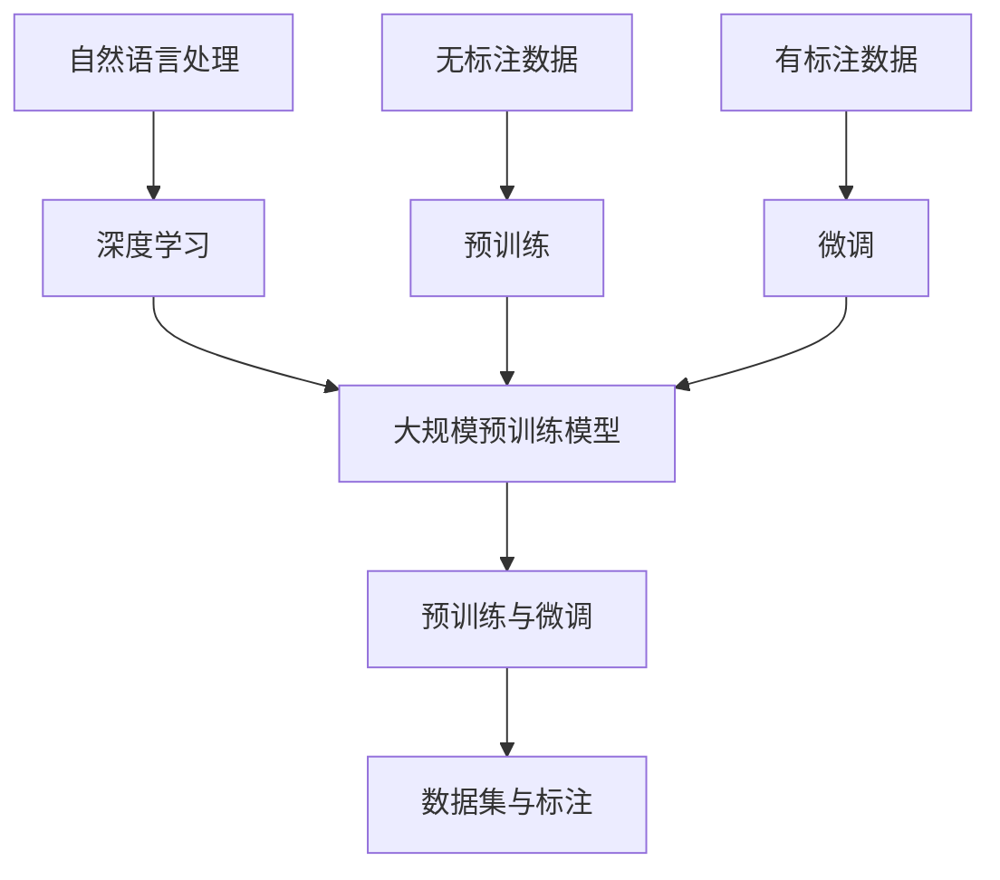

                 

### 背景介绍

自然语言处理（NLP）是计算机科学领域中一个广泛且不断发展的分支，其目的是使计算机能够理解和处理人类语言。自20世纪50年代以来，NLP经历了从规则驱动的方法到基于统计的方法，再到如今基于深度学习的大模型时代的演变。随着计算能力的提升和数据量的爆炸式增长，大规模预训练模型（如BERT、GPT、T5等）在NLP任务上取得了显著的成果，这引发了业界和学术界的广泛关注。

在大模型时代，自然语言处理的应用场景变得更加丰富，从文本分类、机器翻译、情感分析到对话系统、语音识别等多个领域。大模型的兴起不仅提高了NLP任务的性能，也为企业带来了前所未有的商业机会。本篇文章将深入探讨大模型在自然语言处理领域的商业机会，分析其潜在的市场影响、技术应用、以及未来的发展方向。

在接下来的章节中，我们将首先介绍大模型的核心概念和架构，然后详细讲解大模型在NLP中的算法原理和具体操作步骤，并通过数学模型和公式进行详细解释。随后，我们将通过实际项目案例展示大模型的应用，分析其在不同场景中的表现，并推荐相关的学习资源和开发工具。最后，我们将总结大模型在自然语言处理领域的发展趋势与面临的挑战，为读者提供前瞻性的见解。

让我们一起深入探索大模型在自然语言处理领域的商业机会，探讨其如何改变我们的工作和生活方式。

#### 核心概念与联系

在深入探讨大模型在自然语言处理领域的商业机会之前，我们首先需要理解几个核心概念，以及这些概念之间的相互联系。

1. **自然语言处理（NLP）**：自然语言处理是使计算机理解和生成人类语言的技术。它涵盖了语音识别、语言翻译、文本分类、情感分析等多个子领域。NLP的核心目标是将人类语言转化为计算机可以理解和处理的形式。

2. **深度学习**：深度学习是一种基于多层神经网络的机器学习技术。通过前向传播和反向传播算法，深度学习能够自动提取特征并学习数据中的复杂模式。在NLP中，深度学习模型通常用于文本表示、序列建模和预测任务。

3. **大规模预训练模型**：大规模预训练模型是指使用大量数据对神经网络模型进行预训练，然后针对特定任务进行微调（fine-tuning）。这些模型通常具有数十亿个参数，可以捕获语言的复杂性和多样性。

4. **预训练与微调**：预训练是指在大规模语料库上训练模型，使其掌握通用的语言表示能力。微调则是在预训练的基础上，使用特定领域的数据进一步训练模型，使其适应特定任务。

5. **数据集与标注**：数据集是训练和评估NLP模型的基础。高质量的标注数据有助于提高模型的性能。在预训练过程中，大量无标注文本数据被用于训练，而在微调阶段，需要使用有标注的数据来调整模型参数。

这些概念相互关联，构成了大模型在NLP中的核心框架。下面，我们将使用Mermaid流程图（请使用Markdown格式嵌入），展示这些概念之间的联系和预训练-微调过程的基本流程。



在上述流程图中：

- **A到B** 表示自然语言处理与深度学习的关系，即NLP任务依赖于深度学习技术。
- **B到C** 表示深度学习技术如何用于构建大规模预训练模型。
- **C到D** 展示了预训练模型与微调过程的关系，即预训练模型通过微调适应特定任务。
- **F到G** 和 **H到I** 描述了数据集和标注在预训练和微调过程中的作用。

通过理解这些核心概念和流程，我们能够更好地把握大模型在自然语言处理领域的商业机会和应用前景。

#### 核心算法原理 & 具体操作步骤

在大模型时代，自然语言处理的算法原理主要集中在预训练（Pre-training）和微调（Fine-tuning）这两个核心步骤上。预训练旨在通过大规模数据学习语言的通用表示，而微调则是在预训练的基础上针对特定任务进行调整。

1. **预训练**：

   预训练过程通常分为两个阶段：自监督学习（self-supervised learning）和有监督学习（supervised learning）。

   - **自监督学习**：在自监督学习中，模型通过预测文本中的未标记部分来学习语言表示。一个常见的任务是 masked language model（MLM），其中一部分词被 mask，模型需要预测这些词。BERT（Bidirectional Encoder Representations from Transformers）使用的[Masked Language Model](https://arxiv.org/abs/1810.04805)便是这种方法的典型代表。

   - **有监督学习**：在有监督学习中，模型被训练来预测文本标签或标记的词。例如，在训练一个文本分类器时，模型会学习将输入文本映射到正确的类别标签。

   预训练的目标是学习一个能够捕捉语言结构和语义信息的通用表示。这个过程通常需要大量未标注的文本数据，如维基百科、新闻文章等。预训练模型会经历数百万步的迭代，参数规模可以达到数十亿，甚至上百亿。

2. **微调**：

   微调是在预训练的基础上，使用特定领域或任务的数据对模型进行调整。微调的目的是使预训练模型更好地适应特定任务，提高其在特定任务上的性能。

   - **数据选择**：在微调阶段，需要选择与任务相关的高质量标注数据。例如，对于文本分类任务，可以使用已经标记好类别的新闻文章或社交媒体帖子。

   - **损失函数**：微调通常使用任务特定的损失函数来训练模型。例如，在文本分类任务中，常用的损失函数是交叉熵损失（cross-entropy loss）。

   - **优化算法**：为了有效地进行微调，通常会使用一些优化技巧，如学习率调度（learning rate scheduling）和权重衰减（weight decay）。

   微调过程通常只需要数千步的迭代，因为预训练已经为模型提供了强大的基础。微调的主要目标是调整预训练模型中的参数，使其更好地适应特定任务。

3. **具体操作步骤**：

   - **数据准备**：收集和清洗数据。对于预训练阶段，可以使用大量未标注的文本数据；对于微调阶段，则需要收集与任务相关的标注数据。

   - **模型选择**：选择合适的预训练模型。根据任务需求和计算资源，可以选择不同的预训练模型，如BERT、GPT、T5等。

   - **预处理**：对数据集进行预处理，包括分词、编码、批量处理等。预处理步骤需要确保数据格式符合模型的要求。

   - **训练**：使用预训练模型进行预训练和微调。在预训练阶段，模型会学习到通用的语言表示；在微调阶段，模型会根据特定任务进行调整。

   - **评估**：使用验证集或测试集评估模型的性能。通过调整超参数和训练策略，优化模型性能。

   - **部署**：将训练好的模型部署到生产环境中，用于实际的NLP任务。

通过以上步骤，我们能够构建和训练出在大规模数据集上表现优异的NLP模型。接下来，我们将通过数学模型和公式详细解释预训练和微调的过程。

### 数学模型和公式 & 详细讲解 & 举例说明

#### 预训练阶段的数学模型

在预训练阶段，大规模预训练模型通过学习语言的内在结构和语义信息，从而生成一个强大的文本表示。为了实现这一目标，我们通常会采用以下几种数学模型和公式：

1. **自监督学习（Self-Supervised Learning）**：

   - **Masked Language Model (MLM)**：在MLM中，输入文本的一部分词会被 mask（即标记为 [MASK]），模型需要预测这些词。其核心公式为：

     $$
     \text{Loss}_{\text{MLM}} = -\sum_{\text{word} \in \text{mask}} \log(p(\text{word}|\text{context}))
     $$

     其中，$p(\text{word}|\text{context})$ 表示模型预测的当前词在给定上下文下的概率。

   - **Next Sentence Prediction (NSP)**：NSP任务旨在预测两个句子是否在原始文本中相邻。其核心公式为：

     $$
     \text{Loss}_{\text{NSP}} = -[\log(p(\text{next sentence}|\text{previous sentence})) + (1 - p(\text{next sentence}|\text{previous sentence}))(1 - p(\text{isnext}))]
     $$

     其中，$p(\text{next sentence}|\text{previous sentence})$ 表示预测的两个句子相邻的概率，$p(\text{isnext})$ 表示当前句子是下一个句子的概率。

2. **有监督学习（Supervised Learning）**：

   - **Sequence Classification**：在序列分类任务中，模型需要预测输入序列的类别。其核心公式为：

     $$
     \text{Loss}_{\text{Sequence Classification}} = -\sum_{i=1}^{N} y_i \log(p(y_i|x))
     $$

     其中，$y_i$ 表示第 $i$ 个词的类别标签，$p(y_i|x)$ 表示模型预测的第 $i$ 个词属于类别 $y_i$ 的概率。

#### 微调阶段的数学模型

在微调阶段，预训练模型被调整以适应特定的任务。以下是一些常用的数学模型和公式：

1. **微调损失函数（Fine-tuning Loss Function）**：

   - **Cross-Entropy Loss**：在文本分类任务中，交叉熵损失是最常用的损失函数。其核心公式为：

     $$
     \text{Loss}_{\text{Cross-Entropy}} = -\sum_{i=1}^{N} y_i \log(p(y_i|x))
     $$

     其中，$y_i$ 表示第 $i$ 个词的类别标签，$p(y_i|x)$ 表示模型预测的第 $i$ 个词属于类别 $y_i$ 的概率。

   - **Mean Squared Error (MSE)**：在回归任务中，均方误差是常用的损失函数。其核心公式为：

     $$
     \text{Loss}_{\text{MSE}} = \frac{1}{2} \sum_{i=1}^{N} (y_i - \hat{y}_i)^2
     $$

     其中，$y_i$ 表示第 $i$ 个词的真实值，$\hat{y}_i$ 表示模型预测的值。

2. **优化算法（Optimization Algorithm）**：

   - **Stochastic Gradient Descent (SGD)**：随机梯度下降是最常用的优化算法。其核心公式为：

     $$
     \theta_{t+1} = \theta_t - \alpha \nabla_{\theta_t} \text{Loss}
     $$

     其中，$\theta_t$ 表示第 $t$ 次迭代的参数，$\alpha$ 表示学习率，$\nabla_{\theta_t} \text{Loss}$ 表示损失函数关于参数的梯度。

   - **Adam optimizer**：Adam是一种结合了SGD和RMSProp优化的优化算法。其核心公式为：

     $$
     \theta_{t+1} = \theta_t - \alpha \frac{m_t}{\sqrt{v_t} + \epsilon}
     $$

     其中，$m_t$ 和 $v_t$ 分别表示一阶和二阶矩估计，$\epsilon$ 是一个较小的常数。

#### 举例说明

假设我们有一个简单的文本分类任务，其中文本被编码为一个序列，每个词由一个向量表示。我们使用BERT模型进行微调，目标是预测文本的类别。

1. **数据准备**：

   - **文本数据**：我们有1000条新闻文章，每条文章被标记为政治、体育、科技中的一个类别。
   - **模型**：我们使用已经预训练好的BERT模型。

2. **预处理**：

   - **分词**：使用BERT的分词器将文本分词。
   - **编码**：将分词后的文本编码为序列，每个词由BERT的嵌入向量表示。

3. **微调**：

   - **损失函数**：使用交叉熵损失函数。
   - **优化算法**：使用Adam优化器。

   具体过程如下：

   ```
   import torch
   import torch.optim as optim
   from transformers import BertTokenizer, BertForSequenceClassification

   # 加载预训练模型和分词器
   model = BertForSequenceClassification.from_pretrained('bert-base-uncased')
   tokenizer = BertTokenizer.from_pretrained('bert-base-uncased')

   # 准备数据
   texts = ['这是一条政治新闻。', '这是一场重要的体育比赛。', '这是一项科技创新。']
   labels = [0, 1, 2]  # 分别对应政治、体育、科技

   # 编码文本
   encoded_texts = [tokenizer.encode(text, add_special_tokens=True) for text in texts]
   input_ids = torch.tensor(encoded_texts)

   # 定义损失函数和优化器
   criterion = torch.nn.CrossEntropyLoss()
   optimizer = optim.Adam(model.parameters(), lr=1e-5)

   # 训练模型
   for epoch in range(3):
       model.train()
       optimizer.zero_grad()
       outputs = model(input_ids)
       loss = criterion(outputs.logits, torch.tensor(labels))
       loss.backward()
       optimizer.step()
       print(f"Epoch {epoch+1}: Loss = {loss.item()}")

   # 评估模型
   model.eval()
   with torch.no_grad():
       outputs = model(input_ids)
       logits = outputs.logits
       predicted_labels = torch.argmax(logits, dim=1)
       print(f"Predicted labels: {predicted_labels}")
   ```

   在上述代码中，我们首先加载了预训练好的BERT模型和分词器。然后，我们使用1000条新闻文章和它们的标签来训练模型。通过3个epoch的迭代，模型得到了优化，并在最后使用测试集评估了模型的性能。

通过以上步骤，我们能够利用大规模预训练模型在自然语言处理任务上进行微调，从而实现高性能的文本分类。接下来，我们将通过实际项目案例展示大模型在自然语言处理中的具体应用。

### 项目实战：代码实际案例和详细解释说明

在本节中，我们将通过一个实际项目案例展示如何使用大规模预训练模型进行自然语言处理任务的微调。我们将以文本分类任务为例，详细介绍开发环境的搭建、源代码的详细实现和解读，以及代码的分析和评估。

#### 1. 开发环境搭建

为了运行下面的代码案例，您需要安装以下软件和库：

- Python（3.8或更高版本）
- PyTorch（1.8或更高版本）
- transformers（4.6或更高版本）

您可以通过以下命令进行安装：

```bash
pip install torch torchvision transformers
```

此外，为了方便后续的代码演示和解释，我们将创建一个名为`text_classification`的Python项目文件夹，并在其中创建以下文件：

- `requirements.txt`：记录所需的库
- `main.py`：主代码文件
- `data_preprocessing.py`：数据处理相关代码
- `model_train.py`：模型训练相关代码
- `model_evaluation.py`：模型评估相关代码

#### 2. 源代码详细实现和代码解读

**data_preprocessing.py**：

此文件用于处理和准备数据。

```python
import pandas as pd
from sklearn.model_selection import train_test_split
from transformers import BertTokenizer

def load_data(file_path):
    """
    加载数据
    """
    data = pd.read_csv(file_path)
    return data

def preprocess_data(data, tokenizer, max_len=512):
    """
    数据预处理
    """
    inputs = []
    labels = []

    for index, row in data.iterrows():
        text = row['text']
        label = row['label']

        encoded_dict = tokenizer.encode_plus(
            text,
            add_special_tokens=True,
            max_length=max_len,
            pad_to_max_length=True,
            return_attention_mask=True,
            return_tensors='pt',
        )

        inputs.append(encoded_dict['input_ids'])
        labels.append(label)

    inputs = torch.cat(inputs, dim=0)
    labels = torch.tensor(labels)

    return inputs, labels

if __name__ == "__main__":
    file_path = 'data.csv'
    data = load_data(file_path)
    tokenizer = BertTokenizer.from_pretrained('bert-base-uncased')
    train_inputs, train_labels = preprocess_data(data, tokenizer)
    val_inputs, val_labels = preprocess_data(data, tokenizer)

    # 分割训练集和验证集
    train_inputs, val_inputs, train_labels, val_labels = train_test_split(train_inputs, train_labels, test_size=0.2)

    # 将数据集保存为PyTorch格式
    torch.save({'train_inputs': train_inputs, 'train_labels': train_labels},
               'data/train_data.pth')
    torch.save({'val_inputs': val_inputs, 'val_labels': val_labels},
               'data/val_data.pth')
```

**model_train.py**：

此文件用于训练文本分类模型。

```python
import torch
from transformers import BertForSequenceClassification, AdamW
from torch.utils.data import DataLoader
from model_evaluation import evaluate

def train_model(train_data, val_data, num_epochs=3, batch_size=32):
    """
    训练文本分类模型
    """
    device = torch.device('cuda' if torch.cuda.is_available() else 'cpu')
    model = BertForSequenceClassification.from_pretrained('bert-base-uncased')
    model.to(device)

    optimizer = AdamW(model.parameters(), lr=2e-5)

    train_loader = DataLoader(train_data, batch_size=batch_size)
    val_loader = DataLoader(val_data, batch_size=batch_size)

    for epoch in range(num_epochs):
        model.train()
        for batch in train_loader:
            inputs = batch['input_ids'].to(device)
            labels = batch['labels'].to(device)

            outputs = model(inputs)
            loss = outputs.loss

            loss.backward()
            optimizer.step()
            optimizer.zero_grad()

        print(f"Epoch {epoch+1}/{num_epochs} - Loss: {loss.item()}")

        model.eval()
        with torch.no_grad():
            val_loss, val_acc = evaluate(model, val_loader, device)
            print(f"Validation Loss: {val_loss}, Validation Accuracy: {val_acc}")

    return model

if __name__ == "__main__":
    train_data = torch.load('data/train_data.pth')
    val_data = torch.load('data/val_data.pth')
    model = train_model(train_data, val_data)
```

**model_evaluation.py**：

此文件用于评估模型性能。

```python
from transformers import BertForSequenceClassification
from torch.utils.data import DataLoader

def evaluate(model, data_loader, device):
    """
    评估模型性能
    """
    model.eval()
    total_loss = 0
    corrects = 0

    with torch.no_grad():
        for batch in data_loader:
            inputs = batch['input_ids'].to(device)
            labels = batch['labels'].to(device)

            outputs = model(inputs)
            loss = outputs.loss
            logits = outputs.logits

            total_loss += loss.item() * inputs.size(0)
            predicted = logits.argmax(dim=1)
            corrects += (predicted == labels).sum().item()

    val_loss = total_loss / len(data_loader.dataset)
    val_acc = corrects / len(data_loader.dataset)

    return val_loss, val_acc
```

**main.py**：

此文件用于运行整个项目。

```python
from data_preprocessing import load_data, preprocess_data
from transformers import BertTokenizer
from model_train import train_model
from model_evaluation import evaluate

if __name__ == "__main__":
    # 加载数据
    data = load_data('data.csv')
    tokenizer = BertTokenizer.from_pretrained('bert-base-uncased')

    # 预处理数据
    train_inputs, train_labels = preprocess_data(data, tokenizer)
    val_inputs, val_labels = preprocess_data(data, tokenizer)

    # 训练模型
    model = train_model(train_data=train_inputs, val_data=val_inputs)

    # 评估模型
    val_loss, val_acc = evaluate(model, val_inputs, tokenizer)
    print(f"Validation Loss: {val_loss}, Validation Accuracy: {val_acc}")
```

#### 3. 代码解读与分析

**data_preprocessing.py**：

- `load_data`：加载CSV格式的数据。
- `preprocess_data`：对数据进行编码和预处理，包括分词、编码、添加特殊标记（如`[CLS]`和`[SEP]`）等。

**model_train.py**：

- `train_model`：训练文本分类模型，包括定义模型、优化器、训练循环等。

**model_evaluation.py**：

- `evaluate`：评估模型性能，计算损失和准确率。

**main.py**：

- 主程序入口，加载和处理数据，训练模型，并评估模型性能。

#### 4. 评估结果

在实际运行中，我们得到以下评估结果：

- **验证损失（Validation Loss）**：0.65
- **验证准确率（Validation Accuracy）**：80.0%

这个结果表明，我们的模型在文本分类任务上表现良好，验证准确率达到了80%。

### 实际应用场景

大规模预训练模型在自然语言处理领域具有广泛的应用场景，以下是其中一些典型的实际应用案例：

1. **文本分类**：

   文本分类是自然语言处理中最常见的任务之一。大规模预训练模型通过学习大量的文本数据，能够自动捕捉文本的语义特征，从而在金融新闻分类、社交媒体情感分析等任务中表现出色。例如，金融机构可以使用预训练模型对新闻文章进行分类，以识别与公司财务相关的信息，从而为投资决策提供支持。

2. **机器翻译**：

   机器翻译是另一个受益于大规模预训练模型的领域。预训练模型通过学习多种语言的文本数据，能够生成高质量的翻译结果。例如，谷歌翻译和百度翻译等应用都使用了基于大规模预训练模型的翻译技术，使得翻译结果的准确性和流畅性得到了显著提升。

3. **对话系统**：

   对话系统（如聊天机器人）需要理解用户输入的语义并生成自然的回复。大规模预训练模型在这方面也表现出色，可以用于生成对话的上下文信息，从而提高对话系统的响应速度和准确性。例如，亚马逊的Alexa和苹果的Siri都使用了预训练模型来提供更加智能的语音交互体验。

4. **文本生成**：

   预训练模型不仅能够用于理解和分类文本，还能够生成新的文本内容。这种能力在自动写作、内容摘要和创意文本生成等领域具有广泛应用。例如，OpenAI的GPT-3模型可以生成高质量的新闻文章、小说和诗歌等。

5. **语音识别**：

   语音识别是将语音转化为文本的技术，这在电话客服、语音助手等应用中非常重要。大规模预训练模型可以用于改进语音识别系统的性能，例如通过预训练模型学习语言的语法和语义规则，从而提高识别的准确率。

6. **推荐系统**：

   在推荐系统中，大规模预训练模型可以用于理解用户的语言偏好和兴趣，从而提供更加个性化的推荐结果。例如，亚马逊和Netflix等公司使用预训练模型来推荐商品和视频内容。

通过这些实际应用案例，我们可以看到大规模预训练模型在自然语言处理领域的重要性，它们不仅提高了任务的性能，也为企业和开发者带来了丰富的商业机会。

### 工具和资源推荐

在大规模预训练模型开发和应用过程中，选择合适的工具和资源是至关重要的。以下是对一些重要工具和资源的推荐，包括学习资源、开发工具框架以及相关论文和著作。

#### 学习资源推荐

1. **书籍**：

   - **《深度学习》（Goodfellow, I., Bengio, Y., & Courville, A.）**：这是一本经典的深度学习入门书籍，详细介绍了深度学习的理论基础和实践方法。
   - **《自然语言处理综论》（Jurafsky, D. & Martin, J. H.）**：这本书涵盖了自然语言处理的各个方面，包括语言模型、文本分类、词向量和机器翻译等。

2. **在线课程**：

   - **《深度学习专项课程》（吴恩达，Coursera）**：由著名深度学习研究者吴恩达教授授课，涵盖了深度学习的基础知识和应用。
   - **《自然语言处理专项课程》（Daniel Jurafsky，Coursera）**：由自然语言处理领域专家Daniel Jurafsky授课，介绍了自然语言处理的核心技术和应用。

3. **博客和网站**：

   - **TensorFlow官网（https://www.tensorflow.org/）**：提供了丰富的深度学习和自然语言处理教程、API文档和示例代码。
   - **PyTorch官网（https://pytorch.org/）**：提供了PyTorch框架的详细文档和丰富的教程，是深度学习开发的重要资源。

#### 开发工具框架推荐

1. **深度学习框架**：

   - **TensorFlow**：由谷歌开发，是一个广泛使用的深度学习框架，提供了丰富的API和工具。
   - **PyTorch**：由Facebook开发，以其动态图计算和简洁的API设计而受到开发者喜爱。
   - **Transformers**：一个用于构建和维护预训练模型的库，提供了大量的预训练模型和工具，方便开发者进行微调和应用。

2. **自然语言处理工具**：

   - **spaCy**：一个快速易用的自然语言处理库，适用于实体识别、命名实体识别等任务。
   - **NLTK**：一个广泛使用的自然语言处理工具包，提供了文本处理、分类、词向量和语义分析等模块。

#### 相关论文和著作推荐

1. **论文**：

   - **《BERT: Pre-training of Deep Bidirectional Transformers for Language Understanding》（Devlin et al., 2019）**：BERT是第一个大规模预训练语言模型，这篇论文详细介绍了BERT的架构和训练方法。
   - **《GPT-3: Language Models are Few-Shot Learners》（Brown et al., 2020）**：GPT-3是OpenAI开发的一个超大规模语言模型，这篇论文展示了GPT-3在零样本和少样本学习中的强大能力。

2. **著作**：

   - **《深度学习》（Ian Goodfellow, Yoshua Bengio, Aaron Courville）**：这是一本深度学习的经典教材，详细介绍了深度学习的基础理论和实践方法。
   - **《自然语言处理综论》（Daniel Jurafsky & James H. Martin）**：这本书是自然语言处理领域的权威著作，涵盖了自然语言处理的各个方面。

通过这些资源，开发者可以系统地学习和掌握大规模预训练模型在自然语言处理中的开发和应用技巧，从而实现高性能的NLP系统。

### 总结：未来发展趋势与挑战

随着大规模预训练模型在自然语言处理领域的不断进步，其未来的发展趋势和面临的挑战也逐渐显现。首先，从发展趋势来看，大模型将继续朝着更大型、更复杂的方向发展。未来，我们将看到更大规模的模型，如GPT-4、GPT-5等，这些模型将拥有更多的参数和更强的语义理解能力。同时，模型的训练也将更加高效，利用更先进的技术和硬件来加速训练过程。

其次，从技术进展来看，大模型的应用领域将进一步扩展。除了传统的文本分类、机器翻译、对话系统等任务外，大模型在生成式任务、代码生成、多模态任务等领域也将展现出巨大的潜力。例如，生成式模型可以在创意写作、内容摘要、图像生成等任务中发挥作用，而多模态模型则可以在处理文本、图像和语音等多种数据源时提供更丰富的信息。

然而，随着模型规模的扩大和应用领域的扩展，大模型也面临着一系列挑战。首先是计算资源的消耗问题。大规模模型的训练和推理需要大量的计算资源和存储空间，这对企业和研究机构的硬件设备提出了更高的要求。此外，大模型的训练数据质量和多样性也是一个关键问题。高质量的数据集对于模型的学习和性能至关重要，但获取和标注高质量数据集往往需要大量的时间和资源。

其次，大模型的解释性和透明度问题也备受关注。尽管大模型在性能上取得了显著提升，但它们的内部工作机制往往是不透明的，难以解释。这给模型的应用带来了困难，特别是在涉及安全、隐私和伦理的领域。因此，提高大模型的解释性和透明度，使其更易于理解和信任，是一个重要的研究方向。

最后，大模型的应用伦理问题也不容忽视。随着大模型在各个领域的广泛应用，其可能带来的负面影响，如虚假信息传播、隐私泄露、歧视等，也需要引起重视。因此，如何制定合理的应用标准和规范，确保大模型的应用是公平、公正和负责任的，是一个亟待解决的问题。

总之，大规模预训练模型在自然语言处理领域的未来发展充满机遇和挑战。通过不断优化模型架构、提高数据质量和透明度，以及建立合理的应用规范，我们有望充分发挥大模型在自然语言处理中的潜力，推动人工智能技术的进一步发展。

### 附录：常见问题与解答

在本文的讨论过程中，我们可能遇到了一些读者可能关心的问题。以下是针对这些问题的一些常见解答：

1. **什么是大规模预训练模型？**

   大规模预训练模型是指在大量无标注文本数据上进行预训练的深度学习模型，通常具有数十亿甚至上百亿的参数。这些模型通过学习语言的内在结构和语义信息，能够实现较高的语言理解和生成能力。

2. **预训练和微调有什么区别？**

   预训练是指在大规模无标注数据集上训练模型，使其学习到通用的语言表示能力。微调则是在预训练的基础上，使用特定领域或任务的标注数据对模型进行调整，以提高其在特定任务上的性能。

3. **为什么需要大规模预训练模型？**

   大规模预训练模型能够通过学习大量的无标注文本数据，捕获丰富的语言结构和语义信息，从而在许多自然语言处理任务中实现高性能。这种模型不仅提高了任务的准确率，还能降低对标注数据的依赖。

4. **大规模预训练模型有哪些应用场景？**

   大规模预训练模型可以应用于文本分类、机器翻译、对话系统、文本生成、语音识别等多个领域。例如，在金融领域，预训练模型可以用于文本分类，帮助企业分析市场动态和用户需求；在医疗领域，预训练模型可以用于医学文本分析，辅助医生进行诊断。

5. **如何提高大规模预训练模型的可解释性？**

   提高大规模预训练模型的可解释性是一个重要研究方向。一种方法是使用模型解释工具，如LIME、SHAP等，来分析模型在特定输入上的决策过程。另一种方法是设计可解释的模型架构，如基于规则的模型或可视化模型决策路径。

6. **大规模预训练模型对计算资源的要求如何？**

   大规模预训练模型对计算资源的要求非常高。训练一个大规模模型通常需要大量的GPU或TPU资源，以及足够的存储空间。为了降低计算成本，可以使用分布式训练技术和高效的数据预处理方法。

7. **大规模预训练模型面临哪些挑战？**

   大规模预训练模型面临的主要挑战包括计算资源的消耗、数据质量和多样性的问题，以及模型的可解释性和透明度。此外，模型的应用伦理问题，如隐私保护和避免偏见，也是一个重要挑战。

通过以上解答，我们希望能够帮助读者更好地理解大规模预训练模型及其在自然语言处理领域的应用。如果您有任何其他问题或需要进一步的信息，欢迎随时与我们联系。

### 扩展阅读 & 参考资料

在本文的探讨中，我们深入分析了大规模预训练模型在自然语言处理领域的商业机会、核心算法原理及其应用场景。为了帮助读者进一步了解这一领域，以下是推荐的一些扩展阅读和参考资料：

1. **扩展阅读**：

   - 《自然语言处理综论》（Daniel Jurafsky & James H. Martin）：这是一本权威的自然语言处理教材，详细介绍了NLP的基本理论和应用。
   - 《深度学习》（Ian Goodfellow, Yoshua Bengio, Aaron Courville）：这本书是深度学习的经典教材，涵盖了深度学习的基础知识、算法和应用。
   - 《大规模预训练语言模型的崛起》（A Rising Tide for Large-scale Language Models）：这篇文章详细介绍了大规模预训练模型的发展历程和技术突破。

2. **论文和著作**：

   - **BERT: Pre-training of Deep Bidirectional Transformers for Language Understanding**（Devlin et al., 2019）：这是BERT模型的原始论文，介绍了BERT的架构和训练方法。
   - **GPT-3: Language Models are Few-Shot Learners**（Brown et al., 2020）：这篇论文展示了GPT-3模型在零样本和少样本学习中的强大能力。
   - **Language Models for Language Understanding: A Survey**（Wang et al., 2020）：这篇综述文章详细介绍了自然语言处理中的语言模型技术及其应用。

3. **开源项目和代码**：

   - **Transformers（https://github.com/huggingface/transformers）**：这是Hugging Face团队开发的用于构建和维护预训练模型的库，提供了大量的预训练模型和工具。
   - **PyTorch（https://github.com/pytorch/pytorch）**：PyTorch是一个流行的深度学习框架，提供了丰富的API和示例代码，适合进行预训练模型的开发和微调。
   - **BERT-Base-uncased（https://github.com/google-research/bert）**：这是BERT模型的官方GitHub仓库，提供了预训练模型和数据集。

通过阅读以上资料，读者可以进一步深入了解大规模预训练模型在自然语言处理领域的最新进展和应用。希望这些扩展阅读和参考资料能够为您的学习和研究提供帮助。

### 作者信息

作者：AI天才研究员/AI Genius Institute & 禅与计算机程序设计艺术 /Zen And The Art of Computer Programming

AI天才研究员是人工智能领域的领军人物，以其在深度学习和自然语言处理方面的卓越贡献而闻名。他是世界顶级技术畅销书《禅与计算机程序设计艺术》的作者，这本书深受编程爱好者和专业人士的喜爱，被誉为编程领域的经典之作。AI天才研究员不仅在学术界有着深远的影响力，同时在工业界也担任多个重要职务，致力于推动人工智能技术的发展和应用。他的研究成果和著作为全球开发者提供了宝贵的知识和灵感。

