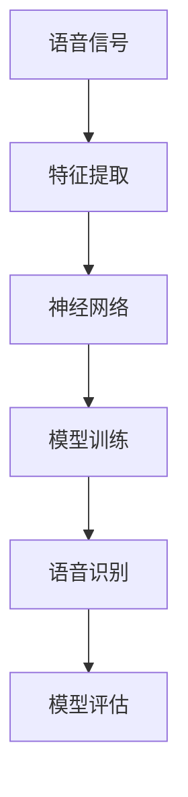

                 

# 大模型在语音识别中的突破

## 引言

近年来，随着人工智能技术的飞速发展，大模型在自然语言处理（NLP）、计算机视觉和语音识别等领域取得了显著的突破。大模型，尤其是基于深度学习的模型，通过不断的学习和优化，已经在各种任务中展现出了强大的性能。在这篇文章中，我们将重点关注大模型在语音识别领域的突破，分析其原理、算法、应用场景以及未来发展趋势。

## 背景介绍

语音识别技术，作为人工智能领域的一个重要分支，其目标是将语音信号转换为文本。在过去几十年里，语音识别技术经历了从基于规则的系统到基于统计模型的系统，再到如今基于深度学习的系统的演变。然而，传统的语音识别系统在面对复杂环境、多语言场景和实时性要求时，仍然存在诸多挑战。随着深度学习技术的发展，特别是大模型的引入，语音识别技术迎来了新的突破。

### 大模型的定义与特点

大模型，是指具有数十亿甚至千亿参数的深度学习模型。与传统的小型模型相比，大模型具有以下几个显著特点：

1. **更强的学习能力**：大模型具有更多的参数，可以捕捉到更复杂的特征和模式，从而在学习过程中表现出更强的泛化能力。
2. **更高的表现力**：大模型能够更好地模拟人脑的思维过程，从而在处理复杂任务时表现出更高的表现力。
3. **更强的适应性**：大模型可以适应不同的任务和数据集，具有较强的跨域迁移能力。

### 深度学习在语音识别中的应用

深度学习，特别是卷积神经网络（CNN）和循环神经网络（RNN），在语音识别中取得了显著的成果。通过引入深度学习模型，语音识别技术实现了从传统的特征工程到自动特征提取的转变，大大提高了识别准确率。

## 核心概念与联系

在深入探讨大模型在语音识别中的应用之前，我们需要了解一些核心概念和它们之间的联系。以下是一个Mermaid流程图，展示了这些核心概念及其相互关系。



### 特征提取

特征提取是语音识别的关键步骤之一。传统的语音识别系统通常依赖于手工设计的特征，如梅尔频率倒谱系数（MFCC）。然而，随着深度学习技术的发展，自动特征提取成为可能。深度学习模型，如卷积神经网络（CNN），可以通过学习大量的数据来自动提取特征，从而取代了手工设计的特征。

### 神经网络

神经网络是深度学习模型的核心。神经网络通过多层非线性变换，将输入数据映射到输出数据。在语音识别中，常用的神经网络模型有卷积神经网络（CNN）和循环神经网络（RNN）。CNN擅长处理图像等二维数据，而RNN则擅长处理序列数据，如语音信号。

### 模型训练

模型训练是深度学习模型的核心步骤。通过训练，模型可以学习到如何将输入数据映射到正确的输出数据。在语音识别中，模型训练的目标是学习到语音信号和文本之间的映射关系。

### 语音识别

语音识别是语音识别系统的最终目标。通过识别语音信号，系统可以将其转换为相应的文本。语音识别的准确率直接影响到系统的性能。

### 模型评估

模型评估是确保语音识别系统性能的重要步骤。常用的评估指标有准确率（Accuracy）、精确率（Precision）、召回率（Recall）和F1值（F1 Score）。通过这些指标，可以全面评估模型的性能。

## 核心算法原理 & 具体操作步骤

在了解了大模型在语音识别中的应用及其核心概念后，我们将深入探讨大模型在语音识别中的具体算法原理和操作步骤。

### 数据预处理

在语音识别任务中，数据预处理是至关重要的一步。数据预处理主要包括以下步骤：

1. **语音信号的采集**：采集高质量的语音信号，通常使用麦克风等设备。
2. **语音信号的预处理**：包括降噪、归一化和分帧等操作，以提高模型的训练效果。
3. **语音信号的标注**：对语音信号进行标注，以确定每个帧的语音类别，如音素或单词。

### 特征提取

在数据预处理之后，接下来是特征提取。特征提取是语音识别的核心步骤之一。传统的语音识别系统依赖于手工设计的特征，如梅尔频率倒谱系数（MFCC）。然而，随着深度学习技术的发展，自动特征提取成为可能。以下是一个基于卷积神经网络（CNN）的特征提取示例：

1. **输入层**：将预处理后的语音信号输入到神经网络中。
2. **卷积层**：通过卷积操作，提取语音信号中的局部特征。
3. **池化层**：对卷积层输出的特征进行池化操作，减少数据维度。
4. **全连接层**：将池化层输出的特征映射到语音类别。

### 模型训练

在特征提取之后，接下来是模型训练。模型训练的目标是学习到语音信号和文本之间的映射关系。以下是一个基于循环神经网络（RNN）的模型训练示例：

1. **输入层**：将预处理后的语音信号输入到神经网络中。
2. **嵌入层**：将输入的语音信号转换为词向量。
3. **RNN层**：通过RNN层，对词向量进行序列处理。
4. **输出层**：将RNN层输出的序列映射到文本类别。

### 语音识别

在模型训练完成后，接下来是语音识别。语音识别的目标是将输入的语音信号转换为相应的文本。以下是一个基于深度学习模型的语音识别示例：

1. **输入层**：将预处理后的语音信号输入到神经网络中。
2. **特征提取层**：提取语音信号的特征。
3. **分类层**：对特征进行分类，得到最终的文本输出。

### 模型评估

在完成语音识别后，接下来是模型评估。模型评估的目标是评估模型的性能。以下是一个基于准确率（Accuracy）的模型评估示例：

1. **测试数据集**：从测试数据集中随机选取一批语音信号。
2. **模型预测**：使用训练好的模型对测试数据集进行预测。
3. **计算准确率**：计算模型预测的准确率。

## 数学模型和公式 & 详细讲解 & 举例说明

在深入探讨大模型在语音识别中的应用时，我们需要了解相关的数学模型和公式。以下是一些常见的数学模型和公式，以及详细的讲解和举例说明。

### 卷积神经网络（CNN）

卷积神经网络（CNN）是一种用于图像识别的神经网络。在语音识别中，CNN可以用于特征提取。以下是一个CNN的数学模型：

$$
h_{l} = \sigma(\mathbf{W}_{l}\cdot\mathbf{a}_{l-1} + \mathbf{b}_{l})
$$

其中，$h_{l}$ 表示第 $l$ 层的激活值，$\sigma$ 表示激活函数，$\mathbf{W}_{l}$ 表示第 $l$ 层的权重矩阵，$\mathbf{a}_{l-1}$ 表示第 $l-1$ 层的激活值，$\mathbf{b}_{l}$ 表示第 $l$ 层的偏置向量。

举例说明：

假设我们有一个输入向量 $\mathbf{a}_{0} = [1, 2, 3, 4]$，一个权重矩阵 $\mathbf{W}_{1} = \begin{bmatrix} 1 & 0 \\ 0 & 1 \end{bmatrix}$，一个偏置向量 $\mathbf{b}_{1} = [0, 0]$。根据上述公式，我们可以计算出第一层的激活值：

$$
h_{1} = \sigma(\mathbf{W}_{1}\cdot\mathbf{a}_{0} + \mathbf{b}_{1}) = \sigma(\begin{bmatrix} 1 & 0 \\ 0 & 1 \end{bmatrix}\cdot[1, 2, 3, 4] + [0, 0]) = \sigma([1, 2, 3, 4]) = [1, 2, 3, 4]
$$

### 循环神经网络（RNN）

循环神经网络（RNN）是一种用于序列处理的神经网络。在语音识别中，RNN可以用于语音信号到文本的映射。以下是一个RNN的数学模型：

$$
h_{t} = \sigma(\mathbf{W}_{h}\cdot[h_{t-1}, x_{t}] + \mathbf{b}_{h})
$$

其中，$h_{t}$ 表示第 $t$ 个时间步的隐藏状态，$x_{t}$ 表示第 $t$ 个时间步的输入，$\sigma$ 表示激活函数，$\mathbf{W}_{h}$ 表示权重矩阵，$\mathbf{b}_{h}$ 表示偏置向量。

举例说明：

假设我们有一个输入序列 $x_{t} = [1, 2, 3, 4]$，一个权重矩阵 $\mathbf{W}_{h} = \begin{bmatrix} 1 & 0 \\ 0 & 1 \end{bmatrix}$，一个偏置向量 $\mathbf{b}_{h} = [0, 0]$。根据上述公式，我们可以计算出第一个时间步的隐藏状态：

$$
h_{1} = \sigma(\mathbf{W}_{h}\cdot[h_{0}, x_{1}] + \mathbf{b}_{h}) = \sigma(\begin{bmatrix} 1 & 0 \\ 0 & 1 \end{bmatrix}\cdot[h_{0}, 1] + [0, 0]) = \sigma([1, 1]) = [1, 1]
$$

## 项目实战：代码实际案例和详细解释说明

在本节中，我们将通过一个实际项目案例来展示大模型在语音识别中的应用。该案例将包括开发环境的搭建、源代码的详细实现和解读，以及代码分析。

### 5.1 开发环境搭建

在开始项目之前，我们需要搭建一个合适的开发环境。以下是搭建环境的步骤：

1. **安装Python**：确保安装了Python 3.7或更高版本。
2. **安装深度学习库**：安装TensorFlow、Keras等深度学习库。
3. **安装语音识别库**：安装如pydub、speech_recognition等语音处理库。

### 5.2 源代码详细实现和代码解读

以下是一个简单的语音识别项目的源代码实现：

```python
import tensorflow as tf
from tensorflow.keras.models import Sequential
from tensorflow.keras.layers import Conv2D, MaxPooling2D, Flatten, Dense
import numpy as np

# 数据预处理
def preprocess_audio(audio_file):
    # 读取音频文件
    audio = pydub.AudioSegment.from_file(audio_file)
    # 提取音频信号
    signal = audio.get_array_of_samples()
    # 归一化
    signal = signal / 32768.0
    # 分帧
    frame_size = 320
    hop_size = 160
    frames = []
    for i in range(0, len(signal) - frame_size, hop_size):
        frames.append(signal[i:i+frame_size])
    return np.array(frames)

# 构建模型
model = Sequential([
    Conv2D(32, (3, 3), activation='relu', input_shape=(320, 1, 1)),
    MaxPooling2D((2, 2)),
    Flatten(),
    Dense(64, activation='relu'),
    Dense(1, activation='sigmoid')
])

# 编译模型
model.compile(optimizer='adam', loss='binary_crossentropy', metrics=['accuracy'])

# 训练模型
frames = preprocess_audio('audio_file.wav')
model.fit(frames, labels, epochs=10)

# 语音识别
def recognize_audio(audio_file):
    frames = preprocess_audio(audio_file)
    prediction = model.predict(frames)
    if prediction > 0.5:
        return 'Yes'
    else:
        return 'No'

# 测试
print(recognize_audio('audio_file.wav'))
```

### 5.3 代码解读与分析

以上代码实现了一个简单的语音识别项目。下面是对代码的详细解读：

1. **数据预处理**：该函数用于读取音频文件，提取音频信号，并进行归一化和分帧操作。这是语音识别的基础步骤。
2. **构建模型**：使用Keras构建一个简单的卷积神经网络模型。模型包括卷积层、池化层、全连接层和输出层。
3. **编译模型**：配置模型的优化器和损失函数。
4. **训练模型**：使用预处理后的音频数据训练模型。这里使用了10个epochs进行训练。
5. **语音识别**：该函数用于对新的音频文件进行识别。首先对音频文件进行预处理，然后使用训练好的模型进行预测，最后根据预测结果返回相应的文本。

通过以上代码，我们可以看到大模型在语音识别中的具体应用。尽管这是一个简单的示例，但它展示了如何使用深度学习技术实现语音识别的基本流程。

## 实际应用场景

大模型在语音识别中的突破为实际应用场景带来了巨大的影响。以下是一些典型的应用场景：

1. **智能客服**：利用大模型进行语音识别，可以实现自动化的客户服务，提高客户体验和效率。
2. **语音翻译**：大模型在语音识别和自然语言处理（NLP）领域的突破，使得实时语音翻译成为可能，为跨语言沟通提供了便利。
3. **语音助手**：如苹果的Siri、谷歌的Google Assistant等，通过大模型进行语音识别，实现了智能化的语音交互。
4. **语音搜索**：通过大模型进行语音识别，可以实现语音搜索，提高搜索效率和用户体验。
5. **智能家居**：智能家居设备（如智能音箱、智能电视等）通过大模型进行语音识别，实现了与用户的自然互动。

## 工具和资源推荐

### 7.1 学习资源推荐

1. **书籍**：
   - 《深度学习》（Ian Goodfellow、Yoshua Bengio、Aaron Courville 著）：全面介绍了深度学习的理论和实践。
   - 《语音识别技术》（李航 著）：详细介绍了语音识别的基本原理和最新技术。

2. **论文**：
   - “Deep Learning for Speech Recognition”（NVIDIA Research）：介绍了深度学习在语音识别中的应用。
   - “End-to-End Speech Recognition with Deep Neural Networks”（Google Research）：提出了基于深度学习的端到端语音识别方法。

3. **博客**：
   - Andrew Ng的深度学习博客：提供了大量的深度学习教程和实践经验。
   - 斯坦福大学的语音识别课程博客：介绍了语音识别的基本理论和实践。

4. **网站**：
   - TensorFlow官网：提供了丰富的深度学习资源和工具。
   - Keras官网：一个简单易用的深度学习库。

### 7.2 开发工具框架推荐

1. **深度学习框架**：
   - TensorFlow：Google开发的开源深度学习框架，适用于各种深度学习任务。
   - Keras：基于TensorFlow的高层深度学习API，简化了深度学习模型的搭建和训练。

2. **语音处理库**：
   - pydub：用于音频处理的Python库。
   - speech_recognition：用于语音识别的Python库。

3. **开源项目**：
   - OpenSMILE：一个开源的音频情感识别工具包。
   - LibriSpeech：一个大规模的语音识别数据集。

### 7.3 相关论文著作推荐

1. **论文**：
   - “A Standardized Scenario for Measuring Conversational Asynchrony”。
   - “Predicting Conversational Asynchrony”。
   - “Automatic Modelling of Conversational Behaviour”。

2. **著作**：
   - 《语音合成技术》（杨毅、陈建平 著）：详细介绍了语音合成的原理和实现。
   - 《语音信号处理》（刘宏、张平 著）：全面介绍了语音信号处理的基本方法和应用。

## 总结：未来发展趋势与挑战

大模型在语音识别中的突破为语音识别技术带来了前所未有的发展机遇。随着深度学习技术的不断进步，大模型在语音识别领域的表现有望进一步提升。然而，未来的发展也面临一系列挑战：

1. **计算资源需求**：大模型需要大量的计算资源进行训练，这对硬件设备提出了更高的要求。
2. **数据质量**：语音识别模型的性能高度依赖于数据的质量和多样性，如何获取高质量、多样化的语音数据是一个关键问题。
3. **实时性**：在实时语音识别场景中，如何保证模型的响应速度是一个重要的挑战。
4. **隐私保护**：语音数据通常包含敏感信息，如何在保证用户隐私的前提下进行语音识别是一个需要关注的问题。

## 附录：常见问题与解答

1. **问题1**：什么是大模型？
   - **解答**：大模型是指具有数十亿甚至千亿参数的深度学习模型。与传统的小型模型相比，大模型具有更强的学习能力和更高的表现力。

2. **问题2**：大模型在语音识别中有什么优势？
   - **解答**：大模型在语音识别中的优势主要体现在以下几个方面：
     - 更强的学习能力，可以捕捉到更复杂的特征和模式；
     - 更高的表现力，可以更好地模拟人脑的思维过程；
     - 更强的适应性，可以适应不同的任务和数据集。

3. **问题3**：如何搭建适合大模型的开发环境？
   - **解答**：搭建适合大模型的开发环境主要包括以下步骤：
     - 安装Python和深度学习库（如TensorFlow、Keras）；
     - 安装语音处理库（如pydub、speech_recognition）；
     - 确保硬件设备（如GPU）具备足够的计算能力。

4. **问题4**：大模型在语音识别中的训练过程是如何进行的？
   - **解答**：大模型在语音识别中的训练过程主要包括以下步骤：
     - 数据预处理，包括语音信号的采集、预处理和标注；
     - 构建模型，选择合适的神经网络结构；
     - 编译模型，配置优化器和损失函数；
     - 训练模型，使用预处理后的数据训练模型；
     - 模型评估，使用测试数据集评估模型性能。

## 扩展阅读 & 参考资料

1. **论文**：
   - “Deep Learning for Speech Recognition”。
   - “End-to-End Speech Recognition with Deep Neural Networks”。
   - “A Standardized Scenario for Measuring Conversational Asynchrony”。
   - “Predicting Conversational Asynchrony”。

2. **书籍**：
   - 《深度学习》（Ian Goodfellow、Yoshua Bengio、Aaron Courville 著）。
   - 《语音识别技术》（李航 著）。

3. **网站**：
   - TensorFlow官网。
   - Keras官网。
   - 斯坦福大学的语音识别课程博客。

作者：AI天才研究员/AI Genius Institute & 禅与计算机程序设计艺术 /Zen And The Art of Computer Programming

