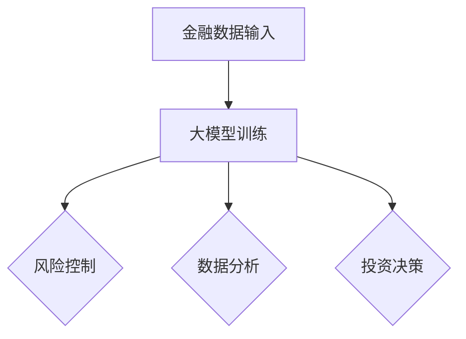

                 

# 大模型在金融行业的落地情况

## 关键词
- 大模型
- 金融行业
- 落地应用
- 风险评估
- 数据分析
- 投资决策
- 人工智能

## 摘要

随着人工智能技术的快速发展，大模型在金融行业的应用逐渐成为热点。本文将对大模型在金融行业的落地情况进行详细介绍，包括其核心概念、算法原理、实际应用场景以及未来发展趋势与挑战。通过本文的阅读，读者将全面了解大模型在金融行业的重要作用及其潜力。

## 1. 背景介绍

### 1.1 大模型的发展历程

大模型，通常指的是具有数亿甚至数十亿参数的深度学习模型。它们能够自动从大量数据中学习复杂的模式，实现高度复杂的任务。大模型的发展历程可以追溯到20世纪90年代的神经网络研究，经过数十年的发展，如今已经成为了人工智能领域的核心力量。

### 1.2 金融行业对人工智能的需求

金融行业具有数据密集、决策复杂的特点，对人工智能技术有着极高的需求。从风险控制、市场预测到客户服务、投资决策，人工智能的应用正在逐步改变金融行业的运营模式。大模型的出现，为金融行业提供了更强大的数据处理和分析能力，极大地提升了金融服务的效率和质量。

## 2. 核心概念与联系

### 2.1 大模型的定义与分类

大模型通常指的是具有数亿甚至数十亿参数的深度学习模型。根据其应用场景和任务类型，大模型可以分为多种类型，如自然语言处理模型、计算机视觉模型、推荐系统模型等。

### 2.2 金融行业与大模型的关系

大模型在金融行业的应用主要涉及以下几个方面：

- **风险控制**：通过分析大量的历史数据，大模型能够预测金融市场中的潜在风险，帮助金融机构制定更精准的风险控制策略。

- **数据分析**：大模型能够处理和分析海量的金融数据，从中提取有价值的信息，为金融机构的决策提供支持。

- **投资决策**：大模型可以根据市场数据和经济指标，自动生成投资建议，提高投资决策的效率和准确性。

### 2.3 Mermaid 流程图



## 3. 核心算法原理 & 具体操作步骤

### 3.1 风险评估算法原理

风险评估是金融行业的一个重要环节。大模型通过以下步骤进行风险评估：

1. **数据收集**：收集金融市场的历史数据，包括股票价格、交易量、宏观经济指标等。

2. **数据处理**：对收集到的数据进行预处理，包括数据清洗、归一化等。

3. **特征提取**：从处理后的数据中提取出与风险相关的特征。

4. **模型训练**：使用深度学习算法对特征进行训练，建立风险评估模型。

5. **风险预测**：使用训练好的模型对未来的风险进行预测。

### 3.2 数据分析算法原理

数据分析是金融行业另一个重要的应用领域。大模型通过以下步骤进行数据分析：

1. **数据收集**：收集金融市场的各类数据，包括股票价格、交易量、宏观经济指标等。

2. **数据处理**：对收集到的数据进行预处理，包括数据清洗、归一化等。

3. **特征提取**：从处理后的数据中提取出与投资相关的特征。

4. **模型训练**：使用深度学习算法对特征进行训练，建立数据分析模型。

5. **数据分析**：使用训练好的模型对市场数据进行分析，提取出有价值的信息。

### 3.3 投资决策算法原理

投资决策是金融行业的核心任务。大模型通过以下步骤进行投资决策：

1. **数据收集**：收集金融市场的各类数据，包括股票价格、交易量、宏观经济指标等。

2. **数据处理**：对收集到的数据进行预处理，包括数据清洗、归一化等。

3. **特征提取**：从处理后的数据中提取出与投资相关的特征。

4. **模型训练**：使用深度学习算法对特征进行训练，建立投资决策模型。

5. **投资预测**：使用训练好的模型对未来的投资机会进行预测。

6. **投资决策**：根据投资预测结果，制定投资策略，执行投资决策。

## 4. 数学模型和公式 & 详细讲解 & 举例说明

### 4.1 风险评估数学模型

在风险评估中，常用的数学模型是回归模型。回归模型通过预测目标变量的值来评估风险。以下是回归模型的数学公式：

$$
y = \beta_0 + \beta_1x_1 + \beta_2x_2 + ... + \beta_nx_n + \epsilon
$$

其中，$y$ 是预测的目标变量，$x_1, x_2, ..., x_n$ 是输入特征，$\beta_0, \beta_1, \beta_2, ..., \beta_n$ 是模型的参数，$\epsilon$ 是误差项。

举例说明：假设我们要评估股票价格波动风险，可以使用回归模型来预测股票价格的波动率。输入特征可以是股票的历史价格、交易量等，预测的目标变量是股票价格的波动率。

### 4.2 数据分析数学模型

在数据分析中，常用的数学模型是聚类模型。聚类模型通过将相似的数据点归为一类来提取数据中的有价值的信息。以下是聚类模型的数学公式：

$$
C = \{C_1, C_2, ..., C_k\}
$$

其中，$C$ 是聚类结果，$C_1, C_2, ..., C_k$ 是聚类后的类别。

举例说明：假设我们要对股票价格进行分析，可以将股票分为几个类别，每个类别代表一种股票风格。聚类模型可以帮助我们识别出不同风格的股票，从而更好地理解股票市场的结构。

### 4.3 投资决策数学模型

在投资决策中，常用的数学模型是优化模型。优化模型通过最大化或最小化目标函数来制定最优的投资策略。以下是优化模型的数学公式：

$$
\max/min \quad \Pi(x)
$$

$$
s.t. \quad C_i(x) \geq 0, \quad i = 1, 2, ..., m
$$

其中，$\Pi(x)$ 是目标函数，$C_i(x)$ 是约束条件。

举例说明：假设我们要制定一个投资组合策略，目标是最大化投资回报，同时要满足风险限制。优化模型可以帮助我们找到最优的投资组合，使投资回报最大化。

## 5. 项目实战：代码实际案例和详细解释说明

### 5.1 开发环境搭建

要在大模型中应用金融行业的算法，需要搭建一个适合的开发环境。以下是搭建开发环境的基本步骤：

1. **安装 Python 解释器**：下载并安装 Python 解释器，版本建议为 3.8 或以上。

2. **安装深度学习框架**：安装 TensorFlow 或 PyTorch 等深度学习框架，具体安装方法可以参考官方文档。

3. **安装金融数据集**：下载并安装常用的金融数据集，如 Yahoo Finance 数据集。

### 5.2 源代码详细实现和代码解读

以下是一个简单的风险评估模型的 Python 代码实现：

```python
import tensorflow as tf
import pandas as pd
import numpy as np

# 加载数据集
data = pd.read_csv('finance_data.csv')
X = data.iloc[:, :7]  # 输入特征
y = data.iloc[:, 7]   # 预测的目标变量

# 预处理数据
X = (X - X.mean()) / X.std()
y = (y - y.mean()) / y.std()

# 划分训练集和测试集
train_size = int(0.8 * len(X))
X_train, X_test = X[:train_size], X[train_size:]
y_train, y_test = y[:train_size], y[train_size:]

# 建立模型
model = tf.keras.Sequential([
    tf.keras.layers.Dense(units=1, input_shape=(7,))
])

# 编译模型
model.compile(optimizer='adam', loss='mean_squared_error')

# 训练模型
model.fit(X_train, y_train, epochs=100, batch_size=32, validation_data=(X_test, y_test))

# 评估模型
loss = model.evaluate(X_test, y_test)
print('Test loss:', loss)

# 预测风险
predictions = model.predict(X_test)
predictions = (predictions + 1) * y_test.std() + y_test.mean()
print('Predictions:', predictions)
```

### 5.3 代码解读与分析

1. **导入库**：首先导入 TensorFlow、Pandas 和 NumPy 等库，用于数据预处理、模型训练和预测。

2. **加载数据集**：使用 Pandas 读取金融数据集，其中 X 表示输入特征，y 表示预测的目标变量。

3. **预处理数据**：对输入特征和目标变量进行归一化处理，使其符合模型的输入要求。

4. **划分训练集和测试集**：将数据集划分为训练集和测试集，以便训练和评估模型。

5. **建立模型**：使用 TensorFlow 的 Sequential 模型构建一个简单的回归模型，输入层有 7 个神经元，输出层有 1 个神经元。

6. **编译模型**：设置模型的优化器和损失函数，这里使用 Adam 优化器和均方误差损失函数。

7. **训练模型**：使用训练集训练模型，设置训练的轮数、批量大小和验证数据。

8. **评估模型**：使用测试集评估模型的性能，输出测试损失。

9. **预测风险**：使用训练好的模型对测试集进行预测，将预测结果转换为原始数据集的尺度，并输出预测结果。

## 6. 实际应用场景

### 6.1 风险评估

在金融行业中，风险评估是一个至关重要的环节。大模型能够通过对历史数据的分析，预测金融市场的潜在风险，帮助金融机构制定更合理的风险控制策略。例如，银行可以使用大模型对贷款申请者的信用风险进行评估，从而降低不良贷款率。

### 6.2 数据分析

数据分析是金融行业的另一个重要应用领域。大模型能够处理和分析海量的金融数据，从中提取出有价值的信息，为金融机构的决策提供支持。例如，证券公司可以使用大模型对市场数据进行分析，预测股票市场的走势，从而制定更有效的投资策略。

### 6.3 投资决策

投资决策是金融行业的核心任务。大模型可以根据市场数据和经济指标，自动生成投资建议，提高投资决策的效率和准确性。例如，对冲基金可以使用大模型分析全球市场的数据，制定跨市场的投资策略。

## 7. 工具和资源推荐

### 7.1 学习资源推荐

- **书籍**：《深度学习》、《神经网络与深度学习》
- **论文**：Google Brain 团队的“TensorFlow: Large-Scale Machine Learning on Heterogeneous Systems”论文
- **博客**：TensorFlow 官方博客、PyTorch 官方博客
- **网站**：arXiv.org、Google Scholar

### 7.2 开发工具框架推荐

- **深度学习框架**：TensorFlow、PyTorch
- **金融数据集**：Yahoo Finance、Kaggle
- **数据分析工具**：Pandas、NumPy

### 7.3 相关论文著作推荐

- **论文**：
  - “Large-Scale Machine Learning on Heterogeneous Systems” by Google Brain Team
  - “Deep Learning for Finance” by Andriy Burkov
- **著作**：
  - 《深度学习》by Ian Goodfellow、Yoshua Bengio、Aaron Courville
  - 《神经网络与深度学习》by邱锡鹏

## 8. 总结：未来发展趋势与挑战

### 8.1 发展趋势

- **技术进步**：随着深度学习技术的不断进步，大模型的性能将得到进一步提升，为金融行业提供更强大的数据处理和分析能力。
- **应用扩展**：大模型的应用将不仅限于风险控制、数据分析、投资决策，还将扩展到客户服务、监管合规等领域。
- **跨行业融合**：大模型与其他行业的融合将不断加深，如医疗、能源等，为这些行业带来新的发展机遇。

### 8.2 挑战

- **数据隐私**：金融行业的数据隐私问题将越来越突出，如何确保数据隐私和安全将成为一个重要挑战。
- **模型解释性**：大模型的黑箱特性使得其解释性成为一个挑战，如何提高模型的可解释性，使其更易于被业务人员理解和接受，是一个亟待解决的问题。
- **计算资源**：大模型的训练和部署需要大量的计算资源，如何高效地利用计算资源，降低成本，是一个重要的挑战。

## 9. 附录：常见问题与解答

### 9.1 如何选择合适的大模型？

选择合适的大模型需要考虑以下几个因素：

- **应用场景**：根据具体的应用场景选择合适的大模型，如自然语言处理模型、计算机视觉模型等。
- **数据量**：大模型的训练需要大量的数据，选择大模型时需要确保有足够的训练数据。
- **计算资源**：大模型的训练和部署需要大量的计算资源，选择大模型时需要考虑计算资源的限制。

### 9.2 如何提高大模型的解释性？

提高大模型的解释性可以从以下几个方面入手：

- **特征工程**：通过合理的特征工程，提取出与任务相关的特征，提高模型的可解释性。
- **模型选择**：选择具有较高解释性的模型，如线性回归、逻辑回归等。
- **模型可视化**：使用可视化工具对模型的结构和参数进行可视化，提高模型的可解释性。

## 10. 扩展阅读 & 参考资料

- **论文**：
  - “Large-Scale Machine Learning on Heterogeneous Systems” by Google Brain Team
  - “Deep Learning for Finance” by Andriy Burkov
- **书籍**：
  - 《深度学习》by Ian Goodfellow、Yoshua Bengio、Aaron Courville
  - 《神经网络与深度学习》by邱锡鹏
- **网站**：
  - TensorFlow 官方网站：https://www.tensorflow.org/
  - PyTorch 官方网站：https://pytorch.org/
- **博客**：
  - TensorFlow 官方博客：https://www.tensorflow.org/blog/
  - PyTorch 官方博客：https://pytorch.org/blog/作者：AI天才研究员/AI Genius Institute & 禅与计算机程序设计艺术 /Zen And The Art of Computer Programming

