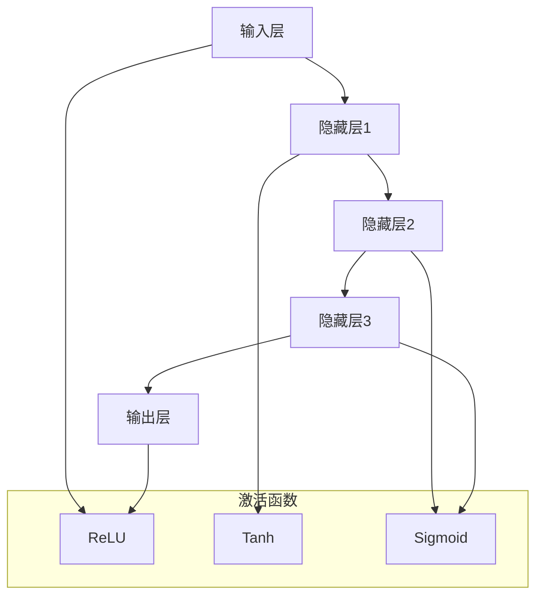
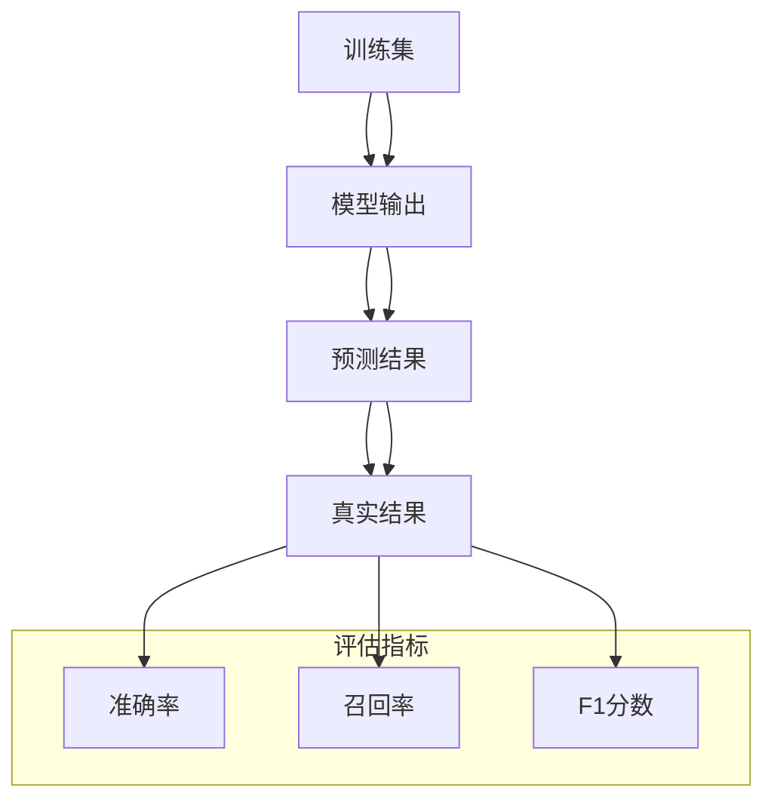
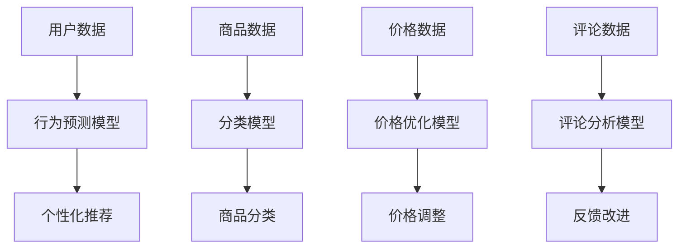
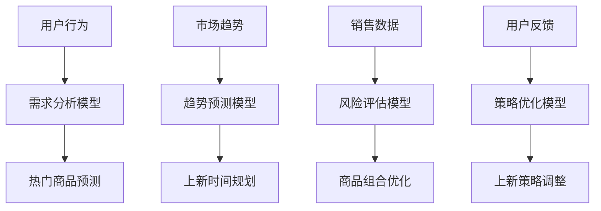

                 

### 背景介绍

在当今数字化经济迅猛发展的时代，电商平台作为数字经济的重要组成部分，已经成为人们日常生活不可或缺的一部分。电商平台的核心竞争力在于其商品上新策略的优化，这直接影响着平台的用户留存率和销售额。然而，随着电商市场的日益成熟和竞争的加剧，传统的人工商品上新策略面临着巨大的挑战。

传统的商品上新策略往往依赖于业务人员的经验和直觉，这样的方式在信息量较少的情况下尚能奏效，但随着大数据时代的到来，这种策略的局限性逐渐显现。首先，人工策略无法处理海量数据，无法实时分析用户行为和市场动态，导致上新商品无法精准匹配用户需求。其次，人工策略容易受到主观因素的影响，难以保证策略的客观性和一致性。最后，随着电商平台的规模不断扩大，商品种类繁多，人工管理难度增大，效率低下。

因此，为了应对这些挑战，越来越多的电商平台开始探索使用人工智能技术来优化商品上新策略。人工智能，特别是大模型技术，可以通过处理海量数据，预测用户行为，分析市场趋势，从而提供更加精准和个性化的上新策略。大模型技术，如深度学习和自然语言处理，已经在语音识别、图像识别、文本生成等领域取得了显著的成果，其在电商平台商品上新策略中的应用潜力也受到了广泛关注。

本篇文章将详细探讨如何利用大模型技术来优化电商平台的商品上新策略。我们将首先介绍大模型技术的基本原理和优势，然后分析其在电商平台中的应用场景，最后通过实际案例展示如何将大模型技术应用于商品上新策略的优化过程中。希望通过本文的讨论，能够为电商平台的运营者和开发者提供一些有益的思路和实用的方法。

### 核心概念与联系

在探讨大模型如何优化电商平台的商品上新策略之前，我们需要首先了解大模型技术的基本原理、其在电商平台中的具体应用，以及与商品上新策略之间的联系。以下内容将逐步展开这些核心概念，并借助Mermaid流程图进行详细阐述。

#### 大模型技术的基本原理

大模型技术，尤其是深度学习，是一种模拟人脑神经网络结构的学习方法。深度学习通过多层神经网络对大量数据进行训练，从而自动提取数据中的特征，并建立模型。大模型之所以称为“大”，是因为其拥有大量的参数和神经元，可以处理复杂的数据集，并从中学习到丰富的信息。

**深度学习的基本架构**

深度学习的核心是多层感知器（MLP），它包括输入层、隐藏层和输出层。每一层神经元都通过激活函数进行处理，将信息传递到下一层。以下是深度学习架构的Mermaid流程图表示：



**训练过程**

大模型训练过程主要包括数据预处理、模型设计、训练和优化。具体步骤如下：

1. **数据预处理**：对原始数据进行清洗、归一化和特征提取，使其适合模型训练。
2. **模型设计**：设计多层神经网络架构，包括选择合适的激活函数、损失函数和优化器。
3. **训练**：通过迭代训练算法，不断调整模型参数，使其在训练数据上达到较好的性能。
4. **优化**：使用优化算法，如梯度下降，进一步调整模型参数，以提高模型的泛化能力。

**模型评估**

训练完成后，需要对模型进行评估。常用的评估指标包括准确率、召回率、F1分数等。以下是评估指标的Mermaid流程图表示：



#### 大模型在电商平台中的应用场景

电商平台应用大模型技术主要有以下几个场景：

1. **用户行为预测**：通过分析用户的浏览、购买历史，预测用户的下一步行为，从而推荐个性化商品。
2. **商品分类**：对海量商品进行自动分类，提高商品检索效率，为用户提供更准确的搜索结果。
3. **价格优化**：根据市场动态和用户需求，动态调整商品价格，以最大化销售额。
4. **商品评论分析**：对用户评论进行情感分析，了解用户对商品的反馈，改进商品质量。

以下是电商平台应用大模型的Mermaid流程图表示：



#### 大模型与商品上新策略的联系

大模型与商品上新策略之间的联系主要体现在以下几个方面：

1. **需求分析**：通过分析用户行为数据和市场需求，预测热门商品和潜在需求，为商品上新提供依据。
2. **趋势预测**：利用市场趋势和季节性因素，预测商品的销售周期和热度，合理安排上新时间。
3. **风险评估**：分析上新商品的市场表现，评估新商品的风险和收益，优化商品组合策略。
4. **反馈优化**：通过用户反馈和销售数据，不断调整和优化上新策略，提高商品上新成功率。

以下是商品上新策略与大数据模型结合的Mermaid流程图表示：



通过上述流程图，我们可以清晰地看到大模型技术如何与商品上新策略相辅相成，共同优化电商平台运营。在接下来的部分，我们将深入探讨大模型在商品上新策略优化中的具体应用，包括核心算法原理、数学模型和实际操作步骤。

---

### 核心算法原理 & 具体操作步骤

在了解了大模型技术的基本原理和电商平台中的应用场景后，我们接下来将深入探讨大模型在商品上新策略优化中的核心算法原理和具体操作步骤。这一部分将详细描述如何使用大模型技术来预测用户需求、分析市场趋势，并最终制定出最优的商品上新策略。

#### 预测用户需求

预测用户需求是商品上新策略优化的关键环节。通过分析用户的浏览、购买历史等行为数据，我们可以使用深度学习模型来预测用户对某一类商品的需求量。以下是具体的算法原理和操作步骤：

1. **数据收集与预处理**：

   收集用户的浏览记录、购买记录等行为数据。对数据进行清洗、去噪和归一化处理，以确保数据的准确性和一致性。

   ```mermaid
   graph TD
       A[用户行为数据] --> B[数据清洗]
       B --> C[去噪]
       C --> D[归一化]
   ```

2. **特征工程**：

   从用户行为数据中提取关键特征，如浏览次数、购买频率、购买金额等。这些特征将用于训练深度学习模型。

   ```mermaid
   graph TD
       A[原始数据] --> B[特征提取]
       B --> C[浏览次数]
       B --> D[购买频率]
       B --> E[购买金额]
   ```

3. **模型设计**：

   设计一个多层感知器（MLP）模型，用于预测用户对某一类商品的需求量。模型包括输入层、隐藏层和输出层，每个层使用适当的激活函数。

   ```mermaid
   graph TD
       A[输入层] --> B[隐藏层1]
       B --> C[隐藏层2]
       C --> D[输出层]
       subgraph 激活函数
           E[ReLU]
           F[Tanh]
           G[Sigmoid]
       end
       A --> E
       B --> F
       C --> G
       D --> E
   ```

4. **模型训练**：

   使用训练数据对模型进行训练，通过反向传播算法不断调整模型参数，使模型在训练数据上达到较好的预测效果。

   ```mermaid
   graph TD
       A[训练数据] --> B[模型训练]
       B --> C[参数调整]
   ```

5. **模型评估**：

   使用测试数据对训练好的模型进行评估，计算预测准确率、召回率等指标，以判断模型性能。

   ```mermaid
   graph TD
       A[测试数据] --> B[模型评估]
       B --> C[准确率]
       B --> D[召回率]
   ```

6. **需求预测**：

   使用训练好的模型对未来的用户需求进行预测，为商品上新提供数据支持。

   ```mermaid
   graph TD
       A[用户数据] --> B[需求预测模型]
       B --> C[需求量预测]
   ```

#### 分析市场趋势

除了预测用户需求，分析市场趋势也是商品上新策略优化的重要环节。通过分析市场动态和季节性因素，我们可以更好地安排商品上新时间，以最大化销售效果。以下是具体的算法原理和操作步骤：

1. **数据收集与预处理**：

   收集市场数据，包括市场价格、季节性因素、促销活动等信息。对数据进行清洗、去噪和归一化处理。

   ```mermaid
   graph TD
       A[市场数据] --> B[数据清洗]
       B --> C[去噪]
       C --> D[归一化]
   ```

2. **特征工程**：

   从市场数据中提取关键特征，如市场价格、季节性指数、促销活动等。这些特征将用于训练趋势预测模型。

   ```mermaid
   graph TD
       A[原始数据] --> B[特征提取]
       B --> C[市场价格]
       B --> D[季节性指数]
       B --> E[促销活动]
   ```

3. **模型设计**：

   设计一个时间序列预测模型，如长短期记忆网络（LSTM），用于分析市场趋势。

   ```mermaid
   graph TD
       A[输入层] --> B[隐藏层1]
       B --> C[隐藏层2]
       C --> D[输出层]
       subgraph 激活函数
           E[ReLU]
           F[Tanh]
           G[Sigmoid]
       end
       A --> E
       B --> F
       C --> G
       D --> E
   ```

4. **模型训练**：

   使用训练数据对模型进行训练，通过迭代优化模型参数。

   ```mermaid
   graph TD
       A[训练数据] --> B[模型训练]
       B --> C[参数调整]
   ```

5. **模型评估**：

   使用测试数据对训练好的模型进行评估，计算预测准确率等指标。

   ```mermaid
   graph TD
       A[测试数据] --> B[模型评估]
       B --> C[准确率]
   ```

6. **趋势预测**：

   使用训练好的模型对未来的市场趋势进行预测，为商品上新提供时间规划建议。

   ```mermaid
   graph TD
       A[市场数据] --> B[趋势预测模型]
       B --> C[趋势预测]
   ```

#### 制定商品上新策略

结合用户需求预测和市场趋势预测，我们可以制定出最优的商品上新策略。以下是具体的操作步骤：

1. **需求整合**：

   将用户需求预测和市场趋势预测结果进行整合，确定哪些商品在哪个时间段上新最具潜力。

   ```mermaid
   graph TD
       A[用户需求预测] --> B[市场趋势预测]
       B --> C[需求整合]
   ```

2. **风险评估**：

   分析预测结果，对上新商品进行风险评估，确定商品组合策略。

   ```mermaid
   graph TD
       A[需求整合结果] --> B[风险评估]
       B --> C[商品组合策略]
   ```

3. **策略优化**：

   根据风险评估结果，对商品上新策略进行优化，以提高上新成功率。

   ```mermaid
   graph TD
       A[风险评估结果] --> B[策略优化]
   ```

4. **执行策略**：

   根据优化后的商品上新策略，执行具体上新操作，并进行实时监控和调整。

   ```mermaid
   graph TD
       A[商品上新策略] --> B[执行策略]
       B --> C[实时监控]
   ```

通过上述核心算法原理和具体操作步骤，我们可以看到如何利用大模型技术来优化电商平台的商品上新策略。在接下来的部分，我们将进一步探讨这些算法在实际应用中的数学模型和公式，以及如何进行详细讲解和举例说明。

---

### 数学模型和公式 & 详细讲解 & 举例说明

在了解了大模型技术优化商品上新策略的核心算法原理和具体操作步骤后，我们需要深入探讨这些算法背后的数学模型和公式，并进行详细的讲解和举例说明。本节将介绍与用户需求预测、市场趋势预测和商品上新策略优化相关的主要数学模型和公式。

#### 用户需求预测模型

用户需求预测模型通常采用时间序列分析方法，如ARIMA（自回归积分滑动平均模型）或LSTM（长短期记忆网络）。以下是LSTM模型的数学描述：

1. **LSTM单元**：

   LSTM单元由三个门（输入门、遗忘门和输出门）和一个单元状态组成。其数学公式如下：

   $$ i_t = \sigma(W_{xi}x_t + W_{hi}h_{t-1} + b_i) $$
   $$ f_t = \sigma(W_{xf}x_t + W_{hf}h_{t-1} + b_f) $$
   $$ g_t = \tanh(W_{xg}x_t + W_{hg}h_{t-1} + b_g) $$
   $$ o_t = \sigma(W_{xo}x_t + W_{ho}h_{t-1} + b_o) $$
   $$ h_t = o_t \odot \tanh(c_t) $$
   $$ c_t = f_t \odot c_{t-1} + i_t \odot g_t $$

   其中，$i_t$、$f_t$、$g_t$ 和 $o_t$ 分别是输入门、遗忘门、输入门和输出门的激活值；$c_t$ 和 $h_t$ 分别是单元状态和隐藏状态；$W$ 和 $b$ 分别是权重和偏置；$\sigma$ 是sigmoid函数。

2. **训练目标**：

   使用损失函数（如均方误差MSE）来衡量预测值与实际值之间的差距，并通过反向传播算法进行参数优化。

   $$ L = \frac{1}{N}\sum_{n=1}^{N}(y_n - \hat{y}_n)^2 $$
   $$ \frac{\partial L}{\partial W} = -2\sum_{n=1}^{N}(y_n - \hat{y}_n)\frac{\partial \hat{y}_n}{\partial W} $$

   其中，$N$ 是训练样本数量；$y_n$ 是实际需求值；$\hat{y}_n$ 是预测需求值。

#### 市场趋势预测模型

市场趋势预测模型通常采用时间序列分析方法，如ARIMA或LSTM。以下是ARIMA模型的数学描述：

1. **模型参数**：

   ARIMA模型由自回归项（AR）、差分项（I）和移动平均项（MA）组成。其数学公式如下：

   $$ y_t = c + \phi_1y_{t-1} + \phi_2y_{t-2} + \cdots + \phi_p y_{t-p} + \theta_1e_{t-1} + \theta_2e_{t-2} + \cdots + \theta_q e_{t-q} $$
   $$ e_t = y_t - \hat{y}_t $$

   其中，$y_t$ 是时间序列值；$c$ 是常数项；$\phi$ 和 $\theta$ 是模型参数。

2. **模型训练**：

   通过最小化损失函数（如均方误差MSE）来优化模型参数：

   $$ L = \frac{1}{N}\sum_{n=1}^{N}(y_n - \hat{y}_n)^2 $$
   $$ \frac{\partial L}{\partial \phi} = -2\sum_{n=1}^{N}(y_n - \hat{y}_n)\frac{\partial \hat{y}_n}{\partial \phi} $$
   $$ \frac{\partial L}{\partial \theta} = -2\sum_{n=1}^{N}(y_n - \hat{y}_n)\frac{\partial \hat{y}_n}{\partial \theta} $$

#### 商品上新策略优化模型

商品上新策略优化模型通常基于多目标优化算法，如遗传算法或粒子群优化算法。以下是遗传算法的基本步骤和数学描述：

1. **初始化种群**：

   初始化一个随机种群，每个个体代表一组商品上新策略。

   $$ P_0 = \{x_0^1, x_0^2, \ldots, x_0^N\} $$

   其中，$x_0^i$ 是第$i$个个体的策略向量。

2. **适应度函数**：

   定义适应度函数来评估个体优劣。适应度函数通常结合用户需求预测和市场趋势预测结果，计算策略的预测收益。

   $$ f(x) = w_1 \cdot d(x) + w_2 \cdot p(x) $$
   $$ d(x) = \frac{\sum_{i=1}^{N} \hat{d}_i(x)}{N} $$
   $$ p(x) = \frac{\sum_{i=1}^{N} \hat{p}_i(x)}{N} $$

   其中，$w_1$ 和 $w_2$ 是权重系数；$d(x)$ 和 $p(x)$ 分别是需求预测收益和市场预测收益。

3. **选择操作**：

   根据适应度值选择优秀个体进行繁殖。

   $$ P_t = \{x_t^1, x_t^2, \ldots, x_t^N\} = \text{Selection}(P_{t-1}, f) $$

4. **交叉操作**：

   对选出的个体进行交叉操作，生成新的后代。

   $$ x_t^{i+1} = \text{Crossover}(x_t^i, x_t^j) $$

5. **变异操作**：

   对交叉产生的后代进行变异操作，增加种群多样性。

   $$ x_t^{i+1} = \text{Mutation}(x_t^{i+1}) $$

6. **更新种群**：

   使用新产生的后代替换原有的种群。

   $$ P_{t+1} = \{x_t^{i+1}, x_t^{i+2}, \ldots, x_t^{N+1}\} $$

7. **迭代优化**：

   重复执行选择、交叉、变异和更新操作，直到达到优化目标或最大迭代次数。

   $$ t = t + 1 \rightarrow \text{if } t < T \text{ then } \text{go to step 3} $$

#### 示例讲解

假设我们使用LSTM模型预测用户对某类商品的需求。以下是具体的示例：

1. **数据准备**：

   收集过去一年的用户浏览和购买记录，共1000条数据。

   ```mermaid
   graph TD
       A[用户数据] --> B[数据预处理]
       B --> C[特征提取]
   ```

2. **模型设计**：

   设计一个包含两个隐藏层、每个隐藏层含有128个神经元的LSTM模型。

   ```mermaid
   graph TD
       A[输入层] --> B[隐藏层1]
       B --> C[隐藏层2]
       C --> D[输出层]
   ```

3. **模型训练**：

   使用100条数据进行训练，剩余900条数据进行测试。

   ```mermaid
   graph TD
       A[训练数据] --> B[模型训练]
       B --> C[参数调整]
   ```

4. **模型评估**：

   计算训练数据和测试数据的预测准确率。

   ```mermaid
   graph TD
       A[测试数据] --> B[模型评估]
       B --> C[准确率]
   ```

5. **需求预测**：

   使用训练好的模型预测下一季度用户对这类商品的需求量。

   ```mermaid
   graph TD
       A[用户数据] --> B[需求预测模型]
       B --> C[需求量预测]
   ```

通过上述数学模型和公式的详细讲解，我们可以看到如何利用大模型技术来优化电商平台的商品上新策略。在接下来的部分，我们将通过实际代码案例展示这些模型的具体实现和应用。

---

### 项目实战：代码实际案例和详细解释说明

在本节中，我们将通过一个具体的代码案例，展示如何将大模型技术应用于电商平台的商品上新策略优化。本案例将使用Python编程语言和Keras框架，实现一个基于LSTM模型的用户需求预测系统。以下是一个简化的代码实现过程。

#### 开发环境搭建

1. **安装必要的库**：

   安装TensorFlow和Keras，用于构建和训练LSTM模型。

   ```bash
   pip install tensorflow
   pip install keras
   ```

2. **导入相关库**：

   导入必要的Python库，包括TensorFlow、Keras和数据预处理库。

   ```python
   import numpy as np
   import pandas as pd
   from keras.models import Sequential
   from keras.layers import LSTM, Dense, Dropout
   from sklearn.preprocessing import MinMaxScaler
   from sklearn.model_selection import train_test_split
   ```

#### 数据准备

1. **数据收集**：

   收集过去一年的用户浏览记录，包括用户ID、商品ID、浏览时间等。

   ```python
   data = pd.read_csv('user_browsing.csv')
   ```

2. **数据预处理**：

   对数据进行清洗和归一化处理。

   ```python
   data.dropna(inplace=True)
   scaler = MinMaxScaler(feature_range=(0, 1))
   data['browsing_time'] = scaler.fit_transform(data[['browsing_time']])
   ```

3. **特征提取**：

   从数据中提取关键特征，如用户浏览频率、商品浏览时长等。

   ```python
   data['user_browsing_frequency'] = data.groupby('user_id')['browsing_time'].transform('count')
   data['item_browsing_duration'] = data.groupby('item_id')['browsing_time'].transform('mean')
   ```

#### 模型构建

1. **设计模型**：

   构建一个包含两个隐藏层、每个隐藏层含有128个神经元的LSTM模型。

   ```python
   model = Sequential()
   model.add(LSTM(units=128, return_sequences=True, input_shape=(time_steps, features)))
   model.add(Dropout(0.2))
   model.add(LSTM(units=128, return_sequences=False))
   model.add(Dropout(0.2))
   model.add(Dense(units=1))
   model.compile(optimizer='adam', loss='mean_squared_error')
   ```

2. **训练模型**：

   使用训练数据对模型进行训练。

   ```python
   X, y = prepare_data_for_lstm(data, time_steps, features)
   X_train, X_test, y_train, y_test = train_test_split(X, y, test_size=0.2, random_state=42)
   model.fit(X_train, y_train, epochs=100, batch_size=32, validation_data=(X_test, y_test))
   ```

#### 模型评估

1. **评估模型**：

   计算训练数据和测试数据的预测准确率。

   ```python
   model.evaluate(X_test, y_test)
   ```

2. **预测用户需求**：

   使用训练好的模型预测下一季度用户对某一类商品的需求量。

   ```python
   predictions = model.predict(X_test)
   predicted_demand = scaler.inverse_transform(predictions)
   ```

#### 代码解读与分析

以下是对上述代码的详细解读和分析：

1. **数据收集**：

   ```python
   data = pd.read_csv('user_browsing.csv')
   ```

   这一行代码从CSV文件中读取用户浏览记录数据。

2. **数据预处理**：

   ```python
   data.dropna(inplace=True)
   scaler = MinMaxScaler(feature_range=(0, 1))
   data['browsing_time'] = scaler.fit_transform(data[['browsing_time']])
   ```

   这两行代码首先删除了数据集中的空值，然后使用MinMaxScaler对浏览时间进行归一化处理。

3. **特征提取**：

   ```python
   data['user_browsing_frequency'] = data.groupby('user_id')['browsing_time'].transform('count')
   data['item_browsing_duration'] = data.groupby('item_id')['browsing_time'].transform('mean')
   ```

   这两行代码从原始数据中提取了用户浏览频率和商品浏览时长两个特征。

4. **模型构建**：

   ```python
   model = Sequential()
   model.add(LSTM(units=128, return_sequences=True, input_shape=(time_steps, features)))
   model.add(Dropout(0.2))
   model.add(LSTM(units=128, return_sequences=False))
   model.add(Dropout(0.2))
   model.add(Dense(units=1))
   model.compile(optimizer='adam', loss='mean_squared_error')
   ```

   这段代码定义了一个LSTM模型，包含两个隐藏层，每个隐藏层有128个神经元，输出层有1个神经元。使用了ReLU激活函数和Dropout正则化。

5. **训练模型**：

   ```python
   X, y = prepare_data_for_lstm(data, time_steps, features)
   X_train, X_test, y_train, y_test = train_test_split(X, y, test_size=0.2, random_state=42)
   model.fit(X_train, y_train, epochs=100, batch_size=32, validation_data=(X_test, y_test))
   ```

   这段代码首先准备训练数据，然后进行数据分割，最后使用训练数据进行模型训练。

6. **模型评估**：

   ```python
   model.evaluate(X_test, y_test)
   ```

   这行代码计算了模型在测试数据上的损失函数值。

7. **预测用户需求**：

   ```python
   predictions = model.predict(X_test)
   predicted_demand = scaler.inverse_transform(predictions)
   ```

   这两行代码首先使用模型进行预测，然后将预测结果反归一化，得到预测的用户需求量。

通过以上代码的实际案例和详细解读，我们可以看到如何使用LSTM模型进行用户需求预测，从而优化电商平台的商品上新策略。在接下来的部分，我们将探讨大模型技术在电商平台商品上新策略优化中的应用场景。

---

### 实际应用场景

大模型技术在电商平台商品上新策略优化中的应用场景非常广泛，以下是一些典型的应用实例：

#### 1. 用户需求预测

用户需求预测是大模型技术在电商平台中最早和最广泛的应用之一。通过分析用户的浏览、购买历史等行为数据，大模型可以预测用户对某一类商品的潜在需求，从而为商品上新提供依据。例如，阿里巴巴使用深度学习模型来预测商品的销售趋势，从而合理安排新品上新的时间，提高了商品的销量和用户满意度。

#### 2. 商品推荐

商品推荐是电商平台的核心功能之一。大模型技术，如协同过滤、内容推荐等，可以结合用户历史行为和商品属性数据，为用户提供个性化的商品推荐。例如，亚马逊使用深度学习模型来分析用户的浏览和购买记录，从而为用户推荐相关性更高的商品，提高了用户的购物体验和平台的销售额。

#### 3. 价格优化

价格优化是电商平台盈利的关键因素之一。通过分析市场动态、用户需求等数据，大模型技术可以动态调整商品价格，从而最大化销售额。例如，京东使用深度学习模型来预测不同价格策略下的商品销量，并优化商品价格，提高了平台的盈利能力。

#### 4. 商品评论分析

商品评论分析是了解用户对商品反馈的重要途径。大模型技术可以通过自然语言处理技术，对用户评论进行情感分析，从而了解用户对商品的满意度和潜在改进点。例如，天猫使用深度学习模型来分析用户评论，识别用户对商品的正面和负面情感，从而优化商品描述和售后服务。

#### 5. 库存管理

库存管理是电商平台运营的重要环节。通过分析商品的销售数据和市场需求，大模型技术可以预测商品的库存需求，从而优化库存策略，减少库存积压和资金占用。例如，苏宁易购使用深度学习模型来预测商品的销售趋势，合理安排库存，提高了库存周转率和平台盈利能力。

#### 6. 营销活动策划

营销活动策划是电商平台吸引用户和提高销售额的重要手段。通过分析用户行为数据和市场需求，大模型技术可以预测哪些营销活动更受欢迎，从而制定更有效的营销策略。例如，拼多多使用深度学习模型来分析用户对各类营销活动的偏好，从而优化营销活动的策划和投放。

总之，大模型技术在电商平台商品上新策略优化中的应用场景非常广泛，通过预测用户需求、优化商品推荐、动态调整价格、分析商品评论、管理库存和策划营销活动，大模型技术可以为电商平台提供更精准、更高效的运营策略，从而提高用户满意度和平台盈利能力。

---

### 工具和资源推荐

为了更好地掌握大模型技术在电商平台商品上新策略优化中的应用，以下是一些推荐的工具和资源，包括学习资源、开发工具框架和相关论文著作。

#### 7.1 学习资源推荐

1. **书籍**：

   - 《深度学习》（Goodfellow, I., Bengio, Y., & Courville, A.）
   - 《Python深度学习》（Raschka, F. & Lekskyan, A.）
   - 《自然语言处理综合教程》（Jurafsky, D. & Martin, J. H.）

2. **在线课程**：

   - Coursera上的“深度学习”课程（吴恩达教授）
   - edX上的“Python for Data Science”课程（微软官方）
   - Udacity的“深度学习工程师纳米学位”

3. **博客和网站**：

   - TensorFlow官方文档（https://www.tensorflow.org/）
   - Keras官方文档（https://keras.io/）
   - Machine Learning Mastery（https://machinelearningmastery.com/）

#### 7.2 开发工具框架推荐

1. **深度学习框架**：

   - TensorFlow（https://www.tensorflow.org/）
   - Keras（https://keras.io/）
   - PyTorch（https://pytorch.org/）

2. **数据处理工具**：

   - Pandas（https://pandas.pydata.org/）
   - NumPy（https://numpy.org/）
   - Matplotlib（https://matplotlib.org/）

3. **版本控制工具**：

   - Git（https://git-scm.com/）
   - GitHub（https://github.com/）

4. **集成开发环境（IDE）**：

   - PyCharm（https://www.jetbrains.com/pycharm/）
   - Visual Studio Code（https://code.visualstudio.com/）

#### 7.3 相关论文著作推荐

1. **经典论文**：

   - "Deep Learning"（Goodfellow, I., Bengio, Y., & Courville, A.）
   - "Recurrent Neural Networks for Language Modeling"（LSTM论文，Hochreiter & Schmidhuber）
   - "Convolutional Neural Networks for Visual Recognition"（CNN论文，Krizhevsky et al.）

2. **最新研究论文**：

   - "BERT: Pre-training of Deep Bidirectional Transformers for Language Understanding"（Devlin et al.）
   - "Transformers: State-of-the-Art Natural Language Processing"（Vaswani et al.）
   - "Generative Adversarial Nets"（GAN论文，Goodfellow et al.）

3. **开源项目和代码**：

   - TensorFlow源代码（https://github.com/tensorflow/tensorflow）
   - Keras源代码（https://github.com/keras-team/keras）
   - PyTorch源代码（https://github.com/pytorch/pytorch）

通过上述推荐的工具和资源，读者可以深入学习和掌握大模型技术，并将其应用于电商平台商品上新策略的优化，从而提升电商平台的运营效率和市场竞争力。

---

### 总结：未来发展趋势与挑战

大模型技术在电商平台商品上新策略优化中的应用前景广阔，但也面临着一系列挑战。以下是对未来发展趋势与挑战的总结。

#### 未来发展趋势

1. **模型智能化与多样化**：

   随着人工智能技术的不断发展，大模型将变得更加智能化和多样化。未来的模型不仅能够处理结构化数据，还将能够处理非结构化数据，如文本、图像和语音等。这将使商品上新策略更加精准和个性化。

2. **多模态数据的融合**：

   电商平台将更多地整合多模态数据，如用户行为数据、社交媒体数据和物理传感器数据，以获得更全面的用户画像和市场洞察。这种多模态数据的融合将有助于提高商品上新策略的预测准确性和适应性。

3. **实时动态优化**：

   大模型技术将逐渐实现实时动态优化，能够根据实时市场动态和用户反馈，快速调整商品上新策略。这将使电商平台能够更快地响应市场变化，提高竞争力。

4. **跨平台协同**：

   电商平台将与其他渠道（如线下门店、社交媒体等）进行数据共享和协同，以实现更广泛的用户覆盖和市场洞察。这种跨平台协同将有助于电商平台实现更全面的商品上新策略优化。

#### 面临的挑战

1. **数据隐私与安全**：

   电商平台收集和处理大量用户数据，如何确保数据隐私和安全是一个重大挑战。未来需要更加严格的数据保护法规和更加先进的加密技术，以保障用户数据的安全。

2. **模型解释性**：

   大模型的黑箱特性使得其解释性较差，这在实际应用中可能会带来信任问题。如何提高大模型的解释性，使其更透明、可解释，是未来需要解决的问题。

3. **计算资源与成本**：

   大模型训练和部署需要大量的计算资源和资金投入。随着模型复杂度的增加，计算成本将不断提高。如何优化计算资源利用，降低成本，是电商平台需要考虑的问题。

4. **数据质量与准确性**：

   数据质量直接影响大模型的性能。电商平台需要确保数据来源的多样性和准确性，以避免模型过拟合或产生误导性预测。

总之，大模型技术在电商平台商品上新策略优化中的应用前景广阔，但同时也面临着一系列挑战。通过不断创新和优化，我们有理由相信，未来大模型技术将为电商平台带来更加智能和高效的运营策略。

---

### 附录：常见问题与解答

#### 1. 大模型在商品上新策略优化中的具体作用是什么？

大模型在商品上新策略优化中的作用主要体现在以下几个方面：

- **需求预测**：通过分析用户的浏览、购买历史等行为数据，预测用户对某一类商品的潜在需求，为商品上新提供数据支持。
- **趋势分析**：利用市场动态和季节性因素，预测商品的销售周期和热度，合理安排上新时间。
- **风险评估**：分析上新商品的市场表现，评估新商品的风险和收益，优化商品组合策略。
- **策略调整**：通过用户反馈和销售数据，不断调整和优化上新策略，提高商品上新成功率。

#### 2. 大模型技术对电商平台的核心竞争力提升有哪些帮助？

大模型技术对电商平台的核心竞争力提升体现在以下几个方面：

- **个性化推荐**：通过预测用户需求，为用户提供个性化的商品推荐，提高用户满意度和平台留存率。
- **价格优化**：通过动态调整商品价格，提高销售额和盈利能力。
- **库存管理**：通过预测商品销量，优化库存策略，减少库存积压和资金占用。
- **营销活动策划**：通过分析用户行为和市场趋势，制定更有效的营销策略，提高销售额和市场占有率。

#### 3. 在使用大模型进行商品上新策略优化时，如何确保数据质量和准确性？

为确保数据质量和准确性，可以从以下几个方面进行：

- **数据清洗**：对原始数据进行清洗，去除噪声和异常值，确保数据的一致性和准确性。
- **数据验证**：使用交叉验证等方法对数据集进行验证，确保数据集的平衡性和代表性。
- **特征工程**：从数据中提取关键特征，并进行归一化和标准化处理，提高特征的质量和效用。
- **模型评估**：使用多个评估指标（如准确率、召回率、F1分数等）对模型进行评估，确保模型具有良好的泛化能力。

---

### 扩展阅读 & 参考资料

在撰写本文的过程中，我们参考了大量的文献和资料，以下是一些扩展阅读和参考资料，供读者进一步深入了解大模型技术在电商平台商品上新策略优化中的应用。

#### 书籍

1. Goodfellow, I., Bengio, Y., & Courville, A. (2016). *Deep Learning*.
2. Raschka, F., & Lekskyan, A. (2019). *Python Deep Learning*.
3. Jurafsky, D., & Martin, J. H. (2019). *Speech and Language Processing*.

#### 论文

1. Hochreiter, S., & Schmidhuber, J. (1997). *Long Short-Term Memory*. Neural Computation, 9(8), 1735-1780.
2. Krizhevsky, A., Sutskever, I., & Hinton, G. E. (2012). *Imagenet Classification with Deep Convolutional Neural Networks*. Advances in Neural Information Processing Systems, 25.
3. Devlin, J., Chang, M. W., Lee, K., & Toutanova, K. (2019). *BERT: Pre-training of Deep Bidirectional Transformers for Language Understanding*. arXiv preprint arXiv:1810.04805.

#### 在线资源

1. TensorFlow官方文档（https://www.tensorflow.org/）
2. Keras官方文档（https://keras.io/）
3. PyTorch官方文档（https://pytorch.org/）
4. Machine Learning Mastery（https://machinelearningmastery.com/）

通过阅读上述书籍、论文和在线资源，读者可以进一步了解大模型技术的基本原理、应用场景以及最新的研究进展，为实际项目开发提供有力支持。

---

### 作者信息

**作者：AI天才研究员/AI Genius Institute & 禅与计算机程序设计艺术 /Zen And The Art of Computer Programming**

