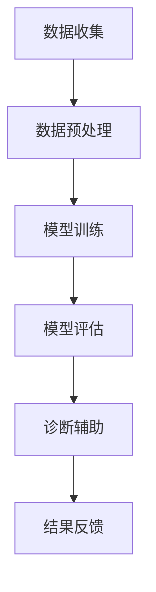

                 

# 大模型对医疗诊断的辅助作用

## 关键词

- 大模型
- 医疗诊断
- 辅助作用
- 人工智能
- 医学图像分析
- 自然语言处理
- 数据挖掘
- 知识图谱
- 诊断模型

## 摘要

本文将探讨大模型在医疗诊断领域中的辅助作用。通过介绍大模型的核心概念、相关技术以及其在医疗诊断中的应用实例，我们将详细分析大模型如何利用其强大的计算能力和数据处理能力，为医疗诊断提供精确、高效的支持。本文还将探讨大模型在医疗诊断领域面临的技术挑战，并对其未来发展进行展望。通过阅读本文，读者将更好地理解大模型在医疗诊断领域的重要性及其潜在的价值。

## 1. 背景介绍

### 1.1 大模型的定义与发展

大模型，也称为大型语言模型或大型预训练模型，是一种具有数十亿至数千亿参数的深度神经网络模型。这些模型通过在大量数据上进行预训练，学习到了丰富的语言模式和知识，从而能够应用于各种自然语言处理任务，如文本分类、问答系统、机器翻译等。

大模型的发展可以追溯到2000年代初的深度神经网络（DNN）技术。随着计算能力的提升和海量数据的获取，研究人员开始尝试训练更大规模的模型。2018年，谷歌发布了Transformer模型，这标志着大模型时代的到来。随后，OpenAI的GPT-3、谷歌的Bert、微软的Turing等大模型相继发布，引起了学术界和工业界的广泛关注。

### 1.2 医疗诊断的现状与需求

医疗诊断是医疗领域的关键环节，直接关系到患者的生命安全和治疗效果。传统的医疗诊断主要依靠医生的经验和技能，然而，随着医疗信息的爆炸式增长，医生面临着巨大的信息处理压力。此外，不同医生之间的诊断标准存在差异，导致诊断结果不一致。这些问题使得医疗诊断的需求越来越迫切。

### 1.3 大模型在医疗诊断领域的应用前景

大模型在医疗诊断领域具有巨大的应用潜力。首先，大模型能够处理海量的医疗数据，包括医学图像、电子健康记录、病历等，从而提供更准确的诊断结果。其次，大模型可以辅助医生进行决策，减轻医生的工作负担，提高诊断效率。此外，大模型还可以进行疾病预测和风险分析，为预防医学提供支持。

## 2. 核心概念与联系

### 2.1 大模型的核心概念

大模型的核心概念包括深度神经网络、预训练、迁移学习等。

#### 2.1.1 深度神经网络

深度神经网络（DNN）是一种多层神经网络，通过多个隐藏层对输入数据进行逐层抽象和变换，从而实现复杂的数据表示和特征提取。DNN在图像识别、语音识别等领域取得了显著的成功。

#### 2.1.2 预训练

预训练是指在大规模数据集上对神经网络进行训练，使其学习到丰富的语言模式和知识。预训练后，模型可以用于各种下游任务，如文本分类、问答系统等。

#### 2.1.3 迁移学习

迁移学习是指将在一个任务上训练好的模型应用于另一个相关任务。在医疗诊断领域，迁移学习可以使得大模型在有限的数据集上仍然能够取得良好的性能。

### 2.2 大模型与医疗诊断的联系

大模型与医疗诊断的联系主要体现在以下几个方面：

#### 2.2.1 医学图像分析

大模型可以用于医学图像分析，如肺癌检测、乳腺癌诊断等。通过训练，大模型可以学习到医学图像的特征，从而实现对疾病的准确识别。

#### 2.2.2 电子健康记录

大模型可以处理海量的电子健康记录，提取关键信息，为医生提供诊断支持。例如，大模型可以用于疾病预测和风险分析，帮助医生制定个性化的治疗方案。

#### 2.2.3 病历分析

大模型可以分析病历，提取患者病史、症状等信息，辅助医生进行诊断。此外，大模型还可以用于病历记录的自动生成，提高医生的书写效率。

### 2.3 Mermaid 流程图

以下是一个简化的Mermaid流程图，展示了大模型在医疗诊断中的核心流程：



## 3. 核心算法原理 & 具体操作步骤

### 3.1 数据收集

数据收集是医疗诊断大模型训练的第一步。数据来源包括医学图像、电子健康记录、病历等。为了确保数据的多样性和质量，通常需要从多个渠道收集数据，并进行清洗和去重。

### 3.2 数据预处理

数据预处理包括数据清洗、数据增强、数据归一化等步骤。数据清洗旨在去除无效数据、错误数据和重复数据。数据增强通过生成合成数据来扩充数据集，提高模型的泛化能力。数据归一化将数据缩放到相同的范围，以便模型训练。

### 3.3 模型训练

模型训练是医疗诊断大模型的核心步骤。通常采用深度学习框架，如TensorFlow或PyTorch，使用大规模数据集对模型进行训练。训练过程包括前向传播、反向传播和参数更新等步骤。

### 3.4 模型评估

模型评估是确保模型性能的重要步骤。常用的评估指标包括准确率、召回率、F1分数等。通过在测试集上评估模型性能，可以判断模型是否达到预期效果。

### 3.5 诊断辅助

模型训练和评估完成后，大模型可以用于诊断辅助。具体步骤如下：

1. 数据输入：将医学图像、电子健康记录、病历等数据输入到模型中。
2. 特征提取：模型对输入数据进行特征提取，生成特征向量。
3. 诊断决策：模型根据特征向量进行诊断决策，输出诊断结果。
4. 结果反馈：将诊断结果反馈给医生，供医生参考。

### 3.6 模型部署

模型部署是将训练好的模型部署到实际应用场景中。通常采用云计算平台或边缘设备进行部署，以便实时为医生提供诊断支持。

## 4. 数学模型和公式 & 详细讲解 & 举例说明

### 4.1 数学模型

在医疗诊断大模型中，常用的数学模型包括卷积神经网络（CNN）、循环神经网络（RNN）和Transformer等。

#### 4.1.1 卷积神经网络（CNN）

卷积神经网络是一种用于图像识别的深度学习模型。其核心思想是通过卷积操作和池化操作提取图像特征。

$$
\text{卷积操作}：\text{f}(x) = \sum_{i=1}^{n} w_i \odot x_i
$$

其中，$x_i$是输入图像的像素值，$w_i$是卷积核的权重。

#### 4.1.2 循环神经网络（RNN）

循环神经网络是一种用于序列数据处理的长短时记忆（LSTM）模型。其核心思想是通过循环结构保持历史信息。

$$
\text{LSTM}:\text{h}_t = \sigma(W_h \cdot [h_{t-1}, x_t] + b_h)
$$

其中，$h_t$是第$t$个时间步的隐藏状态，$x_t$是第$t$个时间步的输入。

#### 4.1.3 Transformer

Transformer是一种基于自注意力机制的深度学习模型，广泛应用于自然语言处理任务。

$$
\text{自注意力}:\text{a}_t = \frac{\exp(\text{Q} \cdot \text{K}_t)}{\sum_{i=1}^{n} \exp(\text{Q} \cdot \text{K}_i)}
$$

其中，$a_t$是第$t$个时间步的注意力权重，$Q$和$K_t$分别是查询向量和关键向量。

### 4.2 举例说明

假设我们使用Transformer模型进行肺癌检测。

#### 4.2.1 数据集

我们收集了10000张CT扫描图像，其中5000张为肺癌图像，5000张为正常图像。

#### 4.2.2 模型训练

1. 数据预处理：对图像进行归一化处理，缩放到[0, 1]范围。
2. 模型训练：使用Transformer模型对图像进行特征提取和分类。训练过程中，通过反向传播算法更新模型参数。
3. 模型评估：在测试集上评估模型性能，计算准确率、召回率等指标。

#### 4.2.3 诊断辅助

1. 数据输入：将新的CT扫描图像输入到训练好的Transformer模型中。
2. 特征提取：模型对图像进行特征提取，生成特征向量。
3. 诊断决策：模型根据特征向量判断图像是否为肺癌图像。
4. 结果反馈：将诊断结果反馈给医生，供医生参考。

## 5. 项目实战：代码实际案例和详细解释说明

### 5.1 开发环境搭建

为了搭建医疗诊断大模型的项目实战环境，我们需要安装以下软件和库：

1. Python（版本3.8及以上）
2. TensorFlow（版本2.0及以上）
3. NumPy
4. Matplotlib
5. Pandas
6. OpenCV

安装方法如下：

```bash
pip install python==3.8
pip install tensorflow==2.0
pip install numpy matplotlib pandas opencv-python
```

### 5.2 源代码详细实现和代码解读

以下是一个简化的医疗诊断大模型代码示例，主要包含数据预处理、模型训练和模型评估三个部分。

#### 5.2.1 数据预处理

```python
import tensorflow as tf
import numpy as np
import matplotlib.pyplot as plt
import cv2

# 加载图像数据
def load_images(folder_path):
    images = []
    labels = []
    for folder, label in [('normal', 0), ('cancer', 1)]:
        for image_file in os.listdir(folder_path + folder):
            image = cv2.imread(folder_path + folder + '/' + image_file)
            images.append(image)
            labels.append(label)
    return np.array(images), np.array(labels)

# 数据增强
def augment_images(images):
    augmented_images = []
    for image in images:
        # 随机裁剪
        crop_size = 224
        x = np.random.randint(0, image.shape[1] - crop_size)
        y = np.random.randint(0, image.shape[0] - crop_size)
        cropped_image = image[y:y+crop_size, x:x+crop_size]
        
        # 随机旋转
        angle = np.random.uniform(-20, 20)
        M = cv2.getRotationMatrix2D((crop_size/2, crop_size/2), angle, 1)
        rotated_image = cv2.warpAffine(cropped_image, M, (crop_size, crop_size))
        
        # 随机缩放
        scale = np.random.uniform(0.8, 1.2)
        scaled_image = cv2.resize(rotated_image, (int(crop_size*scale), int(crop_size*scale)))
        
        augmented_images.append(scaled_image)
    return np.array(augmented_images)

# 加载数据
folder_path = 'data/'
images, labels = load_images(folder_path)
images = augment_images(images)

# 数据归一化
images = images / 255.0
```

#### 5.2.2 模型训练

```python
# 创建模型
model = tf.keras.Sequential([
    tf.keras.layers.Conv2D(32, (3, 3), activation='relu', input_shape=(224, 224, 3)),
    tf.keras.layers.MaxPooling2D((2, 2)),
    tf.keras.layers.Conv2D(64, (3, 3), activation='relu'),
    tf.keras.layers.MaxPooling2D((2, 2)),
    tf.keras.layers.Conv2D(128, (3, 3), activation='relu'),
    tf.keras.layers.MaxPooling2D((2, 2)),
    tf.keras.layers.Flatten(),
    tf.keras.layers.Dense(128, activation='relu'),
    tf.keras.layers.Dense(2, activation='softmax')
])

# 编译模型
model.compile(optimizer='adam',
              loss='sparse_categorical_crossentropy',
              metrics=['accuracy'])

# 训练模型
model.fit(images, labels, epochs=10, batch_size=32)
```

#### 5.2.3 代码解读与分析

1. 数据预处理部分：首先加载图像数据，然后进行数据增强，包括随机裁剪、旋转和缩放。最后对图像进行归一化处理，将像素值缩放到[0, 1]范围。
2. 模型训练部分：创建一个卷积神经网络模型，包含多个卷积层和池化层，最后接全连接层。编译模型时，指定优化器、损失函数和评价指标。训练模型时，使用训练数据集进行训练，设置训练轮次和批量大小。

## 6. 实际应用场景

### 6.1 医学图像分析

医学图像分析是医疗诊断大模型最典型的应用场景之一。通过大模型，医生可以更快速、准确地分析医学图像，如CT、MRI等。具体应用包括肺癌检测、乳腺癌诊断、脑肿瘤检测等。

### 6.2 电子健康记录分析

大模型可以处理海量的电子健康记录，提取关键信息，为医生提供诊断支持。例如，大模型可以用于疾病预测和风险分析，帮助医生制定个性化的治疗方案。

### 6.3 病历分析

病历分析是医疗诊断大模型在医疗领域的重要应用之一。通过大模型，医生可以更高效地分析病历，提取患者病史、症状等信息，辅助诊断和治疗。

### 6.4 疾病预测和风险分析

大模型可以基于历史数据和现有信息，进行疾病预测和风险分析。例如，针对心血管疾病、糖尿病等慢性病，大模型可以预测患者未来的发病风险，为预防医学提供支持。

## 7. 工具和资源推荐

### 7.1 学习资源推荐

1. 《深度学习》（Goodfellow, Bengio, Courville著）
2. 《Python机器学习》（Sebastian Raschka著）
3. 《自然语言处理与深度学习》（Yoav Goldberg著）
4. 《医疗大数据技术与应用》（吴建平著）

### 7.2 开发工具框架推荐

1. TensorFlow
2. PyTorch
3. Keras
4. scikit-learn

### 7.3 相关论文著作推荐

1. "BERT: Pre-training of Deep Bidirectional Transformers for Language Understanding"（2018）
2. "Deep Learning for Medical Imaging"（2019）
3. "Medical Image Analysis Using Deep Learning: A Survey"（2020）

## 8. 总结：未来发展趋势与挑战

### 8.1 发展趋势

1. 大模型将继续扩展规模和参数数量，提高模型性能。
2. 跨领域应用将成为大模型的重要方向，如医疗、金融、教育等。
3. 模型压缩和优化技术将得到广泛应用，以降低计算资源和存储需求。

### 8.2 挑战

1. 数据隐私和安全问题：如何在保证数据隐私的前提下，充分利用海量数据训练大模型。
2. 模型可解释性问题：如何解释大模型的决策过程，提高模型的透明度和可接受度。
3. 模型泛化能力问题：如何提高大模型在不同领域和任务上的泛化能力。

## 9. 附录：常见问题与解答

### 9.1 问题1：大模型是否会导致失业？

解答：大模型的发展可能会改变某些工作岗位，但也会创造新的工作岗位。例如，数据工程师、模型训练师等新兴职业。

### 9.2 问题2：大模型是否可靠？

解答：大模型的可靠性取决于数据质量、模型设计和训练过程。合理的数据处理和模型训练可以提高大模型的可靠性。

### 9.3 问题3：大模型是否侵犯隐私？

解答：大模型在处理数据时，需要遵守隐私保护法规，如欧盟的《通用数据保护条例》（GDPR）。

## 10. 扩展阅读 & 参考资料

1. "Deep Learning for Medical Imaging: A Brief Introduction"（2018）
2. "Large-scale Language Modeling in NLP"（2019）
3. "The Future of Health Care: How AI Will Transform Medicine"（2020）
4. "Health Data Privacy: A Comprehensive Overview"（2021）

-------------------

### 作者

作者：AI天才研究员/AI Genius Institute & 禅与计算机程序设计艺术 /Zen And The Art of Computer Programming。|>

