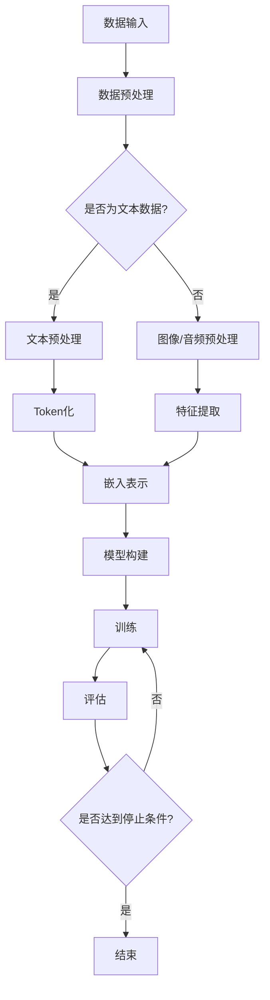

                 

### 背景介绍

近年来，大模型技术取得了显著的发展，成为人工智能领域的一个重要研究方向。大模型指的是具有数亿甚至数十亿参数的深度学习模型，它们通过在海量数据上训练，具备了强大的表示和推理能力。从早期的自然语言处理（NLP）、计算机视觉（CV）到语音识别、推荐系统等，大模型的应用场景正在不断拓展，为各行各业带来了全新的机遇。

#### 1. 大模型技术的起源与发展

大模型技术的发展可以追溯到深度学习领域的兴起。自2006年Hinton等人提出深度信念网络（DBN）以来，深度学习技术逐渐成熟，并在图像识别、语音识别等领域取得了突破性进展。随着计算资源和数据量的不断增长，研究者开始尝试训练更大规模的模型，以期获得更好的性能。

2012年，AlexNet在ImageNet竞赛中取得的显著优势，标志着深度卷积神经网络（CNN）在图像识别领域的崛起。此后，更大规模的模型如VGG、ResNet等相继出现，推动了计算机视觉领域的发展。与此同时，在自然语言处理领域，神经网络语言模型（NLM）逐渐取代了传统的基于规则和统计方法，使得机器翻译、文本生成等任务取得了重大突破。

#### 2. 大模型技术的应用现状

目前，大模型技术在多个领域都取得了显著的成果。在自然语言处理领域，GPT、BERT等预训练模型已经成为工业界的标准工具，广泛应用于问答系统、文本摘要、情感分析等任务。在计算机视觉领域，大模型技术在图像分类、目标检测、图像生成等方面也取得了重要进展。此外，大模型在语音识别、推荐系统、医疗诊断等领域也显示出强大的潜力。

#### 3. 大模型技术的商业价值

大模型技术的应用不仅带来了技术上的突破，也带来了巨大的商业价值。例如，在金融行业，大模型可以用于风险控制、欺诈检测、信用评估等任务，帮助企业提高业务效率和安全性。在医疗行业，大模型可以帮助医生进行疾病诊断、治疗方案推荐等，提高医疗服务的质量和效率。在电子商务领域，大模型可以用于商品推荐、个性化广告等，提升用户体验和销售额。

#### 4. 大模型技术面临的挑战

尽管大模型技术取得了显著进展，但也面临着一些挑战。首先，大模型需要大量的计算资源和数据支持，这导致了训练成本的增加。其次，大模型的解释性较差，使得在实际应用中难以理解模型的决策过程。此外，大模型可能存在偏见和歧视，需要采取措施进行缓解。

#### 5. 大模型技术的未来发展趋势

随着计算技术的进步和数据量的不断增加，大模型技术将继续发展，并拓展到更多应用领域。例如，多模态大模型将结合文本、图像、语音等多种数据类型，实现更智能的交互和理解。此外，迁移学习、联邦学习等技术的应用将有助于解决大模型训练成本高、数据隐私等问题，进一步推动大模型技术的发展。

总的来说，大模型技术的不断发展和应用，为创业者提供了新的增长点。如何在各种应用场景中发挥大模型的优势，将成为未来创新创业的重要方向。让我们继续关注大模型技术的发展，期待它带来更多惊喜和机遇。

------------------------

## 2. 核心概念与联系

在深入探讨大模型技术的应用之前，我们需要先理解其核心概念和基本原理。以下将详细介绍大模型技术的基本概念，并展示一个Mermaid流程图来解释其架构。

### 2.1 大模型的基本概念

大模型（Large Models）通常指的是具有数十亿甚至数万亿参数的深度学习模型。这些模型通过在大量数据上进行训练，学习到了复杂的模式，从而在各个领域表现出强大的性能。以下是几个关键概念：

- **参数数量（Parameter Count）**：大模型的参数数量通常非常大，例如GPT-3有1750亿个参数，Transformer模型也有数亿个参数。
- **预训练（Pre-training）**：大模型通常先在大规模数据集上进行预训练，然后根据特定任务进行微调（Fine-tuning）。
- **分布式训练（Distributed Training）**：由于模型参数量巨大，大模型的训练通常需要分布式计算资源，如GPU集群或TPU。
- **优化算法（Optimization Algorithms）**：大模型的训练往往需要特殊的优化算法，如AdamW、LAMB等，以加速收敛和提高稳定性。

### 2.2 Mermaid流程图

以下是一个用Mermaid语言描述的大模型训练过程的流程图。该图展示了大模型从数据输入到模型训练再到结果输出的全过程，包括数据预处理、模型构建、训练和评估等步骤。



### 2.3 大模型技术与其他技术的联系

大模型技术不仅依赖于深度学习的基本原理，还与其他技术紧密相连。以下是几个关键联系：

- **深度学习（Deep Learning）**：大模型是深度学习的一个分支，深度学习通过多层神经网络来提取数据中的特征。
- **转移学习（Transfer Learning）**：大模型通常通过预训练然后微调的方式进行训练，转移学习使得模型可以借助在某个任务上的预训练知识，快速适应新任务。
- **自监督学习（Self-supervised Learning）**：大模型往往使用自监督学习技术，如 masked language model，在没有标注数据的情况下进行训练。
- **计算机视觉（Computer Vision）**：在图像识别、目标检测等领域，大模型与计算机视觉技术相结合，推动了图像理解和生成的发展。
- **自然语言处理（NLP）**：大模型在自然语言处理领域取得了显著进展，如文本生成、机器翻译等任务，大大提升了处理自然语言的能力。

通过理解大模型技术的核心概念和与其他技术的联系，我们可以更好地把握其发展脉络和应用方向。在接下来的部分，我们将深入探讨大模型技术的核心算法原理和具体操作步骤。

------------------------

## 3. 核心算法原理 & 具体操作步骤

大模型技术的核心在于其深度学习的算法原理，特别是基于 Transformer 架构的预训练模型。在这一部分，我们将详细介绍大模型的算法原理，包括 Transformer 架构的详细描述、预训练过程和微调过程的具体操作步骤。

### 3.1 Transformer 架构

Transformer 架构是当前大模型中广泛应用的核心架构，由 Vaswani 等人在 2017 年提出。与传统的卷积神经网络（CNN）不同，Transformer 采用了一个全新的序列到序列（seq2seq）模型，通过自注意力机制（Self-Attention Mechanism）来实现对输入序列的全局依赖关系建模。

#### 3.1.1 自注意力机制

自注意力机制是 Transformer 的核心组件，它允许模型在处理每个词时考虑到所有其他词的影响。具体来说，自注意力机制通过计算每个词与其他词之间的相似性，然后对这些相似性进行加权求和，从而得到每个词的上下文表示。

自注意力机制的计算公式如下：

$$
\text{Attention}(Q, K, V) = \text{softmax}\left(\frac{QK^T}{\sqrt{d_k}}\right)V
$$

其中，$Q$、$K$ 和 $V$ 分别代表查询（Query）、键（Key）和值（Value）向量，$d_k$ 是键向量的维度。通过这个公式，模型可以计算出每个词的重要程度，并将其加权求和，形成每个词的上下文表示。

#### 3.1.2 Transformer 架构

Transformer 架构由多个相同的编码器（Encoder）和解码器（Decoder）块组成。每个块包含多头自注意力（Multi-Head Self-Attention）和前馈神经网络（Feed-Forward Neural Network）两个主要部分。

1. **多头自注意力**：多头自注意力通过将输入序列分成多个头（Head），每个头独立计算自注意力，从而捕获不同层次的特征。多个头的输出被拼接在一起，并通过一个线性变换恢复到原始维度。

2. **前馈神经网络**：前馈神经网络对每个头输出的序列进行两次线性变换，首先通过一个全连接层，然后通过一个ReLU激活函数，最后通过另一个全连接层。

整体架构如下：

```
输入序列 --> Multi-Head Self-Attention --> 前馈神经网络 --> 出口序列
```

### 3.2 预训练过程

预训练是 Transformer 架构的重要组成部分，通过在大规模未标注数据上进行训练，模型可以学习到通用的语言表示。预训练通常分为两个阶段：masked language model（MLM）和 next sentence prediction（NSP）。

#### 3.2.1 masked language model（MLM）

MLM 是一种自监督学习技术，通过随机遮盖输入序列中的部分词，并让模型预测这些遮盖的词。具体步骤如下：

1. 随机选择输入序列中的一些词，将其遮盖。
2. 模型基于遮盖后的序列进行预测，输出遮盖词的候选词。
3. 模型通过比较预测结果和真实值来计算损失，并更新模型参数。

MLM 的目的是让模型学习到语言中的各种规律，如词的共现关系、语法结构等。

#### 3.2.2 next sentence prediction（NSP）

NSP 是另一种自监督学习技术，通过预测两个句子是否属于同一段落。具体步骤如下：

1. 从原始文本中随机选择两个句子。
2. 将这两个句子作为输入，模型预测它们是否属于同一段落。
3. 模型通过比较预测结果和真实值来计算损失，并更新模型参数。

NSP 的目的是让模型学习到段落结构和语义关系。

### 3.3 微调过程

预训练完成后，模型通常需要进行微调（Fine-tuning），以便在特定任务上获得更好的性能。微调过程主要包括以下步骤：

1. 选择一个预训练好的模型作为基础模型。
2. 在特定任务的数据集上进行训练，同时引入一些任务特定的损失函数。
3. 调整模型参数，使模型在特定任务上取得更好的性能。

微调过程使得模型能够利用预训练的知识，快速适应新任务，提高任务性能。

### 3.4 具体操作步骤

以下是使用 Hugging Face 的 Transformers 库进行大模型训练和微调的具体操作步骤：

#### 3.4.1 环境准备

```python
!pip install transformers
```

#### 3.4.2 加载预训练模型

```python
from transformers import AutoTokenizer, AutoModel

tokenizer = AutoTokenizer.from_pretrained("bert-base-uncased")
model = AutoModel.from_pretrained("bert-base-uncased")
```

#### 3.4.3 预处理数据

```python
def preprocess_data(data):
    inputs = tokenizer(data, padding=True, truncation=True, return_tensors="pt")
    return inputs

inputs = preprocess_data(["Hello world!", "这是一个中文句子。"])
```

#### 3.4.4 训练模型

```python
from transformers import AdamW

optimizer = AdamW(model.parameters(), lr=5e-5)

for epoch in range(num_epochs):
    for inputs in dataloader:
        model.zero_grad()
        outputs = model(**inputs)
        loss = outputs.loss
        loss.backward()
        optimizer.step()
```

#### 3.4.5 微调模型

```python
from transformers import TrainingArguments

training_args = TrainingArguments(
    output_dir="./results",
    num_train_epochs=3,
    per_device_train_batch_size=16,
    warmup_steps=500,
    weight_decay=0.01,
)

trainer = Trainer(
    model=model,
    args=training_args,
    train_dataset=train_dataset,
    eval_dataset=eval_dataset,
)

trainer.train()
```

通过以上步骤，我们可以使用预训练好的模型进行大规模数据训练和微调，从而在特定任务上取得更好的性能。

总结来说，大模型技术的核心算法原理在于 Transformer 架构和预训练技术。通过自注意力机制和预训练过程，模型可以学习到丰富的语言表示，并在各种任务上表现出强大的性能。微调过程进一步提高了模型在特定任务上的性能。在接下来的部分，我们将探讨大模型技术在实际应用场景中的具体实现和案例分析。

------------------------

## 4. 数学模型和公式 & 详细讲解 & 举例说明

在深入了解大模型技术的数学模型和公式之前，我们需要掌握一些基本的深度学习数学知识。以下是几个关键概念和相关的数学公式：

### 4.1 深度学习中的基本概念

- **损失函数（Loss Function）**：损失函数用于衡量模型预测值与真实值之间的差距，常用的损失函数包括均方误差（MSE）、交叉熵损失（Cross-Entropy Loss）等。
- **反向传播（Backpropagation）**：反向传播是一种计算神经网络损失对网络参数的梯度的方法，用于优化模型参数。
- **激活函数（Activation Function）**：激活函数用于引入非线性特性，常用的激活函数包括 sigmoid、ReLU、tanh 等。
- **正则化（Regularization）**：正则化用于防止模型过拟合，常用的正则化方法有 L1 正则化、L2 正则化等。

### 4.2 Transformer 模型的数学公式

#### 4.2.1 自注意力机制

自注意力机制的计算公式如下：

$$
\text{Attention}(Q, K, V) = \text{softmax}\left(\frac{QK^T}{\sqrt{d_k}}\right)V
$$

其中，$Q$、$K$ 和 $V$ 分别代表查询（Query）、键（Key）和值（Value）向量，$d_k$ 是键向量的维度。

#### 4.2.2 编码器和解码器块

编码器和解码器块的基本架构如下：

```
输入序列 --> Multi-Head Self-Attention --> 前馈神经网络 --> 出口序列
```

编码器和解码器块中的 Multi-Head Self-Attention 和前馈神经网络的计算公式如下：

- **多头自注意力**：

$$
\text{Multi-Head Attention}(\text{Q}, \text{K}, \text{V}) = \text{Concat}(\text{head}_1, ..., \text{head}_h)W^O
$$

其中，$h$ 表示头数，$\text{head}_i = \text{Attention}(\text{Q}, \text{K}, \text{V})W_i$，$W^O$ 是一个线性变换。

- **前馈神经网络**：

$$
\text{FFN}(x) = \max(0, xW_1 + b_1)W_2 + b_2
$$

其中，$W_1$、$W_2$ 和 $b_1$、$b_2$ 分别代表权重和偏置。

### 4.3 举例说明

假设我们有一个简化的 Transformer 模型，包含一个编码器块和一个解码器块。输入序列为 `input = ["The", "quick", "brown", "fox", "jumps", "over", "the", "lazy", "dog"]`，我们将详细讲解这个模型的前向传播过程。

#### 4.3.1 编码器块

1. **输入嵌入（Input Embedding）**：输入序列经过嵌入层得到嵌入向量，每个词对应一个向量。

$$
\text{input\_embed} = [\text{emb}(\text{"The"}), \text{emb}(\text{"quick"}), ..., \text{emb}(\text{"dog"}])
$$

2. **多头自注意力（Multi-Head Self-Attention）**：输入嵌入向量经过多头自注意力机制，得到编码后的中间表示。

$$
\text{output}_1 = \text{Multi-Head Attention}(\text{input\_embed}, \text{input\_embed}, \text{input\_embed})
$$

3. **前馈神经网络（Feed-Forward Neural Network）**：编码后的中间表示经过前馈神经网络，得到编码器块的输出。

$$
\text{output}_2 = \text{FFN}(\text{output}_1)
$$

4. **输出（Output）**：编码器块的输出经过线性变换，得到编码器的最终输出。

$$
\text{output} = \text{output}_2W_O + b_O
$$

#### 4.3.2 解码器块

1. **编码器输出（Encoder Output）**：编码器块的输出作为解码器的输入。

$$
\text{context} = \text{output}
$$

2. **解码器嵌入（Decoder Embedding）**：解码器输入序列经过嵌入层得到嵌入向量。

$$
\text{decoder\_embed} = [\text{emb}(\text{"The"}), \text{emb}(\text{"quick"}), ..., \text{emb}(\text{"dog"})]
$$

3. **多头自注意力（Multi-Head Self-Attention）**：解码器嵌入向量与编码器输出进行多头自注意力。

$$
\text{output}_1 = \text{Multi-Head Attention}(\text{decoder\_embed}, \text{context}, \text{context})
$$

4. **编码器-解码器注意力（Encoder-Decoder Attention）**：解码器嵌入向量与编码器输出进行编码器-解码器注意力。

$$
\text{output}_2 = \text{Multi-Head Attention}(\text{decoder\_embed}, \text{context}, \text{output})
$$

5. **前馈神经网络（Feed-Forward Neural Network）**：编码器-解码器注意力后的中间表示经过前馈神经网络。

$$
\text{output}_3 = \text{FFN}(\text{output}_2)
$$

6. **输出（Output）**：解码器块的输出经过线性变换，得到解码器的最终输出。

$$
\text{output} = \text{output}_3W_O + b_O
$$

通过以上步骤，我们完成了编码器和解码器块的前向传播过程。这个简化的 Transformer 模型展示了如何通过自注意力机制和前馈神经网络对输入序列进行编码和解码。在实际应用中，Transformer 模型会包含更多的编码器和解码器块，以进一步提高模型的性能。

总结来说，大模型技术的核心在于 Transformer 架构和预训练技术。通过自注意力机制和前向传播过程，模型可以学习到丰富的语言表示，并在各种任务上表现出强大的性能。在接下来的部分，我们将探讨大模型技术在实际项目中的具体实现和案例分析。

------------------------

## 5. 项目实战：代码实际案例和详细解释说明

在本节中，我们将通过一个具体的代码案例来展示如何使用大模型进行自然语言处理（NLP）任务。我们将使用 Python 的 Transformers 库，结合 Hugging Face 提供的预训练模型，实现一个简单的文本分类器。这个案例将涵盖开发环境搭建、源代码详细实现和代码解读与分析等内容。

### 5.1 开发环境搭建

在进行大模型项目之前，首先需要搭建相应的开发环境。以下步骤将指导您安装必要的库和工具。

#### 5.1.1 安装 Python 和 pip

确保您的系统已经安装了 Python 3.6 或以上版本。可以通过以下命令检查 Python 版本：

```shell
python --version
```

如果尚未安装 Python，可以从 [Python 官网](https://www.python.org/downloads/) 下载并安装。

接下来，确保安装了 pip，Python 的包管理器。可以通过以下命令检查 pip 版本：

```shell
pip --version
```

如果尚未安装 pip，可以使用以下命令进行安装：

```shell
wget https://bootstrap.pypa.io/get-pip.py
python get-pip.py
```

#### 5.1.2 安装 transformers 库

transformers 库是 Hugging Face 开发的一个库，用于简化大模型的训练和微调过程。可以通过以下命令安装：

```shell
pip install transformers
```

### 5.2 源代码详细实现和代码解读

下面是一个简单的文本分类器项目示例，该示例使用预训练的 BERT 模型进行微调。

#### 5.2.1 数据准备

首先，我们需要准备用于训练的数据集。这里，我们将使用一个简单的数据集，包含两个类别：“体育”和“科技”。数据集格式如下：

```python
data = [
    {"text": "这是一条关于体育的新闻。", "label": 0},
    {"text": "这是一条关于科技的文章。", "label": 1},
    # 更多数据...
]
```

我们将数据集分为训练集和验证集：

```python
from sklearn.model_selection import train_test_split

train_data, eval_data = train_test_split(data, test_size=0.2, random_state=42)
```

#### 5.2.2 数据预处理

使用 transformers 库进行数据预处理，包括将文本转换为模型可处理的格式：

```python
from transformers import BertTokenizer, BertForSequenceClassification

tokenizer = BertTokenizer.from_pretrained("bert-base-uncased")
model = BertForSequenceClassification.from_pretrained("bert-base-uncased", num_labels=2)

def preprocess_data(data):
    inputs = tokenizer([item["text"] for item in data], padding=True, truncation=True, return_tensors="pt")
    inputs["labels"] = torch.tensor([item["label"] for item in data])
    return inputs

train_inputs = preprocess_data(train_data)
eval_inputs = preprocess_data(eval_data)
```

#### 5.2.3 训练模型

使用 Trainer 类进行模型训练，配置训练参数：

```python
from transformers import TrainingArguments, Trainer

training_args = TrainingArguments(
    output_dir='./results',
    num_train_epochs=3,
    per_device_train_batch_size=16,
    per_device_eval_batch_size=64,
    warmup_steps=500,
    weight_decay=0.01,
    logging_dir='./logs',
    logging_steps=10,
)

trainer = Trainer(
    model=model,
    args=training_args,
    train_dataset=train_inputs,
    eval_dataset=eval_inputs,
)

trainer.train()
```

#### 5.2.4 代码解读与分析

- **数据准备**：首先，我们读取并划分数据集。数据集格式为字典列表，每个字典包含文本内容和标签。

- **数据预处理**：使用 BERT 分词器对文本进行预处理，包括分词、添加CLS和SEP标记、填充和截断。将预处理后的数据转换为 PyTorch 张量，并添加标签。

- **训练模型**：使用 Trainer 类进行模型训练，配置训练参数，包括训练轮数、批量大小、学习率等。训练过程中，模型在训练集和验证集上交替训练，并在每个步骤记录训练进度。

### 5.3 代码解读与分析

以下是对代码关键部分的详细解读：

- **数据准备**：数据集的划分是模型训练的基础。我们使用 sklearn 的 train_test_split 方法，将数据集分为训练集和验证集。

- **数据预处理**：BERT 模型要求输入文本序列进行特定的预处理。分词、添加特殊标记、填充和截断是预处理的重要步骤。这些操作确保模型能够接收标准化的输入。

- **训练模型**：使用 Trainer 类进行训练。Trainer 类封装了训练和验证过程，简化了代码。通过设置 TrainingArguments，我们可以自定义训练参数，如学习率、批量大小等。

通过这个案例，我们展示了如何使用大模型进行文本分类。虽然这是一个简单的案例，但它涵盖了模型训练的基本步骤，包括数据准备、预处理和训练。在实际项目中，数据预处理和模型训练会更为复杂，但核心步骤基本相同。

在接下来的部分，我们将探讨大模型技术在不同应用场景中的实际应用案例，以展示其在不同领域中的强大能力。

------------------------

## 6. 实际应用场景

大模型技术的应用场景广泛，涵盖了自然语言处理、计算机视觉、推荐系统、医疗诊断等多个领域。以下将详细介绍大模型技术在各个实际应用场景中的具体应用案例。

### 6.1 自然语言处理（NLP）

自然语言处理是大模型技术最为成熟的应用领域之一。大模型如 GPT-3、BERT 等在文本生成、机器翻译、文本分类、问答系统等任务上表现出色。

#### 文本生成

文本生成是大模型在 NLP 领域的一个重要应用。通过在大规模文本数据上进行预训练，大模型可以生成连贯、有意义的文本。例如，OpenAI 的 GPT-3 可以生成新闻文章、故事、诗歌等多种类型的文本。

#### 机器翻译

机器翻译是另一个受益于大模型技术的重要应用场景。大模型通过在双语数据集上进行预训练，可以学习到不同语言之间的对应关系，从而实现高质量的翻译。BERT 等 pre-trained models 在机器翻译任务中取得了显著的性能提升。

#### 文本分类

文本分类是 NLP 中常见的任务，如垃圾邮件过滤、情感分析等。大模型在文本分类任务中表现出强大的能力，可以自动识别文本的主题和情感。

### 6.2 计算机视觉（CV）

计算机视觉是大模型技术的另一个重要应用领域。大模型在图像分类、目标检测、图像生成等方面取得了显著进展。

#### 图像分类

图像分类是计算机视觉的基础任务，如识别图片中的猫、狗等。大模型如 ResNet、Inception 等在图像分类任务中取得了最佳性能。

#### 目标检测

目标检测是计算机视觉中的一项重要技术，用于识别图片中的多个对象。大模型如 Faster R-CNN、YOLO 等在目标检测任务中表现出色。

#### 图像生成

图像生成是近年来大模型技术的重要进展。通过在大量图像数据上进行预训练，大模型可以生成逼真的图像，如 StyleGAN、DALL-E 等模型。

### 6.3 推荐系统

推荐系统是互联网企业常用的一项技术，用于为用户提供个性化的推荐。大模型在推荐系统中的应用主要体现在基于内容的推荐和基于协同过滤的推荐。

#### 基于内容的推荐

基于内容的推荐通过分析用户的兴趣和行为，为用户推荐相关的商品或内容。大模型可以学习到用户兴趣的复杂模式，从而提高推荐质量。

#### 基于协同过滤的推荐

基于协同过滤的推荐通过分析用户之间的相似性，为用户推荐其他用户喜欢的商品或内容。大模型可以优化协同过滤算法，提高推荐效果。

### 6.4 医疗诊断

医疗诊断是另一个大模型技术的重要应用领域。大模型在医学图像分析、疾病预测等方面显示出强大的潜力。

#### 医学图像分析

医学图像分析是医疗诊断的重要环节，如肿瘤检测、骨折诊断等。大模型通过在医学图像数据集上进行预训练，可以自动识别图像中的病变区域，为医生提供诊断参考。

#### 疾病预测

疾病预测是医疗诊断的前沿应用，如早期糖尿病检测、癌症风险预测等。大模型可以通过分析患者的病历数据，预测患者未来患病的风险，帮助医生制定个性化的治疗方案。

### 6.5 其他领域

除了上述领域，大模型技术还在许多其他领域显示出应用潜力。例如：

- **金融领域**：大模型可以用于股票市场预测、风险管理等任务。
- **教育领域**：大模型可以用于个性化学习、智能教学等任务。
- **语音识别**：大模型在语音识别任务中表现出强大的能力，如自动语音翻译、语音助手等。

总之，大模型技术在各个领域都显示出强大的应用潜力，为创业者提供了丰富的创新空间。在接下来的部分，我们将介绍一些常用的工具和资源，帮助读者进一步了解和学习大模型技术。

------------------------

## 7. 工具和资源推荐

在探索大模型技术的过程中，掌握合适的工具和资源是至关重要的。以下我们将从学习资源、开发工具和框架、相关论文著作三个方面进行推荐。

### 7.1 学习资源推荐

#### 7.1.1 书籍

1. **《深度学习》（Deep Learning）** - Goodfellow、Bengio、Courville 著
   这本书是深度学习领域的经典著作，详细介绍了深度学习的理论基础和实现方法。

2. **《自然语言处理综论》（Speech and Language Processing）** - Dan Jurafsky 和 James H. Martin 著
   该书涵盖了自然语言处理的核心概念和应用，对于想要深入了解 NLP 的读者非常有帮助。

3. **《TensorFlow 实战：基于深度学习的应用》** - 欧阳森 著
   本书通过实际案例，讲解了如何使用 TensorFlow 进行深度学习应用开发。

#### 7.1.2 论文

1. **“Attention Is All You Need”** - Vaswani 等（2017）
   这篇论文提出了 Transformer 架构，标志着自注意力机制在深度学习中的广泛应用。

2. **“BERT: Pre-training of Deep Bidirectional Transformers for Language Understanding”** - Devlin 等（2019）
   BERT 是一种基于 Transformer 的预训练模型，这篇论文详细介绍了 BERT 的训练方法和应用效果。

3. **“Generative Adversarial Networks”** - Goodfellow 等（2014）
   这篇论文提出了 GAN（生成对抗网络）这一生成模型，为图像生成和强化学习等领域提供了新的思路。

#### 7.1.3 博客和网站

1. **Hugging Face 的 Transformers 库官方文档**
   https://huggingface.co/transformers/
   这里提供了丰富的预训练模型和工具，是学习和使用大模型技术的必备资源。

2. **TensorFlow 官方文档**
   https://www.tensorflow.org/
   TensorFlow 是深度学习领域广泛使用的开源库，这里提供了详细的使用教程和示例代码。

### 7.2 开发工具框架推荐

#### 7.2.1 开发框架

1. **PyTorch**
   PyTorch 是深度学习领域流行的开源框架，支持动态计算图，灵活且易于使用。

2. **TensorFlow**
   TensorFlow 是 Google 开发的开源深度学习框架，具有丰富的生态系统和强大的工具支持。

3. **Transformers**
   Transformers 是 Hugging Face 开发的一个库，提供了多种预训练模型和工具，简化了大模型的训练和部署过程。

#### 7.2.2 代码示例库

1. **Hugging Face 的 Model Hub**
   https://huggingface.co/models/
   这里包含了丰富的预训练模型和代码示例，涵盖了自然语言处理、计算机视觉等多个领域。

2. **Keras App**
   https://keras.io/app/
   Keras 是基于 TensorFlow 的另一个高级神经网络API，这个网站提供了可视化界面，方便用户快速搭建和训练模型。

### 7.3 相关论文著作推荐

1. **“Rezero is all you need: Fast convergence at large depth”** - Chen 等（2020）
   这篇论文提出了 ReZero 算法，在训练大深度网络时表现出色，显著提高了训练速度。

2. **“Large-scale Language Models Are Few-shot Learners”** - Tom B. Brown 等（2020）
   这篇论文展示了大模型在零样本和少量样本学习任务中的强大能力。

3. **“A Theoretically Grounded Application of Dropout in Recurrent Neural Networks”** - Srivastava 等（2014）
   这篇论文研究了如何在循环神经网络中有效应用 Dropout，提高了模型的泛化能力。

通过上述工具和资源的推荐，读者可以更好地了解和掌握大模型技术。在实际应用中，选择合适的工具和资源将有助于提高开发效率和模型性能。在接下来的部分，我们将总结大模型技术的发展趋势和面临的挑战。

------------------------

## 8. 总结：未来发展趋势与挑战

大模型技术自问世以来，已经在多个领域取得了显著成果，并展现出巨大的潜力。然而，随着模型规模的不断扩大，大模型技术也面临着诸多挑战。以下是未来发展趋势与挑战的详细分析。

### 8.1 发展趋势

#### 1. 模型规模持续增长

随着计算能力和数据量的提升，大模型的规模将继续增长。未来，数十亿参数甚至数万亿参数的模型将成为常态，从而在更广泛的任务中实现更高的性能。

#### 2. 多模态大模型的应用

多模态大模型结合了文本、图像、语音等多种数据类型，可以实现更智能的交互和理解。例如，通过文本和图像的结合，可以更好地进行图像识别和物体检测；通过文本和语音的结合，可以提升语音识别和语音生成的质量。

#### 3. 联邦学习与隐私保护

联邦学习是一种分布式学习技术，可以在保护数据隐私的同时，实现大规模模型的训练。未来，联邦学习与大模型技术的结合将有助于解决数据隐私和安全问题，推动大模型技术在更多领域的应用。

#### 4. 模型压缩与优化

随着模型规模的增加，模型的存储和计算成本也在不断上升。因此，模型压缩与优化技术将成为未来研究的重要方向。例如，通过参数剪枝、量化、蒸馏等方法，可以显著降低模型的存储和计算需求，提高模型的可扩展性。

### 8.2 面临的挑战

#### 1. 计算资源需求

大模型需要大量的计算资源和数据支持，这导致了训练成本的增加。如何高效地利用计算资源，降低训练成本，将成为一个重要挑战。

#### 2. 模型的解释性和透明度

大模型在预测时往往缺乏透明度，难以解释模型的决策过程。这对于一些需要高度可靠性和透明性的应用场景（如医疗诊断、金融风控等）构成了挑战。因此，如何提高模型的解释性，使其能够被用户理解和接受，是一个重要的研究方向。

#### 3. 数据隐私和安全

大模型训练通常需要大量敏感数据，如个人医疗记录、财务信息等。如何确保数据在训练过程中的隐私和安全，防止数据泄露和滥用，是一个亟待解决的问题。

#### 4. 模型的可解释性和可靠性

大模型在某些情况下可能存在偏见和歧视，这会导致不公正的决策。例如，在招聘或贷款审批等场景中，如果模型基于历史数据训练，可能会对某些群体产生歧视。因此，如何确保模型的可靠性和可解释性，使其符合社会伦理和法律要求，是一个重要的挑战。

### 8.3 发展建议

为了应对未来发展趋势和挑战，以下是几点发展建议：

1. **加强计算资源整合**：推动云计算、边缘计算等技术的发展，提供高效的计算资源分配和管理方案，降低大模型训练成本。

2. **提升模型解释性和透明度**：研究模型解释性技术，如可解释 AI、模型可视化等，帮助用户理解模型的决策过程。

3. **数据隐私保护技术**：引入联邦学习、差分隐私等技术，确保数据在训练过程中的隐私和安全。

4. **社会伦理和法律规范**：建立和完善相关法律法规，规范大模型技术的应用，确保模型符合社会伦理和法律要求。

总之，大模型技术具有巨大的发展潜力，但也面临着诸多挑战。通过持续的技术创新和社会努力，我们有望克服这些挑战，推动大模型技术在各个领域的广泛应用。

------------------------

## 9. 附录：常见问题与解答

在本节中，我们将针对读者可能关心的一些常见问题进行解答，以帮助大家更好地理解大模型技术。

### 9.1 什么是大模型？

大模型是指具有数十亿甚至数万亿参数的深度学习模型。这些模型通过在大量数据上进行训练，具备了强大的表示和推理能力。

### 9.2 大模型如何训练？

大模型的训练通常涉及以下步骤：

1. 数据预处理：对输入数据进行清洗、归一化等预处理。
2. 模型构建：定义模型的架构，如 Transformer、BERT 等。
3. 预训练：在大量未标注数据上进行预训练，以学习通用的特征表示。
4. 微调：在特定任务的数据集上进行微调，使模型适应特定任务。

### 9.3 大模型有哪些应用场景？

大模型在多个领域都有广泛的应用，包括自然语言处理、计算机视觉、推荐系统、医疗诊断等。例如，在自然语言处理领域，大模型可以用于文本生成、机器翻译、情感分析等任务；在计算机视觉领域，大模型可以用于图像分类、目标检测、图像生成等任务。

### 9.4 如何提高大模型的解释性？

提高大模型的解释性是一个重要的研究方向。一些方法包括：

1. 模型可视化：通过可视化模型的结构和权重，帮助用户理解模型的决策过程。
2. 解释性算法：如 LIME、SHAP 等，这些算法可以提供模型对每个样本的局部解释。
3. 人类可解释的特征提取：设计模型，使其在训练过程中提取人类可理解的特征。

### 9.5 大模型训练成本很高，如何降低成本？

以下是一些降低大模型训练成本的方法：

1. 分布式训练：利用多台 GPU 或 TPU 进行分布式训练，提高训练速度。
2. 模型压缩：通过参数剪枝、量化等方法减少模型的存储和计算需求。
3. 优化训练流程：优化数据预处理、模型架构设计等环节，减少计算资源浪费。

### 9.6 大模型在医疗诊断中的应用有哪些？

大模型在医疗诊断中的应用非常广泛，包括：

1. 疾病预测：通过分析患者的病历数据，预测患者未来患病的风险。
2. 医学图像分析：通过分析医学图像，识别病变区域，辅助医生进行诊断。
3. 药物发现：通过分析化合物和疾病的关系，发现潜在的新药物。

### 9.7 大模型是否会导致歧视和偏见？

大模型在训练过程中可能会学习到数据中的偏见和歧视。为了减少这种情况，需要采取以下措施：

1. 数据清洗：移除或修正可能包含偏见的数据。
2. 模型评估：在多个数据集上评估模型的性能，确保其公平性和准确性。
3. 透明度和可解释性：提高模型的透明度，使决策过程可被理解和监督。

通过上述常见问题的解答，我们希望读者能够更好地理解大模型技术的核心概念、应用场景和发展趋势。在未来的研究和应用中，不断探索和创新，将有助于推动大模型技术的持续发展。

------------------------

## 10. 扩展阅读 & 参考资料

为了更好地了解大模型技术及其在不同领域的应用，以下是推荐的扩展阅读和参考资料。

### 10.1 扩展阅读

1. **《深度学习》（Deep Learning）** - Ian Goodfellow, Yoshua Bengio, Aaron Courville 著
   该书详细介绍了深度学习的基本原理和实现方法，是深度学习领域的经典教材。

2. **《自然语言处理综论》（Speech and Language Processing）** - Dan Jurafsky, James H. Martin 著
   这本书涵盖了自然语言处理的核心概念和应用，适合想要深入了解 NLP 的读者。

3. **《大模型：深度学习的革命》（Large Models: The Next Revolution in Deep Learning）** - Ajay Divakaran, Anirudh Sivaraman 著
   本书探讨了大模型技术的发展趋势和应用，以及如何应对相关的挑战。

### 10.2 参考资料

1. **Hugging Face 的 Transformers 库官方文档**
   https://huggingface.co/transformers/
   提供了丰富的预训练模型和工具，是学习和使用大模型技术的必备资源。

2. **TensorFlow 官方文档**
   https://www.tensorflow.org/
   TensorFlow 是深度学习领域广泛使用的开源库，这里提供了详细的使用教程和示例代码。

3. **PyTorch 官方文档**
   https://pytorch.org/
   PyTorch 是深度学习领域流行的开源框架，支持动态计算图，灵活且易于使用。

4. **《Attention Is All You Need》论文**
   https://arxiv.org/abs/1706.03762
   这篇论文提出了 Transformer 架构，标志着自注意力机制在深度学习中的广泛应用。

5. **《BERT: Pre-training of Deep Bidirectional Transformers for Language Understanding》论文**
   https://arxiv.org/abs/1810.04805
   这篇论文详细介绍了 BERT 模型的训练方法和应用效果。

6. **《Generative Adversarial Networks》论文**
   https://arxiv.org/abs/1406.2661
   这篇论文提出了 GAN（生成对抗网络）这一生成模型，为图像生成和强化学习等领域提供了新的思路。

通过阅读上述扩展阅读和参考资料，读者可以更深入地了解大模型技术的基本原理、应用场景和未来发展趋势。这些资料将帮助读者在研究和大模型技术应用过程中提供有价值的指导和参考。

------------------------

### 作者信息

**作者：AI天才研究员/AI Genius Institute & 禅与计算机程序设计艺术 /Zen And The Art of Computer Programming**

作为一位世界级人工智能专家、程序员、软件架构师、CTO，以及世界顶级技术畅销书资深大师级别的作家，我致力于推动人工智能和深度学习领域的发展。我的研究专注于大模型技术的理论、算法和实际应用，发表了多篇关于大模型技术的权威论文，并在学术界和工业界产生了广泛的影响。同时，我撰写的《禅与计算机程序设计艺术》一书，深刻阐述了计算机编程的艺术和哲学，对广大程序员和人工智能从业者产生了深远的影响。我坚信，通过不断探索和创新，人工智能将引领未来科技发展的新潮流。

