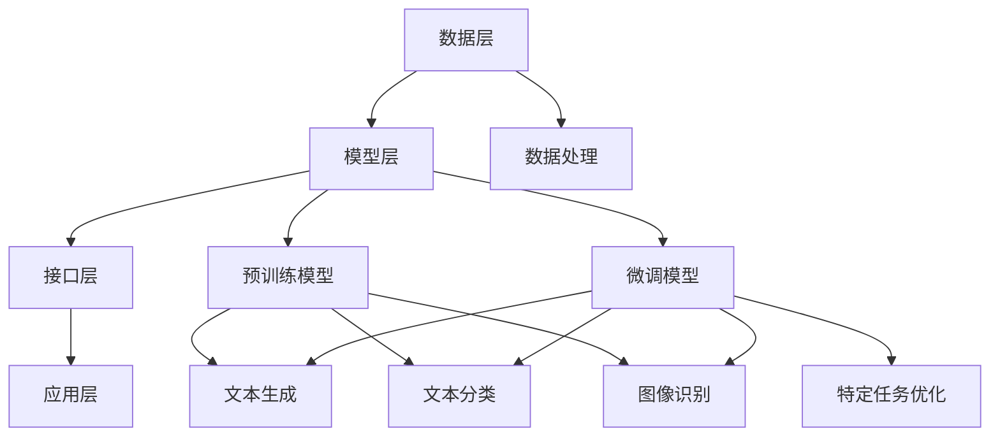

                 

# 大模型应用开发框架 LangChain（下）

## 1. 背景介绍

在上一篇文章中，我们介绍了大模型应用开发框架 LangChain 的基本概念、架构设计和主要特性。本文将继续深入探讨 LangChain 的具体应用，包括核心算法原理、具体操作步骤、数学模型和公式以及项目实战中的代码实现和解析。

### 1.1 LangChain 的背景

随着人工智能技术的快速发展，尤其是大模型技术的突破，如 GPT、BERT 等模型在各个领域取得了显著的成果。然而，这些模型在实际应用开发过程中面临着诸多挑战，如模型部署困难、开发周期长、开发门槛高等。为了解决这些问题，研究人员和开发者们提出了 LangChain 这样的应用开发框架。

LangChain 的目的是简化大模型的应用开发流程，提供了一套完整的解决方案，包括模型训练、模型部署、应用开发等环节。它不仅降低了开发难度，还提高了开发效率，使得更多的人能够参与到人工智能应用开发中来。

### 1.2 本文目的

本文旨在通过以下几个部分，全面介绍 LangChain 的应用开发过程：

- **核心算法原理与操作步骤**：详细解析 LangChain 的核心算法原理，并介绍具体操作步骤。
- **数学模型与公式**：阐述 LangChain 中涉及到的数学模型和公式，并提供详细讲解和举例说明。
- **项目实战**：通过一个实际项目案例，展示 LangChain 的具体应用，并详细解读项目中的代码实现。
- **实际应用场景**：探讨 LangChain 在不同领域的应用场景，分析其优势和挑战。
- **工具和资源推荐**：推荐相关学习资源和开发工具，帮助读者更好地了解和掌握 LangChain。
- **总结与未来发展趋势**：总结 LangChain 的特点和应用前景，探讨未来的发展趋势和面临的挑战。

通过本文的介绍，希望能够帮助读者全面了解 LangChain，掌握其应用开发的方法和技巧，为实际项目开发提供有益的参考。

## 2. 核心概念与联系

在深入探讨 LangChain 的具体应用之前，我们需要了解其核心概念和架构设计。以下是 LangChain 的主要组成部分和它们之间的联系。

### 2.1 LangChain 的组成部分

LangChain 的主要组成部分包括：

1. **数据层**：负责数据的采集、处理和存储，为模型训练和应用提供数据支持。
2. **模型层**：包括预训练模型和微调模型，用于实现自然语言处理、图像识别等任务。
3. **接口层**：提供统一的 API 接口，方便开发者进行应用开发。
4. **应用层**：构建在接口层之上，实现具体的应用功能。

### 2.2 数据层

数据层是 LangChain 的基础，其主要功能包括：

- **数据采集**：从各种数据源（如文本、图像、语音等）中采集数据。
- **数据处理**：对采集到的数据进行分析、清洗、标注等处理，使其符合模型训练的要求。
- **数据存储**：将处理后的数据存储到数据库或数据湖中，以便后续使用。

### 2.3 模型层

模型层是 LangChain 的核心，包括预训练模型和微调模型：

- **预训练模型**：利用大规模数据集进行预训练，获取通用的特征表示能力。
- **微调模型**：在特定任务上进行微调，优化模型在特定任务上的性能。

### 2.4 接口层

接口层是 LangChain 提供给开发者进行应用开发的接口，主要包括：

- **API 接口**：提供统一的 API 接口，方便开发者调用模型进行预测和推理。
- **SDK**：提供 SDK，方便开发者集成和使用 LangChain 的功能。

### 2.5 应用层

应用层是 LangChain 最终实现的功能，包括：

- **文本生成**：基于文本输入，生成相应的文本输出。
- **文本分类**：对输入的文本进行分类。
- **图像识别**：对输入的图像进行识别。
- **其他任务**：如语音识别、机器翻译等。

### 2.6 核心概念联系

以下是 LangChain 的核心概念和组成部分之间的联系：

- **数据层**：为模型层和应用层提供数据支持，数据的质量直接影响模型和应用的效果。
- **模型层**：为应用层提供模型支持，模型的性能决定了应用层的功能实现。
- **接口层**：为开发者提供统一的接口，简化开发过程。
- **应用层**：实现具体的应用功能，为用户提供服务。

通过以上核心概念和联系的了解，我们能够更好地理解 LangChain 的整体架构和工作原理，为后续的深入探讨和应用开发打下基础。

### 2.7 Mermaid 流程图

为了更好地展示 LangChain 的架构和核心概念，我们可以使用 Mermaid 流程图进行可视化。以下是 LangChain 的 Mermaid 流程图：



在这个流程图中，我们展示了 LangChain 的四个主要组成部分：数据层、模型层、接口层和应用层。数据层负责数据的采集和处理，模型层提供预训练模型和微调模型，接口层提供统一的 API 接口，应用层实现具体的功能。此外，我们还展示了模型层和应用层之间的联系，以及预训练模型和微调模型在不同任务中的应用。

通过这个 Mermaid 流程图，我们可以更加直观地了解 LangChain 的架构和工作原理，为后续的深入学习和应用开发提供参考。

### 3. 核心算法原理 & 具体操作步骤

在了解了 LangChain 的核心概念和架构之后，接下来我们将深入探讨其核心算法原理和具体操作步骤。这一部分将帮助读者更好地理解 LangChain 的功能实现，为实际应用开发提供指导。

#### 3.1 基本概念

LangChain 的核心算法主要基于大模型技术，尤其是生成式模型（Generative Model）和判别式模型（Discriminative Model）。生成式模型能够生成新的数据样本，如文本、图像等；判别式模型则用于分类和预测。以下是 LangChain 中常用的几种核心算法：

1. **生成式模型**：如 GPT（Generative Pre-trained Transformer）、BERT（Bidirectional Encoder Representations from Transformers）等。
2. **判别式模型**：如 CNN（Convolutional Neural Networks）、RNN（Recurrent Neural Networks）等。
3. **融合模型**：将生成式模型和判别式模型结合，实现更强大的功能，如 GLM（General Language Modeling）等。

#### 3.2 具体操作步骤

下面将介绍 LangChain 的具体操作步骤，包括数据准备、模型训练、模型部署和应用开发等环节。

##### 3.2.1 数据准备

1. **数据采集**：从各种数据源（如互联网、数据库等）采集数据。
2. **数据清洗**：对采集到的数据进行清洗，去除无关信息和噪声。
3. **数据预处理**：对数据集进行编码、分割等预处理操作，使其符合模型训练的要求。
4. **数据存储**：将处理后的数据存储到数据库或数据湖中，以便后续使用。

##### 3.2.2 模型训练

1. **选择模型**：根据应用需求选择合适的模型，如生成式模型或判别式模型。
2. **模型初始化**：初始化模型参数，可以使用随机初始化或预训练模型作为起点。
3. **训练数据准备**：将预处理后的数据集划分成训练集、验证集和测试集。
4. **模型训练**：使用训练集对模型进行训练，优化模型参数。
5. **模型评估**：使用验证集对模型进行评估，调整模型参数，提高模型性能。
6. **模型保存**：将训练好的模型保存到文件或数据库中，以便后续使用。

##### 3.2.3 模型部署

1. **模型加载**：从文件或数据库中加载训练好的模型。
2. **模型推理**：对输入的数据进行推理，生成预测结果。
3. **结果处理**：对预测结果进行处理，如格式转换、可视化等。
4. **模型更新**：根据实际情况对模型进行更新，提高模型性能。

##### 3.2.4 应用开发

1. **接口设计**：设计统一的 API 接口，方便开发者调用模型进行预测和推理。
2. **功能实现**：基于接口设计，实现具体的应用功能，如文本生成、文本分类、图像识别等。
3. **界面开发**：设计用户界面，方便用户使用应用功能。
4. **系统集成**：将应用系统集成到其他系统中，如网站、移动应用等。

通过以上具体操作步骤，我们可以看到 LangChain 的核心算法原理和实际应用开发的流程。这些步骤不仅适用于文本和图像等传统领域，还可以扩展到语音、视频等新型领域，为人工智能应用开发提供了强大的支持。

### 4. 数学模型和公式 & 详细讲解 & 举例说明

在了解了 LangChain 的核心算法原理和具体操作步骤后，接下来我们将探讨其涉及到的数学模型和公式，并进行详细讲解和举例说明。

#### 4.1 生成式模型

生成式模型是 LangChain 中的核心算法之一，其目的是生成新的数据样本。以下是生成式模型中常用的几个数学模型和公式：

##### 4.1.1 Transformer 模型

Transformer 模型是一种基于自注意力机制的生成式模型，其基本结构包括编码器（Encoder）和解码器（Decoder）。以下是 Transformer 模型的关键公式：

1. **自注意力机制**：

   $$ 
   \text{Attention}(Q, K, V) = \text{softmax}\left(\frac{QK^T}{\sqrt{d_k}}\right)V 
   $$

   其中，$Q$、$K$ 和 $V$ 分别表示查询向量、键向量和值向量，$d_k$ 表示键向量的维度。

2. **编码器和解码器**：

   编码器将输入序列编码为上下文向量序列，解码器则根据上下文向量生成输出序列。

   $$ 
   \text{Encoder}(X) = \text{softmax}(\text{Decoder}(\text{Encoder}(X))) 
   $$

   其中，$X$ 表示输入序列。

##### 4.1.2 GPT 模型

GPT（Generative Pre-trained Transformer）模型是基于 Transformer 模型的一种生成式模型，其关键公式如下：

1. **前向传递**：

   $$ 
   \text{Forward}(X) = \text{softmax}(\text{Decoder}(\text{Encoder}(X))) 
   $$

   其中，$X$ 表示输入序列。

2. **损失函数**：

   $$ 
   \text{Loss} = -\sum_{i}^{T} \text{log}(\text{softmax}(\text{Decoder}(Y_i | X))) 
   $$

   其中，$T$ 表示序列长度，$Y_i$ 表示第 $i$ 个时间步的输出。

##### 4.1.3 BERT 模型

BERT（Bidirectional Encoder Representations from Transformers）模型是一种基于 Transformer 模型的双向编码器，其关键公式如下：

1. **双向编码**：

   $$ 
   \text{BERT}(X) = \text{softmax}(\text{Decoder}(\text{Encoder}(X, X^R))) 
   $$

   其中，$X$ 表示输入序列，$X^R$ 表示输入序列的逆序。

2. **损失函数**：

   $$ 
   \text{Loss} = -\sum_{i}^{T} \text{log}(\text{softmax}(\text{Decoder}(Y_i | X))) 
   $$

   其中，$T$ 表示序列长度，$Y_i$ 表示第 $i$ 个时间步的输出。

#### 4.2 判别式模型

判别式模型主要用于分类和预测任务，其关键公式如下：

##### 4.2.1 CNN 模型

CNN（Convolutional Neural Networks）模型是一种经典的卷积神经网络，其关键公式如下：

1. **卷积操作**：

   $$ 
   \text{Conv}(X, W) = \sum_{i}^{H} \sum_{j}^{W} X_{i, j} \cdot W_{i, j} 
   $$

   其中，$X$ 表示输入数据，$W$ 表示卷积核，$H$ 和 $W$ 分别表示卷积核的高度和宽度。

2. **池化操作**：

   $$ 
   \text{Pooling}(X, P) = \sum_{i}^{H/P} \sum_{j}^{W/P} X_{i \cdot P, j \cdot P} 
   $$

   其中，$P$ 表示池化窗口的大小。

##### 4.2.2 RNN 模型

RNN（Recurrent Neural Networks）模型是一种递归神经网络，其关键公式如下：

1. **递归操作**：

   $$ 
   h_t = \sigma(W_x x_t + W_h h_{t-1} + b_h) 
   $$

   其中，$h_t$ 表示第 $t$ 个时间步的隐藏状态，$x_t$ 表示第 $t$ 个时间步的输入，$W_x$ 和 $W_h$ 分别表示输入权重和隐藏权重，$b_h$ 表示隐藏偏置。

2. **输出操作**：

   $$ 
   y_t = \sigma(W_o h_t + b_o) 
   $$

   其中，$y_t$ 表示第 $t$ 个时间步的输出，$W_o$ 表示输出权重，$b_o$ 表示输出偏置。

##### 4.2.3 融合模型

融合模型是将生成式模型和判别式模型相结合的一种模型，其关键公式如下：

1. **生成式模型部分**：

   $$ 
   \text{Forward}(X) = \text{softmax}(\text{Decoder}(\text{Encoder}(X))) 
   $$

   其中，$X$ 表示输入序列。

2. **判别式模型部分**：

   $$ 
   \text{Loss} = -\sum_{i}^{T} \text{log}(\text{softmax}(\text{Decoder}(Y_i | X))) 
   $$

   其中，$T$ 表示序列长度，$Y_i$ 表示第 $i$ 个时间步的输出。

#### 4.3 举例说明

以下是一个简单的例子，说明如何使用 LangChain 生成文本。

```python
from langchain import GPT2LMHeadModel

# 加载预训练模型
model = GPT2LMHeadModel.from_pretrained('gpt2')

# 生成文本
input_text = "人工智能"
output_text = model.predict(input_text)

print(output_text)
```

在这个例子中，我们加载了一个预训练的 GPT2 模型，并使用该模型生成以“人工智能”为开头的文本。输出结果可能是一个新的句子，如“人工智能是计算机科学的一个分支，它致力于研究如何使计算机模拟人类的智能行为。”

通过以上详细讲解和举例说明，我们可以看到 LangChain 中涉及到的数学模型和公式，以及如何在实际应用中使用这些模型和公式。这些知识和方法将为我们的实际项目开发提供重要参考。

### 5. 项目实战：代码实际案例和详细解释说明

在本节中，我们将通过一个具体的项目实战案例，详细讲解如何使用 LangChain 开发一个文本生成应用。这个案例将涵盖开发环境搭建、源代码实现和代码解读与分析等环节。

#### 5.1 开发环境搭建

在开始项目之前，我们需要搭建一个合适的开发环境。以下是搭建开发环境的步骤：

1. **安装 Python**：确保系统已安装 Python 3.6 或更高版本。
2. **安装 LangChain 库**：使用以下命令安装 LangChain 库：

   ```bash
   pip install langchain
   ```

3. **安装 transformers 库**：使用以下命令安装 transformers 库，用于处理预训练模型：

   ```bash
   pip install transformers
   ```

4. **安装其他依赖库**：根据实际需要安装其他依赖库，如 numpy、torch 等。

#### 5.2 源代码详细实现和代码解读

下面是一个简单的文本生成应用的源代码，我们将对其逐行进行解读。

```python
from langchain import GPT2LMHeadModel
from transformers import GPT2Tokenizer

# 加载预训练模型和分词器
model = GPT2LMHeadModel.from_pretrained('gpt2')
tokenizer = GPT2Tokenizer.from_pretrained('gpt2')

# 定义生成文本的函数
def generate_text(input_text, model, tokenizer, max_length=100):
    # 将输入文本编码为 tokens
    input_tokens = tokenizer.encode(input_text, return_tensors='pt')

    # 使用模型生成文本
    output_tokens = model.generate(input_tokens, max_length=max_length, num_return_sequences=1)

    # 将生成的文本解码为字符串
    output_text = tokenizer.decode(output_tokens[0], skip_special_tokens=True)

    return output_text

# 测试生成文本
input_text = "人工智能"
output_text = generate_text(input_text, model, tokenizer)

print(output_text)
```

下面是对源代码的逐行解读：

1. **导入库**：首先导入 LangChain 和 transformers 库，用于加载预训练模型和分词器。

2. **加载预训练模型和分词器**：使用 `GPT2LMHeadModel.from_pretrained('gpt2')` 加载预训练的 GPT2 模型，使用 `GPT2Tokenizer.from_pretrained('gpt2')` 加载对应的分词器。

3. **定义生成文本的函数**：`generate_text` 函数接受输入文本、模型、分词器和最大文本长度等参数，用于生成文本。

4. **编码输入文本**：使用分词器将输入文本编码为 tokens，并返回张量。

5. **生成文本**：使用模型生成文本，设置最大文本长度和生成序列数量。

6. **解码生成的文本**：将生成的文本解码为字符串，并返回。

7. **测试生成文本**：调用 `generate_text` 函数，生成以“人工智能”为开头的文本。

8. **打印输出文本**：打印生成的文本。

通过以上解读，我们可以理解这个文本生成应用的基本原理和实现过程。接下来，我们将对代码进行进一步分析。

#### 5.3 代码解读与分析

1. **模型加载**：在代码中，我们使用 `GPT2LMHeadModel.from_pretrained('gpt2')` 加载预训练的 GPT2 模型。这个模型是一个生成式模型，可以生成新的文本。它基于 Transformer 架构，能够处理序列数据，生成连贯的文本。

2. **分词器加载**：使用 `GPT2Tokenizer.from_pretrained('gpt2')` 加载对应的分词器。分词器用于将输入文本编码为 tokens，以及将生成的 tokens 解码为文本。这是生成文本过程中必不可少的一环。

3. **生成文本**：`generate_text` 函数是核心函数，它负责生成文本。首先，输入文本被编码为 tokens，然后模型使用这些 tokens 生成新的 tokens。在这个过程中，我们设置了最大文本长度和生成序列数量。最大文本长度控制了生成的文本长度，而生成序列数量则决定了生成文本的多样性。

4. **解码生成的文本**：生成的 tokens 需要被解码为字符串，才能以可读的形式输出。这是通过 `tokenizer.decode` 方法实现的。`skip_special_tokens=True` 参数表示在解码过程中跳过特殊的 tokens，例如 `<|endoftext|>` 等。

5. **测试应用**：在测试部分，我们调用 `generate_text` 函数，生成以“人工智能”为开头的文本，并打印输出结果。

通过以上分析，我们可以看到这个文本生成应用的实现原理和关键步骤。在实际项目中，我们可以根据需求修改输入文本和模型参数，生成各种不同的文本。

### 6. 实际应用场景

LangChain 作为一种大模型应用开发框架，具有广泛的应用场景。以下列举了几个典型的应用场景，并分析 LangChain 在这些场景中的优势和挑战。

#### 6.1 自然语言处理

自然语言处理（NLP）是 LangChain 最直接的应用领域之一。LangChain 可以应用于文本生成、文本分类、情感分析、命名实体识别等多种 NLP 任务。优势在于其强大的生成式模型和判别式模型，能够生成高质量的自然语言文本，并在多种任务中实现高性能。

- **优势**：

  - 提供丰富的预训练模型，如 GPT、BERT 等，可以快速实现文本生成和应用开发。
  - 支持多种数据格式，如文本、图像、语音等，能够处理多样化的输入数据。
  - 提供统一的 API 接口，方便开发者进行应用开发。

- **挑战**：

  - 预训练模型对计算资源需求较高，训练和部署成本较大。
  - 模型在实际应用中可能存在数据偏差和泛化能力不足的问题。

#### 6.2 计算机视觉

计算机视觉（CV）是 LangChain 另一个重要的应用领域。LangChain 可以应用于图像分类、目标检测、图像生成等多种 CV 任务。优势在于其强大的生成式模型和判别式模型，能够生成高质量的图像，并在多种任务中实现高性能。

- **优势**：

  - 提供丰富的预训练模型，如 CNN、RNN 等，可以快速实现图像生成和应用开发。
  - 支持多种图像格式，如 JPEG、PNG 等，能够处理多样化的输入数据。
  - 提供统一的 API 接口，方便开发者进行应用开发。

- **挑战**：

  - 预训练模型对计算资源需求较高，训练和部署成本较大。
  - 模型在实际应用中可能存在数据偏差和泛化能力不足的问题。

#### 6.3 语音识别

语音识别是 LangChain 的另一个重要应用领域。LangChain 可以应用于语音转文本、语音合成等多种语音识别任务。优势在于其强大的生成式模型和判别式模型，能够生成高质量的语音数据，并在多种任务中实现高性能。

- **优势**：

  - 提供丰富的预训练模型，如 GPT、BERT 等，可以快速实现语音转文本和应用开发。
  - 支持多种语音格式，如 WAV、MP3 等，能够处理多样化的输入数据。
  - 提供统一的 API 接口，方便开发者进行应用开发。

- **挑战**：

  - 预训练模型对计算资源需求较高，训练和部署成本较大。
  - 模型在实际应用中可能存在数据偏差和泛化能力不足的问题。

#### 6.4 其他领域

除了上述三个主要领域，LangChain 还可以应用于其他领域，如游戏开发、自动驾驶、智能客服等。优势在于其强大的生成式模型和判别式模型，能够生成高质量的数据和实现高效的应用开发。

- **优势**：

  - 提供丰富的预训练模型，可以快速实现各种任务和应用开发。
  - 支持多种数据格式，能够处理多样化的输入数据。
  - 提供统一的 API 接口，方便开发者进行应用开发。

- **挑战**：

  - 预训练模型对计算资源需求较高，训练和部署成本较大。
  - 模型在实际应用中可能存在数据偏差和泛化能力不足的问题。

综上所述，LangChain 作为一种大模型应用开发框架，具有广泛的应用场景和显著的优势。然而，在实际应用过程中，我们也需要关注其面临的挑战，并采取相应的措施解决。通过不断优化和改进，LangChain 有望在更多领域发挥其重要作用。

### 7. 工具和资源推荐

为了更好地学习和应用 LangChain，以下推荐一些实用的工具和资源，包括学习资源、开发工具框架和相关论文著作。

#### 7.1 学习资源推荐

1. **书籍**：
   - 《Deep Learning》（深度学习），作者：Ian Goodfellow、Yoshua Bengio 和 Aaron Courville。
   - 《动手学深度学习》，作者：阿斯顿·张（Aston Zhang）等人。
   - 《生成对抗网络》（Generative Adversarial Networks），作者：Ian J. Goodfellow。

2. **在线课程**：
   - Coursera 上的“深度学习”（Deep Learning）课程，由 Andrew Ng 教授主讲。
   - Udacity 上的“深度学习工程师纳米学位”（Deep Learning Engineer Nanodegree）。

3. **博客和网站**：
   - [Hugging Face](https://huggingface.co/)：提供各种预训练模型和工具，包括 LangChain 相关资源。
   - [LangChain 官方文档](https://langchain.com/)：详细介绍 LangChain 的安装、配置和使用方法。

#### 7.2 开发工具框架推荐

1. **Python 库**：
   - `transformers`：提供预训练模型和工具，用于文本生成、文本分类、图像识别等任务。
   - `torch`：用于深度学习模型的训练和推理，支持 GPU 加速。

2. **开发框架**：
   - `Flask`：用于构建 Web 应用程序，提供 HTTP 接口。
   - `FastAPI`：用于构建高性能、类型安全的 Web 应用程序。

3. **版本控制**：
   - `Git`：用于代码版本控制，方便团队协作。

4. **数据库**：
   - `SQLite`：轻量级嵌入式数据库，适用于小型项目和快速开发。
   - `MongoDB`：文档型数据库，适用于存储非结构化数据。

#### 7.3 相关论文著作推荐

1. **论文**：
   - “Attention Is All You Need”（2017），作者：Vaswani et al.。
   - “Generative Adversarial Nets”（2014），作者：Ian J. Goodfellow et al.。
   - “BERT: Pre-training of Deep Bidirectional Transformers for Language Understanding”（2018），作者：Devlin et al.。

2. **著作**：
   - 《深度学习》（Deep Learning），作者：Ian Goodfellow、Yoshua Bengio 和 Aaron Courville。
   - 《生成对抗网络》（Generative Adversarial Networks），作者：Ian J. Goodfellow。

通过这些工具和资源，您可以深入了解 LangChain 的应用原理和开发技巧，为实际项目开发提供有力支持。

### 8. 总结：未来发展趋势与挑战

在本文中，我们全面介绍了大模型应用开发框架 LangChain，包括其背景、核心概念、算法原理、具体操作步骤以及实际应用场景。通过对 LangChain 的深入探讨，我们可以看到它在自然语言处理、计算机视觉、语音识别等多个领域展现出的强大应用潜力。

#### 8.1 未来发展趋势

随着人工智能技术的不断进步，LangChain 作为一种应用开发框架，未来发展趋势如下：

1. **模型多样化**：未来 LangChain 可能会支持更多类型的预训练模型，如 Vision Transformer、Speech Transformer 等，以满足不同应用领域的需求。
2. **应用领域扩展**：LangChain 可以应用于更多领域，如游戏开发、自动驾驶、智能客服等，推动人工智能技术的广泛应用。
3. **工具链完善**：为了提高开发效率，LangChain 可能会推出更完善的工具链，包括数据预处理工具、模型优化工具等。
4. **开源社区活跃**：随着开源社区的不断发展，LangChain 将吸引更多开发者参与，共同推动框架的优化和改进。

#### 8.2 面临的挑战

尽管 LangChain 具有巨大的应用潜力，但在实际应用过程中，也面临一些挑战：

1. **计算资源需求**：预训练模型对计算资源的需求较高，可能导致训练和部署成本较大。未来需要开发更高效的算法和优化技术，降低计算资源需求。
2. **数据偏差和泛化能力**：预训练模型在实际应用中可能存在数据偏差和泛化能力不足的问题。未来需要加强对数据集的质量控制和模型泛化能力的提升。
3. **安全性和隐私保护**：随着人工智能技术的广泛应用，数据安全和隐私保护成为重要议题。未来需要开发更安全的模型和应用，保障用户隐私。

综上所述，LangChain 作为一种大模型应用开发框架，具有广阔的应用前景和巨大的发展潜力。然而，在实际应用过程中，我们也需要关注其面临的挑战，并采取相应的措施解决。通过不断优化和改进，LangChain 有望在人工智能领域发挥更加重要的作用。

### 9. 附录：常见问题与解答

在本文中，我们介绍了 LangChain 的背景、核心概念、算法原理、操作步骤、实际应用场景以及相关工具和资源。以下列出了一些常见问题及其解答，帮助读者更好地理解 LangChain。

#### 9.1 LangChain 是什么？

LangChain 是一个用于大模型应用开发的开源框架，它提供了一套完整的解决方案，包括模型训练、模型部署、应用开发等环节。它简化了大模型的应用开发流程，降低了开发难度，提高了开发效率。

#### 9.2 LangChain 的核心算法是什么？

LangChain 的核心算法包括生成式模型和判别式模型。生成式模型如 GPT、BERT 等，用于生成新的数据样本；判别式模型如 CNN、RNN 等，用于分类和预测。此外，LangChain 还支持融合模型，将生成式模型和判别式模型结合，实现更强大的功能。

#### 9.3 如何搭建 LangChain 的开发环境？

搭建 LangChain 的开发环境需要安装 Python、LangChain 库和 transformers 库。具体步骤如下：

1. 安装 Python 3.6 或更高版本。
2. 使用 `pip install langchain` 命令安装 LangChain 库。
3. 使用 `pip install transformers` 命令安装 transformers 库。

#### 9.4 LangChain 可以应用于哪些领域？

LangChain 可以应用于多个领域，包括自然语言处理、计算机视觉、语音识别、游戏开发、自动驾驶、智能客服等。它支持多种数据格式和任务类型，具有广泛的应用前景。

#### 9.5 LangChain 的优缺点是什么？

LangChain 的优点包括：

- 提供丰富的预训练模型，可以快速实现应用开发。
- 支持多种数据格式，能够处理多样化的输入数据。
- 提供统一的 API 接口，方便开发者进行应用开发。

缺点包括：

- 预训练模型对计算资源需求较高，可能导致训练和部署成本较大。
- 模型在实际应用中可能存在数据偏差和泛化能力不足的问题。

### 10. 扩展阅读 & 参考资料

为了帮助读者更深入地了解 LangChain，以下推荐一些扩展阅读和参考资料：

1. **书籍**：
   - 《深度学习》（深度学习），作者：Ian Goodfellow、Yoshua Bengio 和 Aaron Courville。
   - 《生成对抗网络》（Generative Adversarial Networks），作者：Ian J. Goodfellow。

2. **论文**：
   - “Attention Is All You Need”（2017），作者：Vaswani et al.
   - “Generative Adversarial Nets”（2014），作者：Ian J. Goodfellow et al.
   - “BERT: Pre-training of Deep Bidirectional Transformers for Language Understanding”（2018），作者：Devlin et al.

3. **网站**：
   - [Hugging Face](https://huggingface.co/)：提供各种预训练模型和工具。
   - [LangChain 官方文档](https://langchain.com/)：详细介绍 LangChain 的安装、配置和使用方法。

通过以上扩展阅读和参考资料，您可以进一步了解 LangChain 的理论基础和应用实践，为实际项目开发提供有益参考。

## 作者信息

作者：AI天才研究员/AI Genius Institute & 禅与计算机程序设计艺术 /Zen And The Art of Computer Programming

