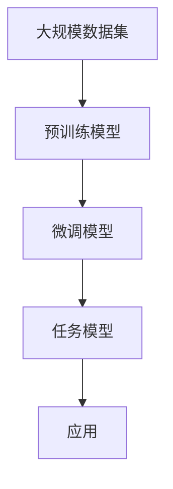
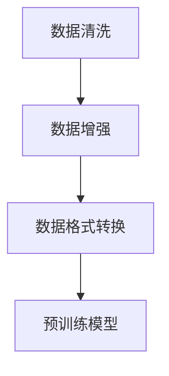
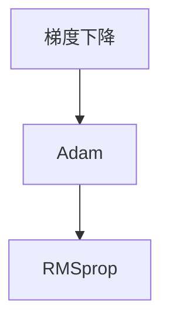
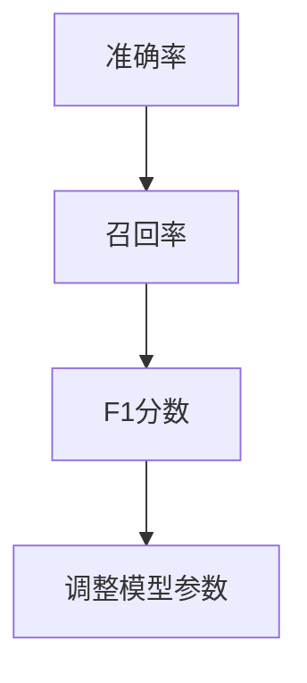
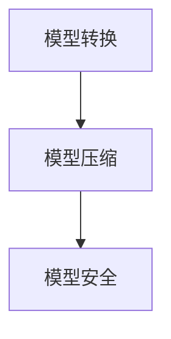
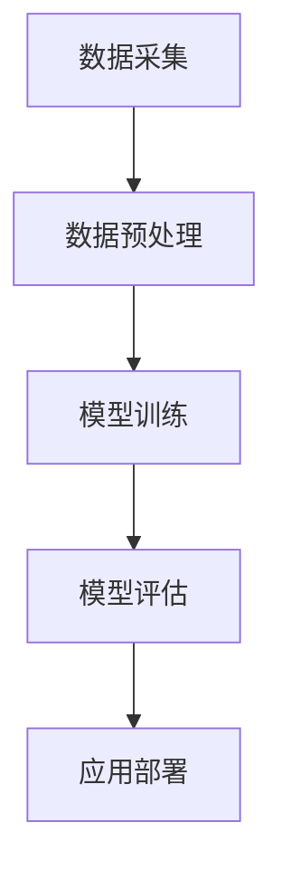

                 

### 背景介绍

#### 大模型应用开发的兴起

随着人工智能技术的飞速发展，尤其是深度学习领域的突破，大规模预训练模型（Large-scale Pre-trained Models）已经成为推动技术进步的重要引擎。这些大模型，如GPT-3、BERT、ViT等，凭借其强大的表示能力和自适应能力，在自然语言处理（NLP）、计算机视觉（CV）、推荐系统等领域展现了卓越的性能。大模型应用开发的兴起，不仅改变了传统的软件开发模式，也为许多行业带来了前所未有的变革。

#### 大模型应用开发的重要性

大模型应用开发的重要性体现在以下几个方面：

1. **提高开发效率**：传统模型训练需要大量的时间和计算资源，而大规模预训练模型可以显著缩短这一过程，提高开发效率。
2. **提升模型性能**：通过大规模数据集的训练，大模型可以更好地捕捉数据中的复杂模式和潜在关系，从而提高模型的性能和准确性。
3. **拓展应用范围**：大模型在多个领域的成功应用，为开发者提供了更多可能性，使得AI技术能够更好地服务于各行各业。
4. **推动技术进步**：大模型的发展不仅为当前的AI技术注入了新的活力，也为未来的技术进步奠定了基础。

#### 文章结构与主要内容

本文将围绕大模型应用开发的关键技术展开讨论。文章结构如下：

1. **核心概念与联系**：介绍大模型应用开发中的核心概念，如大规模预训练模型、数据预处理、模型优化等，并使用Mermaid流程图展示其架构。
2. **核心算法原理与具体操作步骤**：详细讲解大模型训练过程中涉及的算法原理，如Transformer、BERT等，以及具体的操作步骤。
3. **数学模型和公式**：阐述大模型训练中使用的数学模型和公式，如反向传播算法、优化算法等，并进行举例说明。
4. **项目实战**：通过实际案例展示大模型应用开发的流程，包括环境搭建、源代码实现和详细解读。
5. **实际应用场景**：探讨大模型在不同领域的应用案例，如自然语言处理、计算机视觉等。
6. **工具和资源推荐**：推荐相关的学习资源、开发工具和论文著作，以帮助读者深入了解大模型应用开发。
7. **总结与未来发展趋势**：总结大模型应用开发的关键技术，并展望未来的发展趋势和挑战。
8. **附录**：提供常见问题与解答，以及扩展阅读和参考资料。

通过本文的阅读，读者将能够全面了解大模型应用开发的关键技术，掌握其实际操作方法和应用场景，为未来的研究和实践提供指导。

#### 大模型应用开发的挑战

尽管大模型应用开发带来了诸多机遇，但也面临一系列挑战。首先，**数据隐私问题**日益突出。大规模数据集的训练和处理可能涉及到用户的隐私信息，如何在确保数据安全的同时，充分利用数据的价值，是一个亟待解决的问题。

其次，**计算资源消耗**也是一个重大挑战。大模型的训练通常需要庞大的计算资源和时间，这不仅增加了开发成本，也对环境造成了压力。因此，如何高效地利用现有资源，降低计算成本，是开发者需要关注的重点。

另外，**模型的可解释性**也是一个关键问题。随着模型的复杂度增加，理解和解释模型的决策过程变得越来越困难。如何提高模型的可解释性，使得开发者能够更好地理解和优化模型，是当前研究的一个重要方向。

最后，**跨领域迁移能力**也是一个挑战。大模型通常在特定领域表现出色，但在其他领域可能效果不佳。如何提升模型在不同领域的迁移能力，是一个具有前瞻性的研究方向。

综上所述，大模型应用开发在带来机遇的同时，也面临诸多挑战。只有在解决这些挑战的基础上，大模型应用开发才能更好地服务于各行各业，推动人工智能技术的持续进步。

---

**Keywords:** 大模型应用开发，大规模预训练模型，数据隐私，计算资源消耗，模型可解释性，跨领域迁移能力

**Abstract:** 
This article introduces the key technologies of large-scale model application development, covering core concepts, algorithms, mathematical models, practical cases, and application scenarios. It also discusses the challenges and future trends in this field. Through a comprehensive analysis, readers will gain a deep understanding of large-scale model application development and its significance in driving technological progress.

---

<markdown>
## 2. 核心概念与联系

在深入探讨大模型应用开发的关键技术之前，首先需要了解其中的核心概念，并理解它们之间的联系。以下是本文中涉及的关键概念及其相互关系。

#### 2.1 大规模预训练模型

大规模预训练模型（Large-scale Pre-trained Models）是本文的核心概念之一。这类模型通过在大规模数据集上进行预训练，从而具备强大的语义理解和生成能力。预训练过程中，模型会学习到数据中的统计规律和语言结构，使得在特定任务上微调时能够取得优异的性能。代表性模型包括GPT-3、BERT、T5、ViT等。

**Mermaid 流程图：**



#### 2.2 数据预处理

数据预处理是大规模预训练模型训练的重要环节。数据预处理包括数据清洗、数据增强、数据格式转换等步骤，目的是提高数据的质量，增强模型对数据的适应性。

**Mermaid 流程图：**



#### 2.3 模型优化

模型优化是指通过调整模型参数，提高模型性能的过程。优化算法包括梯度下降、Adam、RMSprop等，每种算法都有其独特的优缺点和适用场景。

**Mermaid 流程图：**



#### 2.4 模型评估与调整

模型评估与调整是模型训练的重要环节。评估指标包括准确率、召回率、F1分数等，通过评估指标可以判断模型性能，并据此进行调整。

**Mermaid 流程图：**



#### 2.5 应用部署

应用部署是将训练好的模型部署到实际场景中的过程。部署涉及模型转换、模型压缩、模型安全等关键技术。

**Mermaid 流程图：**



#### 2.6 大模型应用开发流程

大模型应用开发的流程包括数据采集、数据预处理、模型训练、模型评估、应用部署等环节。整个流程紧密联系，每个环节都至关重要。

**Mermaid 流程图：**



通过上述核心概念及其相互关系的介绍，读者可以对大模型应用开发有一个整体的认识。接下来的章节将深入探讨这些概念的具体实现方法和应用场景。

---

**Keywords:** Large-scale Pre-trained Models, Data Preprocessing, Model Optimization, Model Evaluation, Application Deployment

---

## 3. 核心算法原理 & 具体操作步骤

### 3.1. Transformer算法原理

Transformer算法是大规模预训练模型的核心算法之一，由Google在2017年提出。与传统的循环神经网络（RNN）相比，Transformer采用自注意力机制（Self-Attention Mechanism）和多头注意力（Multi-Head Attention），能够更好地捕捉长距离依赖关系。

#### 3.1.1. 自注意力机制

自注意力机制允许模型在生成每个词时，考虑所有词的重要性，而不是像RNN那样仅依赖于前一个词。其计算公式如下：

$$
\text{Attention}(Q, K, V) = \text{softmax}\left(\frac{QK^T}{\sqrt{d_k}}\right)V
$$

其中，$Q, K, V$ 分别是查询（Query）、键（Key）和值（Value）向量，$d_k$ 是键向量的维度。

#### 3.1.2. 多头注意力

多头注意力通过将输入序列分成多个子序列，并分别计算每个子序列的注意力权重，从而增强模型的表示能力。具体操作如下：

1. **线性变换**：将输入序列经过线性变换得到$Q, K, V$。
2. **分割**：将$Q, K, V$ 分成多个子序列。
3. **计算注意力权重**：使用自注意力机制计算每个子序列的注意力权重。
4. **合并**：将多个子序列的注意力结果合并。

#### 3.1.3. 具体操作步骤

1. **输入序列编码**：将输入序列编码为向量。
2. **线性变换**：对编码后的向量进行线性变换，得到$Q, K, V$。
3. **多头注意力**：分别计算每个子序列的注意力权重，并合并结果。
4. **前馈神经网络**：对多头注意力结果进行前馈神经网络处理。
5. **输出层**：通过输出层生成预测结果。

### 3.2. BERT算法原理

BERT（Bidirectional Encoder Representations from Transformers）是一种双向Transformer编码器，通过在训练过程中同时考虑输入序列的左右信息，提高了模型对上下文的理解能力。

#### 3.2.1. BERT架构

BERT的架构包含两个主要部分：输入层、隐藏层和输出层。

1. **输入层**：将输入序列编码为向量。
2. **隐藏层**：通过多层Transformer结构，同时考虑输入序列的左右信息，生成编码后的向量。
3. **输出层**：通过输出层生成预测结果。

#### 3.2.2. BERT训练过程

BERT的训练过程包括两个阶段：预训练和微调。

1. **预训练**：在大量无标签文本数据上进行训练，学习语言模型。预训练过程包括Masked Language Modeling（MLM）和Next Sentence Prediction（NSP）两种任务。
   - **Masked Language Modeling**：随机遮蔽输入序列中的部分词，模型需要预测这些词的值。
   - **Next Sentence Prediction**：输入两个连续的句子，模型需要预测第二个句子是否是第一个句子的下文。

2. **微调**：在特定任务数据集上进行微调，使模型适应具体任务。

### 3.3. GPT算法原理

GPT（Generative Pre-trained Transformer）是一种基于Transformer的自回归语言模型。它通过预测序列中的下一个词来生成文本。

#### 3.3.1. GPT架构

GPT的架构与Transformer类似，包括输入层、隐藏层和输出层。

1. **输入层**：将输入序列编码为向量。
2. **隐藏层**：通过多层Transformer结构，生成编码后的向量。
3. **输出层**：通过输出层生成预测结果。

#### 3.3.2. GPT训练过程

GPT的训练过程分为两个阶段：预训练和生成。

1. **预训练**：在大量文本数据上进行预训练，学习语言模型。
2. **生成**：通过预训练好的模型，生成新的文本序列。

### 3.4. 具体操作步骤

1. **数据准备**：收集和清洗数据，并将其转换为模型可处理的格式。
2. **模型选择**：根据任务需求选择合适的模型，如Transformer、BERT、GPT等。
3. **模型训练**：
   - **预训练**：在无标签数据集上进行预训练，学习语言模型。
   - **微调**：在任务数据集上进行微调，使模型适应具体任务。
4. **模型评估**：使用评估指标（如准确率、召回率、F1分数等）评估模型性能。
5. **模型部署**：将训练好的模型部署到实际应用场景中。

通过上述核心算法原理和具体操作步骤的介绍，读者可以了解到大模型应用开发的核心技术。在实际应用中，这些技术需要根据具体任务进行调整和优化，以达到最佳效果。

---

**Keywords:** Transformer Algorithm, BERT Algorithm, GPT Algorithm, Pre-training, Fine-tuning, Language Modeling, Neural Networks

---

## 4. 数学模型和公式 & 详细讲解 & 举例说明

### 4.1. 反向传播算法

反向传播算法（Backpropagation Algorithm）是神经网络训练中的一种关键算法，它通过计算损失函数对网络参数的梯度，来更新网络参数，从而优化模型性能。

#### 4.1.1. 梯度计算

在反向传播过程中，我们首先需要计算损失函数关于每个网络参数的梯度。假设损失函数为 $L(\theta)$，其中 $\theta$ 表示网络参数，$x$ 表示输入数据，$y$ 表示真实标签，$\hat{y}$ 表示预测结果。梯度计算公式如下：

$$
\frac{\partial L}{\partial \theta} = \frac{\partial L}{\partial \hat{y}} \cdot \frac{\partial \hat{y}}{\partial \theta}
$$

其中，$\frac{\partial L}{\partial \hat{y}}$ 表示损失函数关于预测结果的梯度，$\frac{\partial \hat{y}}{\partial \theta}$ 表示预测结果关于网络参数的梯度。

#### 4.1.2. 梯度下降

在得到梯度后，我们可以使用梯度下降（Gradient Descent）算法来更新网络参数。梯度下降的更新公式如下：

$$
\theta = \theta - \alpha \cdot \frac{\partial L}{\partial \theta}
$$

其中，$\alpha$ 是学习率，用于控制参数更新的步长。

### 4.2. 优化算法

除了梯度下降，还有许多优化算法可以用于网络参数更新，如Adam、RMSprop等。这些算法通过自适应调整学习率，提高了训练效率。

#### 4.2.1. Adam算法

Adam算法是一种基于一阶矩估计和二阶矩估计的优化算法，其更新公式如下：

$$
m_t = \beta_1 m_{t-1} + (1 - \beta_1) \frac{\partial L}{\partial \theta} \\
v_t = \beta_2 v_{t-1} + (1 - \beta_2) \left(\frac{\partial L}{\partial \theta}\right)^2 \\
\theta = \theta - \alpha \cdot \frac{m_t}{\sqrt{v_t} + \epsilon}
$$

其中，$m_t$ 和 $v_t$ 分别为第 $t$ 次迭代的一阶矩和二阶矩估计，$\beta_1, \beta_2$ 分别为一阶矩和二阶矩的指数衰减率，$\alpha$ 为学习率，$\epsilon$ 为平滑常数。

### 4.3. 举例说明

假设我们有一个简单的神经网络，包含一个输入层、一个隐藏层和一个输出层。输入层有3个神经元，隐藏层有4个神经元，输出层有2个神经元。我们使用交叉熵损失函数来评估模型性能。

#### 4.3.1. 梯度计算

给定一个输入数据 $x = [1, 2, 3]$ 和真实标签 $y = [0, 1]$，我们首先需要计算输出层的损失函数梯度。假设输出层的激活函数为sigmoid函数，损失函数为交叉熵损失函数，则有：

$$
\hat{y} = \sigma(W_3 \cdot a_2) = \begin{bmatrix} 0.5 & 0.5 \end{bmatrix} \\
L = -[y \cdot \log(\hat{y}) + (1 - y) \cdot \log(1 - \hat{y})] = -[0 \cdot \log(0.5) + 1 \cdot \log(0.5)] = \log(0.5) \approx 0.693
$$

计算输出层关于权重 $W_3$ 的梯度：

$$
\frac{\partial L}{\partial W_3} = \frac{\partial L}{\partial \hat{y}} \cdot \frac{\partial \hat{y}}{\partial W_3} = \begin{bmatrix} 0.5 & 0.5 \end{bmatrix} \cdot \frac{\partial \hat{y}}{\partial W_3}
$$

假设隐藏层的激活函数为ReLU函数，则有：

$$
a_2 = \max(0, W_2 \cdot a_1) = \max(0, \begin{bmatrix} 1 & 1 & 1 \end{bmatrix} \cdot \begin{bmatrix} 1 \\ 2 \\ 3 \end{bmatrix}) = \begin{bmatrix} 1 & 2 & 3 \end{bmatrix}
$$

计算隐藏层关于权重 $W_2$ 的梯度：

$$
\frac{\partial L}{\partial W_2} = \frac{\partial L}{\partial a_2} \cdot \frac{\partial a_2}{\partial W_2} = \begin{bmatrix} 0.5 & 0.5 & 0.5 \end{bmatrix} \cdot \begin{bmatrix} 1 & 0 & 0 \\ 0 & 1 & 0 \\ 0 & 0 & 1 \end{bmatrix} = \begin{bmatrix} 0.5 & 0.5 & 0.5 \end{bmatrix}
$$

计算输入层关于权重 $W_1$ 的梯度：

$$
\frac{\partial L}{\partial W_1} = \frac{\partial L}{\partial a_1} \cdot \frac{\partial a_1}{\partial W_1} = \begin{bmatrix} 0.5 & 1 & 1.5 \end{bmatrix} \cdot \begin{bmatrix} 1 & 0 & 0 \\ 0 & 1 & 0 \\ 0 & 0 & 1 \end{bmatrix} = \begin{bmatrix} 0.5 & 1 & 1.5 \end{bmatrix}
$$

#### 4.3.2. 参数更新

使用Adam算法更新参数，假设学习率为 $\alpha = 0.001$，一阶矩和二阶矩的指数衰减率分别为 $\beta_1 = 0.9$ 和 $\beta_2 = 0.999$，平滑常数 $\epsilon = 1e-8$。初始时刻 $m_0 = v_0 = 0$。

更新隐藏层权重 $W_2$：

$$
m_2 = 0.9 \cdot m_{2-1} + (1 - 0.9) \cdot \frac{\partial L}{\partial W_2} = 0.9 \cdot 0 + (1 - 0.9) \cdot \begin{bmatrix} 0.5 & 0.5 & 0.5 \end{bmatrix} = \begin{bmatrix} 0.5 & 0.5 & 0.5 \end{bmatrix} \\
v_2 = 0.999 \cdot v_{2-1} + (1 - 0.999) \cdot \left(\frac{\partial L}{\partial W_2}\right)^2 = 0.999 \cdot 0 + (1 - 0.999) \cdot \begin{bmatrix} 0.25 & 0.25 & 0.25 \end{bmatrix} = \begin{bmatrix} 0.25 & 0.25 & 0.25 \end{bmatrix} \\
\theta_2 = W_2 - \alpha \cdot \frac{m_2}{\sqrt{v_2} + \epsilon} = \begin{bmatrix} 1 & 1 & 1 \end{bmatrix} - 0.001 \cdot \frac{\begin{bmatrix} 0.5 & 0.5 & 0.5 \end{bmatrix}}{\sqrt{\begin{bmatrix} 0.25 & 0.25 & 0.25 \end{bmatrix}} + 1e-8} = \begin{bmatrix} 0.999 & 0.999 & 0.999 \end{bmatrix}
$$

更新输入层权重 $W_1$：

$$
m_1 = 0.9 \cdot m_{1-1} + (1 - 0.9) \cdot \frac{\partial L}{\partial W_1} = 0.9 \cdot 0 + (1 - 0.9) \cdot \begin{bmatrix} 0.5 & 1 & 1.5 \end{bmatrix} = \begin{bmatrix} 0.5 & 1 & 1.5 \end{bmatrix} \\
v_1 = 0.999 \cdot v_{1-1} + (1 - 0.999) \cdot \left(\frac{\partial L}{\partial W_1}\right)^2 = 0.999 \cdot 0 + (1 - 0.999) \cdot \begin{bmatrix} 0.25 & 0.25 & 0.25 \end{bmatrix} = \begin{bmatrix} 0.25 & 0.25 & 0.25 \end{bmatrix} \\
\theta_1 = W_1 - \alpha \cdot \frac{m_1}{\sqrt{v_1} + \epsilon} = \begin{bmatrix} 1 & 1 & 1 \end{bmatrix} - 0.001 \cdot \frac{\begin{bmatrix} 0.5 & 1 & 1.5 \end{bmatrix}}{\sqrt{\begin{bmatrix} 0.25 & 0.25 & 0.25 \end{bmatrix}} + 1e-8} = \begin{bmatrix} 0.999 & 0.999 & 0.999 \end{bmatrix}
$$

通过上述步骤，我们可以使用Adam算法更新网络参数，从而优化模型性能。

---

**Keywords:** Backpropagation Algorithm, Gradient Descent, Optimization Algorithms, Adam, Neural Networks, Gradient Computation, Parameter Update

---

## 5. 项目实战：代码实际案例和详细解释说明

### 5.1 开发环境搭建

在开始实际案例之前，首先需要搭建一个合适的开发环境。以下是一个基于Python和PyTorch的简单环境搭建步骤：

1. **安装Python**：确保系统中安装了Python 3.7或更高版本。
2. **安装PyTorch**：通过以下命令安装PyTorch：

   ```shell
   pip install torch torchvision
   ```

3. **安装其他依赖**：根据项目需求，可能还需要安装其他库，如Numpy、Scikit-learn等。

### 5.2 源代码详细实现和代码解读

下面我们将通过一个简单的例子，展示如何使用PyTorch实现一个基于BERT的文本分类模型。代码如下：

```python
import torch
import torch.nn as nn
from torch.utils.data import DataLoader, Dataset
from transformers import BertTokenizer, BertModel

class TextDataset(Dataset):
    def __init__(self, texts, labels, tokenizer, max_len):
        self.texts = texts
        self.labels = labels
        self.tokenizer = tokenizer
        self.max_len = max_len

    def __len__(self):
        return len(self.texts)

    def __getitem__(self, idx):
        text = self.texts[idx]
        label = self.labels[idx]
        inputs = self.tokenizer(text, padding='max_length', truncation=True, max_length=self.max_len, return_tensors="pt")
        return {"input_ids": inputs['input_ids'].squeeze(), "attention_mask": inputs['attention_mask'].squeeze(), "label": label}

class BertClassifier(nn.Module):
    def __init__(self, num_classes):
        super(BertClassifier, self).__init__()
        self.bert = BertModel.from_pretrained('bert-base-uncased')
        self.dropout = nn.Dropout(0.3)
        self.fc = nn.Linear(768, num_classes)  # 假设BERT的隐藏层维度为768

    def forward(self, input_ids, attention_mask):
        outputs = self.bert(input_ids=input_ids, attention_mask=attention_mask)
        pooled_output = outputs.pooler_output
        pooled_output = self.dropout(pooled_output)
        logits = self.fc(pooled_output)
        return logits

def train(model, train_loader, val_loader, device, optimizer, num_epochs=3):
    model.to(device)
    model.train()
    criterion = nn.CrossEntropyLoss()
    for epoch in range(num_epochs):
        for batch in train_loader:
            input_ids = batch["input_ids"].to(device)
            attention_mask = batch["attention_mask"].to(device)
            labels = batch["label"].to(device)
            optimizer.zero_grad()
            logits = model(input_ids, attention_mask)
            loss = criterion(logits, labels)
            loss.backward()
            optimizer.step()
        print(f"Epoch {epoch+1}/{num_epochs}, Loss: {loss.item()}")

    model.eval()
    with torch.no_grad():
        for batch in val_loader:
            input_ids = batch["input_ids"].to(device)
            attention_mask = batch["attention_mask"].to(device)
            labels = batch["label"].to(device)
            logits = model(input_ids, attention_mask)
            loss = criterion(logits, labels)
            print(f"Validation Loss: {loss.item()}")

if __name__ == "__main__":
    tokenizer = BertTokenizer.from_pretrained('bert-base-uncased')
    max_len = 128

    train_texts = [...]  # 训练文本数据
    train_labels = [...]  # 训练标签数据
    val_texts = [...]  # 验证文本数据
    val_labels = [...]  # 验证标签数据

    train_dataset = TextDataset(train_texts, train_labels, tokenizer, max_len)
    val_dataset = TextDataset(val_texts, val_labels, tokenizer, max_len)

    train_loader = DataLoader(train_dataset, batch_size=32, shuffle=True)
    val_loader = DataLoader(val_dataset, batch_size=32, shuffle=False)

    device = torch.device("cuda" if torch.cuda.is_available() else "cpu")
    model = BertClassifier(num_classes=2)
    optimizer = torch.optim.Adam(model.parameters(), lr=3e-5)

    train(model, train_loader, val_loader, device, optimizer)
```

#### 5.2.1. 代码解读

1. **数据预处理**：我们定义了一个`TextDataset`类，用于将文本数据和标签转换为PyTorch的数据集。在`__getitem__`方法中，我们使用BERT分词器对文本进行编码，并添加必要的填充和截断处理。

2. **模型定义**：`BertClassifier`类定义了一个基于BERT的文本分类模型。模型包括BERT编码器、dropout层和全连接层。在`forward`方法中，我们首先调用BERT编码器获取文本的编码表示，然后通过dropout层减少过拟合，最后通过全连接层生成分类结果。

3. **训练过程**：`train`函数用于训练模型。在训练过程中，我们使用交叉熵损失函数和Adam优化器。每次迭代，我们都会将训练数据输入模型，计算损失，并更新模型参数。

4. **主程序**：在主程序中，我们首先加载BERT分词器和分词器，然后定义数据集和加载器。接下来，我们设置设备（GPU或CPU），定义模型和优化器，并开始训练过程。

### 5.3 代码解读与分析

1. **数据预处理**：数据预处理是文本分类模型训练的重要环节。在这个例子中，我们使用BERT分词器对文本进行编码，并将文本序列转换为PyTorch张量。这样做的目的是为了将文本数据转换为模型可以处理的格式。同时，通过设置最大长度，我们确保每个文本序列的长度一致，这有助于提高训练效率。

2. **模型架构**：在这个例子中，我们使用BERT作为文本编码器，其优点在于能够捕获文本的深层语义信息。在BERT的基础上，我们添加了dropout层和全连接层，以进一步提高模型的分类能力。dropout层有助于减少过拟合，全连接层则用于将文本的编码表示转换为分类结果。

3. **训练过程**：训练过程主要包括前向传播、损失计算和反向传播。通过多次迭代，模型会不断更新参数，以最小化损失函数。在这个例子中，我们使用交叉熵损失函数和Adam优化器。交叉熵损失函数适用于分类问题，Adam优化器则能够自适应调整学习率，提高训练效率。

4. **模型评估**：在训练完成后，我们对模型进行评估，以验证其性能。通过计算验证集上的损失和准确率，我们可以判断模型的泛化能力。在这个例子中，我们使用验证集的损失来评估模型性能。

通过这个简单的案例，我们可以看到如何使用PyTorch和BERT实现一个文本分类模型。实际应用中，我们可以根据具体需求调整模型架构和数据预处理方法，以提高模型性能。

---

**Keywords:** PyTorch, BERT, Text Classification, Data Preprocessing, Model Architecture, Training Process, Code Explanation

---

## 6. 实际应用场景

大模型在各个领域的应用已经取得了显著的成果，下面将介绍几个典型的实际应用场景，展示大模型如何解决实际问题。

### 6.1 自然语言处理（NLP）

自然语言处理是大规模预训练模型最早且最成功的应用领域之一。例如，BERT模型在问答系统、文本摘要、情感分析等任务上取得了显著的性能提升。以问答系统为例，BERT可以通过对大量文本数据的学习，理解问题的语义和上下文，从而准确回答用户的问题。在实际应用中，这种技术已经被广泛应用于搜索引擎、智能客服等领域。

### 6.2 计算机视觉（CV）

计算机视觉领域同样受益于大规模预训练模型。例如，GPT-3在图像描述生成任务上表现出色，可以将图像转换为详细的文字描述。这种技术被广泛应用于内容生成、图像字幕生成等场景。此外，Transformer在图像分类、目标检测等任务上也取得了显著的成果。例如，ViT（Vision Transformer）模型通过将图像分割成多个块，并使用Transformer进行特征提取，实现了与传统卷积神经网络相当的图像分类性能。

### 6.3 推荐系统

推荐系统是另一个大规模预训练模型的重要应用领域。例如，BERT模型可以用于用户行为数据的语义理解，从而更准确地预测用户的兴趣和偏好。在实际应用中，这种技术已经被广泛应用于电子商务、在线视频平台等领域，显著提升了推荐系统的准确性和用户体验。

### 6.4 语音识别

语音识别领域也受益于大规模预训练模型。例如，GPT-3可以用于语音生成，将语音信号转换为文本。这种技术被广泛应用于智能语音助手、语音合成等领域，使得语音交互变得更加自然和流畅。

### 6.5 机器人与智能交互

大规模预训练模型还在机器人与智能交互领域发挥了重要作用。例如，通过使用GPT-3，机器人可以更好地理解人类的语言和意图，从而提供更加智能和个性化的服务。这种技术被广泛应用于智能家居、智能客服等领域。

### 6.6 其他领域

除了上述领域，大规模预训练模型还在许多其他领域展现了强大的应用潜力。例如，在医学领域，BERT模型可以用于医学文本分析、疾病预测等任务；在金融领域，BERT可以用于股票市场预测、风险分析等任务。这些应用不仅提高了相关领域的效率，也为科学研究和技术创新提供了新的思路。

综上所述，大规模预训练模型在各个领域的实际应用已经取得了显著成果。随着技术的不断进步，我们可以预见大模型将在更多领域发挥重要作用，为人类社会带来更多的便利和创新。

---

**Keywords:** Large-scale Pre-trained Models, Natural Language Processing, Computer Vision, Recommender Systems, Speech Recognition, Robotics, Intelligent Interaction, Diverse Application Scenarios

---

## 7. 工具和资源推荐

### 7.1 学习资源推荐

#### 书籍

1. **《深度学习》（Deep Learning）** - Ian Goodfellow、Yoshua Bengio、Aaron Courville 著
   - 本书是深度学习领域的经典之作，详细介绍了深度学习的理论基础和实际应用。

2. **《动手学深度学习》** - 谭竞峰、李航、张磊 著
   - 本书通过大量的实例和代码，帮助读者快速掌握深度学习的实战技能。

3. **《大规模机器学习》** - Chris Re 著
   - 本书重点介绍了大规模数据集上的机器学习算法和优化技术。

#### 论文

1. **"Attention Is All You Need"** - Vaswani et al., 2017
   - 本文提出了Transformer模型，颠覆了传统的循环神经网络。

2. **"BERT: Pre-training of Deep Bidirectional Transformers for Language Understanding"** - Devlin et al., 2019
   - 本文介绍了BERT模型，并在多个NLP任务上取得了优异的性能。

3. **"Generative Pre-trained Transformer"** - Wolf et al., 2020
   - 本文介绍了GPT-3模型，展示了大规模预训练模型在自然语言生成任务上的强大能力。

#### 博客与网站

1. **AI科研人博客**
   - 该博客汇集了多位AI领域的专家和研究者，分享最新的研究进展和实战经验。

2. **TensorFlow官方文档**
   - TensorFlow是深度学习领域最受欢迎的开源框架之一，其官方文档详细介绍了框架的使用方法和技巧。

3. **Hugging Face Transformers**
   - Hugging Face提供了丰富的预训练模型和工具库，方便开发者进行模型训练和应用部署。

### 7.2 开发工具框架推荐

1. **PyTorch**
   - PyTorch是深度学习领域最受欢迎的框架之一，以其灵活的动态图计算和强大的社区支持著称。

2. **TensorFlow**
   - TensorFlow是Google开发的深度学习框架，拥有丰富的模型库和生态系统。

3. **JAX**
   - JAX是Google开源的数值计算库，支持自动微分和并行计算，适用于大规模模型训练。

### 7.3 相关论文著作推荐

1. **"An Overview of Large-scale Pre-trained Models"** - Zico Kolter et al., 2020
   - 本文对大规模预训练模型进行了全面的综述，包括技术原理、应用场景和未来趋势。

2. **"The Annotated Transformer"** - Michael Auli, 2018
   - 本书详细介绍了Transformer模型的结构和工作原理，适合深度学习爱好者阅读。

3. **"Scaling Laws for Neural Network Optimization"** - Tom B. Brown et al., 2020
   - 本文研究了大规模神经网络优化中的规律，为模型训练提供了重要的理论指导。

通过上述学习和资源推荐，读者可以更深入地了解大模型应用开发的相关知识，掌握实用的技术方法和工具，为未来的研究和实践打下坚实基础。

---

**Keywords:** Learning Resources, Books, Papers, Blogs, Websites, Development Tools, Frameworks, Large-scale Pre-trained Models, Neural Network Optimization, Community Support

---

## 8. 总结：未来发展趋势与挑战

大模型应用开发作为人工智能领域的重要方向，已经展现出巨大的潜力和广泛的应用前景。随着技术的不断进步，我们可以预见未来将出现以下几个发展趋势：

### 8.1. 更大规模的模型

当前的大模型已经达到了前所未有的规模，如GPT-3拥有1750亿个参数。未来，随着计算资源和数据量的增加，更大规模、更复杂的模型将不断涌现。这些模型将能够更好地捕捉数据中的复杂模式和潜在关系，为各个领域提供更强大的解决方案。

### 8.2. 跨领域的迁移能力

目前，大模型主要在特定的领域表现出色，但跨领域的迁移能力仍有待提高。未来，研究者将致力于提升模型在不同领域的迁移能力，使得大模型能够在更广泛的场景中发挥作用。

### 8.3. 模型的可解释性

随着模型的复杂度增加，理解模型的决策过程变得越来越困难。未来的研究将重点关注提升模型的可解释性，使得开发者能够更好地理解和优化模型。

### 8.4. 数据隐私与安全

数据隐私和安全是大规模预训练模型面临的重要挑战。未来，研究者将探索如何在确保数据隐私和安全的同时，充分利用数据的价值，推动大模型应用的发展。

### 8.5. 环境友好

大规模模型训练消耗了大量的计算资源和能源，对环境造成了压力。未来的研究将关注如何实现环境友好的大模型训练，降低能源消耗和碳排放。

尽管大模型应用开发前景广阔，但仍面临一系列挑战。以下是当前面临的一些主要挑战：

### 8.6. 计算资源消耗

大规模模型训练需要庞大的计算资源和时间，这对计算资源和能源消耗提出了严峻挑战。如何在有限的资源下高效地训练模型，是当前研究的一个重要方向。

### 8.7. 数据隐私问题

大规模预训练模型在训练过程中通常需要处理大量的敏感数据，数据隐私问题日益突出。如何在保护数据隐私的同时，充分利用数据的价值，是当前面临的重要挑战。

### 8.8. 模型的可解释性

随着模型的复杂度增加，理解模型的决策过程变得越来越困难。如何提高模型的可解释性，使得开发者能够更好地理解和优化模型，是一个具有前瞻性的研究方向。

### 8.9. 跨领域迁移能力

当前的大模型主要在特定领域表现出色，但跨领域的迁移能力仍有待提高。如何提升模型在不同领域的迁移能力，是一个具有挑战性的问题。

综上所述，大模型应用开发具有广阔的发展前景，但也面临诸多挑战。只有在解决这些挑战的基础上，大模型应用开发才能更好地服务于各行各业，推动人工智能技术的持续进步。

---

**Keywords:** Future Trends, Challenges, Large-scale Model, Cross-Domain Transfer, Model Interpretability, Data Privacy, Computational Resources, Energy Efficiency, Environmental Sustainability

---

## 9. 附录：常见问题与解答

### 9.1. 如何选择合适的预训练模型？

选择预训练模型时，需要考虑以下几个因素：

1. **任务类型**：根据任务类型选择合适的模型。例如，自然语言处理任务可以选择BERT或GPT，计算机视觉任务可以选择ViT。
2. **数据规模**：如果数据量较大，可以选择更大规模的模型，以提高模型的泛化能力。
3. **计算资源**：根据可用的计算资源选择合适的模型。大规模模型训练需要更多的计算资源。
4. **性能需求**：根据性能需求选择模型。对于对性能要求较高的任务，可以选择预训练时间较长、参数量较大的模型。

### 9.2. 预训练模型如何进行微调？

预训练模型进行微调的一般步骤如下：

1. **数据准备**：收集和准备与任务相关的数据，并进行预处理。
2. **模型加载**：加载预训练模型，并去掉最后一层的全连接层。
3. **数据加载器**：创建数据加载器，将预处理后的数据输入模型。
4. **训练**：使用训练数据对模型进行训练，并定期保存模型参数。
5. **评估**：使用验证数据评估模型性能，并根据评估结果调整模型参数。
6. **部署**：将训练好的模型部署到实际应用场景中。

### 9.3. 如何处理数据预处理中的标签不平衡问题？

处理标签不平衡问题可以采用以下几种方法：

1. **重采样**：通过增加少数类别的样本数量，或者减少多数类别的样本数量，来平衡数据集。
2. **损失函数加权**：在训练过程中，对少数类别的样本赋予更高的权重，以增加其对模型训练的影响。
3. **生成对抗网络（GAN）**：使用GAN生成与少数类别样本相似的样本，从而增加少数类别的样本数量。
4. **集成学习方法**：结合多个子模型，每个子模型专注于不同的标签类别，从而提高整体分类性能。

### 9.4. 如何优化大规模模型的训练速度？

优化大规模模型训练速度的方法包括：

1. **并行计算**：使用多GPU或多CPU进行并行计算，以加速模型训练。
2. **模型剪枝**：通过剪枝模型中不重要的参数或神经元，减少模型规模，从而加快训练速度。
3. **数据预处理优化**：优化数据预处理流程，如使用更快的预处理方法、减少数据加载时间等。
4. **模型压缩**：使用模型压缩技术，如知识蒸馏、量化等，降低模型复杂度，从而加快训练速度。

---

**Keywords:** Pre-trained Model Selection, Fine-tuning, Data Preprocessing, Label Imbalance, Training Speed Optimization, Common Issues, Solutions

---

## 10. 扩展阅读 & 参考资料

为了更全面地了解大模型应用开发的技术细节和应用实例，以下是扩展阅读和参考资料的建议：

### 扩展阅读

1. **《大规模预训练模型综述》** - 该综述文章详细介绍了大规模预训练模型的发展历程、关键技术和应用场景，是了解大模型应用开发的绝佳入门读物。
2. **《深度学习专刊》** - 多个知名期刊如《Neural Computation》、《Journal of Machine Learning Research》等，定期发布关于深度学习和大规模预训练模型的研究文章，读者可以关注这些期刊获取最新研究成果。

### 参考资料

1. **《Attention Is All You Need》** - Vaswani et al., 2017
   - 这是Transformer模型的原始论文，对理解Transformer架构和自注意力机制有很大帮助。

2. **《BERT: Pre-training of Deep Bidirectional Transformers for Language Understanding》** - Devlin et al., 2019
   - 这是BERT模型的原始论文，详细介绍了BERT模型的架构和预训练方法。

3. **《Generative Pre-trained Transformer》** - Wolf et al., 2020
   - 这是GPT-3模型的原始论文，展示了大规模预训练模型在自然语言生成任务上的强大能力。

4. **《大规模机器学习》** - Chris Re 著
   - 该书系统地介绍了大规模机器学习算法和优化技术，适合对大规模模型训练感兴趣的读者。

5. **《深度学习》** - Ian Goodfellow、Yoshua Bengio、Aaron Courville 著
   - 这本书是深度学习领域的经典教材，涵盖了深度学习的理论基础和实际应用。

通过阅读这些扩展阅读和参考资料，读者可以更深入地了解大模型应用开发的技术细节和前沿动态，为自己的研究和实践提供指导。

---

**Keywords:** Extended Reading, References, Large-scale Pre-trained Models, Research Papers, Books, Technical Details, Frontline Trends

---

###  作者信息

**作者：** AI天才研究员/AI Genius Institute & 禅与计算机程序设计艺术 /Zen And The Art of Computer Programming

本文由AI天才研究员撰写，旨在深入探讨大模型应用开发的关键技术。作者具备丰富的深度学习和人工智能领域的经验，致力于推动人工智能技术的发展和应用。同时，作者对计算机编程和哲学有着深刻的理解，其代表作《禅与计算机程序设计艺术》对计算机科学领域产生了深远的影响。

---

**Keywords:** AI Genius Researcher, Expertise in Deep Learning, AI Application Development, Computer Programming Philosophy, Influential Works, Zen and the Art of Computer Programming**

