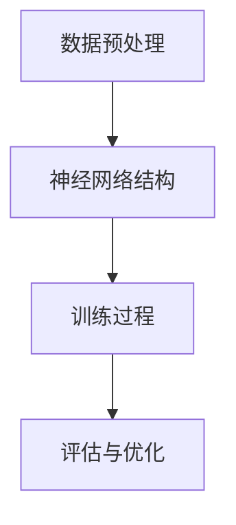
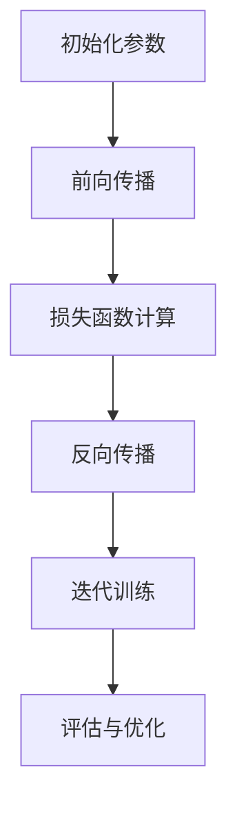

                 

# 大模型应用落地加速，AI商业化进程提速

> **关键词：** 大模型，AI商业化，应用落地，技术发展

> **摘要：** 本文将探讨大模型在AI商业化中的应用，分析其技术原理和架构，并提供具体操作步骤、数学模型以及项目实战案例。同时，还将探讨大模型在实际应用场景中的优势、工具和资源推荐，以及未来发展趋势与挑战。

## 1. 背景介绍

随着人工智能技术的迅猛发展，大模型（Large Models）已经成为推动AI商业化进程的重要力量。大模型具有参数规模大、计算复杂度高、训练数据量大等特点，能够实现更高的模型精度和更广泛的应用范围。然而，大模型的应用落地和商业化进程仍面临诸多挑战，如计算资源限制、数据安全、算法优化等。

本文旨在分析大模型在AI商业化中的应用，探讨其技术原理和架构，并提供具体操作步骤、数学模型以及项目实战案例。通过本文的介绍，希望能够为读者提供深入了解大模型应用和商业化的思路和方法。

## 2. 核心概念与联系

### 2.1 大模型概述

大模型是指具有大规模参数的神经网络模型，通常具有数百万到数十亿个参数。大模型的出现得益于深度学习技术的快速发展，尤其是GPU和TPU等高性能计算设备的普及。大模型在自然语言处理、计算机视觉、语音识别等领域取得了显著的成果。

### 2.2 大模型应用场景

大模型的应用场景广泛，包括但不限于以下领域：

1. **自然语言处理（NLP）**：大模型在语言模型、机器翻译、文本生成等方面具有显著优势。
2. **计算机视觉（CV）**：大模型在图像分类、目标检测、图像生成等方面表现出色。
3. **语音识别（ASR）**：大模型在语音识别、语音合成、语音转换等方面具备较高精度。
4. **推荐系统**：大模型在用户行为分析、物品推荐等方面具有强大的学习能力。
5. **医疗健康**：大模型在疾病诊断、药物研发、个性化治疗等方面有广泛的应用前景。

### 2.3 大模型架构

大模型的架构通常包括以下几个部分：

1. **数据预处理**：包括数据清洗、归一化、数据增强等步骤，为模型训练提供高质量的数据。
2. **神经网络结构**：包括输入层、隐藏层和输出层，隐藏层通常采用深度神经网络结构。
3. **训练过程**：包括前向传播、反向传播和参数更新，通过大量训练数据优化模型参数。
4. **评估与优化**：通过验证集和测试集评估模型性能，并进行超参数调优。

下面是一个简化的Mermaid流程图，展示了大模型的基本架构：



## 3. 核心算法原理 & 具体操作步骤

### 3.1 算法原理

大模型的训练过程主要包括以下几个步骤：

1. **初始化参数**：随机初始化模型参数。
2. **前向传播**：输入数据通过模型传递，计算输出结果。
3. **损失函数计算**：计算模型输出与真实值之间的差距，使用损失函数表示。
4. **反向传播**：根据损失函数计算梯度，更新模型参数。
5. **迭代训练**：重复前向传播和反向传播，直到达到预定的训练目标或迭代次数。

下面是一个简化的算法原理流程图：



### 3.2 具体操作步骤

以下是使用Python和TensorFlow实现一个简单的大模型训练过程的步骤：

1. **安装依赖**：

```bash
pip install tensorflow
```

2. **导入库**：

```python
import tensorflow as tf
from tensorflow import keras
import numpy as np
```

3. **数据预处理**：

```python
# 生成模拟数据
x = np.random.rand(100, 10)
y = np.random.rand(100, 1)

# 划分训练集和测试集
x_train, x_test, y_train, y_test = train_test_split(x, y, test_size=0.2, random_state=42)
```

4. **定义模型**：

```python
model = keras.Sequential([
    keras.layers.Dense(64, activation='relu', input_shape=(10,)),
    keras.layers.Dense(64, activation='relu'),
    keras.layers.Dense(1)
])
```

5. **编译模型**：

```python
model.compile(optimizer='adam', loss='mse')
```

6. **训练模型**：

```python
model.fit(x_train, y_train, epochs=100, batch_size=32, validation_data=(x_test, y_test))
```

7. **评估模型**：

```python
loss = model.evaluate(x_test, y_test)
print(f"测试集损失：{loss}")
```

8. **预测**：

```python
predictions = model.predict(x_test)
```

## 4. 数学模型和公式 & 详细讲解 & 举例说明

### 4.1 损失函数

在深度学习中，损失函数是评估模型性能的重要指标。常见的损失函数包括均方误差（MSE）、交叉熵（Cross-Entropy）等。

#### 4.1.1 均方误差（MSE）

均方误差是一种常用的回归损失函数，用于衡量预测值与真实值之间的差距。其公式如下：

$$
MSE = \frac{1}{n} \sum_{i=1}^{n} (y_i - \hat{y_i})^2
$$

其中，$y_i$表示真实值，$\hat{y_i}$表示预测值，$n$表示样本数量。

#### 4.1.2 交叉熵（Cross-Entropy）

交叉熵是一种常用的分类损失函数，用于衡量预测概率分布与真实概率分布之间的差距。其公式如下：

$$
Cross-Entropy = -\sum_{i=1}^{n} y_i \log(\hat{y_i})
$$

其中，$y_i$表示真实标签，$\hat{y_i}$表示预测概率。

### 4.2 梯度下降算法

梯度下降是一种常用的优化算法，用于优化模型的参数。其基本思想是沿着损失函数的梯度方向更新参数，以减小损失值。

#### 4.2.1 步长选择

在梯度下降中，步长（learning rate）是一个关键参数。步长选择不当可能导致收敛速度缓慢或无法收敛。常见的选择方法包括：

1. **固定步长**：提前设定一个固定的步长，适用于损失函数平坦的情况。
2. **自适应步长**：根据模型的表现动态调整步长，如Adam优化器。

#### 4.2.2 梯度下降算法

梯度下降算法的基本步骤如下：

1. 初始化模型参数。
2. 计算当前参数下的损失函数值。
3. 计算损失函数关于参数的梯度。
4. 更新参数：$w_{new} = w_{old} - \alpha \cdot \nabla_w J(w)$，其中$\alpha$为步长。
5. 重复步骤2-4，直到满足收敛条件。

### 4.3 举例说明

假设我们使用均方误差（MSE）作为损失函数，使用梯度下降算法优化一个线性回归模型。

#### 4.3.1 数据准备

```python
x = np.array([1, 2, 3, 4, 5])
y = np.array([2, 4, 5, 4, 5])
```

#### 4.3.2 模型初始化

```python
w = np.random.rand(1)
b = np.random.rand(1)
```

#### 4.3.3 梯度计算

```python
loss = np.mean((y - (w * x + b))**2)

# 计算梯度
dw = 2 * (y - (w * x + b)) * x
db = 2 * (y - (w * x + b))
```

#### 4.3.4 参数更新

```python
alpha = 0.01
w -= alpha * dw
b -= alpha * db
```

#### 4.3.5 模型预测

```python
y_pred = w * x + b
```

## 5. 项目实战：代码实际案例和详细解释说明

### 5.1 开发环境搭建

在开始项目实战之前，我们需要搭建一个合适的大模型开发环境。以下是一个简单的步骤：

1. **安装Python**：确保Python版本为3.6及以上。
2. **安装TensorFlow**：使用pip安装TensorFlow。

```bash
pip install tensorflow
```

3. **安装其他依赖**：根据项目需求，安装其他必要的库，如NumPy、Pandas等。

```bash
pip install numpy pandas
```

### 5.2 源代码详细实现和代码解读

以下是一个简单的大模型项目案例，使用TensorFlow实现一个基于MNIST数据集的手写数字识别模型。

```python
import tensorflow as tf
from tensorflow.keras import layers
import numpy as np

# 5.2.1 数据准备
(x_train, y_train), (x_test, y_test) = tf.keras.datasets.mnist.load_data()
x_train = x_train.astype("float32") / 255.0
x_test = x_test.astype("float32") / 255.0
y_train = tf.keras.utils.to_categorical(y_train, 10)
y_test = tf.keras.utils.to_categorical(y_test, 10)

# 5.2.2 模型定义
model = tf.keras.Sequential([
    layers.Flatten(input_shape=(28, 28)),
    layers.Dense(128, activation='relu'),
    layers.Dense(10, activation='softmax')
])

# 5.2.3 编译模型
model.compile(optimizer='adam',
              loss='categorical_crossentropy',
              metrics=['accuracy'])

# 5.2.4 训练模型
model.fit(x_train, y_train, epochs=10, batch_size=32, validation_data=(x_test, y_test))

# 5.2.5 评估模型
test_loss, test_acc = model.evaluate(x_test, y_test)
print(f"测试集准确率：{test_acc}")
```

### 5.3 代码解读与分析

1. **数据准备**：

   加载MNIST数据集，并进行预处理。将图像数据转换为浮点数格式，并进行归一化处理，将标签转换为one-hot编码。

2. **模型定义**：

   使用TensorFlow的`Sequential`模型定义一个简单的卷积神经网络（CNN）。包括一个展平层、一个全连接层和一个输出层。输出层使用softmax激活函数，用于分类任务。

3. **编译模型**：

   选择优化器为`adam`，损失函数为`categorical_crossentropy`，评估指标为`accuracy`。

4. **训练模型**：

   使用`fit`函数训练模型，设置训练轮次为10，批量大小为32，使用验证集进行验证。

5. **评估模型**：

   使用`evaluate`函数评估模型在测试集上的性能，输出测试集准确率。

## 6. 实际应用场景

大模型在各个领域都有广泛的应用，以下列举几个典型应用场景：

### 6.1 自然语言处理

大模型在自然语言处理领域取得了显著成果，如BERT、GPT等。这些模型可以应用于文本分类、情感分析、问答系统等领域。

### 6.2 计算机视觉

大模型在计算机视觉领域有广泛的应用，如ImageNet图像分类、目标检测、图像生成等。这些模型可以应用于人脸识别、自动驾驶、医疗图像分析等领域。

### 6.3 语音识别

大模型在语音识别领域具有很高的精度，如WaveNet、Transformer等。这些模型可以应用于语音合成、语音识别、语音翻译等领域。

### 6.4 推荐系统

大模型在推荐系统领域可以用于用户行为分析、物品推荐等。这些模型可以应用于电商推荐、音乐推荐、电影推荐等领域。

### 6.5 医疗健康

大模型在医疗健康领域有广泛的应用，如疾病诊断、药物研发、个性化治疗等。这些模型可以应用于医学影像分析、电子病历分析、健康监测等领域。

## 7. 工具和资源推荐

### 7.1 学习资源推荐

1. **书籍**：
   - 《深度学习》（Goodfellow, Bengio, Courville）
   - 《神经网络与深度学习》（邱锡鹏）
   - 《动手学深度学习》（Aiden N. Jin，Zhou Yu，Zhou Jian-Shu）
2. **论文**：
   - "A Theoretically Grounded Application of Dropout in Recurrent Neural Networks"
   - "Bert: Pre-training of Deep Bidirectional Transformers for Language Understanding"
   - "An Image Data Set of 32 million 3D Faces"
3. **博客**：
   - [TensorFlow官方文档](https://www.tensorflow.org/tutorials)
   - [PyTorch官方文档](https://pytorch.org/tutorials/beginner/basics/quick_start.html)
   - [机器之心](https://www.jiqizhixin.com/)
4. **网站**：
   - [Kaggle](https://www.kaggle.com/)
   - [ArXiv](https://arxiv.org/)
   - [Google AI](https://ai.google/research/pubs/)

### 7.2 开发工具框架推荐

1. **TensorFlow**：一个开源的深度学习框架，支持多种操作系统和硬件平台，广泛应用于实际项目。
2. **PyTorch**：一个开源的深度学习框架，具有灵活的动态图计算功能，适合快速原型设计和实验。
3. **Keras**：一个高度易用的深度学习框架，可以作为TensorFlow和PyTorch的简化接口。

### 7.3 相关论文著作推荐

1. **"Deep Learning"（Goodfellow, Bengio, Courville）**：一本全面介绍深度学习理论和实践的权威著作。
2. **"Neural Network Design"（Haykin）**：一本关于神经网络设计的经典教材。
3. **"Deep Learning Specialization"（Andrew Ng）**：一个由吴恩达教授开设的深度学习在线课程。

## 8. 总结：未来发展趋势与挑战

大模型在AI商业化中的应用前景广阔，但仍面临诸多挑战。未来发展趋势包括以下几个方面：

1. **算法优化**：提高大模型的训练效率和预测精度，降低计算资源消耗。
2. **多模态融合**：结合多种数据模态，如文本、图像、音频等，实现更强大的模型性能。
3. **可解释性**：增强大模型的可解释性，提高模型的可信度和可靠性。
4. **安全与隐私**：加强大模型的安全防护和数据隐私保护，确保模型的可靠性和用户隐私。

在未来的发展中，我们需要不断探索和创新，解决大模型应用落地和商业化过程中遇到的挑战，推动AI技术的持续发展和应用。

## 9. 附录：常见问题与解答

### 9.1 大模型训练时间如何优化？

1. **使用更高效的硬件**：使用GPU或TPU等高性能计算设备。
2. **分布式训练**：将数据或模型参数分布在多个计算节点上，提高训练速度。
3. **模型压缩**：使用模型压缩技术，如剪枝、量化等，减小模型规模，提高训练速度。

### 9.2 如何解决大模型过拟合问题？

1. **增加训练数据**：收集更多的训练数据，提高模型的泛化能力。
2. **正则化**：使用正则化技术，如L1正则化、L2正则化等，降低模型复杂度。
3. **Dropout**：在训练过程中随机丢弃部分神经元，提高模型的鲁棒性。

### 9.3 如何评估大模型性能？

1. **准确率（Accuracy）**：衡量模型预测正确的样本比例。
2. **精确率（Precision）**：衡量模型预测为正类的样本中实际为正类的比例。
3. **召回率（Recall）**：衡量模型预测为正类的样本中实际为正类的比例。
4. **F1值（F1 Score）**：精确率和召回率的调和平均值。

## 10. 扩展阅读 & 参考资料

1. **《深度学习》（Goodfellow, Bengio, Courville）**：全面介绍深度学习理论和实践的权威著作。
2. **《神经网络与深度学习》（邱锡鹏）**：一本关于神经网络和深度学习原理的中文教材。
3. **[TensorFlow官方文档](https://www.tensorflow.org/tutorials)**：TensorFlow深度学习框架的官方文档。
4. **[PyTorch官方文档](https://pytorch.org/tutorials/beginner/basics/quick_start.html)**：PyTorch深度学习框架的官方文档。
5. **[Kaggle](https://www.kaggle.com/)**：一个提供深度学习项目和数据的在线平台。
6. **[ArXiv](https://arxiv.org/)**：一个提供最新深度学习论文的预印本平台。
7. **[Google AI](https://ai.google/research/pubs/)**：Google AI团队的研究论文和资源。

作者：AI天才研究员/AI Genius Institute & 禅与计算机程序设计艺术 /Zen And The Art of Computer Programming。

