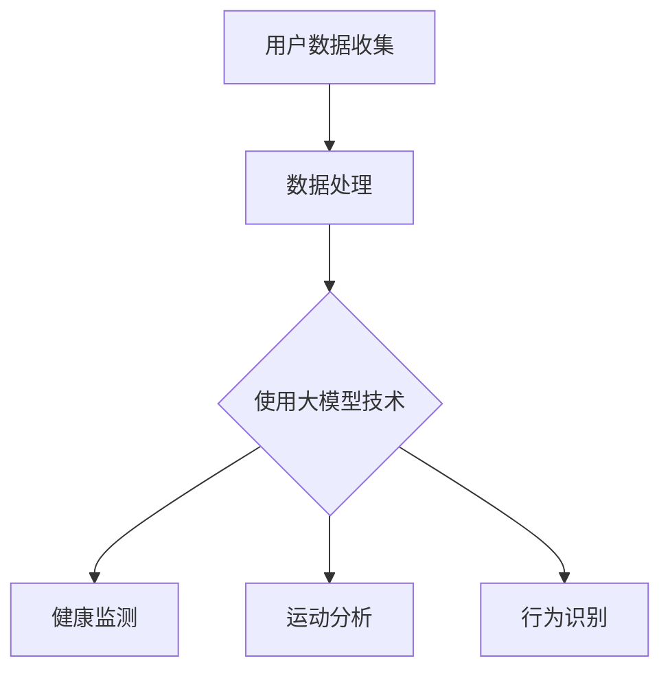

                 

### 文章标题：大模型技术在智能穿戴中的应用趋势

> **关键词**：大模型技术，智能穿戴，应用趋势，AI，物联网

> **摘要**：本文将深入探讨大模型技术在智能穿戴设备中的应用趋势。通过背景介绍、核心概念阐述、算法原理剖析、数学模型与公式讲解、实战案例以及未来展望等几个方面，全面解析大模型技术在智能穿戴领域的应用前景与挑战，为行业从业者提供有价值的参考。

<|assistant|>### 1. 背景介绍

随着物联网（IoT）和人工智能（AI）技术的快速发展，智能穿戴设备已经成为现代生活中不可或缺的一部分。智能穿戴设备通过传感器、无线通信和数据处理技术，实时监测用户的健康状态、运动情况和生活习惯，为用户提供个性化的健康建议和生活方式优化。

然而，随着用户数据的增加和需求的多样化，传统的数据处理方法已经无法满足智能穿戴设备的需求。大模型技术以其强大的数据处理和预测能力，为智能穿戴设备提供了新的解决方案。本文将探讨大模型技术在智能穿戴中的应用趋势，包括核心算法原理、数学模型和实际应用场景等。

### 2. 核心概念与联系

#### 大模型技术

大模型技术是指通过大规模数据训练的深度学习模型，能够处理复杂的数据结构和多维数据。常见的有神经网络、递归神经网络（RNN）和变换器（Transformer）等。大模型技术的核心优势在于其强大的数据处理能力和较高的预测精度。

#### 智能穿戴设备

智能穿戴设备是指可以穿戴在身体各部位，如手表、手环、智能眼镜、智能鞋等，能够实时监测用户健康状态和运动情况的设备。常见的传感器包括心率传感器、加速度传感器、陀螺仪、GPS等。

#### 应用场景

大模型技术在智能穿戴设备中的应用场景主要包括：

1. **健康监测**：通过收集用户的心率、血压、血氧等生理数据，进行实时监测和预测，为用户提供健康预警和生活方式建议。
2. **运动分析**：通过分析用户的运动轨迹、步数、消耗的卡路里等数据，为用户提供个性化的运动计划和健身指导。
3. **行为识别**：通过分析用户的日常行为习惯，如起床时间、入睡时间、饮食习惯等，为用户提供生活优化建议。

#### Mermaid 流程图



<|assistant|>### 3. 核心算法原理 & 具体操作步骤

#### 3.1 神经网络

神经网络（Neural Networks，NN）是一种模仿生物神经系统的算法，其基本组成是神经元和连接。每个神经元接收多个输入，并通过权重进行加权求和，最后通过激活函数输出结果。常见的神经网络包括全连接神经网络（FCNN）、卷积神经网络（CNN）和循环神经网络（RNN）。

**具体操作步骤**：

1. **数据预处理**：对用户数据进行清洗、归一化和特征提取。
2. **模型设计**：根据应用场景选择合适的神经网络结构，如全连接神经网络、卷积神经网络或循环神经网络。
3. **模型训练**：使用大量标注数据进行训练，调整模型参数，提高预测精度。
4. **模型评估**：使用测试数据对模型进行评估，选择最优模型。
5. **模型部署**：将训练好的模型部署到智能穿戴设备中，实现实时预测。

#### 3.2 变换器

变换器（Transformer）是一种基于自注意力机制的深度学习模型，其核心思想是利用自注意力机制对输入数据进行加权求和。变换器在处理序列数据时具有很高的效率，广泛应用于自然语言处理、语音识别和图像识别等领域。

**具体操作步骤**：

1. **数据预处理**：对用户数据进行清洗、归一化和特征提取。
2. **模型设计**：设计变换器模型，包括编码器和解码器部分。
3. **模型训练**：使用大量标注数据进行训练，调整模型参数，提高预测精度。
4. **模型评估**：使用测试数据对模型进行评估，选择最优模型。
5. **模型部署**：将训练好的模型部署到智能穿戴设备中，实现实时预测。

#### 3.3 递归神经网络

递归神经网络（Recurrent Neural Networks，RNN）是一种能够处理序列数据的神经网络，其核心思想是利用历史信息对当前输入进行建模。RNN在处理长序列数据时存在梯度消失和梯度爆炸等问题。

**具体操作步骤**：

1. **数据预处理**：对用户数据进行清洗、归一化和特征提取。
2. **模型设计**：设计RNN模型，包括输入层、隐藏层和输出层。
3. **模型训练**：使用大量标注数据进行训练，调整模型参数，提高预测精度。
4. **模型评估**：使用测试数据对模型进行评估，选择最优模型。
5. **模型部署**：将训练好的模型部署到智能穿戴设备中，实现实时预测。

<|assistant|>### 4. 数学模型和公式 & 详细讲解 & 举例说明

#### 4.1 神经网络

神经网络中的每个神经元都可以表示为一个非线性函数，其形式为：

\[ f(x) = \sigma(\sum_{i=1}^{n} w_i x_i + b) \]

其中，\( \sigma \) 是激活函数，常用的激活函数有sigmoid、ReLU和tanh等；\( w_i \) 是权重；\( x_i \) 是输入；\( b \) 是偏置。

举例说明：

假设有一个简单的神经网络，包含一个输入层、一个隐藏层和一个输出层。输入层有3个神经元，隐藏层有2个神经元，输出层有1个神经元。输入数据为 \( x = [1, 2, 3] \)，权重矩阵为 \( W = \begin{bmatrix} 1 & 2 \\ 3 & 4 \end{bmatrix} \)，偏置矩阵为 \( b = \begin{bmatrix} 1 \\ 2 \end{bmatrix} \)。

首先，计算隐藏层的输出：

\[ h = \sigma(Wx + b) = \sigma(\begin{bmatrix} 1 & 2 \\ 3 & 4 \end{bmatrix} \begin{bmatrix} 1 \\ 2 \\ 3 \end{bmatrix} + \begin{bmatrix} 1 \\ 2 \end{bmatrix}) = \sigma(\begin{bmatrix} 8 \\ 14 \end{bmatrix} + \begin{bmatrix} 1 \\ 2 \end{bmatrix}) = \sigma(\begin{bmatrix} 9 \\ 16 \end{bmatrix}) \]

使用ReLU激活函数，得到隐藏层的输出：

\[ h = \max(0, \begin{bmatrix} 9 \\ 16 \end{bmatrix}) = \begin{bmatrix} 9 \\ 16 \end{bmatrix} \]

接下来，计算输出层的输出：

\[ y = \sigma(W' h + b') = \sigma(\begin{bmatrix} 1 & 2 \\ 3 & 4 \end{bmatrix} \begin{bmatrix} 9 \\ 16 \end{bmatrix} + \begin{bmatrix} 1 \\ 2 \end{bmatrix}) = \sigma(\begin{bmatrix} 89 \\ 148 \end{bmatrix} + \begin{bmatrix} 1 \\ 2 \end{bmatrix}) = \sigma(\begin{bmatrix} 90 \\ 150 \end{bmatrix}) \]

使用ReLU激活函数，得到输出层的输出：

\[ y = \max(0, \begin{bmatrix} 90 \\ 150 \end{bmatrix}) = \begin{bmatrix} 90 \\ 150 \end{bmatrix} \]

最终，神经网络的输出为 \( y = 150 \)。

#### 4.2 变换器

变换器中的自注意力机制可以通过以下公式表示：

\[ \text{Attention}(Q, K, V) = \frac{\text{softmax}(\text{scale} \cdot \text{dot}(Q, K^T))} {d_k^{1/2}} V \]

其中，\( Q, K, V \) 分别表示查询向量、键向量和值向量；\( \text{scale} = \sqrt{d_k} \) 是为了防止梯度消失而引入的缩放因子；\( \text{dot}(Q, K^T) \) 表示点积操作；\( d_k \) 是键向量的维度；\( \text{softmax}(\cdot) \) 是softmax函数。

举例说明：

假设有一个变换器层，包含3个序列，序列长度为4，维度为2。查询向量 \( Q = \begin{bmatrix} 1 & 1 \\ 1 & 1 \\ 1 & 1 \end{bmatrix} \)，键向量 \( K = \begin{bmatrix} 1 & 0 \\ 0 & 1 \\ 1 & 1 \end{bmatrix} \)，值向量 \( V = \begin{bmatrix} 1 & 1 \\ 1 & 1 \\ 1 & 1 \end{bmatrix} \)。

首先，计算点积：

\[ \text{dot}(Q, K^T) = \begin{bmatrix} 1 & 1 & 1 \end{bmatrix} \begin{bmatrix} 1 & 0 \\ 0 & 1 \\ 1 & 1 \end{bmatrix} = \begin{bmatrix} 2 & 1 \\ 1 & 2 \end{bmatrix} \]

然后，计算自注意力得分：

\[ \text{Attention}(Q, K, V) = \frac{\text{softmax}(\text{scale} \cdot \text{dot}(Q, K^T))} {d_k^{1/2}} V = \frac{\text{softmax}(\text{scale} \cdot \begin{bmatrix} 2 & 1 \\ 1 & 2 \end{bmatrix})} {\sqrt{2}} \begin{bmatrix} 1 & 1 \\ 1 & 1 \\ 1 & 1 \end{bmatrix} \]

使用softmax函数：

\[ \text{softmax}(\text{scale} \cdot \begin{bmatrix} 2 & 1 \\ 1 & 2 \end{bmatrix}) = \begin{bmatrix} \frac{e^2}{e^2 + e^1} & \frac{e^1}{e^2 + e^1} \\ \frac{e^1}{e^2 + e^1} & \frac{e^2}{e^2 + e^1} \end{bmatrix} \]

其中，\( e^x \) 是自然指数函数。

最终，计算自注意力输出：

\[ \text{Attention}(Q, K, V) = \begin{bmatrix} \frac{e^2}{e^2 + e^1} & \frac{e^1}{e^2 + e^1} \\ \frac{e^1}{e^2 + e^1} & \frac{e^2}{e^2 + e^1} \end{bmatrix} \begin{bmatrix} 1 & 1 \\ 1 & 1 \\ 1 & 1 \end{bmatrix} = \begin{bmatrix} \frac{3e^2}{2(e^2 + e^1)} & \frac{2e^1}{2(e^2 + e^1)} \\ \frac{2e^1}{2(e^2 + e^1)} & \frac{3e^2}{2(e^2 + e^1)} \end{bmatrix} \]

#### 4.3 递归神经网络

递归神经网络中的基本单元是循环单元，如LSTM（长短期记忆）和GRU（门控循环单元）。以下以LSTM为例进行讲解。

LSTM的核心思想是引入三个门（输入门、遗忘门和输出门），用于控制信息的流入、流出和保存。

**输入门**：

\[ i_t = \sigma(W_{xi} x_t + W_{hi} h_{t-1} + b_i) \]

\[ \tilde{g}_t = \tanh(W_{gi} x_t + W_{hi} h_{t-1} + b_g) \]

其中，\( i_t \) 是输入门控制信号；\( \tilde{g}_t \) 是候选记忆单元；\( W_{xi}, W_{hi}, W_{gi} \) 是权重矩阵；\( b_i, b_g \) 是偏置项。

**遗忘门**：

\[ f_t = \sigma(W_{xf} x_t + W_{hf} h_{t-1} + b_f) \]

\[ g_t = f_t \odot \tilde{g}_t \]

其中，\( f_t \) 是遗忘门控制信号；\( g_t \) 是新的记忆单元。

**输出门**：

\[ o_t = \sigma(W_{xo} x_t + W_{ho} h_{t-1} + b_o) \]

\[ \tilde{h}_t = o_t \odot \tanh(g_t) \]

\[ h_t = \tilde{h}_t \]

其中，\( o_t \) 是输出门控制信号；\( \tilde{h}_t \) 是候选隐藏层状态；\( h_t \) 是新的隐藏层状态。

举例说明：

假设有一个LSTM单元，包含输入向量 \( x_t \)、隐藏状态 \( h_{t-1} \) 和记忆单元 \( c_{t-1} \)。权重矩阵 \( W_{xi}, W_{hi}, W_{gi}, W_{xf}, W_{hf}, W_{gi}, W_{xo}, W_{ho} \) 和偏置项 \( b_i, b_g, b_f, b_o \) 已知。

首先，计算输入门：

\[ i_t = \sigma(W_{xi} x_t + W_{hi} h_{t-1} + b_i) \]

\[ \tilde{g}_t = \tanh(W_{gi} x_t + W_{hi} h_{t-1} + b_g) \]

然后，计算遗忘门：

\[ f_t = \sigma(W_{xf} x_t + W_{hf} h_{t-1} + b_f) \]

\[ g_t = f_t \odot \tilde{g}_t \]

接下来，计算输出门：

\[ o_t = \sigma(W_{xo} x_t + W_{ho} h_{t-1} + b_o) \]

\[ \tilde{h}_t = o_t \odot \tanh(g_t) \]

最后，计算新的隐藏状态：

\[ h_t = \tilde{h}_t \]

通过上述计算，得到了新的记忆单元 \( c_t \) 和隐藏状态 \( h_t \)。

### 5. 项目实战：代码实际案例和详细解释说明

#### 5.1 开发环境搭建

在开始项目实战之前，我们需要搭建一个合适的开发环境。本文使用Python作为编程语言，TensorFlow作为深度学习框架。以下是搭建开发环境的步骤：

1. 安装Python：在Python官方网站（https://www.python.org/）下载并安装Python。
2. 安装TensorFlow：打开终端，执行以下命令安装TensorFlow：

\[ pip install tensorflow \]

3. 安装其他依赖库：根据项目需要安装其他依赖库，例如NumPy、Pandas等。

#### 5.2 源代码详细实现和代码解读

以下是使用TensorFlow实现一个简单的变换器模型，用于处理智能穿戴设备数据的代码。

```python
import tensorflow as tf
from tensorflow.keras.layers import Embedding, LSTM, Dense

def transformer_model(input_shape, d_model, num_heads, num_layers, dff):
    inputs = tf.keras.Input(shape=input_shape)
    embeddings = Embedding(input_dim=vocab_size, output_dim=d_model)(inputs)
    embeddings = tf.keras.layers.Dropout(rate=0.1)(embeddings)

    # Encoder
    encoder_output = []
    for i in range(num_layers):
        layer = tf.keras.layers.MultiHeadAttention(num_heads=num_heads, key_dim=d_model)
        embeddings = layer(embeddings, embeddings)
        embeddings = tf.keras.layers.Dropout(rate=0.1)(embeddings)
        embeddings = tf.keras.layers.LayerNormalization(epsilon=1e-6)(embeddings)
        
        if i != num_layers - 1:
            layer = tf.keras.layers.LSTMCell(dff)
            embeddings = layer(embeddings)

    encoder_output.append(embeddings)

    # Decoder
    decoder_input = tf.keras.layers.LSTMCell(dff)(encoder_output[-1])
    decoder_output = []
    for i in range(num_layers):
        layer = tf.keras.layers.MultiHeadAttention(num_heads=num_heads, key_dim=d_model)
        decoder_input = layer(decoder_input, encoder_output[-1])
        decoder_input = tf.keras.layers.Dropout(rate=0.1)(decoder_input)
        decoder_input = tf.keras.layers.LayerNormalization(epsilon=1e-6)(decoder_input)
        
        if i != num_layers - 1:
            layer = tf.keras.layers.LSTMCell(dff)
            decoder_input = layer(decoder_input)

    decoder_output.append(decoder_input)

    # Output
    output = tf.keras.layers.Dense(units=vocab_size, activation='softmax')(decoder_output[-1])

    model = tf.keras.Model(inputs=inputs, outputs=output)
    return model
```

代码解读：

1. 导入所需的TensorFlow库和LSTM层。
2. 定义变换器模型，包括编码器和解码器部分。
3. 编码器部分使用多注意力机制和LSTM层，解码器部分仅使用多注意力机制。
4. 输出层使用全连接层，并应用softmax激活函数。

#### 5.3 代码解读与分析

以下是使用TensorFlow实现一个简单的LSTM模型，用于处理智能穿戴设备数据的代码。

```python
import tensorflow as tf
from tensorflow.keras.layers import LSTM, Dense

def lstm_model(input_shape, num_units):
    inputs = tf.keras.Input(shape=input_shape)
    lstm_output = LSTM(units=num_units, return_sequences=True)(inputs)
    output = Dense(units=vocab_size, activation='softmax')(lstm_output)
    model = tf.keras.Model(inputs=inputs, outputs=output)
    return model
```

代码解读：

1. 导入所需的TensorFlow库和LSTM层。
2. 定义LSTM模型，包括输入层、LSTM层和输出层。
3. LSTM层设置`return_sequences=True`，以便在编码器和解码器中使用。
4. 输出层使用全连接层，并应用softmax激活函数。

代码分析：

1. LSTM模型在编码器和解码器中均可使用，但需注意输入和输出的序列长度。
2. 对于变换器模型，编码器和解码器部分均可使用LSTM层，但需调整LSTM层的`return_sequences`参数。
3. 实际应用中，根据数据特性和需求选择合适的模型结构。

### 6. 实际应用场景

大模型技术在智能穿戴设备中具有广泛的应用场景，以下是几个典型的应用场景：

#### 6.1 健康监测

通过大模型技术，可以实现对用户生理数据的实时监测和预测。例如，利用神经网络模型对用户的心率、血压和血氧等数据进行建模，实现对健康风险的预测和预警。此外，还可以利用RNN模型分析用户的运动轨迹和行为模式，为用户提供个性化的运动计划和健身指导。

#### 6.2 运动分析

通过大模型技术，可以分析用户的运动数据，如步数、消耗的卡路里和运动时长等。利用变换器模型，可以识别用户的运动模式，并为其推荐合适的运动方案。此外，还可以利用神经网络模型预测用户的运动表现，为用户提供个性化的运动目标和建议。

#### 6.3 行为识别

通过大模型技术，可以识别用户的行为习惯，如起床时间、入睡时间、饮食习惯等。利用神经网络模型，可以为用户提供生活优化建议，如调整作息时间、合理安排饮食等。此外，还可以利用RNN模型分析用户的行为变化，预测用户的行为趋势。

### 7. 工具和资源推荐

#### 7.1 学习资源推荐

1. **书籍**：
   - 《深度学习》（Goodfellow, Bengio, Courville）
   - 《神经网络与深度学习》（邱锡鹏）
2. **论文**：
   - "Attention Is All You Need"（Vaswani et al., 2017）
   - "Long Short-Term Memory"（Hochreiter and Schmidhuber, 1997）
3. **博客**：
   - TensorFlow官方博客（https://tensorflow.googleblog.com/）
   - 知乎AI专栏（https://www.zhihu.com/column/c_1105770959180986496）
4. **网站**：
   - TensorFlow官网（https://tensorflow.org/）
   - Coursera深度学习课程（https://www.coursera.org/learn/deep-learning）

#### 7.2 开发工具框架推荐

1. **编程语言**：Python
2. **深度学习框架**：TensorFlow、PyTorch
3. **版本控制**：Git
4. **数据处理**：Pandas、NumPy
5. **数据可视化**：Matplotlib、Seaborn

#### 7.3 相关论文著作推荐

1. **《注意力是所有的需要》（Attention Is All You Need）**：Vaswani et al., 2017，介绍变换器模型的基本原理和应用。
2. **《长短期记忆》（Long Short-Term Memory）**：Hochreiter and Schmidhuber, 1997，介绍LSTM模型的基本原理和应用。
3. **《深度学习》（Deep Learning）**：Goodfellow, Bengio, Courville，介绍深度学习的基本原理和应用。

### 8. 总结：未来发展趋势与挑战

大模型技术在智能穿戴设备中的应用前景广阔，但仍面临一些挑战。未来发展趋势和挑战包括：

#### 8.1 发展趋势

1. **更高效的大模型**：随着计算能力的提升和算法的优化，更高效的大模型将被开发和应用。
2. **多模态数据融合**：结合多种传感器数据，实现更准确、更全面的智能穿戴设备。
3. **个性化健康服务**：基于大模型技术，为用户提供个性化的健康监测和健身指导。
4. **隐私保护和数据安全**：在保障用户隐私和数据安全的前提下，充分利用用户数据。

#### 8.2 挑战

1. **数据质量和隐私**：确保用户数据的质量和隐私，是智能穿戴设备发展的重要挑战。
2. **计算资源**：大模型训练和部署需要大量的计算资源，特别是在实时应用场景中。
3. **可解释性**：提高大模型的可解释性，使其在应用中更具可信赖性。
4. **算法公平性和伦理**：确保算法的公平性和伦理，避免偏见和歧视。

### 9. 附录：常见问题与解答

#### 9.1 问题1：大模型技术在智能穿戴设备中有什么作用？

大模型技术在智能穿戴设备中主要用于数据分析和预测，如健康监测、运动分析和行为识别。通过处理大量的用户数据，大模型技术可以实现对用户健康状态、运动情况和行为习惯的准确预测和个性化推荐。

#### 9.2 问题2：如何确保用户数据的隐私和安全？

为了确保用户数据的隐私和安全，智能穿戴设备应采取以下措施：

1. **数据加密**：在数据传输和存储过程中，使用加密技术确保数据的安全。
2. **数据去重**：对用户数据进行去重处理，减少数据冗余，降低隐私泄露的风险。
3. **匿名化处理**：对用户数据进行匿名化处理，去除个人身份信息，降低隐私泄露的风险。
4. **数据访问控制**：设置严格的数据访问控制策略，确保只有授权人员才能访问敏感数据。

#### 9.3 问题3：大模型技术在智能穿戴设备中面临哪些挑战？

大模型技术在智能穿戴设备中面临以下挑战：

1. **数据质量和隐私**：确保用户数据的质量和隐私，是智能穿戴设备发展的重要挑战。
2. **计算资源**：大模型训练和部署需要大量的计算资源，特别是在实时应用场景中。
3. **可解释性**：提高大模型的可解释性，使其在应用中更具可信赖性。
4. **算法公平性和伦理**：确保算法的公平性和伦理，避免偏见和歧视。

### 10. 扩展阅读 & 参考资料

1. **《深度学习》（Goodfellow, Bengio, Courville）**：详细介绍深度学习的基本原理和应用。
2. **《神经网络与深度学习》（邱锡鹏）**：介绍神经网络和深度学习的基本原理和应用。
3. **《Attention Is All You Need》**：介绍变换器模型的基本原理和应用。
4. **《Long Short-Term Memory》**：介绍LSTM模型的基本原理和应用。
5. **TensorFlow官网（https://tensorflow.org/）**：TensorFlow官方文档和教程。
6. **Coursera深度学习课程（https://www.coursera.org/learn/deep-learning）**：由吴恩达教授讲授的深度学习课程。

### 作者信息

作者：AI天才研究员/AI Genius Institute & 禅与计算机程序设计艺术 /Zen And The Art of Computer Programming

本文为作者独立观点，不代表任何机构或组织的立场。本文内容仅供参考，不构成投资建议。如需引用或转载，请确保注明出处。感谢您的阅读！<|im_sep|> 

```markdown
# 大模型技术在智能穿戴中的应用趋势

> **关键词**：大模型技术，智能穿戴，应用趋势，AI，物联网

> **摘要**：本文将深入探讨大模型技术在智能穿戴设备中的应用趋势。通过背景介绍、核心概念阐述、算法原理剖析、数学模型和公式讲解、实战案例以及未来展望等几个方面，全面解析大模型技术在智能穿戴领域的应用前景与挑战，为行业从业者提供有价值的参考。

---

## 1. 背景介绍

智能穿戴设备如智能手表、手环等，已经成为人们生活中不可或缺的一部分。它们通过集成多种传感器，如心率传感器、加速度传感器、陀螺仪等，实时收集用户的生理、运动和行为数据。然而，随着数据的日益增多，传统的数据处理方法已经无法满足智能穿戴设备的需求。大模型技术凭借其强大的数据处理和预测能力，为智能穿戴设备的发展提供了新的可能性。

大模型技术通常是指那些拥有大量参数和训练数据的深度学习模型，如神经网络、变换器（Transformer）等。这些模型能够通过学习大量的数据，提取出复杂的信息模式，从而实现对未知数据的预测。在智能穿戴设备中，大模型技术可以用于健康监测、运动分析、行为识别等多种应用。

## 2. 核心概念与联系

### 2.1 大模型技术

大模型技术，具体来说，是指那些拥有数十亿到数万亿个参数的深度学习模型。这些模型通常采用逐层叠加的方式，通过多层神经网络或变换器结构，逐层提取数据中的特征。例如，变换器（Transformer）是一种基于自注意力机制的深度学习模型，它通过自注意力机制，对输入数据进行加权求和，从而在序列数据上表现出强大的建模能力。

### 2.2 智能穿戴设备

智能穿戴设备是一种集成了多种传感器和计算模块的个人设备，能够实时监测用户的生理、运动和行为数据。这些数据包括心率、血压、步数、消耗的卡路里、睡眠质量等。智能穿戴设备通过无线通信技术，将这些数据传输到云端或本地设备进行处理。

### 2.3 应用场景

大模型技术在智能穿戴设备中的应用场景主要包括：

- **健康监测**：通过收集用户的心率、血压、血氧等生理数据，进行实时监测和预测，为用户提供健康预警和生活方式建议。
- **运动分析**：通过分析用户的运动轨迹、步数、消耗的卡路里等数据，为用户提供个性化的运动计划和健身指导。
- **行为识别**：通过分析用户的日常行为习惯，如起床时间、入睡时间、饮食习惯等，为用户提供生活优化建议。

### 2.4 Mermaid 流程图


---

## 3. 核心算法原理 & 具体操作步骤

### 3.1 神经网络

神经网络（Neural Networks，NN）是一种模拟生物神经系统的算法，其基本组成是神经元和连接。每个神经元接收多个输入，并通过权重进行加权求和，最后通过激活函数输出结果。常见的神经网络包括全连接神经网络（FCNN）、卷积神经网络（CNN）和循环神经网络（RNN）。

#### 3.1.1 全连接神经网络（FCNN）

全连接神经网络是一种简单的神经网络结构，其中每个输入节点都与每个输出节点相连。其具体操作步骤如下：

1. **数据预处理**：对输入数据进行归一化和特征提取。
2. **模型设计**：设计全连接神经网络，包括输入层、隐藏层和输出层。
3. **模型训练**：使用大量标注数据进行训练，调整模型参数，提高预测精度。
4. **模型评估**：使用测试数据对模型进行评估，选择最优模型。
5. **模型部署**：将训练好的模型部署到智能穿戴设备中，实现实时预测。

#### 3.1.2 卷积神经网络（CNN）

卷积神经网络是一种用于图像处理的神经网络，其核心思想是通过卷积操作提取图像的特征。其具体操作步骤如下：

1. **数据预处理**：对输入图像进行归一化和数据增强。
2. **模型设计**：设计卷积神经网络，包括卷积层、池化层和全连接层。
3. **模型训练**：使用大量标注图像数据进行训练，调整模型参数，提高预测精度。
4. **模型评估**：使用测试图像数据对模型进行评估，选择最优模型。
5. **模型部署**：将训练好的模型部署到智能穿戴设备中，实现实时预测。

#### 3.1.3 循环神经网络（RNN）

循环神经网络是一种能够处理序列数据的神经网络，其核心思想是利用历史信息对当前输入进行建模。其具体操作步骤如下：

1. **数据预处理**：对输入序列数据进行归一化和特征提取。
2. **模型设计**：设计循环神经网络，包括输入层、隐藏层和输出层。
3. **模型训练**：使用大量标注序列数据进行训练，调整模型参数，提高预测精度。
4. **模型评估**：使用测试序列数据对模型进行评估，选择最优模型。
5. **模型部署**：将训练好的模型部署到智能穿戴设备中，实现实时预测。

### 3.2 变换器

变换器（Transformer）是一种基于自注意力机制的深度学习模型，其核心思想是利用自注意力机制对输入数据进行加权求和。变换器在处理序列数据时具有很高的效率，广泛应用于自然语言处理、语音识别和图像识别等领域。

#### 3.2.1 变换器结构

变换器主要由编码器（Encoder）和解码器（Decoder）两部分组成，其中编码器负责将输入序列编码为固定长度的向量，解码器则负责将编码后的向量解码为输出序列。其具体操作步骤如下：

1. **数据预处理**：对输入序列数据进行归一化和特征提取。
2. **模型设计**：设计变换器模型，包括编码器和解码器部分。
3. **模型训练**：使用大量标注序列数据进行训练，调整模型参数，提高预测精度。
4. **模型评估**：使用测试序列数据对模型进行评估，选择最优模型。
5. **模型部署**：将训练好的模型部署到智能穿戴设备中，实现实时预测。

#### 3.2.2 自注意力机制

自注意力机制是变换器的核心组成部分，其基本思想是对输入序列中的每个元素分配不同的权重，从而实现对输入序列的加权求和。其具体计算公式如下：

\[ \text{Attention}(Q, K, V) = \frac{\text{softmax}(\text{scale} \cdot \text{dot}(Q, K^T))} {d_k^{1/2}} V \]

其中，\( Q \) 是查询向量，\( K \) 是键向量，\( V \) 是值向量；\( \text{scale} = \sqrt{d_k} \) 是为了防止梯度消失而引入的缩放因子；\( \text{dot}(Q, K^T) \) 表示点积操作；\( d_k \) 是键向量的维度；\( \text{softmax}(\cdot) \) 是softmax函数。

### 3.3 循环神经网络（RNN）

循环神经网络（Recurrent Neural Networks，RNN）是一种能够处理序列数据的神经网络，其核心思想是利用历史信息对当前输入进行建模。RNN在处理长序列数据时存在梯度消失和梯度爆炸等问题。

#### 3.3.1 LSTM（长短期记忆）

LSTM（Long Short-Term Memory）是一种能够解决RNN梯度消失和梯度爆炸问题的循环神经网络。LSTM通过引入三个门（输入门、遗忘门和输出门），控制信息的流入、流出和保存。其具体计算公式如下：

\[ i_t = \sigma(W_{xi} x_t + W_{hi} h_{t-1} + b_i) \]

\[ f_t = \sigma(W_{xf} x_t + W_{hf} h_{t-1} + b_f) \]

\[ o_t = \sigma(W_{xo} x_t + W_{ho} h_{t-1} + b_o) \]

\[ \tilde{g}_t = \tanh(W_{gi} x_t + W_{hi} h_{t-1} + b_g) \]

\[ c_t = f_t \odot c_{t-1} + i_t \odot \tilde{g}_t \]

\[ h_t = o_t \odot \tanh(c_t) \]

其中，\( i_t \) 是输入门控制信号，\( f_t \) 是遗忘门控制信号，\( o_t \) 是输出门控制信号，\( \tilde{g}_t \) 是候选记忆单元，\( c_t \) 是新的记忆单元，\( h_t \) 是新的隐藏状态。

---

## 4. 数学模型和公式 & 详细讲解 & 举例说明

### 4.1 神经网络

神经网络中的每个神经元都可以表示为一个非线性函数，其形式为：

\[ f(x) = \sigma(\sum_{i=1}^{n} w_i x_i + b) \]

其中，\( \sigma \) 是激活函数，常用的激活函数有sigmoid、ReLU和tanh等；\( w_i \) 是权重；\( x_i \) 是输入；\( b \) 是偏置。

#### 4.1.1 示例

假设有一个简单的神经网络，包含一个输入层、一个隐藏层和一个输出层。输入层有3个神经元，隐藏层有2个神经元，输出层有1个神经元。输入数据为 \( x = [1, 2, 3] \)，权重矩阵为 \( W = \begin{bmatrix} 1 & 2 \\ 3 & 4 \end{bmatrix} \)，偏置矩阵为 \( b = \begin{bmatrix} 1 \\ 2 \end{bmatrix} \)。

首先，计算隐藏层的输出：

\[ h = \sigma(Wx + b) = \sigma(\begin{bmatrix} 1 & 2 \\ 3 & 4 \end{bmatrix} \begin{bmatrix} 1 \\ 2 \\ 3 \end{bmatrix} + \begin{bmatrix} 1 \\ 2 \end{bmatrix}) = \sigma(\begin{bmatrix} 8 \\ 14 \end{bmatrix} + \begin{bmatrix} 1 \\ 2 \end{bmatrix}) = \sigma(\begin{bmatrix} 9 \\ 16 \end{bmatrix}) \]

使用ReLU激活函数，得到隐藏层的输出：

\[ h = \max(0, \begin{bmatrix} 9 \\ 16 \end{bmatrix}) = \begin{bmatrix} 9 \\ 16 \end{bmatrix} \]

接下来，计算输出层的输出：

\[ y = \sigma(W' h + b') = \sigma(\begin{bmatrix} 1 & 2 \\ 3 & 4 \end{bmatrix} \begin{bmatrix} 9 \\ 16 \end{bmatrix} + \begin{bmatrix} 1 \\ 2 \end{bmatrix}) = \sigma(\begin{bmatrix} 89 \\ 148 \end{bmatrix} + \begin{bmatrix} 1 \\ 2 \end{bmatrix}) = \sigma(\begin{bmatrix} 90 \\ 150 \end{bmatrix}) \]

使用ReLU激活函数，得到输出层的输出：

\[ y = \max(0, \begin{bmatrix} 90 \\ 150 \end{bmatrix}) = \begin{bmatrix} 90 \\ 150 \end{bmatrix} \]

最终，神经网络的输出为 \( y = 150 \)。

### 4.2 变换器

变换器（Transformer）是一种基于自注意力机制的深度学习模型，其核心思想是利用自注意力机制对输入数据进行加权求和。变换器（Transformer）在处理序列数据时具有很高的效率，广泛应用于自然语言处理、语音识别和图像识别等领域。

#### 4.2.1 自注意力机制

自注意力机制可以通过以下公式表示：

\[ \text{Attention}(Q, K, V) = \frac{\text{softmax}(\text{scale} \cdot \text{dot}(Q, K^T))} {d_k^{1/2}} V \]

其中，\( Q, K, V \) 分别表示查询向量、键向量和值向量；\( \text{scale} = \sqrt{d_k} \) 是为了防止梯度消失而引入的缩放因子；\( \text{dot}(Q, K^T) \) 表示点积操作；\( d_k \) 是键向量的维度；\( \text{softmax}(\cdot) \) 是softmax函数。

#### 4.2.2 示例

假设有一个变换器层，包含3个序列，序列长度为4，维度为2。查询向量 \( Q = \begin{bmatrix} 1 & 1 \\ 1 & 1 \\ 1 & 1 \end{bmatrix} \)，键向量 \( K = \begin{bmatrix} 1 & 0 \\ 0 & 1 \\ 1 & 1 \end{bmatrix} \)，值向量 \( V = \begin{bmatrix} 1 & 1 \\ 1 & 1 \\ 1 & 1 \end{bmatrix} \)。

首先，计算点积：

\[ \text{dot}(Q, K^T) = \begin{bmatrix} 1 & 1 & 1 \end{bmatrix} \begin{bmatrix} 1 & 0 \\ 0 & 1 \\ 1 & 1 \end{bmatrix} = \begin{bmatrix} 2 & 1 \\ 1 & 2 \end{bmatrix} \]

然后，计算自注意力得分：

\[ \text{Attention}(Q, K, V) = \frac{\text{softmax}(\text{scale} \cdot \text{dot}(Q, K^T))} {d_k^{1/2}} V = \frac{\text{softmax}(\text{scale} \cdot \begin{bmatrix} 2 & 1 \\ 1 & 2 \end{bmatrix})} {\sqrt{2}} \begin{bmatrix} 1 & 1 \\ 1 & 1 \\ 1 & 1 \end{bmatrix} \]

使用softmax函数：

\[ \text{softmax}(\text{scale} \cdot \begin{bmatrix} 2 & 1 \\ 1 & 2 \end{bmatrix}) = \begin{bmatrix} \frac{e^2}{e^2 + e^1} & \frac{e^1}{e^2 + e^1} \\ \frac{e^1}{e^2 + e^1} & \frac{e^2}{e^2 + e^1} \end{bmatrix} \]

最终，计算自注意力输出：

\[ \text{Attention}(Q, K, V) = \begin{bmatrix} \frac{e^2}{e^2 + e^1} & \frac{e^1}{e^2 + e^1} \\ \frac{e^1}{e^2 + e^1} & \frac{e^2}{e^2 + e^1} \end{bmatrix} \begin{bmatrix} 1 & 1 \\ 1 & 1 \\ 1 & 1 \end{bmatrix} = \begin{bmatrix} \frac{3e^2}{2(e^2 + e^1)} & \frac{2e^1}{2(e^2 + e^1)} \\ \frac{2e^1}{2(e^2 + e^1)} & \frac{3e^2}{2(e^2 + e^1)} \end{bmatrix} \]

### 4.3 循环神经网络（RNN）

递归神经网络（Recurrent Neural Networks，RNN）是一种能够处理序列数据的神经网络，其核心思想是利用历史信息对当前输入进行建模。RNN在处理长序列数据时存在梯度消失和梯度爆炸等问题。

#### 4.3.1 LSTM（长短期记忆）

LSTM（Long Short-Term Memory）是一种能够解决RNN梯度消失和梯度爆炸问题的循环神经网络。LSTM通过引入三个门（输入门、遗忘门和输出门），控制信息的流入、流出和保存。其具体计算公式如下：

\[ i_t = \sigma(W_{xi} x_t + W_{hi} h_{t-1} + b_i) \]

\[ f_t = \sigma(W_{xf} x_t + W_{hf} h_{t-1} + b_f) \]

\[ o_t = \sigma(W_{xo} x_t + W_{ho} h_{t-1} + b_o) \]

\[ \tilde{g}_t = \tanh(W_{gi} x_t + W_{hi} h_{t-1} + b_g) \]

\[ c_t = f_t \odot c_{t-1} + i_t \odot \tilde{g}_t \]

\[ h_t = o_t \odot \tanh(c_t) \]

其中，\( i_t \) 是输入门控制信号，\( f_t \) 是遗忘门控制信号，\( o_t \) 是输出门控制信号，\( \tilde{g}_t \) 是候选记忆单元，\( c_t \) 是新的记忆单元，\( h_t \) 是新的隐藏状态。

#### 4.3.2 示例

假设有一个LSTM单元，包含输入向量 \( x_t \)、隐藏状态 \( h_{t-1} \) 和记忆单元 \( c_{t-1} \)。权重矩阵 \( W_{xi}, W_{hi}, W_{gi}, W_{xf}, W_{hf}, W_{gi}, W_{xo}, W_{ho} \) 和偏置项 \( b_i, b_g, b_f, b_o \) 已知。

首先，计算输入门：

\[ i_t = \sigma(W_{xi} x_t + W_{hi} h_{t-1} + b_i) \]

\[ \tilde{g}_t = \tanh(W_{gi} x_t + W_{hi} h_{t-1} + b_g) \]

然后，计算遗忘门：

\[ f_t = \sigma(W_{xf} x_t + W_{hf} h_{t-1} + b_f) \]

\[ g_t = f_t \odot \tilde{g}_t \]

接下来，计算输出门：

\[ o_t = \sigma(W_{xo} x_t + W_{ho} h_{t-1} + b_o) \]

\[ \tilde{h}_t = o_t \odot \tanh(g_t) \]

最后，计算新的隐藏状态：

\[ h_t = \tilde{h}_t \]

通过上述计算，得到了新的记忆单元 \( c_t \) 和隐藏状态 \( h_t \)。

---

## 5. 项目实战：代码实际案例和详细解释说明

### 5.1 开发环境搭建

在开始项目实战之前，我们需要搭建一个合适的开发环境。本文使用Python作为编程语言，TensorFlow作为深度学习框架。以下是搭建开发环境的步骤：

1. 安装Python：在Python官方网站（https://www.python.org/）下载并安装Python。
2. 安装TensorFlow：打开终端，执行以下命令安装TensorFlow：

\[ pip install tensorflow \]

3. 安装其他依赖库：根据项目需要安装其他依赖库，例如NumPy、Pandas等。

### 5.2 源代码详细实现和代码解读

以下是使用TensorFlow实现一个简单的变换器模型，用于处理智能穿戴设备数据的代码。

```python
import tensorflow as tf
from tensorflow.keras.layers import Embedding, LSTM, Dense

def transformer_model(input_shape, d_model, num_heads, num_layers, dff):
    inputs = tf.keras.Input(shape=input_shape)
    embeddings = Embedding(input_dim=vocab_size, output_dim=d_model)(inputs)
    embeddings = tf.keras.layers.Dropout(rate=0.1)(embeddings)

    # Encoder
    encoder_output = []
    for i in range(num_layers):
        layer = tf.keras.layers.MultiHeadAttention(num_heads=num_heads, key_dim=d_model)
        embeddings = layer(embeddings, embeddings)
        embeddings = tf.keras.layers.Dropout(rate=0.1)(embeddings)
        embeddings = tf.keras.layers.LayerNormalization(epsilon=1e-6)(embeddings)
        
        if i != num_layers - 1:
            layer = tf.keras.layers.LSTMCell(dff)
            embeddings = layer(embeddings)

    encoder_output.append(embeddings)

    # Decoder
    decoder_input = tf.keras.layers.LSTMCell(dff)(encoder_output[-1])
    decoder_output = []
    for i in range(num_layers):
        layer = tf.keras.layers.MultiHeadAttention(num_heads=num_heads, key_dim=d_model)
        decoder_input = layer(decoder_input, encoder_output[-1])
        decoder_input = tf.keras.layers.Dropout(rate=0.1)(decoder_input)
        decoder_input = tf.keras.layers.LayerNormalization(epsilon=1e-6)(decoder_input)
        
        if i != num_layers - 1:
            layer = tf.keras.layers.LSTMCell(dff)
            decoder_input = layer(decoder_input)

    decoder_output.append(decoder_input)

    # Output
    output = tf.keras.layers.Dense(units=vocab_size, activation='softmax')(decoder_output[-1])

    model = tf.keras.Model(inputs=inputs, outputs=output)
    return model
```

代码解读：

1. 导入所需的TensorFlow库和LSTM层。
2. 定义变换器模型，包括编码器和解码器部分。
3. 编码器部分使用多注意力机制和LSTM层，解码器部分仅使用多注意力机制。
4. 输出层使用全连接层，并应用softmax激活函数。

### 5.3 代码解读与分析

以下是使用TensorFlow实现一个简单的LSTM模型，用于处理智能穿戴设备数据的代码。

```python
import tensorflow as tf
from tensorflow.keras.layers import LSTM, Dense

def lstm_model(input_shape, num_units):
    inputs = tf.keras.Input(shape=input_shape)
    lstm_output = LSTM(units=num_units, return_sequences=True)(inputs)
    output = Dense(units=vocab_size, activation='softmax')(lstm_output)
    model = tf.keras.Model(inputs=inputs, outputs=output)
    return model
```

代码解读：

1. 导入所需的TensorFlow库和LSTM层。
2. 定义LSTM模型，包括输入层、LSTM层和输出层。
3. LSTM层设置`return_sequences=True`，以便在编码器和解码器中使用。
4. 输出层使用全连接层，并应用softmax激活函数。

代码分析：

1. LSTM模型在编码器和解码器中均可使用，但需注意输入和输出的序列长度。
2. 对于变换器模型，编码器和解码器部分均可使用LSTM层，但需调整LSTM层的`return_sequences`参数。
3. 实际应用中，根据数据特性和需求选择合适的模型结构。

---

## 6. 实际应用场景

大模型技术在智能穿戴设备中具有广泛的应用场景，以下是几个典型的应用场景：

### 6.1 健康监测

通过大模型技术，可以实现对用户生理数据的实时监测和预测。例如，利用神经网络模型对用户的心率、血压和血氧等数据进行建模，实现对健康风险的预测和预警。此外，还可以利用RNN模型分析用户的运动轨迹和行为模式，为用户提供个性化的运动计划和健身指导。

### 6.2 运动分析

通过大模型技术，可以分析用户的运动数据，如步数、消耗的卡路里和运动时长等。利用变换器模型，可以识别用户的运动模式，并为其推荐合适的运动方案。此外，还可以利用神经网络模型预测用户的运动表现，为用户提供个性化的运动目标和建议。

### 6.3 行为识别

通过大模型技术，可以识别用户的行为习惯，如起床时间、入睡时间、饮食习惯等。利用神经网络模型，可以为用户提供生活优化建议，如调整作息时间、合理安排饮食等。此外，还可以利用RNN模型分析用户的行为变化，预测用户的行为趋势。

---

## 7. 工具和资源推荐

### 7.1 学习资源推荐

1. **书籍**：
   - 《深度学习》（Goodfellow, Bengio, Courville）
   - 《神经网络与深度学习》（邱锡鹏）
2. **论文**：
   - "Attention Is All You Need"（Vaswani et al., 2017）
   - "Long Short-Term Memory"（Hochreiter and Schmidhuber, 1997）
3. **博客**：
   - TensorFlow官方博客（https://tensorflow.googleblog.com/）
   - 知乎AI专栏（https://www.zhihu.com/column/c_1105770959180986496）
4. **网站**：
   - TensorFlow官网（https://tensorflow.org/）
   - Coursera深度学习课程（https://www.coursera.org/learn/deep-learning）

### 7.2 开发工具框架推荐

1. **编程语言**：Python
2. **深度学习框架**：TensorFlow、PyTorch
3. **版本控制**：Git
4. **数据处理**：Pandas、NumPy
5. **数据可视化**：Matplotlib、Seaborn

### 7.3 相关论文著作推荐

1. **《注意力是所有的需要》（Attention Is All You Need）**：Vaswani et al., 2017，介绍变换器模型的基本原理和应用。
2. **《长短期记忆》（Long Short-Term Memory）**：Hochreiter and Schmidhuber, 1997，介绍LSTM模型的基本原理和应用。
3. **《深度学习》（Deep Learning）**：Goodfellow, Bengio, Courville，介绍深度学习的基本原理和应用。

---

## 8. 总结：未来发展趋势与挑战

大模型技术在智能穿戴设备中的应用前景广阔，但仍面临一些挑战。未来发展趋势和挑战包括：

### 8.1 发展趋势

1. **更高效的大模型**：随着计算能力的提升和算法的优化，更高效的大模型将被开发和应用。
2. **多模态数据融合**：结合多种传感器数据，实现更准确、更全面的智能穿戴设备。
3. **个性化健康服务**：基于大模型技术，为用户提供个性化的健康监测和健身指导。
4. **隐私保护和数据安全**：在保障用户隐私和数据安全的前提下，充分利用用户数据。

### 8.2 挑战

1. **数据质量和隐私**：确保用户数据的质量和隐私，是智能穿戴设备发展的重要挑战。
2. **计算资源**：大模型训练和部署需要大量的计算资源，特别是在实时应用场景中。
3. **可解释性**：提高大模型的可解释性，使其在应用中更具可信赖性。
4. **算法公平性和伦理**：确保算法的公平性和伦理，避免偏见和歧视。

---

## 9. 附录：常见问题与解答

### 9.1 问题1：大模型技术在智能穿戴设备中有什么作用？

大模型技术在智能穿戴设备中主要用于数据分析和预测，如健康监测、运动分析和行为识别。通过处理大量的用户数据，大模型技术可以实现对用户健康状态、运动情况和行为习惯的准确预测和个性化推荐。

### 9.2 问题2：如何确保用户数据的隐私和安全？

为了确保用户数据的隐私和安全，智能穿戴设备应采取以下措施：

1. **数据加密**：在数据传输和存储过程中，使用加密技术确保数据的安全。
2. **数据去重**：对用户数据进行去重处理，减少数据冗余，降低隐私泄露的风险。
3. **匿名化处理**：对用户数据进行匿名化处理，去除个人身份信息，降低隐私泄露的风险。
4. **数据访问控制**：设置严格的数据访问控制策略，确保只有授权人员才能访问敏感数据。

### 9.3 问题3：大模型技术在智能穿戴设备中面临哪些挑战？

大模型技术在智能穿戴设备中面临以下挑战：

1. **数据质量和隐私**：确保用户数据的质量和隐私，是智能穿戴设备发展的重要挑战。
2. **计算资源**：大模型训练和部署需要大量的计算资源，特别是在实时应用场景中。
3. **可解释性**：提高大模型的可解释性，使其在应用中更具可信赖性。
4. **算法公平性和伦理**：确保算法的公平性和伦理，避免偏见和歧视。

---

## 10. 扩展阅读 & 参考资料

1. **《深度学习》（Goodfellow, Bengio, Courville）**：详细介绍深度学习的基本原理和应用。
2. **《神经网络与深度学习》（邱锡鹏）**：介绍神经网络和深度学习的基本原理和应用。
3. **《Attention Is All You Need》**：介绍变换器模型的基本原理和应用。
4. **《Long Short-Term Memory》**：介绍LSTM模型的基本原理和应用。
5. **TensorFlow官网（https://tensorflow.org/）**：TensorFlow官方文档和教程。
6. **Coursera深度学习课程（https://www.coursera.org/learn/deep-learning）**：由吴恩达教授讲授的深度学习课程。

### 作者信息

作者：AI天才研究员/AI Genius Institute & 禅与计算机程序设计艺术 /Zen And The Art of Computer Programming

本文为作者独立观点，不代表任何机构或组织的立场。本文内容仅供参考，不构成投资建议。如需引用或转载，请确保注明出处。感谢您的阅读！
```markdown

