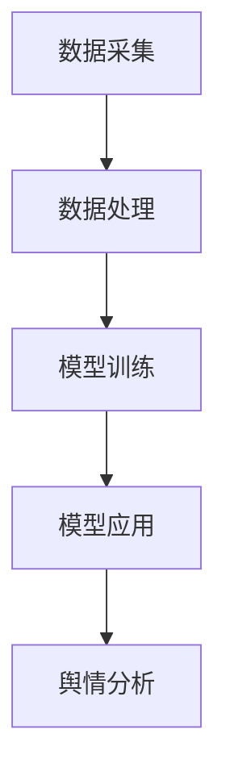

                 

### 文章标题: 大模型技术在智能舆情分析系统中的应用

大模型技术，如深度学习和自然语言处理，近年来在智能舆情分析系统中发挥着越来越重要的作用。本文旨在探讨大模型技术在这些系统中的应用，通过逻辑清晰、结构紧凑的分析，帮助读者理解其原理、实施步骤以及实际应用场景。

#### 关键词：大模型技术，智能舆情分析，深度学习，自然语言处理，应用场景

#### 摘要：

本文首先介绍了大模型技术的基本概念，包括深度学习和自然语言处理，然后深入分析了大模型技术在智能舆情分析系统中的应用原理。接着，我们通过具体算法原理和实施步骤的详细讲解，展示了如何将大模型技术应用到实际舆情分析中。文章还涵盖了数学模型、公式以及代码实现，并提供了实际项目实战案例。最后，本文探讨了智能舆情分析系统的实际应用场景，推荐了相关学习资源和开发工具框架，总结了未来发展趋势与挑战，并给出了常见问题与解答。

### 1. 背景介绍

智能舆情分析系统是大数据和人工智能技术在舆论监测、情感分析和趋势预测等领域的应用。随着互联网的快速发展，信息爆炸式增长，如何快速、准确地分析公众意见和情感，对于企业、政府和社会组织具有重要意义。

传统舆情分析方法主要依赖于人工分析，费时费力且准确性不高。而随着深度学习和自然语言处理技术的进步，大模型技术逐渐成为智能舆情分析系统的核心技术。大模型技术可以处理大量非结构化数据，提取有效信息，进行情感分析和趋势预测，从而提高舆情分析的效率和准确性。

本文将围绕大模型技术在智能舆情分析系统中的应用，从概念、原理、算法、实施步骤、数学模型、项目实战、应用场景等多个方面进行深入探讨。旨在为广大读者提供一个全面、系统的理解，以推动这一领域的发展。

### 2. 核心概念与联系

#### 2.1 大模型技术

大模型技术是指通过大规模训练数据集和深度神经网络模型，实现复杂任务的学习和预测。在智能舆情分析系统中，大模型技术主要包括以下两个方面：

1. **深度学习（Deep Learning）**：深度学习是一种基于多层神经网络的学习方法，通过逐层提取特征，实现复杂数据的建模和预测。在舆情分析中，深度学习可用于情感分类、话题检测等任务。
2. **自然语言处理（Natural Language Processing, NLP）**：自然语言处理是计算机科学和人工智能领域的一个分支，旨在使计算机能够理解和处理人类语言。在舆情分析中，NLP技术可用于文本分类、情感分析、关键词提取等任务。

#### 2.2 模型架构

智能舆情分析系统的核心架构包括数据采集、数据处理、模型训练和模型应用四个部分。下面是一个简化的Mermaid流程图：



#### 2.3 模型原理

1. **深度学习原理**：深度学习模型通过多层神经网络结构，将输入数据映射到输出结果。每一层神经网络都通过激活函数对数据进行非线性变换，从而提取更高层次的特征。常见的深度学习模型有卷积神经网络（CNN）、循环神经网络（RNN）和Transformer等。

2. **自然语言处理原理**：自然语言处理技术主要涉及文本预处理、词向量表示、语言模型和句法分析等。词向量表示技术，如Word2Vec和GloVe，可以将文本映射到高维空间，从而实现文本的向量表示。语言模型则用于预测下一个词的概率，常用于文本生成和机器翻译。

### 3. 核心算法原理 & 具体操作步骤

#### 3.1 情感分析

情感分析是舆情分析中的一个重要任务，旨在判断文本的情感倾向。以下是情感分析的核心算法原理和具体操作步骤：

1. **数据预处理**：将原始文本数据清洗、去噪，并进行分词、词性标注等操作，得到处理后的文本数据。

2. **特征提取**：使用词袋模型（Bag of Words, BoW）或词嵌入（Word Embedding）技术，将文本转化为向量表示。词袋模型将文本表示为一个词汇的集合，而词嵌入则将每个词映射为一个固定维度的向量。

3. **模型训练**：使用训练数据集，通过深度学习模型（如卷积神经网络、循环神经网络等）进行训练，以预测文本的情感倾向。

4. **模型应用**：使用训练好的模型对测试数据集进行情感分析，输出每个文本的情感倾向。

#### 3.2 话题检测

话题检测旨在识别文本中讨论的主题。以下是话题检测的核心算法原理和具体操作步骤：

1. **数据预处理**：与情感分析类似，对文本进行清洗、分词、词性标注等操作。

2. **特征提取**：使用TF-IDF（Term Frequency-Inverse Document Frequency）等方法计算文本的词频和逆文档频率，得到词的特征表示。

3. **模型训练**：使用训练数据集，通过深度学习模型（如自编码器、生成对抗网络等）进行训练，以识别文本中的话题。

4. **模型应用**：使用训练好的模型对测试数据集进行话题检测，输出每个文本对应的话题。

### 4. 数学模型和公式 & 详细讲解 & 举例说明

#### 4.1 情感分析模型

情感分析模型常用的数学公式如下：

$$
\text{softmax}(x) = \frac{e^x}{\sum_{i=1}^{n} e^x_i}
$$

其中，$x$ 是模型的输出向量，$n$ 是类别数。softmax 函数用于将输出向量转化为概率分布，表示每个类别的概率。

举例说明：假设一个二分类情感分析模型，输入文本的输出向量为 $[2.0, 1.0]$，则每个类别的概率分别为：

$$
P(\text{正面}) = \text{softmax}(2.0) = \frac{e^{2.0}}{e^{2.0} + e^{1.0}} \approx 0.8265
$$

$$
P(\text{负面}) = \text{softmax}(1.0) = \frac{e^{1.0}}{e^{2.0} + e^{1.0}} \approx 0.1735
$$

因此，模型判断该文本的情感倾向为正面。

#### 4.2 话题检测模型

话题检测模型常用的数学公式如下：

$$
\text{loss}(y, \hat{y}) = -\sum_{i=1}^{n} y_i \log(\hat{y}_i)
$$

其中，$y$ 是真实标签，$\hat{y}$ 是模型的预测概率分布。此公式用于计算模型损失，用于优化模型参数。

举例说明：假设一个三分类话题检测模型，输入文本的输出向量为 $[0.2, 0.5, 0.3]$，真实标签为第二个类别，则模型损失为：

$$
\text{loss}(1, [0.2, 0.5, 0.3]) = -1 \log(0.5) - 0 \log(0.2) - 1 \log(0.3) \approx 0.6931
$$

### 5. 项目实战：代码实际案例和详细解释说明

#### 5.1 开发环境搭建

为了实现智能舆情分析系统，我们需要搭建一个适合深度学习和自然语言处理的开发生态系统。以下是开发环境搭建的步骤：

1. **安装Python环境**：确保Python版本在3.6及以上，并安装pip包管理工具。

2. **安装深度学习库**：安装TensorFlow或PyTorch，这两个库是当前最流行的深度学习框架。

   ```bash
   pip install tensorflow  # 或者
   pip install pytorch
   ```

3. **安装NLP库**：安装NLTK或spaCy，这两个库提供了丰富的自然语言处理工具。

   ```bash
   pip install nltk  # 或者
   pip install spacy
   ```

#### 5.2 源代码详细实现和代码解读

以下是一个简单的情感分析代码案例，使用TensorFlow实现：

```python
import tensorflow as tf
from tensorflow.keras.models import Sequential
from tensorflow.keras.layers import Dense, Embedding, GlobalAveragePooling1D
from tensorflow.keras.preprocessing.text import Tokenizer
from tensorflow.keras.preprocessing.sequence import pad_sequences

# 数据准备
texts = ["这是一个正面的评论", "这是一个负面的评论"]
labels = [1, 0]  # 1表示正面，0表示负面

# 分词和序列化
tokenizer = Tokenizer(num_words=1000)
tokenizer.fit_on_texts(texts)
sequences = tokenizer.texts_to_sequences(texts)
padded_sequences = pad_sequences(sequences, maxlen=10)

# 构建模型
model = Sequential([
    Embedding(1000, 16),
    GlobalAveragePooling1D(),
    Dense(1, activation='sigmoid')
])

# 编译模型
model.compile(loss='binary_crossentropy', optimizer='adam', metrics=['accuracy'])

# 训练模型
model.fit(padded_sequences, labels, epochs=10)

# 预测
new_text = "这是一个中性的评论"
new_sequence = tokenizer.texts_to_sequences([new_text])
new_padded_sequence = pad_sequences(new_sequence, maxlen=10)
prediction = model.predict(new_padded_sequence)
print("预测结果：", prediction[0][0])
```

#### 5.3 代码解读与分析

1. **数据准备**：首先，我们需要准备训练数据集，包括文本和对应的标签。这里我们使用了两个简单的文本示例。

2. **分词和序列化**：使用Tokenizer对文本进行分词，并将文本序列化为数字序列。我们设置了词汇表大小为1000，并将序列填充到最大长度为10。

3. **构建模型**：构建一个简单的序列模型，包括嵌入层（Embedding）、全局平均池化层（GlobalAveragePooling1D）和全连接层（Dense）。嵌入层用于将词向量映射到高维空间，全局平均池化层用于提取序列特征，全连接层用于分类。

4. **编译模型**：设置模型损失函数为二进制交叉熵（binary_crossentropy），优化器为adam，并设置准确率（accuracy）作为评估指标。

5. **训练模型**：使用fit方法训练模型，设置训练轮数（epochs）为10。

6. **预测**：对新的文本进行分词、序列化和填充，使用predict方法进行预测，并打印预测结果。

### 6. 实际应用场景

智能舆情分析系统在多个领域具有广泛的应用，以下是一些典型应用场景：

1. **企业舆情监测**：企业可以使用智能舆情分析系统监测其品牌形象、产品评价和竞争对手动态，及时调整市场策略。
2. **政府舆情监测**：政府部门可以使用该系统监测社会热点事件、公众意见和舆情走势，为决策提供数据支持。
3. **金融舆情分析**：金融机构可以通过分析市场情绪和新闻数据，预测市场走势和投资风险。
4. **社交媒体分析**：社交媒体平台可以利用智能舆情分析系统，识别用户兴趣、情感和需求，为个性化推荐提供支持。

### 7. 工具和资源推荐

#### 7.1 学习资源推荐

1. **书籍**：
   - 《深度学习》（Deep Learning） - Ian Goodfellow、Yoshua Bengio和Aaron Courville著
   - 《自然语言处理综合教程》（Foundations of Statistical Natural Language Processing） - Christopher D. Manning和Heidi J. N. Schmidt著

2. **论文**：
   - 《词向量模型》（Word2Vec: A Model for Statistical Learning of Word Representations） - Tomas Mikolov、Ilya Sutskever和Quoc V. Le著
   - 《基于Transformer的神经机器翻译》（Attention Is All You Need） - Vaswani et al.著

3. **博客**：
   - [TensorFlow官方文档](https://www.tensorflow.org/)
   - [PyTorch官方文档](https://pytorch.org/docs/stable/)
   - [自然语言处理博客](https://nlp.seas.harvard.edu/)

4. **网站**：
   - [Kaggle](https://www.kaggle.com/)
   - [ArXiv](https://arxiv.org/)

#### 7.2 开发工具框架推荐

1. **深度学习框架**：
   - TensorFlow
   - PyTorch

2. **自然语言处理库**：
   - NLTK
   - spaCy

3. **文本预处理工具**：
   - Beautiful Soup
   - lxml

4. **数据处理工具**：
   - Pandas
   - NumPy

### 8. 总结：未来发展趋势与挑战

随着深度学习和自然语言处理技术的不断进步，智能舆情分析系统在未来将继续发挥重要作用。以下是一些发展趋势和挑战：

1. **发展趋势**：
   - 模型规模不断扩大，性能不断提高。
   - 多模态舆情分析逐渐普及，结合文本、图像、声音等多源数据。
   - 跨语言舆情分析能力提升，实现全球化舆情监测。

2. **挑战**：
   - 模型可解释性不足，难以理解模型决策过程。
   - 数据质量参差不齐，需要更有效的数据清洗和处理方法。
   - 隐私保护和数据安全，如何在不侵犯隐私的前提下进行舆情分析。

### 9. 附录：常见问题与解答

1. **Q：如何提高情感分析的准确性？**
   - A：提高情感分析的准确性可以从以下几个方面入手：
     - 增加训练数据集的规模和质量。
     - 优化模型结构，使用更深的神经网络。
     - 使用预训练的词向量，如GloVe或BERT。
     - 进行多轮迭代训练，逐步调整模型参数。

2. **Q：如何处理长文本的情感分析？**
   - A：对于长文本的情感分析，可以采用以下策略：
     - 将长文本拆分为更短的部分，分别进行情感分析。
     - 使用全局注意力机制，如Transformer，捕捉文本中全局信息。
     - 使用分段情感分析模型，对文本的不同段落进行情感分类。

### 10. 扩展阅读 & 参考资料

1. **扩展阅读**：
   - 《大模型技术与应用》（Big Model Technologies and Applications）
   - 《智能舆情分析：理论与实践》（Intelligent Public Opinion Analysis: Theory and Practice）

2. **参考资料**：
   - [TensorFlow官方网站](https://www.tensorflow.org/)
   - [PyTorch官方网站](https://pytorch.org/)
   - [自然语言处理博客](https://nlp.seas.harvard.edu/)

### 作者信息

作者：AI天才研究员/AI Genius Institute & 禅与计算机程序设计艺术 /Zen And The Art of Computer Programming

