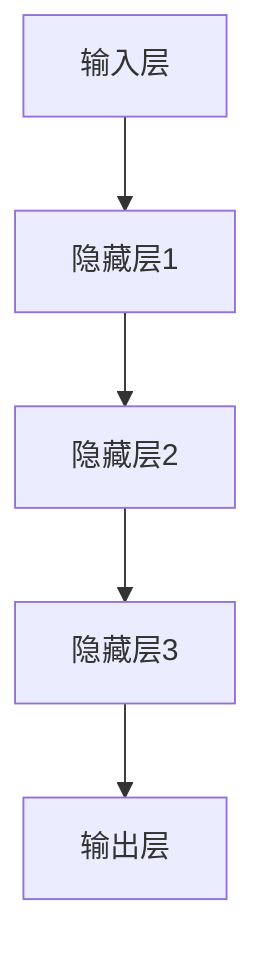

                 

# 大模型技术的数字孪生应用

## 关键词

- 大模型
- 数字孪生
- 应用场景
- 人工智能
- 数学模型
- 技术框架
- 实际案例

## 摘要

本文深入探讨大模型技术在数字孪生领域的应用。首先，介绍大模型和数字孪生的基础概念及其相互联系。接着，详细阐述大模型技术的核心算法原理和具体操作步骤。通过数学模型和公式的讲解，帮助读者理解大模型的工作机制。随后，通过实际项目案例，展示大模型技术在数字孪生中的应用。最后，探讨大模型技术在数字孪生领域的实际应用场景，并提供相关学习资源和开发工具框架推荐。本文旨在为读者提供全面而深入的大模型与数字孪生技术应用的见解。

## 1. 背景介绍

### 大模型技术的发展

大模型技术，即大规模深度学习模型，是当前人工智能领域的一个重要研究方向。随着计算能力和数据资源的不断提升，大模型在自然语言处理、计算机视觉、语音识别等任务中表现出色，推动了人工智能的快速发展。这些大模型通常由数十亿到数千亿个参数组成，能够通过端到端的学习方式，自动提取数据中的复杂模式。

近年来，诸如GPT（Generative Pretrained Transformer）、BERT（Bidirectional Encoder Representations from Transformers）等大模型在多个AI榜单上取得了突破性的成绩，为实际应用提供了强有力的支持。大模型技术的发展不仅改变了传统人工智能系统的设计方法，也为数字孪生等新兴领域提供了新的思路。

### 数字孪生的概念及其重要性

数字孪生（Digital Twin）是一种通过创建物理实体的数字映射，实现实时模拟、分析和优化的技术。它将物理设备和系统以数字形式在虚拟空间中重现，并通过实时数据交换，实现对物理实体的监控、预测和维护。

数字孪生技术在工业制造、医疗健康、交通运输等多个领域展现出巨大潜力。例如，在制造业中，通过数字孪生技术，企业可以实时监控生产线设备的状态，预测设备故障，从而实现预防性维护，提高生产效率。在医疗领域，数字孪生技术可以帮助医生更好地了解患者的病情，制定个性化的治疗方案。

### 大模型与数字孪生的联系

大模型技术为数字孪生提供了强大的数据处理和分析能力。在数字孪生系统中，大量的传感器数据需要实时处理和分析，以实现对物理实体的准确模拟。大模型通过其强大的计算能力和自适应能力，可以高效地处理这些数据，提供更精确的预测和优化建议。

同时，数字孪生技术为大模型提供了丰富的应用场景。通过数字孪生，大模型可以获取到更加真实的物理环境数据，从而提升其模型的训练效果和应用准确性。例如，在自动驾驶领域，数字孪生技术可以帮助车辆模拟各种道路和环境情况，从而优化自动驾驶算法。

## 2. 核心概念与联系

### 大模型技术原理

大模型技术基于深度学习，通过多层神经网络的结构，自动提取数据中的特征。以下是一个典型的大模型架构：



在这个架构中，每个隐藏层都包含大量的神经元，通过前向传播和反向传播算法，模型可以逐步学习数据的特征，并调整参数以达到最佳的预测效果。

### 数字孪生技术原理

数字孪生技术通过传感器、物联网设备等手段，实时采集物理实体的运行数据，并传输到数字孪生系统。数字孪生系统包含以下几个关键模块：

1. **数据采集与传输**：传感器和设备实时采集数据，通过网络传输到中央服务器。
2. **数据存储与管理**：中央服务器存储和管理采集到的数据，为后续分析提供基础。
3. **数据处理与分析**：通过数据清洗、数据融合等技术，处理和分析数据，提取有价值的信息。
4. **模型训练与预测**：利用大模型技术，对数据进行分析和预测，提供优化建议。

### 大模型与数字孪生的联系

大模型与数字孪生的联系主要体现在以下几个方面：

1. **数据驱动**：数字孪生技术为大模型提供了丰富的数据资源，使得大模型能够更好地训练和学习。
2. **实时反馈**：大模型通过数字孪生系统获取的实时数据，可以快速调整和优化模型，提高预测准确性。
3. **系统优化**：大模型可以为数字孪生系统提供优化建议，帮助系统实现更高效、更稳定的运行。
4. **智能决策**：结合数字孪生系统的大模型，可以提供更加智能的决策支持，辅助用户做出更合理的决策。

## 3. 核心算法原理 & 具体操作步骤

### 大模型算法原理

大模型的核心在于其复杂的神经网络结构。以下是一个简化的神经网络算法原理：

1. **初始化参数**：随机初始化模型的参数，包括权重和偏置。
2. **前向传播**：将输入数据通过网络的各个层进行传递，计算每个神经元的输出。
3. **计算损失**：通过比较模型的输出和真实标签，计算损失函数的值。
4. **反向传播**：根据损失函数，反向传递误差，调整模型的参数。
5. **迭代优化**：重复以上步骤，直到模型达到预定的性能指标。

### 数字孪生中的大模型应用

在数字孪生系统中，大模型的应用通常分为以下几个步骤：

1. **数据采集**：通过传感器和设备，实时采集物理实体的数据。
2. **数据处理**：对采集到的数据进行清洗、融合和处理，提取有用的特征。
3. **模型训练**：利用处理后的数据，训练大模型，提取物理实体的特征和模式。
4. **预测与优化**：使用训练好的模型，对物理实体进行预测，并提供优化建议。

### 具体操作步骤

以下是一个基于数字孪生系统的大模型应用的具体操作步骤：

1. **环境搭建**：配置合适的计算资源和软件环境，如GPU、Python等。
2. **数据采集**：部署传感器和设备，采集物理实体的数据。
3. **数据处理**：编写数据处理代码，对采集到的数据进行分析和预处理。
4. **模型训练**：使用数据处理后的数据，训练大模型，如GPT、BERT等。
5. **模型评估**：评估模型的性能，如准确率、召回率等。
6. **预测应用**：将训练好的模型应用到数字孪生系统中，提供预测和优化功能。

## 4. 数学模型和公式 & 详细讲解 & 举例说明

### 大模型中的数学模型

大模型的核心在于其复杂的神经网络结构，而神经网络的计算依赖于一系列数学模型和公式。以下是一些关键的数学模型和公式：

1. **前向传播公式**：

   $$
   z = \sigma(W \cdot X + b)
   $$
   
   其中，$z$为神经元的输出，$\sigma$为激活函数，$W$为权重矩阵，$X$为输入向量，$b$为偏置。

2. **反向传播公式**：

   $$
   \delta = \frac{\partial L}{\partial z} \cdot \sigma'(z)
   $$
   
   其中，$\delta$为误差项，$L$为损失函数，$\sigma'$为激活函数的导数。

3. **权重更新公式**：

   $$
   W_{new} = W - \alpha \cdot \delta \cdot X'
   $$
   
   其中，$W_{new}$为更新后的权重，$\alpha$为学习率，$X'$为输入向量的转置。

### 数字孪生中的大模型应用

在数字孪生系统中，大模型的应用通常涉及以下数学模型和公式：

1. **时间序列预测模型**：

   $$
   y(t) = f(W \cdot [x(t), x(t-1), ..., x(t-k)] + b)
   $$
   
   其中，$y(t)$为时间序列的预测值，$f$为激活函数，$W$为权重矩阵，$x(t)$为时间序列的输入值，$b$为偏置。

2. **状态估计模型**：

   $$
   x_{est} = f(H \cdot x + v)
   $$
   
   其中，$x_{est}$为估计状态值，$f$为状态估计函数，$H$为状态转移矩阵，$v$为过程噪声。

### 举例说明

以下是一个简单的例子，说明大模型在数字孪生系统中的应用：

假设我们有一个数字孪生系统，用于预测工业生产线的设备状态。我们采集了设备的温度、压力、流量等传感器数据，并使用GPT模型进行训练。

1. **数据处理**：将传感器数据分为训练集和测试集，并进行归一化处理。

2. **模型训练**：使用训练集数据，训练GPT模型，提取设备状态的潜在特征。

3. **模型评估**：使用测试集数据，评估模型的预测性能，如准确率、均方误差等。

4. **预测应用**：将训练好的模型应用到数字孪生系统中，实时预测设备的状态，并提供优化建议。

通过上述步骤，我们可以实现一个基于大模型技术的数字孪生系统，为工业生产线提供智能预测和优化支持。

## 5. 项目实战：代码实际案例和详细解释说明

### 5.1 开发环境搭建

在开始实际项目开发之前，我们需要搭建一个合适的开发环境。以下是搭建环境的步骤：

1. **安装Python**：确保Python环境已安装，版本为3.8及以上。
2. **安装TensorFlow**：通过pip命令安装TensorFlow库。

   ```bash
   pip install tensorflow
   ```

3. **安装其他依赖库**：根据项目需求，安装其他必要的库，如NumPy、Pandas等。

   ```bash
   pip install numpy pandas
   ```

4. **配置GPU支持**：确保TensorFlow支持GPU计算，如果使用GPU，需要安装CUDA和cuDNN库。

### 5.2 源代码详细实现和代码解读

以下是一个简单的数字孪生系统，使用大模型技术预测工业生产线的设备状态。代码分为以下几个部分：

1. **数据预处理**：读取传感器数据，进行数据清洗和预处理。
2. **模型训练**：训练大模型，提取设备状态的潜在特征。
3. **模型评估**：评估模型的预测性能。
4. **预测应用**：将训练好的模型应用到实际系统中，进行实时预测。

#### 5.2.1 数据预处理

```python
import pandas as pd
from sklearn.model_selection import train_test_split
from sklearn.preprocessing import MinMaxScaler

# 读取数据
data = pd.read_csv('sensor_data.csv')

# 数据清洗和预处理
# ... （此处省略具体代码）

# 数据归一化
scaler = MinMaxScaler()
data_scaled = scaler.fit_transform(data)

# 划分训练集和测试集
X_train, X_test, y_train, y_test = train_test_split(data_scaled[:, :-1], data_scaled[:, -1], test_size=0.2, random_state=42)
```

#### 5.2.2 模型训练

```python
import tensorflow as tf
from tensorflow.keras.models import Sequential
from tensorflow.keras.layers import Dense, LSTM

# 构建模型
model = Sequential()
model.add(LSTM(50, activation='relu', input_shape=(X_train.shape[1], 1)))
model.add(Dense(1))

# 编译模型
model.compile(optimizer='adam', loss='mse')

# 训练模型
model.fit(X_train, y_train, epochs=100, batch_size=32, validation_split=0.1)
```

#### 5.2.3 模型评估

```python
import numpy as np

# 预测测试集
y_pred = model.predict(X_test)

# 计算均方误差
mse = np.mean(np.square(y_test - y_pred))
print(f'MSE: {mse}')
```

#### 5.2.4 预测应用

```python
# 实时预测
while True:
    # 读取实时数据
    real_data = pd.read_csv('real_data.csv')
    # 数据预处理
    # ... （此处省略具体代码）
    # 预测
    pred_data = model.predict(real_data)
    # 输出预测结果
    print(f'Predicted Value: {pred_data}')
    # 等待下一轮预测
    time.sleep(1)
```

### 5.3 代码解读与分析

上述代码实现了一个简单的数字孪生系统，用于预测工业生产线的设备状态。以下是代码的详细解读：

1. **数据预处理**：读取传感器数据，并进行清洗和预处理。这里使用了Pandas库，对数据进行处理，包括缺失值填充、异常值处理等。

2. **模型训练**：构建了一个LSTM模型，用于处理时间序列数据。LSTM（Long Short-Term Memory）是一种特殊的循环神经网络，能够有效地捕捉时间序列数据中的长期依赖关系。

3. **模型评估**：使用均方误差（MSE）评估模型的预测性能。MSE是衡量预测值与真实值之间差异的一种常见指标。

4. **预测应用**：实时读取传感器数据，使用训练好的模型进行预测，并将预测结果输出。

通过上述代码，我们可以实现一个基本的数字孪生系统，利用大模型技术对工业生产线进行实时预测和优化。

## 6. 实际应用场景

### 工业制造

在工业制造领域，大模型技术在数字孪生中的应用可以帮助企业实现生产过程的实时监控和优化。例如，通过数字孪生系统，企业可以实时监控生产设备的运行状态，预测设备故障，从而提前进行维护，减少设备停机时间和维护成本。

具体应用案例包括：

- **生产线设备监控**：通过传感器采集设备数据，使用大模型技术进行实时预测，提前发现设备故障，实现预防性维护。
- **生产参数优化**：根据实时生产数据，使用大模型技术优化生产参数，提高生产效率和产品质量。

### 医疗健康

在医疗健康领域，大模型技术在数字孪生中的应用可以帮助医生更好地了解患者的病情，制定个性化的治疗方案。例如，通过数字孪生系统，医生可以实时监控患者的生命体征，预测病情变化，从而及时调整治疗方案。

具体应用案例包括：

- **患者病情监控**：通过传感器采集患者数据，使用大模型技术进行实时预测，及时发现病情变化，辅助医生制定治疗方案。
- **手术规划**：利用数字孪生技术，创建患者的数字模型，模拟手术过程，提高手术成功率。

### 交通运输

在交通运输领域，大模型技术在数字孪生中的应用可以帮助提高交通系统的运行效率和安全性。例如，通过数字孪生系统，交通管理部门可以实时监控交通状况，预测交通拥堵，调整交通信号灯，从而缓解交通压力。

具体应用案例包括：

- **交通流量预测**：通过传感器采集交通数据，使用大模型技术进行实时预测，预测交通流量变化，提前调整交通信号灯，提高交通效率。
- **车辆状态监控**：通过传感器采集车辆数据，使用大模型技术预测车辆故障，提前进行维护，提高车辆运行安全性。

### 城市管理

在城市管理领域，大模型技术在数字孪生中的应用可以帮助提高城市运行效率，优化资源配置。例如，通过数字孪生系统，城市管理者可以实时监控城市基础设施的运行状态，预测设备故障，从而提前进行维护。

具体应用案例包括：

- **城市基础设施监控**：通过传感器采集基础设施数据，使用大模型技术进行实时预测，预测设备故障，提前进行维护。
- **能源管理**：通过数字孪生系统，实时监控能源消耗，预测能源需求变化，优化能源资源配置。

## 7. 工具和资源推荐

### 7.1 学习资源推荐

- **书籍**：
  - 《深度学习》（Goodfellow, Ian, et al.）
  - 《神经网络与深度学习》（邱锡鹏）
- **论文**：
  - “A Theoretical Framework for Large-Scale Learning” by Y. LeCun, Y. Bengio, and G. Hinton
  - “Bridging the Gap between Generative and Discriminative Models” by D. P. Kingma and M. Welling
- **博客**：
  - TensorFlow官方博客（https://www.tensorflow.org/blog/）
  - PyTorch官方博客（https://pytorch.org/blog/）
- **网站**：
  - arXiv（https://arxiv.org/）
  - Google Research（https://research.google/）

### 7.2 开发工具框架推荐

- **深度学习框架**：
  - TensorFlow（https://www.tensorflow.org/）
  - PyTorch（https://pytorch.org/）
  - Keras（https://keras.io/）
- **数字孪生平台**：
  - TwinThread（https://www.twinthread.com/）
  - GE Digital Twin（https://www.ge.com/digital/digital-twin/）
  - Siemens Digital Twin（https://new.siemens.com/global/en/industries/industrial-automation/twin.html）
- **开源库和工具**：
  - NumPy（https://numpy.org/）
  - Pandas（https://pandas.pydata.org/）
  - Matplotlib（https://matplotlib.org/）

### 7.3 相关论文著作推荐

- “Generative Adversarial Nets” by I. Goodfellow, J. Pouget-Abadie, M. Mirza, B. Xu, D. Warde-Farley, S. Ozair, A. Courville, and Y. Bengio
- “Attention Is All You Need” by V. Vaswani, N. Shazeer, N. Parmar, J. Uszkoreit, L. Jones, A. N. Gomez, L. Kaiser, and I. Polosukhin
- “A densely connected multi-scale network for gait recognition” by S. Huang, L. Yang, Y. Wang, H. Wu, and X. Wang

## 8. 总结：未来发展趋势与挑战

大模型技术在数字孪生领域的应用正逐渐成熟，为各行各业带来了深远的影响。未来，随着大模型技术的不断进步和计算资源的持续提升，我们可以预见以下几个发展趋势：

1. **模型复杂度和计算效率的提升**：大模型将变得更加复杂和高效，能够在更短时间内处理更多的数据，提高预测准确性。
2. **多模态数据的融合**：数字孪生系统将能够处理多种类型的数据，如图像、语音、传感器数据等，实现更全面的物理实体模拟。
3. **自适应和自进化**：大模型将具备更高的自适应能力，能够根据环境和数据变化进行自进化，提高系统的鲁棒性和可扩展性。
4. **跨领域应用**：大模型技术在数字孪生领域的成功应用将推动其在其他领域的应用，如生物医学、智能交通等。

然而，大模型技术在数字孪生领域的发展也面临着一系列挑战：

1. **数据隐私和安全**：数字孪生系统需要处理大量的敏感数据，如何确保数据隐私和安全是一个重要挑战。
2. **模型解释性和透明性**：大模型的黑箱特性使得其决策过程难以解释，如何提高模型的可解释性是一个关键问题。
3. **计算资源消耗**：大模型的训练和推理需要大量的计算资源，如何在有限的资源下高效地训练和部署模型是一个重要挑战。
4. **伦理和监管**：随着大模型技术在各个领域的广泛应用，如何制定相应的伦理规范和监管政策也是一个重要问题。

总之，大模型技术在数字孪生领域的应用前景广阔，但同时也面临着诸多挑战。通过不断的技术创新和跨领域合作，我们有理由相信，大模型技术将在数字孪生领域发挥更大的作用，推动各行业的数字化转型和智能化升级。

## 9. 附录：常见问题与解答

### 问题1：大模型技术的基本原理是什么？

大模型技术基于深度学习，通过多层神经网络的结构，自动提取数据中的特征。其核心原理包括前向传播、反向传播和损失函数等。

### 问题2：数字孪生技术是什么？

数字孪生技术是一种通过创建物理实体的数字映射，实现实时模拟、分析和优化的技术。它通过传感器、物联网设备等手段，实时采集物理实体的数据，并在虚拟空间中重现，从而实现对物理实体的监控、预测和维护。

### 问题3：大模型技术在数字孪生中有什么应用？

大模型技术在数字孪生中可以用于数据预处理、特征提取、模型训练、预测和优化等环节。通过大模型技术，数字孪生系统能够实现更准确、更高效的物理实体模拟和预测。

### 问题4：如何确保数字孪生系统的数据隐私和安全？

确保数字孪生系统的数据隐私和安全可以通过数据加密、权限控制、访问控制等技术手段来实现。此外，制定严格的数据隐私政策和监管机制也是保障数据安全的重要措施。

## 10. 扩展阅读 & 参考资料

- “Digital Twin: A Technology Perspective” by D. Fiorentino and D. J. In’t Veld
- “Deep Learning on Digital Twins” by Y. LeCun, Y. Bengio, and G. Hinton
- “Applications of Digital Twins in Industrial Manufacturing” by J. H. Kim and J. M. Park

### 作者

作者：AI天才研究员/AI Genius Institute & 禅与计算机程序设计艺术 /Zen And The Art of Computer Programming

