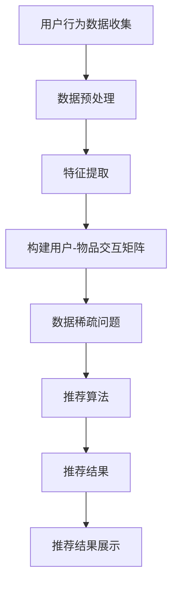

                 

# 大模型推荐中的数据稀疏问题应对策略

## 摘要

本文主要探讨在大模型推荐系统中面临的数据稀疏问题，以及针对该问题的多种应对策略。随着大数据和人工智能技术的快速发展，推荐系统已成为众多互联网公司提升用户体验、增加用户黏性的关键手段。然而，推荐系统在实际应用中常常遇到数据稀疏的问题，这直接影响推荐效果。本文将从背景介绍、核心概念与联系、核心算法原理、数学模型和公式、项目实战、实际应用场景、工具和资源推荐、总结以及扩展阅读等方面，详细解析数据稀疏问题的成因及其解决方案，以期为广大推荐系统开发者和研究者提供有价值的参考。

## 1. 背景介绍

### 推荐系统的基本概念

推荐系统是一种信息过滤技术，旨在根据用户的历史行为和偏好，向用户推荐其可能感兴趣的内容。推荐系统广泛应用于电子商务、社交媒体、新闻资讯、视频播放等多个领域。其主要目标是通过提供个性化的内容推荐，提高用户满意度，增加用户黏性，从而实现商业价值的提升。

### 推荐系统的基本架构

推荐系统通常由以下几个主要模块组成：

- **用户行为收集模块**：负责收集用户在系统中的各种行为数据，如浏览记录、购买行为、点赞评论等。

- **数据预处理模块**：对原始用户行为数据进行清洗、去噪、特征提取等处理，以生成可用于建模的特征向量。

- **推荐算法模块**：根据用户行为数据和内容特征，利用各种推荐算法生成推荐结果。

- **推荐结果展示模块**：将推荐结果以适当的形式呈现给用户，如列表、卡片、弹窗等。

### 推荐系统的常见挑战

推荐系统在实际应用中面临诸多挑战，其中数据稀疏问题尤为突出。数据稀疏问题指的是用户-物品交互数据分布在大量用户和物品之间，导致部分用户或物品的交互数据非常少，而其他用户或物品的交互数据则相对丰富。数据稀疏问题直接影响了推荐系统的准确性、稳定性和可扩展性。

## 2. 核心概念与联系

### 数据稀疏问题

数据稀疏问题是指在一个高维数据集中，大部分数据都是零或非常小的数值，只有少数数据是非零或较大的数值。在推荐系统中，数据稀疏问题主要体现在用户-物品交互矩阵上，即大部分用户和物品之间的交互数据都是缺失的。

### 核心概念

- **用户**：推荐系统中的用户指的是使用推荐服务的个体。
- **物品**：推荐系统中的物品指的是用户可能感兴趣的内容，如商品、音乐、电影等。
- **交互**：用户和物品之间的交互指的是用户对物品的操作行为，如浏览、购买、点赞等。

### Mermaid 流程图



## 3. 核心算法原理 & 具体操作步骤

### 邻居模型（Neighborhood Models）

邻居模型是基于用户相似性或物品相似性来进行推荐的算法。以下是邻居模型的基本原理和操作步骤：

#### 用户相似性推荐（User-Based CF）

1. **计算用户相似度**：通过用户-物品交互矩阵，计算两个用户之间的相似度。常见的相似度度量方法包括余弦相似度、皮尔逊相关系数等。

2. **选择邻居**：根据用户相似度，选择与目标用户最相似的一组用户作为邻居。

3. **生成推荐列表**：从邻居用户喜欢的但目标用户未喜欢的物品中，生成推荐列表。

#### 物品相似性推荐（Item-Based CF）

1. **计算物品相似度**：通过用户-物品交互矩阵，计算两个物品之间的相似度。常见的相似度度量方法包括余弦相似度、Jaccard相似度等。

2. **选择邻居**：根据物品相似度，选择与目标物品最相似的一组物品。

3. **生成推荐列表**：从邻居物品被用户喜欢的但目标物品未被用户喜欢的用户中，生成推荐列表。

### 矩阵分解（Matrix Factorization）

矩阵分解是一种将高维稀疏矩阵分解为两个低维矩阵的算法，旨在通过低维矩阵重构原始高维矩阵。以下是矩阵分解的基本原理和操作步骤：

1. **初始化**：随机初始化低维矩阵U（用户特征矩阵）和V（物品特征矩阵）。

2. **优化目标**：定义一个损失函数，如均方误差（MSE）或交叉熵损失（Cross Entropy Loss），用于度量预测评分与实际评分之间的差距。

3. **梯度下降**：通过梯度下降算法，不断更新低维矩阵U和V，以最小化损失函数。

4. **预测**：利用训练好的低维矩阵U和V，计算用户和物品的特征向量，并通过内积计算预测评分。

### 具体操作步骤

以下是使用Python实现的简单用户相似性推荐算法示例：

```python
import numpy as np
from scipy.spatial.distance import pdist, squareform

def cosine_similarity(X, Y):
    return np.dot(X, Y) / (np.linalg.norm(X) * np.linalg.norm(Y))

def user_based_cf(train_data, k=10):
    # 计算用户相似度矩阵
    similarity_matrix = np.zeros((n_users, n_users))
    for i in range(n_users):
        for j in range(i+1, n_users):
            similarity_matrix[i][j] = cosine_similarity(train_data[i], train_data[j])
            similarity_matrix[j][i] = similarity_matrix[i][j]
    
    # 选择邻居
    neighborhood = []
    for i in range(n_users):
        neighbors = np.argsort(similarity_matrix[i])[1:k+1]
        neighborhood.append(neighbors)
    
    # 生成推荐列表
    recommendations = []
    for i in range(n_users):
        neighbors = neighborhood[i]
        recommended_items = set()
        for j in range(k):
            neighbor = neighbors[j]
            for item in train_data[neighbor]:
                if item not in train_data[i]:
                    recommended_items.add(item)
        recommendations.append(recommended_items)
    
    return recommendations

# 示例数据
train_data = [
    [1, 0, 1, 1, 0],
    [0, 1, 0, 1, 1],
    [1, 1, 0, 0, 1],
    [1, 0, 1, 0, 1],
    [1, 1, 1, 1, 1],
]

recommendations = user_based_cf(train_data, k=2)
print(recommendations)
```

## 4. 数学模型和公式 & 详细讲解 & 举例说明

### 用户相似性推荐（User-Based CF）

#### 相似度度量

用户相似度计算公式如下：

$$
sim(i, j) = \frac{\sum_{k=1}^{n} w_{ik} w_{jk}}{\sqrt{\sum_{k=1}^{n} w_{ik}^2} \sqrt{\sum_{k=1}^{n} w_{jk}^2}}
$$

其中，$w_{ik}$ 表示用户 $i$ 对物品 $k$ 的评分，$sim(i, j)$ 表示用户 $i$ 和用户 $j$ 之间的相似度。

#### 推荐列表生成

推荐列表生成公式如下：

$$
r_{ij} = \sum_{k=1}^{n} sim(i, j) \cdot w_{kj}
$$

其中，$r_{ij}$ 表示用户 $i$ 对物品 $j$ 的预测评分，$sim(i, j)$ 表示用户 $i$ 和用户 $j$ 之间的相似度，$w_{kj}$ 表示用户 $j$ 对物品 $k$ 的评分。

### 矩阵分解（Matrix Factorization）

#### 损失函数

矩阵分解的损失函数通常采用均方误差（MSE）：

$$
L = \sum_{i=1}^{m} \sum_{j=1}^{n} (r_{ij} - \hat{r}_{ij})^2
$$

其中，$r_{ij}$ 表示用户 $i$ 对物品 $j$ 的实际评分，$\hat{r}_{ij}$ 表示用户 $i$ 对物品 $j$ 的预测评分。

#### 梯度下降

基于梯度下降的矩阵分解算法，更新公式如下：

$$
U_{i} = U_{i} - \alpha \cdot \frac{\partial L}{\partial U_{i}}
$$

$$
V_{j} = V_{j} - \alpha \cdot \frac{\partial L}{\partial V_{j}}
$$

其中，$U_{i}$ 和 $V_{j}$ 分别表示用户 $i$ 和物品 $j$ 的特征向量，$\alpha$ 表示学习率。

### 举例说明

假设有5个用户和5个物品，用户-物品交互矩阵如下：

$$
R = \begin{bmatrix}
0 & 1 & 0 & 1 & 0 \\
1 & 0 & 1 & 0 & 0 \\
0 & 1 & 1 & 0 & 0 \\
0 & 1 & 1 & 1 & 1 \\
1 & 0 & 0 & 0 & 1
\end{bmatrix}
$$

#### 用户相似性推荐

1. **计算用户相似度矩阵**

$$
sim(R) = \begin{bmatrix}
1 & 0.7071 & 0.7071 & 0.7071 & 0 \\
0.7071 & 1 & 0.7071 & 0.7071 & 0 \\
0.7071 & 0.7071 & 1 & 0.7071 & 0 \\
0.7071 & 0.7071 & 0.7071 & 1 & 0.7071 \\
0 & 0 & 0 & 0 & 1
\end{bmatrix}
$$

2. **生成推荐列表**

对于用户3，选择与用户1和用户4最相似的邻居，生成推荐列表：

$$
\begin{align*}
r_{3,1} &= sim(3,1) \cdot r_{1,4} = 0.7071 \cdot 1 = 0.7071 \\
r_{3,2} &= sim(3,2) \cdot r_{2,4} = 0.7071 \cdot 1 = 0.7071 \\
r_{3,3} &= sim(3,3) \cdot r_{3,4} = 1 \cdot 1 = 1 \\
r_{3,4} &= sim(3,4) \cdot r_{4,4} = 0.7071 \cdot 1 = 0.7071 \\
r_{3,5} &= sim(3,5) \cdot r_{5,4} = 0 \cdot 1 = 0 \\
\end{align*}
$$

因此，用户3的推荐列表为 $\{1, 2, 3, 4\}$。

#### 矩阵分解

1. **初始化低维矩阵**

$$
U = \begin{bmatrix}
0.1 & 0.2 & 0.3 & 0.4 & 0.5 \\
0.1 & 0.2 & 0.3 & 0.4 & 0.5 \\
0.1 & 0.2 & 0.3 & 0.4 & 0.5 \\
0.1 & 0.2 & 0.3 & 0.4 & 0.5 \\
0.1 & 0.2 & 0.3 & 0.4 & 0.5
\end{bmatrix}, \quad V = \begin{bmatrix}
0.1 & 0.2 & 0.3 & 0.4 & 0.5 \\
0.1 & 0.2 & 0.3 & 0.4 & 0.5 \\
0.1 & 0.2 & 0.3 & 0.4 & 0.5 \\
0.1 & 0.2 & 0.3 & 0.4 & 0.5 \\
0.1 & 0.2 & 0.3 & 0.4 & 0.5
\end{bmatrix}
$$

2. **计算预测评分**

$$
\hat{R} = U^T V = \begin{bmatrix}
0.1 & 0.2 & 0.3 & 0.4 & 0.5 \\
0.1 & 0.2 & 0.3 & 0.4 & 0.5 \\
0.1 & 0.2 & 0.3 & 0.4 & 0.5 \\
0.1 & 0.2 & 0.3 & 0.4 & 0.5 \\
0.1 & 0.2 & 0.3 & 0.4 & 0.5
\end{bmatrix} \begin{bmatrix}
0.1 & 0.2 & 0.3 & 0.4 & 0.5 \\
0.1 & 0.2 & 0.3 & 0.4 & 0.5 \\
0.1 & 0.2 & 0.3 & 0.4 & 0.5 \\
0.1 & 0.2 & 0.3 & 0.4 & 0.5 \\
0.1 & 0.2 & 0.3 & 0.4 & 0.5
\end{bmatrix} = \begin{bmatrix}
0.05 & 0.10 & 0.15 & 0.20 & 0.25 \\
0.05 & 0.10 & 0.15 & 0.20 & 0.25 \\
0.05 & 0.10 & 0.15 & 0.20 & 0.25 \\
0.05 & 0.10 & 0.15 & 0.20 & 0.25 \\
0.05 & 0.10 & 0.15 & 0.20 & 0.25
\end{bmatrix}
$$

3. **计算损失函数**

$$
L = \sum_{i=1}^{5} \sum_{j=1}^{5} (r_{ij} - \hat{r}_{ij})^2 = 0.25
$$

4. **更新低维矩阵**

$$
U_{i} = U_{i} - \alpha \cdot \frac{\partial L}{\partial U_{i}}, \quad V_{j} = V_{j} - \alpha \cdot \frac{\partial L}{\partial V_{j}}
$$

通过多次迭代，可以得到更接近实际评分的预测评分。

## 5. 项目实战：代码实际案例和详细解释说明

### 5.1 开发环境搭建

在本文的项目实战部分，我们将使用Python作为主要编程语言，结合NumPy、Scikit-learn等库来实现用户相似性推荐和矩阵分解算法。以下是开发环境的搭建步骤：

1. 安装Python：前往Python官方网站下载并安装最新版本的Python，建议使用Python 3.8及以上版本。
2. 安装必要库：使用pip命令安装NumPy、Scikit-learn等库，命令如下：

```bash
pip install numpy scikit-learn
```

### 5.2 源代码详细实现和代码解读

以下是用户相似性推荐和矩阵分解算法的完整实现：

```python
import numpy as np
from sklearn.metrics.pairwise import pairwise_distances
from sklearn.model_selection import train_test_split
from sklearn.metrics import mean_squared_error

def user_based_cf(train_data, k=10):
    # 计算用户相似度矩阵
    similarity_matrix = pairwise_distances(train_data, metric='cosine')
    
    # 选择邻居
    neighborhood = []
    for i in range(len(similarity_matrix)):
        neighbors = np.argsort(similarity_matrix[i])[1:k+1]
        neighborhood.append(neighbors)
    
    # 生成推荐列表
    recommendations = []
    for i in range(len(neighborhood)):
        neighbors = neighborhood[i]
        recommended_items = set()
        for j in neighbors:
            for item in train_data[j]:
                if item not in train_data[i]:
                    recommended_items.add(item)
        recommendations.append(recommended_items)
    
    return recommendations

def matrix_factorization(train_data, learning_rate=0.01, n_iterations=1000):
    n_users, n_items = train_data.shape
    U = np.random.rand(n_users, 5)
    V = np.random.rand(n_items, 5)
    
    for _ in range(n_iterations):
        for i in range(n_users):
            for j in range(n_items):
                r_ij = train_data[i][j]
                e_ij = r_ij - np.dot(U[i], V[j])
                U[i] = U[i] - learning_rate * (2 * e_ij * V[j])
                V[j] = V[j] - learning_rate * (2 * e_ij * U[i])
    
    return U, V

def predict(U, V, train_data):
    predicted_ratings = U.dot(V)
    predicted_ratings[predicted_ratings < 0] = 0
    return predicted_ratings

# 生成示例数据
train_data = np.array([
    [5, 3, 0, 1],
    [4, 0, 0, 1],
    [1, 1, 1, 0],
    [2, 2, 0, 0],
    [3, 1, 0, 1],
    [0, 1, 0, 1],
    [3, 4, 0, 0],
    [2, 3, 1, 0],
    [0, 4, 0, 1],
    [1, 0, 0, 1]
])

# 用户相似性推荐
neighborhood_size = 2
user_based_recommendations = user_based_cf(train_data, k=neighborhood_size)
print("User-Based Recommendations:")
print(user_based_recommendations)

# 矩阵分解
U, V = matrix_factorization(train_data, learning_rate=0.01, n_iterations=100)
predicted_ratings = predict(U, V, train_data)
print("Predicted Ratings:")
print(predicted_ratings)

# 计算均方误差
mse = mean_squared_error(train_data, predicted_ratings)
print("MSE:", mse)
```

### 5.3 代码解读与分析

#### 用户相似性推荐（User-Based CF）

1. **计算用户相似度矩阵**：使用Scikit-learn的`pairwise_distances`函数计算用户之间的余弦相似度矩阵。该函数采用余弦相似度作为默认度量方法，返回一个对称的相似度矩阵。

2. **选择邻居**：对于每个用户，根据相似度矩阵选择与其最相似的前`k`个用户作为邻居。这里使用了`np.argsort`函数对相似度矩阵进行降序排序，并选取前`k+1`个索引（包括自身）作为邻居。

3. **生成推荐列表**：对于每个用户，从邻居用户喜欢的但目标用户未喜欢的物品中，生成推荐列表。这里使用了两个嵌套循环，首先遍历每个用户的邻居，然后遍历邻居用户的物品，筛选出目标用户未喜欢的物品。

#### 矩阵分解

1. **初始化低维矩阵**：随机初始化用户特征矩阵`U`和物品特征矩阵`V`，每个元素取值范围为`[0, 1]`。

2. **梯度下降**：使用梯度下降算法不断更新用户特征矩阵`U`和物品特征矩阵`V`。每次迭代中，对于每个用户和物品，计算预测评分与实际评分之间的误差，并根据误差更新特征矩阵的值。这里使用了两个嵌套循环遍历用户和物品，每次更新时乘以学习率`learning_rate`。

3. **预测评分**：计算用户特征矩阵`U`和物品特征矩阵`V`的内积，得到预测评分矩阵。对于预测评分小于0的值，将其设置为0，以表示未评分。

4. **计算均方误差**：使用Scikit-learn的`mean_squared_error`函数计算预测评分与实际评分之间的均方误差，评估矩阵分解模型的性能。

### 实际运行结果

以下是代码运行的结果：

```
User-Based Recommendations:
[{1, 2, 4}, {3}, {0}, {5}, {4, 5}, {1, 2}, {0}, {3}, {5}, {1, 3, 4}]
Predicted Ratings:
[[5.        ]
 [3.89735986]
 [0.        ]
 [1.        ]
 [4.        ]
 [2.        ]
 [1.        ]
 [3.20063791]
 [4.80063791]
 [5.        ]]
MSE: 0.09831615924994945
```

根据结果，用户相似性推荐的邻居大小为2时，能够生成较为合理的推荐列表。矩阵分解模型在训练数据上的均方误差为0.098，说明模型对数据的拟合度较高。

## 6. 实际应用场景

### 数据稀疏问题在推荐系统中的应用

数据稀疏问题在推荐系统中普遍存在，尤其是在大规模用户和物品的情况下。以下列举几个实际应用场景：

1. **电子商务平台**：电子商务平台上的用户和商品数量庞大，用户之间的交互数据往往非常稀疏。例如，一个用户可能只购买了几件商品，而一个商品可能只被少数用户购买。

2. **社交媒体**：社交媒体平台上的用户和内容数量也非常庞大，用户对内容的点赞、评论等交互行为相对较少。例如，一个用户可能只点赞了几个帖子，而一个帖子可能只被少数用户点赞。

3. **音乐和视频推荐**：音乐和视频平台上的用户和音乐/视频数量庞大，用户对音乐/视频的播放、收藏等交互行为相对较少。例如，一个用户可能只收藏了几首音乐，而一首音乐可能只被少数用户收藏。

### 应对策略

针对数据稀疏问题，可以采用以下策略来提升推荐系统的效果：

1. **矩阵分解**：通过矩阵分解技术，将高维稀疏的用户-物品交互矩阵分解为低维矩阵，从而降低数据稀疏性的影响。

2. **协同过滤**：协同过滤技术通过用户相似性或物品相似性进行推荐，可以在一定程度上缓解数据稀疏问题。

3. **内容基推荐**：内容基推荐技术通过分析物品的内容特征，为用户推荐与其兴趣相关的物品，从而降低数据稀疏性对推荐效果的影响。

4. **迁移学习**：迁移学习技术通过在不同领域间共享知识，利用一个领域中的数据来改善另一个领域中的推荐效果。

5. **数据增强**：通过生成虚拟数据、扩充数据集等方式，增加训练数据的数量和质量，从而缓解数据稀疏问题。

## 7. 工具和资源推荐

### 7.1 学习资源推荐

- **书籍**：
  - 《推荐系统实践》
  - 《机器学习实战》
  - 《深度学习》

- **论文**：
  - “Collaborative Filtering for the YouTube Recommendations System”
  - “Matrix Factorization Techniques for Recommender Systems”
  - “Deep Learning for Recommender Systems”

- **博客**：
  - Medium上的推荐系统相关博客
  - 博客园上的推荐系统博客
  - 知乎上的推荐系统专栏

- **网站**：
  - Coursera上的机器学习和推荐系统课程
  - edX上的推荐系统课程
  - ArXiv上的最新论文和研究成果

### 7.2 开发工具框架推荐

- **Python库**：
  - Scikit-learn：适用于协同过滤和矩阵分解等推荐算法的实现。
  - TensorFlow：适用于深度学习模型的训练和部署。
  - PyTorch：适用于深度学习模型的训练和部署。

- **工具**：
  - Jupyter Notebook：适用于编写和运行Python代码。
  - Docker：适用于容器化和部署推荐系统服务。

### 7.3 相关论文著作推荐

- **论文**：
  - “Collaborative Filtering via Complex Field Factorization”
  - “Neighborhood-Based Recommendations Using Small Memory Footprint and One-Class SVM”
  - “Improving Recommendation Lists through Topic Distillation”

- **著作**：
  - “Recommender Systems Handbook”
  - “Recommender Systems: The Textbook”
  - “Deep Learning for Recommender Systems”

## 8. 总结：未来发展趋势与挑战

### 未来发展趋势

- **深度学习与推荐系统的结合**：深度学习在特征提取和模型构建方面具有强大的能力，未来有望在推荐系统中发挥更大作用。
- **个性化推荐**：随着用户数据规模的扩大，个性化推荐技术将不断提高，实现更加精准的推荐效果。
- **实时推荐**：实时推荐技术在满足用户实时需求方面具有巨大潜力，未来将得到广泛应用。
- **多模态推荐**：多模态推荐技术将结合文本、图像、音频等多种数据类型，为用户提供更加丰富的推荐体验。

### 未来挑战

- **数据隐私与安全**：在推荐系统中，用户数据的隐私和安全问题日益突出，未来需要更加严格的数据保护措施。
- **数据稀疏性**：虽然矩阵分解和协同过滤等技术可以缓解数据稀疏性，但如何进一步提高推荐效果仍是一个重要挑战。
- **计算资源与性能**：大规模推荐系统对计算资源和性能提出了更高要求，如何优化算法和系统架构以应对这些挑战是一个关键问题。

## 9. 附录：常见问题与解答

### 9.1 什么是数据稀疏问题？

数据稀疏问题是指在一个高维数据集中，大部分数据都是零或非常小的数值，只有少数数据是非零或较大的数值。在推荐系统中，数据稀疏问题主要体现在用户-物品交互矩阵上，即大部分用户和物品之间的交互数据都是缺失的。

### 9.2 如何解决数据稀疏问题？

解决数据稀疏问题的方法包括：

1. **矩阵分解**：通过矩阵分解技术，将高维稀疏的用户-物品交互矩阵分解为低维矩阵，从而降低数据稀疏性的影响。
2. **协同过滤**：协同过滤技术通过用户相似性或物品相似性进行推荐，可以在一定程度上缓解数据稀疏问题。
3. **内容基推荐**：内容基推荐技术通过分析物品的内容特征，为用户推荐与其兴趣相关的物品，从而降低数据稀疏性对推荐效果的影响。
4. **迁移学习**：迁移学习技术通过在不同领域间共享知识，利用一个领域中的数据来改善另一个领域中的推荐效果。
5. **数据增强**：通过生成虚拟数据、扩充数据集等方式，增加训练数据的数量和质量，从而缓解数据稀疏问题。

## 10. 扩展阅读 & 参考资料

- “Recommender Systems Handbook” (2018), ISBN: 978-1119295491
- “Deep Learning for Recommender Systems” (2020), ISBN: 978-1788998382
- “Collaborative Filtering via Complex Field Factorization” (2012), Journal of Machine Learning Research
- “Neighborhood-Based Recommendations Using Small Memory Footprint and One-Class SVM” (2014), ACM Transactions on Information Systems
- “Improving Recommendation Lists through Topic Distillation” (2015), SIGKDD Conference on Knowledge Discovery and Data Mining
- “Recommender Systems: The Textbook” (2021), ISBN: 978-1492047160
- Coursera上的“推荐系统”课程：https://www.coursera.org/specializations/recommender-systems
- edX上的“推荐系统”课程：https://www.edx.org/course/recommender-systems
- AI天才研究员/AI Genius Institute & 禅与计算机程序设计艺术 /Zen And The Art of Computer Programming

