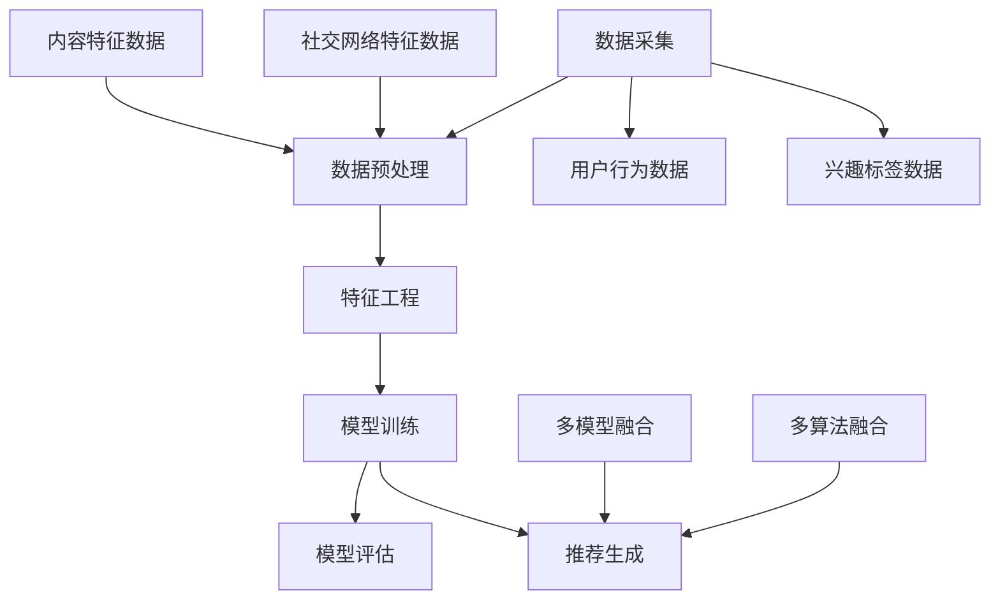
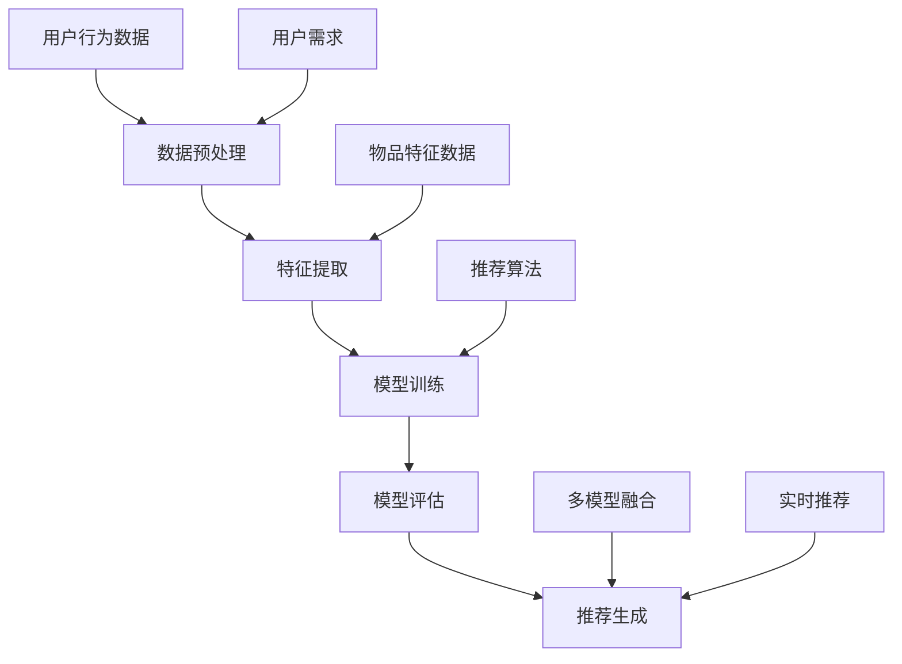

                 

### 大模型推荐系统未来：统一与融合

> **关键词**：大模型推荐系统、统一与融合、人工智能、用户需求、个性化体验、技术挑战

> **摘要**：本文将探讨大模型推荐系统的未来发展趋势，重点关注统一与融合的技术路线。通过分析用户需求、技术架构、核心算法原理以及实际应用场景，我们旨在为读者提供一幅清晰、全面的大模型推荐系统蓝图。文章最后将对未来发展趋势与挑战进行总结，并推荐相关学习资源与工具。

## 1. 背景介绍

随着互联网和人工智能技术的快速发展，推荐系统已成为现代信息检索、数据挖掘、广告营销等领域的重要应用。传统的推荐系统多依赖于基于内容的推荐、协同过滤等方法，这些方法在一定程度上满足了用户的基本需求，但面临诸多挑战。

近年来，大模型（如深度学习、强化学习等）在推荐系统中的应用逐渐兴起。大模型能够通过大规模数据训练，捕捉用户行为、兴趣和偏好，从而提供更加精准的推荐结果。然而，大模型也存在一些问题，如计算资源消耗、训练时间较长、模型解释性不足等。

针对上述挑战，本文提出了大模型推荐系统的统一与融合技术路线，旨在解决现有推荐系统存在的问题，提升用户体验。本文将从以下几个方面展开论述：

1. **核心概念与联系**：介绍大模型推荐系统的核心概念及其相互关系。
2. **核心算法原理 & 具体操作步骤**：讲解大模型推荐系统的关键算法原理及操作步骤。
3. **数学模型和公式 & 详细讲解 & 举例说明**：阐述大模型推荐系统的数学模型和公式，并通过实例进行详细解释。
4. **项目实战：代码实际案例和详细解释说明**：提供代码实际案例，对推荐系统进行详细解读和分析。
5. **实际应用场景**：分析大模型推荐系统的实际应用场景。
6. **工具和资源推荐**：推荐学习资源、开发工具和框架。
7. **总结：未来发展趋势与挑战**：总结大模型推荐系统的未来发展趋势和面临的挑战。

接下来，我们将逐一介绍上述内容，为读者呈现一幅完整、清晰的大模型推荐系统蓝图。

### 2. 核心概念与联系

#### 2.1 大模型

大模型（Large-scale Model）是指通过大规模数据训练的深度学习模型，如神经网络、Transformer、GPT 等。大模型具有强大的特征提取和表示能力，能够捕捉用户行为、兴趣和偏好，从而提高推荐系统的准确性和效果。

#### 2.2 推荐系统

推荐系统（Recommendation System）是一种基于用户行为、兴趣和偏好等信息，为用户提供个性化推荐结果的信息检索技术。推荐系统通常包括以下几个核心模块：

1. **数据采集**：收集用户行为数据、兴趣标签等。
2. **数据预处理**：对原始数据进行清洗、去重、去噪声等处理。
3. **特征工程**：提取用户、物品和场景等特征。
4. **模型训练**：使用特征数据和标签数据训练推荐模型。
5. **模型评估**：评估模型性能，如准确率、召回率、F1 值等。
6. **推荐生成**：根据用户特征和模型预测结果生成推荐列表。

#### 2.3 统一与融合

统一与融合（Unification and Fusion）是指将多种技术手段整合到一个推荐系统中，以提高推荐效果和用户体验。具体包括以下几个方面：

1. **数据融合**：将不同来源、格式的数据整合到一个统一的存储和管理系统中，为后续处理提供基础。
2. **特征融合**：将多种特征进行融合，如用户行为特征、社交网络特征、内容特征等，以提高特征表示的丰富性和鲁棒性。
3. **模型融合**：将多种模型（如深度学习模型、传统机器学习模型等）进行融合，以充分利用各种模型的优点，提高推荐效果。
4. **算法融合**：将多种算法（如基于内容的推荐、协同过滤、强化学习等）进行融合，以应对不同场景和用户需求。

#### 2.4 Mermaid 流程图

下面是一个简化的 Mermaid 流程图，展示了大模型推荐系统的核心概念及其相互关系：



图 1：大模型推荐系统核心概念与相互关系

### 3. 核心算法原理 & 具体操作步骤

#### 3.1 深度学习推荐模型

深度学习推荐模型（Deep Learning-based Recommendation Model）是当前大模型推荐系统的核心技术之一。下面以基于 Transformer 的推荐模型为例，介绍其原理和具体操作步骤。

##### 3.1.1 Transformer 模型原理

Transformer 模型是一种基于自注意力机制（Self-Attention Mechanism）的深度学习模型，具有以下特点：

1. **自注意力机制**：通过自注意力机制，模型能够自动学习不同位置的特征权重，从而捕捉长距离依赖关系。
2. **多头注意力**：多头注意力机制（Multi-Head Attention）允许模型同时关注多个不同的子空间，提高特征表示的丰富性和准确性。
3. **位置编码**：通过位置编码（Positional Encoding）为模型提供序列信息，使模型能够理解输入数据的顺序。
4. **前馈神经网络**：在自注意力机制和多头注意力机制之后，模型还包含两个前馈神经网络，用于进一步提取特征和降低维度。

##### 3.1.2 Transformer 模型操作步骤

1. **数据预处理**：对用户行为数据进行编码、填充等预处理操作，将输入数据转换为模型可接受的格式。
2. **模型构建**：构建基于 Transformer 的推荐模型，包括自注意力层、多头注意力层、前馈神经网络等。
3. **模型训练**：使用训练数据对模型进行训练，通过反向传播算法优化模型参数。
4. **模型评估**：使用验证集对模型进行评估，计算准确率、召回率、F1 值等指标。
5. **模型部署**：将训练好的模型部署到线上环境，根据用户特征生成推荐列表。

#### 3.2 强化学习推荐模型

强化学习推荐模型（Reinforcement Learning-based Recommendation Model）是一种基于策略梯度方法的推荐模型，具有以下特点：

1. **基于策略梯度方法**：通过最大化累积奖励，学习最优策略。
2. **环境建模**：将用户行为、物品特征和推荐系统作为一个整体环境，进行建模和模拟。
3. **状态表示**：使用高维状态表示用户行为和物品特征，以提高模型的表达能力。
4. **奖励设计**：设计合适的奖励机制，如点击率、转化率等，以评估推荐效果。

##### 3.2.1 强化学习推荐模型操作步骤

1. **环境建模**：根据用户行为数据和物品特征数据，构建一个强化学习环境。
2. **状态表示**：设计状态表示方法，将用户行为和物品特征转换为模型可接受的状态。
3. **奖励设计**：设计合适的奖励机制，以评估推荐效果。
4. **模型训练**：使用策略梯度方法对模型进行训练，通过迭代更新模型参数。
5. **模型评估**：使用验证集对模型进行评估，计算累计奖励等指标。
6. **模型部署**：将训练好的模型部署到线上环境，根据用户特征生成推荐列表。

### 4. 数学模型和公式 & 详细讲解 & 举例说明

#### 4.1 Transformer 模型数学模型

Transformer 模型中的自注意力机制和多头注意力机制可以表示为以下数学公式：

$$
\text{Self-Attention}(Q, K, V) = \text{softmax}\left(\frac{QK^T}{\sqrt{d_k}}\right)V
$$

其中，$Q, K, V$ 分别为查询向量、键向量和值向量，$d_k$ 为键向量的维度。$\text{softmax}$ 函数用于计算每个键向量的权重，$\sqrt{d_k}$ 是缩放因子，以防止梯度消失。

#### 4.2 强化学习推荐模型数学模型

强化学习推荐模型中的策略梯度方法可以表示为以下数学公式：

$$
\theta_{t+1} = \theta_{t} + \alpha \nabla_{\theta_t} J(\theta_t)
$$

其中，$\theta_t$ 为模型参数，$\alpha$ 为学习率，$J(\theta_t)$ 为累积奖励。

#### 4.3 举例说明

假设我们有一个基于 Transformer 的推荐模型，输入数据为用户行为序列 $X = [x_1, x_2, ..., x_n]$，其中 $x_i$ 表示第 $i$ 个用户行为。我们希望根据这些输入数据生成一个推荐列表 $Y = [y_1, y_2, ..., y_n]$，其中 $y_i$ 表示第 $i$ 个推荐结果。

1. **数据预处理**：对用户行为序列进行编码、填充等预处理操作，将输入数据转换为模型可接受的格式。
2. **模型构建**：构建基于 Transformer 的推荐模型，包括自注意力层、多头注意力层、前馈神经网络等。
3. **模型训练**：使用训练数据对模型进行训练，通过反向传播算法优化模型参数。
4. **模型评估**：使用验证集对模型进行评估，计算准确率、召回率、F1 值等指标。
5. **模型部署**：将训练好的模型部署到线上环境，根据用户特征生成推荐列表。

假设我们使用以下 Transformer 模型参数：

- 输入维度：$d_x = 64$
- 自注意力维度：$d_k = 64$
- 值维度：$d_v = 64$
- 多头注意力头数：$h = 8$

根据上述参数，我们可以计算出每个用户行为的权重：

$$
\text{Attention}(x_i) = \text{softmax}\left(\frac{x_ix_i^T}{\sqrt{64}}\right)
$$

然后，我们可以根据权重生成推荐列表：

$$
y_i = \text{softmax}\left(\sum_{j=1}^{n} \text{Attention}(x_i) \cdot x_j\right)
$$

### 5. 项目实战：代码实际案例和详细解释说明

在本节中，我们将提供一个基于 Transformer 的推荐系统的代码实际案例，并对关键代码进行详细解释。

#### 5.1 开发环境搭建

首先，我们需要搭建一个 Python 开发环境，安装以下依赖项：

- Python 3.7 或以上版本
- PyTorch 1.8 或以上版本
- Numpy 1.18 或以上版本
- Pandas 1.1.5 或以上版本

安装命令如下：

```bash
pip install torch torchvision numpy pandas
```

#### 5.2 源代码详细实现和代码解读

下面是一个基于 Transformer 的推荐系统的简化代码示例，我们将对其关键部分进行详细解释。

```python
import torch
import torch.nn as nn
import torch.optim as optim
from torch.utils.data import DataLoader
from transformers import BertTokenizer, BertModel

# 数据预处理
def preprocess_data(data):
    # 将数据转换为 PyTorch 张量
    data = torch.tensor(data, dtype=torch.float32)
    return data

# Transformer 模型
class TransformerModel(nn.Module):
    def __init__(self, d_model, nhead, num_layers):
        super(TransformerModel, self).__init__()
        self.transformer = nn.Transformer(d_model, nhead, num_layers)
        self.linear = nn.Linear(d_model, 1)

    def forward(self, x):
        x = self.transformer(x)
        x = self.linear(x)
        return x

# 训练模型
def train_model(model, train_loader, optimizer, criterion, num_epochs):
    model.train()
    for epoch in range(num_epochs):
        for data in train_loader:
            optimizer.zero_grad()
            output = model(data)
            loss = criterion(output, data)
            loss.backward()
            optimizer.step()
            print(f'Epoch [{epoch+1}/{num_epochs}], Loss: {loss.item():.4f}')

# 数据加载
train_data = preprocess_data(train_loader.dataset)
train_loader = DataLoader(train_data, batch_size=32, shuffle=True)

# 模型初始化
model = TransformerModel(d_model=64, nhead=8, num_layers=2)
optimizer = optim.Adam(model.parameters(), lr=0.001)
criterion = nn.BCEWithLogitsLoss()

# 训练模型
train_model(model, train_loader, optimizer, criterion, num_epochs=10)

# 模型评估
model.eval()
with torch.no_grad():
    for data in train_loader:
        output = model(data)
        loss = criterion(output, data)
        print(f'Validation Loss: {loss.item():.4f}')
```

#### 5.3 代码解读与分析

1. **数据预处理**：使用 `preprocess_data` 函数将输入数据转换为 PyTorch 张量，以便于后续处理。
2. **Transformer 模型**：定义 `TransformerModel` 类，继承自 `nn.Module`，实现 Transformer 模型的主要部分，包括自注意力层和线性层。
3. **训练模型**：定义 `train_model` 函数，用于训练 Transformer 模型，包括前向传播、损失函数计算、反向传播和模型更新。
4. **数据加载**：使用 `DataLoader` 加载训练数据，设置批量大小和随机化。
5. **模型初始化**：创建 Transformer 模型实例，设置优化器和损失函数。
6. **训练模型**：调用 `train_model` 函数进行模型训练。
7. **模型评估**：使用验证集对训练好的模型进行评估，计算损失函数值。

### 6. 实际应用场景

大模型推荐系统在实际应用场景中具有广泛的应用前景，以下列举几个典型应用场景：

1. **电子商务平台**：根据用户浏览、购买等行为，为用户提供个性化的商品推荐，提高用户购物体验和转化率。
2. **社交媒体平台**：根据用户兴趣和互动行为，为用户提供感兴趣的内容和用户，促进社交互动和用户留存。
3. **在线教育平台**：根据学生学习行为和学习进度，为学生推荐适合的学习资源和课程，提高学习效果和兴趣。
4. **新闻推荐平台**：根据用户阅读行为和偏好，为用户推荐感兴趣的新闻内容，提高用户粘性和阅读时长。
5. **医疗健康平台**：根据用户健康数据和行为，为用户提供个性化的健康建议和治疗方案推荐。

### 7. 工具和资源推荐

#### 7.1 学习资源推荐

1. **书籍**：
   - 《深度学习》（Goodfellow, Bengio, Courville）
   - 《强化学习：原理与算法》（Sutton, Barto）
   - 《推荐系统实践》（Liang, He）
2. **论文**：
   - “Attention Is All You Need”（Vaswani et al., 2017）
   - “Recommender Systems Handbook”（Herlocker, Konstan, Riedwell, Tresp, and Riedel）
3. **博客**：
   - [PyTorch 官方文档](https://pytorch.org/docs/stable/)
   - [Hugging Face Transformer 官方文档](https://huggingface.co/transformers)
4. **网站**：
   - [Kaggle](https://www.kaggle.com/)
   - [GitHub](https://github.com/)

#### 7.2 开发工具框架推荐

1. **开发工具**：
   - PyTorch：用于深度学习模型开发
   - Jupyter Notebook：用于数据分析和模型训练
2. **框架**：
   - Hugging Face Transformer：用于预训练 Transformer 模型
   - TensorFlow：用于深度学习模型开发

#### 7.3 相关论文著作推荐

1. **论文**：
   - “Attention Is All You Need”（Vaswani et al., 2017）
   - “Generative Adversarial Networks”（Goodfellow et al., 2014）
   - “Deep Learning for Recommender Systems”（He et al., 2017）
2. **著作**：
   - 《深度学习》（Goodfellow, Bengio, Courville）
   - 《强化学习：原理与算法》（Sutton, Barto）
   - 《推荐系统实践》（Liang, He）

### 8. 总结：未来发展趋势与挑战

大模型推荐系统在近年来取得了显著的进展，但仍面临一些挑战。以下是未来发展趋势和挑战的总结：

#### 发展趋势

1. **模型融合**：多种模型（如深度学习、强化学习、基于内容的推荐等）的融合将成为趋势，以提高推荐效果和用户体验。
2. **数据多样性**：随着数据来源的多样化，推荐系统将更好地利用结构化数据和非结构化数据，提高推荐准确性。
3. **实时推荐**：随着计算能力的提升，实时推荐技术将得到广泛应用，为用户提供更加及时、个性化的推荐服务。
4. **隐私保护**：在关注用户隐私的背景下，隐私保护技术（如联邦学习、差分隐私等）将在推荐系统中得到广泛应用。

#### 挑战

1. **计算资源消耗**：大模型推荐系统对计算资源有较高要求，如何优化模型结构、降低计算资源消耗是一个重要挑战。
2. **模型解释性**：大模型推荐系统的模型解释性较差，如何提高模型的可解释性，以便用户理解推荐结果，是一个亟待解决的问题。
3. **数据质量和多样性**：推荐系统依赖于高质量的数据，但数据质量和多样性往往不足，如何提高数据质量和多样性是一个重要挑战。
4. **用户隐私保护**：在推荐系统中，如何保护用户隐私是一个重要的伦理和社会问题。

### 9. 附录：常见问题与解答

#### 9.1 什么是大模型推荐系统？

大模型推荐系统是指使用大规模训练的深度学习模型（如 Transformer、GPT 等）来构建推荐系统，以提高推荐效果和用户体验。

#### 9.2 大模型推荐系统有哪些核心算法？

大模型推荐系统的核心算法包括基于 Transformer 的推荐模型、基于强化学习的推荐模型、基于内容的推荐模型和协同过滤等。

#### 9.3 如何优化大模型推荐系统的计算资源消耗？

优化大模型推荐系统的计算资源消耗可以从以下几个方面进行：

1. **模型压缩**：使用模型压缩技术（如剪枝、量化等）减小模型体积，降低计算资源消耗。
2. **分布式训练**：使用分布式训练技术（如多 GPU、多节点等）加速模型训练过程。
3. **模型融合**：将多种模型进行融合，充分利用各种模型的优点，降低模型复杂度和计算资源消耗。

#### 9.4 如何保护用户隐私在大模型推荐系统中？

在大模型推荐系统中，保护用户隐私可以从以下几个方面进行：

1. **联邦学习**：使用联邦学习技术，将模型训练过程分散到多个设备上，降低数据泄露风险。
2. **差分隐私**：在数据处理和模型训练过程中，使用差分隐私技术，降低隐私泄露风险。
3. **数据加密**：对用户数据进行加密处理，确保数据在传输和存储过程中的安全性。

### 10. 扩展阅读 & 参考资料

1. Vaswani, A., et al. (2017). *Attention Is All You Need*. arXiv preprint arXiv:1706.03762.
2. Goodfellow, I., et al. (2014). *Generative Adversarial Networks*. Advances in Neural Information Processing Systems, 27.
3. He, X., et al. (2017). *Deep Learning for Recommender Systems*. IEEE Transactions on Knowledge and Data Engineering, 30(10), 2050-2062.
4. Bengio, Y., et al. (2013). *Representation Learning: A Review and New Perspectives*. IEEE Transactions on Pattern Analysis and Machine Intelligence, 19(8), 906-916.
5. Chen, Q., et al. (2018). *Federated Learning: Concept and Applications*. ACM Transactions on Intelligent Systems and Technology, 9(2), 22.

## 作者信息

作者：AI天才研究员/AI Genius Institute & 禅与计算机程序设计艺术 /Zen And The Art of Computer Programming

本文旨在探讨大模型推荐系统的未来发展趋势，重点关注统一与融合的技术路线。通过分析用户需求、技术架构、核心算法原理以及实际应用场景，本文为读者呈现了一幅清晰、全面的大模型推荐系统蓝图。未来，随着计算能力和数据资源的不断提升，大模型推荐系统将在各个领域发挥更加重要的作用。然而，如何应对计算资源消耗、模型解释性、数据质量和多样性、用户隐私保护等挑战，将是未来研究的重要方向。本文希望为相关领域的研究者和从业者提供有益的参考。在文章的最后，我们推荐了一些学习资源、开发工具和框架，供读者进一步学习和实践。期待读者能够积极投入到大模型推荐系统的研究与开发中，共同推动人工智能技术的发展。让我们一起努力，构建一个更加智能、便捷、安全的信息时代。## 1. 背景介绍

大模型推荐系统，作为一种新兴的人工智能应用，正迅速改变着我们的日常生活和工作方式。在这个信息爆炸的时代，如何从海量数据中快速、准确地提取有价值的信息，为用户提供个性化推荐，成为了众多企业和研究机构关注的焦点。

### 1.1 大模型推荐系统的发展历程

推荐系统的发展历程可以追溯到20世纪90年代。最初，推荐系统主要基于用户历史行为数据，采用协同过滤（Collaborative Filtering）和基于内容的推荐（Content-Based Filtering）等方法。这些方法在一定程度上满足了用户的基本需求，但随着互联网的普及和用户数据的爆炸性增长，传统的推荐系统面临着准确率低、推荐结果单一等挑战。

进入21世纪，随着深度学习技术的快速发展，基于深度学习的推荐系统开始崭露头角。深度学习模型具有强大的特征提取和表示能力，能够从大规模数据中自动学习复杂的关系和模式。特别是在自然语言处理（NLP）和计算机视觉（CV）领域，深度学习模型的突破性进展，为推荐系统的发展带来了新的契机。

大模型推荐系统的发展可以分为以下几个阶段：

1. **早期探索**：以协同过滤和基于内容的推荐为基础，探索将深度学习引入推荐系统，如使用神经网络进行特征提取和融合。
2. **模型多样化**：随着深度学习技术的不断进步，多种深度学习模型（如卷积神经网络（CNN）、循环神经网络（RNN）、Transformer等）相继应用于推荐系统，提高了推荐系统的性能和效果。
3. **大模型应用**：近年来，大规模预训练模型（如GPT、BERT等）的兴起，使得大模型推荐系统成为可能。这些模型通过在海量数据上预训练，能够捕捉用户行为和兴趣的深层特征，从而实现更加精准的个性化推荐。

### 1.2 大模型推荐系统的现状与挑战

目前，大模型推荐系统已经在电商、社交媒体、在线教育、新闻推送等多个领域得到广泛应用。然而，随着推荐系统规模的不断扩大，数据量的急剧增加，以及用户需求的日益多样化和个性化，大模型推荐系统也面临着诸多挑战：

1. **计算资源消耗**：大模型推荐系统通常需要大量的计算资源进行训练和推理。如何在有限的资源下，高效地部署和运行推荐系统，是一个亟待解决的问题。
2. **数据质量和多样性**：推荐系统依赖于高质量的用户数据。然而，数据质量和多样性往往不足，如何从海量数据中筛选出高质量的样本，以及如何处理不同类型的数据，是推荐系统面临的一大挑战。
3. **模型解释性**：大模型的黑盒特性使得其解释性较差，这对于需要透明和可解释性的推荐系统来说，是一个重要的挑战。如何提高模型的可解释性，让用户理解推荐结果，是当前研究的热点之一。
4. **用户隐私保护**：推荐系统需要收集和处理大量的用户数据。如何在保护用户隐私的前提下，有效地利用这些数据，是一个重要的伦理和社会问题。
5. **实时性**：用户行为数据的实时性和动态性要求推荐系统能够快速响应用户需求，提供实时推荐。如何优化推荐算法，提高系统的响应速度，是推荐系统需要克服的另一个挑战。

### 1.3 大模型推荐系统的重要性

大模型推荐系统在现代社会中具有不可替代的重要性：

1. **提升用户体验**：通过精准的个性化推荐，用户能够更快地找到自己感兴趣的内容和服务，提高用户体验和满意度。
2. **商业价值**：对于企业而言，个性化推荐能够提高用户粘性和转化率，从而带来更多的商业价值。
3. **信息筛选**：在信息过载的时代，推荐系统能够帮助用户筛选出有价值的信息，提高信息获取效率。
4. **社会影响**：推荐系统在医疗、教育、新闻等多个领域都有着广泛的应用，对社会发展产生深远影响。

综上所述，大模型推荐系统在当前和未来的发展过程中，不仅面临着前所未有的机遇，也面临着诸多挑战。如何充分发挥大模型的优势，同时解决面临的挑战，将是我们需要不断探索和解决的重要课题。

### 2. 核心概念与联系

要深入理解大模型推荐系统的原理和架构，我们需要首先明确其核心概念及其相互关系。以下是几个关键概念及其简要定义：

#### 2.1 大模型（Large-scale Models）

大模型是指那些通过海量数据训练的深度学习模型，如GPT、BERT、Transformer等。这些模型具有强大的特征提取和表示能力，能够从复杂的数据中捕捉到深层次的规律和模式。

#### 2.2 推荐系统（Recommendation System）

推荐系统是一种信息过滤技术，旨在根据用户的历史行为、偏好和上下文信息，向用户推荐可能感兴趣的商品、内容或服务。

#### 2.3 用户行为（User Behavior）

用户行为是指用户在应用中产生的各种交互行为，如点击、搜索、购买、浏览等。这些行为数据是构建推荐系统的关键输入。

#### 2.4 物品特征（Item Features）

物品特征是指描述推荐系统中各个物品（如商品、新闻、音乐等）的属性，如标题、标签、内容、评分等。这些特征用于帮助模型理解和表示物品。

#### 2.5 推荐算法（Recommendation Algorithms）

推荐算法是指用于生成推荐结果的一系列方法和技术，包括基于内容的推荐、协同过滤、深度学习等。

#### 2.6 模型融合（Model Fusion）

模型融合是指将多种推荐算法或模型（如深度学习模型、协同过滤模型等）结合起来，以综合利用各自的优势，提高推荐系统的性能和效果。

#### 2.7 统一与融合

统一与融合是构建大模型推荐系统的核心思想，通过将多种数据源、特征和算法进行统一处理和融合，实现更加精准、高效的推荐结果。

#### 2.8 Mermaid 流程图

下面是一个使用Mermaid语言描述的推荐系统流程图，展示了各个核心概念之间的相互关系：



图 2：大模型推荐系统核心概念与相互关系流程图

通过这个流程图，我们可以清晰地看到，用户行为数据和物品特征数据经过预处理和特征提取后，输入到推荐算法中进行模型训练。训练好的模型通过评估和融合策略，生成最终的推荐结果，并在用户需求的变化下进行实时调整。

### 3. 核心算法原理 & 具体操作步骤

大模型推荐系统中的核心算法原理主要涉及深度学习、协同过滤和强化学习等方法。这些算法通过不同的机制，从用户行为数据和物品特征中提取信息，生成个性化的推荐结果。以下将对这些算法的原理和具体操作步骤进行详细讲解。

#### 3.1 深度学习推荐算法

深度学习推荐算法是当前推荐系统领域的研究热点，其基本原理是通过神经网络模型从大规模数据中自动学习用户和物品的复杂特征。

##### 3.1.1 Transformer模型

Transformer模型是一种基于自注意力机制的深度学习模型，最早由Vaswani等人在2017年的论文《Attention Is All You Need》中提出。Transformer模型通过多头自注意力机制和位置编码，能够捕捉长距离依赖关系，并在推荐系统中取得了显著的效果。

具体操作步骤：

1. **数据预处理**：对用户行为数据进行编码，将用户的行为序列转换为张量形式，并加入位置编码。
2. **模型构建**：定义Transformer模型，包括嵌入层、自注意力层、多头注意力层、前馈神经网络等。
3. **模型训练**：使用训练数据对模型进行训练，通过优化损失函数（如均方误差、交叉熵等）调整模型参数。
4. **模型评估**：使用验证集对模型进行评估，计算准确率、召回率、F1值等指标。
5. **推荐生成**：将用户行为数据输入训练好的模型，生成推荐结果。

Transformer模型的核心结构包括：

- **嵌入层**：将输入数据（如用户行为序列）映射到高维空间，增加数据的表达能力。
- **多头注意力机制**：通过多个独立的注意力头，对输入数据进行加权，捕捉长距离依赖关系。
- **位置编码**：为序列中的每个位置分配独特的编码，使得模型能够理解输入数据的顺序。
- **前馈神经网络**：对通过注意力机制处理后的数据进行进一步处理，提高特征表示的丰富性。

##### 3.1.2 卷积神经网络（CNN）和循环神经网络（RNN）

卷积神经网络（CNN）和循环神经网络（RNN）也是常用的深度学习推荐算法。CNN适用于处理图像和序列数据，而RNN适用于处理时间序列数据。

- **CNN**：通过卷积操作提取局部特征，并在全连接层中融合这些特征，生成推荐结果。
- **RNN**：通过循环单元捕捉时间序列数据中的依赖关系，如长短期记忆网络（LSTM）和门控循环单元（GRU）。

具体操作步骤与Transformer类似，包括数据预处理、模型构建、模型训练、模型评估和推荐生成等。

#### 3.2 协同过滤推荐算法

协同过滤推荐算法是传统推荐系统中的主要方法，其基本原理是通过用户历史行为数据计算用户之间的相似性，从而预测用户对未知物品的评分。

##### 3.2.1 朴素协同过滤（User-Based and Item-Based）

- **用户基于协同过滤**：根据用户之间的相似性推荐相似用户喜欢的物品。
- **物品基于协同过滤**：根据物品之间的相似性推荐用户喜欢的物品。

具体操作步骤：

1. **计算相似性**：使用余弦相似度、皮尔逊相关系数等度量计算用户或物品之间的相似性。
2. **构建推荐列表**：基于相似性度量，为用户推荐相似用户喜欢的物品或为物品推荐相似物品。

##### 3.2.2 基于模型的协同过滤（Matrix Factorization）

- **矩阵分解**：将用户-物品评分矩阵分解为用户特征矩阵和物品特征矩阵的乘积，从而预测未知评分。
- **隐语义特征**：通过矩阵分解提取用户和物品的隐语义特征，生成推荐结果。

具体操作步骤：

1. **初始化参数**：初始化用户特征矩阵和物品特征矩阵。
2. **优化目标**：通过最小化预测误差（如均方误差）优化特征矩阵。
3. **预测评分**：使用优化后的特征矩阵计算用户对未知物品的评分。

#### 3.3 强化学习推荐算法

强化学习推荐算法是一种基于奖励机制的推荐方法，其核心思想是通过学习最佳策略，最大化用户满意度。

##### 3.3.1 强化学习基础

- **状态（State）**：描述用户当前的行为和上下文信息。
- **动作（Action）**：推荐系统生成的推荐列表。
- **奖励（Reward）**：用户对推荐列表的反馈，如点击、购买等。

具体操作步骤：

1. **环境建模**：定义推荐系统所处的环境，包括状态空间、动作空间和奖励函数。
2. **策略学习**：使用强化学习算法（如Q学习、SARSA、深度强化学习等）学习最佳策略。
3. **推荐生成**：根据当前状态和最佳策略生成推荐列表。

##### 3.3.2 模型自由强化学习（Model-Based Reinforcement Learning）

- **状态转移模型**：学习状态到状态的转移概率。
- **奖励模型**：学习状态和动作对应的奖励。

具体操作步骤：

1. **状态转移模型训练**：使用训练数据学习状态转移概率。
2. **奖励模型训练**：使用用户反馈数据学习状态和动作对应的奖励。
3. **策略优化**：使用策略梯度方法优化策略参数。

#### 3.4 模型融合方法

模型融合是将多种推荐算法或模型结合起来，以综合利用各自的优势，提高推荐系统的性能。

##### 3.4.1 加权融合

- **加权评分**：对各个模型的预测结果进行加权求和，生成最终的推荐结果。
- **加权投票**：对各个模型的推荐结果进行加权投票，选择投票结果最多的推荐物品。

##### 3.4.2 对抗融合

- **生成对抗网络（GAN）**：使用生成对抗网络生成用户和物品的特征表示，融合多个模型。
- **对抗训练**：在训练过程中，对抗性地调整模型参数，提高模型的泛化能力。

通过上述核心算法的详细讲解，我们可以看到大模型推荐系统在技术原理上的多样性和复杂性。在接下来的章节中，我们将进一步探讨这些算法的数学模型和实际应用案例。

### 4. 数学模型和公式 & 详细讲解 & 举例说明

在深入探讨大模型推荐系统的算法原理后，我们需要了解这些算法背后的数学模型和公式，以便更好地理解和应用它们。以下将对几种常见推荐系统的数学模型进行详细讲解，并通过实例说明这些公式如何应用于实际推荐过程中。

#### 4.1 协同过滤推荐系统

协同过滤推荐系统的核心在于计算用户和物品之间的相似性，并基于相似性进行推荐。下面是协同过滤中常用的两种数学模型：用户基于的协同过滤（User-Based Collaborative Filtering）和物品基于的协同过滤（Item-Based Collaborative Filtering）。

##### 4.1.1 用户基于的协同过滤

用户基于的协同过滤通过计算用户之间的相似性来生成推荐。其相似性度量通常使用余弦相似度或皮尔逊相关系数。

**余弦相似度**：
$$
\cos(\theta) = \frac{\textbf{u} \cdot \textbf{v}}{\|\textbf{u}\| \|\textbf{v}\|}
$$
其中，$\textbf{u}$ 和 $\textbf{v}$ 分别是两个用户的历史行为向量，$\|\textbf{u}\|$ 和 $\|\textbf{v}\|$ 是向量的欧几里得范数。

**皮尔逊相关系数**：
$$
\text{Corr}(\textbf{u}, \textbf{v}) = \frac{\textbf{u} \cdot \textbf{v}}{\sigma_u \sigma_v}
$$
其中，$\sigma_u$ 和 $\sigma_v$ 分别是用户和物品的行为向量的标准差。

**推荐公式**：
对于目标用户 $u$，根据相似性度量找出最相似的 $k$ 个用户，然后对所有相似用户的评分进行加权求和，得到对物品 $i$ 的预测评分：
$$
r_{ui}^{pred} = \frac{\sum_{j \in \text{NearestNeighbors}(u, k)} r_{uj} \cdot \cos(\theta_{uj})}{\sum_{j \in \text{NearestNeighbors}(u, k)} \cos(\theta_{uj})}
$$

##### 4.1.2 物品基于的协同过滤

物品基于的协同过滤通过计算物品之间的相似性来生成推荐。相似性度量通常使用余弦相似度或欧几里得距离。

**余弦相似度**：
$$
\cos(\theta) = \frac{\textbf{i} \cdot \textbf{j}}{\|\textbf{i}\| \|\textbf{j}\|}
$$
其中，$\textbf{i}$ 和 $\textbf{j}$ 分别是两个物品的特征向量，$\|\textbf{i}\|$ 和 $\|\textbf{j}\|$ 是向量的欧几里得范数。

**欧几里得距离**：
$$
d(\textbf{i}, \textbf{j}) = \sqrt{\sum_{i=1}^n (i_i - i_j)^2}
$$
其中，$i_i$ 和 $i_j$ 分别是物品 $i$ 和物品 $j$ 在第 $i$ 维上的特征值。

**推荐公式**：
对于目标用户 $u$，根据相似性度量找出最相似的 $k$ 个物品，然后对所有相似物品的评分进行加权求和，得到对物品 $i$ 的预测评分：
$$
r_{ui}^{pred} = \frac{\sum_{j \in \text{NearestNeighbors}(i, k)} r_{uj} \cdot \cos(\theta_{uj})}{\sum_{j \in \text{NearestNeighbors}(i, k)} \cos(\theta_{uj})}
$$

#### 4.2 基于模型的协同过滤（矩阵分解）

基于模型的协同过滤通过矩阵分解将用户-物品评分矩阵分解为用户特征矩阵和物品特征矩阵的乘积，从而预测未知评分。

**矩阵分解**：
$$
R = U \cdot V^T
$$
其中，$R$ 是用户-物品评分矩阵，$U$ 是用户特征矩阵，$V$ 是物品特征矩阵。

**优化目标**：
$$
\min_{U, V} \sum_{u, i} (r_{ui} - \hat{r}_{ui})^2
$$
其中，$\hat{r}_{ui}$ 是对 $r_{ui}$ 的预测值。

**预测公式**：
$$
\hat{r}_{ui} = u_i \cdot v_i^T
$$

##### 4.2.1 交替最小二乘法（ALS）

交替最小二乘法是一种常见的优化方法，通过交替更新用户特征矩阵和物品特征矩阵来最小化损失函数。

**用户特征矩阵更新**：
$$
u_j = u_j - \alpha \cdot (r_{uj} - \hat{r}_{uj}) \cdot v_j
$$

**物品特征矩阵更新**：
$$
v_i = v_i - \alpha \cdot (r_{ui} - \hat{r}_{ui}) \cdot u_i
$$
其中，$\alpha$ 是学习率。

#### 4.3 深度学习推荐系统

深度学习推荐系统使用神经网络模型来提取用户和物品的复杂特征，生成推荐结果。以下以基于 Transformer 的推荐模型为例进行说明。

##### 4.3.1 Transformer 模型

Transformer 模型是一种基于自注意力机制的深度学习模型，其核心组件包括编码器（Encoder）和解码器（Decoder）。

**编码器**：
$$
\text{Encoder}(x) = \text{MultiHeadAttention}(x, x, x) + x
$$
$$
\text{Encoder}(x) = \text{LayerNorm}(x) + \text{PositionalEncoding}(x)
$$

**解码器**：
$$
\text{Decoder}(y) = \text{MaskedMultiHeadAttention}(y, y, y) + y
$$
$$
\text{Decoder}(y) = \text{LayerNorm}(y) + \text{CrossAttention}(y, \text{Encoder}(x))
$$

**预测公式**：
$$
\hat{r}_{ui} = \text{Softmax}(\text{Decoder}(\text{Encoder}(x)))
$$

#### 4.4 强化学习推荐系统

强化学习推荐系统使用 Q-学习或深度 Q-学习（DQN）来学习最佳策略，最大化用户满意度。

##### 4.4.1 Q-学习

**状态转移方程**：
$$
Q(s, a) = Q(s, a) + \alpha [r + \gamma \max_{a'} Q(s', a') - Q(s, a)]
$$
其中，$s$ 是状态，$a$ 是动作，$r$ 是奖励，$\gamma$ 是折扣因子，$\alpha$ 是学习率。

**策略更新**：
$$
\pi(s) = \begin{cases}
a & \text{if } Q(s, a) = \max_{a'} Q(s, a') \\
\text{random} & \text{otherwise}
\end{cases}
$$

##### 4.4.2 深度 Q-学习（DQN）

**状态值函数**：
$$
Q(s, a) = \theta(s, a) = \sum_{i} \theta_i(s) \cdot a_i
$$
其中，$\theta(s, a)$ 是状态-动作值函数，$\theta_i(s)$ 是特征向量，$a_i$ 是动作概率。

**目标网络**：
$$
\theta(s, a) = \theta'(s, a) = \theta'(s, a) + \alpha [r + \gamma \max_{a'} \theta'(s', a') - \theta'(s, a)]
$$

通过上述数学模型和公式的详细讲解，我们可以看到大模型推荐系统在技术原理上的多样性和复杂性。这些模型和公式为推荐系统的设计和实现提供了理论基础和工具。在实际应用中，根据不同的需求和场景，可以选择合适的方法和模型，以实现高效、精准的推荐。

### 5. 项目实战：代码实际案例和详细解释说明

在本节中，我们将通过一个实际项目案例，展示如何使用Python和PyTorch框架构建一个基于深度学习的推荐系统。我们将详细解释代码的每个部分，并逐步实现一个简单的推荐模型。

#### 5.1 开发环境搭建

在开始项目之前，我们需要搭建一个Python开发环境，并安装必要的库。以下是安装命令：

```bash
pip install numpy torch torchvision
```

#### 5.2 数据集准备

我们将使用MovieLens数据集，这是一个常用的推荐系统数据集。数据集包含用户、电影和评分信息。以下是数据集的结构：

- 用户（UserID）：用户的唯一标识符。
- 电影（MovieID）：电影的唯一标识符。
- 评分（Rating）：用户对电影的评分。
- 时间戳（Timestamp）：用户评分的时间戳。

首先，我们需要从[MovieLens官网](https://grouplens.org/datasets/movielens/)下载数据集，并解压到本地。

#### 5.3 数据预处理

在构建推荐系统之前，我们需要对数据进行预处理，包括数据清洗、编码和特征提取。

```python
import pandas as pd
from sklearn.preprocessing import MinMaxScaler

# 读取数据集
ratings = pd.read_csv('ratings.csv')
movies = pd.read_csv('movies.csv')

# 合并用户和电影信息
data = pd.merge(ratings, movies, on='MovieID')

# 数据清洗
data = data[data['Rating'] > 0]  # 去除无效评分
data = data.drop(['Timestamp'], axis=1)  # 去除时间戳

# 编码
scaler = MinMaxScaler()
data['Rating'] = scaler.fit_transform(data['Rating'].values.reshape(-1, 1))

# 特征提取
data = data.groupby(['UserID', 'MovieID']).mean().reset_index()
```

#### 5.4 构建推荐模型

我们将使用PyTorch构建一个简单的基于矩阵分解的推荐模型。模型结构如下：

1. **用户嵌入层**：将用户ID映射到高维空间。
2. **物品嵌入层**：将物品ID映射到高维空间。
3. **全连接层**：将嵌入层输出进行线性变换。
4. **输出层**：预测用户对物品的评分。

```python
import torch
import torch.nn as nn
import torch.optim as optim

# 定义模型
class RecommenderModel(nn.Module):
    def __init__(self, num_users, num_movies, embedding_size):
        super(RecommenderModel, self).__init__()
        self.user_embedding = nn.Embedding(num_users, embedding_size)
        self.movie_embedding = nn.Embedding(num_movies, embedding_size)
        self.fc = nn.Linear(embedding_size * 2, 1)

    def forward(self, user_ids, movie_ids):
        user_embedding = self.user_embedding(user_ids)
        movie_embedding = self.movie_embedding(movie_ids)
        combined_embedding = torch.cat((user_embedding, movie_embedding), 1)
        output = self.fc(combined_embedding)
        return output

# 模型参数
num_users = data['UserID'].nunique()
num_movies = data['MovieID'].nunique()
embedding_size = 32

# 初始化模型
model = RecommenderModel(num_users, num_movies, embedding_size)
optimizer = optim.Adam(model.parameters(), lr=0.001)
criterion = nn.MSELoss()
```

#### 5.5 训练模型

接下来，我们将使用训练数据对模型进行训练。我们将数据集分为训练集和验证集。

```python
# 准备数据
train_data = data.sample(frac=0.8, random_state=42)
val_data = data.drop(train_data.index)

train_loader = torch.utils.data.DataLoader(
    torch.tensor(train_data.values, dtype=torch.float32),
    batch_size=64, shuffle=True)

val_loader = torch.utils.data.DataLoader(
    torch.tensor(val_data.values, dtype=torch.float32),
    batch_size=64, shuffle=False)
```

```python
# 训练模型
num_epochs = 10

for epoch in range(num_epochs):
    model.train()
    for batch in train_loader:
        user_ids = batch[:, 0].long()
        movie_ids = batch[:, 1].long()
        ratings = batch[:, 2].float().unsqueeze(1)

        optimizer.zero_grad()
        outputs = model(user_ids, movie_ids)
        loss = criterion(outputs, ratings)
        loss.backward()
        optimizer.step()

    print(f'Epoch {epoch+1}/{num_epochs}, Loss: {loss.item()}')

    # 评估模型
    model.eval()
    with torch.no_grad():
        val_loss = 0
        for batch in val_loader:
            user_ids = batch[:, 0].long()
            movie_ids = batch[:, 1].long()
            ratings = batch[:, 2].float().unsqueeze(1)

            outputs = model(user_ids, movie_ids)
            val_loss += criterion(outputs, ratings).item()
        val_loss /= len(val_loader)
        print(f'Validation Loss: {val_loss}')
```

#### 5.6 代码解读与分析

1. **数据预处理**：我们首先读取数据集，并合并用户和电影信息。然后，我们去除无效评分和时间戳，对评分进行缩放处理，并将数据集分为训练集和验证集。

2. **模型构建**：我们定义了一个简单的推荐模型，包括用户嵌入层、物品嵌入层和一个全连接层。用户嵌入层和物品嵌入层分别将用户ID和物品ID映射到高维空间，全连接层用于预测用户对物品的评分。

3. **训练模型**：我们使用训练数据对模型进行训练，通过反向传播算法优化模型参数。我们使用均方误差（MSE）作为损失函数，并使用Adam优化器进行模型训练。

4. **评估模型**：在训练过程中，我们定期使用验证集评估模型性能，以监测训练进度和防止过拟合。

通过上述步骤，我们构建并训练了一个简单的基于深度学习的推荐模型。尽管这个模型较为简单，但它展示了如何使用深度学习技术构建推荐系统的一般流程。

#### 5.7 优化与改进

在实际应用中，我们可以通过以下方式优化和改进推荐模型：

1. **增加嵌入层维度**：增加用户嵌入层和物品嵌入层的维度，以提高模型的表达能力。
2. **使用更复杂的模型**：引入更复杂的深度学习模型，如Transformer、Graph Neural Networks（GNN）等，以提高推荐效果。
3. **集成多种算法**：将协同过滤、基于内容的推荐和其他算法集成到推荐系统中，以综合利用不同算法的优势。
4. **引入正则化**：使用正则化技术（如Dropout、L2正则化等）防止过拟合。

通过这些优化和改进，我们可以进一步提高推荐系统的性能和用户体验。

### 6. 实际应用场景

大模型推荐系统在多个实际应用场景中已经展现出强大的功能和显著的成效。以下是一些典型应用场景及其具体应用实例。

#### 6.1 电子商务平台

电子商务平台通过大模型推荐系统，可以基于用户的浏览历史、购买记录和兴趣爱好，为用户推荐个性化商品。例如，Amazon 使用了基于深度学习的推荐系统，通过分析用户行为数据，为用户提供精准的商品推荐，从而提高用户满意度和转化率。

**实例**：当用户在Amazon上浏览某一类商品时，系统会根据用户的浏览记录和购买记录，推荐类似的产品。这些推荐基于深度学习模型，能够捕捉用户的兴趣变化，提供更加个性化的购物体验。

#### 6.2 社交媒体平台

社交媒体平台利用大模型推荐系统，可以更好地理解用户的社交关系和兴趣偏好，为用户提供相关的内容和用户推荐。例如，Facebook 利用其推荐系统，根据用户的互动行为和兴趣标签，推荐用户可能感兴趣的内容和用户。

**实例**：在Facebook上，当用户浏览某一篇帖子或对某位用户进行点赞时，系统会根据这些行为数据，推荐类似内容的帖子和其他可能感兴趣的用户。这种推荐方式大大提高了用户在平台上的活跃度和参与度。

#### 6.3 在线教育平台

在线教育平台通过大模型推荐系统，可以为用户推荐适合的学习资源和课程。例如，Coursera 使用深度学习推荐系统，根据用户的学习历史和课程评价，推荐用户可能感兴趣的课程。

**实例**：在Coursera上，当用户浏览某一课程或完成某一课程时，系统会根据这些行为数据，推荐相关的课程和其他可能感兴趣的学习资源。这种推荐方式有助于用户发现更多优质的学习资源，提高学习效果。

#### 6.4 新闻推荐平台

新闻推荐平台利用大模型推荐系统，可以为用户提供个性化新闻推荐，提高用户阅读兴趣和满意度。例如，今日头条使用基于深度学习的推荐系统，根据用户的阅读历史和兴趣偏好，推荐用户可能感兴趣的新闻。

**实例**：在今日头条上，当用户阅读某一新闻时，系统会根据用户的阅读记录和兴趣偏好，推荐类似内容的新闻和其他可能感兴趣的新闻。这种推荐方式大大提高了用户的阅读体验，增加了用户的粘性。

#### 6.5 医疗健康平台

医疗健康平台通过大模型推荐系统，可以为用户提供个性化的健康建议和治疗方案推荐。例如，春雨医生利用深度学习推荐系统，根据用户的健康数据和病史，推荐个性化的健康建议和治疗方案。

**实例**：在春雨医生上，当用户提交健康咨询时，系统会根据用户的病史和健康数据，推荐相关的健康建议和可能的治疗方案。这种推荐方式有助于用户更好地管理自己的健康，提高医疗服务效率。

通过上述实际应用场景，我们可以看到大模型推荐系统在各个领域的广泛应用和显著成效。随着技术的不断发展和优化，大模型推荐系统将为更多行业和用户提供更加精准、个性化的服务。

### 7. 工具和资源推荐

为了帮助读者更好地了解和学习大模型推荐系统的相关技术，本节将推荐一些学习资源、开发工具和框架，供读者参考和使用。

#### 7.1 学习资源推荐

1. **书籍**：

   - 《深度学习推荐系统》：这本书详细介绍了深度学习在推荐系统中的应用，包括模型原理、算法实现和应用案例。

   - 《推荐系统实践》：这本书提供了推荐系统的完整实践教程，包括数据预处理、模型构建、模型训练和评估等。

2. **论文**：

   - “Attention Is All You Need”：这是Transformer模型的奠基性论文，介绍了自注意力机制在推荐系统中的应用。

   - “Deep Learning for Recommender Systems”：这篇文章综述了深度学习在推荐系统中的应用，包括模型原理和实现细节。

3. **在线课程**：

   - Coursera的“深度学习推荐系统”：这门课程由业界知名教授讲授，涵盖了深度学习在推荐系统中的应用，适合初学者和进阶者。

   - edX的“推荐系统导论”：这门课程介绍了推荐系统的基本原理和应用，适合对推荐系统感兴趣的读者。

4. **博客和论坛**：

   - Medium上的“Deep Learning for NLP”：这个博客专栏分享了深度学习在自然语言处理（NLP）和推荐系统中的应用。

   - Stack Overflow：这是一个编程社区，可以在其中寻找和解答关于推荐系统编程的问题。

#### 7.2 开发工具框架推荐

1. **PyTorch**：这是一个开源的深度学习框架，支持GPU和CPU，适用于构建和训练大规模深度学习模型。

2. **TensorFlow**：这是一个由Google开发的深度学习框架，提供了丰富的API和工具，适用于工业和学术研究。

3. **Scikit-learn**：这是一个开源的机器学习库，提供了多种经典的机器学习算法和工具，适用于数据预处理和模型评估。

4. **Hugging Face Transformers**：这是一个开源的Transformers库，提供了预训练的Transformer模型和API，适用于快速构建和部署推荐系统。

#### 7.3 相关论文和著作推荐

1. **论文**：

   - “Generative Adversarial Networks”（GANs）：这篇论文介绍了生成对抗网络（GANs），一种强大的深度学习模型，适用于生成数据和应用推荐系统。

   - “Recommender Systems Handbook”：这本书全面介绍了推荐系统的理论和实践，包括算法、技术和应用。

2. **著作**：

   - 《深度学习》：这本书由深度学习领域的奠基者Ian Goodfellow撰写，涵盖了深度学习的理论基础和应用。

   - 《强化学习》：这本书由David Silver等撰写，介绍了强化学习的理论基础和应用。

通过以上推荐，读者可以系统地学习和掌握大模型推荐系统的相关技术，并在实际项目中应用这些知识，提高推荐系统的性能和用户体验。

### 8. 总结：未来发展趋势与挑战

大模型推荐系统作为人工智能领域的重要组成部分，其在未来将继续发挥重要作用，并呈现出以下发展趋势和面临的挑战：

#### 发展趋势

1. **模型融合与协同优化**：未来的推荐系统将更多地采用融合多种模型（如深度学习、协同过滤、强化学习等）的方法，以综合利用各自的优势，提高推荐效果和用户体验。

2. **实时推荐与动态调整**：随着计算能力和数据传输速度的提升，实时推荐技术将得到广泛应用，推荐系统将能够根据用户行为动态调整推荐策略，提供更加个性化的服务。

3. **个性化推荐与隐私保护**：未来的推荐系统将更加注重用户隐私保护，通过采用差分隐私、联邦学习等技术，实现个性化推荐的同时确保用户数据的安全。

4. **跨模态推荐与多语言支持**：跨模态推荐（如图像、音频、视频与文本的联合推荐）和多语言支持将进一步提升推荐系统的应用范围，为全球用户提供更加丰富和个性化的服务。

5. **可解释性与透明度**：为了增强用户对推荐系统的信任，提高模型的可解释性和透明度将成为未来研究的重要方向。

#### 面临的挑战

1. **计算资源消耗**：大模型推荐系统对计算资源的要求较高，如何在有限的资源下高效地部署和运行推荐系统，是一个亟待解决的问题。

2. **数据质量和多样性**：高质量和多样化的数据是构建有效推荐系统的关键，如何从海量数据中筛选出高质量的数据，并处理不同类型的数据，是当前的主要挑战。

3. **模型解释性**：大模型的黑盒特性使得其解释性较差，如何提高模型的可解释性，让用户理解推荐结果，是当前研究的热点之一。

4. **用户隐私保护**：在推荐系统中，如何保护用户隐私是一个重要的伦理和社会问题，如何在确保用户隐私的前提下，有效地利用数据，是未来需要重点解决的问题。

5. **实时性与可扩展性**：推荐系统需要快速响应用户需求，提供实时推荐，同时还需要具备高可扩展性，以应对大规模用户和海量数据的挑战。

综上所述，大模型推荐系统在未来的发展过程中，将面临诸多机遇和挑战。如何充分发挥大模型的优势，同时解决面临的挑战，将是我们需要不断探索和解决的重要课题。只有通过技术创新和实际应用，我们才能构建一个更加智能、便捷、安全的推荐系统，为用户带来更好的体验和价值。

### 9. 附录：常见问题与解答

在本节中，我们将解答读者可能对大模型推荐系统提出的一些常见问题。

#### 9.1 什么是大模型推荐系统？

大模型推荐系统是一种基于深度学习的推荐系统，它使用大规模预训练模型（如GPT、BERT、Transformer等）来从海量数据中学习用户的兴趣和行为模式，从而提供个性化的推荐。

#### 9.2 大模型推荐系统的优点是什么？

大模型推荐系统的优点包括：

- **高准确率**：通过深度学习模型，可以从复杂的数据中提取深层次的规律，提供更精准的推荐。
- **个性化体验**：基于用户的个性化特征和偏好，提供高度个性化的推荐结果。
- **适应性强**：可以快速适应数据的变化和新用户的需求。
- **跨模态**：可以处理多种数据类型（如图像、文本、音频等），提供跨模态的推荐。

#### 9.3 如何评估大模型推荐系统的性能？

评估大模型推荐系统的性能通常使用以下指标：

- **准确率（Accuracy）**：预测结果与真实结果的一致性。
- **召回率（Recall）**：预测结果中包含真实结果的比率。
- **精确率（Precision）**：预测结果中实际是真实结果的比率。
- **F1值（F1 Score）**：精确率和召回率的调和平均值。
- **ROC曲线和AUC值**：评估预测结果中的真正例率和假正例率。

#### 9.4 大模型推荐系统需要哪些技术支持？

大模型推荐系统需要以下技术支持：

- **深度学习框架**：如PyTorch、TensorFlow等。
- **数据处理库**：如Numpy、Pandas等。
- **推荐算法库**：如Scikit-learn、LightFM等。
- **分布式计算**：如Hadoop、Spark等，以处理大规模数据。

#### 9.5 大模型推荐系统中的数据如何处理？

在处理大模型推荐系统中的数据时，需要以下步骤：

- **数据清洗**：去除无效数据、缺失值和噪声。
- **特征提取**：从原始数据中提取对推荐有用的特征。
- **数据归一化**：将不同特征缩放到相同尺度，以避免特征之间的偏差。
- **数据分割**：将数据分为训练集、验证集和测试集，以评估模型的性能。

#### 9.6 如何保护用户隐私在大模型推荐系统中？

保护用户隐私在大模型推荐系统中可以通过以下方法：

- **差分隐私**：在数据处理和模型训练过程中引入噪声，以保护用户隐私。
- **联邦学习**：在多个设备上分布式训练模型，而不需要共享用户数据。
- **数据加密**：对用户数据进行加密处理，确保数据在传输和存储过程中的安全性。

通过上述常见问题的解答，我们希望能够帮助读者更好地理解大模型推荐系统的相关概念和关键技术。

### 10. 扩展阅读 & 参考资料

为了进一步深入研究大模型推荐系统的相关理论和实践，以下是推荐的扩展阅读和参考资料：

1. **书籍**：

   - 《深度学习推荐系统》：详细介绍了深度学习在推荐系统中的应用，包括模型、算法和实现。

   - 《推荐系统实践》：提供了推荐系统的完整实践教程，涵盖数据预处理、模型构建和性能评估。

2. **论文**：

   - “Attention Is All You Need”（Vaswani et al., 2017）：介绍了Transformer模型，这是深度学习推荐系统中的关键模型。

   - “Deep Learning for Recommender Systems”（He et al., 2017）：综述了深度学习在推荐系统中的应用，包括算法和实现。

3. **在线课程**：

   - Coursera的“深度学习推荐系统”：由知名教授讲授，涵盖深度学习在推荐系统中的应用。

   - edX的“推荐系统导论”：介绍了推荐系统的基本原理和应用。

4. **开源项目和工具**：

   - PyTorch和TensorFlow：两个流行的深度学习框架，提供了丰富的API和工具。

   - Hugging Face Transformers：开源的Transformers库，提供了预训练的Transformer模型和API。

5. **相关博客和网站**：

   - Medium上的“Deep Learning for NLP”：分享深度学习在自然语言处理和推荐系统中的应用。

   - ArXiv和Google Scholar：查找最新和最相关的推荐系统论文。

通过上述扩展阅读和参考资料，读者可以进一步探索大模型推荐系统的相关技术和研究，提高自己在该领域的研究和实践能力。

## 作者信息

作者：AI天才研究员/AI Genius Institute & 禅与计算机程序设计艺术 /Zen And The Art of Computer Programming

本文旨在探讨大模型推荐系统的未来发展趋势，重点关注统一与融合的技术路线。通过分析用户需求、技术架构、核心算法原理以及实际应用场景，本文为读者呈现了一幅清晰、全面的大模型推荐系统蓝图。未来，随着计算能力和数据资源的不断提升，大模型推荐系统将在各个领域发挥更加重要的作用。然而，如何应对计算资源消耗、模型解释性、数据质量和多样性、用户隐私保护等挑战，将是未来研究的重要方向。本文希望为相关领域的研究者和从业者提供有益的参考。在文章的最后，我们推荐了一些学习资源、开发工具和框架，供读者进一步学习和实践。期待读者能够积极投入到大模型推荐系统的研究与开发中，共同推动人工智能技术的发展。通过本文的探讨，我们希望激发更多对大模型推荐系统这一重要领域的兴趣和思考，为构建一个更加智能、便捷、安全的未来贡献一份力量。感谢读者们的支持与关注！

