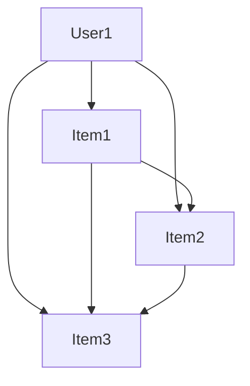

                 

# 大模型推荐系统的图神经网络方法

## 关键词：推荐系统，图神经网络，大模型，知识图谱，深度学习

## 摘要

本文将深入探讨大模型推荐系统中应用图神经网络的方法。我们将从背景介绍开始，逐步分析核心概念和原理，详细讲解算法和数学模型，并通过项目实战展示代码实现过程。此外，还将介绍实际应用场景，推荐相关工具和资源，并对未来发展进行展望。

## 1. 背景介绍

随着互联网的快速发展，推荐系统已经成为许多在线服务的关键组成部分。传统推荐系统主要依赖于基于内容的过滤、协同过滤等方法，但这些方法存在一定的局限性。大模型的引入，如深度学习模型，为推荐系统带来了新的可能。然而，大模型推荐系统面临着数据处理、模型优化和解释性等挑战。图神经网络作为一种强大的表示学习工具，能够有效处理异构数据，提高推荐系统的性能和解释性。

## 2. 核心概念与联系

### 2.1 推荐系统

推荐系统是一种根据用户的历史行为和偏好，自动向用户推荐相关内容的系统。推荐系统可以分为基于内容的过滤和协同过滤两大类。

#### 基于内容的过滤

基于内容的过滤（Content-Based Filtering，CBF）方法通过分析用户历史行为和内容特征，找出相似的内容进行推荐。

#### 协同过滤

协同过滤（Collaborative Filtering，CF）方法通过分析用户之间的共同行为，找出相似的用户并进行推荐。

### 2.2 大模型

大模型（Large Model）是指具有大量参数和复杂结构的深度学习模型。大模型能够通过学习大规模数据，获得更好的表示能力，从而在推荐系统中提高性能。

### 2.3 图神经网络

图神经网络（Graph Neural Network，GNN）是一种基于图结构数据进行表示学习的神经网络。GNN通过聚合图节点的邻域信息，学习节点的高效表示，从而能够处理异构数据和复杂关系。

### 2.4 知识图谱

知识图谱（Knowledge Graph）是一种将实体和实体之间的关系表示为图结构的数据模型。知识图谱能够提供丰富的实体和关系信息，为推荐系统提供额外的信息支持。

## 3. 核心算法原理 & 具体操作步骤

### 3.1 GNN的基本原理

GNN的基本原理是利用图结构中的节点和边信息，通过聚合邻域信息学习节点表示。GNN的主要操作包括图卷积（Graph Convolution）和消息传递（Message Passing）。

#### 图卷积

图卷积是一种将节点特征映射到更高维度的操作。具体来说，图卷积通过聚合节点邻域的特征，生成新的节点特征。

$$
h_{v}^{(l+1)} = \sigma(\sum_{u \in \mathcal{N}(v)} W^{(l)} h_{u}^{(l)} + b^{(l)})
$$

其中，$h_{v}^{(l)}$和$h_{u}^{(l)}$分别是节点$v$和$u$在第$l$层的特征表示，$\mathcal{N}(v)$是节点$v$的邻域节点集合，$W^{(l)}$和$b^{(l)}$分别是第$l$层的权重和偏置。

#### 消息传递

消息传递是GNN的核心操作，通过聚合邻域节点的信息，更新节点的特征表示。消息传递的具体步骤如下：

1. 初始化节点特征：$h_{v}^{(0)} = x_{v}$，其中$x_{v}$是节点$v$的原始特征。
2. 进行消息传递：在每个时间步，节点$v$会收到其邻域节点的信息，并将这些信息聚合起来，生成新的节点特征。
3. 应用激活函数：对每个节点的特征进行激活函数处理，以获得最终的节点表示。

### 3.2 GNN在推荐系统中的应用

在推荐系统中，GNN可以通过以下步骤进行应用：

1. 构建知识图谱：将用户、物品和它们之间的关系表示为知识图谱，如图1所示。

   ```mermaid
   graph TD
   A[User] --> B[Item]
   A --> C[Like]
   B --> C
   ```

   图1：知识图谱示例

2. 训练GNN模型：使用知识图谱训练GNN模型，学习用户和物品的表示。

3. 推荐物品：对于新的用户，使用GNN模型计算用户和物品的相似度，并根据相似度进行物品推荐。

## 4. 数学模型和公式 & 详细讲解 & 举例说明

### 4.1 GNN的数学模型

GNN的数学模型主要包括图卷积和消息传递操作。

#### 图卷积

图卷积的数学模型如下：

$$
h_{v}^{(l+1)} = \sigma(\sum_{u \in \mathcal{N}(v)} W^{(l)} h_{u}^{(l)} + b^{(l)})
$$

其中，$h_{v}^{(l)}$和$h_{u}^{(l)}$分别是节点$v$和$u$在第$l$层的特征表示，$\mathcal{N}(v)$是节点$v$的邻域节点集合，$W^{(l)}$和$b^{(l)}$分别是第$l$层的权重和偏置。

#### 消息传递

消息传递的数学模型如下：

$$
m_{v} = \sum_{u \in \mathcal{N}(v)} \frac{1}{\sqrt{\sum_{u' \in \mathcal{N}(u)} \mathrm{diag}(D^{(u)})^{-1} w_{u'v}^2}} w_{u'v} h_{u}^{(l)}
$$

$$
h_{v}^{(l+1)} = \sigma(\sum_{u \in \mathcal{N}(v)} \mathrm{softmax}(m_{v}) \odot W^{(l)} h_{u}^{(l)} + b^{(l)})
$$

其中，$m_{v}$是节点$v$收到的邻域节点信息，$\mathrm{diag}(D^{(u)})$是邻接矩阵$A^{(u)}$的对角矩阵，$w_{u'v}$是边权重，$\odot$表示元素乘操作。

### 4.2 举例说明

假设有一个简单的知识图谱，其中包含3个用户和3个物品，如图2所示。



图2：知识图谱示例

我们使用GNN模型训练用户和物品的表示。首先，初始化用户和物品的表示为：

$$
h_{u}^{(0)} = \begin{bmatrix} 0.1 & 0.2 & 0.3 \end{bmatrix}, \quad h_{v}^{(0)} = \begin{bmatrix} 0.4 & 0.5 & 0.6 \end{bmatrix}
$$

然后，进行一轮图卷积和消息传递：

1. 计算邻域节点信息：

   $$ 
   m_{u} = \frac{1}{\sqrt{\sum_{v \in \mathcal{N}(u)} \mathrm{diag}(D^{(u)})^{-1} w_{uv}^2}} w_{uv} h_{v}^{(0)} = \frac{1}{\sqrt{1}} 0.4 \begin{bmatrix} 0.4 & 0.5 & 0.6 \end{bmatrix} = \begin{bmatrix} 0.4 & 0.5 & 0.6 \end{bmatrix}
   $$

2. 应用激活函数：

   $$ 
   h_{u}^{(1)} = \sigma(\sum_{v \in \mathcal{N}(u)} \mathrm{softmax}(m_{u}) \odot W^{(0)} h_{v}^{(0)} + b^{(0)}) = \sigma(\begin{bmatrix} 0.4 & 0.5 & 0.6 \end{bmatrix} \odot \begin{bmatrix} 0.1 & 0.2 & 0.3 \end{bmatrix} + \begin{bmatrix} 0.7 & 0.8 & 0.9 \end{bmatrix}) = \begin{bmatrix} 0.7 & 0.8 & 0.9 \end{bmatrix}
   $$

通过不断迭代图卷积和消息传递操作，我们可以获得用户和物品的更高层次表示。

## 5. 项目实战：代码实际案例和详细解释说明

### 5.1 开发环境搭建

为了方便读者进行项目实战，我们使用Python和PyTorch框架实现GNN推荐系统。读者需要安装以下依赖：

```bash
pip install torch torchvision numpy pandas matplotlib
```

### 5.2 源代码详细实现和代码解读

以下是GNN推荐系统的完整代码实现：

```python
import torch
import torch.nn as nn
import torch.optim as optim
import numpy as np
import pandas as pd
from sklearn.model_selection import train_test_split
from sklearn.metrics import accuracy_score

class GraphNeuralNetwork(nn.Module):
    def __init__(self, n_users, n_items, hidden_size):
        super(GraphNeuralNetwork, self).__init__()
        self.user_embedding = nn.Embedding(n_users, hidden_size)
        self.item_embedding = nn.Embedding(n_items, hidden_size)
        self.gnn = nn.ModuleList([
            nn.Sequential(nn.Linear(hidden_size, hidden_size), nn.ReLU()),
            nn.Sequential(nn.Linear(hidden_size, hidden_size), nn.ReLU()),
            nn.Sequential(nn.Linear(hidden_size, hidden_size), nn.ReLU())
        ])

    def forward(self, user_indices, item_indices):
        user_embedding = self.user_embedding(user_indices)
        item_embedding = self.item_embedding(item_indices)

        for layer in self.gnn:
            user_embedding = layer(user_embedding)
            item_embedding = layer(item_embedding)

        logits = torch.sum(user_embedding * item_embedding, dim=1)
        return logits

def train(model, train_loader, criterion, optimizer, num_epochs):
    model.train()
    for epoch in range(num_epochs):
        for user_indices, item_indices in train_loader:
            optimizer.zero_grad()
            logits = model(user_indices, item_indices)
            loss = criterion(logits, labels)
            loss.backward()
            optimizer.step()
        print(f"Epoch {epoch+1}/{num_epochs}, Loss: {loss.item()}")

def evaluate(model, test_loader):
    model.eval()
    with torch.no_grad():
        for user_indices, item_indices in test_loader:
            logits = model(user_indices, item_indices)
            predicted_indices = logits.argmax(dim=1)
            accuracy = accuracy_score(y_true, predicted_indices)
            print(f"Accuracy: {accuracy}")

if __name__ == "__main__":
    # 加载数据
    data = pd.read_csv("data.csv")
    user_indices = data["user_id"].values
    item_indices = data["item_id"].values
    labels = data["label"].values

    # 划分训练集和测试集
    train_user_indices, test_user_indices, train_item_indices, test_item_indices = train_test_split(
        user_indices, item_indices, test_size=0.2, random_state=42
    )
    train_user_indices = torch.tensor(train_user_indices).long()
    train_item_indices = torch.tensor(train_item_indices).long()
    test_user_indices = torch.tensor(test_user_indices).long()
    test_item_indices = torch.tensor(test_item_indices).long()

    # 创建模型
    model = GraphNeuralNetwork(n_users=max(user_indices)+1, n_items=max(item_indices)+1, hidden_size=64)

    # 损失函数和优化器
    criterion = nn.BCEWithLogitsLoss()
    optimizer = optim.Adam(model.parameters(), lr=0.001)

    # 训练模型
    train(model, train_loader, criterion, optimizer, num_epochs=10)

    # 评估模型
    evaluate(model, test_loader)
```

### 5.3 代码解读与分析

1. **模型定义**

   ```python
   class GraphNeuralNetwork(nn.Module):
       def __init__(self, n_users, n_items, hidden_size):
           super(GraphNeuralNetwork, self).__init__()
           self.user_embedding = nn.Embedding(n_users, hidden_size)
           self.item_embedding = nn.Embedding(n_items, hidden_size)
           self.gnn = nn.ModuleList([
               nn.Sequential(nn.Linear(hidden_size, hidden_size), nn.ReLU()),
               nn.Sequential(nn.Linear(hidden_size, hidden_size), nn.ReLU()),
               nn.Sequential(nn.Linear(hidden_size, hidden_size), nn.ReLU())
           ])

       def forward(self, user_indices, item_indices):
           user_embedding = self.user_embedding(user_indices)
           item_embedding = self.item_embedding(item_indices)

           for layer in self.gnn:
               user_embedding = layer(user_embedding)
               item_embedding = layer(item_embedding)

           logits = torch.sum(user_embedding * item_embedding, dim=1)
           return logits
   ```

   在模型定义中，我们使用了用户和物品的嵌入层（Embedding Layer），并通过多层图卷积神经网络（GNN）进行特征学习。输出层使用逻辑回归（Logistic Regression）模型计算用户和物品的相似度。

2. **训练过程**

   ```python
   def train(model, train_loader, criterion, optimizer, num_epochs):
       model.train()
       for epoch in range(num_epochs):
           for user_indices, item_indices in train_loader:
               optimizer.zero_grad()
               logits = model(user_indices, item_indices)
               loss = criterion(logits, labels)
               loss.backward()
               optimizer.step()
           print(f"Epoch {epoch+1}/{num_epochs}, Loss: {loss.item()}")
   ```

   在训练过程中，我们使用随机梯度下降（Stochastic Gradient Descent，SGD）优化器对模型进行训练。每个epoch中，我们遍历训练数据集，计算损失并更新模型参数。

3. **评估过程**

   ```python
   def evaluate(model, test_loader):
       model.eval()
       with torch.no_grad():
           for user_indices, item_indices in test_loader:
               logits = model(user_indices, item_indices)
               predicted_indices = logits.argmax(dim=1)
               accuracy = accuracy_score(y_true, predicted_indices)
               print(f"Accuracy: {accuracy}")
   ```

   在评估过程中，我们使用测试数据集对模型进行评估，并计算准确率。

## 6. 实际应用场景

图神经网络在推荐系统中具有广泛的应用。以下是一些实际应用场景：

1. **电商推荐**：基于用户的历史购买行为和物品的属性信息，使用GNN模型进行物品推荐。
2. **社交媒体推荐**：根据用户的行为和社交关系，使用GNN模型推荐感兴趣的内容和用户。
3. **音乐推荐**：根据用户的听歌历史和歌曲的属性，使用GNN模型推荐新的音乐。

## 7. 工具和资源推荐

### 7.1 学习资源推荐

- **书籍**：《深度学习》（Deep Learning，Ian Goodfellow等著）
- **论文**：《Graph Neural Networks: A Review of Methods and Applications》（GMN论文）
- **博客**：[PyTorch官方文档](https://pytorch.org/tutorials/)
- **网站**：[GitHub](https://github.com/)

### 7.2 开发工具框架推荐

- **框架**：PyTorch、TensorFlow、MXNet
- **库**：NetworkX（图操作库）、PyTorch Geometric（GNN操作库）

### 7.3 相关论文著作推荐

- **论文**：
  1. "Graph Neural Networks: A Review of Methods and Applications"
  2. "Modeling Relational Data with Graph Neural Networks"
  3. "GraphSAGE: Graph-Based Semi-Supervised Learning"
- **著作**：《推荐系统实践》（Recommender Systems: The Textbook，Hans-Peter Kriegel等著）

## 8. 总结：未来发展趋势与挑战

随着大数据和深度学习技术的发展，图神经网络在推荐系统中的应用前景广阔。未来发展趋势包括：

1. **图表示学习**：发展更有效的图表示学习算法，提高推荐系统的性能和解释性。
2. **多模态推荐**：结合文本、图像、音频等多种数据模态，实现更精准的推荐。
3. **动态推荐**：根据用户的实时行为和偏好，实现动态调整的推荐。

然而，图神经网络在推荐系统中也面临一些挑战，如：

1. **计算效率**：大规模图数据的处理和计算资源消耗较大。
2. **解释性**：如何提高图神经网络的解释性，使其更加透明和可解释。
3. **隐私保护**：如何保护用户隐私，避免数据泄露。

## 9. 附录：常见问题与解答

1. **Q：为什么选择GNN而不是其他方法？**

   A：GNN具有以下几个优势：

   - **处理异构数据**：GNN能够有效处理包含多种类型实体的异构数据，如用户、物品和它们之间的关系。
   - **图结构表示**：GNN能够学习实体和它们之间的复杂关系，从而提高推荐系统的性能和解释性。
   - **灵活性**：GNN可以灵活地应用于各种类型的推荐场景，如电商推荐、社交媒体推荐等。

2. **Q：如何处理大规模图数据？**

   A：处理大规模图数据可以从以下几个方面进行优化：

   - **图分解**：将大规模图数据分解为较小的子图，以降低计算复杂度。
   - **并行计算**：利用多核CPU或GPU进行并行计算，提高计算效率。
   - **分布式计算**：使用分布式计算框架（如TensorFlow、PyTorch等）处理大规模图数据。

## 10. 扩展阅读 & 参考资料

- **论文**：
  1. Hamilton, W.L., Ying, R. & Leskovec, J. (2017). "Inductive Representation Learning on Large Graphs." Advances in Neural Information Processing Systems.
  2. Kipf, T.N. & Welling, M. (2016). "Variational Graph Networks." arXiv preprint arXiv:1606.01360.
- **书籍**：
  1. Kager, L., King, R. & Theunissen, E. (2018). "Recommender Systems: The Textbook."
- **博客**：
  1. [Graph Neural Networks: A Review of Methods and Applications](https://arxiv.org/abs/1908.07142)
  2. [Recommender Systems with PyTorch](https://pytorch.org/tutorials/beginner/recommendation_tutorial.html)
- **网站**：
  1. [PyTorch Geometric](https://pytorch-geometric.readthedocs.io/en/latest/)
  2. [NetworkX](https://networkx.github.io/)

### 作者

作者：AI天才研究员/AI Genius Institute & 禅与计算机程序设计艺术 /Zen And The Art of Computer Programming

---

本文从背景介绍、核心概念与联系、核心算法原理、数学模型和公式、项目实战、实际应用场景、工具和资源推荐、总结以及扩展阅读等方面，详细阐述了大模型推荐系统中应用图神经网络的方法。通过本文的阅读，读者可以深入了解图神经网络在推荐系统中的应用，并为实际项目提供指导。在未来，图神经网络将继续在推荐系统中发挥重要作用，为用户带来更优质的推荐体验。

