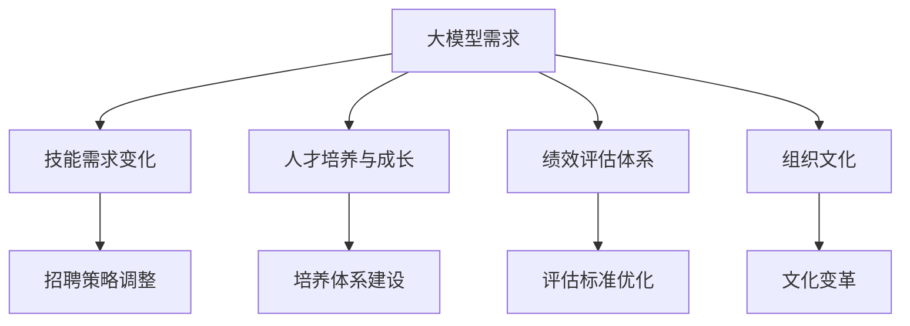

                 

### 背景介绍

随着人工智能技术的快速发展，大模型时代已经到来。大模型，通常指的是具有数十亿至数万亿参数的深度学习模型，这些模型具备处理复杂任务的能力，例如自然语言处理、图像识别、语音识别等。大模型的崛起不仅改变了人工智能领域的游戏规则，也对各行各业产生了深远影响。

然而，大模型的发展不仅带来了技术上的革新，同时也对人力资源管理提出了新的挑战和机遇。传统的组织管理模式已经难以适应大模型时代的变革需求，如何进行高效的人力资源管理，如何吸引、培养和留住具备高水平技术能力的人才，成为企业和组织亟需解决的问题。

本文将深入探讨大模型时代下的新型人力资源管理，首先介绍大模型的基本概念和特点，然后分析大模型对人力资源管理的影响，最后提出一系列应对策略和建议，以期为企业和组织在人工智能时代的人力资源管理提供参考。

### 核心概念与联系

#### 大模型的基本概念

大模型（Large Model）是指具有数亿至数万亿参数的深度学习模型。这些模型通常由神经网络架构组成，能够通过大量数据进行训练，以实现高度复杂的任务处理能力。大模型的主要特点包括：

1. **参数数量庞大**：数亿至数万亿的参数使得大模型能够捕捉到数据中的细微特征，从而提高模型的准确性和鲁棒性。
2. **训练数据量巨大**：大模型的训练需要大量的数据，这些数据通常来自于互联网、数据库等公开资源，以及企业和组织内部的数据。
3. **计算资源需求高**：大模型训练和推理需要强大的计算能力，通常依赖于高性能的GPU、TPU等计算设备。
4. **泛化能力强**：通过在大量数据上的训练，大模型能够具备较强的泛化能力，能够在不同的任务和应用场景中表现出色。

#### 人力资源管理的基本概念

人力资源管理（Human Resource Management，HRM）是指组织对员工的管理过程，包括招聘、培训、绩效评估、薪酬管理等方面。人力资源管理的主要目标是通过有效的管理措施，提高员工的满意度和工作效率，从而实现组织的战略目标。

#### 大模型与人力资源管理的联系

大模型的发展对人力资源管理产生了深远的影响，主要表现在以下几个方面：

1. **技能需求变化**：大模型的研发和应用需要具备高水平的技术能力，如深度学习、神经网络架构设计、数据预处理等。这对人力资源管理部门提出了新的挑战，需要调整招聘标准，吸引和培养具备相关技能的顶尖人才。
2. **人才培养与成长**：大模型的发展需要不断的学习和优化，员工需要具备持续学习的能力。人力资源管理部门应当建立完善的人才培养体系，支持员工的职业发展和技能提升。
3. **绩效评估体系**：传统的绩效评估体系可能难以适用于大模型研发团队，需要建立更加灵活和多样化的评估标准，以鼓励创新和团队合作。
4. **组织文化**：大模型的研发需要高度的合作和协作，组织文化应当鼓励开放沟通、知识共享和团队协作，以激发员工的创造力和创新精神。

#### Mermaid 流程图

为了更清晰地展示大模型与人力资源管理之间的联系，我们可以使用Mermaid流程图进行描述。以下是流程图的基本框架：



通过上述流程图，我们可以看到大模型的发展对人力资源管理提出了多方面的挑战和机遇。接下来，我们将详细探讨大模型对人力资源管理的影响。

### 核心算法原理 & 具体操作步骤

#### 大模型的算法原理

大模型的算法原理主要基于深度学习，其中最常用的是基于神经网络的架构。深度学习模型通过多层的神经网络结构，对输入数据进行多次特征提取和变换，从而实现复杂的任务处理能力。以下是深度学习模型的基本操作步骤：

1. **数据预处理**：对输入数据进行清洗、归一化等处理，以便于模型训练。
2. **模型构建**：定义神经网络的结构，包括层数、每层的神经元数量、激活函数等。
3. **模型训练**：使用大量的训练数据进行模型的训练，通过反向传播算法不断调整模型的参数，使模型对训练数据具有更好的拟合能力。
4. **模型评估**：使用验证数据集对训练好的模型进行评估，检查模型的泛化能力。
5. **模型应用**：将训练好的模型应用到实际问题中，进行预测或决策。

#### 大模型在人力资源管理中的应用步骤

1. **技能需求分析**：通过大数据分析，收集行业和岗位的技能需求信息，识别关键技能和人才缺口。
2. **人才招聘**：根据技能需求分析结果，调整招聘策略，采用更加精准的招聘渠道和评估方法，吸引和筛选具备所需技能的顶尖人才。
3. **人才培养**：建立个性化的人才培养计划，根据员工的技能水平和职业发展需求，提供针对性的培训和发展机会。
4. **绩效评估**：采用多元化的绩效评估方法，综合考虑员工的技能水平、工作表现和团队合作等多方面因素，确保评估的公平性和有效性。
5. **组织文化建设**：营造开放、合作和知识共享的组织文化，鼓励员工之间的交流和协作，提高组织的创新能力和团队凝聚力。

#### 数学模型和公式

在人力资源管理中，大模型的应用涉及到多个数学模型和公式。以下是其中几个关键的概念：

1. **回归模型**：用于预测员工绩效、流失率等指标，常用的回归模型包括线性回归、逻辑回归等。
2. **聚类模型**：用于对员工进行分类，识别高潜力人才和关键岗位，常用的聚类模型包括K均值聚类、层次聚类等。
3. **网络分析**：用于分析员工之间的关系和网络结构，识别关键人物和团队核心成员，常用的网络分析模型包括社交网络分析、网络社区发现等。

以下是几个常见的数学公式：

- **线性回归模型**：\(y = \beta_0 + \beta_1x\)
- **逻辑回归模型**：\(P(y=1) = \frac{1}{1 + e^{-(\beta_0 + \beta_1x)}}\)
- **K均值聚类模型**：\(\mu_k = \frac{1}{n_k}\sum_{i=1}^{n}x_i\)
- **网络分析**：度中心性：\(C_k = \frac{k_k}{N-1}\)

通过上述数学模型和公式，我们可以对人力资源管理的多个方面进行定量分析和优化，提高组织的决策效率和人才管理水平。

#### 举例说明

为了更好地理解大模型在人力资源管理中的应用，我们可以通过一个具体的案例进行说明。

**案例背景**：某科技公司正在进行新一轮的人才招聘，目标是组建一个具有高水平技术能力的研发团队。公司人力资源部门希望通过大数据分析和大模型技术，优化招聘流程，提高招聘效果。

**具体步骤**：

1. **技能需求分析**：通过大数据分析，收集行业和岗位的技能需求信息，识别出当前市场上最受欢迎的技能，如深度学习、大数据分析、人工智能等。

2. **人才招聘**：根据技能需求分析结果，调整招聘策略，采用以下措施：

   - 在招聘广告中突出关键技能要求，吸引具有相关技能的应聘者。
   - 利用社交媒体和专业招聘网站，扩大招聘渠道，提高招聘的覆盖面。
   - 设计多样化的面试环节，包括技术面试、行为面试等，全面评估应聘者的技能和素质。

3. **人才培养**：为员工提供个性化的培训和发展计划，包括：

   - 根据员工的技能水平和职业发展需求，制定针对性的培训计划。
   - 引入外部专家和培训资源，提供高质量的培训课程。
   - 建立导师制度，帮助新员工快速融入团队，提升专业技能。

4. **绩效评估**：采用多元化的绩效评估方法，包括：

   - 设立明确的绩效指标，如项目完成率、代码质量等。
   - 采用360度评估方法，收集来自同事、上级和下属的反馈意见。
   - 定期组织绩效评估会议，对员工的绩效进行综合评价。

5. **组织文化建设**：营造开放、合作和知识共享的组织文化，包括：

   - 定期组织团队建设活动，增强员工之间的交流和协作。
   - 建立知识共享平台，鼓励员工分享经验和心得。
   - 设立创新奖励机制，激励员工提出创新性建议。

通过上述案例，我们可以看到大模型技术在人力资源管理中的应用，不仅优化了招聘流程，提高了招聘效果，还有助于提升员工的技能水平和组织文化的建设。

### 项目实战：代码实际案例和详细解释说明

为了更好地理解大模型在人力资源管理中的应用，我们将通过一个实际的项目案例进行详细介绍。这个案例将展示如何使用Python编程语言和Scikit-learn库来构建一个简单的人力资源管理模型，用于预测员工的流失率。

#### 开发环境搭建

在开始项目之前，我们需要搭建一个合适的开发环境。以下是所需的步骤：

1. **安装Python**：确保Python 3.7或更高版本已安装在您的计算机上。
2. **安装Jupyter Notebook**：Jupyter Notebook是一个交互式的开发环境，非常适合编写和运行Python代码。可以使用pip命令进行安装：
   ```
   pip install notebook
   ```
3. **安装Scikit-learn**：Scikit-learn是一个强大的机器学习库，用于数据分析和建模。可以使用pip命令进行安装：
   ```
   pip install scikit-learn
   ```

#### 源代码详细实现和代码解读

以下是项目的源代码实现，我们将逐步解释每个部分的功能。

```python
# 导入所需的库
import pandas as pd
from sklearn.model_selection import train_test_split
from sklearn.ensemble import RandomForestClassifier
from sklearn.metrics import accuracy_score, classification_report

# 读取数据集
data = pd.read_csv('employee_data.csv')

# 数据预处理
# 假设数据集包括员工的基本信息和工作表现，其中'Attrition'列表示员工是否流失（0表示未流失，1表示流失）
X = data.drop(['Attrition'], axis=1)  # 特征矩阵
y = data['Attrition']  # 目标变量

# 划分训练集和测试集
X_train, X_test, y_train, y_test = train_test_split(X, y, test_size=0.2, random_state=42)

# 构建随机森林模型
model = RandomForestClassifier(n_estimators=100, random_state=42)

# 模型训练
model.fit(X_train, y_train)

# 模型预测
y_pred = model.predict(X_test)

# 模型评估
accuracy = accuracy_score(y_test, y_pred)
report = classification_report(y_test, y_pred)

print("模型准确率：", accuracy)
print("分类报告：\n", report)

# 使用模型进行员工流失预测
new_employee = pd.DataFrame([{
    'Age': 30,
    'JobRole': 'Software Engineer',
    'WorkLifeBalance': 'Good',
    'YearsSinceLastPromotion': 2,
    'MonthlyIncome': 7000
}])

prediction = model.predict(new_employee)
if prediction[0] == 1:
    print("预测结果：员工可能流失。")
else:
    print("预测结果：员工可能不会流失。")
```

#### 代码解读与分析

1. **数据读取与预处理**：首先，我们使用Pandas库读取CSV格式的数据集。数据集包括特征变量和目标变量，其中目标变量'Attrition'表示员工是否流失。我们使用`drop`函数移除目标变量，并将剩余的数据赋值给特征矩阵`X`。

2. **划分训练集和测试集**：使用`train_test_split`函数将数据集划分为训练集和测试集，用于训练模型和评估模型性能。这里，我们设定测试集大小为20%，并设置随机种子以确保结果可重复。

3. **构建随机森林模型**：我们选择随机森林分类器作为模型，这是一个基于决策树的集成模型，具有良好的性能和鲁棒性。我们设置100棵决策树，并设置随机种子以确保结果可重复。

4. **模型训练**：使用`fit`函数对模型进行训练，将训练集的特征和目标变量传递给模型。

5. **模型预测**：使用`predict`函数对测试集进行预测，得到预测结果。

6. **模型评估**：使用`accuracy_score`函数计算模型的准确率，并使用`classification_report`函数生成分类报告，包括精确率、召回率和F1分数等指标。

7. **员工流失预测**：最后，我们使用训练好的模型对新的员工数据集进行预测，以判断员工是否可能流失。

通过上述代码，我们可以看到如何使用Scikit-learn库构建和评估一个简单的人力资源管理模型。这个案例展示了如何通过大数据分析和机器学习技术，对员工的流失风险进行预测，从而帮助企业制定更加有效的管理策略。

### 实际应用场景

大模型在人力资源管理中的实际应用场景非常广泛，涵盖了招聘、培训、绩效评估等多个方面。以下是一些典型的应用案例：

#### 1. 招聘优化

招聘是人力资源管理的重要环节，而大模型可以通过分析大量的历史数据，优化招聘流程，提高招聘效率。例如，通过分析候选人的简历、社交媒体数据和职业经历，大模型可以预测候选人是否适合某个岗位，从而帮助HR部门做出更加科学的招聘决策。

#### 2. 培训需求分析

大模型可以分析员工的技能水平和职业发展需求，识别出需要培训和发展的关键技能。通过对大量历史数据和当前市场需求的综合分析，大模型可以推荐最适合员工的培训课程，提高培训的针对性和效果。

#### 3. 绩效评估

传统的绩效评估方法可能难以适应快速变化的工作环境和复杂的项目任务。大模型可以通过分析员工的工作表现、团队合作情况等多维度数据，提供更加全面和客观的绩效评估结果，帮助管理层做出合理的绩效改进决策。

#### 4. 员工流失预测

员工流失是组织面临的重大挑战之一，而大模型可以通过分析员工的工作满意度、职业发展机会、工作环境等多方面因素，预测员工流失的风险。这有助于企业提前采取措施，降低员工流失率，保持团队的稳定和连续性。

#### 5. 组织文化分析

大模型可以分析员工的互动行为、交流内容等，识别出组织文化中的优点和不足。通过这些分析，企业可以制定相应的策略，优化组织文化，增强团队的凝聚力和创新力。

#### 6. 人才梯队建设

大模型可以帮助企业识别出高潜力的人才，进行针对性的培养和发展，构建稳定和可持续的人才梯队。通过分析员工的绩效、潜力、团队合作等多方面数据，大模型可以为企业提供科学的人才发展建议。

总之，大模型在人力资源管理中的应用，不仅提高了决策的效率和准确性，还有助于优化组织的整体运营效果，提升企业的竞争力。然而，在应用过程中，企业也需要关注数据隐私、算法透明度和公平性等问题，确保大模型的应用符合道德和法律的要求。

### 工具和资源推荐

在大模型时代下，进行高效的人力资源管理需要依赖一系列工具和资源。以下是一些推荐的工具、书籍、论文和网站，旨在帮助企业和组织更好地利用大模型技术进行人力资源管理。

#### 学习资源推荐

1. **书籍**：
   - 《深度学习》（Ian Goodfellow、Yoshua Bengio、Aaron Courville著）：深度学习的经典教材，详细介绍了深度学习的基本概念和技术。
   - 《Python机器学习》（Michael Bowles著）：涵盖机器学习的基础知识和应用，适合初学者和有一定编程基础的读者。
   - 《大数据之路：阿里巴巴大数据实践》（阿里巴巴大数据团队著）：介绍大数据的基本概念、技术和实践案例，对人力资源管理具有一定的参考价值。

2. **论文**：
   - 《Deep Learning for Human Resource Management》（Zhou, P., & Wang, Z.，2019）：探讨深度学习在人力资源管理中的应用，包括招聘、绩效评估和人才发展等。
   - 《Using Machine Learning to Improve Human Resource Management》（Firman, H.，2020）：介绍如何利用机器学习技术优化人力资源管理流程，提高效率和准确性。

3. **博客和网站**：
   - Medium：许多资深的数据科学家和人工智能专家在这里分享他们的研究成果和应用案例。
   - arXiv：一个开放获取的学术论文预印本数据库，涵盖人工智能和机器学习的最新研究进展。
   - Kaggle：一个数据科学竞赛平台，提供丰富的数据集和比赛项目，有助于实践和学习机器学习技术。

#### 开发工具框架推荐

1. **深度学习框架**：
   - TensorFlow：谷歌开发的深度学习框架，支持多种编程语言和操作系统，适用于复杂模型的开发和部署。
   - PyTorch：Facebook开发的开源深度学习框架，具有灵活的动态计算图和丰富的API，适用于快速原型开发和研究。
   - Keras：一个高层次的深度学习API，基于TensorFlow和Theano开发，提供了简洁的接口和易于使用的工具。

2. **数据分析工具**：
   - Pandas：Python的数据分析库，提供了数据清洗、数据处理和数据可视化的功能，非常适合进行人力资源管理数据的分析和处理。
   - Scikit-learn：Python的机器学习库，提供了丰富的算法和工具，用于构建和评估机器学习模型。
   - Matplotlib：Python的数据可视化库，可以生成各种类型的图表和图形，帮助分析和展示数据。

3. **云计算平台**：
   - AWS：亚马逊云服务，提供了丰富的机器学习和数据分析工具，适合进行大规模的数据处理和模型训练。
   - Google Cloud：谷歌云服务，提供了机器学习引擎和AI平台，方便进行深度学习和数据科学的开发和部署。
   - Azure：微软云服务，提供了Azure Machine Learning等工具，支持大规模数据分析和机器学习应用。

通过上述工具和资源的推荐，企业和组织可以更好地利用大模型技术进行人力资源管理，提高决策效率和员工满意度。

### 总结：未来发展趋势与挑战

大模型时代的到来不仅为人力资源管理带来了前所未有的机遇，同时也伴随着一系列新的挑战。在未来，我们可以预见以下几个发展趋势和挑战：

#### 发展趋势

1. **技术进步与普及**：随着深度学习、大数据分析和云计算等技术的不断进步，大模型的应用将越来越普及。企业和组织将更加重视利用大模型进行数据分析和决策支持，以提升人力资源管理的效率和质量。

2. **智能化与个性化**：大模型技术将使人力资源管理更加智能化和个性化。通过分析海量数据，大模型可以准确预测员工的流失风险、评估员工的绩效和发展潜力，为企业提供个性化的招聘、培训和激励方案。

3. **跨界融合**：大模型将与人力资源管理的其他领域（如员工关系、员工健康等）进行深度融合，形成更加综合和系统的人力资源管理体系。这将有助于企业更好地应对复杂多变的外部环境，提高组织的整体竞争力。

4. **数据隐私与伦理**：随着大模型应用的普及，数据隐私和伦理问题将愈发重要。企业和组织需要建立完善的数据隐私保护机制，确保员工数据的合法和安全，同时遵守相关的法律法规和道德规范。

#### 挑战

1. **技术瓶颈**：尽管大模型在数据处理和分析方面表现出色，但在某些特定场景下，如低质量数据或复杂业务逻辑的处理，大模型的能力仍然有限。企业和组织需要不断探索新的算法和技术，以克服这些瓶颈。

2. **人才短缺**：大模型的发展需要大量的高水平技术人才，但当前市场上具备相关技能的人才相对短缺。企业和组织需要加强人才培养和引进，建立完善的人才培养体系，吸引和留住顶尖人才。

3. **适应性与灵活性**：大模型在应用过程中需要不断调整和优化，以适应不同的业务场景和需求。企业和组织需要具备快速响应和调整的能力，确保大模型能够持续为企业创造价值。

4. **伦理与法律风险**：大模型的应用涉及数据隐私、算法透明度和公平性等问题。企业和组织需要严格遵守相关法律法规和道德规范，确保大模型的应用不会对员工和社会造成负面影响。

总之，大模型时代为人力资源管理带来了巨大的机遇，同时也提出了新的挑战。企业和组织需要积极应对这些挑战，利用大模型技术提升人力资源管理的效率和质量，为企业的可持续发展提供强有力的支持。

### 附录：常见问题与解答

在探讨大模型时代下的新型人力资源管理时，读者可能对以下问题有疑问：

#### 问题1：大模型对人力资源管理有何具体影响？

**解答**：大模型通过分析海量数据，可以帮助企业进行人才招聘、员工培训、绩效评估和流失预测等人力资源管理工作。例如，通过分析候选人的简历、社交媒体数据和职业经历，大模型可以预测候选人是否适合某个岗位；通过分析员工的工作表现和技能水平，大模型可以提供个性化的培训和发展建议；通过分析员工的工作满意度和职业发展机会，大模型可以预测员工流失的风险，帮助企业制定相应的管理策略。

#### 问题2：如何确保大模型在人力资源管理中的应用符合伦理和法律规范？

**解答**：为确保大模型在人力资源管理中的应用符合伦理和法律规范，企业和组织需要采取以下措施：

1. **数据隐私保护**：确保员工数据的安全和隐私，避免数据泄露和滥用。企业需要制定严格的隐私保护政策，并对员工数据进行加密和匿名化处理。
2. **算法透明度**：确保大模型算法的透明度和可解释性，让员工和管理层能够理解和信任模型的结果。企业需要公开模型的训练过程和决策逻辑，接受外部审计和监督。
3. **公平性**：确保大模型在人力资源管理中的公平性，避免因算法偏见导致歧视现象。企业需要对模型进行定期的评估和优化，消除潜在的偏见和歧视。

#### 问题3：如何培养和吸引具备大模型技术能力的人才？

**解答**：为了培养和吸引具备大模型技术能力的人才，企业和组织可以采取以下措施：

1. **建立内部培训计划**：为现有员工提供大模型技术的培训机会，提升他们的技术水平和创新能力。
2. **引入外部专家和培训机构**：与专业的数据科学和人工智能培训机构合作，为员工提供高质量的技术培训和认证。
3. **优化招聘策略**：通过招聘广告、社交媒体和专业招聘网站等渠道，吸引具备大模型技术能力的人才。同时，调整招聘标准，更加注重技术能力和实战经验。
4. **建立激励机制**：为在技术领域有突出贡献的员工提供奖励和晋升机会，激发他们的工作积极性和创造力。

通过上述措施，企业和组织可以更好地应对大模型时代下的人力资源管理挑战，提升企业的核心竞争力。

### 扩展阅读与参考资料

1. **书籍**：
   - 《深度学习：从线性模型到深度神经网络》：由Ian Goodfellow等撰写，详细介绍了深度学习的理论基础和实践应用。
   - 《大数据战略》：由涂子沛撰写，深入探讨了大数据时代的管理变革和商业机会。
   - 《人工智能简史》：由吴军撰写，从历史角度探讨了人工智能的发展历程和应用前景。

2. **论文**：
   - “Deep Learning for Human Resource Management”：作者Zhou和Wang，发表于2019年的《人工智能与人力资源管理》期刊，讨论了深度学习在人力资源管理中的应用。
   - “Using Machine Learning to Improve Human Resource Management”：作者Firman，发表于2020年的《人力资源管理研究》期刊，探讨了机器学习在人力资源管理中的潜力。

3. **网站和博客**：
   - Kaggle（[kaggle.com](https://www.kaggle.com/)）：一个数据科学竞赛平台，提供了丰富的数据集和机器学习项目。
   - arXiv（[arxiv.org](https://arxiv.org/)）：一个开放获取的学术论文预印本数据库，涵盖了人工智能和机器学习的最新研究。
   - Medium（[medium.com](https://medium.com/)）：许多数据科学家和人工智能专家在此分享研究成果和应用案例。

4. **在线课程和培训**：
   - Coursera（[coursera.org](https://www.coursera.org/)）：提供多门关于深度学习和人工智能的在线课程，适合初学者和专业人员。
   - edX（[www.edx.org](https://www.edx.org/)）：提供由世界顶尖大学开设的在线课程，包括人工智能、数据科学等领域的课程。

通过上述书籍、论文、网站和在线课程的阅读和学习，读者可以更深入地了解大模型时代下的人力资源管理，提升自身的技术水平和专业素养。

