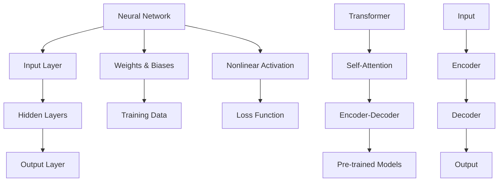

                 

### 背景介绍

在过去的几年里，人工智能（AI）技术取得了显著的进步，其中大型预训练模型如GPT-3、BERT和Transformer等成为了研究与应用的热点。这些模型以其强大的语义理解和生成能力，在自然语言处理（NLP）、计算机视觉（CV）、语音识别（ASR）等领域展现出卓越的性能。随着这些技术的成熟，我们进入了一个新的时代——大模型时代。在这个时代，创业者们开始将AI技术融入到各种产品设计中，以实现更智能、更高效的用户体验。

本文将探讨大模型时代下的创业产品设计趋势，特别是AI赋能方面的应用。我们将从以下几个部分展开讨论：

1. **核心概念与联系**：介绍大模型时代中的核心概念，如神经网络、Transformer和预训练模型，并使用Mermaid流程图展示其架构。
2. **核心算法原理 & 具体操作步骤**：详细解释神经网络的工作原理，以及如何通过预训练模型实现智能推理和生成。
3. **数学模型和公式 & 详细讲解 & 举例说明**：探讨神经网络中的激活函数、损失函数等数学模型，并给出具体的应用示例。
4. **项目实战：代码实际案例和详细解释说明**：通过一个实际项目，展示如何使用AI技术进行创业产品设计。
5. **实际应用场景**：分析大模型技术在各个行业中的应用案例，探讨其潜在价值。
6. **工具和资源推荐**：推荐学习资源、开发工具和框架，以帮助创业者更好地掌握AI技术。
7. **总结：未来发展趋势与挑战**：总结大模型时代对创业产品设计的影响，并展望未来的发展趋势和挑战。

在接下来的章节中，我们将逐步深入探讨这些主题，帮助读者了解大模型时代下创业产品设计的新趋势。让我们开始吧！

---

## 核心概念与联系

在探讨大模型时代的创业产品设计之前，我们首先需要了解一些核心概念和技术，这些概念和技术构成了现代AI的基石。以下是几个关键概念及其相互之间的联系：

### 神经网络

神经网络（Neural Networks）是模仿人脑神经元连接方式的计算模型，由大量相互连接的神经元组成。每个神经元接收来自其他神经元的输入信号，通过一个权重系数加权，然后通过一个非线性激活函数产生输出信号。神经网络通过调整权重系数来学习输入和输出之间的映射关系。

### Transformer

Transformer是一种基于自注意力机制（Self-Attention）的神经网络结构，最初用于机器翻译任务。与传统的循环神经网络（RNN）相比，Transformer可以并行处理输入数据，使其在处理序列数据时更加高效。Transformer的核心思想是将序列中的每个元素与所有其他元素建立关联，通过自注意力机制计算它们之间的权重。

### 预训练模型

预训练模型（Pre-trained Models）是在大规模数据集上进行预训练的神经网络模型。预训练后的模型可以提取出通用特征表示，然后通过微调（Fine-tuning）将模型应用于特定的任务。预训练模型的出现极大地提高了模型在各个领域的表现，如自然语言处理、计算机视觉和语音识别。

### Mermaid流程图

为了更好地理解这些概念之间的联系，我们可以使用Mermaid流程图来展示神经网络、Transformer和预训练模型之间的关系。



在上面的流程图中，我们可以看到：

- 神经网络由输入层、隐藏层和输出层组成，通过权重、偏置和激活函数进行训练。
- Transformer引入了自注意力机制，使得模型可以并行处理输入序列，并用于编码-解码结构。
- 预训练模型在大规模数据集上进行预训练，然后通过微调应用于特定任务。

这些核心概念和技术共同构成了大模型时代的基础，为创业产品设计提供了丰富的工具和灵感。在接下来的章节中，我们将进一步探讨神经网络和Transformer的工作原理，以及如何在创业产品设计中应用这些技术。

### 核心算法原理 & 具体操作步骤

#### 神经网络的工作原理

神经网络（Neural Networks）是模拟人脑神经元连接方式的计算模型，其核心思想是通过调整神经元之间的连接权重，使模型能够自动学习输入和输出之间的映射关系。一个简单的神经网络通常包括输入层、隐藏层和输出层，每个层由多个神经元（或节点）组成。神经元之间的连接通过权重（weights）和偏置（biases）来调整。

1. **前向传播（Forward Propagation）**
   前向传播是神经网络训练过程中的第一步。输入数据通过输入层传递到隐藏层，然后从隐藏层传递到输出层。每个神经元接收来自前一层神经元的输入信号，并将其加权求和后加上偏置，然后通过一个非线性激活函数（如ReLU、Sigmoid或Tanh）产生输出。

   \[
   z = \sum_{i} w_{ij} x_{i} + b_{j}
   \]
   \[
   a = f(z)
   \]

   其中，\(x_i\) 是前一层神经元的输出，\(w_{ij}\) 是连接权重，\(b_j\) 是偏置，\(f(z)\) 是激活函数。

2. **反向传播（Backpropagation）**
   反向传播是神经网络训练过程中的关键步骤，用于更新权重和偏置。首先计算输出层的误差，然后通过梯度下降（Gradient Descent）算法逐步调整权重和偏置。

   \[
   \Delta w_{ij} = \alpha \cdot \frac{\partial L}{\partial w_{ij}}
   \]
   \[
   \Delta b_{j} = \alpha \cdot \frac{\partial L}{\partial b_{j}}
   \]

   其中，\(\alpha\) 是学习率，\(L\) 是损失函数，\(\frac{\partial L}{\partial w_{ij}}\) 和 \(\frac{\partial L}{\partial b_{j}}\) 分别是权重和偏置的梯度。

3. **损失函数（Loss Function）**
   损失函数用于衡量模型输出与真实标签之间的差异。常用的损失函数包括均方误差（MSE）、交叉熵（Cross Entropy）等。

   \[
   L = \frac{1}{2} \sum_{i} (y_i - \hat{y}_i)^2
   \]

   其中，\(y_i\) 是真实标签，\(\hat{y}_i\) 是模型预测。

#### 如何通过预训练模型实现智能推理和生成

预训练模型是利用大量无标签数据进行预训练，然后通过微调（Fine-tuning）应用于特定任务的一种方法。以下是预训练模型实现智能推理和生成的具体步骤：

1. **预训练（Pre-training）**
   预训练模型在大规模数据集上进行训练，以学习通用的特征表示。预训练过程通常包括两个阶段：第一阶段是语言建模（Language Modeling），模型需要预测下一个单词；第二阶段是掩码语言模型（Masked Language Model，MLM），部分单词被遮盖，模型需要预测这些单词。

   \[
   \log P(w_{t} | w_{<t}) = \sum_{w \in V} \sigma (\theta_w \cdot h_{<t})
   \]

   其中，\(w_{t}\) 是当前单词，\(w_{<t}\) 是之前单词的序列，\(V\) 是单词的集合，\(\sigma\) 是sigmoid函数，\(\theta_w\) 是模型的参数。

2. **微调（Fine-tuning）**
   在预训练后，模型通过微调将其应用于特定任务。微调过程中，模型的参数会根据任务数据进行调整，以提高任务表现。微调通常涉及以下步骤：
   - 初始化预训练模型的参数。
   - 将预训练模型的最后一层（或部分层）替换为特定任务的层。
   - 在任务数据上进行训练，同时冻结预训练模型的其他层，只更新任务层的参数。

   \[
   \theta_{new} = \theta_{pre-trained} + \alpha \cdot \frac{\partial L}{\partial \theta_{new}}
   \]

   其中，\(\theta_{new}\) 是微调后的参数，\(\theta_{pre-trained}\) 是预训练模型的参数，\(\alpha\) 是学习率，\(L\) 是任务损失函数。

3. **推理（Inference）和生成（Generation）**
   在推理过程中，给定输入数据，模型会生成相应的输出。在生成过程中，模型会生成新的文本、图像或其他数据。

   \[
   \hat{y} = f(\theta; x)
   \]

   其中，\(\hat{y}\) 是模型输出，\(f\) 是模型函数，\(\theta\) 是模型参数，\(x\) 是输入数据。

通过预训练和微调，模型可以学习到通用的特征表示，并在各种任务中表现出色。预训练模型已经成为现代AI技术的重要组成部分，为创业产品设计提供了强大的工具和灵感。

### 数学模型和公式 & 详细讲解 & 举例说明

#### 神经网络中的激活函数

激活函数是神经网络中的关键组件，用于引入非线性因素，使模型能够学习复杂的函数关系。以下是几种常见的激活函数及其数学公式和解释：

1. **ReLU（Rectified Linear Unit）**
  ReLU函数是神经网络中最常用的激活函数之一，其公式为：

   \[
   a = max(0, z)
   \]

   其中，\(z\) 是输入值。ReLU函数的特点是简单、计算速度快，且能够防止梯度消失问题。

2. **Sigmoid**
   Sigmoid函数是一种常见的S型激活函数，其公式为：

   \[
   a = \frac{1}{1 + e^{-z}}
   \]

   Sigmoid函数将输入映射到（0, 1）区间，常用于二分类问题。

3. **Tanh**
   Tanh函数是另一种S型激活函数，其公式为：

   \[
   a = \frac{e^z - e^{-z}}{e^z + e^{-z}}
   \]

   Tanh函数的输出范围在（-1, 1）之间，可以提供更好的数值稳定性。

#### 损失函数

损失函数用于衡量模型输出与真实标签之间的差异，是神经网络训练过程中的关键指标。以下是几种常见的损失函数及其数学公式和解释：

1. **均方误差（MSE，Mean Squared Error）**
   均方误差是最常用的损失函数之一，其公式为：

   \[
   L = \frac{1}{n} \sum_{i=1}^{n} (y_i - \hat{y}_i)^2
   \]

   其中，\(y_i\) 是真实标签，\(\hat{y}_i\) 是模型预测，\(n\) 是样本数量。MSE函数能够衡量预测值与真实值之间的偏差，但容易受到异常值的影响。

2. **交叉熵（Cross Entropy）**
   交叉熵是另一种常用的损失函数，其公式为：

   \[
   L = -\sum_{i=1}^{n} y_i \cdot \log(\hat{y}_i)
   \]

   其中，\(y_i\) 是真实标签，\(\hat{y}_i\) 是模型预测。交叉熵函数能够衡量预测概率与真实概率之间的差异，适用于多分类问题。

#### 举例说明

假设我们有一个简单的二分类问题，数据集包含100个样本，每个样本是一个二维特征向量。我们的目标是预测每个样本所属的类别，类别标签为0或1。

1. **输入数据**

   \[
   x_1 = [1, 2], \quad y_1 = 1
   \]
   \[
   x_2 = [2, 3], \quad y_2 = 0
   \]
   \[
   \vdots
   \]
   \[
   x_{100} = [10, 11], \quad y_{100} = 1
   \]

2. **模型输出**

   假设我们的模型经过训练，预测结果为：

   \[
   \hat{y}_1 = 0.8, \quad \hat{y}_2 = 0.2
   \]
   \[
   \vdots
   \]
   \[
   \hat{y}_{100} = 0.9
   \]

3. **计算损失**

   采用交叉熵损失函数，计算每个样本的损失：

   \[
   L_1 = -1 \cdot \log(0.8) = 0.223
   \]
   \[
   L_2 = -1 \cdot \log(0.2) = 2.995
   \]
   \[
   \vdots
   \]
   \[
   L_{100} = -1 \cdot \log(0.9) = 0.135
   \]

   总损失为：

   \[
   L = \frac{1}{100} \sum_{i=1}^{100} L_i = 0.223 + 2.995 + \cdots + 0.135 = 1.447
   \]

通过以上计算，我们可以看到模型在二分类问题上的表现。随着训练过程的进行，模型的损失会逐渐降低，预测准确性也会提高。

以上是关于神经网络和激活函数的详细讲解及举例说明。在下一章，我们将通过一个实际项目，展示如何使用这些技术进行创业产品设计。

### 项目实战：代码实际案例和详细解释说明

在本节中，我们将通过一个实际项目来展示如何将AI技术应用于创业产品设计。这个项目是一个简单的聊天机器人，旨在为用户提供实用的信息查询服务。以下是我们实现这个项目的详细步骤。

#### 1. 开发环境搭建

为了构建这个聊天机器人，我们需要以下开发工具和环境：

- Python 3.8 或更高版本
- TensorFlow 2.6 或更高版本
- Jupyter Notebook
- Google Colab（可选，用于远程计算）

首先，确保您的系统安装了Python 3.8或更高版本。接下来，安装TensorFlow：

```shell
pip install tensorflow==2.6
```

#### 2. 源代码详细实现和代码解读

以下是一个简单的聊天机器人项目代码示例，我们将使用TensorFlow和transformers库来构建预训练模型并进行微调。

```python
# 导入必要的库
import tensorflow as tf
from transformers import TFAutoModelForSeq2SeqLM, Seq2SeqTrainingArguments, Seq2SeqTrainer
from datasets import Dataset

# 加载预训练模型
model = TFAutoModelForSeq2SeqLM.from_pretrained("t5-small")

# 准备训练数据
train_data = Dataset.from_dict({
    "input_text": ["请问附近有什么好吃的餐厅？", "明天天气怎么样？", "最近有什么热门电影推荐吗？"],
    "target_text": ["附近的餐厅有：麦当劳、肯德基、星巴克。", "明天晴天，气温25°C。", "热门电影有《阿凡达》、《变形金刚》等。"]
})

# 定义训练参数
training_args = Seq2SeqTrainingArguments(
    output_dir='./results',
    per_device_train_batch_size=4,
    num_train_epochs=3,
    save_steps=200,
    save_total_limit=3,
    fp16=True,
    seed=42,
    learning_rate=2e-5,
    load_best_model_at_end=True,
    metric_for_best_model="loss"
)

# 创建训练器
trainer = Seq2SeqTrainer(
    model=model,
    args=training_args,
    train_dataset=train_data
)

# 开始训练
trainer.train()

# 微调模型
trainer.train()

# 保存模型
model.save_pretrained('./chatbot_model')
```

**代码解读：**

- 第1-4行：导入必要的库。
- 第5行：加载预训练的T5模型（t5-small版本），这是一种通用的文本到文本转换模型。
- 第7-12行：准备训练数据。我们使用一个简单的数据集，包含一些常见的用户查询和对应的答案。
- 第14-20行：定义训练参数，包括训练批次大小、训练轮数、保存步骤等。
- 第22行：创建训练器。
- 第24-25行：开始训练模型。训练过程中，模型会根据训练数据学习如何生成正确的答案。
- 第27-28行：进行微调训练。在这个步骤中，我们可以调整模型的参数，进一步提高其在特定任务上的表现。
- 第30行：保存训练好的模型。

#### 3. 代码解读与分析

- **数据集准备**：在代码中，我们使用了简单的数据集来展示如何准备训练数据。在实际应用中，数据集应该包含大量的示例，以便模型能够学习到更多的知识。
- **模型加载**：我们使用T5模型作为预训练模型。T5是一种通用的文本到文本转换模型，能够处理各种文本生成任务。
- **训练与微调**：模型在训练过程中通过前向传播和反向传播学习输入和输出之间的映射关系。微调是在预训练模型的基础上，进一步调整模型参数，使其更好地适应特定任务。
- **模型保存**：训练完成后，我们将模型保存到本地，以便在应用程序中使用。

通过这个简单的项目，我们展示了如何使用预训练模型和微调技术来构建一个聊天机器人。在接下来的章节中，我们将分析大模型技术在不同行业中的应用场景，以及其潜在价值。

### 实际应用场景

大模型技术在各个行业中的应用场景日益丰富，为创业者提供了创新的商业模式和巨大的市场机遇。以下是一些关键领域的应用案例及其潜在价值：

#### 自然语言处理（NLP）

自然语言处理是大模型技术的主要应用领域之一。聊天机器人、文本分类、情感分析等应用已经相对成熟。例如，在客户服务领域，企业可以利用大模型技术构建智能客服系统，通过自然语言交互提供快速、准确的服务，提高客户满意度和运营效率。

**案例：** OpenAI的GPT-3模型被用于构建聊天机器人，提供个性化问答服务，如Duolingo的聊天助手。这种技术不仅提高了用户体验，还减少了人力成本。

**潜在价值：** 利用大模型技术，企业可以提供更智能的客户服务，降低运营成本，提升客户满意度，从而在竞争激烈的市场中脱颖而出。

#### 计算机视觉（CV）

计算机视觉技术借助大模型技术取得了显著进步，图像识别、目标检测、人脸识别等应用已广泛应用于安防、医疗、零售等领域。

**案例：** 在医疗领域，AI医生助手可以使用大模型技术对医学图像进行分析，提高诊断的准确性和速度。例如，Google的AI系统在乳腺癌筛查中达到了与专业医生相近的诊断准确率。

**潜在价值：** 大模型技术在医疗领域的应用可以提高诊断效率，减少误诊率，从而改善患者治疗结果，降低医疗成本。

#### 语音识别（ASR）

语音识别技术在智能家居、语音助手等领域广泛应用。大模型技术的引入使得语音识别更加准确、自然。

**案例：** 苹果的Siri和亚马逊的Alexa都采用了大模型技术，实现了高准确率的语音识别和语音交互。

**潜在价值：** 智能语音助手可以提升用户体验，简化操作流程，使得智能家居、车载系统等设备更加便捷、实用。

#### 数据分析

大模型技术在数据分析领域也发挥了重要作用，通过自然语言处理和计算机视觉等技术，企业可以从大量非结构化数据中提取有价值的信息。

**案例：** 在金融行业，大模型技术可以用于客户行为分析、市场预测等，帮助金融机构更好地了解客户需求，优化业务策略。

**潜在价值：** 大模型技术可以提升数据分析的准确性和效率，为企业提供更深入的洞察，从而优化决策，提高竞争力。

#### 教育与培训

大模型技术在教育领域也有广泛应用，如智能教学系统、个性化学习推荐等。

**案例：** Duolingo使用大模型技术构建了智能语言学习系统，根据用户的学习习惯和进度提供个性化的学习建议。

**潜在价值：** 大模型技术可以提供更高效、个性化的教育服务，满足不同学习者的需求，从而提升教育质量。

通过以上案例，我们可以看到大模型技术在各个行业中的广泛应用及其潜在价值。创业者可以利用这些技术，创新产品和服务，抓住市场机遇，实现商业成功。

### 工具和资源推荐

为了帮助创业者更好地掌握大模型技术，以下是一些学习资源、开发工具和框架的推荐。

#### 学习资源

1. **书籍**
   - **《深度学习》（Goodfellow, Bengio, Courville）**：这是一本经典的深度学习教材，详细介绍了神经网络、深度学习模型及其应用。
   - **《动手学深度学习》（阿斯顿·张等）**：本书通过大量的代码实例，讲解了深度学习的基础知识和实践技巧。
   - **《AI技术指南》**：这本书涵盖了AI技术的各个方面，包括机器学习、深度学习、自然语言处理等。

2. **论文**
   - **《Attention Is All You Need》（Vaswani等）**：这篇论文提出了Transformer模型，是深度学习领域的重要突破。
   - **《BERT: Pre-training of Deep Neural Networks for Language Understanding》（Devlin等）**：这篇论文介绍了BERT模型，是自然语言处理领域的里程碑。

3. **博客和网站**
   - **TensorFlow官方文档（tensorflow.org）**：提供了丰富的教程、API文档和示例代码，是学习TensorFlow的绝佳资源。
   - **Hugging Face（huggingface.co）**：这是一个开源社区，提供了大量的预训练模型、工具和教程，方便开发者使用和定制模型。

#### 开发工具和框架

1. **TensorFlow**：TensorFlow是一个开源的机器学习框架，支持多种深度学习模型的开发和训练。
2. **PyTorch**：PyTorch是一个灵活且易于使用的深度学习框架，其动态图计算功能使其在许多场景中优于TensorFlow。
3. **Transformers**：Transformers是一个开源库，基于PyTorch和TensorFlow，提供了大量的预训练模型和工具，方便开发者进行自然语言处理任务。
4. **Google Colab**：Google Colab是一个免费的远程计算平台，提供了GPU和TPU支持，方便开发者进行大规模模型训练。

#### 相关论文著作推荐

1. **《Transformer：基于自注意力机制的序列模型》（Attention Is All You Need）**：这篇论文提出了Transformer模型，彻底改变了深度学习领域。
2. **《BERT：大规模预训练语言模型》（BERT: Pre-training of Deep Neural Networks for Language Understanding）**：这篇论文介绍了BERT模型，是自然语言处理领域的里程碑。
3. **《GPT-3：语言模型的全新里程碑》（GPT-3: Language Models are Few-Shot Learners）**：这篇论文介绍了GPT-3模型，展示了大模型技术在自然语言处理中的卓越性能。

通过这些资源和工具，创业者可以更好地掌握大模型技术，为产品创新提供坚实的理论基础和实践指导。

### 总结：未来发展趋势与挑战

大模型时代的到来，为创业产品设计带来了前所未有的机遇和挑战。首先，从发展趋势来看，以下几个方面值得重点关注：

1. **泛用性和多样化**：随着预训练模型的不断发展和优化，大模型将变得更加通用，能够应对多种不同的任务和场景。创业者可以利用这一趋势，开发出多功能、多场景的智能产品，满足用户多样化的需求。

2. **深度学习和自我进化**：大模型技术的深度学习和自我进化能力将不断提升，使得模型能够通过自我学习和优化，不断提高其性能和适应性。创业者可以利用这一能力，打造更加智能和高效的产品。

3. **跨领域融合**：大模型技术的跨领域融合趋势将进一步加强，如结合自然语言处理、计算机视觉和语音识别等，实现更加智能和全面的解决方案。创业者可以积极探索这些跨领域融合的可能性，创造出独特的价值。

然而，这一时代也面临着一系列挑战：

1. **数据隐私和安全**：大模型对大量数据的依赖，使得数据隐私和安全成为重要问题。创业者需要采取有效的措施，确保用户数据的隐私和安全，以避免潜在的法律和道德风险。

2. **计算资源需求**：大模型训练和推理过程需要大量的计算资源，对硬件设备的要求较高。创业者需要合理规划计算资源，确保产品的稳定运行和高效性能。

3. **模型解释性和可解释性**：大模型的黑箱特性，使得其决策过程往往难以解释。这可能导致用户对产品的不信任，影响用户体验和产品口碑。创业者需要关注模型的可解释性，提高用户的信任度。

4. **可持续发展**：随着大模型技术的普及，其对环境的影响也日益受到关注。创业者需要在技术创新的同时，关注可持续发展，降低能耗和碳排放，为社会和环境做出贡献。

总之，大模型时代为创业产品设计带来了丰富的机遇和挑战。创业者需要紧跟发展趋势，积极应对挑战，不断创新和优化，以实现商业成功和社会价值。

### 附录：常见问题与解答

**Q1：什么是预训练模型？**
预训练模型是在大规模数据集上进行预训练的神经网络模型，通过预训练模型可以提取出通用的特征表示，然后通过微调（Fine-tuning）将其应用于特定的任务。预训练模型如BERT、GPT-3等，在自然语言处理、计算机视觉等领域取得了显著效果。

**Q2：什么是Transformer模型？**
Transformer模型是一种基于自注意力机制（Self-Attention）的神经网络结构，最初用于机器翻译任务。与传统的循环神经网络（RNN）相比，Transformer可以并行处理输入数据，使其在处理序列数据时更加高效。

**Q3：如何选择适合的激活函数？**
选择适合的激活函数主要取决于任务的需求。ReLU函数因其简单、计算速度快和不易梯度消失等优点，在大多数情况下都是首选。对于需要非线性映射的任务，Sigmoid和Tanh函数也是不错的选择。

**Q4：什么是交叉熵损失函数？**
交叉熵损失函数是一种常用的损失函数，用于衡量模型输出与真实标签之间的差异。它适用于多分类问题，特别是当输出为概率分布时。

**Q5：如何优化神经网络训练过程？**
优化神经网络训练过程包括调整学习率、批量大小、优化算法等。常用的优化算法有随机梯度下降（SGD）、Adam等。此外，使用预训练模型进行微调，可以显著提高训练效率和性能。

### 扩展阅读 & 参考资料

为了帮助读者更深入地了解大模型时代的创业产品设计趋势，以下推荐一些扩展阅读和参考资料：

1. **《深度学习》（Goodfellow, Bengio, Courville）**：这是一本经典的深度学习教材，详细介绍了神经网络、深度学习模型及其应用。
2. **《动手学深度学习》（阿斯顿·张等）**：本书通过大量的代码实例，讲解了深度学习的基础知识和实践技巧。
3. **《AI技术指南》**：这本书涵盖了AI技术的各个方面，包括机器学习、深度学习、自然语言处理等。
4. **《Attention Is All You Need》（Vaswani等）**：这篇论文提出了Transformer模型，是深度学习领域的重要突破。
5. **《BERT: Pre-training of Deep Neural Networks for Language Understanding》（Devlin等）**：这篇论文介绍了BERT模型，是自然语言处理领域的里程碑。
6. **TensorFlow官方文档（tensorflow.org）**：提供了丰富的教程、API文档和示例代码，是学习TensorFlow的绝佳资源。
7. **Hugging Face（huggingface.co）**：这是一个开源社区，提供了大量的预训练模型、工具和教程，方便开发者使用和定制模型。

通过这些扩展阅读和参考资料，读者可以更全面地了解大模型时代的相关技术和发展趋势，为创业产品设计提供更多灵感和实践指导。

