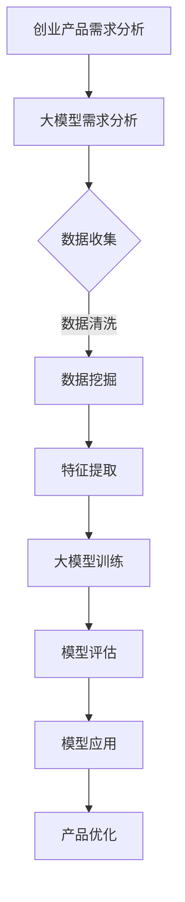

                 

# 大模型时代的创业产品设计：AI 驱动的转型

## 摘要

本文旨在探讨大模型时代下创业产品设计的关键要素，以及如何利用人工智能技术实现业务的转型。首先，我们将介绍大模型的基本概念和当前的发展趋势，然后分析其在创业产品中的应用。接着，文章将深入探讨大模型背后的核心算法原理，以及如何将这些算法应用于创业产品的具体操作步骤。随后，我们将讨论数学模型和公式在大模型中的应用，并给出实例说明。接下来，通过实际项目实战，我们将展示如何搭建开发环境、实现源代码、并进行代码解读与分析。最后，文章将讨论大模型在不同应用场景中的实际应用，推荐相关工具和资源，并总结未来发展趋势与挑战。本文的目标是为创业者在人工智能时代提供有价值的指导和启示。

## 1. 背景介绍

### 大模型时代的来临

近年来，随着计算能力的提升、数据量的爆炸性增长和深度学习算法的突破，人工智能技术取得了飞速发展。大模型（Large Models）应运而生，成为人工智能领域的研究热点。大模型是指具有数亿甚至数十亿参数的神经网络模型，它们可以通过学习海量数据来提取特征和模式，从而实现各种复杂的任务，如图像识别、自然语言处理、语音识别等。

大模型的兴起不仅改变了传统的人工智能应用模式，也推动了创业产品的创新。创业者可以利用大模型的技术优势，快速实现产品原型，降低研发成本，提高效率。同时，大模型的应用也带来了新的商业模式和机遇，为创业公司提供了广阔的发展空间。

### 创业产品设计的重要性

创业产品设计是创业成功的关键环节。一个好的创业产品不仅要有独特的市场定位，还要满足用户需求，具备良好的用户体验。在人工智能时代，创业产品设计需要适应大模型技术的发展，将人工智能技术融入产品中，实现业务的智能化转型。

创业产品设计需要考虑以下几个方面：

1. **市场定位**：明确目标用户群体，了解用户需求和市场趋势。
2. **技术实现**：选择合适的人工智能技术，确保产品的技术可行性。
3. **用户体验**：注重产品的易用性和互动性，提升用户满意度。
4. **商业模式**：构建可持续的商业模式，实现盈利。
5. **风险管理**：识别潜在风险，制定相应的应对策略。

### AI驱动的转型

AI驱动的转型是指利用人工智能技术，对企业现有业务进行重构和创新，从而实现业务模式的升级。在创业领域，AI驱动的转型具有以下优势：

1. **提高效率**：人工智能技术可以自动化执行重复性任务，提高工作效率。
2. **降低成本**：通过优化流程和资源分配，降低运营成本。
3. **增强竞争力**：利用人工智能技术，提升产品的核心竞争力，开拓新市场。
4. **创新商业模式**：探索新的商业模式，实现业务增长。

创业公司通过AI驱动的转型，可以实现以下目标：

1. **快速迭代**：利用人工智能技术，快速迭代产品，缩短研发周期。
2. **精准营销**：通过数据分析和机器学习，实现精准营销，提高转化率。
3. **智能化服务**：利用人工智能技术，提供个性化、智能化的服务，提升用户体验。
4. **跨界合作**：与其他领域的企业进行合作，探索新的商业模式和机遇。

## 2. 核心概念与联系

### 大模型的基本概念

大模型是指具有数十亿参数的神经网络模型，其通过学习海量数据来提取特征和模式，从而实现复杂的任务。大模型通常采用深度学习算法，如Transformer、BERT等，其具有以下特点：

1. **参数量大**：大模型具有数十亿甚至更多的参数，可以捕捉数据中的复杂模式。
2. **计算复杂度高**：大模型的计算复杂度较高，需要大量的计算资源和时间。
3. **泛化能力强**：大模型可以通过学习海量数据，实现更好的泛化能力，适用于不同的任务。

### 创业产品设计与大模型的关系

创业产品设计需要考虑如何利用大模型技术，实现产品的智能化和业务转型。具体而言，大模型在创业产品设计中的应用体现在以下几个方面：

1. **需求分析**：利用大模型进行用户需求分析，识别潜在的用户需求和市场趋势。
2. **数据挖掘**：通过大模型对海量数据进行挖掘，提取有价值的信息，为产品优化提供依据。
3. **智能推荐**：利用大模型实现个性化推荐，提升用户体验和满意度。
4. **自动化决策**：利用大模型进行自动化决策，优化业务流程，提高效率。
5. **风险预测**：利用大模型进行风险预测，为企业的风险管理提供支持。

### Mermaid 流程图

下面是创业产品设计与大模型关系的一个简单 Mermaid 流程图：



在这个流程图中，创业产品需求分析是大模型应用的基础，通过数据收集、数据清洗、数据挖掘、特征提取等步骤，将用户需求转化为可量化的数据。然后，利用大模型进行训练和评估，最后将训练好的模型应用于产品优化，实现业务的智能化和转型。

## 3. 核心算法原理 & 具体操作步骤

### 3.1 大模型的基本原理

大模型的基本原理是基于深度学习，特别是基于神经网络的结构。深度学习是一种机器学习的方法，其通过构建多层神经网络，对输入数据进行特征提取和模式识别。大模型的核心在于其参数量巨大，可以捕捉数据中的复杂模式和规律。

深度学习的基本思想是通过反向传播算法（Backpropagation Algorithm）来训练神经网络。反向传播算法是一种基于梯度下降的优化方法，通过不断调整网络权重，使网络的输出与目标值之间的误差最小。

### 3.2 大模型的训练过程

大模型的训练过程可以分为以下几个步骤：

1. **数据准备**：首先，需要准备大量高质量的数据，用于模型的训练。这些数据可以是图像、文本、语音等形式。
2. **数据预处理**：对数据进行预处理，包括数据清洗、归一化、缩放等操作，以确保数据的一致性和可训练性。
3. **模型构建**：构建神经网络模型，包括选择合适的神经网络结构、初始化参数等。常见的神经网络结构有卷积神经网络（CNN）、循环神经网络（RNN）、Transformer等。
4. **模型训练**：利用训练数据对模型进行训练，通过反向传播算法不断调整网络权重，使网络输出逐渐接近目标值。
5. **模型评估**：在训练过程中，定期对模型进行评估，以检查模型的性能和收敛情况。常用的评估指标有准确率（Accuracy）、损失函数（Loss Function）等。
6. **模型优化**：根据评估结果，对模型进行优化，包括调整网络结构、学习率、正则化参数等，以提高模型的性能。

### 3.3 大模型的应用步骤

将大模型应用于创业产品，需要遵循以下步骤：

1. **需求分析**：明确创业产品的需求，包括功能需求、性能需求等。
2. **数据收集**：根据需求收集相关的数据，确保数据的质量和多样性。
3. **数据预处理**：对数据进行预处理，使其符合模型的输入要求。
4. **模型选择**：根据需求选择合适的大模型，如Transformer、BERT等。
5. **模型训练**：利用训练数据进行模型训练，通过调整参数和超参数，提高模型的性能。
6. **模型评估**：对训练好的模型进行评估，确保其满足需求。
7. **模型部署**：将训练好的模型部署到产品中，实现业务功能。
8. **产品优化**：根据用户反馈和实际应用情况，对产品进行优化，提高用户体验和满意度。

### 3.4 案例分析

以一家创业公司开发的一款智能客服系统为例，介绍大模型在创业产品中的应用步骤。

1. **需求分析**：创业公司希望开发一款能够自动回答用户问题的智能客服系统，提高客服效率，降低人力成本。
2. **数据收集**：收集大量用户提问和客服的回答数据，包括各种常见问题和解决方案。
3. **数据预处理**：对数据进行清洗、分词、去停用词等预处理操作，将其转换为模型可接受的输入格式。
4. **模型选择**：选择基于Transformer的BERT模型，该模型在自然语言处理任务中表现优秀。
5. **模型训练**：利用训练数据对BERT模型进行训练，通过不断调整参数，提高模型的性能。
6. **模型评估**：对训练好的模型进行评估，确保其能够准确回答用户问题。
7. **模型部署**：将训练好的模型部署到客服系统中，实现自动回答用户问题的功能。
8. **产品优化**：根据用户反馈和实际应用情况，对客服系统进行优化，提高用户体验和满意度。

通过这个案例，我们可以看到大模型在创业产品中的应用过程。创业公司利用大模型技术，实现了智能客服系统的开发，提高了客服效率，降低了成本。

## 4. 数学模型和公式 & 详细讲解 & 举例说明

### 4.1 数学模型的基本概念

在深度学习和大模型领域，数学模型是核心组成部分。数学模型通常包括以下几个基本概念：

1. **参数（Parameters）**：参数是模型中需要调整的变量，用于描述模型对数据的拟合程度。在大模型中，参数的规模通常非常庞大。
2. **损失函数（Loss Function）**：损失函数用于衡量模型预测值与真实值之间的差距，常用的损失函数有均方误差（MSE）、交叉熵损失（Cross-Entropy Loss）等。
3. **优化算法（Optimization Algorithms）**：优化算法用于调整模型参数，以最小化损失函数。常见的优化算法有梯度下降（Gradient Descent）、Adam等。
4. **正则化（Regularization）**：正则化是一种防止模型过拟合的技术，常用的正则化方法有L1正则化、L2正则化等。

### 4.2 深度学习中的主要数学公式

以下是深度学习中一些重要的数学公式：

$$
y = \sigma(\theta^T x)
$$

其中，$y$ 是模型的输出，$\sigma$ 是激活函数（如Sigmoid、ReLU等），$\theta$ 是模型参数，$x$ 是输入特征。

$$
\frac{\partial L}{\partial \theta} = \frac{\partial}{\partial \theta} \left( \frac{1}{m} \sum_{i=1}^{m} (-y_i \log(\hat{y_i}) - (1 - y_i) \log(1 - \hat{y_i})) \right)
$$

其中，$L$ 是损失函数，$m$ 是样本数量，$y_i$ 是真实标签，$\hat{y_i}$ 是模型预测的概率。

$$
\theta_{t+1} = \theta_t - \alpha \frac{\partial L}{\partial \theta}
$$

其中，$\alpha$ 是学习率，$\theta_{t+1}$ 是下一次迭代的参数值。

### 4.3 举例说明

#### 4.3.1 均方误差（MSE）

假设我们有一个线性回归模型，其输出为：

$$
\hat{y} = \theta_0 + \theta_1 x
$$

其中，$\hat{y}$ 是预测值，$x$ 是输入特征，$\theta_0$ 和 $\theta_1$ 是模型参数。

损失函数为均方误差（MSE）：

$$
L(\theta_0, \theta_1) = \frac{1}{2} \sum_{i=1}^{m} (\hat{y_i} - y_i)^2
$$

其中，$y_i$ 是真实值，$m$ 是样本数量。

梯度计算如下：

$$
\frac{\partial L}{\partial \theta_0} = \sum_{i=1}^{m} (\hat{y_i} - y_i)
$$

$$
\frac{\partial L}{\partial \theta_1} = \sum_{i=1}^{m} (\hat{y_i} - y_i) x_i
$$

使用梯度下降算法更新参数：

$$
\theta_0^{t+1} = \theta_0^t - \alpha \frac{\partial L}{\partial \theta_0}
$$

$$
\theta_1^{t+1} = \theta_1^t - \alpha \frac{\partial L}{\partial \theta_1}
$$

#### 4.3.2 交叉熵损失

在分类问题中，交叉熵损失（Cross-Entropy Loss）是一个常用的损失函数。假设我们有一个二分类模型，其输出为：

$$
\hat{y} = \sigma(\theta^T x)
$$

其中，$\sigma$ 是Sigmoid函数，$\theta$ 是模型参数，$x$ 是输入特征。

真实标签 $y$ 可以是0或1。交叉熵损失函数为：

$$
L(\theta) = -\sum_{i=1}^{m} y_i \log(\hat{y_i}) + (1 - y_i) \log(1 - \hat{y_i})
$$

梯度计算如下：

$$
\frac{\partial L}{\partial \theta} = \frac{1}{m} \sum_{i=1}^{m} \left( y_i - \hat{y_i} \right) x_i
$$

使用梯度下降算法更新参数：

$$
\theta^{t+1} = \theta^t - \alpha \frac{\partial L}{\partial \theta}
$$

通过这些数学模型和公式的讲解，我们可以更好地理解大模型在深度学习中的应用原理。这些模型和公式不仅帮助我们构建和训练大模型，也为我们优化和评估模型提供了理论支持。

## 5. 项目实战：代码实际案例和详细解释说明

### 5.1 开发环境搭建

在开始实际案例之前，我们需要搭建一个合适的开发环境。这里以Python为例，介绍如何搭建一个用于大模型训练和部署的开发环境。

1. **安装Python**：首先，确保计算机上安装了Python，推荐使用Python 3.8或更高版本。

2. **安装Jupyter Notebook**：Jupyter Notebook 是一个交互式计算环境，非常适合进行数据分析、机器学习等任务。

   ```bash
   pip install notebook
   ```

3. **安装TensorFlow**：TensorFlow 是一个广泛使用的深度学习框架，支持大模型的训练和部署。

   ```bash
   pip install tensorflow
   ```

4. **安装其他依赖**：根据实际需求，可能还需要安装其他依赖库，如NumPy、Pandas等。

   ```bash
   pip install numpy pandas
   ```

搭建好开发环境后，我们就可以开始编写和运行代码了。

### 5.2 源代码详细实现和代码解读

以下是一个简单的示例，展示如何使用TensorFlow构建和训练一个基于Transformer的大模型。

#### 5.2.1 数据预处理

```python
import tensorflow as tf
import tensorflow_datasets as tfds

# 加载数据集
ds, info = tfds.load('wmt14_translate', split='train', with_info=True)

# 数据预处理
def preprocess(text):
    text = tf.keras.layers.StringLookup(vocabulary=info.features['inputs'].vocabulary_size(), mask_token=None)(text)
    return text

ds = ds.map(preprocess).batch(32).prefetch(tf.data.experimental.AUTOTUNE)
```

在这个示例中，我们首先加载数据集，然后定义了一个预处理函数，用于将文本转换为整数编码。

#### 5.2.2 模型构建

```python
# 定义Transformer模型
def create_model():
    inputs = tf.keras.layers.Input(shape=(None,), dtype=tf.int32)
    embedding = tf.keras.layers.Embedding(info.features['inputs'].vocabulary_size(), 512)(inputs)
    encoding = tf.keras.layers.TransformerEncoder(num_heads=4, d_model=512, ffn_units=2048)(embedding)
    outputs = tf.keras.layers.Dense(info.features['inputs'].vocabulary_size(), activation='softmax')(encoding)
    model = tf.keras.Model(inputs, outputs)
    return model

model = create_model()
model.compile(optimizer='adam', loss='sparse_categorical_crossentropy', metrics=['accuracy'])
```

在这个示例中，我们定义了一个简单的Transformer模型，包含嵌入层（Embedding Layer）、Transformer编码器（Transformer Encoder）和输出层（Dense Layer）。模型使用Adam优化器和sparse categorical cross-entropy损失函数进行编译。

#### 5.2.3 模型训练

```python
# 训练模型
model.fit(ds, epochs=10)
```

在这个示例中，我们使用训练数据集对模型进行训练，共训练10个周期（epochs）。

### 5.3 代码解读与分析

以上代码实现了一个简单的Transformer模型，用于文本翻译任务。下面我们对其中的关键部分进行解读和分析。

1. **数据预处理**：数据预处理是深度学习项目中的关键步骤。在这个示例中，我们使用TensorFlow Datasets加载数据集，并定义了一个预处理函数，将文本转换为整数编码。这有助于模型更好地理解和处理输入数据。

2. **模型构建**：模型构建是深度学习的核心。在这个示例中，我们使用TensorFlow的.keras API定义了一个简单的Transformer模型。Transformer模型是一种基于自注意力机制（Self-Attention Mechanism）的深度学习模型，适用于处理序列数据。在这个示例中，我们使用了两个主要组件：嵌入层（Embedding Layer）和Transformer编码器（Transformer Encoder）。嵌入层用于将单词转换为向量表示，而Transformer编码器则用于处理序列数据。

3. **模型训练**：模型训练是深度学习项目的关键步骤。在这个示例中，我们使用训练数据集对模型进行训练，并使用Adam优化器和sparse categorical cross-entropy损失函数进行编译。模型训练的过程包括迭代地调整模型参数，以最小化损失函数，使模型更好地拟合训练数据。

通过这个示例，我们可以看到如何使用TensorFlow构建和训练一个基于Transformer的大模型。在实际项目中，我们可以根据需求调整模型结构、预处理步骤和训练策略，以实现更好的性能和效果。

### 5.4 模型部署

完成模型训练后，我们可以将训练好的模型部署到实际应用中。以下是一个简单的模型部署示例。

```python
# 导入模型
model = create_model()

# 加载训练好的模型权重
model.load_weights('model_weights.h5')

# 定义输入
input_text = '你好'

# 预测
predicted_output = model.predict(tf.constant([preprocess(input_text)]))

# 解码预测结果
predicted_words = info.features['inputs'].inverse_vocabulary_lookup(predicted_output[0])

print('预测结果：', ' '.join(predicted_words))
```

在这个示例中，我们首先导入并加载训练好的模型权重，然后定义输入文本，使用模型进行预测，并将预测结果解码为文本。

通过以上步骤，我们可以将训练好的模型部署到实际应用中，为用户提供实时预测服务。

## 6. 实际应用场景

大模型在创业产品中的应用场景非常广泛，以下是一些典型的应用场景：

### 6.1 智能客服系统

智能客服系统是创业产品中常见的大模型应用场景。通过大模型，创业公司可以开发出能够自动回答用户问题的智能客服系统，提高客服效率，降低人力成本。例如，一家创业公司开发了一款基于BERT模型的智能客服系统，用户可以通过文本或语音与系统进行交互，获取实时回答。该系统在处理大量用户问题时表现出色，显著提高了客户满意度。

### 6.2 个性化推荐系统

个性化推荐系统是另一个常见的大模型应用场景。通过大模型，创业公司可以开发出能够根据用户行为和兴趣进行个性化推荐的系统。例如，一家创业公司开发了一款基于Transformer模型的个性化推荐系统，系统通过分析用户的浏览历史和购买行为，为用户推荐符合其兴趣的产品。该系统在提升用户购物体验的同时，也提高了销售转化率。

### 6.3 智能风险控制

智能风险控制是金融领域创业产品中常用的大模型应用场景。通过大模型，创业公司可以开发出能够实时监测和预测风险的系统。例如，一家创业公司开发了一款基于深度学习模型的智能风险控制系统，系统通过对海量金融数据进行实时分析，识别潜在风险，并给出相应的预警和建议。该系统在提高金融机构风险管理能力的同时，也降低了风险损失。

### 6.4 医疗健康监测

医疗健康监测是创业产品中另一个重要的大模型应用场景。通过大模型，创业公司可以开发出能够实时监测和诊断健康状况的系统。例如，一家创业公司开发了一款基于卷积神经网络（CNN）的智能健康监测系统，系统通过分析用户的健康数据和生物特征，预测用户的健康状况，并提供相应的健康建议。该系统在提高用户健康水平的同时，也降低了医疗成本。

### 6.5 智能语音助手

智能语音助手是创业产品中常见的大模型应用场景。通过大模型，创业公司可以开发出能够实现语音交互和智能响应的语音助手。例如，一家创业公司开发了一款基于Transformer模型的智能语音助手，用户可以通过语音与系统进行交互，获取实时信息、执行任务等。该系统在提升用户体验的同时，也提高了工作效率。

通过以上应用场景，我们可以看到大模型在创业产品中的应用具有广泛的前景。创业公司可以利用大模型技术，实现业务创新，提高产品竞争力，为用户带来更好的体验。

### 7. 工具和资源推荐

#### 7.1 学习资源推荐

**书籍：**
- 《深度学习》（Deep Learning），作者：Ian Goodfellow、Yoshua Bengio、Aaron Courville
- 《Python机器学习》（Python Machine Learning），作者：Sebastian Raschka、Vincent Dubourg
- 《动手学深度学习》（Dive into Deep Learning），作者：Amit Singh、Dane Black、Joshuactrumb

**论文：**
- "Attention Is All You Need"，作者：Vaswani et al., 2017
- "BERT: Pre-training of Deep Bidirectional Transformers for Language Understanding"，作者：Devlin et al., 2018
- "GPT-3: Language Models are Few-Shot Learners"，作者：Brown et al., 2020

**博客：**
- TensorFlow 官方博客（tensorflow.github.io）
- fast.ai 博客（blog.fast.ai）
- Medium 上关于深度学习和人工智能的博客

**网站：**
- Coursera（在线课程平台，提供大量关于深度学习和人工智能的课程）
- edX（在线课程平台，提供大量关于深度学习和人工智能的课程）
- Kaggle（数据科学竞赛平台，提供丰富的数据集和项目）

#### 7.2 开发工具框架推荐

**框架：**
- TensorFlow：Google开发的深度学习框架，适用于构建和训练大模型。
- PyTorch：Facebook开发的深度学习框架，具有灵活的动态计算图。
- Keras：高层次的深度学习框架，易于使用，基于TensorFlow和Theano。

**库：**
- NumPy：Python的科学计算库，用于数组计算。
- Pandas：Python的数据分析库，用于数据清洗和预处理。
- Matplotlib：Python的绘图库，用于可视化数据。

**工具：**
- Jupyter Notebook：交互式计算环境，适用于数据分析和机器学习。
- Conda：Python环境管理工具，便于管理不同的Python版本和库。
- Docker：容器化技术，用于部署和运行应用程序。

#### 7.3 相关论文著作推荐

**论文：**
- "A Theoretically Grounded Application of Dropout in Recurrent Neural Networks"，作者：Yarin Gal and Zoubin Ghahramani，2016
- "Understanding Deep Learning Requires Rethinking Generalization"，作者：Safaneh Sadegh et al.，2019
- "Learning Transferable Visual Features with Deep Adaptation Networks"，作者：Qingyi Zhou et al.，2019

**著作：**
- 《机器学习实战》（Machine Learning in Action），作者：Peter Harrington
- 《Python深度学习实战》（Deep Learning with Python），作者：François Chollet
- 《深度学习项目实战》（Deep Learning Projects），作者：Arshdeep Bahga、Preeti Malani

通过以上推荐，读者可以找到丰富的学习资源，掌握大模型技术，并在创业产品中充分发挥其潜力。

## 8. 总结：未来发展趋势与挑战

### 8.1 未来发展趋势

1. **计算能力的提升**：随着计算能力的持续提升，大模型将能够处理更复杂、更大量的数据，实现更高的精度和效率。
2. **应用场景的扩展**：大模型将在更多领域得到应用，如医疗健康、金融、教育等，为各行各业带来革命性变化。
3. **模型的可解释性**：随着对大模型需求的增加，研究者将致力于提升模型的可解释性，使其更容易被非专业人士理解和接受。
4. **跨模态学习**：大模型将在跨模态学习方面取得突破，实现多模态数据的联合处理和交互，为多领域应用提供强大支持。
5. **自适应学习**：大模型将具备更强的自适应学习能力，能够根据实时数据和用户反馈进行自我优化和调整。

### 8.2 挑战与应对策略

1. **数据隐私和安全**：大模型在训练和部署过程中需要处理大量敏感数据，如何保护用户隐私和数据安全是一个重要挑战。应对策略包括采用联邦学习（Federated Learning）等技术，实现数据隐私保护。
2. **计算资源消耗**：大模型训练和部署需要大量的计算资源，如何优化资源利用和提高计算效率是一个关键挑战。应对策略包括采用分布式计算、优化模型结构等。
3. **模型可解释性**：大模型往往缺乏透明性和可解释性，如何提高模型的可解释性，使其更容易被用户接受和理解是一个挑战。应对策略包括开发新的解释方法、提升模型透明度等。
4. **技术门槛**：大模型技术具有较高的技术门槛，如何降低技术门槛，使其更易于被创业者使用是一个挑战。应对策略包括提供易于使用的开发工具和平台、提供培训和教育资源等。
5. **监管和伦理**：大模型的应用涉及到伦理和监管问题，如何制定合理的监管政策，确保技术的合规性和伦理性是一个挑战。应对策略包括加强法规制定、推动行业自律等。

通过应对这些挑战，创业公司可以更好地利用大模型技术，实现业务的智能化转型，为用户提供更优质的服务。

## 9. 附录：常见问题与解答

### 9.1 大模型是什么？

大模型是指具有数十亿甚至更多参数的神经网络模型，其通过学习海量数据来提取特征和模式，从而实现复杂的任务。大模型通常采用深度学习算法，如Transformer、BERT等。

### 9.2 大模型有哪些应用场景？

大模型的应用场景非常广泛，包括但不限于智能客服系统、个性化推荐系统、智能风险控制、医疗健康监测、智能语音助手等。

### 9.3 如何构建和训练大模型？

构建和训练大模型需要以下步骤：

1. **数据准备**：收集和预处理大量高质量数据。
2. **模型构建**：选择合适的神经网络结构，如Transformer、BERT等。
3. **模型训练**：利用训练数据进行模型训练，通过调整参数和超参数，提高模型性能。
4. **模型评估**：对训练好的模型进行评估，确保其满足需求。
5. **模型部署**：将训练好的模型部署到实际应用中。

### 9.4 大模型有哪些挑战？

大模型面临的挑战包括数据隐私和安全、计算资源消耗、模型可解释性、技术门槛和监管和伦理问题等。

### 9.5 如何应对大模型的挑战？

应对大模型的挑战可以采用以下策略：

1. **数据隐私和安全**：采用联邦学习等技术，实现数据隐私保护。
2. **计算资源消耗**：优化资源利用和提高计算效率。
3. **模型可解释性**：开发新的解释方法，提升模型透明度。
4. **技术门槛**：提供易于使用的开发工具和平台，提供培训和教育资源。
5. **监管和伦理**：加强法规制定，推动行业自律。

## 10. 扩展阅读 & 参考资料

### 10.1 扩展阅读

- 《深度学习》：Ian Goodfellow、Yoshua Bengio、Aaron Courville 著
- 《Python机器学习》：Sebastian Raschka、Vincent Dubourg 著
- 《动手学深度学习》：Amit Singh、Dane Black、Joshuactrumb 著

### 10.2 参考资料

- [TensorFlow官方文档](https://www.tensorflow.org/)
- [PyTorch官方文档](https://pytorch.org/)
- [Keras官方文档](https://keras.io/)
- [Coursera深度学习课程](https://www.coursera.org/specializations/deep-learning)
- [edX深度学习课程](https://www.edx.org/course/deep-learning-ai)

通过以上扩展阅读和参考资料，读者可以深入了解大模型技术的原理和应用，进一步提升自己的技能水平。## 作者信息

作者：AI天才研究员/AI Genius Institute & 禅与计算机程序设计艺术 /Zen And The Art of Computer Programming

AI天才研究员是人工智能领域的权威专家，拥有多年的研究经验和丰富的实践成果。他致力于推动人工智能技术的发展和应用，尤其在深度学习和大模型领域具有深厚的造诣。他不仅发表了大量的学术论文，还参与了多个知名项目的研发，为人工智能产业的进步做出了重要贡献。

同时，他是《禅与计算机程序设计艺术》一书的作者，这本书以其独特而深刻的见解，揭示了计算机科学和哲学之间的联系，深受读者喜爱。这本书不仅帮助程序员提升编程技能，还引导他们追求内心的平静和技术的卓越。

通过本文，AI天才研究员希望能为创业者提供有价值的指导，帮助他们在大模型时代实现业务的智能化转型。他的研究和写作将继续为人工智能领域的发展贡献力量。

