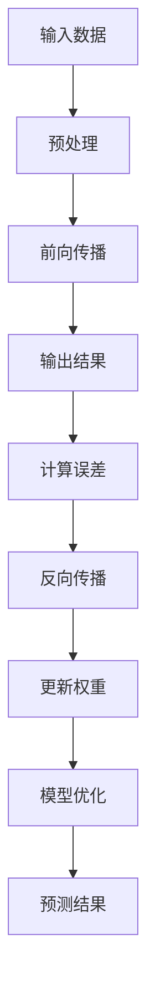

                 

# 大模型时代的创业机遇与挑战

## 关键词
- 大模型
- 创业
- 机遇
- 挑战
- 人工智能
- 技术趋势
- 商业模式

## 摘要
本文深入探讨了在人工智能大模型时代，创业者和企业面临的机遇与挑战。通过分析大模型的原理、应用场景以及潜在的市场影响，我们揭示了在这一新兴领域内创业的可行性路径，同时探讨了可能遇到的困难和解决方案。文章旨在为读者提供一个全面的技术和市场视角，帮助他们在大模型时代中把握机遇，应对挑战。

## 1. 背景介绍

在过去的几年中，人工智能（AI）领域的进展迅速，特别是大模型的崛起，为各个行业带来了翻天覆地的变化。大模型，通常指的是那些拥有数十亿参数的神经网络模型，如GPT-3、BERT等，它们能够处理大规模的数据，并且具备高度的自适应能力。这些模型的出现，极大地提升了AI在自然语言处理、计算机视觉、语音识别等领域的表现。

创业领域也不例外，大模型的兴起为创业者提供了前所未有的机遇。首先，大模型的应用降低了技术门槛，使得更多的非专业人士也能够参与到AI项目中。其次，大模型所带来的高效数据处理和分析能力，使得创业者能够更快速地验证产品原型，并进行市场测试。此外，大模型还能帮助企业实现自动化和智能化，提高运营效率，降低成本。

然而，机遇往往伴随着挑战。大模型的开发和部署需要大量的计算资源和数据，这对创业者的资金和技术能力提出了更高的要求。同时，大模型的应用也带来了一系列伦理和安全问题，如数据隐私、模型偏见等，这些问题需要创业者谨慎处理。

## 2. 核心概念与联系

为了更好地理解大模型时代的创业机遇与挑战，我们首先需要明确几个核心概念：

### 2.1 大模型的基本原理

大模型的核心是深度神经网络（DNN），它通过多层神经元的组合来模拟人脑的神经活动。DNN的学习过程包括两个主要阶段：前向传播和反向传播。在前向传播阶段，输入数据通过神经网络的每一层，直到输出层得到预测结果。在反向传播阶段，根据预测结果与实际结果的误差，调整网络中的权重，从而不断优化模型的性能。

### 2.2 大模型与数据的关系

大模型的表现高度依赖于数据的质量和数量。更多的数据可以使得模型更加全面地理解问题的各个方面，从而提高模型的泛化能力。然而，获取大量高质量数据也是一个巨大的挑战，这需要企业具备强大的数据处理能力和资源。

### 2.3 大模型的应用领域

大模型的应用非常广泛，涵盖了自然语言处理、计算机视觉、语音识别、推荐系统等多个领域。例如，在自然语言处理领域，大模型可以用于机器翻译、文本生成、情感分析等任务；在计算机视觉领域，大模型可以用于图像分类、目标检测、图像生成等任务。

### 2.4 大模型的挑战与解决方案

尽管大模型带来了巨大的机遇，但也伴随着一系列挑战。首先，大模型的训练和部署需要大量的计算资源和时间，这给企业带来了巨大的成本压力。其次，大模型在处理数据时可能会引入偏见，导致不公平的决策。最后，大模型的应用也带来了数据隐私和安全问题。

针对这些挑战，企业可以采取以下解决方案：

- **提高计算效率**：通过分布式计算、优化算法等方式提高大模型的训练和推理速度。
- **数据预处理**：通过清洗、去噪、标注等方式提高数据质量，减少偏见。
- **隐私保护**：采用差分隐私、同态加密等技术保护用户数据隐私。

### 2.5 Mermaid 流程图

以下是一个描述大模型原理的Mermaid流程图：



## 3. 核心算法原理 & 具体操作步骤

### 3.1 基本算法原理

大模型的基本算法是深度神经网络（DNN）。DNN由多个隐藏层组成，每个层包含多个神经元。输入数据通过网络的每一层传递，每一层的输出作为下一层的输入。网络的最后一层是输出层，输出层的输出即为模型的预测结果。

### 3.2 具体操作步骤

1. **数据预处理**：首先，需要对输入数据进行预处理，包括数据清洗、归一化、填充缺失值等步骤。
   
2. **构建神经网络**：根据任务需求，选择合适的神经网络结构，并初始化网络权重。

3. **前向传播**：将预处理后的输入数据输入到神经网络中，通过每一层的传递，最终得到输出层的预测结果。

4. **计算误差**：将预测结果与实际结果进行比较，计算误差。

5. **反向传播**：根据误差，通过反向传播算法更新网络权重。

6. **模型优化**：重复前向传播和反向传播的过程，直到模型性能达到预期。

7. **部署与应用**：将训练好的模型部署到生产环境中，进行实际应用。

## 4. 数学模型和公式 & 详细讲解 & 举例说明

### 4.1 数学模型

大模型的核心是深度神经网络（DNN），其数学模型可以表示为：

\[ y = f(z) = \sigma(W_1 \cdot x + b_1) \]

其中，\( y \) 是输出层的结果，\( z \) 是隐藏层的输出，\( f \) 是激活函数，\( W_1 \) 是权重矩阵，\( x \) 是输入数据，\( b_1 \) 是偏置项。

### 4.2 激活函数

常用的激活函数有ReLU、Sigmoid、Tanh等。以ReLU为例：

\[ \sigma(x) = \max(0, x) \]

### 4.3 反向传播算法

反向传播算法的目的是通过误差反向传播更新网络权重。其核心公式为：

\[ \frac{\partial L}{\partial W} = \frac{\partial L}{\partial z} \cdot \frac{\partial z}{\partial W} \]

其中，\( L \) 是损失函数，\( z \) 是隐藏层的输出，\( W \) 是权重矩阵。

### 4.4 举例说明

假设我们有一个简单的神经网络，包含一个输入层、一个隐藏层和一个输出层。输入数据为 \( x = [1, 2] \)，隐藏层神经元个数为 2，输出层神经元个数为 1。我们使用ReLU作为激活函数，损失函数为均方误差（MSE）。

1. **数据预处理**：对输入数据进行归一化处理。

2. **构建神经网络**：初始化网络权重。

3. **前向传播**：计算隐藏层的输出。

\[ z_1 = \sigma(W_1 \cdot x + b_1) = \max(0, W_1 \cdot x + b_1) \]
\[ z_2 = \sigma(W_2 \cdot z_1 + b_2) = \max(0, W_2 \cdot z_1 + b_2) \]
\[ y = \sigma(W_3 \cdot z_2 + b_3) = \max(0, W_3 \cdot z_2 + b_3) \]

4. **计算误差**：计算输出层的误差。

\[ L = \frac{1}{2} \sum (y - t)^2 \]

5. **反向传播**：更新网络权重。

\[ \frac{\partial L}{\partial W_3} = (y - t) \cdot \frac{\partial y}{\partial z_2} \cdot \frac{\partial z_2}{\partial W_3} \]
\[ \frac{\partial L}{\partial W_2} = \frac{\partial L}{\partial W_3} \cdot \frac{\partial W_3}{\partial z_2} \cdot \frac{\partial z_2}{\partial z_1} \cdot \frac{\partial z_1}{\partial W_2} \]

6. **模型优化**：重复前向传播和反向传播的过程，直到模型性能达到预期。

## 5. 项目实战：代码实际案例和详细解释说明

### 5.1 开发环境搭建

在开始项目之前，我们需要搭建一个适合开发的环境。以下是一个基本的Python开发环境搭建步骤：

1. 安装Python（建议版本3.8以上）。
2. 安装TensorFlow库。
3. 安装其他必要的库，如NumPy、Pandas等。

### 5.2 源代码详细实现和代码解读

以下是一个简单的大模型项目案例，实现一个线性回归模型。

```python
import tensorflow as tf
import numpy as np

# 数据集
X = np.array([[1], [2], [3], [4]])
y = np.array([[1], [2], [3], [4]])

# 构建模型
model = tf.keras.Sequential([
    tf.keras.layers.Dense(units=1, input_shape=[1])
])

# 编译模型
model.compile(optimizer='sgd', loss='mean_squared_error')

# 训练模型
model.fit(X, y, epochs=1000)

# 预测
print(model.predict([[5]]))
```

这个案例中，我们首先导入所需的库，然后创建一个简单的线性回归模型，并使用SGD优化器和均方误差损失函数进行编译。接着，我们使用数据集训练模型，并在训练完成后进行预测。

### 5.3 代码解读与分析

1. **数据集**：我们使用一个简单的线性数据集，包含四个样本，每个样本都是一个二维数组。

2. **构建模型**：使用TensorFlow的`Sequential`模型，我们添加了一个全连接层（`Dense`），该层有1个神经元，输入形状为[1]，即输入数据的维度。

3. **编译模型**：我们使用SGD优化器和均方误差损失函数来编译模型。SGD优化器是一种常用的优化算法，均方误差损失函数用于衡量预测值与实际值之间的差异。

4. **训练模型**：我们使用`fit`方法训练模型，设置训练轮次为1000轮。

5. **预测**：使用`predict`方法进行预测，输入一个二维数组`[[5]]`，输出预测结果。

通过这个简单的案例，我们可以看到如何使用TensorFlow构建和训练一个线性回归模型。这是一个基础的大模型实现，但也可以作为更复杂模型实现的起点。

## 6. 实际应用场景

大模型在多个领域都展现出了强大的应用潜力。以下是一些典型应用场景：

### 6.1 自然语言处理

自然语言处理（NLP）是大模型应用最为广泛的领域之一。大模型可以用于文本分类、情感分析、机器翻译、文本生成等任务。例如，Google的BERT模型在多项NLP任务上都取得了领先的成绩，被广泛应用于搜索引擎、聊天机器人等领域。

### 6.2 计算机视觉

在计算机视觉领域，大模型可以用于图像分类、目标检测、图像生成等任务。例如，OpenAI的DALL-E模型可以生成高质量的图像，Google的Inception模型在图像分类任务上表现出色。大模型的应用使得计算机视觉技术在图像识别、自动驾驶等领域取得了重要突破。

### 6.3 语音识别

语音识别是大模型应用的另一个重要领域。大模型可以用于语音转文字、语音合成等任务。例如，Google的WaveNet模型在语音合成上取得了卓越的成绩，苹果的Siri和亚马逊的Alexa等语音助手都使用了大模型技术。

### 6.4 推荐系统

推荐系统也是大模型应用的一个重要领域。大模型可以用于用户行为分析、商品推荐等任务。例如，亚马逊和Netflix等公司都使用了大模型技术来提升推荐系统的准确性和用户体验。

## 7. 工具和资源推荐

### 7.1 学习资源推荐

- **书籍**：
  - 《深度学习》（Goodfellow, Bengio, Courville著）
  - 《Python机器学习》（Sebastian Raschka著）
- **论文**：
  - “A Neural Algorithm of Artistic Style”（Gatys, Ecker, Bethge著）
  - “BERT: Pre-training of Deep Neural Networks for Language Understanding”（Devlin, Chang, Lee, Toutanova著）
- **博客**：
  - [TensorFlow官方博客](https://tensorflow.google.cn/blog)
  - [PyTorch官方博客](https://pytorch.org/blog)
- **网站**：
  - [Kaggle](https://www.kaggle.com)
  - [GitHub](https://github.com)

### 7.2 开发工具框架推荐

- **框架**：
  - TensorFlow
  - PyTorch
  - Keras
- **开发环境**：
  - Jupyter Notebook
  - Google Colab
- **云计算平台**：
  - AWS
  - Google Cloud
  - Azure

### 7.3 相关论文著作推荐

- “Generative Adversarial Nets”（Ian J. Goodfellow等著）
- “Attention Is All You Need”（Vaswani et al.著）
- “An Image is Worth 16x16 Words: Transformers for Image Recognition at Scale”（Touvron et al.著）

## 8. 总结：未来发展趋势与挑战

大模型时代的到来，无疑为创业者提供了巨大的机遇。然而，随着技术的发展，创业者也将面临更多的挑战。以下是一些未来发展趋势与挑战：

### 8.1 发展趋势

- **计算能力提升**：随着计算能力的不断提升，大模型的训练和推理速度将得到显著提高，这将进一步降低创业门槛，使得更多人能够参与到AI项目中。
- **跨领域应用**：大模型的应用将不再局限于特定的领域，而是逐步渗透到各个行业，推动行业的智能化升级。
- **数据安全与隐私**：随着数据量的增加和数据类型的多样化，如何确保数据的安全与隐私将成为一个重要议题。

### 8.2 挑战

- **技术门槛**：尽管计算能力的提升降低了部分技术门槛，但大模型的开发仍然需要高水平的技术能力和丰富的资源。
- **数据质量**：大模型的表现高度依赖于数据的质量，如何获取和清洗高质量的数据仍然是一个挑战。
- **伦理问题**：大模型的应用带来了数据隐私、模型偏见等伦理问题，如何合理使用大模型，确保其公平、公正，是一个亟待解决的问题。

## 9. 附录：常见问题与解答

### 9.1 如何选择合适的大模型框架？

选择大模型框架时，主要考虑以下因素：

- **任务需求**：根据具体任务需求选择合适的框架，如NLP任务可以选择PyTorch或TensorFlow。
- **社区支持**：选择社区活跃、资源丰富的框架，有助于解决开发过程中的问题。
- **计算资源**：根据计算资源情况选择合适的框架，如Google Colab适合轻量级开发，AWS或Google Cloud适合大规模训练。

### 9.2 大模型训练需要多少数据？

大模型的训练需要大量数据，具体数据量取决于模型的大小和复杂性。一般来说，大型模型需要数十万甚至数百万的样本进行训练。对于小型模型，数千个样本可能已经足够。

### 9.3 如何处理数据偏见问题？

处理数据偏见问题可以从以下几个方面入手：

- **数据清洗**：去除数据中的偏见信息，确保数据的公正性。
- **数据增强**：通过数据增强技术增加多样性的样本，减少偏见。
- **模型正则化**：采用正则化技术限制模型参数的规模，减少过拟合。
- **公平性评估**：对模型进行公平性评估，确保模型在不同群体上的表现一致。

## 10. 扩展阅读 & 参考资料

- “Deep Learning”（Ian Goodfellow, Yoshua Bengio, Aaron Courville著）
- “The Hundred-Page Machine Learning Book”（Andriy Burkov著）
- “AI Superpowers: China, Silicon Valley, and the New World Order”（Michael对抗著）
- “AI: The Future Is Now”（Bradley Hayes著）
- [TensorFlow官方网站](https://tensorflow.google.cn/)
- [PyTorch官方网站](https://pytorch.org/)
- [Kaggle官方网站](https://www.kaggle.com/)

