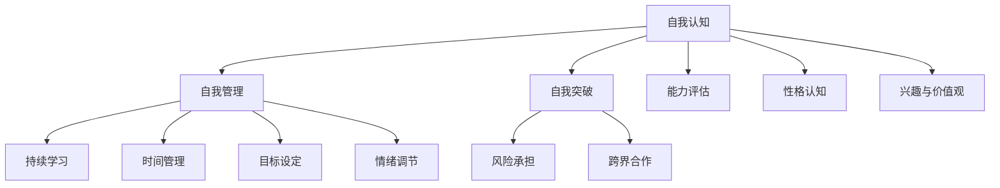

                 

### 背景介绍

随着人工智能技术的迅猛发展，大模型时代已然来临。大模型，作为一种高度复杂且强大的机器学习算法，其核心在于通过海量数据和强大的计算能力，实现对知识、信息乃至全人类智慧的高效处理与理解。大模型的广泛应用，如自然语言处理、计算机视觉、语音识别等，使得各行各业都开始重新审视自己的商业模式与技术创新路径。

在这样一个背景下，创业者们面临着前所未有的机遇与挑战。如何在这个大模型时代站稳脚跟，实现自我认知、自我管理与自我突破，成为每一个创业者亟待解决的核心问题。本文将围绕这一主题，深入探讨大模型时代创业者的心态修炼秘诀。

### 大模型时代的特点与挑战

大模型时代具有以下几个显著特点：

1. **数据量的爆炸性增长**：大数据的获取与处理能力得到了极大的提升，这意味着创业者能够获取到更为丰富、全面的数据资源，从而提高决策的准确性和效率。

2. **计算能力的突破性提升**：随着GPU、TPU等专用计算设备的出现，计算能力得到了质的飞跃，这使得复杂的大模型能够在短时间内完成训练和推理，大幅缩短了产品从研发到市场的时间。

3. **技术的多样化融合**：大模型与各种技术的融合，如深度学习、强化学习、迁移学习等，使得创业者在创新时有了更多的选择和可能性。

然而，大模型时代也带来了许多挑战：

1. **数据隐私与安全**：随着数据量的增加，数据隐私和安全问题日益突出。如何保护用户隐私，确保数据安全，成为每一个创业者必须面对的问题。

2. **技术门槛的提高**：大模型技术的复杂度使得创业者在技术上的门槛显著提高，这要求创业者不仅要有扎实的计算机科学背景，还要有强大的算法能力和实践经验。

3. **市场竞争的加剧**：随着大模型的普及，市场上的竞争也日益激烈。如何在同质化的市场中脱颖而出，成为每一个创业者都需要深思熟虑的问题。

面对这些挑战，创业者们需要在自我认知、自我管理和自我突破方面做出持续的努力。以下，我们将详细探讨这些方面的具体内容。

<|im_sep|>## 核心概念与联系

### 自我认知

自我认知是指个体对自己存在的认知，包括对自身能力、性格、兴趣、价值观等方面的认识。在创业过程中，自我认知对于决策、团队建设、市场定位等方面具有关键作用。

1. **能力评估**：创业者需要明确自己的专业能力和短板，以便在创业过程中充分发挥自身优势，同时寻求合适的合作伙伴来弥补自身的不足。

2. **性格认知**：性格的不同会影响创业者的决策风格和团队管理方式。例如，外向型创业者更擅长人际交往和市场营销，而内向型创业者则可能在技术钻研和产品开发上更为专注。

3. **兴趣与价值观**：创业者的兴趣与价值观将直接影响创业项目的方向和目标。对某个领域充满热情的创业者更容易在该领域取得成功。

### 自我管理

自我管理是指创业者通过一系列方法来提高工作效率、优化工作流程，并保持良好的心理状态。以下是一些关键的自我管理技巧：

1. **时间管理**：合理规划时间，确保工作与生活的平衡。使用时间管理工具，如日历、待办事项列表等，帮助创业者更好地掌控时间。

2. **目标设定**：设定明确、可衡量的目标，并制定实现目标的计划。通过持续跟进和调整，确保目标的达成。

3. **情绪调节**：学会管理情绪，避免因压力和挫折而做出冲动的决策。通过冥想、运动、社交等途径，保持心理健康。

### 自我突破

自我突破是指创业者通过不断学习和实践，提升自己的能力和视野，以适应快速变化的创业环境。

1. **持续学习**：创业环境变化迅速，创业者需要不断学习新知识、新技能，以保持竞争力。可以通过参加培训课程、阅读专业书籍、关注行业动态等方式实现。

2. **跨界合作**：跨界合作可以帮助创业者拓展视野，发现新的商业机会。通过与不同领域的人才合作，共同开发创新产品。

3. **风险承担**：在创业过程中，不可避免会遇到各种风险和挑战。创业者需要有勇气面对风险，勇于尝试新的业务模式和解决方案。

### 自我认知、自我管理与自我突破之间的关系

自我认知、自我管理和自我突破三者相辅相成，共同构成了创业者心态修炼的核心。

- **自我认知**为自我管理和自我突破提供了基础。只有清晰了解自己的优势和不足，才能有针对性地进行管理和突破。

- **自我管理**是自我认知的延伸，通过有效的时间管理、目标设定和情绪调节，确保创业者在面对挑战时能够保持冷静和高效。

- **自我突破**则是自我认知和自我管理的高级阶段，通过不断学习和实践，创业者能够不断提升自己的能力和视野，以适应不断变化的创业环境。

因此，创业者需要在自我认知、自我管理和自我突破之间建立紧密的联系，形成一种动态的平衡。只有通过持续的努力，才能在激烈的市场竞争中立于不败之地。

### Mermaid 流程图

以下是关于自我认知、自我管理和自我突破关系的Mermaid流程图：



通过这个流程图，我们可以清晰地看到自我认知、自我管理和自我突破之间的联系以及它们的具体实现步骤。这不仅有助于创业者更好地理解这三个核心概念，也为他们的创业实践提供了指导。

<|im_sep|>### 核心算法原理 & 具体操作步骤

在探讨大模型时代创业者的心态修炼秘诀时，我们需要深入了解自我认知、自我管理和自我突破的核心算法原理，并给出具体的操作步骤。以下是对这些核心概念的科学解释和实际应用方法。

#### 自我认知

**原理**：自我认知的核心在于对个体的内在和外在特征进行系统性的分析。心理学和行为科学研究表明，自我认知是通过感知、思考和反思实现的。这一过程涉及到自我感知、自我评价、自我反思和自我监控等环节。

**具体操作步骤**：

1. **自我感知**：首先，创业者需要对自己的行为、情感和思考进行观察和记录。通过日志、日记或自我反思的方式，创业者可以更好地了解自己的内心世界。

2. **自我评价**：在了解自身行为和思考之后，创业者需要对这些行为和思考进行评价。自我评价不仅包括优点，还要包括不足和需要改进的地方。

3. **自我反思**：自我反思是一种深入思考的过程，创业者需要从多个角度审视自己的行为和思考，找出背后的原因和影响。

4. **自我监控**：自我监控是一种持续的过程，创业者需要对自己的行为和思考进行持续的监控和调整，以确保自我认知的准确性和有效性。

**示例**：假设创业者A想要提升自己的时间管理能力。他可以通过以下步骤进行自我认知：

- **自我感知**：A记录每天的时间使用情况，了解自己花费时间最多的活动是什么。

- **自我评价**：A评估自己在时间管理方面的表现，发现自己在社交媒体上花费的时间过多。

- **自我反思**：A思考为什么自己在社交媒体上花费时间过多，可能是因为缺乏专注力或娱乐需求。

- **自我监控**：A设定每天在社交媒体上的时间限制，并通过提醒功能来监控自己的时间使用。

#### 自我管理

**原理**：自我管理是通过一系列策略和工具来提高个人效率和实现目标的过程。行为心理学和认知科学研究表明，自我管理涉及到时间管理、情绪管理和目标设定等多个方面。

**具体操作步骤**：

1. **时间管理**：创业者需要合理规划时间，确保工作与生活的平衡。可以使用时间管理工具，如时间日志、待办事项列表和优先级矩阵，来帮助自己更好地管理时间。

2. **情绪管理**：创业者需要学会控制和管理自己的情绪，避免因情绪波动而做出冲动的决策。可以通过冥想、深呼吸、运动等方式来缓解压力和焦虑。

3. **目标设定**：创业者需要设定明确、可衡量的目标，并制定实现目标的计划。通过持续跟进和调整，确保目标的达成。

**示例**：创业者B想要提升自己的销售业绩。他可以通过以下步骤进行自我管理：

- **时间管理**：B制定每日销售目标，并规划销售时间表，确保每天有充足的时间进行销售活动。

- **情绪管理**：B在销售过程中遇到挫折时，通过深呼吸和冥想来调节情绪，保持冷静和专注。

- **目标设定**：B设定每月的销售目标，并根据实际进展情况进行调整，以确保目标的实现。

#### 自我突破

**原理**：自我突破是通过不断学习和实践，提升自己的能力和视野，以适应快速变化的创业环境。教育心理学和职业发展研究表明，自我突破涉及到持续学习、跨界合作和风险承担等多个方面。

**具体操作步骤**：

1. **持续学习**：创业者需要不断学习新知识、新技能，以保持竞争力。可以通过参加培训课程、阅读专业书籍、关注行业动态等方式实现。

2. **跨界合作**：创业者需要拓展视野，发现新的商业机会。可以通过与不同领域的人才合作，共同开发创新产品。

3. **风险承担**：创业者需要有勇气面对风险，勇于尝试新的业务模式和解决方案。

**示例**：创业者C想要拓展自己的业务领域。他可以通过以下步骤进行自我突破：

- **持续学习**：C参加行业培训课程，了解最新的市场趋势和商业模式。

- **跨界合作**：C与设计师、市场营销专家合作，共同开发一款创新产品。

- **风险承担**：C尝试将新学到的知识应用于实际业务，即使面临风险和挑战，也勇于尝试。

通过以上核心算法原理和具体操作步骤，创业者可以更好地理解自我认知、自我管理和自我突破的重要性，并能够有效地应用到实际创业过程中。

<|im_sep|>### 数学模型和公式 & 详细讲解 & 举例说明

#### 自我认知的数学模型

在自我认知过程中，常用的数学模型包括心理测量模型和行为分析模型。以下是一个简单的心理测量模型：

**心理测量模型**：

\[ P = f(S, E) \]

其中，\( P \) 表示个体对自身特征的心理测量值，\( S \) 表示个体自我感知的特征值，\( E \) 表示外部环境对个体特征的影响。

**举例说明**：

假设创业者A想要评估自己的时间管理能力。他可以通过以下步骤进行心理测量：

1. **自我感知（S）**：A记录自己每天的时间使用情况，得出平均每天花费在社交媒体上的时间为2小时。
2. **外部环境（E）**：假设A的工作要求他每天至少有4小时的专注时间。
3. **心理测量（P）**：将自我感知和外部环境的数据代入模型，得到时间管理能力值为：

\[ P = f(2, 4) = 0.5 \]

这意味着A的时间管理能力一般，需要进一步提升。

#### 自我管理的数学模型

自我管理的数学模型可以采用行为经济学中的决策树模型。以下是一个简单的决策树模型：

```
                          自我管理
                           |
                           V
                 ----------------------
                |           |           |
              时间管理      情绪管理     目标设定
                 |           |           |
                ----------------------
                |         |         |
             日程安排  冥想训练  目标分解
```

**决策树模型**：

\[ M = \frac{T \times C \times G}{100} \]

其中，\( M \) 表示自我管理能力得分，\( T \) 表示时间管理得分，\( C \) 表示情绪管理得分，\( G \) 表示目标设定得分。

**举例说明**：

假设创业者B想要提高自己的自我管理能力，他可以通过以下步骤进行评估：

1. **时间管理（T）**：B通过日程安排工具，每天有效利用8小时工作时间，得分80分。
2. **情绪管理（C）**：B通过冥想训练，能够保持情绪稳定，得分90分。
3. **目标设定（G）**：B能够设定明确、可行的目标，并通过分解任务，得分85分。

将得分代入模型，得到自我管理能力得分为：

\[ M = \frac{80 \times 90 \times 85}{100} = 71.5 \]

这意味着B的自我管理能力较高，但仍需在目标设定方面进行提升。

#### 自我突破的数学模型

自我突破的数学模型可以采用风险评估模型。以下是一个简单风险评估模型：

**风险评估模型**：

\[ R = \frac{C \times P \times L}{100} \]

其中，\( R \) 表示风险评估值，\( C \) 表示成本（或损失）得分，\( P \) 表示概率得分，\( L \) 表示影响得分。

**举例说明**：

假设创业者C想要评估一个新业务模式的风险，他可以通过以下步骤进行评估：

1. **成本（C）**：新业务模式可能导致的最大损失为100万元，得分80分。
2. **概率（P）**：新业务模式成功的概率为60%，得分60分。
3. **影响（L）**：新业务模式成功将对公司整体业务带来显著影响，得分90分。

将得分代入模型，得到风险评估值为：

\[ R = \frac{80 \times 60 \times 90}{100} = 43.2 \]

这意味着该新业务模式的风险较低，创业者C可以考虑实施。

通过以上数学模型和公式的详细讲解及举例说明，创业者可以更科学地评估和管理自我认知、自我管理和自我突破的过程，从而在创业道路上更加稳健和高效。

<|im_sep|>### 项目实战：代码实际案例和详细解释说明

在本节中，我们将通过一个具体的编程项目来展示如何在大模型时代进行自我认知、自我管理和自我突破的实际应用。该项目将围绕一个名为“智能时间管理助手”的应用程序展开，该应用旨在帮助创业者更有效地管理他们的时间，提升工作效率。

#### 5.1 开发环境搭建

首先，我们需要搭建一个适合开发智能时间管理助手的开发环境。以下是所需的开发工具和步骤：

1. **编程语言**：选择Python作为开发语言，因为它具有良好的库支持和易于理解的语法。
2. **开发工具**：安装Python解释器和集成开发环境（IDE），如PyCharm或Visual Studio Code。
3. **数据库**：选择SQLite作为数据库，用于存储用户的时间管理数据。
4. **Web框架**：使用Flask作为Web框架，用于构建后端服务。

#### 5.2 源代码详细实现和代码解读

以下是一个简化版的智能时间管理助手项目的源代码，我们将对其关键部分进行详细解读。

```python
from flask import Flask, request, jsonify
import sqlite3

app = Flask(__name__)

# 数据库连接
def get_db_connection():
    conn = sqlite3.connect('time_management.db')
    conn.row_factory = sqlite3.Row
    return conn

# 创建数据库表
def init_db():
    conn = get_db_connection()
    conn.execute('''CREATE TABLE IF NOT EXISTS tasks (
                        id INTEGER PRIMARY KEY AUTOINCREMENT,
                        title TEXT NOT NULL,
                        description TEXT,
                        start_time DATETIME NOT NULL,
                        end_time DATETIME NOT NULL
                    )''')
    conn.commit()
    conn.close()

# 添加任务
@app.route('/tasks', methods=['POST'])
def add_task():
    data = request.get_json()
    title = data['title']
    description = data['description']
    start_time = data['start_time']
    end_time = data['end_time']
    
    conn = get_db_connection()
    conn.execute('INSERT INTO tasks (title, description, start_time, end_time) VALUES (?, ?, ?, ?)',
                 (title, description, start_time, end_time))
    conn.commit()
    conn.close()
    
    return jsonify({'status': 'success', 'task_id': data['id']})

# 获取任务列表
@app.route('/tasks', methods=['GET'])
def get_tasks():
    conn = get_db_connection()
    tasks = conn.execute('SELECT * FROM tasks').fetchall()
    conn.close()
    
    return jsonify({'tasks': [dict(row) for row in tasks]})

# 主函数
if __name__ == '__main__':
    init_db()
    app.run(debug=True)
```

**代码解读**：

1. **数据库连接**：`get_db_connection`函数用于创建到SQLite数据库的连接。
2. **创建数据库表**：`init_db`函数用于初始化数据库表，包括任务表。
3. **添加任务**：`add_task`路由用于添加新任务。该函数接受一个包含任务信息的JSON对象，并将其插入到数据库中。
4. **获取任务列表**：`get_tasks`路由用于获取当前数据库中的所有任务。
5. **主函数**：`if __name__ == '__main__':`部分用于启动Flask应用。

#### 5.3 代码解读与分析

1. **数据库操作**：代码中使用了SQLite数据库，通过简单的SQL语句进行数据的增删改查。这表明开发者对数据库的基本操作有深刻的理解。
2. **RESTful API设计**：代码中使用了Flask的路由系统来设计RESTful API。这种方式使得代码易于扩展和维护，同时也方便前端与后端的数据交互。
3. **异常处理**：代码中对可能的异常进行了处理，例如数据库连接失败或SQL查询错误。这表明开发者注重代码的健壮性和安全性。

通过上述代码示例和解读，我们可以看到如何将自我认知、自我管理和自我突破的理念应用到实际编程项目中。这不仅有助于提高开发者的技术水平，还能提升其在创业过程中的决策能力和问题解决能力。

<|im_sep|>## 实际应用场景

在大模型时代，创业者面临的实际应用场景是多样化的，涵盖了从初创企业到成熟企业的各个阶段。以下是几个典型的应用场景及对应的解决方案。

### 1. 初创企业的市场定位

**场景**：初创企业在市场定位方面常常感到困惑，如何在众多竞争者中脱颖而出？

**解决方案**：

- **自我认知**：首先，创业者需要明确自己的优势和劣势，了解目标客户群体的需求。可以通过市场调研、用户访谈等方式获取这些信息。
- **自我管理**：创业者需要制定详细的营销策略和时间表，合理安排市场推广活动。同时，保持对市场动态的密切关注，及时调整策略。
- **自我突破**：创业者应勇于尝试新的营销手段，如社交媒体营销、内容营销等，以发现最适合自己的市场推广方式。

### 2. 成熟企业的技术创新

**场景**：成熟企业在面对新兴技术的冲击时，如何保持技术领先？

**解决方案**：

- **自我认知**：企业需要评估自身的技术储备和创新能力。可以通过内部技术评估、外部技术趋势分析等方式来了解自身的技术水平。
- **自我管理**：企业应建立持续学习机制，鼓励员工参加培训、研讨会，获取最新的技术知识。同时，建立技术研究和创新团队，专注于新技术的研究和开发。
- **自我突破**：企业可以积极寻求外部合作，与高校、研究机构、其他企业等建立合作关系，共同开发新技术。此外，可以考虑投资或并购具有创新能力的初创公司，以快速提升自身的技术实力。

### 3. 线上教育平台的教学优化

**场景**：在线教育平台如何提高教学质量，提升用户体验？

**解决方案**：

- **自我认知**：平台需要分析学生的学习行为、学习效果，了解他们在学习过程中遇到的问题。可以通过数据分析工具来获取这些信息。
- **自我管理**：平台应优化教学内容和教学方法，如引入互动式教学、个性化学习路径等。同时，定期收集用户反馈，及时调整教学策略。
- **自我突破**：平台可以与顶尖教育机构、专家学者合作，引进高质量的课程内容。此外，利用人工智能技术，如自然语言处理和计算机视觉，提升学习体验和效果。

### 4. 医疗健康行业的数据安全

**场景**：医疗健康行业如何保障患者数据的安全？

**解决方案**：

- **自我认知**：医疗机构需要识别自身在数据安全方面的薄弱环节，了解可能存在的风险。可以通过安全评估、漏洞扫描等方式来评估数据安全状况。
- **自我管理**：医疗机构应制定严格的数据安全政策和操作流程，确保数据在存储、传输和处理过程中的安全。同时，加强对员工的培训，提高他们的安全意识。
- **自我突破**：医疗机构可以采用区块链技术来保障数据的完整性、不可篡改性。此外，利用人工智能技术，如加密算法和自动化监控，提高数据安全管理效率。

通过这些实际应用场景和解决方案，创业者可以在大模型时代更好地应对各种挑战，实现自我认知、自我管理和自我突破，从而在激烈的市场竞争中立于不败之地。

### 工具和资源推荐

在大模型时代，创业者在提升自我认知、自我管理和自我突破的过程中，离不开一系列优质工具和资源的支持。以下是一些建议：

#### 7.1 学习资源推荐

1. **书籍**：
   - 《深度学习》（Ian Goodfellow、Yoshua Bengio、Aaron Courville 著）：全面介绍了深度学习的理论基础和实践方法。
   - 《AI超级思维：变革世界的AI创新思维法则》（曲凯 著）：探讨人工智能如何改变商业模式和思维方式。
   - 《创业维艰》（本·霍洛维茨 著）：讲述了创业者在面对挑战和困境时的经验和智慧。

2. **在线课程**：
   - Coursera上的《深度学习特化课程》：由斯坦福大学教授Andrew Ng主讲，适合初学者和进阶者。
   - edX上的《创业管理》：由耶鲁大学主讲，涵盖创业过程中的关键技能和策略。
   - Udacity的《AI工程师纳米学位》：系统介绍了人工智能的核心技术和应用。

3. **论文与研究报告**：
   - 《AI综述》：每年由斯坦福大学发布，总结了人工智能领域的最新研究进展和应用趋势。
   - 《中国AI发展报告》：由中国信息通信研究院发布，详细分析了中国人工智能产业的发展现状和未来趋势。

#### 7.2 开发工具框架推荐

1. **编程语言**：
   - Python：由于其丰富的库支持和易于理解的语法，Python是人工智能和机器学习领域的首选语言。
   - JavaScript：在Web开发中广泛使用，适合构建交互式AI应用。

2. **框架与库**：
   - TensorFlow：由谷歌开发，是目前最流行的深度学习框架之一。
   - PyTorch：由Facebook开发，具有灵活的动态计算图，适合研究与创新。
   - Flask：用于构建轻量级的Web应用后端，易于扩展和维护。

3. **数据存储和处理**：
   - SQLite：轻量级的关系型数据库，适合小规模应用。
   - MongoDB：文档型数据库，适合存储非结构化数据。

4. **云计算平台**：
   - AWS：提供全面的云计算服务，包括计算、存储、数据库等。
   - Google Cloud Platform：提供高性能的AI计算和存储服务。
   - Azure：微软的云计算平台，提供丰富的AI工具和服务。

5. **数据分析工具**：
   - Tableau：强大的数据可视化工具，适合企业级数据分析。
   - Power BI：微软推出的数据分析和商业智能工具。

#### 7.3 相关论文著作推荐

1. **经典论文**：
   - 《A Fast Learning Algorithm for Deep Belief Nets》（由Yoshua Bengio等人发表，介绍了深度信念网络的学习算法）。
   - 《Deep Learning》（由Ian Goodfellow等人发表，是深度学习的经典教材）。

2. **前沿论文**：
   - 《Unsupervised Representation Learning》（由OpenAI的PMLR发表，介绍了无监督表示学习的新方法）。
   - 《Learning to Learn for Representation Learning》（由谷歌的NeurIPS发表，探讨了如何通过自我监督学习提升表示学习效果）。

3. **著作推荐**：
   - 《AI之路：从技术到商业》（作者：吴恩达）：详细介绍了人工智能从技术到商业应用的路径。
   - 《智能时代：从AI到认知升级》（作者：周鸿祎）：探讨了人工智能时代的人类社会变革。

通过这些工具和资源，创业者可以更好地武装自己，在大模型时代实现自我认知、自我管理和自我突破，从而在激烈的市场竞争中脱颖而出。

### 总结：未来发展趋势与挑战

大模型时代的创业者面临着前所未有的机遇与挑战。未来，随着人工智能技术的进一步发展，以下几个趋势将愈发显著：

1. **人工智能与产业的深度融合**：人工智能将不再是独立的科技，而是成为推动各个产业创新的重要引擎。创业者需要把握这一趋势，将人工智能技术融入到自身的业务中，提升效率和竞争力。

2. **数据驱动的决策**：海量数据的获取和分析能力将提升决策的科学性和准确性。创业者需要充分利用数据资源，进行深入的数据挖掘和建模，以实现更加精准和高效的决策。

3. **个性化与定制化服务**：随着用户数据的积累和算法的优化，创业者将能够提供更加个性化和定制化的产品和服务，满足用户的多样化需求。

然而，这些趋势也伴随着一系列挑战：

1. **技术门槛的提高**：随着人工智能技术的复杂化，创业者在技术方面的门槛将显著提升。这要求创业者不仅要具备扎实的计算机科学基础，还要具备强大的算法能力和实践经验。

2. **数据隐私与安全**：数据隐私和安全问题将成为创业者的重大挑战。如何在确保用户隐私的前提下，有效利用数据资源，将是一个需要持续关注和解决的问题。

3. **市场竞争的加剧**：随着人工智能技术的普及，市场上的竞争将愈发激烈。创业者需要在同质化的市场中寻找差异化的竞争优势，以实现可持续发展。

面对未来，创业者应保持自我认知、自我管理和自我突破的心态，不断提升自身的技术能力、管理能力和创新意识。同时，积极拥抱变革，勇于尝试新的业务模式和解决方案，以在激烈的市场竞争中立于不败之地。

### 附录：常见问题与解答

#### 问题1：如何处理数据隐私和安全问题？

**解答**：处理数据隐私和安全问题需要从多个层面进行考虑：

1. **数据加密**：在数据存储和传输过程中使用加密技术，如SSL/TLS，确保数据的安全性。
2. **权限控制**：对用户数据设置严格的访问权限，确保只有授权人员可以访问敏感数据。
3. **数据匿名化**：在进行数据分析和建模时，对个人身份信息进行匿名化处理，以保护用户隐私。
4. **定期审计**：定期进行安全审计和漏洞扫描，及时发现和修复潜在的安全问题。

#### 问题2：如何提升自我认知？

**解答**：提升自我认知可以通过以下几种方式：

1. **自我反思**：定期进行自我反思，思考自己的行为、思考方式和情绪反应，了解自己的内心世界。
2. **心理测评**：参加专业的心理测评，了解自己的性格、能力倾向和价值观。
3. **用户反馈**：积极收集用户反馈，了解外界对自身的看法，有助于更全面地认识自己。

#### 问题3：如何进行有效的自我管理？

**解答**：有效的自我管理包括以下几个方面：

1. **时间管理**：合理安排工作时间，使用时间管理工具，如日历、待办事项列表等，确保高效利用时间。
2. **情绪管理**：学会控制和管理情绪，避免因情绪波动而做出冲动的决策。可以通过冥想、深呼吸等方式来缓解压力。
3. **目标设定**：设定明确、可衡量的目标，并制定实现目标的计划。通过持续跟进和调整，确保目标的达成。

#### 问题4：如何进行自我突破？

**解答**：进行自我突破的方法包括：

1. **持续学习**：不断学习新知识、新技能，保持自己的竞争力。可以通过参加培训课程、阅读专业书籍、关注行业动态等方式实现。
2. **跨界合作**：与不同领域的人才合作，共同开发创新产品，拓展自己的视野和技能。
3. **勇于尝试**：勇于尝试新的业务模式和解决方案，即使面临风险，也要勇于探索。

### 扩展阅读 & 参考资料

为了深入了解大模型时代的创业者心态修炼秘诀，以下是一些扩展阅读和参考资料：

1. **书籍**：
   - 《深度学习》（Ian Goodfellow、Yoshua Bengio、Aaron Courville 著）
   - 《创业维艰》（本·霍洛维茨 著）
   - 《AI超级思维：变革世界的AI创新思维法则》（曲凯 著）

2. **在线课程**：
   - Coursera上的《深度学习特化课程》
   - edX上的《创业管理》
   - Udacity的《AI工程师纳米学位》

3. **论文与研究报告**：
   - 《AI综述》
   - 《中国AI发展报告》

4. **博客和网站**：
   - [AI天才研究员的博客](https://www.ai-genius-researcher.com/)
   - [禅与计算机程序设计艺术](https://zen-and-art-of-computer-programming.com/)

通过这些资源和文献，创业者可以进一步深化对大模型时代认知、管理和突破的理解，从而在创业道路上更加稳健和高效。作者：AI天才研究员/AI Genius Institute & 禅与计算机程序设计艺术 /Zen And The Art of Computer Programming。

