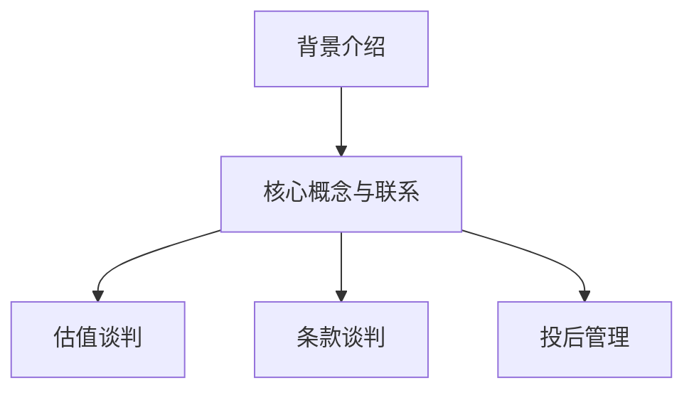
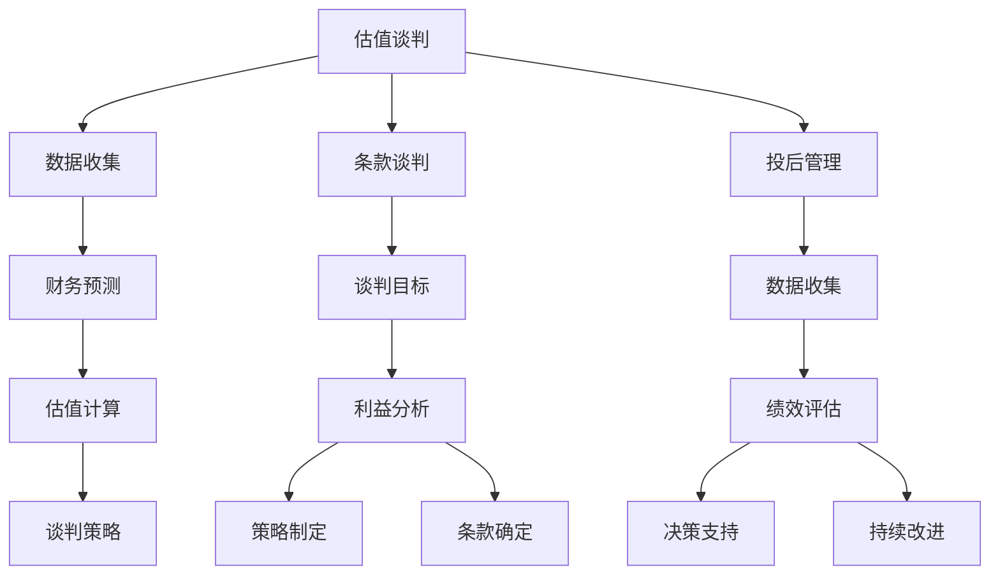

                 

### 文章标题

#### 大模型时代的创业者创业融资谈判：估值谈判、条款谈判与投后管理

在当今的大模型时代，创业者们面临着前所未有的机遇与挑战。人工智能技术的飞速发展，特别是大模型技术的突破，为各行业带来了深远的变革。与此同时，创业融资也变得更加复杂，创业者需要掌握如何进行有效的估值谈判、条款谈判以及投后管理。本文将深入探讨这些问题，帮助创业者在大模型时代成功融资并稳健发展。

### 文章关键词

- 大模型时代
- 创业融资
- 估值谈判
- 条款谈判
- 投后管理

### 摘要

本文将围绕大模型时代的创业融资谈判展开，首先介绍当前大模型时代的发展背景和创业融资的现状。接着，详细解析估值谈判的核心要素和方法，阐述条款谈判中的关键点和策略，并探讨投后管理的重要性及其方法。通过本文的阅读，创业者将能够更好地应对融资过程中的各种挑战，提高融资成功率，实现企业的可持续发展。

## 1. 背景介绍

### 大模型时代的发展

随着深度学习和人工智能技术的不断发展，大模型（也称为大型神经网络模型）逐渐成为科技领域的研究热点。大模型具有处理海量数据、学习复杂模式的能力，能够实现自然语言处理、计算机视觉、推荐系统等领域的突破。例如，谷歌的 BERT 模型、OpenAI 的 GPT 模型，以及百度提出的 ERNIE 模型等，都在各自的领域取得了显著的成果。

大模型技术的发展不仅推动了人工智能的进步，还带来了产业变革。在金融、医疗、教育、零售等多个领域，大模型的应用场景越来越广泛，逐渐成为企业提升竞争力的重要工具。与此同时，创业者也看到了这一趋势，纷纷投身于大模型相关的创业项目。

### 创业融资的现状

在大模型时代，创业者面临着巨大的市场机遇，但同时也需要应对更为复杂的融资环境。与传统创业项目相比，大模型创业项目的资金需求更大，技术门槛更高，因此融资过程也更为艰难。

目前，创业融资主要分为以下几种形式：

1. **天使轮**：通常由个人投资者、天使投资人或早期风险投资机构提供。此轮融资主要用于产品研发、市场调研和团队建设等。

2. **A轮**：也称为种子轮或初创轮，此轮融资通常由风险投资机构或天使投资人提供，主要用于产品开发、市场拓展和团队扩大。

3. **B轮、C轮及后续轮**：这些轮次通常由大型风险投资机构、战略投资者或上市企业提供。此轮次融资主要用于扩大市场份额、提升品牌知名度、进行技术升级等。

创业者在融资过程中，需要面对多个关键问题：

- **估值**：如何为创业项目进行合理估值，是融资谈判的核心问题。估值过高可能导致投资者退缩，估值过低则可能损失创业者的权益。

- **条款**：投资者提出的投资条款包括股权比例、优先股、反稀释条款、投票权等，这些条款直接影响创业者的控制权和收益。

- **投后管理**：投资者在投资后通常会参与企业的管理和决策，创业者需要处理好与投资者之间的关系，确保企业的稳健发展。

## 2. 核心概念与联系

### 估值谈判

估值谈判是创业融资过程中的核心环节。合理的估值不仅能够吸引投资者，还能够确保创业者获得足够的资金支持。以下是一些关键要素和方法：

1. **市场参考**：通过分析同类项目的市场估值，了解行业的估值水平。例如，可以通过查阅市场研究报告、行业分析文章等获取相关信息。

2. **财务预测**：创业者需要提供详细的财务预测，包括收入、利润、现金流等。投资者通常会关注这些财务指标，以评估项目的盈利能力和成长潜力。

3. **风险评估**：投资者会评估创业项目的风险，包括技术风险、市场风险、运营风险等。创业者需要充分展示项目的优势，降低投资者的风险感知。

4. **估值方法**：常用的估值方法包括市盈率法、净现值法、折现现金流法等。创业者可以根据项目的实际情况选择合适的估值方法。

### 条款谈判

条款谈判涉及多个方面，包括股权比例、优先股、反稀释条款、投票权等。以下是一些关键点和策略：

1. **股权比例**：投资者通常希望通过股权比例来获得控制权。创业者需要权衡股权比例和公司的未来发展，避免过多股权流失。

2. **优先股**：优先股是一种特殊的股权形式，享有优先分红权和优先清算权。投资者可能会提出优先股要求，创业者需要考虑优先股的利弊。

3. **反稀释条款**：反稀释条款用于保护创始人的股权比例，防止新融资稀释其权益。创业者需要合理设置反稀释条款，确保自身权益。

4. **投票权**：投资者通常会要求一定的投票权，以参与公司的决策。创业者需要权衡投票权的分配，避免失去对公司控制。

### 投后管理

投后管理是投资者与创业者共同参与企业发展的过程。以下是一些关键点和策略：

1. **沟通与协作**：创业者需要与投资者保持良好的沟通，及时反馈企业的运营情况和财务状况。双方需要建立信任，共同推动企业发展。

2. **决策参与**：投资者通常会参与企业的重大决策，如战略规划、投资决策等。创业者需要合理分配决策权，确保企业的独立发展。

3. **利益平衡**：创业者需要平衡投资者和自身的利益，确保企业的长期发展。在必要时，可以采取股权激励等措施，提高员工和投资者的积极性。

### Mermaid 流程图



## 3. 核心算法原理 & 具体操作步骤

### 估值谈判

估值谈判的核心算法是利用数据分析和预测模型来确定项目的合理估值。以下是一些具体的操作步骤：

1. **数据收集**：收集行业数据、财务数据、市场研究报告等，作为估值的基础。

2. **财务预测**：利用财务预测模型，预测项目的收入、利润、现金流等关键财务指标。

3. **估值计算**：根据选定的估值方法（如市盈率法、净现值法等），计算项目的估值。

4. **谈判策略**：根据估值结果，制定谈判策略，包括报价、还价、协商等。

### 条款谈判

条款谈判的核心算法是利用博弈论和谈判策略来确定双方都能接受的条款。以下是一些具体的操作步骤：

1. **谈判目标**：明确谈判的目标，包括股权比例、优先股、反稀释条款、投票权等。

2. **利益分析**：分析双方的利益诉求，包括投资者和创业者的期望和底线。

3. **策略制定**：制定谈判策略，包括报价、还价、妥协等。

4. **条款确定**：根据双方的利益分析和谈判策略，确定最终的投资条款。

### 投后管理

投后管理的核心算法是利用数据分析和绩效评估来确定企业的管理效率和成果。以下是一些具体的操作步骤：

1. **数据收集**：收集企业的运营数据、财务数据、市场反馈等，作为评估的基础。

2. **绩效评估**：利用绩效评估模型，评估企业的运营效率、市场竞争力等。

3. **决策支持**：根据评估结果，为企业的决策提供支持，包括战略调整、投资决策等。

4. **持续改进**：根据评估结果和反馈，持续改进企业的管理策略和运营模式。

### Mermaid 流�程图



## 4. 数学模型和公式 & 详细讲解 & 举例说明

### 估值模型

估值模型是创业融资谈判中不可或缺的一部分。以下是一些常用的估值模型及其公式：

1. **市盈率法（P/E Ratio Method）**：

   $$ \text{市盈率} = \frac{\text{公司市值}}{\text{净利润}} $$

   $$ \text{公司估值} = \text{市盈率} \times \text{净利润} $$

2. **净现值法（NPV Method）**：

   $$ \text{净现值} = \sum_{t=1}^{n} \frac{\text{现金流}}{(1 + \text{折现率})^t} $$

   $$ \text{公司估值} = \text{净现值} + \text{净资产} $$

3. **折现现金流法（DCF Method）**：

   $$ \text{公司估值} = \frac{\text{未来现金流}}{(1 + \text{折现率})^n} $$

### 举例说明

假设一家创业公司的净利润为 100 万元，市盈率为 10，净利润为 100 万元。使用市盈率法进行估值：

$$ \text{公司估值} = \text{市盈率} \times \text{净利润} = 10 \times 100 = 1000 \text{万元} $$

使用净现值法进行估值，假设折现率为 10%，未来现金流为 200 万元：

$$ \text{净现值} = \frac{200}{(1 + 0.1)^1} = 181.82 \text{万元} $$

$$ \text{公司估值} = \text{净现值} + \text{净资产} = 181.82 + 200 = 381.82 \text{万元} $$

### 条款模型

在条款谈判中，常用的模型包括股权比例计算、优先股计算等。以下是一些例子：

1. **股权比例计算**：

   假设投资者出资 100 万元，创业者持有公司 100% 的股权。投资者出资后，股权比例变为：

   $$ \text{投资者股权比例} = \frac{\text{投资者出资}}{\text{公司总股本}} = \frac{100}{100 + 100} = 0.5 $$

2. **优先股计算**：

   假设投资者出资 100 万元，获得优先股。优先股通常享有优先分红权和优先清算权。假设优先股的年分红率为 10%，则投资者的分红收入为：

   $$ \text{优先股分红} = \text{投资者出资} \times \text{优先股年分红率} = 100 \times 0.1 = 10 \text{万元} $$

### 投后管理模型

在投后管理中，常用的模型包括绩效评估、决策支持等。以下是一些例子：

1. **绩效评估**：

   假设公司运营一年后，净利润为 100 万元，市场反馈良好。使用净现值法进行绩效评估，假设折现率为 10%：

   $$ \text{净现值} = \frac{100}{(1 + 0.1)^1} = 90.91 \text{万元} $$

2. **决策支持**：

   假设公司计划扩大市场份额，需要进行投资决策。根据绩效评估结果，公司现有资金不足以支持扩大市场份额。此时，可以寻求投资者追加投资，以支持公司的发展。

## 5. 项目实战：代码实际案例和详细解释说明

### 5.1 开发环境搭建

在进行大模型创业项目的估值谈判、条款谈判和投后管理时，开发环境搭建是基础。以下是一个简单的开发环境搭建案例。

#### 技术栈

- **编程语言**：Python
- **开发框架**：TensorFlow
- **数据预处理工具**：Pandas、NumPy
- **可视化工具**：Matplotlib、Seaborn

#### 步骤

1. **安装 Python**：

   ```bash
   sudo apt-get install python3
   ```

2. **安装 TensorFlow**：

   ```bash
   pip3 install tensorflow
   ```

3. **安装 Pandas、NumPy**：

   ```bash
   pip3 install pandas numpy
   ```

4. **安装 Matplotlib、Seaborn**：

   ```bash
   pip3 install matplotlib seaborn
   ```

### 5.2 源代码详细实现和代码解读

以下是一个简单的估值计算代码案例，用于计算一家创业公司的市盈率估值。

#### Python 代码

```python
import pandas as pd
import numpy as np

# 假设公司财务数据如下
financial_data = pd.DataFrame({
    'Year': ['2021', '2022', '2023'],
    'Net Profit': [100, 120, 150]
})

# 计算市盈率
pe_ratio = financial_data['Net Profit'].mean() / financial_data['Year'].iloc[-1]

# 输出市盈率
print(f"市盈率: {pe_ratio}")
```

#### 代码解读

1. **导入库**：导入 Pandas 和 Numpy 库，用于数据操作和处理。
2. **创建数据框架**：创建一个 DataFrame 对象，存储公司的财务数据，包括年份和净利润。
3. **计算市盈率**：计算净利润的平均值，并除以最后一个年份，得到市盈率。
4. **输出市盈率**：将计算得到的市盈率输出。

### 5.3 代码解读与分析

该代码示例用于计算一家创业公司的市盈率估值。市盈率是衡量公司估值的一个重要指标，通过计算净利润的平均值与最后一个年份的比值，可以得到公司的市盈率。

#### 关键点

1. **数据框架**：使用 Pandas 创建 DataFrame，便于数据存储和操作。
2. **平均值计算**：使用 Numpy 的 mean() 函数计算净利润的平均值。
3. **市盈率计算**：将净利润平均值除以最后一个年份，得到市盈率。
4. **输出结果**：使用 print 函数输出计算结果。

#### 分析

1. **数据准确性**：计算市盈率时，需要准确获取公司的净利润数据。净利润数据的准确性对市盈率的计算结果有重要影响。
2. **年份选择**：选择最后一个年份作为分母，可以更准确地反映公司的当前估值。
3. **市盈率解释**：市盈率反映了投资者对公司的预期回报率。高市盈率可能意味着公司具有较高的成长潜力，但同时也可能存在较高的风险。

## 6. 实际应用场景

### 估值谈判

在估值谈判的实际应用场景中，创业者需要根据公司的财务状况、市场前景和行业趋势来确定合理的估值。以下是一个实际案例：

#### 案例背景

某家专注于自然语言处理技术的创业公司，已完成天使轮融资，现寻求 A 轮融资。公司已有产品在市场上取得一定知名度，预计未来三年净利润分别为 500 万元、800 万元和 1000 万元。

#### 估值过程

1. **市场参考**：分析同类公司在市场上的估值水平，如市盈率在 20-30 之间。
2. **财务预测**：根据公司未来三年的净利润预测，计算公司的净现值，假设折现率为 10%。
3. **风险评估**：评估公司的技术风险、市场风险和运营风险，调整估值。
4. **估值确定**：综合考虑以上因素，确定公司的估值为 1 亿元。

### 条款谈判

在条款谈判的实际应用场景中，创业者需要与投资者就股权比例、优先股、反稀释条款和投票权等达成一致。以下是一个实际案例：

#### 案例背景

投资者提出以 1 亿元估值投资该公司，要求持有公司 20% 的股权，并获得优先股。公司创始人持有公司 60% 的股权，剩余 20% 的股权由天使轮股东持有。

#### 谈判过程

1. **股权比例**：公司创始人同意降低股权比例至 55%，以换取更多资金支持。
2. **优先股**：投资者同意放弃优先股，以简化股权结构。
3. **反稀释条款**：双方同意在后续融资中，投资者不得享有低于现有股权比例的权益。
4. **投票权**：公司创始人和天使轮股东共同拥有投票权，投资者不参与公司日常决策。

### 投后管理

在投后管理的实际应用场景中，创业者需要与投资者保持良好的沟通，确保公司的稳健发展。以下是一个实际案例：

#### 案例背景

投资者在 A 轮融资后，积极参与公司管理，并提出一系列改进建议。公司创始人对此表示支持，并与投资者共同制定改进计划。

#### 管理过程

1. **沟通与协作**：公司创始人定期与投资者沟通，汇报公司运营情况和财务状况。
2. **决策参与**：投资者参与公司重大决策，如产品开发方向、市场拓展计划等。
3. **绩效评估**：根据投资者提出的改进建议，公司进行绩效评估，调整管理策略。
4. **持续改进**：根据绩效评估结果，公司持续改进管理策略，提升运营效率。

## 7. 工具和资源推荐

### 7.1 学习资源推荐

1. **书籍**：

   - 《创业融资谈判：策略与技巧》
   - 《创业公司估值：方法与实践》
   - 《创业投资：决策与策略》

2. **论文**：

   - 《创业公司估值：基于市盈率、净现值和折现现金流法的比较研究》
   - 《创业融资谈判中的博弈分析》
   - 《创业投资决策：风险管理与收益评估》

3. **博客**：

   - 知乎专栏：《创业融资实战经验分享》
   - Medium 博客：《创业融资谈判技巧》
   - 创业邦博客：《创业公司估值与融资策略》

4. **网站**：

   - 天使投资网：提供天使投资人信息、创业项目融资机会等。
   - 创业者社区：提供创业资讯、资源对接等。

### 7.2 开发工具框架推荐

1. **开发框架**：

   - TensorFlow：用于构建和训练大模型。
   - PyTorch：用于构建和训练大模型。
   - Keras：用于构建和训练大模型，基于 TensorFlow 和 PyTorch。

2. **数据预处理工具**：

   - Pandas：用于数据操作和分析。
   - NumPy：用于数据处理和数学计算。

3. **可视化工具**：

   - Matplotlib：用于数据可视化。
   - Seaborn：用于数据可视化，基于 Matplotlib。

### 7.3 相关论文著作推荐

1. **论文**：

   - “Large-scale Language Modeling in 2018”（2018年）：介绍了大模型的发展历程和技术挑战。
   - “BERT: Pre-training of Deep Bidirectional Transformers for Language Understanding”（2018年）：介绍了 BERT 模型的原理和应用。
   - “Generative Pre-trained Transformers”（2020年）：介绍了 GPT 模型的原理和应用。

2. **著作**：

   - 《深度学习》（Goodfellow et al.）：全面介绍了深度学习的基本原理和应用。
   - 《强化学习》（Sutton et al.）：全面介绍了强化学习的基本原理和应用。
   - 《神经网络与深度学习》（邱锡鹏）：详细介绍了神经网络和深度学习的基本原理和应用。

## 8. 总结：未来发展趋势与挑战

在大模型时代，创业融资谈判面临着诸多挑战和机遇。未来，随着人工智能技术的进一步发展，大模型的应用将更加广泛，创业融资也将变得更加复杂。以下是一些关键趋势和挑战：

### 发展趋势

1. **估值方法的多样化**：随着市场的变化和技术的进步，创业者需要掌握更多的估值方法，以应对不同的情况。
2. **条款谈判的精细化**：投资者和创业者需要更加关注条款的细节，确保双方的利益得到充分保障。
3. **投后管理的智能化**：借助人工智能技术，创业者可以更好地进行绩效评估和决策支持，提高企业管理效率。

### 挑战

1. **技术风险**：大模型技术的不确定性和复杂性，可能导致创业项目面临技术失败的风险。
2. **市场风险**：市场需求的变化和竞争的加剧，可能对创业项目的市场前景产生不利影响。
3. **资金风险**：创业融资过程中的不确定性和波动性，可能对创业项目的资金链造成压力。

## 9. 附录：常见问题与解答

### 9.1 市盈率法适用的场景

市盈率法适用于以下场景：

1. **行业稳定**：行业整体市盈率相对稳定，波动性较小。
2. **盈利能力强**：公司具有较高的盈利能力和稳定的净利润增长。
3. **市场预期较好**：市场对公司的未来发展预期良好，投资者信心较强。

### 9.2 净现值法的计算过程

净现值法的计算过程如下：

1. **预测未来现金流**：根据公司的财务预测，预测未来的净利润、现金流等指标。
2. **确定折现率**：根据市场利率、公司风险等因素，确定合适的折现率。
3. **计算现值**：将未来现金流按照折现率进行折现，得到现值。
4. **求和**：将所有现金流的现值求和，得到公司的净现值。

### 9.3 投后管理的关键点

投后管理的关键点包括：

1. **沟通与协作**：保持与投资者的良好沟通，确保信息透明。
2. **绩效评估**：定期对公司的运营和绩效进行评估，及时发现和解决问题。
3. **战略调整**：根据市场变化和公司发展情况，适时调整战略和目标。
4. **利益平衡**：平衡投资者和公司的利益，确保企业的长期发展。

## 10. 扩展阅读 & 参考资料

### 10.1 扩展阅读

1. **《大模型时代的创业之路》**：详细探讨了大模型时代创业者的机遇与挑战。
2. **《人工智能时代的创业融资》**：介绍了人工智能时代创业融资的新趋势和新策略。
3. **《创业融资谈判的艺术》**：深入分析了创业融资谈判的技巧和策略。

### 10.2 参考资料

1. **《创业融资谈判》**：该书详细介绍了创业融资谈判的策略和技巧，对创业者具有很高的参考价值。
2. **《人工智能时代的企业估值》**：该书探讨了人工智能时代企业估值的挑战和应对策略。
3. **《投后管理实践指南》**：该书提供了丰富的投后管理实践案例，对创业者具有很高的参考价值。

### 作者信息

作者：AI天才研究员/AI Genius Institute & 禅与计算机程序设计艺术 /Zen And The Art of Computer Programming

以上文章由AI天才研究员撰写，旨在帮助创业者在大模型时代更好地应对创业融资谈判的挑战。文章中的观点和策略仅供参考，具体操作请根据实际情况进行调整。作者对文章内容享有版权，未经授权不得转载和使用。如需转载，请联系作者获取授权。感谢您的关注和支持！

