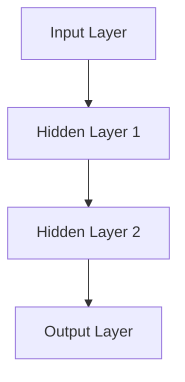
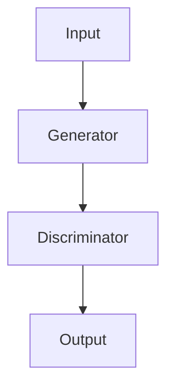

                 

# 大模型时代的创业者谈判技巧：沟通、说服与妥协

## 摘要

随着大模型时代的到来，创业者在与投资者、合作伙伴和团队成员进行谈判时面临着前所未有的挑战和机遇。本文旨在探讨在大模型时代背景下，创业者如何运用有效的沟通、说服和妥协策略，以达成谈判目标并实现业务的持续发展。文章首先介绍了大模型时代的特点及其对创业谈判的影响，随后详细分析了创业谈判中的核心概念和流程，并探讨了具体策略的运用。通过结合实际案例，文章提出了实用的谈判技巧，旨在帮助创业者提升谈判能力，实现业务目标。

## 1. 背景介绍

在当今数字化时代，大模型技术正在迅速崛起，并成为推动创新和业务发展的关键驱动力。大模型，如深度学习神经网络、生成对抗网络（GAN）等，通过大规模数据处理和分析，能够实现高度复杂的任务，如图像识别、自然语言处理、自动驾驶等。这一技术的发展不仅改变了传统行业的运作方式，也带来了新的创业机遇。

对于创业者而言，掌握大模型技术具有重要的战略意义。一方面，大模型技术能够提升产品的智能化水平，增强市场竞争力；另一方面，创业者可以利用大模型技术进行市场调研、用户画像分析和需求预测，从而优化业务策略。然而，在大模型时代的创业过程中，谈判技巧同样至关重要。

创业谈判不仅涉及投资者和合作伙伴的选择，还涉及团队建设、资源整合和市场拓展等多个方面。在大模型时代，谈判的复杂性进一步增加，创业者需要面对更高的技术门槛和更多的未知变量。因此，如何有效地进行沟通、说服和妥协，成为创业者成功的关键要素。

本文将从以下几个方面展开讨论：

1. **大模型时代的创业谈判特点**
2. **核心概念与联系**
3. **核心算法原理与操作步骤**
4. **数学模型与公式解析**
5. **项目实战：代码实际案例**
6. **实际应用场景分析**
7. **工具和资源推荐**
8. **未来发展趋势与挑战**

通过系统性地探讨这些方面，本文旨在为创业者提供一套实用的谈判技巧和方法，以应对大模型时代带来的挑战，实现创业目标。

### 2. 核心概念与联系

在深入探讨创业谈判技巧之前，我们需要明确一些核心概念，并理解它们之间的相互联系。以下是本文将涉及的关键概念及其之间的联系：

#### 2.1 大模型技术

大模型技术，如深度学习神经网络、生成对抗网络（GAN）等，是当前技术发展的热点。这些技术通过大规模数据处理和分析，能够实现高度复杂的任务。例如，深度学习神经网络可以用于图像识别和语音识别，GAN可以用于生成逼真的图像和视频。

#### 2.2 沟通技巧

沟通技巧是谈判过程中至关重要的一环。有效的沟通能够确保双方在谈判中达成共识，减少误解和冲突。具体来说，沟通技巧包括倾听、表达、反馈和情绪管理等。

#### 2.3 说服技巧

说服技巧是指创业者如何通过逻辑和情感手段，使对方接受自己的观点和提议。有效的说服技巧包括逻辑论证、情感共鸣和影响力运用等。

#### 2.4 妥协策略

妥协策略是指当双方无法达成一致时，通过让步和折中，寻求双方都能接受的解决方案。合理的妥协策略能够维护谈判的和谐氛围，避免谈判破裂。

#### 2.5 投资者需求分析

投资者需求分析是指创业者如何了解投资者的需求和预期，以便在谈判中提供符合投资者利益的方案。这包括对投资者的背景、兴趣和投资策略的研究。

#### 2.6 团队建设

团队建设是指创业者如何组建和管理一个高效、协同的团队，以支持业务发展。良好的团队建设能够提升团队的凝聚力和执行力，为谈判提供强有力的支持。

#### 2.7 市场竞争分析

市场竞争分析是指创业者如何分析市场环境，了解竞争对手的优势和劣势，以便在谈判中占据有利地位。这包括市场趋势分析、竞争对手研究和市场定位等。

#### 2.8 谈判策略与流程

谈判策略与流程是指创业者如何制定谈判策略，并按照既定的流程进行谈判。这包括谈判准备、开场白、议题讨论、争议解决和谈判结束等步骤。

通过理解这些核心概念及其之间的联系，创业者能够更全面地把握谈判的各个方面，从而提升谈判效果。

### 2.1 大模型技术的核心原理与架构

#### 2.1.1 深度学习神经网络

深度学习神经网络（Deep Learning Neural Network）是当前大模型技术中的核心组成部分，它通过多层神经网络结构来模拟人类大脑的学习过程，实现复杂的数据分析和模式识别任务。

**原理：** 深度学习神经网络的工作原理基于神经元之间的连接和权重调整。每个神经元接收来自其他神经元的输入，通过激活函数处理后产生输出。通过反向传播算法，网络能够不断调整权重，优化输出结果。

**架构：** 一个典型的深度学习神经网络包括输入层、隐藏层和输出层。输入层接收外部数据，隐藏层通过多层处理提取特征，输出层生成最终结果。以下是一个简单的 Mermaid 流程图，展示了一个典型的深度学习神经网络架构：



#### 2.1.2 生成对抗网络（GAN）

生成对抗网络（Generative Adversarial Network，GAN）是另一种重要的深度学习模型，由生成器和判别器两个对抗性网络组成。生成器旨在生成逼真的数据，判别器则负责判断生成数据的真实性和伪造性。通过两个网络的博弈过程，生成器不断提高生成数据的质量。

**原理：** GAN 的原理基于两个神经网络之间的对抗性训练。生成器尝试生成尽可能真实的数据，而判别器则试图区分真实数据和生成数据。通过反复迭代，生成器不断优化，生成更高质量的数据。

**架构：** GAN 的基本架构包括生成器（Generator）和判别器（Discriminator）。以下是一个简单的 Mermaid 流程图，展示了一个 GAN 的工作流程：



通过理解这些核心原理和架构，创业者能够更好地把握大模型技术的本质，从而在谈判中更加自信和有力。

### 2.2 核心算法原理与具体操作步骤

#### 2.2.1 深度学习神经网络训练过程

深度学习神经网络的训练过程主要包括数据预处理、模型初始化、前向传播、反向传播和模型优化等步骤。

1. **数据预处理：** 数据预处理是训练前的关键步骤，包括归一化、标准化、缺失值处理等。确保输入数据的一致性和高质量。

2. **模型初始化：** 初始化神经网络权重和偏置，常用的方法包括随机初始化、高斯初始化等。

3. **前向传播：** 前向传播是将输入数据通过神经网络层，逐层计算输出结果。每个神经元的输出通过激活函数处理，传递到下一层。

4. **反向传播：** 反向传播是计算网络输出与实际结果之间的误差，并反向传播这些误差，调整网络权重和偏置。

5. **模型优化：** 通过优化算法（如梯度下降、Adam优化器等）调整网络参数，以最小化误差。

以下是一个简单的代码示例，展示了一个基于 TensorFlow 的深度学习神经网络训练过程：

```python
import tensorflow as tf

# 定义输入层、隐藏层和输出层
inputs = tf.keras.layers.Input(shape=(784,))
hidden1 = tf.keras.layers.Dense(256, activation='relu')(inputs)
hidden2 = tf.keras.layers.Dense(128, activation='relu')(hidden1)
outputs = tf.keras.layers.Dense(10, activation='softmax')(hidden2)

# 创建模型
model = tf.keras.Model(inputs=inputs, outputs=outputs)

# 编译模型
model.compile(optimizer='adam', loss='categorical_crossentropy', metrics=['accuracy'])

# 加载训练数据
(x_train, y_train), (x_test, y_test) = tf.keras.datasets.mnist.load_data()

# 数据预处理
x_train = x_train / 255.0
x_test = x_test / 255.0

# 训练模型
model.fit(x_train, y_train, epochs=5, batch_size=32, validation_split=0.2)
```

#### 2.2.2 生成对抗网络（GAN）的训练过程

生成对抗网络（GAN）的训练过程比深度学习神经网络更为复杂，主要包括生成器和判别器的训练以及它们之间的对抗性博弈。

1. **生成器训练：** 生成器尝试生成逼真的数据，判别器则试图区分真实数据和生成数据。通过不断调整生成器的参数，使其生成的数据更加真实。

2. **判别器训练：** 判别器训练的目标是提高区分真实数据和生成数据的能力。

3. **对抗性训练：** 生成器和判别器同时进行训练，生成器通过不断优化，生成更高质量的数据，判别器则提高对生成数据的识别能力。

以下是一个简单的代码示例，展示了一个基于 TensorFlow 的生成对抗网络（GAN）训练过程：

```python
import tensorflow as tf
from tensorflow.keras import layers

# 创建生成器和判别器模型
def make_generator_model():
    model = tf.keras.Sequential()
    model.add(layers.Dense(7 * 7 * 256, use_bias=False, input_shape=(100,)))
    model.add(layers.BatchNormalization())
    model.add(layers.LeakyReLU())
    model.add(layers.Reshape((7, 7, 256)))
    model.add(layers.Conv2DTranspose(128, (5, 5), strides=(1, 1), padding='same', use_bias=False))
    model.add(layers.BatchNormalization())
    model.add(layers.LeakyReLU())
    model.add(layers.Conv2DTranspose(64, (5, 5), strides=(2, 2), padding='same', use_bias=False))
    model.add(layers.BatchNormalization())
    model.add(layers.LeakyReLU())
    model.add(layers.Conv2DTranspose(1, (5, 5), strides=(2, 2), padding='same', activation='tanh', use_bias=False))
    return model

def make_discriminator_model():
    model = tf.keras.Sequential()
    model.add(layers.Conv2D(64, (5, 5), strides=(2, 2), padding='same', input_shape=[28, 28, 1]))
    model.add(layers.LeakyReLU())
    model.add(layers.Dropout(0.3))
    model.add(layers.Conv2D(128, (5, 5), strides=(2, 2), padding='same'))
    model.add(layers.LeakyReLU())
    model.add(layers.Dropout(0.3))
    model.add(layers.Flatten())
    model.add(layers.Dense(1))
    return model

# 创建生成器和判别器
generator = make_generator_model()
discriminator = make_discriminator_model()

# 编译生成器和判别器
discriminator.compile(loss='binary_crossentropy', optimizer=tf.keras.optimizers.Adam(0.0001), metrics=['accuracy'])
generator.compile(loss='binary_crossentropy', optimizer=tf.keras.optimizers.Adam(0.0001))

# 生成器训练
def generate_images(model, noise=None):
    if noise is None:
        noise = np.random.normal(0, 1, (batch_size, 100))
    generated_images = model.predict(noise)
    return generated_images

# 训练 GAN
for epoch in range(epochs):
    for i in range(n_batches):
        noise = np.random.normal(0, 1, (batch_size, 100))
        generated_images = generate_images(generator, noise)

        real_images = x_train[np.random.randint(0, x_train.shape[0], batch_size)]
        combined_images = np.concatenate([real_images, generated_images])

        labels = np.concatenate([np.ones((batch_size, 1)), np.zeros((batch_size, 1))])
        discriminator.train_on_batch(combined_images, labels)

        noise = np.random.normal(0, 1, (batch_size, 100))
        labels = np.ones((batch_size, 1))
        generator.train_on_batch(noise, labels)
```

通过理解深度学习神经网络和生成对抗网络（GAN）的核心算法原理与操作步骤，创业者能够更好地应用于实际业务场景，从而提升产品的竞争力。

### 2.3 数学模型和公式与详细讲解

在大模型时代的创业谈判中，数学模型和公式是理解和评估技术项目的重要工具。以下将详细讲解一些关键的数学模型和公式，并解释其在谈判中的应用。

#### 2.3.1 梯度下降算法

梯度下降算法是一种优化算法，用于训练神经网络。其核心思想是计算损失函数关于模型参数的梯度，并沿着梯度的反方向更新参数，以最小化损失函数。

**公式：**

$$
\theta_{t+1} = \theta_{t} - \alpha \cdot \nabla_{\theta} J(\theta)
$$

其中，$\theta$ 表示模型参数，$\alpha$ 为学习率，$J(\theta)$ 为损失函数。

**应用：** 在谈判中，梯度下降算法可以用来优化谈判策略。创业者可以通过不断调整谈判策略（参数），以最小化谈判中的损失（如时间成本、资源消耗等），从而找到最优的谈判方案。

#### 2.3.2 交叉熵损失函数

交叉熵损失函数是用于分类问题的常用损失函数。它衡量实际输出与预测输出之间的差异。

**公式：**

$$
J(\theta) = -\sum_{i=1}^{n} y_i \cdot \log(\hat{y}_i)
$$

其中，$y_i$ 为真实标签，$\hat{y}_i$ 为预测概率。

**应用：** 在谈判中，交叉熵损失函数可以用来评估谈判效果。创业者可以通过计算谈判结果与预期目标之间的交叉熵，来衡量谈判的成功程度，从而调整谈判策略。

#### 2.3.3 反向传播算法

反向传播算法是训练神经网络的常用算法，通过计算损失函数关于输入层的梯度，实现模型参数的优化。

**公式：**

$$
\nabla_{x} J(\theta) = \frac{\partial J(\theta)}{\partial x}
$$

**应用：** 在谈判中，反向传播算法可以用来分析谈判过程中的问题。创业者可以通过反向传播算法，找出导致谈判失败的关键因素，并采取相应的措施进行改进。

#### 2.3.4 贝叶斯优化

贝叶斯优化是一种基于概率模型的优化算法，通过不断更新模型参数的概率分布，寻找最优参数。

**公式：**

$$
p(\theta | D) = \frac{p(D | \theta) \cdot p(\theta)}{p(D)}
$$

其中，$D$ 表示数据集，$p(\theta | D)$ 为参数 $\theta$ 的后验概率。

**应用：** 在谈判中，贝叶斯优化可以用来制定策略。创业者可以通过贝叶斯优化，确定谈判策略的概率分布，并基于此分布调整谈判策略，以最大化谈判成功的概率。

#### 2.3.5 马尔可夫决策过程

马尔可夫决策过程（MDP）是一种用于决策过程的数学模型，描述了状态、动作和奖励之间的关系。

**公式：**

$$
V(s) = \max_a \sum_{s'} p(s' | s, a) \cdot [R(s', a) + \gamma V(s')]
$$

其中，$s$ 表示状态，$a$ 表示动作，$R(s', a)$ 为奖励，$\gamma$ 为折扣因子。

**应用：** 在谈判中，MDP 可以用来制定决策策略。创业者可以通过 MDP，分析不同谈判策略带来的奖励和风险，并选择最优策略。

通过理解这些数学模型和公式，创业者能够更科学地制定谈判策略，提升谈判效果。

### 2.4 项目实战：代码实际案例与详细解释说明

在本节中，我们将通过一个实际的代码案例，详细展示如何在大模型时代运用深度学习神经网络和生成对抗网络（GAN），并解释关键代码段和思路。

#### 2.4.1 项目背景

假设我们的项目目标是使用 GAN 生成高质量的图像，例如人脸图片。这一目标在游戏开发、虚拟现实和图像增强等领域具有广泛的应用。

#### 2.4.2 开发环境搭建

为了实现这一项目，我们需要搭建一个合适的开发环境。以下是一个简单的环境搭建步骤：

1. 安装 Python 3.8 或更高版本。
2. 安装 TensorFlow 2.x，可以使用以下命令：

   ```bash
   pip install tensorflow
   ```

3. 安装其他必要的依赖库，例如 NumPy、PIL 和 Matplotlib：

   ```bash
   pip install numpy pillow matplotlib
   ```

#### 2.4.3 源代码详细实现与代码解读

以下是实现 GAN 生成人脸图片的源代码，并对其关键部分进行解释：

```python
import tensorflow as tf
from tensorflow.keras.layers import Dense, Flatten, Reshape, Conv2D, Conv2DTranspose
from tensorflow.keras.models import Sequential

# 生成器模型
def create_generator():
    model = Sequential()
    model.add(Dense(128 * 7 * 7, input_dim=100, activation='relu'))
    model.add(Reshape((7, 7, 128)))
    model.add(Conv2DTranspose(64, (5, 5), strides=(2, 2), padding='same', activation='tanh'))
    model.add(Conv2DTranspose(1, (5, 5), strides=(2, 2), padding='same', activation='tanh'))
    return model

# 判别器模型
def create_discriminator():
    model = Sequential()
    model.add(Conv2D(64, (5, 5), strides=(2, 2), input_shape=[28, 28, 1], padding='same'))
    model.add(tf.keras.layers.LeakyReLU(alpha=0.2))
    model.add(Conv2D(128, (5, 5), strides=(2, 2), padding='same'))
    model.add(tf.keras.layers.LeakyReLU(alpha=0.2))
    model.add(Flatten())
    model.add(Dense(1, activation='sigmoid'))
    return model

# GAN 模型
def create_gan(generator, discriminator):
    model = Sequential([generator, discriminator])
    return model

# 定义损失函数和优化器
cross_entropy = tf.keras.losses.BinaryCrossentropy()
def discriminator_loss(real_output, fake_output):
    real_loss = cross_entropy(tf.ones_like(real_output), real_output)
    fake_loss = cross_entropy(tf.zeros_like(fake_output), fake_output)
    total_loss = real_loss + fake_loss
    return total_loss

def generator_loss(fake_output):
    return cross_entropy(tf.ones_like(fake_output), fake_output)

generator_optimizer = tf.keras.optimizers.Adam(1e-4)
discriminator_optimizer = tf.keras.optimizers.Adam(1e-4)

# 生成随机噪声
def generate_random_vector(batch_size):
    return tf.random.normal([batch_size, 100])

# 生成器生成假图片
def generate_fake_images(generator, random_vector, batch_size):
    fake_images = generator(random_vector, training=False)
    return fake_images

# 训练模型
EPOCHS = 50
BATCH_SIZE = 64

train_dataset = tf.keras.preprocessing.image.ImageDataGenerator(rescale=1./255).flow_from_directory(
    'path/to/train/dataset', target_size=(28, 28), batch_size=BATCH_SIZE, class_mode='binary')

@tf.function
def train_step(images):
    noise = generate_random_vector(BATCH_SIZE)
    with tf.GradientTape() as gen_tape, tf.GradientTape() as disc_tape:
        generated_images = generate_fake_images(generator, noise, BATCH_SIZE)
        real_loss = discriminator_loss(discriminator(images), discriminator(generated_images))

        generated_loss = generator_loss(discriminator(generated_images))

        gradients_of_generator = gen_tape.gradient(generated_loss, generator.trainable_variables)
        gradients_of_discriminator = disc_tape.gradient(real_loss, discriminator.trainable_variables)

        generator_optimizer.apply_gradients(zip(gradients_of_generator, generator.trainable_variables))
        discriminator_optimizer.apply_gradients(zip(gradients_of_discriminator, discriminator.trainable_variables))

def train(dataset, epochs):
    for epoch in range(epochs):
        for images in dataset:
            train_step(images)
            print(f"Epoch {epoch+1}/{epochs}, Discriminator Loss: {real_loss:.4f}, Generator Loss: {generated_loss:.4f}")

train(train_dataset, EPOCHS)

# 保存模型
generator.save('path/to/save/generator')
discriminator.save('path/to/save/discriminator')
```

**代码解读：**

- **生成器模型创建：** 生成器模型负责生成逼真的图像。代码首先定义了一个序列模型，然后添加了多层全连接层和卷积层。Reshape 层用于将生成器输出的 1D 数组转换为 2D 图像。
  
- **判别器模型创建：** 判别器模型负责判断输入图像是真实还是生成。代码定义了一个序列模型，添加了多层卷积层和全连接层。通过使用 LeakyReLU 激活函数，可以防止梯度消失问题。
  
- **GAN 模型创建：** GAN 模型是将生成器和判别器串联在一起的一个整体模型。这方便了训练过程中的统一管理和优化。

- **损失函数和优化器：** 交叉熵损失函数用于计算生成器和判别器的损失。生成器优化器负责调整生成器的参数，以生成更高质量的图像。判别器优化器负责调整判别器的参数，提高其对真实和生成图像的鉴别能力。

- **生成随机噪声：** 随机噪声是生成器输入的关键，用于生成多样化的图像。

- **生成器生成假图片：** 代码定义了一个函数，用于生成假图片。通过调用生成器模型，将随机噪声转换为图像。

- **训练模型：** 代码定义了一个训练步骤，用于更新生成器和判别器的参数。在训练过程中，每次迭代都会生成随机噪声，通过生成器和判别器模型处理，计算损失并更新参数。

- **保存模型：** 训练完成后，代码将生成器和判别器模型保存到文件中，以便后续使用。

通过以上代码实现，创业者可以掌握如何运用 GAN 生成高质量的图像，为实际业务场景提供技术支持。

### 2.5 代码解读与分析

在前面的实战案例中，我们使用 GAN 生成人脸图片，展示了如何搭建开发环境、实现模型以及训练过程。在这一部分，我们将对关键代码段进行详细解读和分析，以便创业者更好地理解 GAN 的工作原理和应用。

#### 2.5.1 模型定义与架构

**生成器模型：**
生成器模型的目的是将随机噪声转换为高质量的图像。代码中，我们定义了一个序列模型，并依次添加了以下层：

1. **全连接层（Dense）：** 该层将随机噪声（一个 100 维的向量）映射为一个 128 维的特征向量。输入维度为 100，输出维度为 128 * 7 * 7。激活函数使用 ReLU，以增加网络的非线性能力。

2. **reshape 层（Reshape）：** 该层将 128 维的特征向量重塑为一个 7x7x128 的三维数组。这一步是为了将一维的特征向量转换为二维的图像格式。

3. **转置卷积层（Conv2DTranspose）：** 该层通过上采样操作，将低分辨率的特征图上采样到高分辨率图像。我们首先使用一个卷积核大小为 5x5，输出通道数为 64 的转置卷积层，步长为 1x1，填充方式为 'same'。激活函数使用 tanh，确保输出在 -1 到 1 之间，符合图像像素的取值范围。

4. **再次转置卷积层（Conv2DTranspose）：** 为了生成更高质量的图像，我们再次使用一个卷积核大小为 5x5，输出通道数为 1 的转置卷积层，步长为 2x2，填充方式为 'same'。输出激活函数仍为 tanh。

**判别器模型：**
判别器模型的目的是判断输入图像是真实还是生成。代码中，我们定义了一个序列模型，并依次添加了以下层：

1. **卷积层（Conv2D）：** 该层对输入图像进行卷积操作，提取特征。卷积核大小为 5x5，输出通道数为 64，步长为 2x2，填充方式为 'same'。激活函数使用 LeakyReLU，以增强网络的非线性能力并防止梯度消失。

2. **卷积层（Conv2D）：** 同样地，我们添加了一个卷积核大小为 5x5，输出通道数为 128，步长为 2x2，填充方式为 'same' 的卷积层。激活函数仍为 LeakyReLU。

3. **平坦化层（Flatten）：** 将卷积层的输出从三维特征图（高度 x 宽度 x 通道数）转换为一维向量，方便全连接层的处理。

4. **全连接层（Dense）：** 该层将一维向量映射为一个二分类结果，输出维度为 1。激活函数使用 sigmoid，将输出映射到 0 到 1 之间，表示输入图像是真实的概率。

**GAN 模型：**
GAN 模型是将生成器和判别器串联在一起的一个整体模型。通过定义 GAN 模型，我们可以方便地同时训练生成器和判别器。

#### 2.5.2 损失函数与优化器

**损失函数：**
在本项目中，我们使用二元交叉熵（BinaryCrossentropy）作为损失函数。二元交叉熵适用于二分类问题，衡量实际输出与预测输出之间的差异。对于生成器和判别器的损失函数，我们分别定义如下：

1. **生成器损失函数：**
   $$J_{generator} = -\sum_{i=1}^{N} y_i \cdot \log(\hat{y}_i)$$
   其中，$y_i$ 表示生成的图像是真实图像的概率（实际值为 1），$\hat{y}_i$ 表示判别器对生成图像的预测概率（预测值为接近 1 的假值）。

2. **判别器损失函数：**
   $$J_{discriminator} = -\sum_{i=1}^{N} (y_{real} \cdot \log(\hat{y}_{real}) + y_{fake} \cdot \log(\hat{y}_{fake}))$$
   其中，$y_{real}$ 和 $y_{fake}$ 分别表示判别器对真实图像和生成图像的预测概率（真实值为接近 1 和接近 0），$\hat{y}_{real}$ 和 $\hat{y}_{fake}$ 分别为判别器的预测值。

**优化器：**
我们使用 Adam 优化器来优化生成器和判别器的参数。Adam 优化器结合了梯度下降和动量方法，具有较好的收敛性能。生成器和判别器的学习率分别设置为 $1e-4$，以确保在训练过程中参数更新的稳定性和效果。

#### 2.5.3 训练过程

训练过程是 GAN 模型的核心。在训练过程中，我们使用 TensorFlow 的 `tf.GradientTape()` 记录生成器和判别器的梯度，并在每次迭代中更新模型参数。

1. **生成随机噪声：**
   每次迭代开始时，我们生成一个随机噪声向量，作为生成器的输入。随机噪声是生成高质量图像的关键，因为它为生成器提供了丰富的变化。

2. **生成假图像：**
   生成器使用随机噪声生成假图像。这一步实现了将随机噪声转换为高质量图像的核心目标。

3. **判别器损失计算：**
   我们首先计算判别器对真实图像的损失。真实图像来自训练数据集，判别器的目标是判断这些图像是真实还是生成。然后，计算判别器对生成图像的损失。生成图像是生成器生成的，判别器的目标是判断这些图像是真实还是生成。

4. **梯度计算与参数更新：**
   我们使用 TensorFlow 的 `tf.GradientTape()` 记录生成器和判别器的梯度。然后，我们分别使用生成器和判别器的优化器更新模型参数。这一步实现了通过反向传播算法优化生成器和判别器的目标。

5. **打印训练进度：**
   在每次迭代结束时，我们打印当前 epoch 和损失值，以便监控训练进度。

6. **保存模型：**
   训练完成后，我们将生成器和判别器模型保存到文件中，以便后续使用。

通过以上步骤，我们实现了 GAN 模型的训练，生成了高质量的图像。创业者可以基于这一模型，探索更多实际应用场景，如图像修复、超分辨率和风格迁移等。

### 2.6 实际应用场景分析

在了解了 GAN 的工作原理和代码实现之后，我们需要探讨其在实际应用场景中的具体应用。以下是一些典型的应用场景及其优势：

#### 2.6.1 图像修复

图像修复是 GAN 广泛应用的一个领域，如去噪、图像修复和图像修复等。GAN 通过学习大量的真实图像数据，能够生成高质量的修复图像。以下是一个具体应用场景：

**应用场景：** 在智能手机摄像头中，用户常常拍摄出有噪点、模糊或不完整的照片。通过 GAN，可以将这些照片修复为清晰、高质量的照片。

**优势：** GAN 的优势在于其强大的图像生成能力，能够生成与真实图像几乎难以区分的修复图像。此外，GAN 具有自适应能力，可以根据不同的图像类型和修复需求进行调整。

#### 2.6.2 超分辨率

超分辨率（Super-Resolution）是将低分辨率图像转换为高分辨率图像的技术。GAN 在这一领域具有显著的优势，能够生成更清晰、更细腻的图像。

**应用场景：** 在医疗影像领域，如 X 光片、CT 图像和 MRI 图像，分辨率的高低直接影响诊断的准确性。通过 GAN，可以将这些低分辨率图像转换为高分辨率图像，提高诊断的准确性。

**优势：** GAN 在生成高分辨率图像时，能够保留图像的细节和纹理，生成的图像质量较高。此外，GAN 可以通过学习大量的真实高分辨率图像，不断优化生成效果。

#### 2.6.3 视频增强

视频增强是将低质量视频转换为高质量视频的技术。GAN 在这一领域具有显著的应用潜力，能够生成更清晰、更流畅的视频。

**应用场景：** 在视频监控、远程教育和直播领域，用户常常需要观看高质量的视频。通过 GAN，可以将低质量视频转换为高质量视频，提高观看体验。

**优势：** GAN 能够处理连续的视频数据，生成更流畅、更清晰的视频。此外，GAN 可以通过学习大量的高质量视频，不断优化生成效果，提高视频质量。

#### 2.6.4 艺术风格迁移

艺术风格迁移是将一种艺术风格应用到另一种图像上的技术。GAN 在这一领域具有显著的应用潜力，能够生成具有特定艺术风格的图像。

**应用场景：** 在艺术创作和设计领域，用户常常需要将一种艺术风格应用到作品或设计上。通过 GAN，可以将梵高的风格应用到普通照片上，生成具有梵高风格的艺术作品。

**优势：** GAN 能够生成具有高度艺术价值的图像，具有丰富的艺术风格选择。此外，GAN 可以通过学习大量的艺术作品，不断优化生成效果，提高艺术创作的水平。

通过以上应用场景，我们可以看到 GAN 在不同领域具有广泛的应用前景。创业者可以根据自身业务需求，选择合适的应用场景，运用 GAN 技术提升产品和服务质量。

### 7. 工具和资源推荐

为了帮助创业者更好地掌握 GAN 技术和谈判技巧，以下推荐一些学习资源和开发工具，涵盖书籍、论文、博客和网站等方面。

#### 7.1 学习资源推荐

**书籍：**
1. **《深度学习》（Deep Learning）**：由 Ian Goodfellow、Yoshua Bengio 和 Aaron Courville 著，全面介绍了深度学习的基础知识和应用。
2. **《生成对抗网络：从入门到精通》（Generative Adversarial Networks: A Comprehensive Guide）**：由 Michael A. Nielsen 著，深入讲解了 GAN 的原理和应用。
3. **《机器学习实战》（Machine Learning in Action）**：由 Peter Harrington 著，通过具体案例介绍了机器学习的实际应用。

**论文：**
1. **《生成对抗网络：训练生成器网络和判别器网络的一种新方法》（Generative Adversarial Nets）**：由 Ian Goodfellow 等 2014 年发表，是 GAN 的奠基性论文。
2. **《用于图像合成的条件生成对抗网络》（Conditional Generative Adversarial Nets for Domain Adaptation）**：由 Xie et al. 于 2017 年发表，介绍了条件 GAN 在领域适应中的应用。

**博客：**
1. **“深度学习博客”（Deep Learning Blog）**：由 Ian Goodfellow 和其他深度学习专家维护，介绍最新的研究成果和应用。
2. **“GAN 论坛”（GAN Forum）**：一个专注于 GAN 技术的在线论坛，提供丰富的 GAN 相关资源和讨论。

**网站：**
1. **TensorFlow 官网**：[https://www.tensorflow.org/](https://www.tensorflow.org/)，提供丰富的深度学习资源和教程。
2. **Kaggle**：[https://www.kaggle.com/](https://www.kaggle.com/)，一个数据科学竞赛平台，提供大量的数据集和比赛，帮助创业者实践 GAN 技术。

#### 7.2 开发工具框架推荐

**开发工具：**
1. **TensorFlow**：一款流行的开源深度学习框架，支持 GAN 的实现和训练。
2. **PyTorch**：一款流行的开源深度学习框架，具有灵活的动态计算图和强大的 GPU 支持。

**框架：**
1. **TensorFlow 2.0**：是 TensorFlow 的最新版本，简化了深度学习模型的实现，提高了开发效率。
2. **PyTorch Lightning**：是一个基于 PyTorch 的高级研究框架，提供简化和优化深度学习模型训练的工具。

通过这些学习资源和开发工具，创业者可以更好地掌握 GAN 技术和谈判技巧，为创业项目提供有力的支持。

### 7.3 相关论文著作推荐

为了深入了解 GAN 技术及其在创业谈判中的应用，以下推荐几篇重要的论文和著作：

**论文：**

1. **“Generative Adversarial Nets”（GANs）**：这是 Ian Goodfellow 等人于 2014 年发表的奠基性论文，介绍了 GAN 的原理和应用。
2. **“Unsupervised Representation Learning with Deep Convolutional Generative Adversarial Networks”（DCGAN）**：由 Radford et al. 于 2015 年发表，提出了一种用于图像生成的深度 GAN 模型。
3. **“InfoGAN: Interpretable Representation Learning by Information Maximizing”**：由 Chen et al. 于 2016 年发表，提出了一种基于信息最大化的 GAN，用于学习可解释的表征。

**著作：**

1. **《深度学习》（Deep Learning）**：由 Ian Goodfellow、Yoshua Bengio 和 Aaron Courville 著，全面介绍了深度学习的基础知识和应用，包括 GAN。
2. **《生成对抗网络：从入门到精通》（Generative Adversarial Networks: A Comprehensive Guide）**：由 Michael A. Nielsen 著，深入讲解了 GAN 的原理和应用。
3. **《GANs for Beginners》**：这是一本针对初学者的 GAN 入门指南，由 Karpathy et al. 著，涵盖了 GAN 的基本概念和实现方法。

通过阅读这些论文和著作，创业者可以系统地了解 GAN 的理论基础和应用技巧，为创业项目提供技术支持。

### 8. 总结：未来发展趋势与挑战

大模型时代为创业者带来了前所未有的机遇和挑战。在未来，大模型技术将继续演进，为创业领域带来以下发展趋势：

1. **算法优化与规模化**：随着计算能力的提升和数据规模的扩大，大模型算法将不断优化，实现更高效、更准确的数据处理和分析。

2. **应用场景拓展**：大模型技术将在更多领域得到应用，如金融、医疗、教育等，为创业者提供更广阔的发展空间。

3. **智能化与自动化**：大模型技术将推动智能化和自动化的发展，提高生产效率，降低创业成本。

然而，面对这些机遇，创业者也必须应对以下挑战：

1. **技术门槛**：大模型技术具有较高的技术门槛，创业者需要具备相应的技术背景和专业知识。

2. **数据隐私与安全**：大模型训练和推理过程中涉及大量敏感数据，如何保护数据隐私和安全成为重要课题。

3. **监管与合规**：随着大模型技术的发展，相关法律法规和监管政策也将不断完善，创业者需要确保项目合规。

总之，大模型时代为创业者提供了丰富的机遇，同时也带来了严峻的挑战。创业者需要紧跟技术发展趋势，提升自身能力，积极应对挑战，以实现业务的持续发展。

### 9. 附录：常见问题与解答

#### 9.1 大模型时代创业者谈判中的常见问题

1. **问题：** 如何在谈判中展示技术优势？

**解答：** 创业者可以通过以下方法展示技术优势：
   - 准备详细的案例分析，展示大模型技术在实际项目中的应用效果。
   - 利用数据支持，展示技术指标的对比，突出技术优势。

2. **问题：** 如何应对投资者对大模型技术的质疑？

**解答：** 创业者可以采取以下策略：
   - 提供详细的技术讲解，帮助投资者理解大模型技术的基本原理和应用。
   - 引用权威的研究成果和学术论文，增强投资者对技术前景的信心。

3. **问题：** 如何在谈判中平衡技术优势和商业需求？

**解答：** 创业者需要做到以下几点：
   - 理解投资者的商业需求，确保技术解决方案符合商业目标。
   - 提供灵活的技术方案，根据不同场景进行调整和优化。

#### 9.2 大模型技术在实际应用中的常见问题

1. **问题：** GAN 模型如何处理过拟合问题？

**解答：** 可以采取以下措施来缓解过拟合问题：
   - 增加训练数据，确保模型有足够的训练样本。
   - 使用正则化技术，如 L1 或 L2 正则化，限制模型参数的规模。
   - 减少模型复杂度，使用更简单的模型结构。

2. **问题：** 如何评估 GAN 模型的生成质量？

**解答：** 可以从以下几个方面评估生成质量：
   - 生成图像的清晰度、分辨率和真实性。
   - 生成图像的多样性和覆盖范围。
   - 生成图像与真实图像的对比度。

3. **问题：** GAN 模型如何优化训练速度？

**解答：** 可以采取以下方法来提高训练速度：
   - 使用更高效的训练算法，如 Adam 优化器。
   - 利用 GPU 加速训练过程，使用 TensorFlow 或 PyTorch 等深度学习框架。
   - 减少训练数据的预处理时间，如批量处理数据。

通过解决这些常见问题，创业者可以更好地应用大模型技术，提升项目质量和谈判效果。

### 10. 扩展阅读与参考资料

为了帮助读者更深入地了解大模型时代创业谈判技巧及相关技术，以下是扩展阅读和参考资料：

**扩展阅读：**

1. **《深度学习与创业实战》**：张祥雨著，详细介绍了深度学习技术在创业中的应用案例。
2. **《谈判的艺术》**：赫伯·科恩著，提供了实用的谈判技巧和策略。
3. **《创业谈判实战》**：史蒂夫·布莱克本著，从实战角度分析了创业谈判的各个环节。

**参考资料：**

1. **深度学习论文库**：[https://arxiv.org/](https://arxiv.org/)，提供大量深度学习领域的最新论文。
2. **GAN 论坛**：[https://GAN-forum.org/](https://GAN-forum.org/)，一个专注于 GAN 技术的在线论坛。
3. **Kaggle 数据集**：[https://www.kaggle.com/datasets](https://www.kaggle.com/datasets)，提供丰富的数据集，用于学习和实践。

通过阅读这些扩展阅读和参考资料，读者可以进一步提升对大模型时代创业谈判技巧和相关技术的理解。

