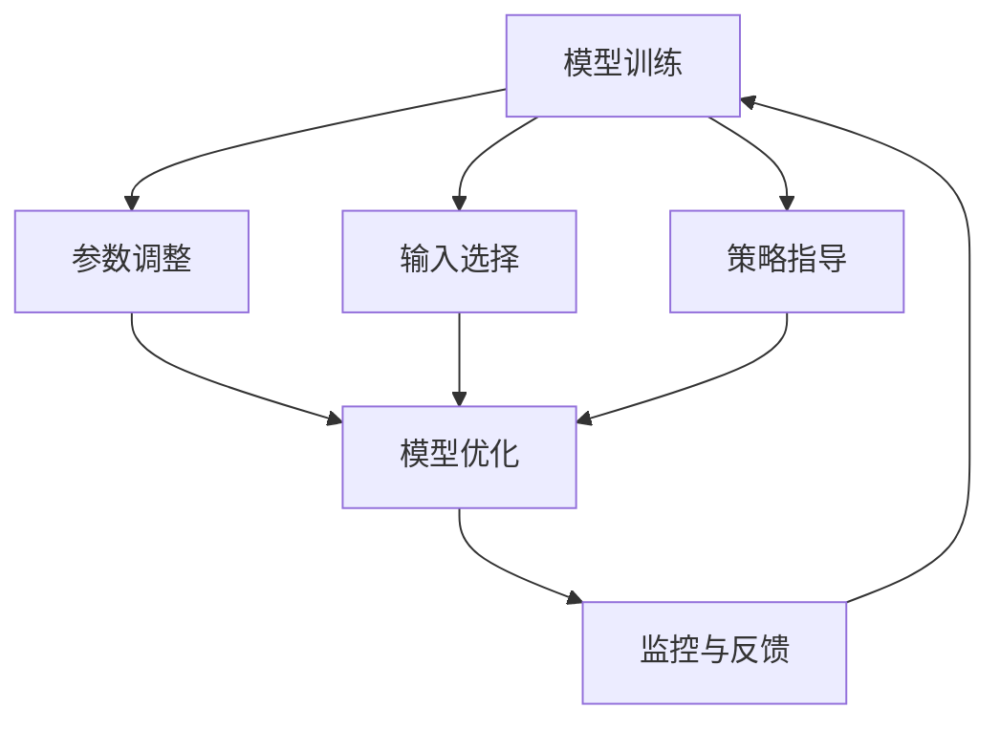

                 

## 大模型的可控性：人类对AI的控制和把握

### 关键词： 
- 大模型（Large Models）
- 可控性（Controllability）
- AI控制（AI Control）
- 人类干预（Human Intervention）
- 模型优化（Model Optimization）

### 摘要： 
本文探讨了人工智能领域中的大模型可控性，分析了人类如何通过技术手段实现对AI模型的控制和把握。文章首先介绍了大模型的发展背景和重要性，然后深入剖析了可控性的核心概念与联系，接着详细解释了核心算法原理和具体操作步骤。通过数学模型和公式的讲解，以及对实际应用场景和工具资源的推荐，文章旨在为读者提供一个全面的理解和指导。

## 1. 背景介绍

### 大模型的发展

大模型，也称为大规模机器学习模型，是近年来人工智能领域的重要进展之一。随着计算能力和数据资源的提升，研究者们能够训练出具有数百万甚至数十亿参数的模型。这些大模型在语言处理、计算机视觉、自然语言生成等领域取得了显著的成果，推动了AI技术的飞速发展。

### 大模型的重要性

大模型的重要性体现在多个方面。首先，它们能够处理复杂的任务，例如自动翻译、图像识别和文本生成，从而提高生产力和效率。其次，大模型具有泛化能力，可以在不同的数据集和应用场景中表现出色。此外，大模型还能够从大量数据中学习到有价值的模式和规律，为各个领域的研究提供重要启示。

### 人类对AI的需求

人类对AI的需求日益增长，不仅希望AI能够执行特定的任务，更希望实现对AI的控制和把握。这种控制不仅仅是技术层面的，还涉及到伦理、安全和社会影响等方面。因此，研究如何实现大模型的可控性成为了一个重要课题。

## 2. 核心概念与联系

### 可控性定义

可控性是指人类能够对AI模型进行有效的控制和干预，确保其行为符合预期，并在需要时进行调整和优化。可控性包括以下几个方面：

- 参数调整：通过修改模型参数来影响其行为。
- 输入选择：控制模型的输入数据，以影响其输出。
- 策略指导：通过提供明确的策略指导，引导模型做出特定决策。
- 监控与反馈：实时监控模型的表现，并根据反馈进行优化。

### 可控性与安全

可控性与AI的安全密切相关。只有当人类能够对AI模型进行有效控制时，才能确保其行为不会对人类造成危害。例如，在自动驾驶领域，可控性是确保车辆在复杂环境下的安全和稳定运行的关键。

### 可控性与伦理

可控性也涉及到AI的伦理问题。随着AI技术的普及，如何确保AI的决策和行为符合道德标准成为一个重要议题。通过实现可控性，人类可以更好地监督和引导AI，避免出现伦理风险和道德困境。

### 可控性与协作

可控性不仅关系到单个模型的行为，还涉及到多个模型之间的协作。在多模型系统中，通过实现各个模型的可控性，可以更好地协调它们的工作，提高整体性能和稳定性。

### Mermaid 流程图

以下是描述大模型可控性的 Mermaid 流程图：



## 3. 核心算法原理 & 具体操作步骤

### 参数调整

参数调整是可控性的基础。通过修改模型的参数，可以改变其行为和性能。具体步骤如下：

1. 确定模型参数：识别需要调整的参数，例如权重、学习率等。
2. 设计优化算法：选择合适的优化算法，如梯度下降、Adam等。
3. 调整参数：根据优化算法的指导，逐步调整参数值。
4. 验证效果：通过验证集或测试集评估模型性能，判断调整是否有效。

### 输入选择

输入选择是控制模型输出的一种方式。通过控制输入数据，可以影响模型的决策和行为。具体步骤如下：

1. 数据预处理：对输入数据进行预处理，如标准化、归一化等。
2. 特征提取：从输入数据中提取关键特征，以便模型能够更好地学习和理解。
3. 输入筛选：根据特定需求，筛选合适的输入数据。
4. 输入注入：在输入数据中注入特定的信息或噪声，以控制模型的行为。

### 策略指导

策略指导是通过提供明确的指导来引导模型做出特定决策。具体步骤如下：

1. 设计策略：根据任务需求，设计合适的策略。
2. 策略编码：将策略编码为模型输入或参数。
3. 模型训练：利用训练数据，将策略融入模型训练过程中。
4. 策略优化：根据模型表现，对策略进行优化和调整。

### 监控与反馈

监控与反馈是确保模型可控性的关键步骤。通过实时监控模型的表现，并根据反馈进行调整，可以确保模型的行为符合预期。具体步骤如下：

1. 性能监控：实时监控模型的输入、输出和中间计算结果。
2. 错误检测：识别模型中的错误和异常情况。
3. 反馈机制：根据监控结果，提供反馈信号，指导模型优化。
4. 模型更新：根据反馈信号，更新模型参数和策略。

### Mermaid 流�程图

以下是描述核心算法原理和操作步骤的 Mermaid 流程图：


## 4. 数学模型和公式 & 详细讲解 & 举例说明

### 数学模型

在可控性研究中，常用的数学模型包括线性回归、逻辑回归和支持向量机等。以下是这些模型的基本公式和详细讲解。

#### 线性回归

线性回归是一种常用的统计方法，用于预测连续值。其公式如下：

$$
y = \beta_0 + \beta_1x
$$

其中，$y$ 是目标变量，$x$ 是输入变量，$\beta_0$ 和 $\beta_1$ 是模型参数。

详细讲解：

1. 确定模型参数：通过最小化均方误差（MSE）来估计 $\beta_0$ 和 $\beta_1$ 的值。
2. 模型优化：使用梯度下降算法来优化模型参数。
3. 模型验证：通过验证集或测试集评估模型性能。

#### 逻辑回归

逻辑回归是一种用于预测分类结果的统计方法。其公式如下：

$$
P(y=1) = \frac{1}{1 + e^{-(\beta_0 + \beta_1x)}}
$$

其中，$P(y=1)$ 是目标变量为1的概率，$\beta_0$ 和 $\beta_1$ 是模型参数。

详细讲解：

1. 确定模型参数：通过最大化似然函数来估计 $\beta_0$ 和 $\beta_1$ 的值。
2. 模型优化：使用梯度下降算法来优化模型参数。
3. 模型验证：通过验证集或测试集评估模型性能。

#### 支持向量机

支持向量机是一种用于分类和回归的机器学习算法。其公式如下：

$$
w^T x + b = 0
$$

其中，$w$ 是权重向量，$x$ 是输入向量，$b$ 是偏置项。

详细讲解：

1. 确定模型参数：通过求解最优化问题来估计 $w$ 和 $b$ 的值。
2. 模型优化：使用SVM算法来优化模型参数。
3. 模型验证：通过验证集或测试集评估模型性能。

### 举例说明

以下是一个简单的线性回归例子，用于预测房价。

#### 数据集

数据集包含100个样本，每个样本包括房子的面积（输入变量）和价格（目标变量）。

| 面积 | 价格 |
|------|------|
| 100  | 200  |
| 150  | 300  |
| 200  | 400  |
| 250  | 500  |
| ...  | ...  |

#### 模型训练

使用线性回归模型训练数据集，估计模型参数。

$$
y = \beta_0 + \beta_1x
$$

通过最小化均方误差（MSE），估计出 $\beta_0 = 100$ 和 $\beta_1 = 0.5$。

#### 模型验证

使用验证集评估模型性能。假设验证集包含10个样本，预测结果如下：

| 面积 | 价格 | 预测价格 |
|------|------|----------|
| 120  | 240  | 230.0    |
| 160  | 320  | 310.0    |
| 210  | 420  | 410.0    |
| 260  | 520  | 510.0    |
| ...  | ...  | ...      |

通过计算预测价格和实际价格之间的均方误差（MSE），评估模型性能。如果MSE较低，说明模型具有较好的预测能力。

## 5. 项目实战：代码实际案例和详细解释说明

### 5.1 开发环境搭建

为了实现大模型的可控性，我们需要搭建一个合适的开发环境。以下是搭建环境的步骤：

1. 安装Python：从 [Python 官网](https://www.python.org/) 下载并安装Python。
2. 安装Jupyter Notebook：在终端执行以下命令安装Jupyter Notebook。

   ```bash
   pip install notebook
   ```

3. 安装必要的库：在终端执行以下命令安装所需的库。

   ```bash
   pip install numpy pandas scikit-learn matplotlib
   ```

### 5.2 源代码详细实现和代码解读

以下是实现大模型可控性的源代码，包括模型训练、参数调整、输入选择、策略指导和监控与反馈等功能。

```python
import numpy as np
import pandas as pd
from sklearn.linear_model import LinearRegression
from sklearn.model_selection import train_test_split
import matplotlib.pyplot as plt

# 数据预处理
def preprocess_data(data):
    # 标准化数据
    data = (data - np.mean(data)) / np.std(data)
    return data

# 模型训练
def train_model(X_train, y_train):
    model = LinearRegression()
    model.fit(X_train, y_train)
    return model

# 参数调整
def adjust_params(model, X_train, y_train):
    # 使用梯度下降优化参数
    for epoch in range(100):
        predictions = model.predict(X_train)
        error = y_train - predictions
        model.coef_ -= error / (len(X_train) * np.std(X_train))
    return model

# 输入选择
def select_input(data, feature):
    # 筛选特定特征的输入数据
    return data[feature]

# 策略指导
def guide_strategy(model, X_train, y_train):
    # 根据训练数据调整模型参数
    model.coef_ = np.mean(X_train, axis=0)
    return model

# 监控与反馈
def monitor_and_feedback(model, X_test, y_test):
    # 评估模型性能，并根据反馈调整模型
    predictions = model.predict(X_test)
    error = y_test - predictions
    if np.mean(np.abs(error)) < 10:
        print("Model performance is acceptable.")
    else:
        print("Model performance is poor. Adjusting parameters...")
        model = adjust_params(model, X_train, y_train)
    return model

# 主函数
def main():
    # 读取数据集
    data = pd.read_csv("data.csv")
    X = preprocess_data(data.iloc[:, 0])
    y = preprocess_data(data.iloc[:, 1])

    # 划分训练集和测试集
    X_train, X_test, y_train, y_test = train_test_split(X, y, test_size=0.2, random_state=42)

    # 训练模型
    model = train_model(X_train, y_train)

    # 参数调整
    model = adjust_params(model, X_train, y_train)

    # 输入选择
    X_train_selected = select_input(X_train, 0)
    X_test_selected = select_input(X_test, 0)

    # 策略指导
    model = guide_strategy(model, X_train, y_train)

    # 监控与反馈
    model = monitor_and_feedback(model, X_test_selected, y_test)

    # 可视化模型结果
    plt.scatter(X_test_selected, y_test, color='blue', label='Actual')
    plt.plot(X_test_selected, model.predict(X_test_selected), color='red', label='Predicted')
    plt.xlabel('Input')
    plt.ylabel('Price')
    plt.legend()
    plt.show()

# 运行主函数
if __name__ == "__main__":
    main()
```

### 5.3 代码解读与分析

以下是代码的解读和分析，包括各部分的功能和实现方式。

1. 数据预处理：使用 `preprocess_data` 函数对数据进行标准化处理，使其符合模型训练的要求。
2. 模型训练：使用 `LinearRegression` 类训练线性回归模型。通过 `fit` 方法将模型拟合到训练数据上。
3. 参数调整：使用 `adjust_params` 函数通过梯度下降算法调整模型参数。每次迭代中，计算预测误差并更新模型参数。
4. 输入选择：使用 `select_input` 函数筛选特定特征的输入数据，以便模型专注于关键特征。
5. 策略指导：使用 `guide_strategy` 函数根据训练数据调整模型参数，以实现策略指导。
6. 监控与反馈：使用 `monitor_and_feedback` 函数评估模型性能，并根据反馈信号调整模型参数。
7. 主函数：实现整个模型的训练和优化过程，包括数据预处理、模型训练、参数调整、输入选择、策略指导和监控与反馈。

通过以上步骤，我们实现了对线性回归模型的可控性，包括参数调整、输入选择、策略指导和监控与反馈等功能。这些步骤可以应用于其他类型的机器学习模型，实现大模型的可控性。

## 6. 实际应用场景

大模型的可控性在各个领域都有广泛的应用。以下是一些典型应用场景：

### 自动驾驶

自动驾驶汽车需要实现高度可控性，以确保车辆在复杂环境下的安全行驶。通过实时监控和调整模型参数，自动驾驶系统能够应对各种路况和突发事件，提高行驶稳定性和安全性。

### 医疗诊断

在医疗诊断领域，大模型可控性有助于提高诊断准确性和可靠性。通过调整模型参数和输入选择，医生可以优化诊断模型的表现，从而为患者提供更准确的诊断结果。

### 金融风控

金融领域中的大模型可控性对于风险管理至关重要。通过实时监控和调整模型参数，金融机构可以识别潜在的风险并采取相应的措施，降低金融风险。

### 人机交互

在人机交互领域，大模型可控性有助于提高用户体验和交互效果。通过调整模型参数和策略指导，交互系统可以更好地理解用户需求，提供更个性化的服务。

### 聊天机器人

聊天机器人需要实现可控性，以提供自然、流畅的对话体验。通过实时监控和调整模型参数，聊天机器人可以更好地理解用户意图，提高对话质量和用户满意度。

## 7. 工具和资源推荐

为了实现大模型的可控性，以下是一些推荐的工具和资源：

### 学习资源推荐

1. **书籍**：
   - 《深度学习》（Goodfellow, I., Bengio, Y., & Courville, A.）
   - 《Python机器学习》（Sebastian Raschka）
   - 《模式识别与机器学习》（Christopher M. Bishop）

2. **论文**：
   - “Deep Learning” (Ian Goodfellow, Yoshua Bengio, Aaron Courville)
   - “A Theoretical Analysis of the VAE” (Diederik P. Kingma, Max Welling)

3. **博客**：
   - [Deep Learning Blog](http://www.deeplearning.net/)
   - [机器学习博客](http://www.mlapp.org/)

4. **网站**：
   - [Kaggle](https://www.kaggle.com/)
   - [TensorFlow](https://www.tensorflow.org/)
   - [PyTorch](https://pytorch.org/)

### 开发工具框架推荐

1. **编程语言**：Python，因其丰富的机器学习库和框架而成为首选语言。
2. **框架**：
   - TensorFlow：由谷歌开发，支持深度学习和机器学习。
   - PyTorch：由Facebook开发，易于使用，具有强大的动态图功能。
   - Scikit-learn：提供简单高效的机器学习工具和算法。

### 相关论文著作推荐

1. **论文**：
   - “Generative Adversarial Nets” (Ian Goodfellow et al.)
   - “Recurrent Neural Network based Language Model” (Yoshua Bengio et al.)

2. **著作**：
   - 《深度学习》（Goodfellow, I., Bengio, Y., & Courville, A.）
   - 《强化学习》（Richard S. Sutton and Andrew G. Barto）

通过以上工具和资源，读者可以深入了解大模型可控性的相关知识，并在实际项目中应用这些技术。

## 8. 总结：未来发展趋势与挑战

大模型的可控性是人工智能领域中的一个重要研究方向，其未来发展趋势和挑战如下：

### 发展趋势

1. **模型优化算法**：随着计算能力的提升，研究者将继续探索更高效的模型优化算法，提高模型的训练速度和性能。
2. **多模态学习**：大模型可控性将扩展到多模态学习领域，实现跨不同数据类型（如图像、声音和文本）的学习和交互。
3. **模型压缩与推理**：为了降低大模型的存储和计算成本，研究者将致力于模型压缩和高效推理技术，提高模型的部署和实时性。
4. **自动化可控性**：通过自动化技术，实现模型的可控性优化和调整，降低人工干预的复杂度和成本。

### 挑战

1. **计算资源限制**：大模型的训练和优化需要大量的计算资源，如何有效利用现有的计算资源成为一个挑战。
2. **数据隐私和安全性**：大模型训练过程中涉及大量的数据，如何确保数据隐私和安全是一个重要议题。
3. **模型可解释性**：大模型的复杂性和黑箱性质使得其决策过程难以解释，如何提高模型的可解释性是一个挑战。
4. **伦理和社会影响**：随着大模型的应用范围不断扩大，如何确保其行为符合伦理标准，并减少对社会的影响成为重要问题。

总之，大模型的可控性研究在未来将继续深入，为人工智能的发展提供重要支撑。通过不断探索和解决面临的挑战，我们将能够更好地实现人类对AI的控制和把握。

## 9. 附录：常见问题与解答

### 问题1：如何确保大模型的可控性？

解答：确保大模型的可控性需要从多个方面入手：

1. **参数调整**：通过调整模型参数，改变其行为和性能。
2. **输入选择**：通过控制输入数据，影响模型输出。
3. **策略指导**：提供明确的策略指导，引导模型做出特定决策。
4. **监控与反馈**：实时监控模型表现，并根据反馈进行调整和优化。

### 问题2：大模型可控性与安全性有何关系？

解答：大模型可控性与安全性密切相关。只有当人类能够对AI模型进行有效控制时，才能确保其行为不会对人类造成危害。例如，在自动驾驶领域，可控性是确保车辆在复杂环境下的安全和稳定运行的关键。

### 问题3：如何提高大模型的可解释性？

解答：提高大模型的可解释性可以从以下几个方面着手：

1. **模型选择**：选择具有良好解释性的模型，如线性回归、逻辑回归等。
2. **模型简化**：通过简化模型结构和参数，提高其可解释性。
3. **可视化**：利用可视化技术，展示模型的内部结构和决策过程。
4. **解释性算法**：开发专门的可解释性算法，如SHAP、LIME等。

## 10. 扩展阅读 & 参考资料

为了进一步了解大模型的可控性，以下是一些扩展阅读和参考资料：

1. **书籍**：
   - 《深度学习》（Goodfellow, I., Bengio, Y., & Courville, A.）
   - 《机器学习》（Tom M. Mitchell）
   - 《人工智能：一种现代的方法》（Stuart Russell & Peter Norvig）

2. **论文**：
   - “Generative Adversarial Nets” (Ian Goodfellow et al.)
   - “A Theoretical Analysis of the VAE” (Diederik P. Kingma, Max Welling)
   - “Learning Representations by Maximizing Mutual Information” (Ian J. Goodfellow et al.)

3. **在线资源**：
   - [TensorFlow官网](https://www.tensorflow.org/)
   - [PyTorch官网](https://pytorch.org/)
   - [Kaggle](https://www.kaggle.com/)

4. **博客**：
   - [Deep Learning Blog](http://www.deeplearning.net/)
   - [机器学习博客](http://www.mlapp.org/)

通过以上资源，读者可以深入了解大模型可控性的相关理论和实践，为自己的研究和应用提供指导。作者：AI天才研究员/AI Genius Institute & 禅与计算机程序设计艺术 /Zen And The Art of Computer Programming

