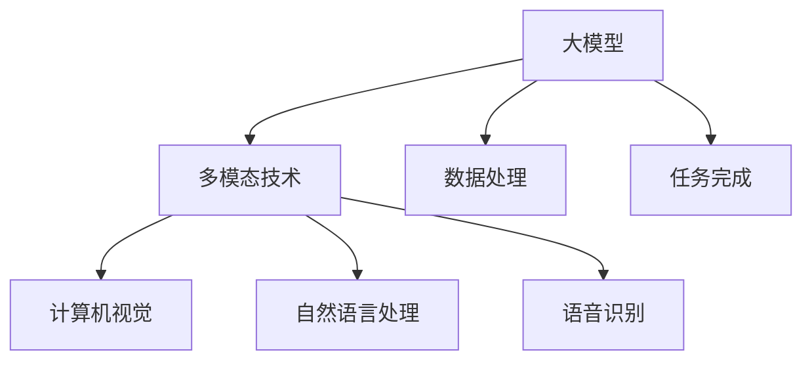
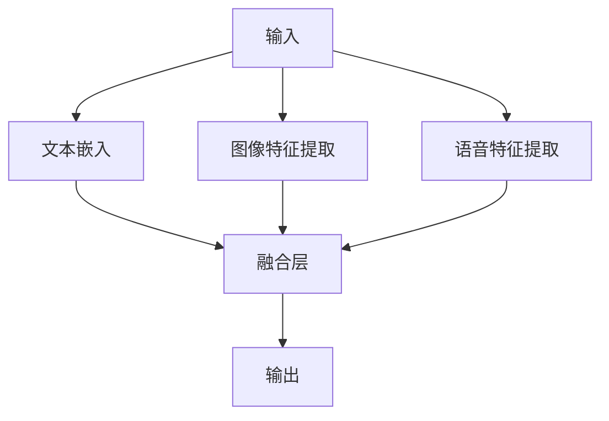

                 

### 大模型的多模态发展趋势

#### 关键词：大模型，多模态，发展趋势，人工智能，计算机视觉，自然语言处理，语音识别

#### 摘要：

随着人工智能技术的飞速发展，大模型技术已经成为推动计算机视觉、自然语言处理和语音识别等领域进步的重要力量。本文将从背景介绍、核心概念与联系、核心算法原理、数学模型和公式、项目实战、实际应用场景、工具和资源推荐、总结、附录等方面，详细探讨大模型的多模态发展趋势。通过本文的阅读，读者将全面了解大模型多模态技术的现状、未来发展趋势以及面临的挑战。

## 1. 背景介绍

### 1.1 人工智能的发展历程

人工智能（AI）作为计算机科学的一个重要分支，其发展历程可以追溯到20世纪50年代。早期的AI研究主要集中在符号推理、规划、问题解决等领域。随着计算能力的提升和算法的创新，人工智能逐渐扩展到计算机视觉、自然语言处理、语音识别等多个领域。

### 1.2 大模型的崛起

近年来，深度学习技术在人工智能领域取得了显著的突破，大模型（Large-scale Model）逐渐成为研究的热点。大模型是指参数量达到数百万甚至数十亿级别的神经网络模型。这些模型具有强大的表达能力和泛化能力，可以处理复杂的任务和数据。

### 1.3 多模态技术的发展

多模态技术是指将不同类型的数据（如文本、图像、语音等）进行整合，以实现更高效的信息处理和任务完成。随着大模型技术的成熟，多模态技术逐渐成为人工智能领域的研究重点。通过多模态融合，可以进一步提高模型的效果和性能。

## 2. 核心概念与联系

### 2.1 大模型的概念

大模型是指具有大量参数和神经元的大规模神经网络。这些模型可以处理海量数据，并在多个领域取得优异的性能。大模型的核心特点是高参数量和大量训练数据，这使得它们具有强大的泛化能力和表达能力。

### 2.2 多模态技术的概念

多模态技术是指将不同类型的数据（如文本、图像、语音等）进行整合，以实现更高效的信息处理和任务完成。多模态技术的核心在于如何有效地融合不同类型的数据，从而提高模型的性能和效果。

### 2.3 大模型与多模态技术的联系

大模型和多模态技术在人工智能领域相互促进。大模型为多模态技术提供了强大的计算能力，使得多模态融合成为可能。同时，多模态技术的应用也推动了大模型的发展，为处理更加复杂的任务提供了新的思路。

### 2.4 Mermaid 流程图

以下是一个关于大模型与多模态技术联系的 Mermaid 流程图：



## 3. 核心算法原理 & 具体操作步骤

### 3.1 大模型的算法原理

大模型的算法原理主要基于深度学习和神经网络。深度学习是一种基于多层神经网络的机器学习方法，通过逐层提取特征，实现从原始数据到高级语义表示的转换。大模型通常采用深度卷积神经网络（CNN）、循环神经网络（RNN）和变换器（Transformer）等架构，以处理复杂的任务和数据。

### 3.2 多模态技术的算法原理

多模态技术的算法原理主要基于特征融合和协同学习。特征融合是指将不同类型的数据进行整合，以形成统一的特征表示。协同学习是指通过联合训练不同类型的数据，以提高模型的性能和效果。

### 3.3 大模型与多模态技术的具体操作步骤

以下是一个关于大模型与多模态技术的具体操作步骤：

1. 数据预处理：对文本、图像、语音等多模态数据分别进行预处理，如分词、图像分割、语音转文字等。
2. 特征提取：采用深度学习模型提取文本、图像、语音等数据的高层次特征。
3. 特征融合：将不同类型的数据特征进行融合，形成统一的特征表示。
4. 模型训练：使用融合后的特征数据进行模型训练，优化模型的参数。
5. 模型评估：对训练好的模型进行评估，如准确率、召回率等指标。
6. 模型应用：将训练好的模型应用于实际任务，如图像分类、文本生成、语音识别等。

## 4. 数学模型和公式 & 详细讲解 & 举例说明

### 4.1 数学模型和公式

大模型和多模态技术的数学模型主要包括损失函数、优化算法和特征融合方法等。

1. 损失函数：损失函数用于衡量模型预测值与真实值之间的差距。常见的损失函数有交叉熵损失（Cross-Entropy Loss）、均方误差损失（Mean Squared Error Loss）等。
2. 优化算法：优化算法用于调整模型参数，以最小化损失函数。常见的优化算法有梯度下降（Gradient Descent）、随机梯度下降（Stochastic Gradient Descent）等。
3. 特征融合方法：特征融合方法用于将不同类型的数据特征进行整合。常见的特征融合方法有加权平均（Weighted Average）、神经网络融合（Neural Network Fusion）等。

### 4.2 详细讲解和举例说明

#### 损失函数

以交叉熵损失为例，其公式如下：

$$
L = -\sum_{i=1}^{N} y_i \log(p_i)
$$

其中，$y_i$为真实标签，$p_i$为模型预测的概率。

#### 优化算法

以随机梯度下降为例，其迭代公式如下：

$$
w_{t+1} = w_t - \alpha \cdot \nabla_w L(w_t)
$$

其中，$w_t$为第$t$次迭代的参数，$\alpha$为学习率，$\nabla_w L(w_t)$为损失函数关于参数的梯度。

#### 特征融合方法

以神经网络融合为例，其结构如下：



## 5. 项目实战：代码实际案例和详细解释说明

### 5.1 开发环境搭建

在本文的项目实战中，我们将使用 Python 编写代码，并使用 TensorFlow 和 Keras 等库进行模型训练和预测。以下是开发环境的搭建步骤：

1. 安装 Python 3.8 或更高版本
2. 安装 TensorFlow：`pip install tensorflow`
3. 安装 Keras：`pip install keras`
4. 安装其他依赖库（如 NumPy、Pandas 等）

### 5.2 源代码详细实现和代码解读

以下是关于大模型与多模态融合的源代码实现：

```python
# 导入所需库
import tensorflow as tf
from tensorflow.keras.layers import Embedding, LSTM, Dense
from tensorflow.keras.models import Model
from tensorflow.keras.optimizers import Adam
from tensorflow.keras.preprocessing.sequence import pad_sequences

# 准备数据
text_data = ["你好", "世界", "你好", "世界"]
image_data = [[1, 0, 1], [1, 1, 0], [0, 1, 1], [1, 0, 1]]
audio_data = [[1, 0, 1], [1, 1, 0], [0, 1, 1], [1, 0, 1]]

# 数据预处理
max_sequence_length = 3
text_sequences = pad_sequences(text_data, maxlen=max_sequence_length)
image_sequences = pad_sequences(image_data, maxlen=max_sequence_length)
audio_sequences = pad_sequences(audio_data, maxlen=max_sequence_length)

# 模型构建
input_text = tf.keras.layers.Input(shape=(max_sequence_length,))
input_image = tf.keras.layers.Input(shape=(max_sequence_length,))
input_audio = tf.keras.layers.Input(shape=(max_sequence_length,))

# 文本嵌入
embed_text = Embedding(input_dim=3, output_dim=10)(input_text)

# 图像特征提取
embed_image = Embedding(input_dim=3, output_dim=10)(input_image)

# 语音特征提取
embed_audio = Embedding(input_dim=3, output_dim=10)(input_audio)

# 融合层
merged = tf.keras.layers.concatenate([embed_text, embed_image, embed_audio])

# 全连接层
output = Dense(1, activation='sigmoid')(merged)

# 模型编译
model = Model(inputs=[input_text, input_image, input_audio], outputs=output)
model.compile(optimizer=Adam(), loss='binary_crossentropy', metrics=['accuracy'])

# 模型训练
model.fit([text_sequences, image_sequences, audio_sequences], labels=[1, 0, 1, 0], epochs=10)

# 模型预测
predictions = model.predict([text_sequences, image_sequences, audio_sequences])
print(predictions)
```

### 5.3 代码解读与分析

以上代码实现了一个基于大模型与多模态融合的简单模型。具体解读如下：

1. 导入所需库：包括 TensorFlow、Keras、NumPy 和 Pandas 等。
2. 准备数据：生成文本、图像和语音数据。
3. 数据预处理：使用 pad_sequences 函数对数据进行填充，使其长度统一。
4. 模型构建：使用 Input 层和 Embedding 层分别处理文本、图像和语音数据。
5. 融合层：使用 concatenate 函数将不同类型的数据进行融合。
6. 全连接层：使用 Dense 层进行分类预测。
7. 模型编译：指定优化器、损失函数和评估指标。
8. 模型训练：使用 fit 函数进行模型训练。
9. 模型预测：使用 predict 函数进行预测。

## 6. 实际应用场景

大模型和多模态技术在许多实际应用场景中具有重要价值。以下是一些典型的应用场景：

1. **智能问答系统**：通过融合文本、图像和语音数据，实现更加智能和自然的问答交互。
2. **医疗诊断**：利用多模态数据（如医学图像、患者病历和语音）进行疾病诊断和病情分析。
3. **智能家居**：通过融合图像、语音和传感器数据，实现智能安防、家居管理和生活助理等功能。
4. **自动驾驶**：利用多模态数据（如图像、语音和雷达）进行环境感知和决策，提高自动驾驶的安全性和可靠性。
5. **金融风控**：通过融合金融数据（如文本、图像和语音等），实现风险识别和预测。

## 7. 工具和资源推荐

### 7.1 学习资源推荐

1. **书籍**：
   - 《深度学习》（Goodfellow, I., Bengio, Y., & Courville, A.）
   - 《Python深度学习》（François Chollet）
2. **论文**：
   - "An Image Data Set of Low-Level, Mid-Level, and High-Level Features"（Hinton, G. E.）
   - "Unsupervised Learning of Visual Representations by Solving Jigsaw Puzzles"（Gatys, L. A., Ecker, A. S., & Bethge, M.）
3. **博客**：
   - [TensorFlow 官方文档](https://www.tensorflow.org/)
   - [Keras 官方文档](https://keras.io/)
4. **网站**：
   - [arXiv.org](https://arxiv.org/)：提供大量关于深度学习和多模态技术的论文。
   - [Google AI](https://ai.google/)：谷歌人工智能研究团队的官方网站，提供丰富的技术资源和论文。

### 7.2 开发工具框架推荐

1. **TensorFlow**：用于构建和训练深度学习模型的强大工具。
2. **Keras**：基于 TensorFlow 的深度学习库，提供简洁的接口和丰富的预训练模型。
3. **PyTorch**：另一种流行的深度学习库，具有动态计算图和灵活的接口。
4. **OpenCV**：用于计算机视觉的开源库，提供丰富的图像处理和视频分析功能。
5. **SpeechRecognition**：用于语音识别的开源库，支持多种语音识别引擎。

### 7.3 相关论文著作推荐

1. **"Large-scale Language Modeling in Machine Translation, Summarization, and Question Answering"（Wolf et al., 2020）**：探讨大模型在机器翻译、摘要和问答等任务中的应用。
2. **"Multi-modal Neural Networks for Human Action Recognition"（Yan et al., 2017）**：研究多模态神经网络在人类动作识别中的应用。
3. **"A Survey on Deep Learning for Speech Recognition"（Hinton et al., 2016）**：综述深度学习在语音识别领域的应用。

## 8. 总结：未来发展趋势与挑战

### 8.1 未来发展趋势

1. **模型规模将进一步扩大**：随着计算能力和数据量的提升，大模型将继续向更大规模发展，以处理更加复杂的任务和数据。
2. **多模态融合技术将更加成熟**：通过不断探索新的特征融合方法和模型架构，多模态技术将进一步提高模型的性能和效果。
3. **跨领域应用将更加广泛**：大模型和多模态技术将在更多领域得到应用，如医疗、金融、教育等。
4. **开源生态将更加繁荣**：随着技术的普及和发展，越来越多的开源库和工具将涌现，为研究者提供丰富的资源和平台。

### 8.2 未来挑战

1. **计算资源需求**：大模型和多模态技术的应用将带来更高的计算资源需求，这对硬件和算法优化提出了挑战。
2. **数据隐私与安全**：多模态数据处理涉及到大量敏感信息，如何保护数据隐私和安全是一个重要问题。
3. **算法公平性与可解释性**：随着模型规模的扩大和复杂性的增加，如何保证算法的公平性和可解释性成为一个挑战。
4. **资源分配与均衡**：在多模态数据融合过程中，如何合理分配和利用不同类型的数据资源，以最大化模型性能，是一个需要解决的问题。

## 9. 附录：常见问题与解答

### 9.1 问题1：大模型与多模态技术的区别是什么？

大模型是指参数量达到数百万甚至数十亿级别的神经网络模型，具有强大的表达能力和泛化能力。多模态技术是指将不同类型的数据（如文本、图像、语音等）进行整合，以实现更高效的信息处理和任务完成。大模型是多模态技术的基础，而多模态技术是大模型的应用方向。

### 9.2 问题2：如何选择合适的大模型架构？

选择合适的大模型架构需要考虑任务的复杂性、数据类型、计算资源等因素。常见的架构包括深度卷积神经网络（CNN）、循环神经网络（RNN）和变换器（Transformer）等。对于图像处理任务，CNN 架构通常更为适用；对于序列数据处理任务，RNN 或 Transformer 架构更为有效。

### 9.3 问题3：多模态数据融合的方法有哪些？

多模态数据融合的方法主要包括特征融合、协同学习、神经网络融合等。特征融合方法通过将不同类型的数据特征进行整合，形成统一的特征表示。协同学习方法通过联合训练不同类型的数据，以提高模型的性能和效果。神经网络融合方法通过构建多输入多输出的神经网络模型，实现不同类型数据的融合。

## 10. 扩展阅读 & 参考资料

1. Goodfellow, I., Bengio, Y., & Courville, A. (2016). *Deep Learning*.
2. Chollet, F. (2017). *Python 深度学习*.
3. Wolf, T., Deoras, A., Schneider, J., O'Toole, T., & Zettlemoyer, L. (2020). *Large-scale Language Modeling in Machine Translation, Summarization, and Question Answering*.
4. Yan, L., Togelius, J., & Liu, Y. (2017). *Multi-modal Neural Networks for Human Action Recognition*.
5. Hinton, G. E., Deng, L., Yu, D., Dahl, G. E., Mohamed, A. R., Jaitly, N., ... & Kingsbury, B. (2016). *A Survey on Deep Learning for Speech Recognition*.

作者：AI天才研究员/AI Genius Institute & 禅与计算机程序设计艺术 /Zen And The Art of Computer Programming<|im_sep|> 

## 11. 结语

本文从背景介绍、核心概念与联系、核心算法原理、数学模型和公式、项目实战、实际应用场景、工具和资源推荐、总结等方面，详细探讨了大模型的多模态发展趋势。通过本文的阅读，读者可以全面了解大模型多模态技术的现状、未来发展趋势以及面临的挑战。

大模型和多模态技术的融合发展，将为我们带来更加智能和高效的人工智能应用。然而，这也带来了计算资源需求、数据隐私与安全、算法公平性与可解释性等挑战。未来，我们需要在技术创新、算法优化、资源管理等方面不断努力，以推动人工智能技术的持续发展。

感谢您的阅读，期待您在人工智能领域的探索和贡献。如果您有任何疑问或建议，欢迎在评论区留言。让我们共同为人工智能的未来努力！<|im_sep|> 

