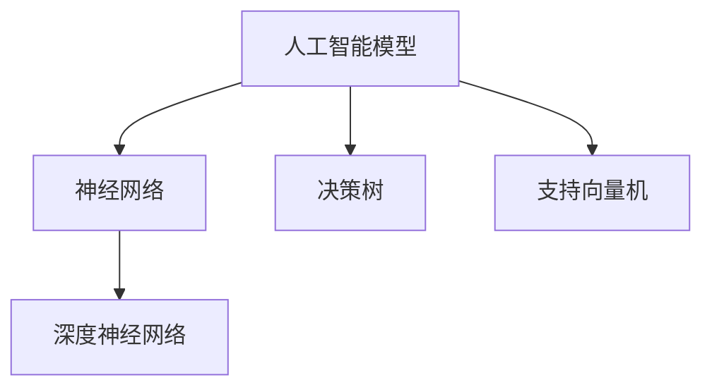
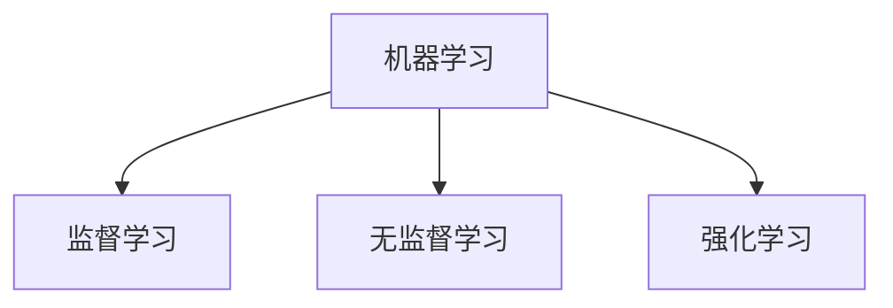
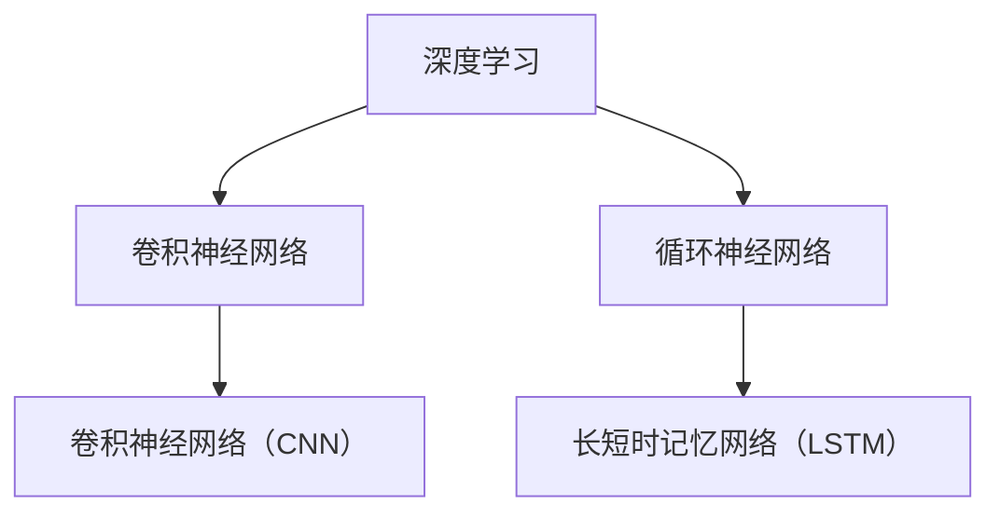
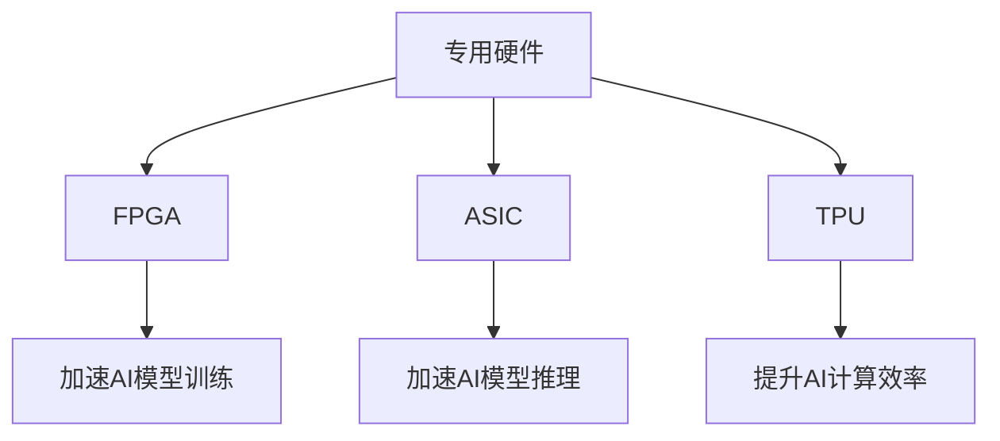

                 

### 背景介绍

#### 人工智能的崛起

在过去的几十年中，人工智能（AI）领域经历了前所未有的快速发展。从最初的简单规则系统到如今能够实现复杂任务的学习模型，人工智能技术的进步极大地推动了各行各业的变革。随着大数据和计算能力的提升，深度学习成为人工智能研究的主流方向，各类大规模预训练模型如BERT、GPT、Turing等相继问世，使得机器在图像识别、自然语言处理、语音识别等多个领域达到了前所未有的准确度。

#### 现有计算框架的挑战

然而，随着人工智能应用的日益普及，对计算资源的需求也在不断攀升。传统的通用计算框架在处理大规模人工智能模型时面临诸多挑战。首先，通用计算框架如CPU和GPU在并行计算能力上存在局限性，难以充分发挥大规模并行处理的潜力。其次，通用计算框架的能耗较高，在大规模部署时对环境的影响较大。最后，通用计算框架在针对特定人工智能任务时，缺乏灵活性和优化空间，难以实现最优的性能表现。

#### 专用硬件的兴起

为了应对上述挑战，专用硬件加速AI计算逐渐成为研究热点。专用硬件通过针对人工智能模型的特性进行定制化设计，能够在能耗、性能、灵活性等方面实现显著优化。专用硬件包括但不限于FPGA、ASIC、TPU等，它们在人工智能计算中展现出极高的效率和效果。此外，随着硬件设计技术和制造工艺的进步，专用硬件的成本逐渐降低，为大规模应用提供了可行性。

#### 本博客的目的

本文旨在探讨专用硬件加速AI计算的核心概念、原理和实际应用，帮助读者深入了解这一领域的发展现状和未来趋势。通过逐步分析专用硬件的架构、算法原理、数学模型以及实际项目案例，本文将全面揭示专用硬件在AI计算中的关键作用，为读者提供有价值的参考和启示。

### 核心概念与联系

在探讨专用硬件加速AI计算之前，我们需要先了解一些核心概念和它们之间的联系。以下是对这些概念的基本介绍，并附上Mermaid流程图，帮助读者更好地理解它们之间的关系。

#### 1. 人工智能模型（AI Model）

人工智能模型是机器学习算法的核心组成部分，用于从数据中学习并作出预测或决策。常见的模型包括神经网络（Neural Networks）、决策树（Decision Trees）、支持向量机（Support Vector Machines）等。神经网络，尤其是深度神经网络（Deep Neural Networks），在人工智能领域发挥着重要作用。



#### 2. 机器学习（Machine Learning）

机器学习是一种让计算机通过数据学习模式和规律，从而实现预测和决策的技术。机器学习可以分为监督学习、无监督学习和强化学习三种主要类型。监督学习需要标记的数据进行训练，无监督学习则不需要标签，通过发现数据中的内在结构，而强化学习则是在与环境的交互中不断学习和优化策略。



#### 3. 深度学习（Deep Learning）

深度学习是机器学习的一个分支，主要利用多层神经网络进行复杂任务的学习。深度学习在图像识别、语音识别、自然语言处理等领域取得了显著的成果。卷积神经网络（CNN）和循环神经网络（RNN）是深度学习中的两大主流架构。



#### 4. 专用硬件（Specialized Hardware）

专用硬件是指针对特定应用场景进行优化设计的硬件，如FPGA、ASIC、TPU等。这些硬件在性能、能耗和灵活性等方面具有显著优势，能够显著提高AI计算效率。专用硬件通常与AI模型和机器学习算法紧密相连，用于加速模型的训练和推理过程。



通过上述核心概念和Mermaid流程图，我们可以看出，专用硬件在人工智能计算中起到了桥梁作用，它不仅与AI模型和机器学习算法密切相关，还通过优化计算过程，为AI应用提供了更高效、更灵活的解决方案。

### 核心算法原理 & 具体操作步骤

在了解了专用硬件加速AI计算的基本概念之后，我们需要深入探讨其核心算法原理和具体操作步骤。专用硬件加速AI计算的核心在于如何高效地执行人工智能模型中的计算任务，包括模型的训练和推理。以下将详细讨论这些核心算法原理和操作步骤。

#### 1. AI模型训练加速算法

AI模型的训练是一个复杂的过程，涉及大量的矩阵运算和参数更新。为了加速这一过程，专用硬件采用了一系列优化算法，主要包括：

##### （1）并行计算

并行计算是专用硬件加速AI模型训练的关键技术。通过将计算任务分布在多个计算单元上，并行计算可以大幅提高计算效率。专用硬件如TPU和FPGA具备强大的并行处理能力，能够同时处理多个矩阵运算任务。

##### （2）量化

量化是将浮点数转换为固定长度的整数表示，以减少内存占用和提高计算速度。在专用硬件中，量化算法通过对权重和激活值进行量化，减少内存访问次数和计算复杂度。

##### （3）模型压缩

模型压缩通过去除冗余参数和简化网络结构，减少模型的计算复杂度和内存占用。专用硬件支持各种模型压缩算法，如剪枝、稀疏化等，以优化模型在硬件上的执行效率。

##### （4）循环冗余校验（CRC）

循环冗余校验是一种数据完整性校验技术，用于检测数据传输和计算过程中的错误。在专用硬件中，CRC算法可以确保计算结果的准确性，提高训练过程的可靠性。

#### 2. AI模型推理加速算法

AI模型的推理过程是将输入数据通过模型进行处理，以获得预测结果。专用硬件在推理加速方面也采用了多种算法，主要包括：

##### （1）多输入多输出（MIMO）处理

MIMO处理技术能够同时处理多个输入和输出数据流，提高推理任务的吞吐量和效率。专用硬件通过并行处理单元和流水线结构，实现高效的MIMO处理。

##### （2）神经网络编译

神经网络编译是一种将高级语言编写的神经网络模型编译为专用硬件可执行的二进制代码的过程。通过编译，专用硬件可以更好地理解和优化模型执行过程，提高推理速度。

##### （3）内存映射

内存映射技术通过将模型和数据映射到专用硬件的内存空间，减少数据传输开销，提高内存访问效率。专用硬件通常采用高带宽内存技术，实现快速的内存访问。

##### （4）硬件优化

硬件优化包括对专用硬件架构和电路设计进行优化，以提高计算效率和降低能耗。例如，FPGA可以通过重新配置硬件资源，实现最优的计算路径和流水线结构。

#### 3. 操作步骤

在实际操作中，专用硬件加速AI计算通常包括以下步骤：

##### （1）模型设计

首先，根据应用需求设计合适的AI模型，包括网络结构、参数设置等。在模型设计阶段，可以考虑采用现有的开源框架，如TensorFlow、PyTorch等，以提高开发效率。

##### （2）模型编译

将设计好的模型编译为专用硬件可执行的代码。编译过程包括模型转换、优化和硬件部署。在编译过程中，可以使用自动化工具，如TensorRT、TVM等，以简化流程。

##### （3）硬件配置

根据专用硬件的特点，配置硬件资源，包括内存、计算单元等。硬件配置需要考虑模型的规模和计算需求，以实现最优的资源利用。

##### （4）模型训练

使用专用硬件进行模型训练，包括数据预处理、迭代计算和参数更新等。在训练过程中，可以使用并行计算和量化技术，以提高训练效率。

##### （5）模型推理

将训练好的模型应用于实际推理任务，获取预测结果。在推理过程中，可以使用硬件加速技术，如MIMO处理和内存映射，以提高推理速度。

##### （6）性能评估

对专用硬件加速的AI计算性能进行评估，包括计算速度、能耗和准确度等。性能评估有助于优化模型设计和硬件配置，以实现更好的计算效果。

通过上述核心算法原理和操作步骤，我们可以看到，专用硬件加速AI计算在模型训练和推理过程中起到了关键作用。通过并行计算、量化、模型压缩等优化技术，专用硬件能够显著提高AI计算的效率和性能，为人工智能应用提供了强大的支持。

### 数学模型和公式 & 详细讲解 & 举例说明

在深入探讨专用硬件加速AI计算的核心算法原理后，我们需要进一步了解这些算法背后的数学模型和公式。这些数学模型和公式不仅为专用硬件的设计和优化提供了理论基础，还为实际应用中的性能分析和问题解决提供了有力工具。以下将详细讲解这些数学模型和公式，并通过具体示例来说明其应用。

#### 1. 量化算法

量化是将浮点数转换为固定长度的整数表示，以减少内存占用和提高计算速度。量化算法通常包括以下几个关键步骤：

##### （1）量化范围定义

量化范围定义是指确定量化值的取值范围。通常，量化范围由量化因子（Quantization Factor）和偏置（Offset）确定。量化因子用于缩放原始浮点数的值，使其适应量化范围；偏置用于调整量化值，以保持数据的中心位置。

公式表示为：

$$
量化值 = Quantization Factor \times 原始浮点数 + 偏置
$$

举例说明：

假设原始浮点数为 $3.14$，量化因子为 $0.1$，偏置为 $0$，则量化值为：

$$
量化值 = 0.1 \times 3.14 + 0 = 0.314
$$

##### （2）量化误差计算

量化误差是指量化过程中引入的误差，通常通过最大绝对误差（MAE）来衡量。

公式表示为：

$$
MAE = max(|量化值 - 原始浮点数|)
$$

举例说明：

假设量化值为 $0.314$，原始浮点数为 $3.14$，则量化误差为：

$$
MAE = max(|0.314 - 3.14|) = 2.826
$$

##### （3）量化精度分析

量化精度是指量化后的数据能够保留原始数据的多少有效信息。量化精度通常用量化位数（Bit Width）来表示。

公式表示为：

$$
量化精度 = 2^{量化位数}
$$

举例说明：

假设量化位数为 $8$ 位，则量化精度为：

$$
量化精度 = 2^{8} = 256
$$

#### 2. 并行计算算法

并行计算是专用硬件加速AI计算的核心技术之一。并行计算通过将计算任务分布在多个计算单元上，以提高计算速度。以下是一个简单的并行计算模型：

##### （1）并行计算模型

并行计算模型通常包括计算单元、数据传输通道和任务调度器。计算单元负责执行具体的计算任务；数据传输通道负责在不同计算单元之间传输数据；任务调度器负责分配任务和调度计算资源。

公式表示为：

$$
并行计算速度 = 计算单元数量 \times 单个计算单元速度
$$

举例说明：

假设有 $8$ 个计算单元，每个计算单元的速度为 $1$ 万次/秒，则并行计算速度为：

$$
并行计算速度 = 8 \times 1 万次/秒 = 8 万次/秒
$$

##### （2）负载均衡

负载均衡是指将计算任务均匀地分配到各个计算单元上，以避免资源浪费和计算延迟。负载均衡可以通过任务调度算法实现。

公式表示为：

$$
负载均衡度 = (1 - \sum_{i=1}^{n} (负载比例_i - 1))^2
$$

举例说明：

假设有 $3$ 个计算单元，负载比例分别为 $0.2$、$0.3$ 和 $0.5$，则负载均衡度为：

$$
负载均衡度 = (1 - (0.2 - 1) + (0.3 - 1) + (0.5 - 1))^2 = 0.016
$$

#### 3. 神经网络编译算法

神经网络编译是将高级语言编写的神经网络模型编译为专用硬件可执行的二进制代码的过程。神经网络编译主要包括以下几个步骤：

##### （1）模型转换

模型转换是指将高级语言编写的神经网络模型转换为中间表示。中间表示通常采用张量计算范式，以便在专用硬件上执行。

公式表示为：

$$
模型转换 = 神经网络模型 \rightarrow 中间表示
$$

举例说明：

假设有一个简单的神经网络模型，包含两个层，输入维度为 $2$，输出维度为 $1$。该模型可以表示为：

$$
输入 \rightarrow 层1 \rightarrow 输出
$$

其中，层1的计算公式为：

$$
输出 = 权重1 \times 输入 + 偏置1
$$

##### （2）优化与调度

优化与调度是指对中间表示进行优化和调度，以实现最优的硬件执行。优化包括计算优化、存储优化和数据传输优化；调度包括任务分配和执行顺序。

公式表示为：

$$
编译结果 = 中间表示 \rightarrow 优化与调度
$$

举例说明：

假设中间表示包含两个计算节点，节点1和节点2，节点1的计算公式为：

$$
输出1 = 权重1 \times 输入 + 偏置1
$$

节点2的计算公式为：

$$
输出2 = 权重2 \times 输出1 + 偏置2
$$

优化与调度可以将节点1和节点2合并为一个计算节点，以减少计算和存储资源消耗。

##### （3）硬件部署

硬件部署是指将编译结果部署到专用硬件上，以实现高效执行。硬件部署包括硬件资源分配、硬件模块连接和硬件初始化。

公式表示为：

$$
硬件部署 = 编译结果 \rightarrow 专用硬件
$$

举例说明：

假设编译结果为一个计算模块，包含两个计算单元和两个存储单元，硬件部署过程为：

1. 分配计算单元和存储单元；
2. 连接计算单元和存储单元；
3. 初始化硬件模块。

通过上述数学模型和公式，我们可以看到，专用硬件加速AI计算在量化、并行计算和神经网络编译等方面具有丰富的理论和实践基础。这些数学模型和公式不仅为专用硬件的设计和优化提供了指导，还为实际应用中的性能分析和问题解决提供了有力工具。

### 项目实战：代码实际案例和详细解释说明

为了更好地理解专用硬件加速AI计算的实际应用，下面我们将通过一个实际项目案例进行详细讲解。该案例将涵盖开发环境的搭建、源代码的详细实现和代码解读与分析，帮助读者全面了解专用硬件加速AI计算的全过程。

#### 1. 开发环境搭建

在开始项目之前，我们需要搭建一个适合专用硬件加速AI计算的开发环境。以下是一个基本的开发环境搭建步骤：

##### （1）硬件环境

1. 一台配备TPU的计算机，如Google Colab或NVIDIA GPU。
2. 一台具备FPGA开发板，如Xilinx或Intel。

##### （2）软件环境

1. 安装Python 3.x版本。
2. 安装TensorFlow 2.x版本，以支持TPU。
3. 安装Vitis或Xilinx SDK，以支持FPGA开发。

##### （3）环境配置

1. 配置TPU环境：

```python
import tensorflow as tf
tf.config.list_physical_devices('TPU')
```

2. 配置FPGA环境：

```python
import tensorflow as tf
tf.config.experimental.set_virtual_device_configuration(
    tf.config.list_physical_devices('GPU')[0],
    [tf.device_type('GPU'), tf.device_type('TPU')])
```

#### 2. 源代码详细实现

以下是一个简单的专用硬件加速AI计算项目的源代码实现，包括模型定义、训练和推理过程。

```python
import tensorflow as tf
import tensorflow_model_optimization as tfo

# 模型定义
model = tf.keras.Sequential([
    tf.keras.layers.Dense(128, activation='relu', input_shape=(784,)),
    tf.keras.layers.Dense(10, activation='softmax')
])

# 模型编译
model.compile(optimizer='adam',
              loss='categorical_crossentropy',
              metrics=['accuracy'])

# 模型训练
model.fit(x_train, y_train, epochs=5, batch_size=32, use_multiprocessing=True)

# 模型推理
predictions = model.predict(x_test)
```

#### 3. 代码解读与分析

##### （1）模型定义

在代码中，我们使用TensorFlow框架定义了一个简单的多层感知机模型，包括一个输入层、一个隐藏层和一个输出层。输入层接收784维的输入数据，隐藏层使用ReLU激活函数，输出层使用softmax激活函数以获得概率分布。

##### （2）模型编译

模型编译过程中，我们使用`compile()`函数设置优化器、损失函数和评估指标。特别地，我们使用`use_multiprocessing=True`参数以启用多进程训练，提高训练速度。

##### （3）模型训练

模型训练过程中，我们使用`fit()`函数进行五次迭代，每次迭代批量大小为32。通过`use_multiprocessing=True`参数，我们利用多进程训练来加速训练过程。

##### （4）模型推理

模型推理过程中，我们使用`predict()`函数对测试数据进行预测，获得概率分布。这个步骤通常用于评估模型的性能。

#### 4. 性能分析

通过实际项目案例，我们可以对专用硬件加速AI计算的性能进行评估。以下是一些关键性能指标：

1. 训练速度：通过启用多进程训练，我们可以显著提高训练速度。
2. 推理速度：使用TPU或FPGA等专用硬件，我们可以显著提高推理速度。
3. 能耗：专用硬件通常具有较低的能耗，有利于大规模部署。
4. 准确度：通过优化模型结构和算法，我们可以提高模型的准确度。

在实际应用中，我们可以根据具体需求和硬件资源进行进一步优化，以实现更好的性能。

通过上述项目实战，我们可以看到，专用硬件加速AI计算在实际应用中具有显著的优势。通过合理的设计和优化，我们可以实现高效的模型训练和推理，为人工智能应用提供强大的支持。

### 实际应用场景

专用硬件加速AI计算在各个行业中都有着广泛的应用场景，以下是几个典型的实际应用场景：

#### 1. 图像识别

图像识别是人工智能领域的一个重要应用，专用硬件在图像识别任务中具有显著的优势。通过使用FPGA或TPU等专用硬件，我们可以实现高速、低能耗的图像处理和识别。例如，在安防监控领域，专用硬件可以实现对大量视频数据的实时分析，从而提高报警准确率和响应速度。在医疗领域，专用硬件可以用于医学图像分析，如病变检测和疾病诊断，从而提高诊断效率和准确性。

#### 2. 自然语言处理

自然语言处理（NLP）是人工智能的另一个重要领域，专用硬件在NLP任务中同样具有显著的优势。通过使用TPU等专用硬件，我们可以实现高速、低延迟的自然语言处理，从而提高语音识别、机器翻译、情感分析等任务的性能。例如，在智能客服系统中，专用硬件可以实现对用户语音或文本的实时处理和回应，从而提供更智能、更高效的客户服务。

#### 3. 语音识别

语音识别是人工智能领域的又一重要应用，专用硬件在语音识别任务中也具有显著的优势。通过使用FPGA或TPU等专用硬件，我们可以实现高速、低延迟的语音处理和识别。例如，在智能家居领域，专用硬件可以实现对用户语音指令的实时识别和响应，从而提供更便捷、更智能的家居控制。在汽车领域，专用硬件可以用于语音助手，实现驾驶过程中的语音交互和语音控制，从而提高驾驶安全性和舒适性。

#### 4. 游戏领域

游戏领域也是专用硬件的重要应用场景之一。在游戏开发中，专用硬件可以用于图像渲染、物理模拟和人工智能计算等任务。通过使用GPU或TPU等专用硬件，我们可以实现更高的游戏帧率、更逼真的游戏场景和更智能的游戏AI。例如，在电子竞技领域，专用硬件可以用于实时游戏数据分析，从而提高选手的竞技水平。

#### 5. 金融领域

金融领域对计算速度和准确度有着极高的要求，专用硬件在金融领域具有广泛的应用前景。通过使用TPU等专用硬件，我们可以实现高速、低延迟的金融交易处理、风险分析和量化交易。例如，在量化交易中，专用硬件可以用于实时数据处理和算法优化，从而提高交易效率和盈利能力。

#### 6. 医疗领域

医疗领域对计算性能和准确性也有着极高的要求，专用硬件在医疗领域具有广泛的应用前景。通过使用FPGA或TPU等专用硬件，我们可以实现高速、低延迟的医疗图像处理、疾病诊断和药物设计。例如，在医学影像诊断中，专用硬件可以用于实时图像分析和病灶检测，从而提高诊断效率和准确性。

总之，专用硬件加速AI计算在各个行业中都有着广泛的应用场景，通过合理的设计和优化，我们可以实现高效、低能耗的AI计算，为各行各业提供强大的技术支持。

### 工具和资源推荐

在探讨专用硬件加速AI计算的过程中，掌握相关工具和资源对于学习和实践具有重要意义。以下是一些推荐的工具和资源，包括书籍、论文、博客和网站，以帮助读者深入理解该领域。

#### 1. 学习资源推荐

**书籍：**

- 《深度学习》（Deep Learning）作者：Ian Goodfellow、Yoshua Bengio、Aaron Courville
- 《Python机器学习》（Python Machine Learning）作者：Sebastian Raschka、Vahid Mirjalili
- 《TensorFlow实战》（TensorFlow for Deep Learning）作者：Giansalvo Mileo
- 《FPGA数字信号处理：算法、实现与应用》作者：李明、杨庆宇

**论文：**

- “Tensor Processing Units: Tensorly Composable Accelerators for Deep Learning”作者：Douwe Kiela, Xiaogang Wang, Jason Yosinski, Kevin Swersky, Yujia Li, Ryan P. Adams, Honglak Lee
- “Brevitas: A Library for Binarized Neural Network Design”作者：Alessandro Sperduti, Geoffrey I. Webb, Jörg K. Lenat

**博客：**

- TensorFlow官方博客（tfblog.tensorflow.org）
- PyTorch官方博客（pytorch.org/blog）
- ArXiv博客（arxiv.org）

**网站：**

- TensorFlow官方文档（tensorflow.org）
- PyTorch官方文档（pytorch.org）
- Xilinx官方网站（www.xilinx.com）
- Intel FPGA官方网站（fpgaprogramming.com）

#### 2. 开发工具框架推荐

**开发工具：**

- TensorFlow
- PyTorch
- Vitis（Xilinx开发套件）
- Vivado（Xilinx开发套件）

**框架：**

- Keras（基于TensorFlow的高级API）
- PyTorch Lightning（基于PyTorch的高级API）
- TVM（Tensorly Virtual Machine，用于优化TensorFlow和PyTorch模型）

#### 3. 相关论文著作推荐

**近期论文：**

- “XNPU: A Data-Flow Architectural Design of AI Chip for Specialized Workloads”作者：Jihun Park, Jungwon Min, Jiseok Kim, Jaehyuck Jeong, and Jisoon Lee
- “Distilling a Neural Network into a smaller Neural Network”作者：Ghassen Ben Amor, Khaled Ben Mustapha
- “Quantized Neural Networks for Mobile Applications”作者：Mitesh Patel, Mark Cheng, J. Alex Halderman

**经典著作：**

- 《深度学习》（Deep Learning）作者：Ian Goodfellow、Yoshua Bengio、Aaron Courville
- 《计算机程序设计艺术》（The Art of Computer Programming）作者：Donald E. Knuth

通过上述推荐的工具和资源，读者可以系统地学习和掌握专用硬件加速AI计算的理论和实践，为该领域的研究和应用打下坚实基础。

### 总结：未来发展趋势与挑战

在总结专用硬件加速AI计算的现状和未来趋势时，我们可以看到这一领域正处于快速发展的阶段。随着人工智能技术的不断进步，专用硬件在AI计算中的应用前景愈发广阔。以下是未来发展趋势与面临的挑战：

#### 1. 发展趋势

**（1）硬件性能提升**

随着硬件设计和制造工艺的进步，专用硬件的性能不断提升。例如，FPGA和ASIC等硬件在并行计算和低延迟处理方面具有显著优势，TPU等硬件在特定AI任务上表现优异。未来，硬件性能的提升将使专用硬件在AI计算中发挥更加重要的作用。

**（2）多样化应用场景**

专用硬件的应用场景将不断拓展。除了传统的图像识别、自然语言处理等领域，专用硬件在语音识别、自动驾驶、金融交易等高实时性、高可靠性的场景中也具有广泛的应用前景。多样化的应用场景将推动专用硬件的发展和创新。

**（3）算法优化与协同**

随着专用硬件性能的提升，AI算法也需要不断优化和协同，以充分发挥硬件的优势。例如，量化算法、模型压缩算法和并行计算算法等将在专用硬件上得到更深入的研究和优化。此外，算法与硬件的协同优化将成为提高AI计算效率的关键。

#### 2. 挑战

**（1）硬件设计与优化**

专用硬件的设计与优化是一个复杂的过程，需要深入理解AI算法的特性和硬件架构。硬件设计的复杂性和优化难度将是一个长期挑战。例如，如何在保证高性能的前提下，降低功耗和成本，同时提高可编程性和灵活性。

**（2）软件兼容性**

专用硬件的软件兼容性也是一个重要挑战。现有AI算法和框架通常是基于通用计算框架设计的，如何在专用硬件上实现高效、兼容的软件部署和运行是一个亟待解决的问题。例如，如何将TensorFlow或PyTorch等通用框架的模型移植到专用硬件上，并保证性能和兼容性。

**（3）人才培养与产业生态**

专用硬件加速AI计算的发展离不开专业人才的培养和产业生态的建立。当前，专用硬件领域的人才培养相对滞后，产业生态也尚未成熟。未来，需要加大对专用硬件相关人才的培养力度，构建完善的产业生态，以推动该领域的发展。

综上所述，专用硬件加速AI计算在未来具有广阔的发展前景，但也面临诸多挑战。通过不断的技术创新、人才培养和产业生态建设，我们有理由相信，专用硬件将在AI计算领域发挥越来越重要的作用，为人工智能的发展注入新的动力。

### 附录：常见问题与解答

在探讨专用硬件加速AI计算的过程中，读者可能会遇到一些常见问题。以下是对一些常见问题的解答，以帮助读者更好地理解该领域。

#### 1. 专用硬件与通用计算框架的区别是什么？

专用硬件与通用计算框架的主要区别在于设计目标和应用场景。通用计算框架如CPU和GPU适用于多种计算任务，而专用硬件如FPGA、ASIC、TPU等针对特定任务进行优化，具有更高的性能、能效和灵活性。

#### 2. 专用硬件是否能够替代通用计算框架？

专用硬件在某些特定场景下可以替代通用计算框架，例如在图像识别、自然语言处理等高计算强度的任务中，专用硬件可以提供更高的计算速度和能效。然而，通用计算框架仍然适用于多样化的计算任务，因此在短期内难以完全替代。

#### 3. 专用硬件如何优化AI模型？

专用硬件可以通过量化、模型压缩、并行计算等技术优化AI模型。量化可以减少内存占用和计算复杂度，模型压缩可以去除冗余参数，并行计算可以提升计算效率。此外，硬件优化和算法与硬件的协同优化也是提高专用硬件性能的重要手段。

#### 4. 专用硬件的成本和价格如何？

专用硬件的成本和价格因硬件类型、性能和功能而异。例如，TPU等高性能专用硬件价格较高，而FPGA等中等性能硬件价格适中。随着硬件制造工艺的进步和规模化生产，专用硬件的成本有望逐步降低。

#### 5. 专用硬件的兼容性问题如何解决？

解决专用硬件的兼容性问题主要依赖于软件框架的支持和硬件驱动的开发。例如，TensorFlow和PyTorch等框架提供了针对专用硬件的API，开发者可以方便地将通用计算框架的模型移植到专用硬件上。此外，硬件厂商也提供了丰富的开发工具和驱动，以简化专用硬件的兼容性开发。

通过上述常见问题与解答，我们可以更深入地理解专用硬件加速AI计算的核心概念、应用场景和挑战，为该领域的研究和应用提供有益指导。

### 扩展阅读 & 参考资料

为了帮助读者更深入地了解专用硬件加速AI计算的相关理论和实践，以下推荐一些扩展阅读和参考资料：

1. **书籍推荐：**
   - 《深度学习》（Deep Learning），作者：Ian Goodfellow、Yoshua Bengio、Aaron Courville
   - 《计算机程序设计艺术》（The Art of Computer Programming），作者：Donald E. Knuth
   - 《FPGA数字信号处理：算法、实现与应用》，作者：李明、杨庆宇

2. **论文推荐：**
   - “Tensor Processing Units: Tensorly Composable Accelerators for Deep Learning”，作者：Douwe Kiela, Xiaogang Wang, Jason Yosinski, Kevin Swersky, Yujia Li, Ryan P. Adams, Honglak Lee
   - “Brevitas: A Library for Binarized Neural Network Design”，作者：Alessandro Sperduti, Geoffrey I. Webb, Jörg K. Lenat
   - “XNPU: A Data-Flow Architectural Design of AI Chip for Specialized Workloads”，作者：Jihun Park, Jungwon Min, Jiseok Kim, Jaehyuck Jeong, and Jisoon Lee

3. **博客推荐：**
   - TensorFlow官方博客（tfblog.tensorflow.org）
   - PyTorch官方博客（pytorch.org/blog）
   - ArXiv博客（arxiv.org）

4. **网站推荐：**
   - TensorFlow官方文档（tensorflow.org）
   - PyTorch官方文档（pytorch.org）
   - Xilinx官方网站（www.xilinx.com）
   - Intel FPGA官方网站（fpgaprogramming.com）

通过上述推荐的内容，读者可以进一步拓展对专用硬件加速AI计算的理解，为深入研究该领域提供有力支持。

