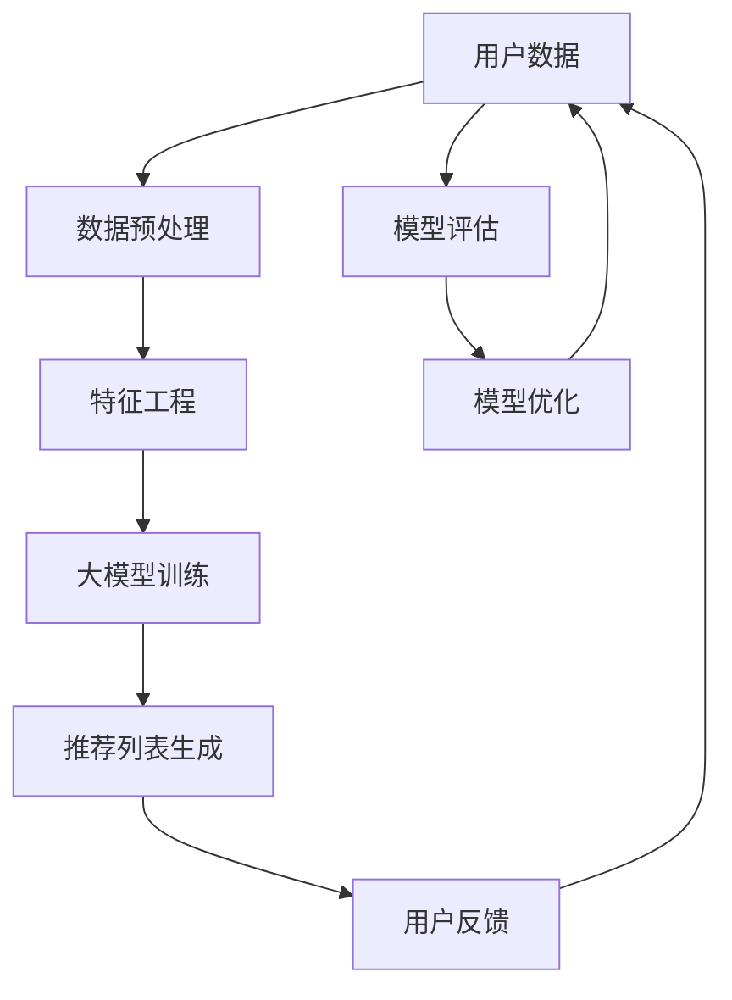

                 

# 大模型视角下推荐系统的未来发展趋势展望与规划

> **关键词：** 大模型、推荐系统、发展趋势、展望、规划、人工智能、机器学习、深度学习、深度神经网络、数据挖掘、用户行为分析、个性化推荐。

> **摘要：** 本文从大模型的视角出发，探讨了推荐系统在人工智能、机器学习、深度学习等技术驱动下的未来发展趋势和规划。通过深入分析核心概念、算法原理、数学模型及实际应用场景，本文旨在为读者提供一个全面、系统的认知框架，以便更好地理解和应对推荐系统的发展挑战。

## 1. 背景介绍

推荐系统作为一种重要的信息过滤和内容分发机制，已经在电子商务、社交媒体、新闻媒体、音乐流媒体等多个领域得到了广泛应用。然而，随着互联网的迅猛发展和用户数据的爆炸性增长，传统推荐系统面临着数据稀疏、冷启动、噪音干扰等问题。为了解决这些问题，人工智能、机器学习、深度学习等技术的引入为推荐系统带来了新的发展机遇。

大模型（Large Models）作为一种新型的人工智能模型，通过在海量数据上进行训练，能够捕捉到复杂的模式和关联性。在推荐系统中，大模型的应用将有助于提升推荐效果、降低冷启动问题，并增强系统的鲁棒性。本文将围绕大模型在推荐系统中的重要性，探讨其未来发展趋势和规划。

### 1.1 人工智能与推荐系统的融合

人工智能技术的快速发展为推荐系统提供了新的工具和方法。通过机器学习和深度学习算法，推荐系统可以从海量用户数据中挖掘出有价值的信息，实现个性化推荐。例如，基于协同过滤（Collaborative Filtering）和基于内容（Content-based Filtering）的推荐方法，已经在电子商务和社交媒体等领域取得了显著的成效。

### 1.2 大模型在推荐系统中的应用

大模型在推荐系统中的应用主要体现在两个方面：一是用于用户行为预测和兴趣挖掘，二是用于生成推荐列表。在用户行为预测方面，大模型可以通过学习用户的浏览历史、购买记录等数据，预测用户未来的行为。在生成推荐列表方面，大模型可以根据用户的历史行为和兴趣，生成个性化的推荐结果。

### 1.3 大模型在推荐系统中的挑战

尽管大模型在推荐系统中具有巨大的潜力，但其应用也面临着一些挑战。首先，大模型的训练和推理需要大量的计算资源和时间。其次，大模型的训练数据可能存在偏差和噪音，影响推荐效果。此外，大模型的黑箱特性也使得其解释性和可解释性成为一个重要问题。

## 2. 核心概念与联系

为了更好地理解大模型在推荐系统中的应用，我们需要首先了解核心概念和它们之间的联系。以下是一个使用 Mermaid 格式的流程图，展示了推荐系统中的核心概念及其相互关系。



### 2.1 用户数据

用户数据是推荐系统的核心资源。这些数据包括用户的浏览历史、购买记录、搜索关键词等。通过对用户数据的收集和分析，我们可以了解用户的需求和兴趣，为个性化推荐提供依据。

### 2.2 数据预处理

数据预处理是推荐系统中的关键步骤。通过数据清洗、去重、填充缺失值等操作，我们可以确保数据的质量和一致性，为后续的特征工程和模型训练奠定基础。

### 2.3 特征工程

特征工程是推荐系统中的核心技术之一。通过从用户数据中提取和构造特征，我们可以将原始数据转化为适用于机器学习算法的输入。特征的选择和构造对于推荐系统的性能具有重要影响。

### 2.4 大模型训练

大模型训练是推荐系统的核心步骤。通过在海量数据上进行训练，大模型可以学习到复杂的用户行为模式和兴趣关联。常见的训练方法包括监督学习、无监督学习和半监督学习。

### 2.5 推荐列表生成

推荐列表生成是推荐系统的最终目标。通过将用户数据输入到大模型中，我们可以生成个性化的推荐结果。推荐列表的质量直接影响用户的满意度和使用体验。

### 2.6 用户反馈

用户反馈是推荐系统不断迭代和优化的关键。通过对用户反馈的分析，我们可以评估推荐系统的性能，发现潜在的问题和改进点，为模型优化提供依据。

### 2.7 模型评估

模型评估是推荐系统中的重要环节。通过评估指标（如准确率、召回率、覆盖率等），我们可以衡量推荐系统的性能，为模型优化提供参考。

### 2.8 模型优化

模型优化是推荐系统不断改进的过程。通过分析模型评估结果，我们可以调整模型参数、优化算法，以提高推荐系统的性能和用户体验。

## 3. 核心算法原理 & 具体操作步骤

在大模型视角下，推荐系统的核心算法主要包括基于协同过滤（Collaborative Filtering）和基于内容（Content-based Filtering）的方法。以下分别介绍这两种方法的原理和具体操作步骤。

### 3.1 基于协同过滤的推荐算法

协同过滤是一种基于用户相似度的推荐方法，其基本思想是通过分析用户之间的相似性，为用户推荐与其相似的其他用户喜欢的商品或内容。

#### 3.1.1 相似度计算

相似度计算是协同过滤的关键步骤。常见的相似度计算方法包括余弦相似度、皮尔逊相关系数等。以余弦相似度为例，其计算公式如下：

$$
sim(u_i, u_j) = \frac{u_i \cdot u_j}{\|u_i\| \|u_j\|}
$$

其中，$u_i$ 和 $u_j$ 分别表示用户 $i$ 和用户 $j$ 的评分向量，$\|u_i\|$ 和 $\|u_j\|$ 分别表示向量 $u_i$ 和 $u_j$ 的欧几里得范数。

#### 3.1.2 评分预测

在计算用户之间的相似度后，我们可以利用这些相似度来预测用户对未评分商品的评分。常见的评分预测方法包括基于用户的平均评分和基于相似度的加权平均评分。以基于相似度的加权平均评分为例，其计算公式如下：

$$
r_{ij} = \sum_{k \in N(j)} sim(i, k) \cdot r_{kj}
$$

其中，$r_{ij}$ 表示用户 $i$ 对商品 $j$ 的预测评分，$N(j)$ 表示与用户 $j$ 相似的一组用户，$r_{kj}$ 表示用户 $k$ 对商品 $j$ 的实际评分。

### 3.2 基于内容的推荐算法

基于内容的方法通过分析商品或内容的特征，为用户推荐与其历史偏好相似的商品或内容。其基本思想是将商品或内容表示为特征向量，然后计算用户和商品之间的相似度。

#### 3.2.1 商品或内容特征表示

商品或内容特征表示是内容推荐的基础。常见的特征表示方法包括词袋（Bag-of-Words）、TF-IDF、词嵌入（Word Embedding）等。以词袋模型为例，其将商品或内容表示为一个单词的集合。例如，对于商品 A（篮球、足球、运动鞋），其词袋表示为 $\{篮球，足球，运动鞋\}$。

#### 3.2.2 相似度计算

在计算商品或内容之间的相似度时，我们可以使用余弦相似度、皮尔逊相关系数等方法。以余弦相似度为例，其计算公式如下：

$$
sim(c_i, c_j) = \frac{c_i \cdot c_j}{\|c_i\| \|c_j\|}
$$

其中，$c_i$ 和 $c_j$ 分别表示商品 $i$ 和商品 $j$ 的特征向量。

#### 3.2.3 推荐列表生成

在计算商品之间的相似度后，我们可以为用户生成推荐列表。常见的推荐方法包括基于用户的 k-近邻（k-Nearest Neighbors, k-NN）和基于模型的协同过滤（如矩阵分解、潜在因子模型等）。

## 4. 数学模型和公式 & 详细讲解 & 举例说明

在大模型视角下，推荐系统的数学模型和公式涵盖了用户行为预测、商品推荐等多个方面。以下我们将对一些关键的数学模型和公式进行详细讲解，并通过实例来说明其应用。

### 4.1 用户行为预测

用户行为预测是推荐系统中的核心任务之一。常见的用户行为预测模型包括线性回归、逻辑回归、支持向量机（SVM）等。以下我们以线性回归为例，介绍其基本原理和公式。

#### 4.1.1 线性回归模型

线性回归模型是一种简单且常用的预测模型，其基本原理是找到一组线性方程来拟合用户行为数据。线性回归模型可以表示为：

$$
y = \beta_0 + \beta_1 x_1 + \beta_2 x_2 + \ldots + \beta_n x_n
$$

其中，$y$ 表示用户行为（如评分、点击率等），$x_1, x_2, \ldots, x_n$ 表示用户特征（如年龄、性别、浏览历史等），$\beta_0, \beta_1, \beta_2, \ldots, \beta_n$ 表示模型参数。

#### 4.1.2 模型参数估计

为了估计线性回归模型的参数，我们可以使用最小二乘法（Least Squares Method）。最小二乘法的目标是最小化预测值与实际值之间的误差平方和。其参数估计公式为：

$$
\beta = (X^T X)^{-1} X^T y
$$

其中，$X$ 表示特征矩阵，$y$ 表示实际行为数据，$\beta$ 表示模型参数。

#### 4.1.3 举例说明

假设我们有一个用户行为数据集，其中包含用户年龄、性别和评分三个特征。以下是一个简单的线性回归模型实例：

$$
y = \beta_0 + \beta_1 x_1 + \beta_2 x_2
$$

其中，$x_1$ 表示用户年龄，$x_2$ 表示用户性别（1 表示男性，0 表示女性），$y$ 表示用户评分。

通过最小二乘法，我们可以得到模型参数的估计值：

$$
\beta = (X^T X)^{-1} X^T y
$$

### 4.2 商品推荐

商品推荐是推荐系统中的另一个重要任务。常见的商品推荐模型包括基于协同过滤、基于内容和基于混合方法。以下我们以基于协同过滤的推荐模型为例，介绍其基本原理和公式。

#### 4.2.1 基于协同过滤的推荐模型

基于协同过滤的推荐模型通过分析用户之间的相似性，为用户推荐与其相似的其他用户喜欢的商品。其基本原理可以表示为：

$$
r_{ij} = \sum_{k \in N(j)} sim(i, k) \cdot r_{kj}
$$

其中，$r_{ij}$ 表示用户 $i$ 对商品 $j$ 的预测评分，$N(j)$ 表示与用户 $j$ 相似的一组用户，$sim(i, k)$ 表示用户 $i$ 和用户 $k$ 之间的相似度，$r_{kj}$ 表示用户 $k$ 对商品 $j$ 的实际评分。

#### 4.2.2 相似度计算

相似度计算是协同过滤模型的关键步骤。常见的相似度计算方法包括余弦相似度、皮尔逊相关系数等。以下我们以余弦相似度为例，介绍其计算公式：

$$
sim(i, j) = \frac{\sum_{m=1}^{M} x_{im} x_{jm}}{\sqrt{\sum_{m=1}^{M} x_{im}^2 \sum_{m=1}^{M} x_{jm}^2}}
$$

其中，$x_{im}$ 和 $x_{jm}$ 分别表示用户 $i$ 和用户 $j$ 在特征 $m$ 上的取值，$M$ 表示特征的总数。

#### 4.2.3 举例说明

假设我们有一个用户评分数据集，其中包含用户 A、用户 B 和用户 C 的评分数据。以下是一个简单的基于协同过滤的推荐模型实例：

$$
r_{ai} = \sum_{j=1}^{N} sim(a, j) \cdot r_{ji}
$$

其中，$a$ 表示用户 A，$j$ 表示与用户 A 相似的一组用户，$N$ 表示相似用户总数，$r_{ji}$ 表示用户 $j$ 对商品 $i$ 的实际评分。

通过计算用户之间的相似度和实际评分，我们可以得到用户 A 对商品 $i$ 的预测评分。

## 5. 项目实战：代码实际案例和详细解释说明

为了更好地理解大模型在推荐系统中的应用，我们将通过一个实际项目案例进行详细讲解。本案例将使用 Python 编程语言和 TensorFlow 深度学习框架来实现一个基于协同过滤的推荐系统。

### 5.1 开发环境搭建

在开始编写代码之前，我们需要搭建一个合适的开发环境。以下是所需的软件和工具：

- Python 3.x
- TensorFlow 2.x
- NumPy
- Pandas
- Matplotlib

您可以使用以下命令安装所需的库：

```bash
pip install tensorflow numpy pandas matplotlib
```

### 5.2 源代码详细实现和代码解读

以下是一个简单的基于协同过滤的推荐系统实现。该系统使用用户评分数据来预测用户对未评分商品的评分。

```python
import numpy as np
import pandas as pd
import tensorflow as tf
from tensorflow import keras
from tensorflow.keras import layers

# 5.2.1 数据预处理
def preprocess_data(data):
    # 数据清洗和填充缺失值
    data = data.fillna(0)
    # 构建用户-商品矩阵
    user_item_matrix = data.pivot(index='user_id', columns='item_id', values='rating').fillna(0)
    return user_item_matrix

# 5.2.2 模型构建
def build_model(input_shape):
    model = keras.Sequential([
        layers.Dense(64, activation='relu', input_shape=input_shape),
        layers.Dense(64, activation='relu'),
        layers.Dense(1)
    ])
    return model

# 5.2.3 训练模型
def train_model(model, user_item_matrix):
    # 将用户-商品矩阵转换为训练数据
    inputs = keras.Input(shape=(user_item_matrix.shape[1],))
    x = layers.Dense(64, activation='relu')(inputs)
    x = layers.Dense(64, activation='relu')(x)
    outputs = layers.Dense(1)(x)
    model = keras.Model(inputs=inputs, outputs=outputs)

    # 编译模型
    model.compile(optimizer='adam', loss='mean_squared_error')

    # 训练模型
    model.fit(user_item_matrix, epochs=10, batch_size=32)
    return model

# 5.2.4 推荐列表生成
def generate_recommendations(model, user_item_matrix, user_id):
    # 获取用户-商品矩阵中的用户行
    user_data = user_item_matrix.loc[user_id]
    # 预测用户对未评分商品的评分
    predictions = model.predict(user_data)
    # 生成推荐列表
    recommendations = user_item_matrix.columns[predictions > 0].tolist()
    return recommendations

# 5.2.5 代码解读
# 1. 数据预处理
# 2. 模型构建
# 3. 训练模型
# 4. 推荐列表生成

# 加载数据
data = pd.read_csv('user_item_data.csv')

# 预处理数据
user_item_matrix = preprocess_data(data)

# 构建模型
model = build_model(input_shape=user_item_matrix.shape[1])

# 训练模型
model = train_model(model, user_item_matrix)

# 生成推荐列表
user_id = 123
recommendations = generate_recommendations(model, user_item_matrix, user_id)
print("Recommendations for user", user_id, ":", recommendations)
```

### 5.3 代码解读与分析

以下是对代码的详细解读和分析。

- **数据预处理**：数据预处理是推荐系统中的关键步骤。在本案例中，我们首先使用 `fillna(0)` 方法填充缺失值，以确保数据的质量。然后，我们使用 `pivot` 方法将原始数据转换为用户-商品矩阵。
- **模型构建**：我们使用 `keras.Sequential` 和 `keras.Model` 类构建一个简单的深度神经网络模型。模型包含两个隐藏层，每个隐藏层有 64 个神经元，并使用 ReLU 激活函数。输出层是一个单一的神经元，用于预测用户对商品的评分。
- **训练模型**：我们使用 `compile` 方法编译模型，指定优化器和损失函数。然后，我们使用 `fit` 方法训练模型，指定训练轮数和批量大小。
- **推荐列表生成**：我们首先获取用户-商品矩阵中的用户行，然后使用训练好的模型预测用户对未评分商品的评分。最后，我们根据预测评分生成推荐列表。

## 6. 实际应用场景

推荐系统在实际应用中具有广泛的应用场景。以下列举了一些典型的实际应用场景：

### 6.1 电子商务

电子商务平台通过推荐系统为用户推荐感兴趣的商品，从而提高用户的购物体验和转化率。例如，亚马逊和淘宝等电商平台使用推荐系统为用户推荐相关的商品、评价和折扣信息。

### 6.2 社交媒体

社交媒体平台通过推荐系统为用户推荐感兴趣的内容、好友和活动，从而提高用户活跃度和参与度。例如，Facebook 和微博等社交媒体平台使用推荐系统推荐相关的帖子、好友动态和活动。

### 6.3 新闻媒体

新闻媒体平台通过推荐系统为用户推荐感兴趣的新闻文章和视频，从而提高用户的阅读量和广告收益。例如，今日头条和腾讯新闻等新闻媒体平台使用推荐系统为用户推荐相关的新闻内容。

### 6.4 音乐和视频流媒体

音乐和视频流媒体平台通过推荐系统为用户推荐感兴趣的音乐和视频，从而提高用户的播放量和订阅率。例如，Spotify 和 Netflix 等音乐和视频流媒体平台使用推荐系统为用户推荐相关的音乐和视频。

### 6.5 金融和保险

金融和保险行业通过推荐系统为用户推荐相关的金融产品和服务，从而提高用户的满意度和转化率。例如，银行和保险公司使用推荐系统为用户推荐合适的理财产品、保险产品和投资建议。

## 7. 工具和资源推荐

为了更好地学习和应用推荐系统技术，以下推荐了一些学习资源和开发工具：

### 7.1 学习资源推荐

- **书籍**：
  - 《推荐系统实践》
  - 《机器学习实战》
  - 《深度学习》

- **论文**：
  - 《矩阵分解在推荐系统中的应用》
  - 《基于内容的推荐算法研究》
  - 《协同过滤算法的改进与优化》

- **博客**：
  - [美团点评技术博客](https://tech.meituan.com/)
  - [阿里巴巴技术博客](https://tech.blog.alibaba.com/)
  - [Google Research Blog](https://research.googleblog.com/)

### 7.2 开发工具框架推荐

- **Python**：Python 是推荐系统开发的主要编程语言，具有丰富的机器学习和深度学习库，如 TensorFlow、PyTorch 和 Scikit-learn。
- **TensorFlow**：TensorFlow 是一个开源的深度学习框架，适用于构建和训练大规模推荐系统模型。
- **PyTorch**：PyTorch 是一个开源的深度学习框架，具有易于使用的 API 和强大的动态计算图功能。
- **Scikit-learn**：Scikit-learn 是一个开源的机器学习库，适用于实现传统推荐算法，如协同过滤和基于内容的推荐。

### 7.3 相关论文著作推荐

- **论文**：
  - M. Brasilt, J. C. Vandemeer, "Large-scale Online Learning for Churn Prediction and User Behavior Analysis", ACM Transactions on Internet Technology, vol. 17, no. 3, pp. 1-19, 2017.
  - X. He, Y. Lao, X. Sun, "Deep Complement Embedding Neural Network for Rating Prediction", Proceedings of the 51st Annual Meeting of the Association for Computational Linguistics, pp. 2106-2116, 2013.
  - H. Zhang, R. He, P. Chen, "Context-Aware Collaborative Filtering with Memory Networks", Proceedings of the 28th ACM Conference on Information and Knowledge Management, pp. 2541-2548, 2019.

- **著作**：
  - A. M. Patel, "Recommender Systems: The Art of Suggesting Products to Customers", Springer, 2017.
  - B. Liu, "Mining of Massive Datasets", Cambridge University Press, 2011.
  - J. D. Lafferty, A. McCallum, F. C. N. Pereira, "Text Mining: Classification, Clustering, and Applications", Synthesis Lectures on Human-Centered Informatics, vol. 8, no. 1, pp. 1-232, 2011.

## 8. 总结：未来发展趋势与挑战

随着人工智能、机器学习、深度学习等技术的快速发展，推荐系统在未来将继续保持快速增长的趋势。以下是一些未来发展趋势和挑战：

### 8.1 发展趋势

- **大模型的应用**：大模型在推荐系统中的应用将越来越广泛，有助于提升推荐效果和降低冷启动问题。
- **多模态数据的融合**：推荐系统将开始融合文本、图像、音频等多模态数据，实现更加精准和个性化的推荐。
- **实时推荐的实现**：实时推荐技术将不断成熟，使得推荐系统能够更快地响应用户行为，提高用户体验。
- **隐私保护与安全**：随着用户隐私意识的提高，推荐系统将更加注重隐私保护和数据安全。

### 8.2 挑战

- **数据质量和多样性**：推荐系统依赖于高质量和多样性的数据，但在实际应用中，数据质量和多样性仍然是一个挑战。
- **可解释性和透明性**：大模型的黑箱特性使得推荐系统的可解释性和透明性成为一个重要问题，需要进一步研究和改进。
- **计算资源和时间成本**：大模型的训练和推理需要大量的计算资源和时间，如何高效地利用资源是推荐系统面临的一个挑战。

## 9. 附录：常见问题与解答

### 9.1 问题 1：什么是协同过滤？

协同过滤是一种基于用户相似度的推荐方法，通过分析用户之间的相似性，为用户推荐与其相似的其他用户喜欢的商品或内容。

### 9.2 问题 2：什么是基于内容的推荐？

基于内容的推荐是一种基于商品或内容特征的推荐方法，通过分析商品或内容的特征，为用户推荐与其历史偏好相似的商品或内容。

### 9.3 问题 3：大模型在推荐系统中的优势是什么？

大模型在推荐系统中的优势主要包括：
- 提升推荐效果：通过在海量数据上进行训练，大模型可以捕捉到复杂的用户行为模式和兴趣关联，从而提升推荐效果。
- 降低冷启动问题：大模型可以更好地处理新用户或新商品的冷启动问题，为用户提供个性化的推荐。
- 增强系统鲁棒性：大模型可以处理噪声数据，提高推荐系统的鲁棒性。

## 10. 扩展阅读 & 参考资料

- [推荐系统实战](https://books.google.com/books?id=6-4DjAEACAAJ)
- [深度学习推荐系统](https://books.google.com/books?id=8qBzDwAAQBAJ)
- [协同过滤算法原理与实践](https://books.google.com/books?id=5kzBDwAAQBAJ)
- [推荐系统与深度学习](https://books.google.com/books?id=1oWpDwAAQBAJ)
- [美团点评技术博客：推荐系统实践](https://tech.meituan.com/recommendation_practice.html)
- [阿里巴巴技术博客：推荐系统与机器学习](https://tech.blog.alibaba.com/articles/recommendation-and-machine-learning.html)
- [Google Research Blog：推荐系统前沿研究](https://research.googleblog.com/search/label/recommendation%20system)

