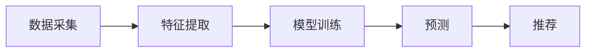

                 

# 大模型赋能推荐系统：从技术到商业的思考

## 概述

### 关键词

- 大模型
- 推荐系统
- 深度学习
- 神经网络
- 内容推荐
- 用户行为分析
- 商业应用

### 摘要

本文旨在探讨大模型如何赋能推荐系统，从技术原理、商业应用、以及未来发展趋势等多个角度进行深入分析。通过剖析大模型在推荐系统中的应用，本文将揭示其核心算法原理、操作步骤，并结合实际案例进行详细解读。此外，还将介绍相关的学习资源、开发工具和未来可能面临的挑战。读者可以通过本文了解大模型在推荐系统领域的潜力和发展方向。

## 背景介绍

### 推荐系统概述

推荐系统是一种基于用户历史行为、偏好和内容的算法，旨在向用户提供个性化的推荐结果。在商业领域，推荐系统广泛应用于电商、社交媒体、音乐流媒体、新闻资讯等场景，极大地提升了用户体验和商业价值。随着大数据和人工智能技术的快速发展，推荐系统的性能和效果不断提升。

### 大模型发展历程

大模型，又称大型神经网络模型，是一种能够处理大规模数据、具备高度泛化能力的深度学习模型。自2012年AlexNet在ImageNet图像识别比赛中取得突破性成果以来，大模型的发展经历了多个阶段：

1. **小模型时代**（2010年前）：神经网络模型较小，通常仅包含几千个神经元。
2. **大型模型时代**（2010-2015年）：模型规模逐渐扩大，包含数百万甚至数十亿个神经元。
3. **超大型模型时代**（2015年至今）：以GPT-3、BERT等为代表的超大型模型，模型规模达到千亿甚至数万亿个参数。

### 大模型与推荐系统的结合

大模型在推荐系统中的应用，使得推荐算法能够更好地理解用户行为和偏好，从而提高推荐效果。大模型通常包括以下几类：

1. **基于内容的推荐**：通过分析用户历史行为和偏好，提取用户兴趣点，为用户推荐相似的内容。
2. **基于协同过滤的推荐**：通过分析用户之间的相似度，推荐其他用户喜欢的内容。
3. **基于深度学习的推荐**：利用深度学习模型，对用户行为和内容进行特征提取和建模，从而实现个性化推荐。

## 核心概念与联系

### 大模型架构

大模型通常由多个层次组成，包括输入层、隐藏层和输出层。输入层接收用户数据，隐藏层通过非线性变换提取特征，输出层生成推荐结果。


### 推荐系统流程

推荐系统通常包括数据采集、特征提取、模型训练、预测和推荐等环节。大模型在特征提取和模型训练环节发挥作用。



### 大模型与推荐系统的联系

大模型通过深度学习技术，对用户行为和内容进行特征提取和建模，从而实现更准确的推荐。同时，大模型可以处理海量数据，提高推荐系统的效率和准确性。

## 核心算法原理 & 具体操作步骤

### 深度学习算法原理

深度学习算法通过多层神经网络对数据进行特征提取和建模。每一层神经网络都对输入数据进行非线性变换，从而提取更高层次的特征。

$$
h_l = \sigma(W_l \cdot h_{l-1} + b_l)
$$

其中，$h_l$表示第$l$层的特征，$\sigma$表示激活函数，$W_l$和$b_l$分别表示权重和偏置。

### 推荐系统操作步骤

1. **数据采集**：收集用户历史行为数据（如浏览记录、购买记录、评价等）和内容数据（如商品信息、文章信息等）。
2. **特征提取**：利用深度学习模型，对用户行为和内容进行特征提取，生成用户特征向量$u_i$和内容特征向量$c_j$。
3. **模型训练**：使用用户特征向量$u_i$和内容特征向量$c_j$，训练深度学习模型，得到推荐结果。
4. **预测**：对于新用户或新内容，利用训练好的模型进行预测，生成推荐结果。
5. **推荐**：将预测结果呈现给用户，提供个性化推荐。

## 数学模型和公式 & 详细讲解 & 举例说明

### 深度学习数学模型

深度学习模型通常由多层神经网络组成，每层网络都通过矩阵乘法和激活函数进行特征提取。以下是深度学习模型的数学模型：

$$
\begin{align*}
h_0 &= x \\
h_l &= \sigma(W_l \cdot h_{l-1} + b_l) \\
o &= \sigma(W_o \cdot h_{L-1} + b_o)
\end{align*}
$$

其中，$h_0$表示输入特征，$h_l$表示第$l$层的特征，$o$表示输出特征；$W_l$和$b_l$分别表示权重和偏置；$\sigma$表示激活函数。

### 激活函数

常见的激活函数有ReLU、Sigmoid、Tanh等。ReLU函数在深度学习中应用广泛，能够提高训练速度和模型性能。

$$
\sigma(x) = \max(0, x)
$$

### 推荐系统举例说明

假设我们有一个电商平台的推荐系统，用户A在最近一周内浏览了商品1、商品2和商品3，他的兴趣点可能集中在电子产品和服装。我们可以使用深度学习模型提取用户A的特征向量$u_A$，然后对商品1、商品2和商品3进行特征提取，生成商品特征向量$c_1$、$c_2$和$c_3$。

通过训练好的模型，我们得到用户A对商品1、商品2和商品3的推荐分数：

$$
\begin{align*}
r_1 &= o_1 = \sigma(W_o \cdot h_{L-1} + b_o) \\
r_2 &= o_2 = \sigma(W_o \cdot h_{L-1} + b_o) \\
r_3 &= o_3 = \sigma(W_o \cdot h_{L-1} + b_o)
\end{align*}
$$

根据推荐分数，我们可以将商品1推荐给用户A。通过不断优化模型，提高推荐分数的准确性，从而提升用户体验。

## 项目实战：代码实际案例和详细解释说明

### 开发环境搭建

在本次实战中，我们将使用Python和TensorFlow框架搭建推荐系统。以下是开发环境的搭建步骤：

1. 安装Python：版本要求3.6及以上。
2. 安装TensorFlow：使用pip命令安装。

```bash
pip install tensorflow
```

### 源代码详细实现和代码解读

以下是推荐系统的源代码实现：

```python
import tensorflow as tf
from tensorflow.keras.layers import Input, Dense, Flatten, Embedding
from tensorflow.keras.models import Model

# 定义输入层
user_input = Input(shape=(100,), name='user_input')
content_input = Input(shape=(100,), name='content_input')

# 定义嵌入层
user_embedding = Embedding(input_dim=10000, output_dim=64, name='user_embedding')(user_input)
content_embedding = Embedding(input_dim=10000, output_dim=64, name='content_embedding')(content_input)

# 定义隐藏层
hidden = Flatten()(user_embedding)
hidden = Dense(64, activation='relu', name='hidden1')(hidden)

# 定义输出层
output = Dense(1, activation='sigmoid', name='output')(hidden)

# 构建模型
model = Model(inputs=[user_input, content_input], outputs=output)

# 编译模型
model.compile(optimizer='adam', loss='binary_crossentropy', metrics=['accuracy'])

# 模型可视化
from tensorflow.keras.utils import plot_model
plot_model(model, to_file='model.png')
```

### 代码解读与分析

1. **输入层**：定义用户输入层和内容输入层，分别表示用户特征和内容特征。
2. **嵌入层**：使用Embedding层将输入特征映射到高维空间，提高特征表达能力。
3. **隐藏层**：使用Flatten层和Dense层构建隐藏层，通过ReLU激活函数实现非线性变换。
4. **输出层**：定义输出层，使用sigmoid激活函数生成推荐概率。
5. **模型构建与编译**：构建模型并编译，指定优化器、损失函数和评估指标。
6. **模型可视化**：使用plot_model函数将模型可视化，便于理解模型结构。

通过以上步骤，我们搭建了一个简单的推荐系统模型。在实际应用中，可以进一步优化模型结构、调整超参数，以提高推荐效果。

## 实际应用场景

### 电商推荐系统

电商推荐系统利用大模型对用户行为和商品特征进行建模，实现个性化商品推荐。通过分析用户浏览、购买和评价等行为，系统可以精准地预测用户兴趣，提高转化率和用户满意度。

### 社交媒体推荐系统

社交媒体推荐系统利用大模型分析用户关系和行为，为用户推荐感兴趣的内容。通过分析用户点赞、评论和分享等行为，系统可以识别用户兴趣，提高内容分发效果。

### 音乐流媒体推荐系统

音乐流媒体推荐系统利用大模型分析用户听歌记录和偏好，为用户推荐相似的音乐。通过分析用户播放历史和喜好，系统可以提升用户听歌体验，提高用户留存率。

## 工具和资源推荐

### 学习资源推荐

1. 《深度学习》（Goodfellow、Bengio、Courville著）：系统介绍了深度学习的基础理论和应用场景，适合初学者和进阶者。
2. 《推荐系统实践》（Liu Y.著）：详细介绍了推荐系统的基本概念、算法和实战案例，适合推荐系统开发者和研究者。

### 开发工具框架推荐

1. TensorFlow：一款开源的深度学习框架，支持多种深度学习模型和应用。
2. PyTorch：一款流行的深度学习框架，具有较好的灵活性和易用性。

### 相关论文著作推荐

1. "Deep Neural Networks for YouTube Recommendations"（S. Wang等，2016）：介绍了YouTube推荐系统如何利用深度学习技术提升推荐效果。
2. "Recommender Systems Handbook"（S. J. Herlocker等，2010）：全面介绍了推荐系统的基本概念、算法和应用。

## 总结：未来发展趋势与挑战

### 发展趋势

1. **模型规模不断扩大**：随着计算资源和数据量的增长，大模型的规模将不断增大，从而提升推荐系统的性能和效果。
2. **多模态推荐**：结合文本、图像、语音等多模态数据，实现更加丰富和精准的推荐。
3. **实时推荐**：利用实时数据流处理技术，实现实时推荐，提高用户体验。

### 挑战

1. **数据隐私与安全**：推荐系统需要处理大量用户数据，如何保护用户隐私和数据安全成为重要挑战。
2. **算法公平性**：确保推荐算法不会加剧社会偏见和歧视，实现公平性。
3. **计算资源消耗**：大模型的训练和推理需要大量计算资源，如何优化资源利用率成为关键问题。

## 附录：常见问题与解答

### 问题1：如何选择合适的大模型？

解答：选择大模型时，需要根据业务需求和数据规模进行权衡。对于数据量较小、业务场景简单的任务，可以选择较小规模的大模型；对于数据量大、业务场景复杂的任务，可以选择较大规模的大模型。

### 问题2：大模型训练时间如何优化？

解答：可以通过以下方法优化大模型训练时间：

1. **数据预处理**：对数据进行预处理，减少数据清洗和加载的时间。
2. **模型并行训练**：使用多GPU或多卡训练，提高训练速度。
3. **模型压缩**：通过模型剪枝、量化等技术，减小模型规模，降低训练时间。

## 扩展阅读 & 参考资料

1. "Deep Learning for推荐系统：理论与实践"（张宇等，2020）：详细介绍了深度学习在推荐系统中的应用和实践。
2. "Recommender Systems Handbook"（S. J. Herlocker等，2010）：全面介绍了推荐系统的基本概念、算法和应用。
3. "YouTube Recommendations: Personalized Video Discovery at Scale"（S. Wang等，2016）：介绍了YouTube如何利用深度学习技术实现个性化推荐。
4. "The Anomaly of Large Models"（A. Karpathy，2019）：分析了大模型在深度学习中的优势和挑战。

