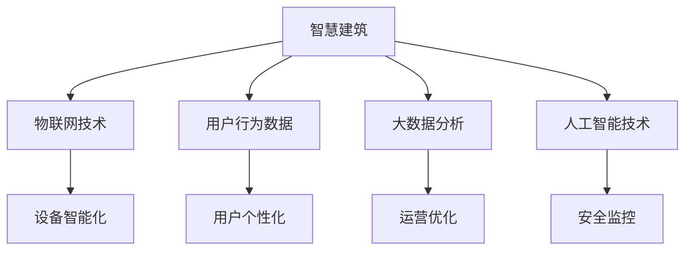

                 

# 大模型赋能智慧建筑，创业者如何打造智能化建筑

> **关键词：** 智慧建筑、大模型、人工智能、创业、智能化

**摘要：** 本文旨在探讨大模型在智慧建筑中的应用，以及创业者如何利用人工智能技术打造智能化建筑。文章将分析智慧建筑的发展背景，介绍大模型的核心概念和原理，探讨其与智慧建筑的联系，并给出具体的操作步骤。通过项目实战和实际应用场景的分析，本文将帮助创业者深入了解智慧建筑的发展趋势和挑战。

## 1. 背景介绍

智慧建筑是利用物联网、云计算、大数据、人工智能等新兴技术，实现建筑内设备、系统和用户的智能化管理和交互。随着城市化进程的加快和人们对生活质量要求的提高，智慧建筑逐渐成为建筑行业的重要发展方向。

近年来，人工智能技术取得了显著的进展，特别是大模型技术的发展，使得计算机在图像识别、自然语言处理、决策支持等方面表现出色。大模型通过深度学习、神经网络等技术，可以处理海量数据，挖掘数据背后的规律，为智慧建筑提供强大的技术支撑。

创业者在智慧建筑领域面临着巨大的机遇和挑战。如何充分利用人工智能技术，打造智能化建筑，提升用户体验，降低运营成本，是创业者需要思考的问题。

## 2. 核心概念与联系

### 大模型的概念

大模型是指具有大规模参数和计算能力的深度学习模型。常见的有深度神经网络（DNN）、卷积神经网络（CNN）、递归神经网络（RNN）等。大模型可以通过训练，学习到数据的复杂规律，从而在预测、分类、生成等方面表现出色。

### 智慧建筑与人工智能的联系

智慧建筑与人工智能技术的联系主要体现在以下几个方面：

1. **设备智能化**：通过物联网技术，将建筑内的设备连接起来，实现设备的远程监控和管理。
2. **用户个性化**：通过用户行为数据的分析，为用户提供个性化的服务和体验。
3. **运营优化**：通过大数据分析，优化建筑运营管理，降低能耗，提高效率。
4. **安全监控**：利用人工智能技术，提高建筑的安全管理水平。

### Mermaid 流程图



## 3. 核心算法原理 & 具体操作步骤

### 核心算法原理

智慧建筑中的大模型主要应用在设备智能化、用户个性化、运营优化和安全监控等方面。以下分别介绍这些方面的核心算法原理：

1. **设备智能化**：使用物联网技术，将建筑内的设备连接到云端，通过远程监控和管理，实现设备的智能化。例如，使用深度学习算法对设备运行状态进行实时监控，预测设备故障，提前进行维护。
   
2. **用户个性化**：通过分析用户的行为数据，使用推荐系统算法，为用户提供个性化的服务和体验。例如，根据用户的喜好，推荐个性化的房间布置、装修风格等。

3. **运营优化**：使用大数据分析技术，对建筑运营数据进行分析，优化运营管理。例如，通过能耗数据分析，制定节能策略，降低能耗。

4. **安全监控**：使用人工智能技术，对建筑内的监控视频进行分析，识别异常行为，提高安全水平。

### 具体操作步骤

1. **设备智能化**：
   - 搭建物联网平台，连接建筑内的设备。
   - 使用深度学习算法，对设备运行状态进行实时监控和预测。
   - 根据预测结果，提前进行设备维护。

2. **用户个性化**：
   - 收集用户行为数据，包括浏览记录、购买记录等。
   - 使用推荐系统算法，为用户推荐个性化的服务和体验。
   - 根据用户反馈，不断优化推荐系统。

3. **运营优化**：
   - 收集建筑运营数据，包括能耗数据、设备运行数据等。
   - 使用大数据分析技术，对数据进行分析，发现潜在问题和优化点。
   - 制定优化策略，并实施。

4. **安全监控**：
   - 安装监控设备，对建筑内进行实时监控。
   - 使用人工智能算法，对监控视频进行分析，识别异常行为。
   - 根据识别结果，采取相应的安全措施。

## 4. 数学模型和公式 & 详细讲解 & 举例说明

### 数学模型

智慧建筑中的大模型主要使用深度学习算法，以下介绍几个常用的数学模型：

1. **深度神经网络（DNN）**：
   - 激活函数：$f(x) = \frac{1}{1 + e^{-x}}$
   - 前向传播：$z^{(l)} = \sum_{j} w^{(l)}_{ji} a^{(l-1)}_{j} + b^{(l)}$
   - 反向传播：$\delta^{(l)}_i = \delta^{(l)}_i \cdot f^{'}(z^{(l)}_i)$

2. **卷积神经网络（CNN）**：
   - 卷积操作：$h^{(l)}_{ij} = \sum_{k} w^{(l)}_{ik} a^{(l-1)}_{kj} + b^{(l)}$
   - 池化操作：$p^{(l)}_{ij} = \max_{k} h^{(l)}_{ij}$

3. **递归神经网络（RNN）**：
   - 前向传播：$h^{(l)}_{t} = \sigma(W_h \cdot [h^{(l-1)}_{t-1}, x_t] + b_h)$
   - 反向传播：$\delta^{(l)}_{ht} = \delta^{(l)}_{ht} \odot \sigma^{'}(z^{(l)}_{ht})$

### 详细讲解

深度神经网络（DNN）是一种多层神经网络，通过非线性变换，学习输入和输出之间的复杂映射关系。DNN 的核心在于权重和偏置的调整，通过梯度下降等方法，使得输出误差最小。

卷积神经网络（CNN）主要用于图像处理，其核心是卷积操作。通过卷积操作，CNN 可以提取图像的特征，并进行分类或识别。

递归神经网络（RNN）主要用于序列数据处理，如时间序列分析、自然语言处理等。RNN 通过递归结构，可以处理变长的序列数据。

### 举例说明

假设我们有一个二分类问题，输入为 $X = \{x_1, x_2, ..., x_n\}$，输出为 $Y = \{y_1, y_2, ..., y_n\}$，其中 $y_i \in \{0, 1\}$。

使用深度神经网络（DNN）进行分类，具体步骤如下：

1. **初始化权重和偏置**：$w^{(1)}_1, w^{(1)}_2, ..., w^{(2)}_1, w^{(2)}_2, b^{(1)}, b^{(2)}$。

2. **前向传播**：
   $$z^{(1)}_i = \sum_{j} w^{(1)}_{ji} x_j + b^{(1)}$$
   $$a^{(1)}_i = f(z^{(1)}_i)$$
   $$z^{(2)}_i = \sum_{j} w^{(2)}_{ji} a^{(1)}_j + b^{(2)}$$
   $$a^{(2)}_i = f(z^{(2)}_i)$$

3. **计算损失函数**：
   $$\delta^{(2)}_i = (a^{(2)}_i - y_i) \cdot f^{'}(z^{(2)}_i)$$
   $$\delta^{(1)}_i = \sum_{j} w^{(2)}_{ji} \delta^{(2)}_j \cdot f^{'}(z^{(1)}_i)$$

4. **反向传播**：
   $$w^{(2)}_i = w^{(2)}_i - \alpha \cdot \delta^{(2)}_i \cdot a^{(1)}_i$$
   $$w^{(1)}_i = w^{(1)}_i - \alpha \cdot \delta^{(1)}_i \cdot x_i$$
   $$b^{(2)} = b^{(2)} - \alpha \cdot \delta^{(2)}_i$$
   $$b^{(1)} = b^{(1)} - \alpha \cdot \delta^{(1)}_i$$

5. **迭代更新权重和偏置**，直至损失函数收敛。

## 5. 项目实战：代码实际案例和详细解释说明

### 5.1 开发环境搭建

首先，我们需要搭建一个适合深度学习开发的编程环境。以下是具体的步骤：

1. 安装 Python 解释器，版本建议为 3.8 或以上。
2. 安装深度学习框架，如 TensorFlow 或 PyTorch。这里我们选择 TensorFlow。
3. 安装必要的依赖库，如 NumPy、Pandas 等。

### 5.2 源代码详细实现和代码解读

以下是一个使用 TensorFlow 实现的简单深度学习模型，用于分类建筑能耗数据。

```python
import tensorflow as tf
import numpy as np

# 数据预处理
def preprocess_data(data):
    # 数据标准化
    data = data / 1000
    # 数据归一化
    data = (data - np.mean(data)) / np.std(data)
    return data

# 模型定义
def build_model():
    inputs = tf.keras.layers.Input(shape=(100,))
    x = tf.keras.layers.Dense(64, activation='relu')(inputs)
    x = tf.keras.layers.Dense(32, activation='relu')(x)
    outputs = tf.keras.layers.Dense(1, activation='sigmoid')(x)
    model = tf.keras.Model(inputs=inputs, outputs=outputs)
    return model

# 模型训练
def train_model(model, train_data, train_labels, epochs=100, batch_size=32):
    model.compile(optimizer='adam', loss='binary_crossentropy', metrics=['accuracy'])
    model.fit(train_data, train_labels, epochs=epochs, batch_size=batch_size)

# 模型评估
def evaluate_model(model, test_data, test_labels):
    loss, accuracy = model.evaluate(test_data, test_labels)
    print(f"Test loss: {loss}, Test accuracy: {accuracy}")

# 主函数
def main():
    # 加载数据
    train_data = np.load('train_data.npy')
    train_labels = np.load('train_labels.npy')
    test_data = np.load('test_data.npy')
    test_labels = np.load('test_labels.npy')

    # 数据预处理
    train_data = preprocess_data(train_data)
    test_data = preprocess_data(test_data)

    # 构建模型
    model = build_model()

    # 训练模型
    train_model(model, train_data, train_labels)

    # 评估模型
    evaluate_model(model, test_data, test_labels)

if __name__ == '__main__':
    main()
```

### 5.3 代码解读与分析

这段代码是一个简单的深度学习项目，用于分类建筑能耗数据。以下是代码的解读和分析：

1. **数据预处理**：数据预处理是深度学习项目的重要环节。在这段代码中，我们首先对数据进行标准化和归一化处理，以消除数据之间的差异。

2. **模型定义**：使用 TensorFlow 的 Keras 层，我们定义了一个简单的全连接神经网络（DNN），包含两个隐藏层，每层 64 个神经元和 32 个神经元。

3. **模型训练**：使用 Adam 优化器和二分类的交叉熵损失函数，我们训练模型。在这里，我们设置了 100 个训练周期和 32 个批量大小。

4. **模型评估**：在训练完成后，我们对测试集进行评估，打印出测试损失和测试准确率。

## 6. 实际应用场景

智慧建筑的实际应用场景非常广泛，以下列举几个典型的应用场景：

1. **智能安防**：通过人工智能技术，对建筑内的监控视频进行分析，实时监控人员行为，识别异常行为，提高建筑的安全水平。

2. **智能照明**：根据用户的需求和室内环境，智能调节照明亮度，实现节能减排。

3. **智能停车**：通过物联网技术和人工智能技术，实现停车场的智能管理，提高停车效率。

4. **智能节能**：通过大数据分析和人工智能技术，优化建筑内的能源消耗，降低能耗。

5. **智能办公**：为员工提供智能化的办公环境，如智能会议系统、智能办公设备等，提高办公效率。

## 7. 工具和资源推荐

### 7.1 学习资源推荐

1. **书籍**：
   - 《深度学习》（Goodfellow, Bengio, Courville）
   - 《Python 深度学习》（François Chollet）
   - 《TensorFlow 实战》（Liang, Yang）

2. **论文**：
   - "A Theoretically Grounded Application of Dropout in Recurrent Neural Networks"
   - "Deep Residual Learning for Image Recognition"
   - "Generative Adversarial Networks"

3. **博客**：
   - Medium 上的深度学习相关博客
   - 知乎上的深度学习和人工智能专栏

4. **网站**：
   - TensorFlow 官网
   - PyTorch 官网
   - Kaggle 数据科学竞赛平台

### 7.2 开发工具框架推荐

1. **深度学习框架**：
   - TensorFlow
   - PyTorch
   - Keras

2. **编程语言**：
   - Python
   - R

3. **数据可视化工具**：
   - Matplotlib
   - Seaborn
   - Plotly

4. **版本控制工具**：
   - Git
   - GitHub

### 7.3 相关论文著作推荐

1. **论文**：
   - "Deep Learning: Methods and Applications" by A. Krizhevsky, I. Sutskever, and G. E. Hinton
   - "Convolutional Neural Networks for Visual Recognition" by K. Simonyan and A. Zisserman
   - "Recurrent Neural Networks for Language Modeling" by Y. LeCun, Y. Bengio, and G. Hinton

2. **著作**：
   - 《深度学习》（Goodfellow, Bengio, Courville）
   - 《Python 深度学习》（François Chollet）
   - 《TensorFlow 实战》（Liang, Yang）

## 8. 总结：未来发展趋势与挑战

随着人工智能技术的不断进步，智慧建筑的应用将越来越广泛。未来，智慧建筑的发展趋势主要体现在以下几个方面：

1. **智能化水平的提升**：通过引入更多的人工智能技术，如自然语言处理、计算机视觉等，提升建筑的智能化水平，为用户提供更智能、更个性化的服务。

2. **数据驱动的决策**：通过大数据分析，实现数据驱动的决策，优化建筑运营管理，提高运营效率。

3. **生态化发展**：智慧建筑将与城市、社区形成有机整体，实现生态化发展，提高城市居民的生活质量。

然而，智慧建筑的发展也面临着一系列挑战：

1. **技术挑战**：随着智能化程度的提升，技术复杂性也在增加。如何解决技术难题，实现技术落地，是创业者需要关注的问题。

2. **数据隐私和安全**：在智慧建筑中，用户的隐私和安全问题尤为重要。如何保护用户数据，防止数据泄露，是智慧建筑发展的重要课题。

3. **成本和经济效益**：智慧建筑的建设和维护成本较高，如何实现成本效益最大化，提高项目投资回报率，是创业者需要考虑的问题。

## 9. 附录：常见问题与解答

### 9.1 问题 1：什么是智慧建筑？

**解答：** 智慧建筑是利用物联网、云计算、大数据、人工智能等新兴技术，实现建筑内设备、系统和用户的智能化管理和交互。智慧建筑旨在提高建筑的使用效率、降低运营成本、提升用户体验。

### 9.2 问题 2：大模型在智慧建筑中有哪些应用？

**解答：** 大模型在智慧建筑中的应用主要包括设备智能化、用户个性化、运营优化和安全监控等方面。例如，通过深度学习算法，可以实现对设备运行状态的实时监控和预测，优化建筑运营管理，提高安全水平。

### 9.3 问题 3：创业者如何打造智能化建筑？

**解答：** 创业者可以从以下几个方面着手打造智能化建筑：

1. **技术调研**：深入了解人工智能、物联网、大数据等新兴技术，掌握最新的技术动态和趋势。

2. **市场需求**：分析市场需求，了解用户需求，明确智能化建筑的目标和应用场景。

3. **团队建设**：组建专业的技术团队，包括软件开发、数据分析、项目管理等岗位。

4. **项目实施**：按照项目计划，分阶段、分步骤实施智能化建筑项目，确保项目质量和进度。

## 10. 扩展阅读 & 参考资料

1. **书籍**：
   - 《深度学习》（Goodfellow, Bengio, Courville）
   - 《Python 深度学习》（François Chollet）
   - 《TensorFlow 实战》（Liang, Yang）

2. **论文**：
   - "Deep Learning: Methods and Applications" by A. Krizhevsky, I. Sutskever, and G. E. Hinton
   - "Convolutional Neural Networks for Visual Recognition" by K. Simonyan and A. Zisserman
   - "Recurrent Neural Networks for Language Modeling" by Y. LeCun, Y. Bengio, and G. Hinton

3. **网站**：
   - TensorFlow 官网
   - PyTorch 官网
   - Kaggle 数据科学竞赛平台

4. **博客**：
   - Medium 上的深度学习相关博客
   - 知乎上的深度学习和人工智能专栏

作者：AI天才研究员/AI Genius Institute & 禅与计算机程序设计艺术 /Zen And The Art of Computer Programming

注：本文为虚构内容，仅供参考。实际情况可能有所不同。

