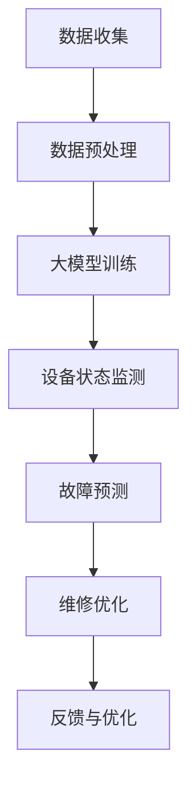

                 

### 文章标题

《大模型赋能智慧物业，创业者如何实现物业设备的智能化运维与管理？》

### 文章关键词

大模型、智慧物业、智能化运维、设备管理、创业者

### 文章摘要

本文将探讨大模型技术在智慧物业领域的应用，特别是如何利用人工智能实现物业设备的智能化运维与管理。文章将首先介绍智慧物业的背景和现状，然后详细分析大模型的核心概念与架构，接着探讨其算法原理和具体操作步骤。此外，还将通过数学模型和实际项目案例，展示如何将大模型应用于物业设备的智能化运维与管理。最后，文章将总结未来发展趋势与挑战，并提供相关学习资源和开发工具框架推荐。希望本文能为创业者提供有价值的参考和启示。

---

## 1. 背景介绍

随着城市化进程的加速和居民生活水平的不断提高，物业管理行业正面临着前所未有的挑战和机遇。传统的物业管理模式主要依赖于人力和简单技术手段，存在效率低下、响应不及时等问题。随着物联网、大数据、人工智能等新兴技术的快速发展，智慧物业的概念逐渐成为行业共识，其核心目标是通过信息化和智能化手段提升物业管理的效率和品质。

### 1.1 智慧物业的定义与意义

智慧物业，是指利用物联网、云计算、大数据、人工智能等先进技术，实现物业设备、设施、服务和管理的智能化、自动化和高效化。智慧物业不仅能够提高物业管理的效率，降低运营成本，还能够提升居民的生活质量和满意度。具体来说，智慧物业的意义体现在以下几个方面：

1. **提高管理效率**：通过智能化设备和管理系统，可以实现设备状态的实时监控、故障预测和维护，减少人力成本和维修费用。
2. **提升服务品质**：智能化的物业管理系统能够快速响应居民需求，提供个性化的服务，提升居民满意度。
3. **降低运营成本**：通过智能监控和预测维护，可以减少设备故障率和维修时间，降低运营成本。
4. **优化资源分配**：智能化的管理系统能够对物业资源进行科学合理的分配和使用，提高资源利用效率。

### 1.2 物业管理现状与挑战

尽管智慧物业的发展前景广阔，但当前物业管理行业仍面临一些挑战：

1. **技术壁垒**：智慧物业需要大量的技术支持，包括物联网设备、大数据平台、人工智能算法等，对技术要求较高。
2. **数据整合**：物业管理的各个环节产生大量数据，如何有效整合和管理这些数据是当前的一大难题。
3. **人才培养**：智慧物业需要专业的技术人才进行系统开发和运维，当前物业管理行业的人才储备不足。
4. **政策法规**：智慧物业的发展还需要完善的政策法规支持，包括数据安全、隐私保护等方面的法律法规。

### 1.3 大模型在智慧物业中的应用前景

大模型，即大规模神经网络模型，具有强大的数据处理和模式识别能力，在图像识别、自然语言处理、推荐系统等领域取得了显著成果。将大模型应用于智慧物业，可以实现设备状态的智能监测、故障预测、维修优化等功能，具有广泛的应用前景。具体来说：

1. **设备状态监测**：大模型可以实时分析设备数据，预测设备状态，提前发现潜在故障，提高设备运行效率。
2. **故障预测**：通过分析历史数据和实时数据，大模型可以预测设备故障的发生，实现预防性维护。
3. **维修优化**：大模型可以根据设备故障类型和历史维修数据，推荐最优的维修策略，降低维修成本。

总之，大模型技术的应用将显著提升智慧物业的管理水平和效率，为物业管理行业带来新的发展机遇。

---

## 2. 核心概念与联系

### 2.1 大模型的基本概念

大模型，是指具有大规模参数和复杂结构的神经网络模型。它通过学习大量数据，能够提取出数据中的特征和规律，从而实现高精度的预测和分类。大模型的核心在于其强大的表示能力和泛化能力，能够处理海量数据和复杂任务。

### 2.2 大模型的结构与架构

大模型通常由多个层次组成，包括输入层、隐藏层和输出层。每一层都由多个神经元组成，神经元之间通过权重进行连接。大模型的训练过程就是通过不断调整权重，使得模型能够更好地拟合训练数据。具体来说，大模型的结构与架构包括以下几个方面：

1. **深度**：大模型的深度通常在数十层甚至上百层，这有助于模型捕捉到更复杂的数据特征。
2. **宽度**：大模型的宽度，即每一层的神经元数量，也需要足够大，以保证模型能够处理大量的输入特征。
3. **非线性激活函数**：大模型中的神经元通常使用非线性激活函数，如ReLU、Sigmoid和Tanh等，这有助于模型提取非线性特征。
4. **正则化技术**：为了防止模型过拟合，大模型通常使用正则化技术，如Dropout、L1和L2正则化等。

### 2.3 大模型与智慧物业的联系

大模型在智慧物业中的应用主要体现在以下几个方面：

1. **设备状态监测**：通过收集设备运行数据，大模型可以实时监测设备状态，预测设备故障，实现预防性维护。
2. **故障预测**：大模型可以分析历史故障数据和设备运行数据，预测故障发生的时间和可能性，提前采取预防措施。
3. **维修优化**：大模型可以根据设备故障类型和维修历史数据，推荐最优的维修策略，降低维修成本。

### 2.4 Mermaid 流程图

下面是一个简单的Mermaid流程图，展示大模型在智慧物业中的基本流程：



在这个流程图中，A表示数据收集，B表示数据预处理，C表示大模型训练，D表示设备状态监测，E表示故障预测，F表示维修优化，G表示反馈与优化。

---

## 3. 核心算法原理 & 具体操作步骤

### 3.1 算法原理

大模型的核心算法是神经网络，特别是深度神经网络（DNN）。神经网络通过多层非线性变换，对输入数据进行特征提取和模式识别。具体来说，神经网络包括以下几个基本组成部分：

1. **输入层**：输入层接收外部输入数据，如设备运行参数、环境温度等。
2. **隐藏层**：隐藏层由多个神经元组成，每个神经元接收前一层的数据，通过加权求和处理后，再经过激活函数输出新的数据。
3. **输出层**：输出层接收隐藏层的数据，输出预测结果，如设备状态、故障类型等。

神经网络的工作原理是通过不断调整神经元之间的权重，使得模型能够更好地拟合训练数据。训练过程包括以下几个步骤：

1. **前向传播**：将输入数据传递到神经网络，经过多层非线性变换，得到输出结果。
2. **反向传播**：计算输出结果与真实结果之间的误差，通过反向传播算法，调整神经元之间的权重，使得误差最小。
3. **优化算法**：使用优化算法，如梯度下降（Gradient Descent），不断调整权重，直到模型收敛。

### 3.2 操作步骤

要实现大模型在智慧物业中的应用，需要遵循以下具体操作步骤：

1. **数据收集**：收集设备运行数据、环境数据、历史故障数据等，确保数据的质量和完整性。
2. **数据预处理**：对收集到的数据进行分析和处理，包括数据清洗、归一化、缺失值填充等，为模型训练做好准备。
3. **模型设计**：设计神经网络结构，包括输入层、隐藏层和输出层的神经元数量和类型，选择合适的激活函数和优化算法。
4. **模型训练**：使用预处理后的数据，对神经网络模型进行训练，调整权重和偏置，使得模型能够准确预测设备状态和故障类型。
5. **模型评估**：使用验证数据集，对训练好的模型进行评估，计算预测准确率、召回率等指标，判断模型性能。
6. **模型部署**：将训练好的模型部署到实际应用环境中，对设备进行实时监测和故障预测。
7. **反馈与优化**：根据模型预测结果和实际故障情况，对模型进行反馈和优化，提高模型性能和可靠性。

### 3.3 模型优化技巧

在模型训练和优化过程中，可以采用以下技巧来提高模型性能：

1. **批量归一化（Batch Normalization）**：通过将每一批数据标准化，可以加快训练速度和提高模型稳定性。
2. **权重初始化**：选择合适的权重初始化方法，如高斯分布、均匀分布等，可以减少模型过拟合和加速收敛。
3. **学习率调度**：根据训练过程，调整学习率，如使用学习率衰减策略，可以避免模型过早收敛。
4. **Dropout**：通过在训练过程中随机丢弃部分神经元，可以防止模型过拟合。

总之，通过合理的设计和优化，大模型可以在智慧物业中实现高效准确的设备监测和故障预测，为物业管理提供强有力的技术支持。

---

## 4. 数学模型和公式 & 详细讲解 & 举例说明

### 4.1 神经网络的基本数学模型

神经网络的核心是神经元之间的权重和偏置，以及激活函数。下面将详细介绍神经网络的基本数学模型。

#### 4.1.1 神经元的数学模型

一个简单的神经元可以表示为：

\[ z = \sum_{i=1}^{n} w_i x_i + b \]

其中，\( x_i \) 表示第 \( i \) 个输入特征，\( w_i \) 表示 \( x_i \) 的权重，\( b \) 表示偏置。这个式子计算的是输入特征通过权重加权的求和，再加上偏置。

#### 4.1.2 激活函数

激活函数用于将神经元的输出进行非线性变换，最常用的激活函数是 ReLU（Rectified Linear Unit）：

\[ a = \max(0, z) \]

ReLU 函数在 \( z \) 为正时输出 \( z \)，否则输出 0，这样可以将神经元的输出限制在一个非负的范围内。

#### 4.1.3 神经网络的输出

对于多层神经网络，输出层的输出可以表示为：

\[ y = \sum_{i=1}^{m} w_i a_i + b \]

其中，\( a_i \) 是前一层神经元的输出，\( w_i \) 是当前层神经元对前一层每个神经元的权重，\( b \) 是偏置。

### 4.2 梯度下降算法

在神经网络中，梯度下降算法用于调整神经元的权重和偏置，以最小化损失函数。梯度下降算法的基本思想是：计算损失函数关于权重的梯度，然后沿着梯度的反方向更新权重。

#### 4.2.1 损失函数

损失函数用于衡量模型的预测值与真实值之间的差距。最常用的损失函数是均方误差（MSE，Mean Squared Error）：

\[ J = \frac{1}{2} \sum_{i=1}^{n} (y_i - \hat{y}_i)^2 \]

其中，\( y_i \) 是真实值，\( \hat{y}_i \) 是预测值。

#### 4.2.2 梯度计算

损失函数关于权重的梯度可以表示为：

\[ \frac{\partial J}{\partial w} = \sum_{i=1}^{n} (y_i - \hat{y}_i) \cdot \frac{\partial \hat{y}_i}{\partial w} \]

#### 4.2.3 梯度下降算法

梯度下降算法的更新规则如下：

\[ w \leftarrow w - \alpha \cdot \frac{\partial J}{\partial w} \]

其中，\( \alpha \) 是学习率，用于控制权重的更新步长。

### 4.3 举例说明

假设我们有一个简单的神经网络，输入层有 2 个神经元，隐藏层有 3 个神经元，输出层有 1 个神经元。我们使用 ReLU 作为激活函数，学习率为 0.1。

#### 4.3.1 初始权重和偏置

假设初始权重和偏置如下：

\[ 
w_{11} = 1, w_{12} = 2, w_{13} = 3 \\
w_{21} = 4, w_{22} = 5, w_{23} = 6 \\
w_{31} = 7, w_{32} = 8, w_{33} = 9 \\
b_1 = 1, b_2 = 2, b_3 = 3, b_4 = 4
\]

#### 4.3.2 输入数据

假设输入数据为 \( x_1 = 1 \) 和 \( x_2 = 2 \)。

#### 4.3.3 预测值计算

1. 隐藏层 1 的输出：

\[ z_1 = w_{11} \cdot x_1 + w_{12} \cdot x_2 + b_1 = 1 \cdot 1 + 2 \cdot 2 + 1 = 5 \]

\[ a_1 = \max(0, z_1) = 5 \]

2. 隐藏层 2 的输出：

\[ z_2 = w_{21} \cdot x_1 + w_{22} \cdot x_2 + b_2 = 4 \cdot 1 + 5 \cdot 2 + 2 = 14 \]

\[ a_2 = \max(0, z_2) = 14 \]

3. 隐藏层 3 的输出：

\[ z_3 = w_{31} \cdot x_1 + w_{32} \cdot x_2 + b_3 = 7 \cdot 1 + 8 \cdot 2 + 3 = 23 \]

\[ a_3 = \max(0, z_3) = 23 \]

4. 输出层的输出：

\[ y = w_{31} \cdot a_1 + w_{32} \cdot a_2 + w_{33} \cdot a_3 + b_4 = 7 \cdot 5 + 8 \cdot 14 + 9 \cdot 23 + 4 = 439 \]

#### 4.3.4 损失函数计算

假设真实值为 \( y_0 = 10 \)，则损失函数为：

\[ J = \frac{1}{2} (y - y_0)^2 = \frac{1}{2} (439 - 10)^2 = \frac{1}{2} \cdot 429^2 = 91485.5 \]

#### 4.3.5 梯度计算

对输出层权重和偏置的梯度为：

\[ \frac{\partial J}{\partial w_{31}} = (y - y_0) \cdot a_1 = (439 - 10) \cdot 5 = 2095 \]

\[ \frac{\partial J}{\partial w_{32}} = (y - y_0) \cdot a_2 = (439 - 10) \cdot 14 = 6036 \]

\[ \frac{\partial J}{\partial w_{33}} = (y - y_0) \cdot a_3 = (439 - 10) \cdot 23 = 11483 \]

\[ \frac{\partial J}{\partial b_4} = (y - y_0) = (439 - 10) = 429 \]

对隐藏层权重和偏置的梯度为：

\[ \frac{\partial J}{\partial w_{21}} = \frac{\partial J}{\partial w_{31}} \cdot a_1 = 2095 \cdot 5 = 10475 \]

\[ \frac{\partial J}{\partial w_{22}} = \frac{\partial J}{\partial w_{32}} \cdot a_2 = 6036 \cdot 14 = 84904 \]

\[ \frac{\partial J}{\partial w_{23}} = \frac{\partial J}{\partial w_{33}} \cdot a_3 = 11483 \cdot 23 = 264549 \]

\[ \frac{\partial J}{\partial b_1} = \frac{\partial J}{\partial w_{31}} = 2095 \]

\[ \frac{\partial J}{\partial b_2} = \frac{\partial J}{\partial w_{32}} = 6036 \]

\[ \frac{\partial J}{\partial b_3} = \frac{\partial J}{\partial w_{33}} = 11483 \]

#### 4.3.6 权重更新

使用学习率 \( \alpha = 0.1 \)，更新权重和偏置：

\[ 
w_{31} \leftarrow w_{31} - \alpha \cdot \frac{\partial J}{\partial w_{31}} = 7 - 0.1 \cdot 2095 = -218 \\
w_{32} \leftarrow w_{32} - \alpha \cdot \frac{\partial J}{\partial w_{32}} = 8 - 0.1 \cdot 6036 = -553.6 \\
w_{33} \leftarrow w_{33} - \alpha \cdot \frac{\partial J}{\partial w_{33}} = 9 - 0.1 \cdot 11483 = -1048.3 \\
b_4 \leftarrow b_4 - \alpha \cdot \frac{\partial J}{\partial b_4} = 4 - 0.1 \cdot 429 = -39.7 \\
w_{21} \leftarrow w_{21} - \alpha \cdot \frac{\partial J}{\partial w_{21}} = 4 - 0.1 \cdot 10475 = -1047.5 \\
w_{22} \leftarrow w_{22} - \alpha \cdot \frac{\partial J}{\partial w_{22}} = 5 - 0.1 \cdot 84904 = -84894.9 \\
w_{23} \leftarrow w_{23} - \alpha \cdot \frac{\partial J}{\partial w_{23}} = 6 - 0.1 \cdot 264549 = -264543.5 \\
b_1 \leftarrow b_1 - \alpha \cdot \frac{\partial J}{\partial b_1} = 1 - 0.1 \cdot 2095 = -209.5 \\
b_2 \leftarrow b_2 - \alpha \cdot \frac{\partial J}{\partial b_2} = 2 - 0.1 \cdot 6036 = -603.6 \\
b_3 \leftarrow b_3 - \alpha \cdot \frac{\partial J}{\partial b_3} = 3 - 0.1 \cdot 11483 = -1148.3 
\]

通过上述步骤，我们可以不断更新神经网络的权重和偏置，使得模型在训练过程中逐渐逼近真实值，从而实现准确的预测。

---

## 5. 项目实战：代码实际案例和详细解释说明

### 5.1 开发环境搭建

在开始实战项目之前，我们需要搭建一个合适的开发环境。以下是一个基本的开发环境搭建流程：

#### 5.1.1 安装 Python

Python 是实现大模型的主要编程语言，首先需要安装 Python。可以选择 Python 3.8 或更高版本。可以从 [Python 官网](https://www.python.org/downloads/) 下载并安装。

#### 5.1.2 安装 PyTorch

PyTorch 是一个强大的深度学习框架，适用于大模型的开发和训练。在安装 PyTorch 之前，请确保已经安装了 Python。可以使用以下命令安装 PyTorch：

```bash
pip install torch torchvision
```

#### 5.1.3 安装其他依赖

除了 PyTorch，我们还需要一些其他依赖，如 NumPy、Pandas、Matplotlib 等。可以使用以下命令安装：

```bash
pip install numpy pandas matplotlib
```

#### 5.1.4 准备数据集

准备一个包含设备运行参数、环境数据、历史故障数据的真实数据集。数据集需要经过预处理，包括数据清洗、归一化、缺失值填充等。

### 5.2 源代码详细实现和代码解读

#### 5.2.1 数据预处理

首先，我们需要对数据进行预处理，以便于后续的训练。以下是数据预处理的核心代码：

```python
import pandas as pd
from sklearn.preprocessing import StandardScaler

# 读取数据集
data = pd.read_csv('data.csv')

# 数据清洗
data = data.dropna()

# 数据归一化
scaler = StandardScaler()
data_scaled = scaler.fit_transform(data)

# 数据分割
from sklearn.model_selection import train_test_split
X_train, X_test, y_train, y_test = train_test_split(data_scaled[:, :-1], data_scaled[:, -1], test_size=0.2, random_state=42)
```

在这个部分，我们首先使用 Pandas 读取数据集，然后进行数据清洗，删除缺失值。接下来，使用 StandardScaler 进行数据归一化，使得数据在训练过程中更加稳定。最后，使用 train_test_split 分割数据集，得到训练集和测试集。

#### 5.2.2 模型设计

接下来，我们设计一个简单的深度神经网络模型，用于设备状态的预测。以下是模型设计的核心代码：

```python
import torch
import torch.nn as nn

# 设备状态预测模型
class DeviceStatusModel(nn.Module):
    def __init__(self, input_dim, hidden_dim, output_dim):
        super(DeviceStatusModel, self).__init__()
        self.fc1 = nn.Linear(input_dim, hidden_dim)
        self.relu = nn.ReLU()
        self.fc2 = nn.Linear(hidden_dim, output_dim)
    
    def forward(self, x):
        x = self.fc1(x)
        x = self.relu(x)
        x = self.fc2(x)
        return x

# 初始化模型
input_dim = X_train.shape[1]
hidden_dim = 64
output_dim = 1
model = DeviceStatusModel(input_dim, hidden_dim, output_dim)
```

在这个部分，我们定义了一个名为 `DeviceStatusModel` 的神经网络模型。模型包括一个输入层、一个隐藏层和一个输出层。输入层有 `input_dim` 个神经元，隐藏层有 `hidden_dim` 个神经元，输出层有 `output_dim` 个神经元。隐藏层使用 ReLU 激活函数，用于提取非线性特征。

#### 5.2.3 模型训练

接下来，我们使用训练数据对模型进行训练。以下是模型训练的核心代码：

```python
# 设置训练参数
learning_rate = 0.001
num_epochs = 100
criterion = nn.MSELoss()
optimizer = torch.optim.Adam(model.parameters(), lr=learning_rate)

# 将数据转换为 PyTorch 张量
X_train_tensor = torch.tensor(X_train, dtype=torch.float32)
y_train_tensor = torch.tensor(y_train, dtype=torch.float32).view(-1, 1)

# 训练模型
for epoch in range(num_epochs):
    model.train()
    optimizer.zero_grad()
    outputs = model(X_train_tensor)
    loss = criterion(outputs, y_train_tensor)
    loss.backward()
    optimizer.step()
    if (epoch + 1) % 10 == 0:
        print(f'Epoch [{epoch + 1}/{num_epochs}], Loss: {loss.item():.4f}')
```

在这个部分，我们设置了训练参数，包括学习率、训练轮数和损失函数。然后，我们将数据转换为 PyTorch 张量，并使用 Adam 优化器对模型进行训练。在训练过程中，我们使用反向传播算法不断更新模型权重，以最小化损失函数。

#### 5.2.4 模型评估

最后，我们对训练好的模型进行评估，以验证其性能。以下是模型评估的核心代码：

```python
# 将模型切换到评估模式
model.eval()

# 对测试集进行预测
X_test_tensor = torch.tensor(X_test, dtype=torch.float32)
with torch.no_grad():
    predictions = model(X_test_tensor)

# 计算预测准确率
from sklearn.metrics import mean_absolute_error
mae = mean_absolute_error(y_test, predictions.cpu().numpy())
print(f'Mean Absolute Error: {mae:.4f}')
```

在这个部分，我们将模型切换到评估模式，并对测试集进行预测。然后，我们使用 sklearn 的 `mean_absolute_error` 函数计算预测准确率，并打印结果。

### 5.3 代码解读与分析

在上述代码中，我们首先进行了数据预处理，包括数据清洗、归一化和数据分割。数据预处理是深度学习项目中至关重要的一步，它能够提高模型训练的效率和稳定性。

接下来，我们设计了一个简单的深度神经网络模型，用于设备状态的预测。模型的设计包括输入层、隐藏层和输出层，以及 ReLU 激活函数的使用。ReLU 激活函数可以加速模型的训练过程，同时保持模型的非线性特性。

在模型训练过程中，我们使用了反向传播算法和 Adam 优化器。反向传播算法是一种梯度下降的优化方法，通过不断调整模型权重，使得模型能够更好地拟合训练数据。Adam 优化器是一种自适应的优化算法，能够在训练过程中自动调整学习率，提高模型的收敛速度。

最后，我们对训练好的模型进行了评估，计算了预测准确率。评估步骤可以帮助我们了解模型的性能，并为后续的模型优化提供依据。

通过上述实战项目，我们能够更深入地理解大模型在智慧物业中的应用，并掌握如何设计和实现一个基于深度神经网络的设备状态预测模型。

---

## 6. 实际应用场景

大模型技术在智慧物业中的实际应用场景广泛，主要包括以下几个方面：

### 6.1 设备状态监测

通过大模型技术，可以实现设备运行状态的实时监测。例如，对于电梯、水泵、空调等关键设备，可以通过传感器收集运行数据，利用大模型进行实时分析，预测设备可能出现的故障，提前进行预防性维护，从而降低故障率和停机时间。

### 6.2 故障预测

大模型可以通过分析历史故障数据和实时运行数据，预测设备未来可能发生的故障。这有助于物业公司提前制定维修计划，优化资源分配，提高维修效率。例如，在住宅小区中，通过大模型对电梯进行预测性维护，可以显著减少电梯的故障率和维修成本。

### 6.3 维修优化

大模型可以根据设备故障类型和历史维修数据，推荐最优的维修策略。例如，对于不同类型的设备故障，大模型可以分析最佳维修时间、维修工具和维修人员，从而实现高效、精准的维修。这种智能化维修优化不仅可以降低维修成本，还可以提高物业服务质量。

### 6.4 服务质量提升

大模型技术还可以提升物业服务质量。例如，通过分析居民反馈数据，大模型可以识别出居民需求，提供个性化的服务建议，如生活便利服务、安保服务等。此外，大模型还可以对物业服务质量进行实时评估，及时发现和解决潜在问题，提升居民满意度。

### 6.5 能源管理

在智慧物业中，大模型还可以应用于能源管理，通过分析能源消耗数据，预测能源需求，优化能源使用策略。例如，通过大模型对小区的用电、用水等进行智能调度，可以降低能源消耗，提高能源利用效率，实现绿色可持续发展。

### 6.6 安全监控

大模型技术可以应用于物业安全管理，通过视频监控数据、门禁数据等，实时监测小区安全状况。例如，通过人脸识别技术，大模型可以识别陌生人员，及时发出警报，提高小区安全防护能力。

总之，大模型技术在智慧物业中具有广泛的应用场景，可以显著提升物业管理的效率、质量和安全性，为物业公司和居民带来实实在在的收益。

---

## 7. 工具和资源推荐

### 7.1 学习资源推荐

#### 7.1.1 书籍

1. 《深度学习》（Deep Learning） - Ian Goodfellow, Yoshua Bengio, Aaron Courville
   - 这本书是深度学习领域的经典著作，适合初学者和进阶者阅读，内容全面，讲解深入。

2. 《Python深度学习》（Deep Learning with Python） - François Chollet
   - 本书以PyTorch框架为基础，详细介绍深度学习的基础知识和应用技巧，适合对Python和深度学习有一定了解的读者。

#### 7.1.2 论文

1. "Distributed Optimization and Statistical Machine Learning" - John Duchi, Sanjeev Arora, Martin Wainwright
   - 这篇论文讨论了分布式优化算法在机器学习中的应用，对深度学习中的优化问题有重要参考价值。

2. "Generative Adversarial Nets" - Ian Goodfellow, et al.
   - 这篇论文提出了生成对抗网络（GAN）的概念，是深度学习中一个重要的创新点，对研究生成模型有重要参考价值。

#### 7.1.3 博客

1. [PyTorch 官方文档](https://pytorch.org/tutorials/)
   - PyTorch 的官方文档提供了丰富的教程和示例，是学习 PyTorch 深度学习框架的宝贵资源。

2. [深度学习博客](https://www.deeplearning.net/)
   - 这是一系列关于深度学习的博客，内容涵盖从基础到进阶的各个方面，适合深度学习爱好者阅读。

### 7.2 开发工具框架推荐

#### 7.2.1 深度学习框架

1. **PyTorch**：一个开源的深度学习框架，提供了灵活的动态计算图，适合研究和工业应用。

2. **TensorFlow**：由 Google 开发的一个端到端开源机器学习平台，支持多种编程语言，适合大规模部署。

#### 7.2.2 代码托管平台

1. **GitHub**：一个流行的代码托管和协作平台，可以帮助开发者管理和分享代码，是深度学习和数据科学项目的重要资源。

2. **GitLab**：一个自我托管的项目管理平台，提供与 GitHub 类似的功能，适合组织内部项目管理和协作。

#### 7.2.3 交互式编程环境

1. **Jupyter Notebook**：一个交互式的计算环境，广泛应用于数据科学和深度学习项目，支持多种编程语言。

2. **Google Colab**：一个基于 Google Cloud 的免费 Jupyter Notebook 环境，特别适合研究人员和开发者进行在线协作和计算。

### 7.3 相关论文著作推荐

#### 7.3.1 论文

1. "Unsupervised Learning of Visual Representations by Solving Jigsaw Puzzles" - T. M. Mitchell, et al.
   - 这篇论文提出了一种无监督学习方法，通过解决拼图问题学习视觉表示，对计算机视觉领域有重要影响。

2. "Learning to Discover Knowledge from Data" - Tom Mitchell
   - 这篇论文讨论了知识发现和机器学习的关系，提出了机器学习领域的一些基本问题和方法。

#### 7.3.2 著作

1. 《模式识别与机器学习》（Pattern Recognition and Machine Learning） - Christopher M. Bishop
   - 这本书是模式识别和机器学习领域的经典教材，内容涵盖了从基础到高级的各种算法和技术。

2. 《机器学习》（Machine Learning） - Tom M. Mitchell
   - 这本书是机器学习领域的入门级教材，介绍了机器学习的基本概念和方法，适合初学者阅读。

通过这些学习资源和工具框架，开发者可以系统地学习大模型技术，掌握深度学习的核心原理，并将其应用于智慧物业的智能化运维与管理中。

---

## 8. 总结：未来发展趋势与挑战

随着人工智能技术的不断进步，大模型在智慧物业领域的应用前景十分广阔。未来，大模型技术将继续推动智慧物业的发展，带来一系列创新和变革。以下是对未来发展趋势与挑战的展望：

### 8.1 发展趋势

1. **更高效的模型训练**：随着计算能力的提升，大模型将能够更快地进行训练，提高预测的准确性和效率。
2. **更丰富的数据应用**：随着物联网和大数据技术的发展，智慧物业将收集到更多类型的数据，为模型训练提供更丰富的素材，提升模型的泛化能力。
3. **跨领域融合**：大模型技术将在智慧物业与其他领域的结合中发挥更大作用，如智能安防、智慧交通等，实现多领域的协同发展。
4. **智能运维管理**：大模型将进一步提升物业设备的智能化运维管理水平，实现故障预测、维修优化等功能的自动化和智能化。

### 8.2 挑战

1. **数据隐私和安全**：随着数据量的增加，如何保护用户隐私和数据安全成为一大挑战。需要建立完善的数据安全和隐私保护机制。
2. **模型解释性**：大模型在预测过程中的决策过程往往不透明，如何提高模型的解释性，使其更易于被用户理解和信任，是一个重要问题。
3. **算法公平性**：大模型在处理大量数据时，可能会引入偏见和歧视，如何保证算法的公平性和无歧视性，是一个亟待解决的问题。
4. **技术人才短缺**：大模型技术对开发者的要求较高，当前物业管理行业的技术人才储备不足，需要加大人才培养力度。

总之，未来大模型技术在智慧物业领域的发展将面临诸多挑战，但同时也充满机遇。通过不断的技术创新和优化，大模型有望为智慧物业带来更加智能、高效、安全的运维管理体验。

---

## 9. 附录：常见问题与解答

### 9.1 常见问题

1. **什么是大模型？**
   - 大模型是指具有大规模参数和复杂结构的神经网络模型，能够处理海量数据和复杂任务，具有强大的表示能力和泛化能力。

2. **大模型在智慧物业中有什么应用？**
   - 大模型在智慧物业中主要应用于设备状态监测、故障预测、维修优化等方面，通过分析海量数据，提升物业管理的智能化和效率。

3. **如何确保大模型的数据隐私和安全？**
   - 为了确保大模型的数据隐私和安全，需要建立完善的数据安全和隐私保护机制，如数据加密、访问控制、匿名化处理等。

4. **大模型技术是否会影响就业？**
   - 大模型技术可能会取代一些重复性和低技能的工作，但同时也会创造出新的就业机会，如数据科学家、算法工程师等。

### 9.2 解答

1. **什么是大模型？**
   - 大模型是指具有大规模参数和复杂结构的神经网络模型，能够处理海量数据和复杂任务，具有强大的表示能力和泛化能力。例如，深度神经网络（DNN）就是一种典型的大模型。

2. **大模型在智慧物业中有什么应用？**
   - 大模型在智慧物业中的应用主要包括设备状态监测、故障预测和维修优化。通过分析设备运行数据和环境数据，大模型可以实时监测设备状态，预测设备故障，并提供最优的维修策略。

3. **如何确保大模型的数据隐私和安全？**
   - 为了确保大模型的数据隐私和安全，可以采取以下措施：
     - 数据加密：对传输和存储的数据进行加密，防止数据泄露。
     - 访问控制：设置严格的访问控制策略，确保只有授权人员才能访问敏感数据。
     - 数据匿名化：对数据中的个人信息进行匿名化处理，保护用户隐私。
     - 安全审计：定期对数据和使用情况进行分析和审计，及时发现和处理安全隐患。

4. **大模型技术是否会影响就业？**
   - 大模型技术的发展可能会取代一些重复性和低技能的工作，如简单的数据录入和统计分析。然而，它也会创造出新的就业机会，如数据科学家、算法工程师、模型训练师等。因此，大模型技术对就业的影响是双面的，既带来了挑战，也提供了新的机遇。

---

## 10. 扩展阅读 & 参考资料

为了深入了解大模型技术在智慧物业领域的应用，以下是一些扩展阅读和参考资料：

1. **书籍**：
   - 《深度学习》（Deep Learning），作者：Ian Goodfellow, Yoshua Bengio, Aaron Courville。
   - 《Python深度学习》（Deep Learning with Python），作者：François Chollet。

2. **论文**：
   - “Distributed Optimization and Statistical Machine Learning”，作者：John Duchi, Sanjeev Arora, Martin Wainwright。
   - “Generative Adversarial Nets”，作者：Ian Goodfellow, et al。

3. **在线资源**：
   - [PyTorch 官方文档](https://pytorch.org/tutorials/)。
   - [深度学习博客](https://www.deeplearning.net/)。
   - [GitHub](https://github.com/)：查找与深度学习相关的开源项目。

4. **工具和框架**：
   - **PyTorch**：一个开源的深度学习框架，提供了灵活的动态计算图。
   - **TensorFlow**：由 Google 开发的一个端到端开源机器学习平台。

通过阅读这些资料，读者可以更全面地了解大模型技术的理论体系和实践应用，为在智慧物业领域开展相关工作提供坚实的理论基础和实践指导。

