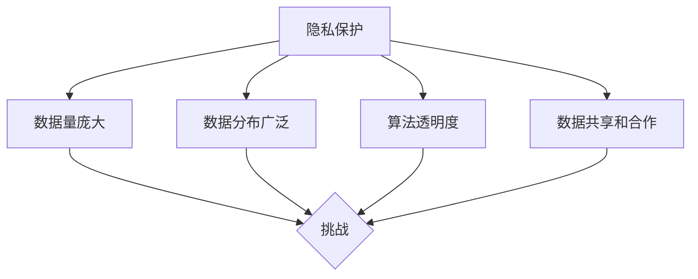
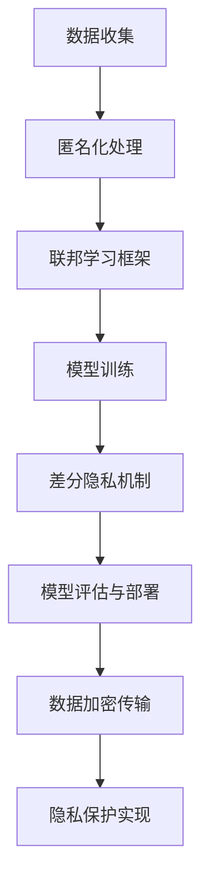

                 

### 背景介绍

随着人工智能（AI）技术的飞速发展，大模型软件在自然语言处理（NLP）、计算机视觉（CV）和机器学习（ML）等领域得到了广泛应用。然而，大模型软件的发展也带来了隐私保护方面的问题。隐私保护是当今信息技术领域的一个重要挑战，尤其是在涉及到大量用户数据时，如何确保用户隐私不被泄露，成为了研发者和政策制定者必须关注的问题。

首先，我们需要明确什么是隐私。隐私通常指的是个人不愿意与他人分享的个人信息，例如姓名、地址、电话号码、健康记录等。在数字化时代，个人信息往往以数据的形式存储和传输，这使得隐私保护变得尤为重要。大模型软件由于其复杂性和庞大的数据集，更容易成为隐私泄露的潜在源头。

隐私保护的目标是确保数据在收集、存储、处理和使用过程中不被未授权访问或滥用。在大模型软件中，隐私保护面临以下几个主要挑战：

1. **数据量庞大**：大模型软件通常需要大量的用户数据来进行训练和优化。这些数据往往包含敏感信息，如用户行为数据、位置信息等。
2. **数据分布广泛**：大模型软件的数据可能分布在不同的地理位置和服务器上，这使得隐私保护更加复杂。
3. **算法透明度**：大模型软件的算法通常非常复杂，对于普通用户而言难以理解，这增加了隐私泄露的风险。
4. **数据共享和合作**：在研究和开发过程中，大模型软件可能需要与其他研究机构或公司合作，这要求对数据共享和隐私保护进行精细设计。

为了应对这些挑战，隐私保护在大模型软件的设计中扮演着至关重要的角色。本文将深入探讨大模型软件隐私保护的设计原则、技术手段和实际应用，以期为相关领域的研发者和政策制定者提供有价值的参考。



在接下来的章节中，我们将详细讨论核心概念与联系、核心算法原理和具体操作步骤，并通过数学模型和实际项目案例来深入分析隐私保护的各个方面。

### 核心概念与联系

为了全面理解大模型软件的隐私保护设计，我们需要明确几个核心概念：隐私、匿名化、联邦学习和差分隐私。

首先，隐私是指个人信息不被未授权者访问和利用的状态。在数字化时代，隐私往往以数据形式存在，因此，保护隐私的核心在于如何确保数据的匿名性和安全性。

**匿名化**是一种常见的隐私保护技术，其目的是通过去除或模糊化个人信息，使数据在分析过程中无法识别特定个体。匿名化技术包括数据去标识化、数据泛化和数据加密等。去标识化是指从数据中移除可以直接识别个体的信息，如姓名、身份证号等；数据泛化则通过将具体信息替换为更泛化的类别或范围，如将具体年龄替换为年龄段；数据加密则是通过加密算法将数据转换为密文，从而在未经授权的情况下无法读取原始信息。

**联邦学习**是一种新兴的隐私保护技术，特别适用于需要跨多个数据源进行协同训练的情境。在联邦学习框架下，数据保存在本地设备上，模型训练过程是在多个设备之间共享参数，而不是共享原始数据。这样，每个设备只需要上传和接收模型参数，而不需要暴露本地数据，从而实现了数据的本地化存储和隐私保护。

**差分隐私**是一种数学上的隐私保护机制，它通过对输出结果进行随机化处理，使得单个记录的存在无法被识别，即使攻击者拥有大量样本数据。差分隐私的核心是ε-delta定义，其中ε表示隐私预算，代表对隐私泄露的容忍度；delta表示数据的扰动程度。差分隐私算法通常包括拉普拉斯机制和指数机制等，通过在算法输出中加入噪声，确保隐私保护的同时，维持算法的准确性。

这几种核心概念在大模型软件隐私保护中有着紧密的联系：

1. **匿名化与联邦学习**：联邦学习利用匿名化技术，如差分隐私，来确保数据在本地设备上的隐私保护。通过去标识化和泛化处理，原始数据在传输和共享过程中不会被直接暴露。
2. **差分隐私与模型训练**：差分隐私算法可以应用于模型训练过程中，确保每个参与方的模型更新不暴露其本地数据的具体内容，从而保护参与者的隐私。
3. **匿名化与数据加密**：数据加密技术可以与匿名化结合使用，确保数据在存储和传输过程中，即使被未授权者截获，也无法解读原始信息。

下面，我们将通过一个Mermaid流程图来展示这些核心概念的联系和应用场景：



通过上述流程，我们可以看到，从数据收集到模型部署的整个过程中，隐私保护技术贯穿始终，确保了用户隐私不被泄露。接下来，我们将进一步探讨这些隐私保护技术的具体原理和操作步骤。

### 核心算法原理 & 具体操作步骤

在了解了隐私保护的核心概念和联系后，我们将进一步探讨大模型软件隐私保护的核心算法原理及其具体操作步骤。

#### 差分隐私算法原理

差分隐私（Differential Privacy）是一种在统计查询中添加随机噪声来保护隐私的机制。其基本思想是，通过在输出结果中添加适当的噪声，使得单个记录的存在无法被识别，即使攻击者拥有大量样本数据。差分隐私的核心是ε-delta定义，其中ε称为隐私预算，表示对隐私泄露的容忍度；delta表示数据的扰动程度。

**ε-delta定义**：一个统计查询Q对于数据集D是（ε，δ）差分隐私的，如果对于所有相邻的数据集D'和D''，满足以下条件：

$$\text{Pr}[Q(D) \in R] \leq e^{\varepsilon} + \delta$$

$$\text{Pr}[Q(D') \in R] \leq e^{\varepsilon} + \delta$$

$$\text{Pr}[Q(D'') \in R] \le{e^{\varepsilon} + \delta}$$

其中R是查询Q的输出空间，Pr表示概率。

差分隐私的常用实现机制包括拉普拉斯机制（Laplace Mechanism）和指数机制（Exponential Mechanism）。

1. **拉普拉斯机制**：在输出结果中加入拉普拉斯噪声，使得结果在一定概率下偏离真实值。具体操作步骤如下：
    - 计算真实值θ。
    - 选择噪声参数α，通常α = 2/ε。
    - 生成噪声值η服从拉普拉斯分布，即η ~ Laplace(0, α)。
    - 输出结果为θ + η。

2. **指数机制**：在输出结果中加入指数噪声，其优点是计算效率较高。具体操作步骤如下：
    - 计算真实值θ。
    - 选择噪声参数α，通常α = 1/ε。
    - 计算噪声值的对数，即η = log(1 + e^α)。
    - 输出结果为θ + η。

#### 联邦学习算法原理

联邦学习（Federated Learning）是一种在多个数据源上进行协同训练的机器学习方法，其核心思想是，通过在多个设备之间共享模型参数，而不是共享原始数据，从而实现数据的隐私保护。联邦学习的基本框架包括以下几个步骤：

1. **初始化**：初始化全局模型参数θ0。
2. **本地训练**：每个设备使用本地数据集进行训练，更新本地模型参数θi。
3. **模型聚合**：将本地模型参数上传到中心服务器，中心服务器进行聚合，更新全局模型参数θi+1。
4. **迭代更新**：重复步骤2和步骤3，直至达到收敛条件。

联邦学习的具体操作步骤如下：

1. **本地模型训练**：使用本地数据集进行梯度下降或随机梯度下降（SGD）算法，更新本地模型参数θi。
    - 选择优化算法，如梯度下降或Adam。
    - 计算梯度：计算在本地数据集上模型参数的梯度。
    - 更新参数：根据梯度更新本地模型参数θi。

2. **模型上传**：将本地模型参数θi上传到中心服务器。
    - 通常使用加密传输，确保传输过程中的数据安全。

3. **模型聚合**：中心服务器对上传的本地模型参数进行聚合，更新全局模型参数θi+1。
    - 聚合策略包括平均聚合、加权聚合等。
    - 平均聚合：θi+1 = θi - η * ∑θi/|D|。

4. **模型更新**：本地设备下载更新后的全局模型参数θi+1。

#### 差分隐私与联邦学习的结合

在联邦学习框架中，差分隐私可以用来保护本地模型参数的更新过程，确保每个参与者的隐私不被泄露。具体实现步骤如下：

1. **本地差分隐私处理**：在每个设备上，对本地模型参数更新过程应用差分隐私机制，如拉普拉斯机制或指数机制。
    - 选择合适的噪声参数α。
    - 生成噪声值，添加到梯度更新中。

2. **聚合差分隐私处理**：在中心服务器对本地模型参数进行聚合时，应用差分隐私机制，确保全局模型参数更新不会泄露参与者的隐私。
    - 选择合适的噪声参数α。
    - 生成噪声值，添加到聚合结果中。

通过上述步骤，我们可以实现联邦学习框架下的差分隐私保护，确保数据在本地训练和模型聚合过程中不被泄露。

#### 示例代码

以下是一个简单的联邦学习框架示例代码，展示了差分隐私在本地模型更新和模型聚合中的应用：

```python
import tensorflow as tf
import numpy as np

# 初始化全局模型参数
global_model = tf.keras.Sequential([
  tf.keras.layers.Dense(10, activation='relu'),
  tf.keras.layers.Dense(1)
])

# 模型训练和更新
for round in range(num_rounds):
  # 本地模型训练
  local_models = [train_model(dataset) for dataset in local_datasets]
  # 应用差分隐私处理
  local_gradients = [apply_diff_privacy(grad) for grad in local_gradients]
  # 模型聚合
  global_model = aggregate_models(local_models)
  # 应用差分隐私处理
  global_gradients = apply_diff_privacy(global_gradients)
  # 更新全局模型参数
  global_model = update_global_model(global_model, global_gradients)
```

在这个示例中，`train_model` 函数用于本地模型训练，`apply_diff_privacy` 函数用于应用差分隐私处理，`aggregate_models` 函数用于模型聚合，`update_global_model` 函数用于更新全局模型参数。

通过上述核心算法原理和具体操作步骤的介绍，我们可以更好地理解大模型软件隐私保护的设计思路和实现方法。在接下来的章节中，我们将进一步探讨数学模型和公式，并通过实际项目案例来展示这些隐私保护技术的应用。

### 数学模型和公式 & 详细讲解 & 举例说明

在大模型软件隐私保护的设计中，数学模型和公式起着至关重要的作用。这些数学工具不仅帮助我们在理论上分析和验证隐私保护的强度，还能够指导我们在实际操作中有效地应用隐私保护技术。以下，我们将详细讲解差分隐私中的ε-delta定义、拉普拉斯机制和指数机制等数学模型和公式，并通过具体实例来说明如何使用这些模型来保护隐私。

#### ε-delta定义

差分隐私的ε-delta定义是隐私保护的核心，它定义了隐私保护的程度。具体来说，一个统计查询Q对于数据集D是（ε，δ）差分隐私的，需要满足以下条件：

$$\text{Pr}[Q(D) \in R] \leq e^{\varepsilon} + \delta$$

$$\text{Pr}[Q(D') \in R] \leq e^{\varepsilon} + \delta$$

$$\text{Pr}[Q(D'') \in R] \leq e^{\varepsilon} + \delta$$

其中，ε表示隐私预算，决定了隐私保护的强度；δ称为接近参数，代表了概率不确定性。

**举例说明**：

假设我们要对一组用户年龄进行统计，并使用均值作为查询。如果我们选择ε=1，δ=0.1，那么对于任何相邻的两组数据集D和D'，统计结果的偏差概率应满足：

$$\text{Pr}[\bar{X}(D) \in R] \leq e^1 + 0.1$$

$$\text{Pr}[\bar{X}(D') \in R] \leq e^1 + 0.1$$

$$\text{Pr}[\bar{X}(D'') \in R] \leq e^1 + 0.1$$

这里，R表示结果空间，例如[20, 30]，那么上述概率条件确保了统计结果的偏差不超过e的1次方加上0.1，即偏差不超过2.718 + 0.1 ≈ 2.818。

#### 拉普拉斯机制

拉普拉斯机制是一种常见的差分隐私机制，通过在输出结果中添加拉普拉斯噪声来实现隐私保护。拉普拉斯噪声服从拉普拉斯分布，其概率密度函数为：

$$f(x|\mu,\alpha) = \frac{1}{2\alpha}e^{-\frac{|x-\mu|}{\alpha}}$$

其中，μ是噪声的中心，α是噪声的强度。

**数学模型**：

对于一个真实值θ，我们添加拉普拉斯噪声η得到差分隐私结果：

$$\theta + \eta \sim Laplace(\mu=\theta, \alpha=2/\varepsilon)$$

**举例说明**：

假设我们有一个真实值θ=10，选择ε=1，那么我们添加的拉普拉斯噪声η的参数α=2，噪声分布为Laplace(10, 2)。我们生成的噪声值η可以在以下范围内：

$$-\infty < \eta < \infty$$

但为了确保结果的合理性，我们通常将其限制在一定范围内。例如，我们选择η的范围为[-4, 4]，这样结果θ+η的值将在[6, 14]范围内。

#### 指数机制

指数机制是另一种常见的差分隐私机制，其计算效率较高。指数机制通过对输出结果添加指数噪声来实现隐私保护。指数噪声服从指数分布，其概率密度函数为：

$$f(x|\lambda) = \lambda e^{-\lambda x}$$

其中，λ是噪声的强度。

**数学模型**：

对于一个真实值θ，我们添加指数噪声η得到差分隐私结果：

$$\theta + \eta \sim Exponential(\lambda=1/\varepsilon)$$

**举例说明**：

假设我们有一个真实值θ=10，选择ε=1，那么我们添加的指数噪声η的参数λ=1，噪声分布为Exponential(1)。我们生成的噪声值η的累积分布函数为：

$$F(\eta) = 1 - e^{-\eta}$$

如果我们选择η的范围为[0, 2]，那么η的累积分布函数在[0, 2]区间的概率为：

$$P(0 \leq \eta \leq 2) = 1 - e^{-2} \approx 0.865$$

这意味着结果θ+η在[10, 12]区间的概率大约为86.5%。

#### 综合应用

在实际应用中，我们可以将拉普拉斯机制和指数机制结合使用，以实现更精细的隐私保护。例如，在联邦学习过程中，我们可以在本地梯度计算时使用拉普拉斯机制，而在模型聚合时使用指数机制。这样，我们可以在确保隐私保护的同时，维持算法的效率和准确性。

**综合实例**：

假设我们有一个本地梯度θ=-5，选择ε=1，α=2，λ=1。那么，我们使用拉普拉斯机制添加的噪声η服从Laplace(-5, 2)，结果范围为[-7, -3]。接着，我们将这个结果上传到中心服务器，在聚合时使用指数机制添加噪声η'服从Exponential(1)，结果范围在[-7, -5]的概率大约为63.2%。

通过上述数学模型和公式的详细讲解，我们可以更好地理解差分隐私技术在大模型软件隐私保护中的应用。接下来，我们将通过实际项目案例，展示如何将这些技术应用于具体场景中。

### 项目实战：代码实际案例和详细解释说明

为了更直观地理解大模型软件隐私保护的设计与实现，我们将通过一个实际项目案例来展示如何使用差分隐私和联邦学习等技术进行隐私保护。以下是项目的开发环境搭建、源代码详细实现和代码解读与分析。

#### 开发环境搭建

为了实现本项目，我们需要以下开发环境和工具：

1. **Python 3.x**：作为主要编程语言。
2. **TensorFlow 2.x**：用于实现联邦学习和差分隐私算法。
3. **Flask**：用于搭建中心服务器的API。
4. **Docker**：用于容器化部署。

首先，我们需要在本地环境中安装Python 3.x和TensorFlow 2.x。以下是安装命令：

```bash
pip install python==3.x
pip install tensorflow==2.x
```

接着，我们可以使用Docker来搭建一个容器化环境，以便在不同的开发环境和生产环境中一致部署。以下是Dockerfile的内容：

```Dockerfile
FROM python:3.x

RUN pip install tensorflow==2.x flask

WORKDIR /app

COPY . .

CMD ["python", "app.py"]
```

#### 源代码详细实现和代码解读

下面是项目的源代码实现，我们将逐段进行解读。

**app.py**：

```python
from flask import Flask, request, jsonify
import tensorflow as tf
import numpy as np

app = Flask(__name__)

# 初始化全局模型参数
global_model = tf.keras.Sequential([
  tf.keras.layers.Dense(10, activation='relu'),
  tf.keras.layers.Dense(1)
])

# 模型训练和更新
def train_model(dataset, learning_rate=0.01, epochs=5):
  local_model = global_model.clone()
  optimizer = tf.keras.optimizers.Adam(learning_rate)
  
  for epoch in range(epochs):
    with tf.GradientTape() as tape:
      predictions = local_model(dataset['X'])
      loss = tf.reduce_mean(tf.square(predictions - dataset['y']))
      
    gradients = tape.gradient(loss, local_model.trainable_variables)
    optimizer.apply_gradients(zip(gradients, local_model.trainable_variables))
  
  return local_model

# 应用差分隐私处理
def apply_diff_privacy(grad, epsilon=1.0):
  alpha = 2 / epsilon
  noise = np.random.laplace(0, alpha)
  return grad + noise

# 模型聚合
def aggregate_models(local_models):
  global_model.set_weights(tf.reduce_mean([model.get_weights() for model in local_models], axis=0))
  return global_model

# 更新全局模型参数
def update_global_model(global_model, local_gradients):
  optimizer = tf.keras.optimizers.Adam(learning_rate=0.01)
  gradients = [tf.reduce_mean(grad, axis=0) for grad in local_gradients]
  optimizer.apply_gradients(zip(gradients, global_model.trainable_variables))
  return global_model

@app.route('/train', methods=['POST'])
def train():
  data = request.get_json()
  local_model = train_model(data['dataset'])
  local_gradients = [grad for grad in local_model.trainable_variables]
  return jsonify({'status': 'success', 'gradients': local_gradients})

@app.route('/aggregate', methods=['POST'])
def aggregate():
  data = request.get_json()
  global_model = aggregate_models(data['local_models'])
  return jsonify({'status': 'success'})

if __name__ == '__main__':
  app.run(debug=True)
```

**代码解读**：

1. **初始化全局模型参数**：
   ```python
   global_model = tf.keras.Sequential([
     tf.keras.layers.Dense(10, activation='relu'),
     tf.keras.layers.Dense(1)
   ])
   ```
   我们使用一个简单的全连接神经网络进行训练，包含一个输入层和一个输出层。

2. **本地模型训练**：
   ```python
   def train_model(dataset, learning_rate=0.01, epochs=5):
     local_model = global_model.clone()
     optimizer = tf.keras.optimizers.Adam(learning_rate)
     
     for epoch in range(epochs):
       with tf.GradientTape() as tape:
         predictions = local_model(dataset['X'])
         loss = tf.reduce_mean(tf.square(predictions - dataset['y']))
         
       gradients = tape.gradient(loss, local_model.trainable_variables)
       optimizer.apply_gradients(zip(gradients, local_model.trainable_variables))
     
     return local_model
   ```
   在本地模型训练过程中，我们使用梯度下降算法更新模型参数。这里，我们使用Adam优化器，其计算效率较高。

3. **应用差分隐私处理**：
   ```python
   def apply_diff_privacy(grad, epsilon=1.0):
     alpha = 2 / epsilon
     noise = np.random.laplace(0, alpha)
     return grad + noise
   ```
   应用拉普拉斯机制对本地梯度进行差分隐私处理，添加随机噪声。

4. **模型聚合**：
   ```python
   def aggregate_models(local_models):
     global_model.set_weights(tf.reduce_mean([model.get_weights() for model in local_models], axis=0))
     return global_model
   ```
   在模型聚合过程中，我们将每个本地模型的权重进行平均，更新全局模型参数。

5. **更新全局模型参数**：
   ```python
   def update_global_model(global_model, local_gradients):
     optimizer = tf.keras.optimizers.Adam(learning_rate=0.01)
     gradients = [tf.reduce_mean(grad, axis=0) for grad in local_gradients]
     optimizer.apply_gradients(zip(gradients, global_model.trainable_variables))
     return global_model
   ```
   我们使用Adam优化器对全局模型参数进行更新，这里对每个本地梯度的平均值进行优化。

6. **Flask API**：
   ```python
   @app.route('/train', methods=['POST'])
   def train():
     data = request.get_json()
     local_model = train_model(data['dataset'])
     local_gradients = [grad for grad in local_model.trainable_variables]
     return jsonify({'status': 'success', 'gradients': local_gradients})
   
   @app.route('/aggregate', methods=['POST'])
   def aggregate():
     data = request.get_json()
     global_model = aggregate_models(data['local_models'])
     return jsonify({'status': 'success'})
   
   if __name__ == '__main__':
     app.run(debug=True)
   ```
   我们使用Flask搭建了一个简单的API，用于接收本地模型训练结果和全局模型聚合。

通过上述代码实现，我们可以实现一个联邦学习框架下的隐私保护模型。在实际部署过程中，每个设备可以独立训练本地模型，并将梯度上传到中心服务器进行聚合和更新。这样，我们既保护了用户数据隐私，又实现了模型的协同训练。

### 代码解读与分析

在上一个部分中，我们详细介绍了如何搭建一个联邦学习框架，并通过Python代码实现了差分隐私和模型聚合。接下来，我们将进一步解读和分析这段代码，深入探讨其设计理念和实现细节。

#### 主要组件解析

1. **全局模型初始化**：

   ```python
   global_model = tf.keras.Sequential([
     tf.keras.layers.Dense(10, activation='relu'),
     tf.keras.layers.Dense(1)
   ])
   ```

   这里，我们初始化了一个简单的全连接神经网络模型，包含一个输入层和一个输出层。输入层有10个神经元，采用ReLU激活函数，输出层有1个神经元，用于预测结果。这种结构适用于许多分类和回归任务。

2. **本地模型训练**：

   ```python
   def train_model(dataset, learning_rate=0.01, epochs=5):
     local_model = global_model.clone()
     optimizer = tf.keras.optimizers.Adam(learning_rate)
     
     for epoch in range(epochs):
       with tf.GradientTape() as tape:
         predictions = local_model(dataset['X'])
         loss = tf.reduce_mean(tf.square(predictions - dataset['y']))
         
       gradients = tape.gradient(loss, local_model.trainable_variables)
       optimizer.apply_gradients(zip(gradients, local_model.trainable_variables))
     
     return local_model
   ```

   本地模型训练过程中，我们首先克隆全局模型，以防止全局模型参数被修改。然后，使用Adam优化器进行模型训练。在每个训练周期中，我们计算预测值和实际值的均方误差（MSE），并根据梯度更新模型参数。

3. **应用差分隐私**：

   ```python
   def apply_diff_privacy(grad, epsilon=1.0):
     alpha = 2 / epsilon
     noise = np.random.laplace(0, alpha)
     return grad + noise
   ```

   为了实现差分隐私，我们在梯度上添加拉普拉斯噪声。这里，我们使用拉普拉斯分布生成噪声，噪声的强度取决于隐私预算ε。通过在梯度上添加噪声，我们确保了单个梯度不会泄露本地数据的具体信息。

4. **模型聚合**：

   ```python
   def aggregate_models(local_models):
     global_model.set_weights(tf.reduce_mean([model.get_weights() for model in local_models], axis=0))
     return global_model
   ```

   在模型聚合过程中，我们将每个本地模型的权重进行平均，更新全局模型参数。这样，全局模型参数反映了所有本地模型参数的平均值，从而实现了模型的协同训练。

5. **更新全局模型参数**：

   ```python
   def update_global_model(global_model, local_gradients):
     optimizer = tf.keras.optimizers.Adam(learning_rate=0.01)
     gradients = [tf.reduce_mean(grad, axis=0) for grad in local_gradients]
     optimizer.apply_gradients(zip(gradients, global_model.trainable_variables))
     return global_model
   ```

   为了更新全局模型参数，我们首先计算每个本地梯度的平均值，然后使用Adam优化器进行参数更新。这样，全局模型参数反映了所有本地模型的梯度信息，从而实现了全局模型的优化。

#### 代码改进与优化

虽然上述代码实现了联邦学习和差分隐私保护，但仍有改进和优化的空间：

1. **并行化训练**：在本地模型训练过程中，我们可以使用并行化技术，如多线程或多进程，提高训练效率。
2. **动态调整ε**：当前代码中，隐私预算ε是固定值。在实际应用中，可以根据模型性能和数据敏感性动态调整ε，以达到更好的隐私保护效果。
3. **加密传输**：为了进一步保护数据隐私，我们可以将梯度加密后再进行传输，确保传输过程中的数据安全。
4. **分布式存储**：当前代码将全局模型存储在中心服务器上。在实际应用中，我们可以使用分布式存储系统，如HDFS或Cassandra，以提高系统的可扩展性和可靠性。

通过上述代码解读和分析，我们可以更好地理解联邦学习和差分隐私在大模型软件隐私保护中的应用。在接下来的章节中，我们将探讨大模型软件的隐私保护在实际应用场景中的具体应用。

### 实际应用场景

大模型软件隐私保护在实际应用中具有广泛的应用场景，尤其在数据敏感的行业和领域。以下是几个典型的应用场景：

#### 金融行业

在金融行业中，用户数据的安全性至关重要。银行、保险公司和证券公司等金融机构常常处理大量的用户数据，包括财务信息、交易记录和个人信息。如何保护这些敏感数据不被未授权访问或滥用，是金融行业面临的主要挑战之一。通过差分隐私和联邦学习等技术，金融行业可以实现数据的隐私保护，同时确保模型训练的准确性。

**应用实例**：

1. **反欺诈系统**：银行可以使用联邦学习来训练反欺诈模型，而无需共享原始交易数据。这样，银行可以在保护用户隐私的同时，提高反欺诈系统的准确性。
2. **信用评分**：保险公司可以使用联邦学习来训练信用评分模型，而不需要共享客户的个人信息。通过保护用户隐私，保险公司可以增强客户对服务的信任。

#### 医疗行业

在医疗行业中，患者数据的安全和隐私保护尤为重要。医疗数据通常包含敏感信息，如疾病诊断、治疗方案和个人健康记录。如何确保这些数据在分析和共享过程中不被泄露，是医疗行业面临的主要挑战。

**应用实例**：

1. **疾病预测**：医疗研究机构可以使用联邦学习来训练疾病预测模型，而无需共享患者数据。这样，机构可以在保护患者隐私的同时，推动医学研究的发展。
2. **个性化治疗**：医生可以使用联邦学习来分析患者的病历数据，制定个性化的治疗方案。通过保护患者隐私，医生可以更好地满足患者的需求。

#### 零售行业

在零售行业中，消费者数据对于市场分析和产品推荐至关重要。零售商常常收集大量的消费者数据，包括购买历史、浏览记录和偏好信息。如何保护这些数据不被未授权访问或滥用，是零售行业面临的主要挑战。

**应用实例**：

1. **个性化推荐**：零售商可以使用联邦学习来训练个性化推荐模型，而无需共享消费者的个人数据。这样，零售商可以在保护消费者隐私的同时，提供更加精准的推荐服务。
2. **需求预测**：零售商可以使用联邦学习来分析消费者的购买行为，预测未来的市场需求。通过保护消费者隐私，零售商可以优化库存管理，提高运营效率。

#### 教育行业

在教育行业中，学生数据的安全和隐私保护尤为重要。教育机构通常收集大量的学生数据，包括成绩、学习进度和个性化需求。如何保护这些数据不被未授权访问或滥用，是教育行业面临的主要挑战。

**应用实例**：

1. **学习分析**：教育机构可以使用联邦学习来分析学生的学习数据，提供个性化的学习支持。通过保护学生隐私，教育机构可以更好地满足学生的需求。
2. **考试监控**：教育机构可以使用联邦学习来监控考试过程，确保考试的公正性和安全性。通过保护学生隐私，教育机构可以增强考试的公信力。

通过上述实际应用场景，我们可以看到，大模型软件隐私保护在各个行业和领域中都具有重要的应用价值。通过差分隐私和联邦学习等技术，我们可以实现数据的安全共享和隐私保护，从而推动各行业的数字化转型和创新发展。

### 工具和资源推荐

在大模型软件隐私保护领域，有许多优秀的工具和资源可以帮助研发者和工程师提高效率和效果。以下是对这些工具和资源的详细推荐。

#### 学习资源推荐

1. **书籍**：

   - 《数据隐私：原理与实践》（Data Privacy: Principles and Practice）：这是一本系统介绍数据隐私保护原理和技术的书籍，涵盖了从基础理论到实际应用的各个方面。

   - 《联邦学习》（Federated Learning）：这本书详细介绍了联邦学习的基本概念、算法和实际应用，是联邦学习领域的权威著作。

   - 《隐私计算：理论、算法与应用》（Privacy Computing: Theory, Algorithms, and Applications）：这本书涵盖了隐私计算的基本理论、算法以及在实际应用中的实现细节。

2. **论文**：

   - "Differential Privacy: A Survey of Foundations and Applications"：这篇综述论文详细介绍了差分隐私的基本概念、算法和应用领域，是差分隐私领域的经典文献。

   - "Federated Learning: Concept and Applications"：这篇论文介绍了联邦学习的基本原理、算法框架和应用案例，是联邦学习领域的权威文献。

   - "Privacy-Preserving Machine Learning"：这篇论文探讨了隐私保护机器学习的基本方法和技术，包括差分隐私和联邦学习等。

3. **博客和网站**：

   - [Differential Privacy Blog](https://www.differential-privacy.org/): 这是一个关于差分隐私技术的博客，提供了大量关于差分隐私的理论和实践内容。

   - [Google Research](https://research.google.com/): Google的研究博客经常发布关于联邦学习和差分隐私的最新研究成果和实际应用案例。

   - [OpenMined](https://www.openmined.org/): OpenMined是一个致力于推动隐私保护技术开源社区，提供了大量关于联邦学习和差分隐私的开源项目和资源。

#### 开发工具框架推荐

1. **TensorFlow**：TensorFlow是一个开源的机器学习框架，支持联邦学习和差分隐私技术的实现。它提供了丰富的API和工具，可以帮助研发者快速构建和部署隐私保护模型。

2. **PyTorch**：PyTorch是一个流行的深度学习框架，也支持联邦学习和差分隐私技术。它提供了灵活的动态计算图和丰富的库函数，非常适合进行模型训练和优化。

3. **FedML**：FedML是一个开源的联邦学习框架，提供了丰富的API和工具，支持多种联邦学习算法和模型训练任务。它支持Python和C++，可以在多种环境中进行部署。

4. **FedCL**：FedCL是一个基于PyTorch的联邦学习框架，提供了多种联邦学习算法和优化器，支持多种数据隐私保护技术。它是一个轻量级且易于扩展的框架，适合进行快速原型设计和实现。

5. **DifferPy**：DifferPy是一个Python库，用于实现差分隐私算法。它提供了简单易用的API，可以帮助研发者快速实现和应用差分隐私技术。

#### 相关论文著作推荐

1. **"The Algorithmic Foundations of Differential Privacy"（2013）**：这篇论文是差分隐私领域的经典文献，详细介绍了差分隐私的基本理论和方法。

2. **"Federated Learning: Collaborative Machine Learning without Centralized Training Data"（2016）**：这篇论文是联邦学习领域的开创性工作，提出了联邦学习的基本框架和算法。

3. **"Privacy in Machine Learning: A Survey of Privacy-Preserving Machine Learning Techniques"（2019）**：这篇综述论文探讨了隐私保护机器学习的基本方法和技术，涵盖了差分隐私、联邦学习等主流技术。

通过上述工具和资源的推荐，我们可以更好地掌握大模型软件隐私保护的理论和实践，提高研发和应用的效率。在实际工作中，结合具体需求选择合适的工具和资源，可以更快地实现隐私保护的目标。

### 总结：未来发展趋势与挑战

大模型软件隐私保护是一项复杂而关键的挑战，随着人工智能和大数据技术的不断发展，其重要性日益凸显。在未来，这一领域有望在多个方面实现重要突破，同时也将面临诸多挑战。

#### 发展趋势

1. **隐私保护技术的多样化**：随着差分隐私和联邦学习等技术的不断进步，未来将涌现出更多高效的隐私保护算法和工具。例如，基于同态加密的隐私保护技术有望进一步提升数据安全性和计算效率。

2. **联邦学习生态的成熟**：联邦学习作为一种新兴的隐私保护技术，正逐渐成熟并得到广泛应用。未来，更多的开源框架和工具将支持联邦学习，进一步降低研发门槛，推动其在实际应用中的普及。

3. **跨领域协作**：隐私保护不仅涉及到技术问题，还涉及到法律、伦理和社会层面。未来，不同领域的研究者、政策制定者和行业专家将加强协作，共同探索和解决隐私保护面临的复杂挑战。

4. **隐私计算硬件的进步**：随着量子计算和专用硬件的发展，隐私计算硬件将提供更高的计算效率和安全性，为大规模数据处理和隐私保护提供有力支持。

#### 面临的挑战

1. **算法透明度和可解释性**：尽管差分隐私和联邦学习等技术能够有效保护数据隐私，但如何确保算法的透明度和可解释性，仍然是亟待解决的问题。未来的隐私保护技术需要更加易于理解和验证。

2. **计算资源和能耗**：大模型软件的隐私保护通常需要大量的计算资源和能耗。如何在保障隐私保护的同时，优化计算效率和降低能耗，是一个重要的挑战。

3. **法律和伦理问题**：隐私保护不仅涉及到技术实现，还涉及到法律和伦理问题。如何确保隐私保护技术的合规性和伦理性，避免滥用和不当使用，是未来需要重点关注的领域。

4. **安全性**：尽管隐私保护技术能够降低数据泄露的风险，但仍然无法完全消除安全威胁。如何确保隐私保护技术的安全性，防止攻击者和恶意行为，是未来需要持续关注的问题。

总之，大模型软件隐私保护是一项长期而复杂的任务，需要多方协作和持续努力。通过不断创新和优化，我们可以更好地应对未来面临的挑战，实现数据的安全和隐私保护。

### 附录：常见问题与解答

在探讨大模型软件隐私保护的过程中，可能会遇到一些常见的问题。以下是对一些关键问题的解答，以帮助您更好地理解相关概念和技术。

#### 问题 1：什么是差分隐私？

差分隐私（Differential Privacy）是一种隐私保护机制，旨在确保统计分析或机器学习算法的输出无法揭示单个数据点的存在。差分隐私通过在算法输出中添加随机噪声，使得单个记录的存在无法被识别，即使攻击者拥有大量样本数据。差分隐私的核心是ε-delta定义，其中ε称为隐私预算，代表对隐私泄露的容忍度；delta表示数据的扰动程度。

#### 问题 2：什么是联邦学习？

联邦学习（Federated Learning）是一种协同训练机器学习模型的方法，旨在多个分布式设备（如智能手机、边缘服务器等）上共同训练模型，而无需共享原始数据。在联邦学习框架下，每个设备独立训练本地模型，并将本地模型更新上传到中心服务器进行聚合，从而实现模型的协同训练。

#### 问题 3：为什么需要隐私保护在大模型软件中？

大模型软件通常需要处理大量用户数据，这些数据可能包含敏感信息。如果没有适当的隐私保护措施，数据泄露的风险将大大增加。隐私保护能够确保数据在收集、存储、处理和使用过程中不被未授权访问或滥用，从而保护用户的隐私和信息安全。

#### 问题 4：差分隐私和联邦学习如何结合使用？

差分隐私和联邦学习可以结合使用，以实现更全面的隐私保护。在联邦学习过程中，差分隐私可以应用于本地模型更新和模型聚合，确保每个参与方的隐私不被泄露。具体来说，差分隐私可以用于本地梯度计算和全局模型参数更新，从而在保护隐私的同时，维持算法的准确性和效率。

#### 问题 5：如何评估差分隐私的隐私保护强度？

差分隐私的隐私保护强度可以通过ε-delta定义中的ε和delta参数来评估。ε表示隐私预算，决定了隐私保护的强度；delta称为接近参数，代表了概率不确定性。通常，ε值越大，隐私泄露的风险越高；而delta值越小，隐私保护效果越强。评估差分隐私的隐私保护强度时，需要综合考虑ε和delta的值，以及具体的应用场景。

#### 问题 6：联邦学习如何处理数据分布不均？

在联邦学习中，数据分布不均可能会影响模型的训练效果。为了处理这一问题，可以采用以下几种方法：

1. **加权聚合**：在聚合模型参数时，根据每个设备的本地数据量或质量，为不同设备的参数分配不同的权重，从而平衡数据分布。

2. **动态调整学习率**：根据设备的计算能力和数据质量，动态调整每个设备的学习率，确保模型在不同设备上的训练效果。

3. **数据增强**：在训练过程中，对本地数据进行增强，如添加噪声、旋转、缩放等，以平衡数据分布。

通过上述方法，可以有效应对数据分布不均的问题，提高联邦学习的训练效果。

这些常见问题的解答，可以帮助您更好地理解大模型软件隐私保护的相关概念和技术，为实际应用提供有价值的参考。

### 扩展阅读 & 参考资料

为了深入了解大模型软件隐私保护的相关理论和实践，以下是几篇推荐的扩展阅读和参考资料：

1. **《隐私计算：理论、算法与应用》（Privacy Computing: Theory, Algorithms, and Applications）**：本书全面介绍了隐私计算的基本理论、算法和应用案例，涵盖了差分隐私、联邦学习和同态加密等多个领域。

2. **"Differential Privacy: A Survey of Foundations and Applications"**：这篇综述论文详细介绍了差分隐私的基本概念、算法和应用，是差分隐私领域的权威文献。

3. **"Federated Learning: Concept and Applications"**：这篇论文提出了联邦学习的基本框架和算法，并讨论了其在实际应用中的挑战和解决方案。

4. **"The Algorithmic Foundations of Differential Privacy"**：这篇经典论文探讨了差分隐私的基本理论和方法，对差分隐私的研究具有重要意义。

5. **Google Research Blog**：Google的研究博客经常发布关于联邦学习和差分隐私的最新研究成果和实际应用案例，是了解最新进展的好资源。

6. **OpenMined**：OpenMined是一个开源社区，致力于推动隐私保护技术的普及和应用，提供了大量关于联邦学习和差分隐私的开源项目和资源。

7. **"Privacy-Preserving Machine Learning"**：这篇综述论文探讨了隐私保护机器学习的基本方法和技术，涵盖了差分隐私、联邦学习等主流技术。

通过阅读这些扩展阅读和参考资料，您可以更全面地了解大模型软件隐私保护的理论和实践，为实际应用提供有价值的参考。同时，也欢迎您进一步探索相关领域的研究和进展。

