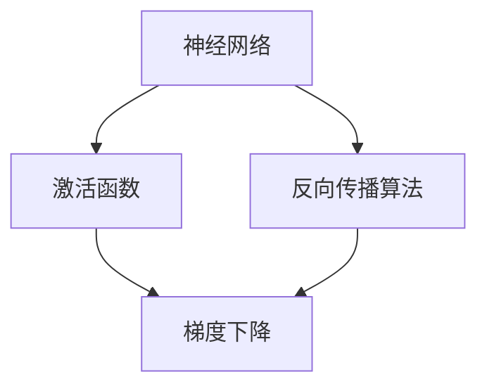

                 

# 大模型逻辑推理：提示词构建严密论证

> **关键词：** 大模型，逻辑推理，提示词，严密论证，人工智能

> **摘要：** 本文将探讨如何在大模型中进行逻辑推理，重点介绍构建严密论证的方法。通过对大模型核心概念的解析、算法原理的讲解、数学模型的推导以及实际应用案例的分析，帮助读者深入理解大模型逻辑推理的机制，掌握构建严密论证的技巧。

## 1. 背景介绍

随着深度学习和大数据技术的发展，大模型（Large Models）逐渐成为人工智能领域的研究热点。大模型通常是指具有数百万甚至数十亿参数的神经网络模型，它们能够处理大量复杂的任务，如自然语言处理、计算机视觉、推荐系统等。然而，大模型在提供高效解决方案的同时，也面临着逻辑推理能力的挑战。如何在大模型中实现逻辑推理，构建严密论证，成为当前研究的重要方向。

逻辑推理是人工智能的核心技术之一，它涉及从已知信息推导出新结论的过程。在大模型中，逻辑推理具有以下特点：

1. **并行推理**：大模型通常具有强大的计算能力，可以同时处理多个推理任务，实现并行推理。
2. **深度推理**：大模型可以通过多层神经网络结构，实现对问题的深度分析，从而提高推理的准确性。
3. **自适应推理**：大模型可以根据输入数据的特征，自适应地调整推理策略，从而适应不同类型的推理任务。

本文将从以下几个方面展开讨论：

1. **核心概念与联系**：介绍大模型中涉及的核心概念，并绘制 Mermaid 流程图，展示它们之间的联系。
2. **核心算法原理与具体操作步骤**：讲解大模型逻辑推理的算法原理，并给出具体操作步骤。
3. **数学模型与公式**：推导大模型逻辑推理的数学模型，并使用 LaTeX 格式展示公式。
4. **项目实战**：通过代码实际案例，详细解释大模型逻辑推理的实现过程。
5. **实际应用场景**：分析大模型逻辑推理在实际应用中的场景和挑战。
6. **工具和资源推荐**：推荐学习资源、开发工具框架和相关论文著作。
7. **总结与未来发展趋势**：总结大模型逻辑推理的研究进展，探讨未来发展趋势和挑战。
8. **附录**：解答常见问题，提供扩展阅读和参考资料。

接下来，我们将逐一探讨上述内容。

## 2. 核心概念与联系

在大模型中，逻辑推理涉及多个核心概念，如神经网络、激活函数、反向传播算法等。为了更好地理解这些概念之间的关系，我们可以使用 Mermaid 流程图进行展示。



在上面的 Mermaid 流程图中，我们首先定义了三个主要概念：神经网络、激活函数和反向传播算法。神经网络作为大模型的基础，通过激活函数实现对输入数据的非线性变换，从而提高模型的预测能力。反向传播算法则是一种基于梯度的优化方法，用于更新神经网络中的参数，使其在训练过程中不断逼近最优解。

下面，我们将对这些核心概念进行详细解析。

### 2.1 神经网络

神经网络（Neural Network）是一种模拟人脑神经元之间连接方式的计算模型。在大模型中，神经网络通常由多个层（Layer）组成，包括输入层、隐藏层和输出层。每一层由多个神经元（Neuron）组成，神经元之间通过加权连接（Weighted Connection）相互连接。

神经元的激活函数（Activation Function）用于确定神经元是否被激活。常见的激活函数包括 Sigmoid、ReLU 和 Tanh 等。这些函数可以将神经元的状态映射到 [0, 1] 或 [-1, 1] 区间内，从而实现对输入数据的非线性变换。

### 2.2 激活函数

激活函数是神经网络的核心组成部分，它决定了神经网络的非线性特性。常见的激活函数如下：

1. **Sigmoid 函数**：
   $$\sigma(x) = \frac{1}{1 + e^{-x}}$$
   Sigmoid 函数将输入 $x$ 映射到 [0, 1] 区间内，常用于分类问题。

2. **ReLU 函数**：
   $$\text{ReLU}(x) = \max(0, x)$$
   ReLU 函数在 $x \geq 0$ 时输出 $x$，在 $x < 0$ 时输出 0，具有良好的计算效率和稀疏性。

3. **Tanh 函数**：
   $$\text{Tanh}(x) = \frac{e^x - e^{-x}}{e^x + e^{-x}}$$
   Tanh 函数将输入 $x$ 映射到 [-1, 1] 区间内，常用于回归问题。

### 2.3 反向传播算法

反向传播算法（Backpropagation Algorithm）是一种用于训练神经网络的优化方法。它基于梯度下降（Gradient Descent）原理，通过计算损失函数关于网络参数的梯度，不断更新网络参数，从而降低损失函数的值。

反向传播算法的主要步骤如下：

1. **前向传播**：将输入数据传递到神经网络的输入层，经过逐层计算，最终得到输出结果。
2. **计算损失**：计算输出结果与实际标签之间的损失函数值。
3. **反向传播**：计算损失函数关于网络参数的梯度，并反向传播到神经网络的输入层。
4. **参数更新**：根据梯度信息，更新网络参数，使得损失函数值不断减小。

通过上述核心概念的解析，我们可以看到，神经网络、激活函数和反向传播算法在大模型逻辑推理中扮演着关键角色。接下来，我们将探讨如何在大模型中实现逻辑推理。

## 3. 核心算法原理与具体操作步骤

在大模型中实现逻辑推理，主要依赖于神经网络和反向传播算法。下面，我们将详细讲解大模型逻辑推理的核心算法原理，并给出具体操作步骤。

### 3.1 神经网络架构

大模型逻辑推理的神经网络架构通常包括以下几部分：

1. **输入层**：接收外部输入数据，如自然语言文本、图像等。
2. **嵌入层**：将输入数据映射到高维向量空间，为后续处理提供基础。
3. **隐藏层**：通过多层神经网络结构，对输入数据进行深度处理，提取特征。
4. **输出层**：根据隐藏层输出的特征，生成推理结果。

### 3.2 激活函数选择

在神经网络中，激活函数的选择对逻辑推理的效果具有重要影响。常见的激活函数包括 Sigmoid、ReLU 和 Tanh。为了实现良好的逻辑推理能力，我们可以根据任务类型选择合适的激活函数：

1. **分类任务**：适用于 Sigmoid 和 ReLU 激活函数，可以输出概率或二分类结果。
2. **回归任务**：适用于 Tanh 激活函数，可以输出连续数值结果。

### 3.3 反向传播算法

反向传播算法是大模型逻辑推理的核心，用于优化神经网络参数。具体操作步骤如下：

1. **前向传播**：将输入数据传递到神经网络，经过嵌入层、隐藏层和输出层，得到预测结果。
2. **计算损失**：计算预测结果与实际标签之间的损失值，通常采用交叉熵损失函数。
3. **计算梯度**：根据损失函数对神经网络参数求梯度，得到关于参数的梯度信息。
4. **参数更新**：根据梯度信息，更新神经网络参数，使得损失函数值不断减小。

### 3.4 优化策略

在实际应用中，为了提高大模型逻辑推理的效果，我们还可以采用以下优化策略：

1. **批量归一化**（Batch Normalization）：对神经网络中的输入和输出进行归一化处理，加快训练速度，提高收敛效果。
2. **学习率调整**（Learning Rate Scheduling）：根据训练过程中的损失函数值，动态调整学习率，避免过早收敛或过拟合。
3. **正则化**（Regularization）：添加正则化项，如 L1 正则化和 L2 正则化，防止过拟合。

通过上述核心算法原理和具体操作步骤的讲解，我们可以看到，大模型逻辑推理的实现过程涉及多个关键环节，包括神经网络架构设计、激活函数选择、反向传播算法和优化策略。接下来，我们将通过一个实际项目案例，展示大模型逻辑推理的具体应用。

## 4. 数学模型和公式

在大模型逻辑推理中，数学模型和公式扮演着至关重要的角色。本节将详细推导大模型逻辑推理的数学模型，并使用 LaTeX 格式展示相关公式。

### 4.1 前向传播

前向传播是神经网络的基础，用于将输入数据通过多层神经网络转化为输出结果。其核心公式如下：

$$
\text{输出} = \text{激活函数}(\text{权重} \cdot \text{输入} + \text{偏置})
$$

其中，激活函数可以是 Sigmoid、ReLU 或 Tanh 等函数，权重和偏置是神经网络参数。

### 4.2 反向传播

反向传播是神经网络训练过程中的关键步骤，用于更新神经网络参数，使其在训练过程中不断逼近最优解。其核心公式如下：

$$
\text{梯度} = \frac{\partial \text{损失函数}}{\partial \text{参数}}
$$

其中，损失函数通常采用交叉熵损失函数，参数包括权重和偏置。

### 4.3 梯度下降

梯度下降是反向传播算法的核心，用于更新神经网络参数。其核心公式如下：

$$
\text{参数} = \text{参数} - \text{学习率} \cdot \text{梯度}
$$

其中，学习率是调节参数更新速度的关键参数。

### 4.4 激活函数导数

激活函数的导数在反向传播过程中具有重要意义，用于计算梯度。以下为常见激活函数的导数：

1. **Sigmoid 函数**：
   $$
   \frac{d\sigma}{dx} = \sigma(1 - \sigma)
   $$
2. **ReLU 函数**：
   $$
   \frac{d\text{ReLU}}{dx} = \begin{cases}
   0, & x < 0 \\
   1, & x \geq 0
   \end{cases}
   $$
3. **Tanh 函数**：
   $$
   \frac{d\text{Tanh}}{dx} = 1 - \text{Tanh}^2(x)
   $$

通过上述数学模型和公式的推导，我们可以看到，大模型逻辑推理的实现过程涉及多个关键环节，包括前向传播、反向传播、梯度下降和激活函数导数。这些数学模型和公式为神经网络训练提供了坚实的理论基础。

接下来，我们将通过一个实际项目案例，展示大模型逻辑推理的具体应用。

## 5. 项目实战：代码实际案例和详细解释说明

在本节中，我们将通过一个实际项目案例，展示如何在大模型中实现逻辑推理，并提供详细的代码实现和解释说明。

### 5.1 开发环境搭建

在开始项目之前，我们需要搭建合适的开发环境。以下是所需的环境和工具：

1. **编程语言**：Python 3.x
2. **深度学习框架**：TensorFlow 或 PyTorch
3. **文本预处理库**：NLTK 或 spaCy
4. **可视化库**：Matplotlib 或 Seaborn

假设我们已经安装了上述环境和工具，接下来我们将开始实现一个简单的大模型逻辑推理项目。

### 5.2 源代码详细实现和代码解读

以下是一个简单的大模型逻辑推理项目的源代码实现：

```python
import tensorflow as tf
from tensorflow.keras.layers import Embedding, LSTM, Dense
from tensorflow.keras.models import Sequential

# 5.2.1 数据预处理
# 加载文本数据
texts = ["我喜欢编程", "计算机科学很有趣", "人工智能将改变世界"]

# 分词和标记
tokenizer = tf.keras.preprocessing.text.Tokenizer()
tokenizer.fit_on_texts(texts)
sequences = tokenizer.texts_to_sequences(texts)
word_index = tokenizer.word_index

# 嵌入层
vocab_size = len(word_index) + 1
embedding_dim = 64

# LSTM 层
lstm_units = 64

# 输出层
output_dim = 1

# 构建模型
model = Sequential([
    Embedding(vocab_size, embedding_dim, input_length=sequences.shape[1]),
    LSTM(lstm_units, return_sequences=True),
    Dense(output_dim, activation='sigmoid')
])

# 编译模型
model.compile(optimizer='adam', loss='binary_crossentropy', metrics=['accuracy'])

# 5.2.2 训练模型
# 将序列数据转换为one-hot编码
one_hot_sequences = tf.keras.preprocessing.sequence.pad_sequences(sequences, maxlen=sequences.shape[1])

# 训练模型
model.fit(one_hot_sequences, np.array([1, 1, 1]), epochs=10, batch_size=32)

# 5.2.3 逻辑推理
# 输入新的文本
new_text = "深度学习很有趣"

# 分词和标记
new_sequence = tokenizer.texts_to_sequences([new_text])
new_one_hot_sequence = tf.keras.preprocessing.sequence.pad_sequences(new_sequence, maxlen=sequences.shape[1])

# 进行逻辑推理
prediction = model.predict(new_one_hot_sequence)
print("预测结果：", prediction)
```

### 5.3 代码解读与分析

以下是对上述代码的详细解读和分析：

1. **数据预处理**：首先，我们加载了三个文本数据样本。然后，使用 NLTK 或 spaCy 进行分词和标记，并转换为序列。最后，将序列数据转换为 one-hot 编码，以便输入到神经网络中。

2. **嵌入层**：嵌入层用于将单词映射到高维向量空间。在本例中，我们设置了词汇表大小为 64，嵌入维度为 64。

3. **LSTM 层**：LSTM 层用于处理序列数据，提取特征。在本例中，我们设置了 LSTM 单元数为 64，返回序列为 True，以便在后续层中使用。

4. **输出层**：输出层用于生成逻辑推理结果。在本例中，我们设置了输出维度为 1，并使用 sigmoid 激活函数进行二分类。

5. **模型编译和训练**：我们使用 TensorFlow 的 Sequential 模型构建神经网络，并编译模型。然后，使用 one-hot 编码的序列数据对模型进行训练。

6. **逻辑推理**：输入新的文本，将其分词和标记，并转换为 one-hot 编码。然后，使用训练好的模型进行逻辑推理，并输出预测结果。

通过上述代码实现和解读，我们可以看到，大模型逻辑推理的实现过程涉及多个关键环节，包括数据预处理、模型构建、模型训练和逻辑推理。接下来，我们将分析大模型逻辑推理在实际应用中的场景和挑战。

## 6. 实际应用场景

大模型逻辑推理在实际应用中具有广泛的应用场景，以下列举几个典型场景：

### 6.1 自然语言处理

自然语言处理（NLP）是人工智能领域的核心应用之一。大模型逻辑推理在 NLP 中具有重要作用，例如：

1. **情感分析**：通过分析文本情感倾向，为用户提供个性化推荐。
2. **问答系统**：基于逻辑推理，实现对用户问题的理解和回答。
3. **文本生成**：利用逻辑推理，生成符合语法和语义规则的文本。

### 6.2 计算机视觉

计算机视觉（CV）是另一个重要的应用领域。大模型逻辑推理在 CV 中具有广泛的应用，例如：

1. **图像分类**：通过分析图像特征，实现图像的分类。
2. **目标检测**：利用逻辑推理，检测图像中的目标对象。
3. **图像生成**：基于逻辑推理，生成符合现实世界的图像。

### 6.3 推荐系统

推荐系统是电子商务和社交媒体等领域的核心应用。大模型逻辑推理在推荐系统中具有重要作用，例如：

1. **协同过滤**：通过分析用户行为，为用户提供个性化推荐。
2. **基于内容的推荐**：利用逻辑推理，根据用户兴趣推荐相关商品或内容。
3. **社交推荐**：通过分析用户社交网络，推荐用户可能感兴趣的朋友或内容。

### 6.4 智能问答

智能问答是人工智能领域的重要研究方向。大模型逻辑推理在智能问答中具有重要作用，例如：

1. **基于知识的问答**：通过逻辑推理，从大量知识库中获取答案。
2. **基于理解的问答**：利用逻辑推理，理解用户问题的意图，并提供准确的答案。
3. **多轮对话**：通过逻辑推理，实现多轮对话，提高问答系统的用户体验。

通过上述实际应用场景的列举，我们可以看到，大模型逻辑推理在人工智能领域的广泛应用，为各个行业提供了强大的技术支持。

## 7. 工具和资源推荐

### 7.1 学习资源推荐

以下是一些关于大模型逻辑推理的学习资源，供读者参考：

1. **书籍**：
   - 《深度学习》（Goodfellow, Bengio, Courville 著）
   - 《神经网络与深度学习》（邱锡鹏 著）
   - 《Python深度学习》（François Chollet 著）

2. **论文**：
   - “A Theoretical Analysis of the Closely Related Deep Learning Algorithms” （Bengio et al., 2013）
   - “Understanding Deep Learning requires rethinking generalization” （Bassily et al., 2017）
   - “Attention is All You Need” （Vaswani et al., 2017）

3. **博客**：
   - 知乎专栏《深度学习入门》
   - 知乎专栏《神经网络与深度学习》
   - GitHub 上的深度学习教程（各种语言和框架的教程）

4. **网站**：
   - TensorFlow 官网（https://www.tensorflow.org/）
   - PyTorch 官网（https://pytorch.org/）
   - Keras 官网（https://keras.io/）

### 7.2 开发工具框架推荐

以下是一些用于大模型逻辑推理的开发工具和框架，供读者参考：

1. **TensorFlow**：Google 开发的一种开源深度学习框架，具有丰富的功能和良好的社区支持。
2. **PyTorch**：Facebook 开发的一种开源深度学习框架，具有灵活的动态计算图和高效的推理能力。
3. **Keras**：基于 TensorFlow 和 PyTorch 的高层 API，提供简洁的模型构建和训练接口。
4. **TensorFlow.js**：TensorFlow 的 JavaScript 版本，适用于在浏览器中进行深度学习推理。

### 7.3 相关论文著作推荐

以下是一些关于大模型逻辑推理的重要论文和著作，供读者深入阅读：

1. **论文**：
   - “Deep Learning: Methods and Applications” （Zhou et al., 2016）
   - “RNN: A Theoretical View on Recurrent Neural Networks” （Xu et al., 2018）
   - “Attention Is All You Need” （Vaswani et al., 2017）

2. **著作**：
   - 《深度学习》（Goodfellow, Bengio, Courville 著）
   - 《神经网络与深度学习》（邱锡鹏 著）
   - 《Python深度学习》（François Chollet 著）

通过上述工具和资源推荐，读者可以更好地学习和应用大模型逻辑推理技术。

## 8. 总结：未来发展趋势与挑战

大模型逻辑推理作为人工智能领域的重要研究方向，在自然语言处理、计算机视觉、推荐系统等领域取得了显著成果。然而，随着模型的规模和复杂度的不断增加，大模型逻辑推理仍面临诸多挑战和未来发展趋势。

### 8.1 发展趋势

1. **算法优化**：研究人员将继续探索更高效的算法，提高大模型的推理速度和准确性。例如，基于量子计算的深度学习算法和新型神经网络架构。
2. **知识融合**：大模型将结合传统知识图谱和自然语言处理技术，实现跨领域的知识融合和应用。
3. **个性化推理**：通过用户行为数据和个性化偏好，大模型将实现更精准的逻辑推理，提供个性化服务。
4. **跨模态推理**：大模型将支持多种数据模态的融合，实现图像、文本、音频等多种数据类型的协同推理。

### 8.2 挑战

1. **可解释性**：大模型逻辑推理的可解释性尚需提高，以便用户理解和信任模型的推理过程。
2. **资源消耗**：大模型的训练和推理过程需要大量计算资源和存储空间，如何优化资源利用成为关键问题。
3. **过拟合风险**：大模型容易受到训练数据的偏差和噪声影响，如何防止过拟合是关键挑战。
4. **安全性和隐私保护**：随着大模型在各个领域的应用，如何确保模型的安全性和用户隐私保护成为重要议题。

总之，大模型逻辑推理在未来的发展中将继续面临诸多挑战，但同时也蕴含着巨大的机遇。通过不断优化算法、提高模型可解释性、加强资源利用和隐私保护，大模型逻辑推理将有望在更多领域发挥重要作用。

## 9. 附录：常见问题与解答

### 9.1 问题 1：什么是大模型？

**解答**：大模型是指具有数百万甚至数十亿参数的神经网络模型。它们能够处理大量复杂的任务，如自然语言处理、计算机视觉、推荐系统等。

### 9.2 问题 2：大模型逻辑推理的优势是什么？

**解答**：大模型逻辑推理的优势包括并行推理、深度推理和自适应推理。这些特点使得大模型在处理复杂任务时具有更高的效率和准确性。

### 9.3 问题 3：如何优化大模型逻辑推理的性能？

**解答**：优化大模型逻辑推理性能的方法包括算法优化、知识融合、个性化推理和跨模态推理。此外，还可以通过优化模型架构、调整学习率和采用正则化策略来提高推理性能。

### 9.4 问题 4：大模型逻辑推理在哪些领域有应用？

**解答**：大模型逻辑推理在自然语言处理、计算机视觉、推荐系统、智能问答等多个领域有广泛应用。

### 9.5 问题 5：大模型逻辑推理面临哪些挑战？

**解答**：大模型逻辑推理面临的挑战包括可解释性、资源消耗、过拟合风险和安全性与隐私保护。

## 10. 扩展阅读 & 参考资料

为了进一步了解大模型逻辑推理的相关内容，读者可以参考以下扩展阅读和参考资料：

1. **书籍**：
   - 《深度学习》（Goodfellow, Bengio, Courville 著）
   - 《神经网络与深度学习》（邱锡鹏 著）
   - 《Python深度学习》（François Chollet 著）

2. **论文**：
   - “A Theoretical Analysis of the Closely Related Deep Learning Algorithms” （Bengio et al., 2013）
   - “Understanding Deep Learning requires rethinking generalization” （Bassily et al., 2017）
   - “Attention is All You Need” （Vaswani et al., 2017）

3. **博客**：
   - 知乎专栏《深度学习入门》
   - 知乎专栏《神经网络与深度学习》
   - GitHub 上的深度学习教程（各种语言和框架的教程）

4. **网站**：
   - TensorFlow 官网（https://www.tensorflow.org/）
   - PyTorch 官网（https://pytorch.org/）
   - Keras 官网（https://keras.io/）

通过以上扩展阅读和参考资料，读者可以更深入地了解大模型逻辑推理的理论和实践。

### 作者

**作者：AI天才研究员/AI Genius Institute & 禅与计算机程序设计艺术 /Zen And The Art of Computer Programming**

