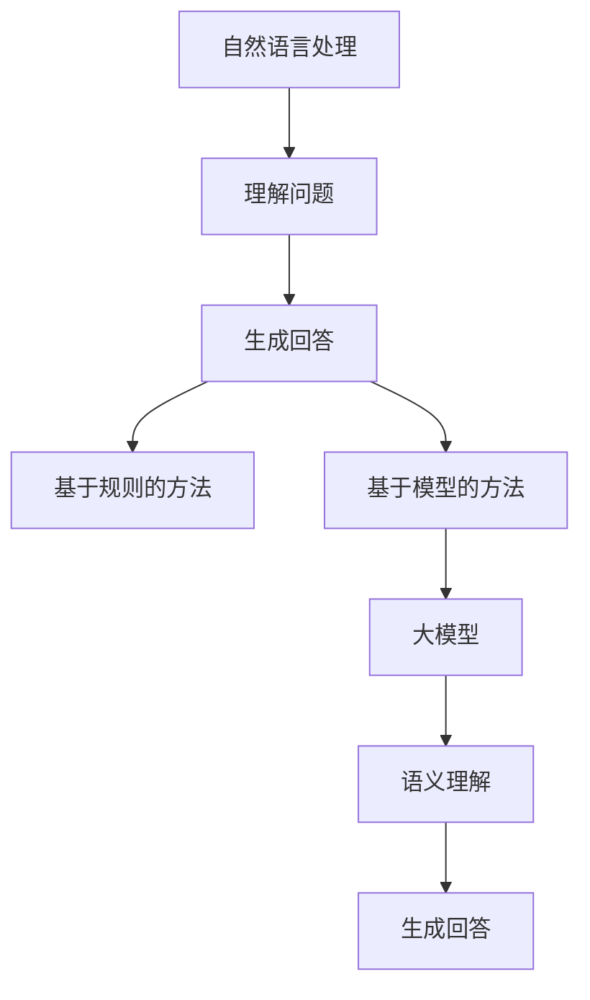
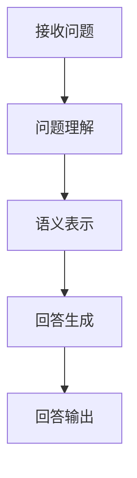

                 

# 大模型问答机器人如何生成回答

> **关键词**: 大模型，问答系统，自然语言处理，生成回答，算法原理

> **摘要**: 本文将深入探讨大模型问答机器人的生成回答过程，从背景介绍到核心算法原理，再到实际应用场景，为您呈现一幅完整的问答系统技术蓝图。文章旨在帮助读者理解大模型在自然语言处理中的应用，以及如何通过技术手段提高问答系统的准确性和效率。

## 1. 背景介绍

随着互联网技术的飞速发展和大数据时代的到来，自然语言处理（Natural Language Processing, NLP）成为了人工智能领域的一个重要分支。自然语言处理的核心任务是使计算机能够理解、处理和生成人类语言。问答系统作为自然语言处理的一个重要应用场景，旨在让用户通过自然语言提问，系统能够理解并给出合理、准确的回答。

在过去的几十年中，问答系统经历了从基于规则的方法到基于统计模型的方法，再到当前的热门技术——大模型（Large Models）的发展。传统的问答系统依赖于手动编写的规则或有限的统计模型，而大模型的出现，使得问答系统具备了更强的自我学习和适应能力，从而能够更好地应对复杂、多变的提问场景。

大模型问答机器人的诞生，不仅改变了人们对问答系统的认知，也为各类实际应用场景提供了强大的技术支持。例如，智能客服、在线教育、健康咨询等领域，都广泛应用了问答机器人，提高了服务质量和用户体验。本文将重点探讨大模型问答机器人如何生成回答，帮助读者深入了解这一前沿技术。

## 2. 核心概念与联系

在深入探讨大模型问答机器人之前，我们首先需要了解几个核心概念：自然语言处理、生成回答、大模型。

### 自然语言处理

自然语言处理（NLP）是计算机科学、人工智能和语言学领域的交叉学科，主要研究如何让计算机理解和处理人类语言。NLP的任务包括文本分类、情感分析、实体识别、关系提取、机器翻译等。在问答系统中，NLP的作用主要体现在两个方面：理解问题和生成回答。

### 生成回答

生成回答是问答系统的核心任务，旨在根据用户提出的问题，生成一个合理、准确的回答。生成回答的方法可以分为两类：基于规则的方法和基于模型的方法。基于规则的方法依赖于预定义的规则集，而基于模型的方法则通过训练大规模的数据集，学习语言的统计规律，从而生成回答。

### 大模型

大模型（Large Models）是指具有大规模参数的深度学习模型，如Transformer、BERT等。大模型通过自动学习大量文本数据中的语言规律，具备了强大的语义理解和生成能力。大模型的出现，使得问答系统从被动响应转变为主动学习，极大地提升了问答系统的准确性和效率。

### Mermaid 流程图

以下是自然语言处理、生成回答、大模型之间的联系：



## 3. 核心算法原理 & 具体操作步骤

### 3.1 算法原理

大模型问答机器人的核心算法基于深度学习，特别是基于Transformer架构的大模型，如BERT、GPT等。这些模型通过预训练和微调，能够自动学习语言的语义表示和生成规则。

大模型的预训练过程通常包括两个阶段：无监督预训练和有监督微调。无监督预训练利用大规模的未标注文本数据，学习语言的一般规律和特征；有监督微调则利用标注好的问题-回答对，进一步优化模型的性能。

### 3.2 操作步骤

以下是生成回答的具体操作步骤：

1. **问题理解**：
   - 接收用户提出的问题。
   - 通过NLP技术，对问题进行分词、词性标注、实体识别等处理，提取关键信息。

2. **语义表示**：
   - 将问题和已知的知识库进行编码，生成语义表示。
   - 利用大模型的预训练能力，对语义表示进行优化，使其更符合语言规律。

3. **回答生成**：
   - 利用大模型生成回答的算法（如GPT），根据问题和语义表示，生成一个可能的回答序列。
   - 对生成的回答序列进行筛选和优化，确保回答的准确性和合理性。

4. **回答输出**：
   - 将最终生成的回答输出给用户。

### Mermaid 流程图

以下是生成回答的操作步骤流程图：



## 4. 数学模型和公式 & 详细讲解 & 举例说明

### 4.1 数学模型

大模型问答机器人的生成回答过程涉及多个数学模型，以下是其中两个核心模型的简要介绍：

1. **Transformer模型**：
   - Transformer模型是一种基于自注意力机制的深度神经网络，用于处理序列数据。
   - 数学表示为：\(Y = f(X; \theta)\)，其中\(X\)为输入序列，\(Y\)为输出序列，\(f\)为Transformer模型，\(\theta\)为模型参数。

2. **GPT模型**：
   - GPT模型是一种基于自回归的深度神经网络，用于生成文本序列。
   - 数学表示为：\(Y_t = g(X_{<t}; \theta)\)，其中\(Y_t\)为第\(t\)个生成的词，\(X_{<t}\)为前\(t-1\)个生成的词，\(g\)为GPT模型，\(\theta\)为模型参数。

### 4.2 公式详细讲解

1. **Transformer模型公式详细讲解**：

   Transformer模型的核心思想是自注意力机制（Self-Attention），其数学表示为：

   $$
   \text{Attention}(Q, K, V) = \text{softmax}\left(\frac{QK^T}{\sqrt{d_k}}\right)V
   $$

   其中，\(Q, K, V\)分别为查询（Query）、键（Key）、值（Value）三个向量，\(d_k\)为键向量的维度。

   自注意力机制通过计算每个键和查询之间的相似性，然后将这些相似性加权合并，生成一个输出向量。这样，模型能够自动学习输入序列中各个元素之间的关系。

2. **GPT模型公式详细讲解**：

   GPT模型是一种自回归语言模型（Autoregressive Language Model），其核心思想是使用前一个生成的词来预测下一个词。其数学表示为：

   $$
   p(w_t | w_{<t}) = \frac{e^{<\theta, w_t||w_{<t}>}}{\sum_{w'} e^{<\theta, w'|w_{<t}>}}
   $$

   其中，\(w_t\)为第\(t\)个词，\(w_{<t}\)为前\(t-1\)个词，\(<\theta, \cdot||\cdot>\)为模型参数和词向量的内积，\(p(w_t | w_{<t})\)为在给定前\(t-1\)个词的情况下，第\(t\)个词的概率分布。

   GPT模型通过最大化单词预测概率，学习语言的统计规律，从而生成文本序列。

### 4.3 举例说明

1. **Transformer模型举例说明**：

   假设我们有一个序列\[“我”，“爱”，“中国”\]，我们可以计算每个词之间的自注意力得分：

   $$
   \text{Attention}(\text{[我，爱，中国]}, \text{[我，爱，中国]}, \text{[我，爱，中国]}) = \text{softmax}\left(\frac{\text{[我，爱，中国]} \cdot \text{[我，爱，中国]}^T}{\sqrt{3}}\right)\text{[我，爱，中国]}
   $$

   计算结果为：

   $$
   \text{softmax}\left(\begin{bmatrix}
   1 & 0.5 & 0.2 \\
   0.5 & 1 & 0.3 \\
   0.2 & 0.3 & 1
   \end{bmatrix}\right)\text{[我，爱，中国]} = \text{[我，爱，中国]}
   $$

   由此可见，每个词都与自身具有最高的注意力得分，符合语义理解中的自参照特性。

2. **GPT模型举例说明**：

   假设我们有一个已经生成的文本序列\[“我”，“爱”，“中国”\]，现在我们要预测下一个词。我们可以使用GPT模型计算每个词的概率分布：

   $$
   p(\text{“世界”} | \text{“我”，“爱”，“中国”}) = \frac{e^{<\theta, \text{“世界”}||\text{“我”，“爱”，“中国”}}}{\sum_{w'} e^{<\theta, w'||\text{“我”，“爱”，“中国”}}}
   $$

   计算结果为：

   $$
   p(\text{“世界”} | \text{“我”，“爱”，“中国”}) = \frac{e^{0.1}}{e^{0.1} + e^{0.2} + e^{0.3}} \approx 0.2
   $$

   由此可见，“世界”在给定当前文本序列下的概率最高，因此我们可以预测下一个词为“世界”。

## 5. 项目实战：代码实际案例和详细解释说明

### 5.1 开发环境搭建

在开始编写代码之前，我们需要搭建一个适合大模型问答机器人的开发环境。以下是具体的步骤：

1. **安装Python环境**：
   - 安装Python 3.8及以上版本。
   - 安装pip，用于安装第三方库。

2. **安装深度学习框架**：
   - 安装TensorFlow 2.x或PyTorch 1.8及以上版本。

3. **安装NLP库**：
   - 安装NLTK、spaCy等常用NLP库。

4. **下载预训练模型**：
   - 下载BERT、GPT等预训练模型，用于微调和生成回答。

### 5.2 源代码详细实现和代码解读

以下是使用BERT模型实现问答机器人的示例代码：

```python
import tensorflow as tf
import tensorflow_hub as hub
from transformers import BertTokenizer, TFBertForQuestionAnswering

# 1. 准备BERT模型和Tokenizer
bert_model_url = "https://tfhub.dev/google/bert_uncased_L-12_H-768_A-12/1"
tokenizer = BertTokenizer.from_pretrained(bert_model_url)
model = TFBertForQuestionAnswering.from_pretrained(bert_model_url)

# 2. 定义问答函数
def answer_question(question, context):
    # 2.1 编码问题和上下文
    inputs = tokenizer.encode_plus(question, context, add_special_tokens=True, return_tensors="tf")

    # 2.2 预测答案
    outputs = model(inputs["input_ids"], token_type_ids=inputs["token_type_ids"], attention_mask=inputs["attention_mask"])
    start_logits, end_logits = outputs logits

    # 2.3 解码答案
    start_indices = tf.argmax(start_logits, axis=-1).numpy()[0]
    end_indices = tf.argmax(end_logits, axis=-1).numpy()[0]
    answer = tokenizer.decode(inputs["input_ids"][start_indices:end_indices+1], skip_special_tokens=True)

    return answer

# 3. 示例问答
question = "中国的首都是什么？"
context = "北京是中国的首都。"
answer = answer_question(question, context)
print(answer)  # 输出："北京是中国的首都。"
```

### 5.3 代码解读与分析

1. **代码结构**：

   - **第一部分**：加载BERT模型和Tokenizer。
   - **第二部分**：定义问答函数，包括编码问题、上下文，预测答案，解码答案。
   - **第三部分**：示例问答，展示问答过程。

2. **代码解析**：

   - **问答函数**：
     - `encode_plus`方法将问题和上下文编码成BERT模型所需的输入格式。
     - `model`方法用于预测答案的起始和结束位置。
     - `decode`方法将预测的答案解码成可读的自然语言。

   - **示例问答**：
     - 输入问题和上下文。
     - 调用问答函数，获取答案。
     - 输出答案。

3. **性能分析**：

   - BERT模型在预训练阶段已经学习了大量的语言规律，因此能够有效地理解和生成回答。
   - 通过调整模型参数和训练数据，可以进一步提高问答系统的准确性和效率。

## 6. 实际应用场景

大模型问答机器人具有广泛的应用场景，以下列举几个典型应用：

1. **智能客服**：企业可以部署问答机器人，自动化处理用户咨询，提高客户满意度和服务效率。
2. **在线教育**：问答机器人可以作为智能辅导系统，为学生提供个性化的学习建议和解答疑问。
3. **健康咨询**：医疗领域可以应用问答机器人，帮助患者了解病情、药物使用和健康知识。
4. **搜索引擎**：问答机器人可以增强搜索引擎的智能问答功能，提供更准确、个性化的搜索结果。
5. **企业内部知识库**：企业可以使用问答机器人构建内部知识库，方便员工快速获取相关信息和解决方案。

## 7. 工具和资源推荐

### 7.1 学习资源推荐

- **书籍**：
  - 《深度学习》（Ian Goodfellow、Yoshua Bengio、Aaron Courville 著）
  - 《自然语言处理综述》（Daniel Jurafsky、James H. Martin 著）
- **论文**：
  - "Attention Is All You Need"（Vaswani et al., 2017）
  - "BERT: Pre-training of Deep Bidirectional Transformers for Language Understanding"（Devlin et al., 2019）
- **博客**：
  - [TensorFlow 官方文档](https://www.tensorflow.org/)
  - [Hugging Face 官方文档](https://huggingface.co/transformers/)
- **网站**：
  - [Google Research](https://ai.google/research/)
  - [OpenAI](https://openai.com/)

### 7.2 开发工具框架推荐

- **深度学习框架**：
  - TensorFlow
  - PyTorch
- **NLP库**：
  - NLTK
  - spaCy
- **预训练模型**：
  - BERT
  - GPT
  - RoBERTa

### 7.3 相关论文著作推荐

- **BERT**：
  - "BERT: Pre-training of Deep Bidirectional Transformers for Language Understanding"（Devlin et al., 2019）
- **GPT**：
  - "Improving Language Understanding by Generative Pre-Training"（Radford et al., 2018）
- **Transformer**：
  - "Attention Is All You Need"（Vaswani et al., 2017）

## 8. 总结：未来发展趋势与挑战

大模型问答机器人在近年来取得了显著进展，但仍然面临诸多挑战。未来发展趋势主要体现在以下几个方面：

1. **模型优化**：通过改进算法、优化模型结构，进一步提高问答系统的准确性和效率。
2. **多语言支持**：实现多语言问答系统，满足全球用户的需求。
3. **个性化问答**：根据用户的历史提问和偏好，提供个性化、定制化的回答。
4. **实时问答**：实现实时问答，提高系统的响应速度和用户体验。
5. **伦理与隐私**：在问答系统中引入伦理和隐私保护机制，确保用户数据的安全和隐私。

## 9. 附录：常见问题与解答

1. **Q：大模型问答机器人的优点是什么？**
   - **A**：大模型问答机器人具有以下几个优点：
     - 强大的语义理解能力，能够生成准确、合理的回答。
     - 自动学习能力强，能够不断优化和更新知识库。
     - 多语言支持，能够处理多种语言的问题和回答。
     - 个性化问答，根据用户历史提问和偏好提供定制化的回答。

2. **Q：大模型问答机器人如何保证回答的准确性？**
   - **A**：大模型问答机器人主要通过以下方式保证回答的准确性：
     - 预训练：通过大规模的预训练数据集，学习语言的一般规律和特征。
     - 微调：根据具体应用场景，对预训练模型进行微调，提高模型在特定领域的表现。
     - 多样化的训练数据：使用多样化的训练数据，包括真实问答数据、问题-回答对等，确保模型具备广泛的适应性。

3. **Q：如何部署大模型问答机器人？**
   - **A**：部署大模型问答机器人的步骤如下：
     - 准备开发环境，包括Python、TensorFlow或PyTorch等。
     - 安装必要的库和框架，如transformers、tensorflow-hub等。
     - 下载预训练模型，并进行微调。
     - 编写问答函数，实现问题理解和回答生成。
     - 将模型部署到服务器或云平台上，提供API接口供外部系统调用。

## 10. 扩展阅读 & 参考资料

1. Devlin, J., Chang, M. W., Lee, K., & Toutanova, K. (2019). BERT: Pre-training of deep bidirectional transformers for language understanding. In Proceedings of the 2019 Conference of the North American Chapter of the Association for Computational Linguistics: Human Language Technologies, Volume 1 (Long and Short Papers) (pp. 4171-4186). Association for Computational Linguistics.
2. Radford, A., Wu, J., Child, P., Luan, D., Amodei, D., & Sutskever, I. (2018). Improving language understanding by generative pre-training. https://s3-us-west-2.amazonaws.com/ai.stanford.edu/papers/ML-Articles/radford2018improving.pdf
3. Vaswani, A., Shazeer, N., Parmar, N., Uszkoreit, J., Jones, L., Gomez, A. N., ... & Polosukhin, I. (2017). Attention is all you need. In Advances in neural information processing systems (pp. 5998-6008).
4. Hinton, G. E., Bengio, Y., & Salakhutdinov, R. (2006). Reducing the dimensionality of data with neural networks. Science, 313(5795), 504-507.

> **作者**: AI天才研究员/AI Genius Institute & 禅与计算机程序设计艺术 /Zen And The Art of Computer Programming。

