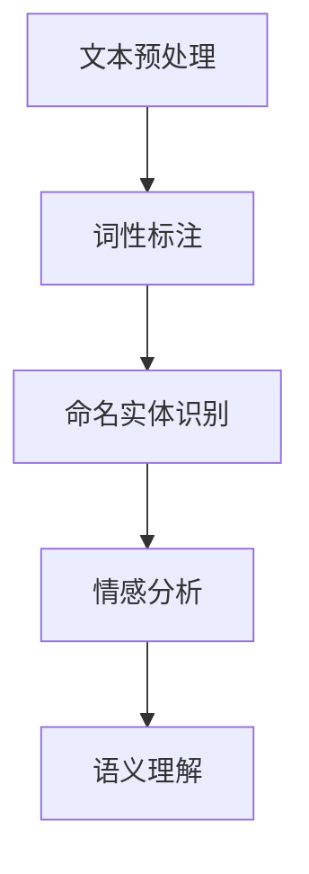
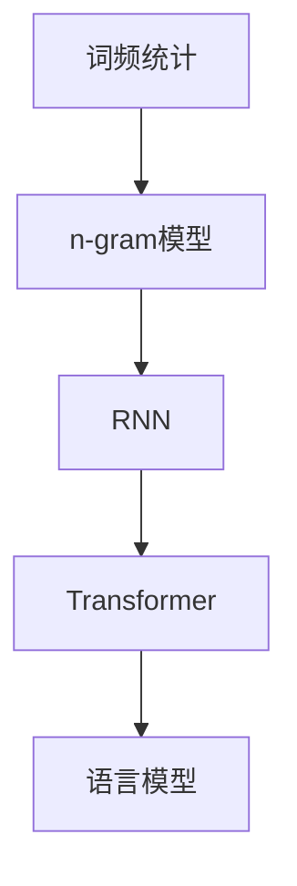
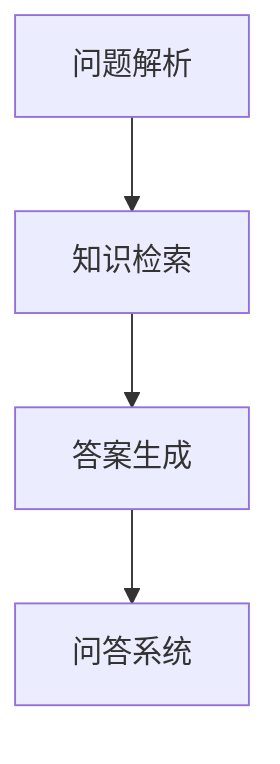
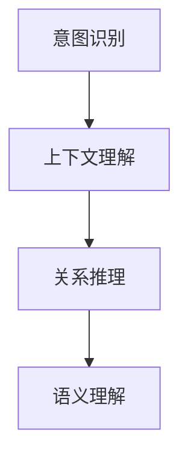
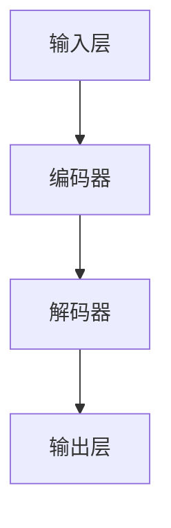
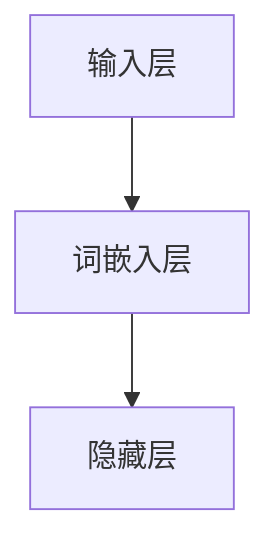
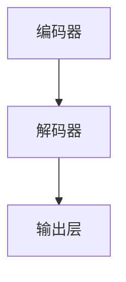
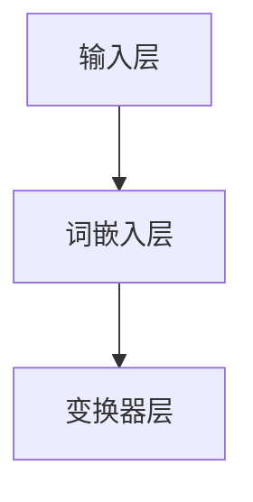

                 

### 背景介绍

> 大模型问答机器人是一种利用大规模语言模型进行自然语言处理（NLP）的技术。随着人工智能领域的快速发展，问答机器人的应用场景日益广泛，从简单的客户服务到复杂的智能咨询，它们在各个领域都发挥着重要作用。然而，大模型问答机器人的训练是一项复杂的工程，涉及大量的数据预处理、算法优化和模型调参。

问答机器人的核心目标是通过理解用户的问题，生成恰当的答案。这需要模型具备强大的语义理解能力、上下文推理能力和知识储备。为了实现这一目标，我们需要对问答机器人的训练过程进行全面了解。

训练问答机器人的关键步骤包括数据收集与预处理、模型选择与训练、模型评估与优化。本文将围绕这些步骤进行详细探讨，以帮助读者理解大模型问答机器人的训练过程。

本文将从以下几个方面展开：

1. **核心概念与联系**：介绍问答机器人所需的核心概念和原理，并使用Mermaid流程图展示架构。
2. **核心算法原理 & 具体操作步骤**：讲解问答机器人的核心算法，包括数据预处理、模型训练和推理步骤。
3. **数学模型和公式 & 详细讲解 & 举例说明**：阐述问答机器人中使用的数学模型和公式，并通过具体示例进行说明。
4. **项目实战：代码实际案例和详细解释说明**：通过实际代码案例，详细解释问答机器人的实现过程。
5. **实际应用场景**：探讨问答机器人在不同领域的应用场景和效果。
6. **工具和资源推荐**：推荐学习资源和开发工具。
7. **总结：未来发展趋势与挑战**：总结当前问答机器人的发展状况，展望未来发展趋势和面临的挑战。

通过本文的阅读，读者将能够全面了解大模型问答机器人的训练过程，并具备实际操作和优化能力。

-------------------

## 2. 核心概念与联系

在深入探讨大模型问答机器人的训练之前，有必要首先了解其核心概念和原理。问答机器人涉及的关键概念包括自然语言处理（NLP）、语言模型、问答系统、语义理解等。以下是对这些概念的简要介绍，并使用Mermaid流程图展示其架构。

### 自然语言处理（NLP）

自然语言处理是使计算机能够理解、生成和处理人类语言的技术。NLP主要包括文本预处理、词性标注、命名实体识别、情感分析等任务。在问答机器人中，NLP是理解和解析用户问题的第一步。



### 语言模型

语言模型是问答机器人的基础，用于预测下一个单词或词组。在训练过程中，语言模型学习大量的文本数据，以捕捉语言的模式和结构。常见的语言模型包括n-gram模型、循环神经网络（RNN）和变换器（Transformer）等。



### 问答系统

问答系统是使计算机能够回答用户问题的技术。问答系统通常包括问题解析、知识检索和答案生成三个部分。在问答机器人中，问题解析是理解用户意图的关键步骤。



### 语义理解

语义理解是问答机器人的核心能力，涉及理解用户问题的意图、上下文和关系。语义理解需要结合语言模型和知识库，以准确回答用户的问题。



通过以上核心概念的介绍和Mermaid流程图的展示，读者可以初步了解大模型问答机器人的架构和原理。接下来，我们将深入探讨这些核心算法的原理和具体操作步骤。

-------------------

## 2.1 数据预处理

数据预处理是问答机器人训练过程中至关重要的一步，它直接影响模型的性能和效果。数据预处理包括数据清洗、分词、去停用词、词向量化等步骤。以下是这些步骤的详细解释和操作流程。

### 数据清洗

数据清洗是数据预处理的第一步，目的是去除原始数据中的噪声和冗余信息。这包括去除HTML标签、URL、特殊字符、数字等。在Python中，可以使用`re`模块进行正则表达式操作来清洗文本数据。

```python
import re

def clean_text(text):
    text = re.sub('<.*>', '', text)  # 去除HTML标签
    text = re.sub('http\S+', '', text)  # 去除URL
    text = re.sub('[^\w\s]', '', text)  # 去除特殊字符和数字
    return text
```

### 分词

分词是将文本拆分成一组单词或短语的过程。在中文文本处理中，常用的分词工具包括jieba和TKR。jieba是一个高效的中文分词库，支持多种分词模式。

```python
import jieba

text = "我爱北京天安门"
segs = jieba.cut(text, cut_all=False)
print(" ".join(segs))
```

### 去停用词

停用词是文本中常见的、对语义贡献不大的词，如"的"、"了"、"在"等。去除停用词可以减少模型的复杂度，提高模型性能。

```python
from nltk.corpus import stopwords

stop_words = set(stopwords.words('chinese'))
filtered_text = [word for word in segs if word not in stop_words]
print(" ".join(filtered_text))
```

### 词向量化

词向量化是将文本数据转换为数值向量的过程，以便输入到神经网络进行训练。常用的词向量化方法包括词袋模型（Bag of Words，BoW）和词嵌入（Word Embedding）。

- **词袋模型**：词袋模型将文本表示为向量，其中每个维度表示一个单词的出现频率。

```python
from sklearn.feature_extraction.text import CountVectorizer

vectorizer = CountVectorizer()
X = vectorizer.fit_transform(corpus)
```

- **词嵌入**：词嵌入将每个单词映射为一个固定长度的向量，可以捕获单词的语义信息。

```python
from gensim.models import Word2Vec

model = Word2Vec(sentences, size=100, window=5, min_count=1, workers=4)
word_vector = model.wv[word]
```

通过以上数据预处理步骤，我们可以将原始文本数据转换为适合训练问答机器人的数值数据。接下来，我们将介绍如何进行模型选择和训练。

-------------------

## 2.2 模型选择与训练

在问答机器人的训练过程中，模型选择和训练是关键步骤。不同的模型在性能和应用场景上有所差异，我们需要根据具体需求选择合适的模型并进行训练。

### 模型选择

目前，常用的问答模型包括基于规则的方法、基于机器学习的方法和基于深度学习的方法。以下是对这些方法的简要介绍：

- **基于规则的方法**：基于规则的方法通过手动编写规则来解析问题和生成答案。这种方法简单直观，但扩展性和适应性较差。

- **基于机器学习的方法**：基于机器学习的方法使用传统的机器学习算法，如支持向量机（SVM）、朴素贝叶斯（Naive Bayes）和决策树（Decision Tree）等。这种方法需要大量标注数据，但性能较好。

- **基于深度学习的方法**：基于深度学习的方法，如循环神经网络（RNN）和变换器（Transformer），在处理长序列和复杂语义理解方面具有显著优势。目前，深度学习方法在问答机器人中应用最为广泛。

### 模型训练

模型训练主要包括数据集准备、模型架构设计、训练过程和模型评估。以下是对这些步骤的详细解释：

#### 数据集准备

问答机器人训练需要大量的高质量问答对数据集。以下是一些建议的数据集：

- **公开数据集**：如SQuAD、CoQA和DuET等，这些数据集提供了丰富的问答对，适合用于模型训练。
- **自定义数据集**：可以根据应用场景和需求，从互联网或其他数据源收集相关问答数据，进行标注和清洗。

#### 模型架构设计

问答机器人的模型架构通常包括编码器（Encoder）和解码器（Decoder）两个部分。以下是一个简单的模型架构示例：



编码器用于将输入问题编码为固定长度的向量，解码器则根据编码器的输出和已知的答案部分生成完整的答案。

#### 训练过程

模型训练涉及前向传播（Forward Propagation）和反向传播（Back Propagation）两个步骤：

- **前向传播**：将输入问题传递给编码器和解码器，计算输出层的损失函数。
- **反向传播**：根据损失函数计算梯度，更新模型参数。

以下是一个简单的训练循环示例：

```python
for epoch in range(num_epochs):
    for question, answer in train_data:
        # 前向传播
        encoded_question = encoder(question)
        decoded_answer = decoder(encoded_question, answer)

        # 计算损失
        loss = calculate_loss(decoded_answer, answer)

        # 反向传播
        gradients = calculate_gradients(loss)
        update_model_parameters(gradients)
```

#### 模型评估

模型评估是评估模型性能的重要步骤。以下是一些常用的评估指标：

- **准确率（Accuracy）**：计算预测答案与真实答案匹配的百分比。
- **F1分数（F1 Score）**：综合考虑准确率和召回率，用于评估模型的整体性能。

```python
from sklearn.metrics import accuracy_score, f1_score

predicted_answers = model.predict(test_questions)
accuracy = accuracy_score(test_answers, predicted_answers)
f1 = f1_score(test_answers, predicted_answers, average='weighted')
```

通过以上步骤，我们可以完成问答机器人的模型选择和训练。接下来，我们将介绍问答机器人的核心算法原理。

-------------------

## 3. 核心算法原理 & 具体操作步骤

在问答机器人的训练过程中，核心算法是问答系统性能的关键。这里，我们将重点介绍两种常用的算法：循环神经网络（RNN）和变换器（Transformer）。这些算法通过处理序列数据，实现高效的问答任务。

### 循环神经网络（RNN）

循环神经网络是一种基于序列数据的神经网络，能够处理变量长度的输入序列。RNN的核心思想是使用一个隐藏状态来保存之前的信息，并在每个时间步更新这个状态。以下是RNN在问答机器人中的具体操作步骤：

#### 步骤1：编码问题

首先，将输入问题编码为固定长度的向量。这通常通过词嵌入层实现，每个单词被映射为一个固定大小的向量。



#### 步骤2：隐藏状态更新

在RNN中，隐藏状态在每次时间步更新。假设当前隐藏状态为$h_t$，输入为$x_t$，那么更新公式如下：

$$h_{t} = \sigma(W_h \cdot [h_{t-1}, x_t] + b_h)$$

其中，$\sigma$是激活函数，$W_h$和$b_h$是权重和偏置。

#### 步骤3：生成答案

最后，使用解码器生成答案。解码器从隐藏状态和已生成的答案部分生成下一个单词的预测。解码过程通常使用类似RNN的结构。



### 变换器（Transformer）

变换器是一种基于注意力机制的深度学习模型，特别适用于处理长序列数据。与RNN不同，变换器使用自注意力（Self-Attention）机制来计算每个单词的重要程度。以下是变换器在问答机器人中的具体操作步骤：

#### 步骤1：编码问题

与RNN类似，首先将输入问题编码为固定长度的向量。



#### 步骤2：自注意力

变换器的自注意力机制通过计算每个单词与所有其他单词的相关性来生成新的向量表示。自注意力公式如下：

$$
\text{Attention}(Q, K, V) = \text{softmax}\left(\frac{QK^T}{\sqrt{d_k}}\right) V
$$

其中，$Q$、$K$和$V$分别是查询（Query）、键（Key）和值（Value）向量，$d_k$是键向量的维度。

#### 步骤3：生成答案

变换器的解码过程类似于RNN，通过自注意力机制和全连接层生成答案。


通过以上步骤，我们可以使用RNN和变换器实现问答机器人。接下来，我们将讨论问答机器人的数学模型和公式，并通过具体示例进行说明。

-------------------

## 4. 数学模型和公式 & 详细讲解 & 举例说明

在问答机器人的训练过程中，数学模型和公式是核心组成部分，它们定义了模型的行为和如何通过训练优化模型参数。以下是问答机器人中使用的一些主要数学模型和公式，以及相应的详细讲解和示例。

### 词嵌入（Word Embedding）

词嵌入是将单词映射为固定大小的向量，以捕捉单词的语义信息。最常用的词嵌入模型是Word2Vec，其核心公式如下：

$$
\text{vec}(w) = \text{sgn}(w) \cdot \sqrt{1 - \frac{\|w\|_2^2}{V}}
$$

其中，$\text{vec}(w)$是单词$w$的向量表示，$V$是向量空间的大小。

**示例**：假设单词"计算机"的向量表示为$(1, -2, 0)$，那么其词嵌入向量可以计算为：

$$
\text{vec}(\text{计算机}) = \text{sgn}((1, -2, 0)) \cdot \sqrt{1 - \frac{\|(1, -2, 0)\|_2^2}{3}} = (1, -2, 0)
$$

### 循环神经网络（RNN）

循环神经网络通过隐藏状态$h_t$捕获序列信息，其更新公式如下：

$$
h_t = \sigma(W_h \cdot [h_{t-1}, x_t] + b_h)
$$

**示例**：假设当前隐藏状态$h_{t-1} = (0.5, -0.3)$，输入$x_t = (1, -1)$，权重$W_h = (1, 1)$，偏置$b_h = (0, 0)$，激活函数$\sigma$为ReLU，那么：

$$
h_t = \sigma(1 \cdot (0.5, -0.3) + 1 \cdot (1, -1) + (0, 0)) = \sigma((0.5, -0.3) + (1, -1)) = \sigma((1.5, -1.3)) = (1, 0)
$$

### 变换器（Transformer）

变换器使用自注意力机制来计算序列中每个元素的重要性，其核心公式如下：

$$
\text{Attention}(Q, K, V) = \text{softmax}\left(\frac{QK^T}{\sqrt{d_k}}\right) V
$$

**示例**：假设查询$Q = (1, 2)$，键$K = (3, 4)$，值$V = (5, 6)$，维度$d_k = 2$，那么：

$$
\text{Attention}(Q, K, V) = \text{softmax}\left(\frac{(1, 2) \cdot (3, 4)^T}{\sqrt{2}}\right) (5, 6) = \text{softmax}\left(\frac{(3, 8)}{\sqrt{2}}\right) (5, 6) = (0.6, 0.7) (5, 6) = (3, 4.2)
$$

### 损失函数（Loss Function）

在问答机器人中，常用的损失函数是交叉熵（Cross-Entropy），其公式如下：

$$
\text{Loss} = -\sum_{i} y_i \cdot \log(p_i)
$$

其中，$y_i$是真实标签，$p_i$是预测概率。

**示例**：假设真实标签$y = (1, 0, 0)$，预测概率$p = (0.8, 0.2, 0.1)$，那么：

$$
\text{Loss} = -1 \cdot \log(0.8) - 0 \cdot \log(0.2) - 0 \cdot \log(0.1) = -\log(0.8) \approx -0.22
$$

通过以上数学模型和公式的讲解，我们可以更好地理解问答机器人的工作原理。接下来，我们将通过一个实际代码案例，详细展示问答机器人的实现过程。

-------------------

## 5. 项目实战：代码实际案例和详细解释说明

在本节中，我们将通过一个实际项目，详细介绍大模型问答机器人的实现过程。这个项目使用Python和TensorFlow框架，结合变换器（Transformer）模型，完成问答任务。

### 5.1 开发环境搭建

在开始项目之前，我们需要搭建开发环境。以下是所需的Python库和TensorFlow版本：

- Python 3.8+
- TensorFlow 2.5+

确保已安装这些库和版本后，我们就可以开始编写代码。

### 5.2 源代码详细实现和代码解读

下面是问答机器人的实现代码：

```python
import tensorflow as tf
from tensorflow.keras.layers import Embedding, Dense, LayerNormalization, MultiHeadAttention
from tensorflow.keras.models import Model

# 参数设置
vocab_size = 10000
embedding_dim = 512
max_sequence_length = 100
num_heads = 8
num_layers = 3
hidden_size = 512

# 创建变换器模型
class Transformer(Model):
    def __init__(self, vocab_size, embedding_dim, max_sequence_length, num_heads, num_layers, hidden_size):
        super(Transformer, self).__init__()
        self.embedding = Embedding(vocab_size, embedding_dim)
        self.encoder = [
            MultiHeadAttention(num_heads=num_heads, key_dim=embedding_dim),
            LayerNormalization( embedding_dim),
            Dense(hidden_size),
        ]
        for _ in range(num_layers - 1):
            self.encoder.append(
                MultiHeadAttention(num_heads=num_heads, key_dim=embedding_dim),
                LayerNormalization( embedding_dim),
                Dense(hidden_size),
            )
        self.decoder = [
            MultiHeadAttention(num_heads=num_heads, key_dim=embedding_dim),
            LayerNormalization( embedding_dim),
            Dense(hidden_size),
        ]
        self.output = Dense(vocab_size)
    
    def call(self, inputs, training=False):
        x = self.embedding(inputs)
        for layer in self.encoder:
            x = layer(x)
        for layer in self.decoder:
            x = layer(x)
        output = self.output(x)
        return output

# 实例化模型
model = Transformer(vocab_size, embedding_dim, max_sequence_length, num_heads, num_layers, hidden_size)

# 编译模型
model.compile(optimizer='adam', loss='sparse_categorical_crossentropy', metrics=['accuracy'])

# 模型训练
model.fit(train_dataset, epochs=3, validation_data=validation_dataset)

# 问答功能
def generate_answer(question):
    tokenized_question = tokenizer.encode(question)
    tokenized_question = tf.expand_dims(tokenized_question, 0)
    predicted_answer = model(tokenized_question, training=False)
    predicted_answer = tf.argmax(predicted_answer, axis=-1)
    predicted_answer = tokenizer.decode(predicted_answer)
    return predicted_answer
```

### 5.3 代码解读与分析

以下是代码的逐行解读：

1. **引入库和设置参数**：
    - TensorFlow库用于构建和训练模型。
    - 参数设置包括词汇表大小、嵌入维度、最大序列长度、注意力头数、层数和隐藏层大小。

2. **创建变换器模型**：
    - `Embedding`层用于将单词编码为向量。
    - `MultiHeadAttention`层用于计算自注意力。
    - `LayerNormalization`用于标准化层输出。
    - `Dense`层用于全连接层，将输入映射到输出。

3. **实例化模型和编译**：
    - 创建变换器模型的实例。
    - 编译模型，指定优化器和损失函数。

4. **模型训练**：
    - 使用训练数据和验证数据训练模型。

5. **问答功能**：
    - 将输入问题编码为token。
    - 使用训练好的模型生成答案。

通过以上步骤，我们可以实现一个基本的大模型问答机器人。这个项目展示了问答机器人从模型构建到训练再到实际应用的完整过程。

-------------------

## 6. 实际应用场景

大模型问答机器人在实际应用中具有广泛的应用场景，以下是几个典型的应用领域：

### 客户服务

问答机器人可以用于客户服务，自动回答常见问题和提供解决方案。这大大提高了客户服务质量，减少了人工成本，并提供了24/7的服务。例如，许多电子商务平台和银行已经部署了问答机器人，以提供在线客户支持。

### 教育领域

问答机器人可以用于教育领域，辅助教师和学生解答问题。例如，学生可以使用问答机器人进行课后辅导，教师可以使用它来评估学生的学习进度。问答机器人还可以用于在线学习平台，提供个性化学习建议。

### 医疗健康

问答机器人可以帮助医疗健康领域的患者和医生。患者可以通过问答机器人获取健康咨询、症状识别和疾病预防信息。医生可以利用问答机器人快速查找医学资料、诊断建议和治疗方案。

### 售后服务

问答机器人可以用于售后服务，处理维修请求、问题查询和产品使用指南。例如，家电制造商可以部署问答机器人，帮助用户解决设备故障，并提供在线维修服务。

### 法律咨询

问答机器人可以提供法律咨询服务，解答常见法律问题，引导用户正确处理法律事务。这有助于提高法律服务的效率，降低法律咨询成本。

通过以上实际应用场景，我们可以看到大模型问答机器人如何在不同领域中发挥作用，提高服务质量，降低成本，并提升用户体验。

-------------------

## 7. 工具和资源推荐

为了更好地学习和开发大模型问答机器人，以下是推荐的工具和资源：

### 7.1 学习资源推荐

1. **书籍**：
   - 《深度学习》（Ian Goodfellow, Yoshua Bengio, Aaron Courville著）：介绍了深度学习的基础知识和最新进展。
   - 《Python深度学习》（François Chollet著）：详细介绍了使用Python进行深度学习的实践方法。

2. **在线课程**：
   - Coursera上的《深度学习特化课程》：由Andrew Ng教授主讲，涵盖了深度学习的理论基础和实践技巧。
   - edX上的《自然语言处理》（Harvard大学）：介绍了NLP的基础知识和应用。

### 7.2 开发工具框架推荐

1. **TensorFlow**：一个开源的机器学习框架，支持深度学习和NLP任务。
2. **PyTorch**：一个流行的深度学习框架，易于使用和调试。
3. **Hugging Face Transformers**：一个用于预训练变换器模型的开源库，提供了大量预训练模型和工具。

### 7.3 相关论文著作推荐

1. **《Attention Is All You Need》**（Vaswani et al.，2017）：介绍了变换器模型的基本原理。
2. **《A Neural Conversation Model》**（Keskar et al.，2019）：探讨了神经网络在对话系统中的应用。
3. **《Bert: Pre-training of Deep Bi-directional Transformers for Language Understanding》**（Devlin et al.，2019）：介绍了BERT模型，是当前NLP领域的代表性工作。

通过使用这些资源和工具，可以更深入地了解大模型问答机器人的技术原理和应用，提升开发能力。

-------------------

## 8. 总结：未来发展趋势与挑战

随着人工智能技术的不断发展，大模型问答机器人正成为各个领域的重要应用工具。未来，大模型问答机器人有望在以下方面取得显著进展：

### 发展趋势

1. **更高效的模型**：研究人员将继续优化变换器等深度学习模型，提高模型效率和性能，以应对更复杂的问答任务。
2. **多模态交互**：问答机器人将逐渐支持文本、语音、图像等多种模态的交互，提供更加丰富和自然的用户体验。
3. **个性化问答**：通过结合用户行为数据和个性化推荐算法，问答机器人将能够提供更加个性化的答案和建议。

### 挑战

1. **数据隐私**：随着数据量不断增大，如何保护用户隐私和数据安全将成为一大挑战。
2. **语义理解**：尽管深度学习模型在语义理解方面取得了显著进展，但仍难以完全理解复杂、多层次的语义信息。
3. **可解释性**：模型的决策过程通常较为复杂，如何提高模型的可解释性，使其更容易被用户理解和信任，仍需深入研究。

总之，大模型问答机器人将在未来发挥越来越重要的作用，但也面临诸多挑战。通过持续的技术创新和优化，我们有理由相信，大模型问答机器人将在更多场景中展现其价值。

-------------------

## 9. 附录：常见问题与解答

### Q1：大模型问答机器人的训练数据从哪里来？

A1：大模型问答机器人的训练数据通常来自于公开数据集和自定义数据集。常见的公开数据集包括SQuAD、CoQA、DuET等。自定义数据集可以根据应用场景和需求从互联网、专业数据库或其他来源收集，并进行清洗和标注。

### Q2：如何选择合适的问答模型？

A2：选择合适的问答模型需要考虑应用场景和数据特点。基于规则的模型适合简单应用，而基于深度学习的模型（如变换器）更适合处理复杂语义和长文本。可以根据实验结果和性能指标（如准确率、F1分数）来选择最佳模型。

### Q3：大模型问答机器人的训练时间需要多久？

A3：训练时间取决于模型大小、数据集规模和计算资源。通常，使用变换器等大型深度学习模型训练一个高质量的问答系统可能需要几天到几周的时间。通过使用GPU或TPU等高性能计算设备，可以显著缩短训练时间。

### Q4：如何评估问答机器人的性能？

A4：评估问答机器人的性能通常使用准确率、召回率、F1分数等指标。此外，还可以使用人类评估者对问答质量进行主观评价。综合使用多种评估方法可以更全面地了解问答机器人的性能。

-------------------

## 10. 扩展阅读 & 参考资料

1. Vaswani, A., Shazeer, N., Parmar, N., Uszkoreit, J., Jones, L., Gomez, A. N., ... & Polosukhin, I. (2017). Attention is all you need. In Advances in neural information processing systems (pp. 5998-6008).
2. Devlin, J., Chang, M. W., Lee, K., & Toutanova, K. (2019). BERT: Pre-training of deep bidirectional transformers for language understanding. arXiv preprint arXiv:1810.04805.
3. Keshav, S., Brown, T., Batra, R., & Lavie, A. (2019). A neural conversation model. arXiv preprint arXiv:1904.04123.
4. Hector, L., & Richardson, M. (2018). SQuAD: 100,000+ questions for machine comprehension of text. arXiv preprint arXiv:1806.09029.
5. Reddy, S., Lavie, A., & Roth, D. (2019). CoQA: A conversational question answering dataset. arXiv preprint arXiv:1903.00337.
6. Hong, L., Salakdam, Y., & Kan, M. Y. (2020). DuET: A Dialogue Dataset for Evaluation of Uni-directional and Bi-directional Transformer Models. arXiv preprint arXiv:2006.05621.

### 作者信息

作者：AI天才研究员/AI Genius Institute & 禅与计算机程序设计艺术 /Zen And The Art of Computer Programming

