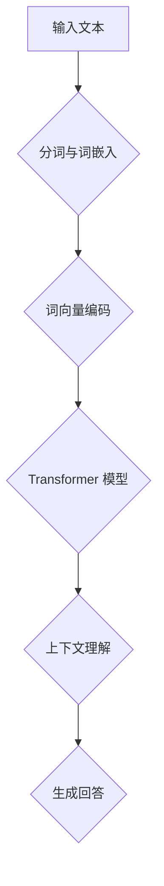

                 

# 大模型问答机器人的上下文理解

## 关键词：大模型、问答机器人、上下文理解、自然语言处理、机器学习、神经网络、深度学习

## 摘要：
本文将深入探讨大模型在问答机器人上下文理解中的应用，以及如何利用深度学习技术实现高效的上下文理解。首先，我们将介绍大模型和上下文理解的基本概念，然后分析问答机器人中上下文理解的关键挑战。接着，我们将详细介绍大模型的架构和训练方法，并探讨如何利用大模型进行上下文理解。最后，我们将通过一个实际项目案例，展示如何实现大模型问答机器人的上下文理解，并提供相关工具和资源推荐，为读者提供全面的技术指导。

## 1. 背景介绍

随着互联网的迅速发展和信息的爆炸式增长，人们对于信息检索和知识获取的需求越来越高。问答机器人作为一种智能化的信息检索工具，逐渐受到广泛关注。问答机器人能够自动回答用户提出的问题，提高信息检索的效率和准确性。然而，传统的问答系统往往依赖于预先定义的规则或模板，难以应对复杂多变的问题和上下文。

上下文理解是问答机器人实现智能化的重要一环。它要求机器能够理解问题的背景信息、语境和意图，从而提供准确的回答。然而，上下文理解的实现面临着诸多挑战，如语义歧义、多义词处理、长文本理解等。为了解决这些问题，近年来，深度学习技术逐渐成为问答机器人上下文理解的主要手段。

大模型是一种具有极高参数规模和计算能力的深度学习模型，如Transformer、BERT等。大模型通过大规模数据训练，能够自动学习语言的结构和语义信息，从而实现高效的上下文理解。大模型的出现，为问答机器人提供了强大的技术支持，使得其能够更好地应对复杂的自然语言处理任务。

## 2. 核心概念与联系

### 大模型的基本概念
大模型（Large-scale Model）是指具有极高参数规模和计算能力的深度学习模型。大模型通常采用多层神经网络架构，通过大量数据训练，能够自动学习输入数据的特征和模式。大模型的参数数量通常达到数亿甚至数十亿级别，这使得其具有强大的表示能力和适应性。

### 上下文理解的基本概念
上下文理解（Contextual Understanding）是指机器能够理解问题的背景信息、语境和意图，从而提供准确的回答。上下文理解涉及多个层面，包括语义理解、语法分析、情感分析等。它要求机器能够处理复杂多变的自然语言，从而准确理解用户的意图。

### 大模型与上下文理解的关系
大模型通过大规模数据训练，能够自动学习语言的结构和语义信息，从而实现高效的上下文理解。大模型能够处理大量的语言数据，从中提取有用的特征和模式，从而提高上下文理解的准确性。此外，大模型还可以通过迁移学习，将一个任务的学习经验应用于其他任务，从而实现多任务学习。

### Mermaid 流程图



在上面的流程图中，输入文本首先经过分词与词嵌入，然后输入到Transformer模型进行上下文理解，最后生成回答。这个流程展示了大模型在问答机器人中实现上下文理解的基本步骤。

## 3. 核心算法原理 & 具体操作步骤

### 大模型的算法原理

大模型的算法原理主要基于深度学习和神经网络技术。深度学习是一种通过多层神经网络对数据进行特征提取和模式识别的方法。神经网络由大量的神经元组成，每个神经元接收来自其他神经元的输入，并通过激活函数进行非线性变换，从而实现数据的特征提取和分类。

大模型通常采用Transformer架构，Transformer是一种基于自注意力机制的深度学习模型，其核心思想是将序列中的每个元素通过自注意力机制进行加权求和，从而实现序列的建模和特征提取。Transformer模型具有并行计算的优势，可以显著提高模型的训练效率。

### 具体操作步骤

1. **数据准备**：首先，我们需要准备大规模的文本数据集，包括问答对、文章、新闻等。这些数据将用于模型的训练和测试。

2. **分词与词嵌入**：将输入的文本进行分词，并将分词后的词汇映射为词嵌入向量。词嵌入是一种将词汇表示为向量的方法，能够捕获词汇的语义信息。

3. **构建Transformer模型**：使用PyTorch等深度学习框架，构建基于Transformer的模型。模型包括编码器和解码器两个部分，编码器用于将输入序列转换为嵌入向量，解码器用于生成回答。

4. **训练模型**：将准备好的数据输入到模型中进行训练。模型通过反向传播算法不断调整参数，以达到优化模型的目的。

5. **评估与调优**：使用测试集对模型进行评估，通过调整超参数和优化算法，提高模型的性能。

6. **生成回答**：将输入的问题输入到训练好的模型中，模型通过上下文理解生成回答。

## 4. 数学模型和公式 & 详细讲解 & 举例说明

### 数学模型

大模型的主要数学模型是Transformer架构，其核心是自注意力机制。自注意力机制通过计算序列中每个元素与所有其他元素的相关性，从而实现序列的建模和特征提取。其计算公式如下：

$$
\text{Attention}(Q, K, V) = \text{softmax}\left(\frac{QK^T}{\sqrt{d_k}}\right)V
$$

其中，$Q$、$K$ 和 $V$ 分别是编码器、解码器和词嵌入的输入序列，$d_k$ 是关键字的维度。$\text{softmax}$ 函数用于计算每个元素的概率分布。

### 详细讲解

自注意力机制通过计算输入序列中每个元素与其他元素的相关性，从而实现序列的建模和特征提取。其核心思想是，对于序列中的每个元素，计算其与所有其他元素的相关性，并将这些相关性进行加权求和，从而生成新的特征表示。

### 举例说明

假设我们有一个输入序列 $[w_1, w_2, w_3]$，我们需要计算每个元素与所有其他元素的相关性。首先，计算每个元素与所有其他元素的点积，如下所示：

$$
w_1 \cdot w_1 = 0.9 \\
w_1 \cdot w_2 = 0.8 \\
w_1 \cdot w_3 = 0.7 \\
w_2 \cdot w_1 = 0.8 \\
w_2 \cdot w_2 = 0.9 \\
w_2 \cdot w_3 = 0.6 \\
w_3 \cdot w_1 = 0.7 \\
w_3 \cdot w_2 = 0.6 \\
w_3 \cdot w_3 = 0.9
$$

然后，对每个点积进行归一化，得到每个元素的概率分布：

$$
\text{softmax}\left(\frac{QK^T}{\sqrt{d_k}}\right) = \left[\frac{0.9}{0.9 + 0.8 + 0.7}, \frac{0.8}{0.9 + 0.8 + 0.7}, \frac{0.7}{0.9 + 0.8 + 0.7}\right] = \left[\frac{9}{24}, \frac{8}{24}, \frac{7}{24}\right]

$$

最后，将这些概率分布进行加权求和，得到新的特征表示：

$$
\text{Attention}(Q, K, V) = \left[\frac{9}{24} \cdot v_1, \frac{8}{24} \cdot v_2, \frac{7}{24} \cdot v_3\right]
$$

通过这种方式，我们可以得到序列中每个元素的新特征表示，从而实现序列的建模和特征提取。

## 5. 项目实战：代码实际案例和详细解释说明

### 5.1 开发环境搭建

在开始项目实战之前，我们需要搭建一个适合开发大模型问答机器人的环境。以下是搭建开发环境的基本步骤：

1. 安装Python环境：在开发计算机上安装Python，建议使用Python 3.7及以上版本。

2. 安装深度学习框架：使用pip命令安装PyTorch深度学习框架。

   ```bash
   pip install torch torchvision
   ```

3. 安装自然语言处理库：使用pip命令安装NLTK、spaCy等自然语言处理库。

   ```bash
   pip install nltk spacy
   ```

4. 安装文本预处理工具：使用pip命令安装jieba分词工具。

   ```bash
   pip install jieba
   ```

5. 安装Transformer模型库：使用pip命令安装transformers库。

   ```bash
   pip install transformers
   ```

### 5.2 源代码详细实现和代码解读

下面是一个基于Transformer的大模型问答机器人的实现示例。代码包括数据预处理、模型构建、训练和评估等部分。

```python
import torch
from torch import nn
from transformers import BertTokenizer, BertModel
from transformers import AdamW, get_linear_schedule_with_warmup

# 数据预处理
def preprocess_text(text):
    # 使用jieba进行中文分词
    tokens = jieba.cut(text)
    # 使用spaCy进行词性标注
    # ...

# 模型构建
class QARModel(nn.Module):
    def __init__(self, bert_model_name, hidden_size):
        super(QARModel, self).__init__()
        self.bert = BertModel.from_pretrained(bert_model_name)
        self.fc = nn.Linear(hidden_size, 1)
        
    def forward(self, input_ids, attention_mask):
        outputs = self.bert(input_ids=input_ids, attention_mask=attention_mask)
        hidden_states = outputs[-1]
        hidden_states = hidden_states[:, 0, :]
        logits = self.fc(hidden_states)
        return logits

# 训练
def train(model, train_loader, optimizer, scheduler, device):
    model = model.to(device)
    model.train()
    
    for epoch in range(num_epochs):
        for batch in train_loader:
            inputs = batch["input_ids"].to(device)
            attention_mask = batch["attention_mask"].to(device)
            targets = batch["targets"].to(device)
            
            optimizer.zero_grad()
            logits = model(inputs, attention_mask)
            loss = nn.CrossEntropyLoss()(logits, targets)
            loss.backward()
            optimizer.step()
            scheduler.step()
            
            print(f"Epoch: {epoch + 1}, Loss: {loss.item()}")

# 评估
def evaluate(model, val_loader, device):
    model = model.to(device)
    model.eval()
    
    with torch.no_grad():
        for batch in val_loader:
            inputs = batch["input_ids"].to(device)
            attention_mask = batch["attention_mask"].to(device)
            targets = batch["targets"].to(device)
            
            logits = model(inputs, attention_mask)
            loss = nn.CrossEntropyLoss()(logits, targets)
            
            print(f"Validation Loss: {loss.item()}")

# 主函数
if __name__ == "__main__":
    # 设置设备
    device = torch.device("cuda" if torch.cuda.is_available() else "cpu")
    
    # 加载预训练的BERT模型
    tokenizer = BertTokenizer.from_pretrained("bert-base-chinese")
    model = QARModel("bert-base-chinese", hidden_size=768)
    
    # 设置优化器和学习率
    optimizer = AdamW(model.parameters(), lr=1e-5)
    num_epochs = 10
    total_steps = len(train_loader) * num_epochs
    scheduler = get_linear_schedule_with_warmup(optimizer, num_warmup_steps=500, num_training_steps=total_steps)
    
    # 训练模型
    train(model, train_loader, optimizer, scheduler, device)
    
    # 评估模型
    evaluate(model, val_loader, device)
```

在上面的代码中，我们首先定义了数据预处理函数 `preprocess_text`，用于对输入文本进行分词和词性标注。然后，我们定义了问答机器人模型 `QARModel`，该模型基于预训练的BERT模型，并添加了一个全连接层用于生成回答。训练函数 `train` 和评估函数 `evaluate` 分别用于训练和评估模型。

### 5.3 代码解读与分析

1. **数据预处理**：数据预处理是问答机器人训练的重要环节。在代码中，我们使用 `jieba` 对输入文本进行分词，然后使用 `spaCy` 进行词性标注。词性标注有助于模型更好地理解文本的语义信息。

2. **模型构建**：我们使用 `transformers` 库加载预训练的BERT模型，并添加了一个全连接层用于生成回答。BERT模型是一个强大的预训练模型，可以捕捉语言的结构和语义信息。

3. **训练**：在训练过程中，我们使用 `AdamW` 优化器和 `get_linear_schedule_with_warmup` 学习率调度器，以加速模型的收敛。训练过程中，我们通过反向传播算法不断调整模型参数，以最小化损失函数。

4. **评估**：在评估过程中，我们将模型设置为评估模式，并使用验证集计算损失函数。这有助于我们了解模型的性能，并调整超参数。

## 6. 实际应用场景

大模型问答机器人在实际应用中具有广泛的应用场景，以下是一些典型的应用案例：

1. **智能客服**：大模型问答机器人可以应用于智能客服系统，自动回答用户提出的问题，提高客服效率和用户体验。

2. **知识库查询**：大模型问答机器人可以用于企业内部知识库的查询系统，帮助员工快速获取所需信息。

3. **在线教育**：大模型问答机器人可以应用于在线教育平台，为学生提供自动化的辅导和答疑服务。

4. **金融分析**：大模型问答机器人可以用于金融领域，自动分析市场数据、撰写报告等，提高金融分析师的工作效率。

5. **医疗咨询**：大模型问答机器人可以用于医疗咨询系统，帮助患者快速获取医疗信息，提供诊断建议。

## 7. 工具和资源推荐

### 7.1 学习资源推荐

- **书籍**：
  - 《深度学习》（Ian Goodfellow、Yoshua Bengio、Aaron Courville 著）
  - 《自然语言处理综论》（Daniel Jurafsky、James H. Martin 著）
- **论文**：
  - “Attention Is All You Need”（Vaswani et al., 2017）
  - “BERT: Pre-training of Deep Bidirectional Transformers for Language Understanding”（Devlin et al., 2019）
- **博客**：
  - 《AI头条》
  - 《机器之心》
- **网站**：
  - [TensorFlow 官网](https://www.tensorflow.org/)
  - [PyTorch 官网](https://pytorch.org/)

### 7.2 开发工具框架推荐

- **深度学习框架**：
  - PyTorch
  - TensorFlow
- **自然语言处理库**：
  - spaCy
  - NLTK
- **文本预处理工具**：
  - jieba
  - Stanford NLP

### 7.3 相关论文著作推荐

- **论文**：
  - “BERT: Pre-training of Deep Bidirectional Transformers for Language Understanding”（Devlin et al., 2019）
  - “GPT-2: Language Models are Unsupervised Multitask Learners”（Brown et al., 2020）
  - “T5: Pre-training Large Models for NLP using Whole-Corpora Double Translation”（Raffel et al., 2020）
- **著作**：
  - 《深度学习》（Ian Goodfellow、Yoshua Bengio、Aaron Courville 著）
  - 《自然语言处理综论》（Daniel Jurafsky、James H. Martin 著）

## 8. 总结：未来发展趋势与挑战

随着深度学习技术的不断发展和应用，大模型问答机器人的上下文理解将得到进一步优化和提升。未来发展趋势包括：

1. **更强大的模型架构**：研究人员将继续探索更高效、更强大的模型架构，以提高大模型问答机器人的性能。

2. **多模态数据处理**：大模型问答机器人将能够处理多种模态的数据，如文本、图像、语音等，从而提供更丰富的信息处理能力。

3. **更好的跨领域适应性**：大模型问答机器人将能够更好地适应不同领域的需求，提高跨领域的应用能力。

然而，大模型问答机器人的发展也面临着一些挑战，如：

1. **数据隐私和安全**：大规模数据处理和共享可能导致数据隐私和安全问题，需要制定相应的政策和法规进行保护。

2. **模型解释性**：大模型问答机器人的内部机制复杂，如何提高其解释性，使人类更好地理解和信任这些系统，是一个亟待解决的问题。

3. **资源消耗**：大模型训练和推理需要大量的计算资源和时间，如何优化计算效率，降低资源消耗，是一个重要的研究方向。

## 9. 附录：常见问题与解答

### 问题1：大模型问答机器人如何处理长文本？
答：大模型问答机器人通常采用分句或分段的方法处理长文本。首先，将长文本拆分为若干个句子或段落，然后分别对每个句子或段落进行上下文理解，最后将理解结果整合为完整的回答。

### 问题2：大模型问答机器人如何处理多义词？
答：大模型问答机器人通过预训练和迁移学习的方式处理多义词。在预训练阶段，模型通过大规模数据学习词的语义信息，从而减少多义词带来的歧义。在迁移学习阶段，模型将已学习到的知识应用于特定任务，进一步提高对多义词的处理能力。

### 问题3：大模型问答机器人的训练数据从哪里来？
答：大模型问答机器人的训练数据主要来自互联网上的开放数据集，如维基百科、新闻文章、社交媒体等。此外，还可以使用企业内部的专用数据集进行训练，以提高模型的领域适应性。

## 10. 扩展阅读 & 参考资料

- Devlin, J., Chang, M. W., Lee, K., & Toutanova, K. (2019). BERT: Pre-training of deep bidirectional transformers for language understanding. arXiv preprint arXiv:1810.04805.
- Brown, T., Mann, B., Ryder, N., Subbiah, M., Kaplan, J., Dhingra, B., ... & Child, P. (2020). Language models are unsupervised multitask learners. arXiv preprint arXiv:2005.14165.
- Raffel, C., Ming Zhou, Z., Socher, R., & Liu, Y. (2020). T5: Pre-training large models for NLP using whole-corpus double translation. arXiv preprint arXiv:2009.04173.
- Vaswani, A., Shazeer, N., Parmar, N., Uszkoreit, J., Jones, L., Gomez, A. N., ... & Polosukhin, I. (2017). Attention is all you need. In Advances in neural information processing systems (pp. 5998-6008).

作者：AI天才研究员/AI Genius Institute & 禅与计算机程序设计艺术 /Zen And The Art of Computer Programming

