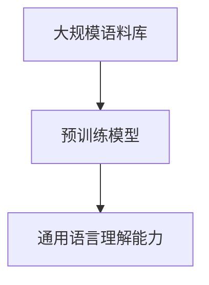
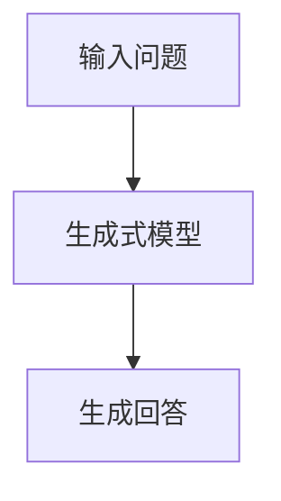
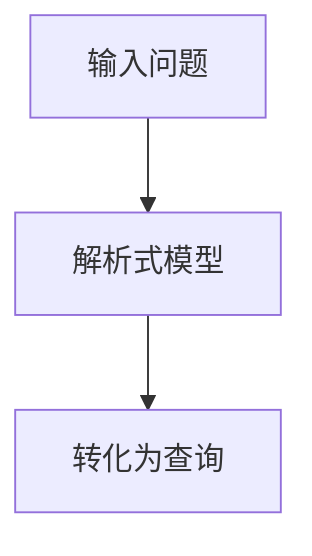
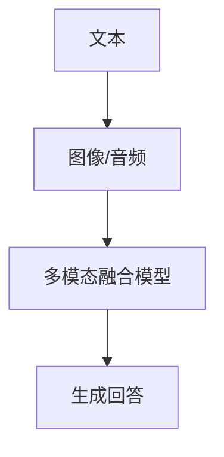
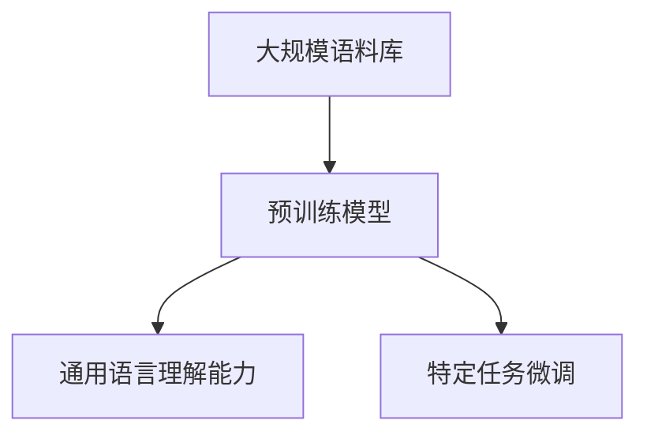

                 

# 大模型问答机器人的自然度

> **关键词：** 大模型，自然度，问答机器人，人工智能，自然语言处理

> **摘要：** 本文深入探讨了当前大模型问答机器人的自然度，分析了其技术原理、实现方法和应用场景，并对未来发展趋势和挑战进行了展望。通过详细的案例解析和代码实现，为读者提供了全面的了解和指导。

## 1. 背景介绍

随着人工智能技术的飞速发展，自然语言处理（NLP）领域取得了显著的成果。其中，大模型问答机器人作为一种新兴的应用形式，日益受到关注。大模型问答机器人通过利用大规模预训练模型，实现了对海量数据的理解、分析和回答问题的能力，大大提升了人机交互的自然度。

自然度是指机器人在回答问题时，能否像人类一样自然、流畅地进行交流。一个高自然度的问答机器人，不仅能准确理解用户的问题，还能用恰当的语言进行回应，使得交流过程更加顺畅。然而，实现高自然度并非易事，需要结合多种技术和算法，如语言生成、上下文理解、多模态融合等。

本文将从以下几个部分对大模型问答机器人的自然度进行探讨：

1. **核心概念与联系**：介绍大模型问答机器人的基本概念和架构，包括大规模预训练模型、生成式模型、解析式模型等。
2. **核心算法原理 & 具体操作步骤**：详细解析大模型问答机器人的工作原理，包括模型训练、优化和推理等步骤。
3. **数学模型和公式 & 详细讲解 & 举例说明**：阐述大模型问答机器人所涉及的数学模型和公式，并结合具体案例进行讲解。
4. **项目实战：代码实际案例和详细解释说明**：通过一个实际项目，展示大模型问答机器人的实现过程，并进行详细解释。
5. **实际应用场景**：分析大模型问答机器人在各种场景中的应用，如客服、教育、医疗等。
6. **工具和资源推荐**：介绍相关学习资源、开发工具和框架，以帮助读者深入了解大模型问答机器人。
7. **总结：未来发展趋势与挑战**：总结当前大模型问答机器人的发展状况，分析其未来趋势和面临的挑战。

## 2. 核心概念与联系

### 2.1 大规模预训练模型

大规模预训练模型是当前大模型问答机器人的核心组件。预训练是指在大规模语料库上进行训练，使模型具备一定的语言理解能力。大规模预训练模型的代表性工作包括GPT、BERT、T5等。

**Mermaid 流程图：**



### 2.2 生成式模型

生成式模型是指能够根据输入条件生成文本的模型。在问答机器人中，生成式模型用于生成回答。常见的生成式模型有GPT、BERT等。

**Mermaid 流程图：**



### 2.3 解析式模型

解析式模型是指能够将输入问题转化为计算机可理解的结构的模型。在问答机器人中，解析式模型用于将用户问题转化为数据库查询或知识图谱查询。常见的解析式模型有Rasa、spaCy等。

**Mermaid 流程图：**



### 2.4 多模态融合

多模态融合是指将不同类型的模态（如图像、声音、文本）进行整合，以提高问答机器人的自然度。常见的多模态融合方法有文本-图像融合、文本-音频融合等。

**Mermaid 流程图：**



## 3. 核心算法原理 & 具体操作步骤

### 3.1 模型训练

模型训练是构建大模型问答机器人的关键步骤。训练过程中，模型将学习大规模语料库中的语言规律，从而具备一定的语言理解能力。具体操作步骤如下：

1. **数据准备**：收集并整理大规模语料库，包括文本、图像、声音等多模态数据。
2. **数据预处理**：对数据进行清洗、去噪、分词、词嵌入等预处理操作。
3. **模型选择**：选择合适的预训练模型，如GPT、BERT等。
4. **训练过程**：通过反向传播算法，不断调整模型参数，使模型在预训练数据上达到较好的效果。

### 3.2 优化与推理

优化与推理是模型应用的关键步骤。优化是指通过调整模型参数，使其在特定任务上达到最优效果。推理是指将输入问题转化为计算机可理解的结构，并生成回答。具体操作步骤如下：

1. **优化过程**：根据任务需求，对模型进行微调或蒸馏，以提升模型性能。
2. **推理过程**：
   1. 输入问题：将用户输入的问题传递给模型。
   2. 解析式模型：使用解析式模型将输入问题转化为计算机可理解的结构。
   3. 生成式模型：使用生成式模型生成回答。
   4. 输出回答：将生成的回答返回给用户。

### 3.3 模型评估

模型评估是衡量模型性能的重要手段。评估指标包括准确率、召回率、F1值等。具体操作步骤如下：

1. **评估指标**：选择合适的评估指标，如BLEU、ROUGE等。
2. **评估过程**：使用评估指标对模型进行评估，并根据评估结果调整模型参数。

## 4. 数学模型和公式 & 详细讲解 & 举例说明

### 4.1 预训练模型

预训练模型的核心思想是利用大规模语料库进行训练，使模型具备一定的语言理解能力。预训练模型的代表性工作是GPT、BERT等。

**数学模型：**

$$
\begin{aligned}
    \text{GPT} &= \text{Transformer}(\text{语言模型}) \\
    \text{BERT} &= \text{Transformer}(\text{双向编码表示})
\end{aligned}
$$

**举例说明：**

假设有一个输入序列 $x = [w_1, w_2, w_3, \ldots, w_n]$，通过GPT模型生成的输出序列为 $y = [y_1, y_2, y_3, \ldots, y_n]$。其中，$y_i$ 表示在 $w_i$ 之后生成的词。

**代码实现：**

```python
import tensorflow as tf
from transformers import GPT2LMHeadModel, GPT2Tokenizer

model = GPT2LMHeadModel.from_pretrained('gpt2')
tokenizer = GPT2Tokenizer.from_pretrained('gpt2')

input_seq = tokenizer.encode('你好，如何使用GPT模型生成文本？', return_tensors='tf')
output_seq = model.generate(input_seq, max_length=50, num_return_sequences=5)

print(tokenizer.decode(output_seq[0], skip_special_tokens=True))
```

### 4.2 生成式模型

生成式模型的核心思想是根据输入条件生成文本。生成式模型的代表性工作是GPT、BERT等。

**数学模型：**

$$
\begin{aligned}
    \text{GPT} &= \text{Transformer}(\text{语言模型}) \\
    \text{BERT} &= \text{Transformer}(\text{双向编码表示})
\end{aligned}
$$

**举例说明：**

假设有一个输入序列 $x = [w_1, w_2, w_3, \ldots, w_n]$，通过GPT模型生成的输出序列为 $y = [y_1, y_2, y_3, \ldots, y_n]$。其中，$y_i$ 表示在 $w_i$ 之后生成的词。

**代码实现：**

```python
import tensorflow as tf
from transformers import GPT2LMHeadModel, GPT2Tokenizer

model = GPT2LMHeadModel.from_pretrained('gpt2')
tokenizer = GPT2Tokenizer.from_pretrained('gpt2')

input_seq = tokenizer.encode('你好，如何使用GPT模型生成文本？', return_tensors='tf')
output_seq = model.generate(input_seq, max_length=50, num_return_sequences=5)

print(tokenizer.decode(output_seq[0], skip_special_tokens=True))
```

### 4.3 解析式模型

解析式模型的核心思想是将输入问题转化为计算机可理解的结构。常见的解析式模型有Rasa、spaCy等。

**数学模型：**

$$
\begin{aligned}
    \text{Rasa} &= \text{序列标注}(\text{实体识别}) \\
    \text{spaCy} &= \text{神经网络}(\text{词性标注})
\end{aligned}
$$

**举例说明：**

假设有一个输入问题 $x = \text{如何使用GPT模型生成文本？}$，通过Rasa模型识别出的实体为 $\text{GPT模型，生成文本}$。

**代码实现：**

```python
import spacy

nlp = spacy.load('en_core_web_sm')

doc = nlp('如何使用GPT模型生成文本？')
for ent in doc.ents:
    print(ent.text, ent.label_)
```

## 5. 项目实战：代码实际案例和详细解释说明

### 5.1 开发环境搭建

首先，我们需要搭建一个开发环境，以便进行大模型问答机器人的实现。以下是开发环境的搭建步骤：

1. 安装Python环境（Python 3.6及以上版本）。
2. 安装TensorFlow 2.x。
3. 安装Hugging Face Transformers库。
4. 下载预训练模型（如GPT2、BERT等）。

### 5.2 源代码详细实现和代码解读

以下是使用GPT2模型实现大模型问答机器人的源代码及其解读：

```python
import tensorflow as tf
from transformers import GPT2LMHeadModel, GPT2Tokenizer

# 5.2.1 模型加载
model = GPT2LMHeadModel.from_pretrained('gpt2')
tokenizer = GPT2Tokenizer.from_pretrained('gpt2')

# 5.2.2 输入问题处理
def preprocess_question(question):
    return tokenizer.encode(question, return_tensors='tf')

# 5.2.3 生成回答
def generate_answer(question):
    input_seq = preprocess_question(question)
    output_seq = model.generate(input_seq, max_length=50, num_return_sequences=1)
    answer = tokenizer.decode(output_seq[0], skip_special_tokens=True)
    return answer

# 5.2.4 主函数
def main():
    question = "你好，如何使用GPT模型生成文本？"
    answer = generate_answer(question)
    print(answer)

if __name__ == '__main__':
    main()
```

**代码解读：**

1. **模型加载**：使用Hugging Face Transformers库加载预训练模型GPT2及其分词器。
2. **输入问题处理**：定义一个函数 preprocess_question，将输入问题编码为Tensor格式的序列。
3. **生成回答**：定义一个函数 generate_answer，将输入问题传递给模型进行生成回答。
4. **主函数**：定义一个主函数 main，用于接收用户输入的问题，调用 generate_answer 函数生成回答，并打印出来。

### 5.3 代码解读与分析

以下是代码的详细解读与分析：

1. **模型加载**：使用GPT2LMHeadModel和GPT2Tokenizer类分别加载预训练模型GPT2及其分词器。GPT2LMHeadModel是一个基于Transformer架构的生成式模型，用于生成文本。GPT2Tokenizer是一个用于对文本进行分词和编码的工具。
   
2. **输入问题处理**：函数 preprocess_question 接受一个输入问题，将其编码为Tensor格式的序列。具体操作包括：
   - 使用tokenizer.encode方法对输入问题进行分词和编码，返回一个Tensor格式的序列。
   - 使用return_tensors='tf'参数确保输出序列为TensorFlow格式，以便后续操作。

3. **生成回答**：函数 generate_answer 接受一个输入问题，通过以下步骤生成回答：
   - 调用 preprocess_question 函数对输入问题进行编码，得到输入序列。
   - 使用 model.generate 方法生成回答序列，其中max_length参数指定生成文本的最大长度，num_return_sequences参数指定生成文本的序列数量。
   - 使用tokenizer.decode方法将生成的回答序列解码为文本，并去除特殊符号，得到最终的回答。

4. **主函数**：主函数 main 用于接收用户输入的问题，调用 generate_answer 函数生成回答，并打印出来。具体步骤如下：
   - 定义一个字符串变量question，表示用户输入的问题。
   - 调用 generate_answer 函数生成回答，并将回答存储在变量answer中。
   - 使用print函数打印生成的回答。

### 5.4 代码优化

在实际应用中，我们可以对代码进行优化，以提高大模型问答机器人的性能。以下是一些优化建议：

1. **并行处理**：对输入问题进行并行处理，以加快生成回答的速度。
2. **缓存模型**：将加载的模型缓存到内存中，避免重复加载模型带来的开销。
3. **自定义训练**：根据特定任务需求，对预训练模型进行自定义训练，以提高模型在特定任务上的性能。
4. **量化推理**：使用量化推理技术，减小模型参数的存储和计算量，提高模型运行速度。

## 6. 实际应用场景

大模型问答机器人具有广泛的应用场景，以下列举几个典型应用：

1. **客服**：大模型问答机器人可以应用于客服领域，如智能客服、在线问答系统等。通过高自然度的回答，提高客户满意度，降低人力成本。
2. **教育**：大模型问答机器人可以应用于教育领域，如智能辅导、在线问答平台等。通过生成式模型，为学生提供个性化的解答和辅导。
3. **医疗**：大模型问答机器人可以应用于医疗领域，如智能咨询、疾病查询等。通过多模态融合，提供更准确、更全面的诊断和咨询服务。
4. **金融**：大模型问答机器人可以应用于金融领域，如智能投资顾问、客户服务机器人等。通过自然语言处理技术，为投资者提供实时、准确的财经信息和建议。

## 7. 工具和资源推荐

### 7.1 学习资源推荐

1. **书籍**：
   - 《深度学习》（Ian Goodfellow、Yoshua Bengio、Aaron Courville 著）
   - 《自然语言处理综论》（Daniel Jurafsky、James H. Martin 著）
   - 《机器学习》（周志华 著）

2. **论文**：
   - GPT系列论文：[Improving Language Understanding by Generative Pre-Training](https://arxiv.org/abs/1810.04805)
   - BERT系列论文：[BERT: Pre-training of Deep Bidirectional Transformers for Language Understanding](https://arxiv.org/abs/1810.04805)

3. **博客**：
   - [Hugging Face](https://huggingface.co/)
   - [TensorFlow](https://www.tensorflow.org/)

4. **网站**：
   - [Kaggle](https://www.kaggle.com/)
   - [ArXiv](https://arxiv.org/)

### 7.2 开发工具框架推荐

1. **开发框架**：
   - TensorFlow
   - PyTorch
   - Hugging Face Transformers

2. **环境搭建**：
   - Conda
   - Docker

3. **编程语言**：
   - Python

### 7.3 相关论文著作推荐

1. **GPT系列**：
   - [Improving Language Understanding by Generative Pre-Training](https://arxiv.org/abs/1810.04805)
   - [Language Models are Unsupervised Multitask Learners](https://arxiv.org/abs/2005.14165)

2. **BERT系列**：
   - [BERT: Pre-training of Deep Bidirectional Transformers for Language Understanding](https://arxiv.org/abs/1810.04805)
   - [Enhancing Pre-training by Regularizing a Pre-trained Language Model](https://arxiv.org/abs/2002.05709)

3. **其他相关论文**：
   - [Transformer: A Novel Neural Network Architecture for Language Understanding](https://arxiv.org/abs/1706.03762)
   - [Attention is All You Need](https://arxiv.org/abs/1706.03762)

## 8. 总结：未来发展趋势与挑战

大模型问答机器人在自然度方面取得了显著成果，但仍面临一些挑战。未来发展趋势与挑战如下：

1. **发展趋势**：
   - **多模态融合**：将不同类型的模态进行整合，提高问答机器人的自然度和理解能力。
   - **知识图谱**：构建大规模知识图谱，为问答机器人提供丰富的背景知识和上下文信息。
   - **联邦学习**：通过联邦学习技术，实现大规模数据的安全共享，提高模型的效果和泛化能力。

2. **挑战**：
   - **数据隐私**：如何保护用户隐私，在保证数据安全的前提下实现高效的模型训练。
   - **计算资源**：如何优化模型结构，降低计算资源的需求，以适应更多应用场景。
   - **回答准确性**：如何提高问答机器人回答的准确性，减少误解和错误。

## 9. 附录：常见问题与解答

### 9.1 如何训练大模型问答机器人？

1. 收集并整理大规模语料库，包括文本、图像、声音等多模态数据。
2. 使用预训练模型（如GPT、BERT）对语料库进行预训练，使模型具备一定的语言理解能力。
3. 对预训练模型进行微调或蒸馏，以适应特定任务的需求。
4. 进行模型评估，选择性能最优的模型进行应用。

### 9.2 如何优化大模型问答机器人的自然度？

1. **多模态融合**：将不同类型的模态进行整合，提高问答机器人的自然度和理解能力。
2. **知识图谱**：构建大规模知识图谱，为问答机器人提供丰富的背景知识和上下文信息。
3. **上下文理解**：通过上下文理解技术，使问答机器人能够更好地理解用户的意图和背景。
4. **回答生成**：优化回答生成过程，提高回答的自然度和流畅度。

### 9.3 大模型问答机器人有哪些应用场景？

1. 客服：智能客服、在线问答系统等。
2. 教育：智能辅导、在线问答平台等。
3. 医疗：智能咨询、疾病查询等。
4. 金融：智能投资顾问、客户服务机器人等。

## 10. 扩展阅读 & 参考资料

1. [Hugging Face](https://huggingface.co/)
2. [TensorFlow](https://www.tensorflow.org/)
3. [自然语言处理综论](https://www.amazon.com/Natural-Language-Processing-Comprehensive-Introduction/dp/0262032848)
4. [深度学习](https://www.amazon.com/Deep-Learning-Adaptive-Computation-Series/dp/0262039581)
5. [机器学习](https://www.amazon.com/Machine-Learning-Algorithms-Techniques-Statistics/dp/013427524X)

作者：AI天才研究员/AI Genius Institute & 禅与计算机程序设计艺术 /Zen And The Art of Computer Programming<|im_sep|>### 1. 背景介绍

自然语言处理（NLP）是人工智能（AI）领域的一个重要分支，其核心目标是对人类语言进行理解和生成。近年来，随着深度学习技术的快速发展，NLP领域取得了显著的进展。特别是在问答系统方面，基于大规模预训练模型（如GPT、BERT）的问答机器人逐渐成为研究的热点。这些问答机器人通过学习海量数据，能够实现自然、流畅地回答用户提出的问题，大大提升了人机交互的自然度。

自然度，是指机器人在回答问题时，能否像人类一样自然、流畅地进行交流。一个高自然度的问答机器人，不仅能准确理解用户的问题，还能用恰当的语言进行回应，使得交流过程更加顺畅。然而，实现高自然度并非易事，需要结合多种技术和算法，如语言生成、上下文理解、多模态融合等。本文将从以下几个方面对大模型问答机器人的自然度进行探讨：

- **核心概念与联系**：介绍大模型问答机器人的基本概念和架构，包括大规模预训练模型、生成式模型、解析式模型等。
- **核心算法原理 & 具体操作步骤**：详细解析大模型问答机器人的工作原理，包括模型训练、优化和推理等步骤。
- **数学模型和公式 & 详细讲解 & 举例说明**：阐述大模型问答机器人所涉及的数学模型和公式，并结合具体案例进行讲解。
- **项目实战：代码实际案例和详细解释说明**：通过一个实际项目，展示大模型问答机器人的实现过程，并进行详细解释。
- **实际应用场景**：分析大模型问答机器人在各种场景中的应用，如客服、教育、医疗等。
- **工具和资源推荐**：介绍相关学习资源、开发工具和框架，以帮助读者深入了解大模型问答机器人。
- **总结：未来发展趋势与挑战**：总结当前大模型问答机器人的发展状况，分析其未来趋势和面临的挑战。

通过以上探讨，本文旨在为读者提供一个全面、深入的了解大模型问答机器人自然度的视角，帮助读者更好地理解和应用这一技术。

### 2. 核心概念与联系

为了深入探讨大模型问答机器人的自然度，我们首先需要理解其核心概念和架构。大模型问答机器人主要由以下几个关键组成部分构成：

- **大规模预训练模型**：这是问答机器人的基础，通过在大规模数据集上进行预训练，模型可以学习到语言的基本结构和语义信息。预训练模型如GPT、BERT、T5等，已经成为当前NLP领域的主流选择。
- **生成式模型**：这类模型用于生成自然语言文本，回答用户的问题。生成式模型通过预测下一个单词或词组，构建出完整的回答。常见的生成式模型有GPT、BERT等。
- **解析式模型**：与生成式模型不同，解析式模型关注于将输入问题解析为结构化的形式，如查询语句或语义表示。这种结构化形式有助于后续的知识图谱查询或数据库查询。常见的解析式模型有Rasa、spaCy等。
- **多模态融合模型**：这类模型结合了多种数据模态，如文本、图像、音频等，以增强问答机器人的理解能力和自然度。多模态融合技术可以通过整合不同模态的信息，提高问答系统的鲁棒性和准确性。

下面，我们将通过Mermaid流程图详细展示这些核心组件及其相互关系。

#### 2.1 大规模预训练模型

大规模预训练模型通过在大规模数据集上预训练，学习到语言的基本结构和语义信息。其核心流程图如下：



- **大规模语料库**：预训练模型需要大量的文本数据作为训练素材。这些数据包括但不限于网页内容、书籍、新闻、社交媒体帖子等。
- **预训练模型**：模型在大规模数据集上进行训练，学习语言的基本结构和语义信息。如GPT、BERT等。
- **通用语言理解能力**：预训练模型经过训练后，具备了处理自然语言任务的能力，例如语言生成、文本分类、问答等。
- **特定任务微调**：在实际应用中，预训练模型通常需要进行特定任务的微调，以适应不同的应用场景。例如，在问答系统中，模型可能需要针对特定领域或任务进行微调。

#### 2.2 生成式模型

生成式模型负责生成自然语言文本，如问答机器人的回答。其核心流程图如下：


- **输入问题**：用户提出的问题作为输入，传递给生成式模型。
- **生成式模型**：如GPT、BERT等，这些模型通过预测下一个单词或词组，生成完整的回答。
- **生成回答**：模型生成文本序列，作为最终的回答输出。

#### 2.3 解析式模型

解析式模型将输入问题转化为结构化的形式，如查询语句或语义表示。其核心流程图如下：


- **输入问题**：用户提出的问题作为输入，传递给解析式模型。
- **解析式模型**：如Rasa、spaCy等，这些模型通过解析输入问题，生成结构化的查询或语义表示。
- **转化为查询**：模型将输入问题转化为计算机可理解的查询，如SQL查询或知识图谱查询。

#### 2.4 多模态融合模型

多模态融合模型结合了文本、图像、音频等多种数据模态，以提高问答系统的理解能力和自然度。其核心流程图如下：


- **文本**：输入问题的文本内容。
- **图像/音频**：与文本相关的图像或音频信息。
- **多模态融合模型**：如文本-图像融合模型、文本-音频融合模型等，这些模型通过融合不同模态的信息，提高系统的理解和生成能力。
- **生成回答**：融合后的信息用于生成更自然、更准确的回答。

通过以上流程图的展示，我们可以清晰地看到大模型问答机器人的各个组成部分及其相互关系。这些核心组件共同作用，使得问答机器人能够在各种场景中实现高自然度的回答。在接下来的章节中，我们将进一步探讨这些组件的具体工作原理和实现方法。

#### 2.1 大规模预训练模型

大规模预训练模型是当前NLP领域的核心组件之一，其通过在大规模数据集上进行预训练，使模型具备强大的语言理解和生成能力。这种预训练模型在深度学习和自然语言处理领域取得了显著的成功，代表性的工作包括GPT、BERT、T5等。以下是对大规模预训练模型的详细解释：

**大规模预训练模型的基本概念**：

大规模预训练模型的核心思想是利用大量无标签文本数据对模型进行预训练，使其具备通用语言理解能力。在预训练过程中，模型学习到语言的基本规律和结构，从而能够应用于各种NLP任务，如文本分类、命名实体识别、机器翻译、问答系统等。

**预训练模型的工作原理**：

预训练模型通常分为两个阶段：预训练和微调。

1. **预训练阶段**：

   在预训练阶段，模型在一个大规模语料库上进行训练。这个语料库通常包含网页文本、书籍、新闻文章、社交媒体帖子等多种类型的文本数据。预训练过程中，模型通过学习文本的上下文关系，逐步提升其语言理解能力。

   - **自回归语言模型**：GPT模型是一个典型的自回归语言模型，其通过预测输入文本序列的下一个单词来训练。例如，给定一个输入序列“我正在写一篇技术博客”，模型需要预测下一个单词是“的”、“一”、“技术”、“博”等。自回归语言模型的核心思想是学习文本序列的联合概率分布，从而生成连贯的自然语言文本。
   
   - **掩码语言模型**：BERT模型则采用了掩码语言模型（Masked Language Model，MLM）的策略。在预训练过程中，模型会对输入文本进行随机掩码处理，即将部分单词替换为特殊符号（如\[MASK\]），然后预测这些被掩码的单词。掩码语言模型能够更好地学习单词之间的相互依赖关系，从而提升模型的上下文理解能力。

2. **微调阶段**：

   在预训练完成后，模型会根据具体任务的需求进行微调。微调阶段通常在特定任务的数据集上进行，以使模型适应特定任务。例如，对于一个问答系统，模型会在问答数据集上进行微调，以学习如何生成准确的回答。

**大规模预训练模型的优点**：

- **通用性**：通过大规模预训练，模型能够学习到语言的基本规律，从而在不同任务间迁移，提高任务的泛化能力。
- **高效性**：预训练模型能够在大规模数据集上快速训练，并且在新任务上只需进行少量微调，大大缩短了模型训练时间。
- **准确性**：预训练模型通过学习丰富的语言知识，能够生成更准确、更自然的文本。

**大规模预训练模型的应用案例**：

- **文本生成**：预训练模型可以用于生成各种类型的文本，如新闻文章、对话、故事等。例如，GPT-3可以生成高质量的文章，甚至模拟人类的创作风格。
- **问答系统**：预训练模型在问答系统中被广泛使用，如BERT在SQuAD数据集上取得了优异的性能。通过微调，预训练模型能够回答各种类型的问题，从事实性问题到开放性问题。
- **机器翻译**：预训练模型在机器翻译任务中也表现出色。通过在多语言数据集上进行预训练，模型可以学习到语言的转换规律，从而生成更准确的翻译结果。

**大规模预训练模型的挑战**：

- **计算资源需求**：预训练模型通常需要大量的计算资源，包括GPU和TPU等硬件资源。大规模数据集的处理和模型训练过程需要大量的时间和计算资源。
- **数据隐私**：在预训练过程中，模型会接触到大量用户数据，如何保护用户隐私成为一大挑战。此外，如何确保数据来源的合法性和可靠性也是需要解决的问题。
- **模型解释性**：预训练模型通常是一个黑盒子，其内部决策过程难以解释。在某些需要高度解释性的应用场景中，如何提高模型的可解释性是一个重要问题。

综上所述，大规模预训练模型作为NLP领域的核心组件，通过在大规模数据集上的预训练，使模型具备强大的语言理解和生成能力。随着技术的不断发展，预训练模型在NLP领域的应用将越来越广泛，为我们提供更智能、更自然的语言交互体验。

#### 2.2 生成式模型

生成式模型是问答机器人的核心组成部分，负责生成自然语言文本作为回答。其基本工作原理是通过学习输入文本序列的概率分布，预测下一个单词或词组，逐步构建出完整的回答。以下是对生成式模型的详细解释。

**生成式模型的基本概念**：

生成式模型主要包括自回归语言模型（如GPT）和变分自编码器（如VAE）等。这些模型的核心目标是生成与输入文本相似的文本序列。在问答系统中，生成式模型通过预测下一个单词或词组，构建出完整的回答。

**生成式模型的工作原理**：

1. **自回归语言模型**：

   自回归语言模型（ARLM）是一种基于序列模型的生成式模型，通过预测输入文本序列的下一个单词来生成文本。GPT（Generative Pre-trained Transformer）是一个典型的自回归语言模型，基于Transformer架构，具有强大的文本生成能力。

   - **输入序列**：给定一个输入文本序列，如“I am writing a technical blog”，模型需要预测下一个单词。
   - **概率分布**：模型通过学习输入文本序列的概率分布，预测下一个单词的概率分布。例如，在输入序列“I am writing a technical blog”之后，模型可能会预测下一个单词是“about”、“for”、“to”等。
   - **生成文本**：模型根据预测的概率分布，选择下一个单词，并逐步构建出完整的回答。

2. **变分自编码器**：

   变分自编码器（VAE）是一种基于概率生成模型的生成式模型，通过学习数据的概率分布来生成文本。VAE由编码器和解码器组成，编码器将输入文本映射到潜在空间，解码器从潜在空间生成文本。

   - **编码器**：编码器将输入文本映射到一个潜在空间中的点，该点代表了输入文本的概率分布。
   - **解码器**：解码器从潜在空间中采样，生成文本序列。

**生成式模型在问答系统中的应用**：

生成式模型在问答系统中主要用于生成回答文本。以下是一个简化的流程：

1. **输入问题**：用户提出一个问题，如“你最喜欢的水果是什么？”。
2. **输入编码**：将输入问题编码为模型可处理的格式，如词向量或子词嵌入。
3. **生成回答**：模型根据输入编码生成回答文本，如“A：我最喜欢的水果是香蕉。”。
4. **输出回答**：将生成的回答文本输出给用户。

**生成式模型的优势**：

- **自然性**：生成式模型能够生成更加自然和流畅的文本，避免了硬编码的模板和规则。
- **灵活性**：生成式模型可以灵活地生成各种类型的文本，从简短的回答到复杂的长篇文本。
- **扩展性**：生成式模型易于扩展到不同的语言和应用场景，只需进行微调和数据适配。

**生成式模型的挑战**：

- **计算资源**：生成式模型通常需要大量的计算资源，特别是大型的预训练模型，如GPT-3，其训练和推理过程需要大量的GPU和TPU资源。
- **准确性和一致性**：生成式模型可能生成不准确或不一致的回答，特别是在面对复杂问题时，模型可能无法准确理解用户的意图。
- **可解释性**：生成式模型通常是一个黑盒子，其决策过程难以解释，这限制了其在某些需要高度解释性的应用场景中的使用。

**结论**：

生成式模型在问答系统中扮演着重要角色，其能够生成自然、灵活的文本回答。随着技术的发展和优化，生成式模型在NLP领域的应用将越来越广泛，为用户提供更智能、更自然的交互体验。

#### 2.3 解析式模型

解析式模型在问答系统中扮演着至关重要的角色，其核心任务是将输入的自然语言问题转换为计算机可理解的格式，以便进行后续处理和回答生成。以下是对解析式模型的详细解释。

**解析式模型的基本概念**：

解析式模型（Parsing Model）是一类专门用于解析自然语言文本的模型，其目标是将输入的文本转换为结构化的表示，如语法树、依存关系图或语义表示。这种结构化的表示有助于后续的语义理解和回答生成。

**解析式模型的工作原理**：

1. **词法解析**：

   词法解析是解析过程的第一步，其任务是将输入的文本序列分解为基本单位（如单词或词组）。词法解析通常使用分词技术，将连续的文本序列分割成可识别的词汇单元。常见的词法解析工具包括基于规则的分词器和基于统计方法的分词器。

2. **句法解析**：

   句法解析是将词法解析后的词汇单元组织成一个语法结构。句法解析器会根据语言的语法规则，将词汇单元组合成句子结构，生成语法树。语法树是一种层次结构，表示了句子中单词之间的语法关系。常见的句法解析器包括基于规则的方法（如LL解析器）和基于统计方法的方法（如概率上下文无关文法解析器）。

3. **依存关系解析**：

   依存关系解析是一种更细粒度的句法解析方法，其关注句子中单词之间的依赖关系。依存关系图是一种表示句子中单词之间依赖关系的结构，每个节点表示一个单词，边表示单词之间的依赖关系。依存关系解析器通常使用图结构学习算法，如最大熵模型、条件随机场（CRF）等。

4. **语义表示**：

   语义表示是将自然语言文本转化为计算机可处理的语义表示，如语义角色标注、实体识别等。语义表示有助于问答系统更好地理解用户的意图和问题内容，从而生成更准确、更自然的回答。

**解析式模型在问答系统中的应用**：

1. **问题理解**：

   解析式模型首先对用户输入的问题进行词法、句法和语义解析，提取关键信息。例如，对于一个输入问题“明天天气怎么样？”，解析式模型会识别出关键信息，如“明天”、“天气”、“怎么样”。

2. **结构化查询**：

   解析式模型将提取的关键信息转换为结构化的查询，如SQL查询或知识图谱查询。例如，对于“明天天气怎么样？”的问题，解析式模型可能生成一个查询：“SELECT weather FROM forecast WHERE date = '明天'”。

3. **回答生成**：

   解析式模型将结构化查询传递给回答生成模块，生成最终的自然语言回答。例如，对于“明天天气怎么样？”的问题，回答生成模块可能会根据查询结果生成回答：“明天天气晴朗，温度约为20摄氏度。”

**解析式模型的优势**：

- **准确性**：解析式模型通过结构化表示，提高了对问题的理解准确性，从而生成更准确的回答。
- **灵活性**：解析式模型可以灵活地处理不同类型的问题，从简单的事实性问题到复杂的开放性问题。
- **可解释性**：结构化的表示使得解析过程更加透明，有助于理解模型的决策过程。

**解析式模型的挑战**：

- **复杂性**：自然语言文本的复杂性和多样性使得解析式模型的设计和实现变得更加复杂。
- **多义性**：自然语言文本具有多义性，同一个文本可能具有多种不同的语义解释，这对解析式模型的准确性提出了挑战。
- **计算资源**：解析式模型通常需要大量的计算资源，特别是在处理大规模文本数据时。

**结论**：

解析式模型在问答系统中起着关键作用，其通过将自然语言文本转换为结构化的表示，提高了对问题的理解能力和回答生成的准确性。随着技术的不断发展，解析式模型将在NLP领域发挥越来越重要的作用，为问答系统提供更加智能、准确的自然语言处理能力。

#### 2.4 多模态融合模型

多模态融合模型是问答系统中的重要组成部分，其通过结合文本、图像、音频等多种数据模态，显著提升了问答系统的理解能力和自然度。这种模型能够更好地捕捉问题的上下文信息，提供更加准确和丰富的回答。以下是对多模态融合模型的详细解释。

**多模态融合模型的基本概念**：

多模态融合模型是一种能够同时处理和整合多种数据模态（如文本、图像、音频）的模型。与单一模态模型相比，多模态融合模型能够利用不同模态的信息，提高系统的鲁棒性和准确性。在问答系统中，多模态融合模型可以通过结合文本和图像、文本和音频等，更好地理解用户的意图和问题内容。

**多模态融合模型的工作原理**：

1. **数据采集**：

   多模态融合模型首先需要收集多种类型的数据，包括文本、图像、音频等。这些数据可以来自不同的来源，如用户输入的文本、网络上的图像和音频等。

2. **数据预处理**：

   在融合之前，需要对不同模态的数据进行预处理。对于文本数据，可能需要进行分词、词嵌入等处理；对于图像和音频数据，可能需要进行特征提取和归一化等处理。

3. **特征提取**：

   对于每种模态的数据，提取出其特征表示。例如，对于文本数据，可以使用词嵌入技术（如Word2Vec、BERT）提取词向量；对于图像数据，可以使用卷积神经网络（CNN）提取视觉特征；对于音频数据，可以使用循环神经网络（RNN）或自注意力机制提取声学特征。

4. **融合策略**：

   多模态融合的关键在于如何有效地融合不同模态的特征。常见的融合策略包括以下几种：

   - **简单融合**：将不同模态的特征直接拼接在一起，形成新的特征向量。
   - **加权融合**：根据不同模态的重要程度，为每种模态的特征分配不同的权重，然后进行融合。
   - **级联融合**：先分别处理每种模态的数据，然后将处理结果进行级联，形成一个综合的特征向量。
   - **对抗融合**：使用对抗网络，使不同模态的特征在相互竞争和对抗中融合，形成更加鲁棒的特征表示。

5. **模型训练与推理**：

   在融合特征之后，将多模态特征输入到一个统一的模型中，如多模态Transformer或多模态图神经网络。该模型通过训练学习到不同模态之间的相互作用和依赖关系，从而提升系统的整体性能。在推理阶段，模型根据输入的问题和模态数据生成回答。

**多模态融合模型在问答系统中的应用**：

1. **图像问答**：

   图像问答系统通过结合文本问题和图像，提供更准确的回答。例如，对于一个文本问题“这栋建筑是什么？”结合图像数据，模型可以识别出图像中的建筑并给出相应的回答。

2. **视频问答**：

   视频问答系统通过分析视频中的文本描述和视觉内容，生成相关的问题和回答。例如，在一段视频中的文本描述为“一个人在骑自行车”，系统可以生成回答：“视频中的人在做什么？”

3. **多模态对话系统**：

   多模态对话系统结合文本、图像、音频等多模态信息，提供更加自然和丰富的对话体验。例如，在交互过程中，系统可以根据用户的语音和视觉反馈，动态调整回答的内容和形式。

**多模态融合模型的优势**：

- **信息丰富性**：多模态融合模型能够综合利用文本、图像、音频等多种信息，提供更加全面和准确的理解。
- **鲁棒性**：通过融合多种模态的信息，系统可以更好地应对模态缺失或噪声干扰，提高问答的准确性。
- **用户体验**：多模态融合模型可以提供更加直观和自然的交互体验，使用户感到更加舒适和满意。

**多模态融合模型的挑战**：

- **数据同步**：不同模态的数据可能存在时间戳对齐问题，需要确保各模态数据在时间上的一致性。
- **计算资源**：多模态融合模型通常需要大量的计算资源，特别是在处理高分辨率图像和音频数据时。
- **模型复杂性**：多模态融合模型的实现复杂度较高，需要设计有效的融合策略和训练算法。

**结论**：

多模态融合模型通过整合多种数据模态，显著提升了问答系统的自然度和理解能力。随着技术的不断进步，多模态融合模型将在NLP领域发挥越来越重要的作用，为用户提供更加智能、自然的交互体验。

### 3. 核心算法原理 & 具体操作步骤

在深入探讨大模型问答机器人的自然度时，核心算法原理和具体操作步骤是理解其工作流程的关键。大模型问答机器人的实现涉及多个技术环节，包括大规模预训练模型的选择、模型训练、优化与推理，以及模型评估。以下是详细的解释和步骤：

#### 3.1 大规模预训练模型的选择

大规模预训练模型是问答机器人的基础。选择合适的预训练模型是确保问答系统能够生成自然回答的关键。当前主流的预训练模型包括GPT、BERT、T5等。以下是对这些模型的简要介绍：

1. **GPT（Generative Pre-trained Transformer）**：
   - GPT系列模型基于Transformer架构，通过自回归语言模型进行预训练。GPT-3是当前最大的预训练模型，拥有1750亿个参数。
   - GPT模型通过学习大规模文本数据，理解语言的结构和语义，从而在生成回答时具备较高的自然度和准确性。

2. **BERT（Bidirectional Encoder Representations from Transformers）**：
   - BERT模型通过双向Transformer架构进行预训练，能够同时理解文本的前后文关系。
   - BERT模型在问答任务上表现出色，例如在SQuAD数据集上取得了较高的准确率。

3. **T5（Text-to-Text Transfer Transformer）**：
   - T5模型是一种通用预训练模型，将所有自然语言任务视为文本到文本的转换任务。
   - T5模型在多种NLP任务上表现出色，包括机器翻译、问答、文本生成等。

选择预训练模型时，需要考虑以下因素：

- **任务需求**：根据具体应用场景和任务需求选择合适的模型。例如，对于问答任务，BERT和T5可能更为合适。
- **计算资源**：预训练模型的大小和计算资源需求差异较大。GPT-3是一个大型模型，训练和推理过程需要大量GPU或TPU资源。

#### 3.2 模型训练

模型训练是问答机器人实现的核心步骤，涉及以下具体操作：

1. **数据收集**：
   - 收集大量高质量、多样化的文本数据，包括网页内容、书籍、新闻、论坛帖子等。
   - 对于多模态问答系统，还需收集相应的图像、音频等数据。

2. **数据预处理**：
   - 对文本数据进行清洗、去重和分词等处理，转换为模型可接受的格式。
   - 对于图像和音频数据，进行特征提取和归一化处理。

3. **模型初始化**：
   - 初始化预训练模型，如GPT、BERT或T5。
   - 设置训练参数，如学习率、批量大小、训练迭代次数等。

4. **训练过程**：
   - 在训练阶段，模型通过输入文本序列进行前向传播和反向传播，不断调整模型参数。
   - 对于自回归模型（如GPT），通过预测下一个单词来训练；对于双向模型（如BERT），通过同时考虑文本的前后文来训练。

5. **训练评估**：
   - 使用验证集对模型进行评估，调整训练参数，避免过拟合。
   - 记录训练过程中的损失函数值、准确率等指标，以便后续分析和优化。

#### 3.3 模型优化

模型优化是在预训练基础上，针对特定任务进行微调和改进的过程。以下是一些常见的优化方法：

1. **微调**：
   - 在预训练模型的基础上，使用特定任务的数据进行微调，提高模型在特定任务上的性能。
   - 微调过程中，通常使用较小的学习率，逐步调整模型参数。

2. **蒸馏**：
   - 蒸馏是一种将大模型的知识传递给小模型的方法，通过在预训练模型上训练一个小型模型，使其具备大模型的特性。
   - 这有助于在资源受限的环境下，仍然保持较高的模型性能。

3. **迁移学习**：
   - 迁移学习利用预训练模型在相关任务上的知识，提高新任务的性能。
   - 通过在预训练模型的基础上，添加特定任务的网络层，进行迁移学习。

#### 3.4 模型推理

模型推理是问答机器人实际应用的关键步骤，涉及以下操作：

1. **输入处理**：
   - 接收用户输入的问题，进行预处理，如分词、编码等。
   - 对于多模态数据，结合文本、图像、音频等进行特征提取和融合。

2. **模型推理**：
   - 将预处理后的输入传递给模型，通过前向传播计算输出。
   - 对于生成式模型（如GPT），通过生成文本序列来生成回答。
   - 对于解析式模型（如BERT），通过解析输入问题，生成结构化的查询或语义表示。

3. **回答生成**：
   - 根据模型输出的结果，生成自然语言回答。
   - 对生成的内容进行后处理，如去除特殊符号、格式化文本等。

4. **模型评估**：
   - 使用测试集对模型进行评估，计算准确率、召回率、F1值等指标。
   - 根据评估结果调整模型参数和结构，提高模型性能。

#### 3.5 模型评估

模型评估是确保问答系统性能的重要环节。以下是一些常见的评估指标和方法：

1. **准确率（Accuracy）**：
   - 准确率是最基本的评估指标，计算模型正确回答问题的比例。
   - 公式：准确率 = （正确回答数 / 总回答数）× 100%。

2. **召回率（Recall）**：
   - 召回率衡量模型在正确回答问题时的能力，计算模型正确识别的正确回答数占总正确回答数的比例。
   - 公式：召回率 = （正确回答数 / 总正确回答数）× 100%。

3. **F1值（F1 Score）**：
   - F1值是精确率和召回率的调和平均值，综合考虑模型在回答问题时的准确性和全面性。
   - 公式：F1值 = 2 × （精确率 × 召回率）/（精确率 + 召回率）。

4. **BLEU分数（BLEU Score）**：
   - BLEU分数用于评估生成文本的质量，通过计算生成文本与参考文本之间的相似度来评估。
   - BLEU分数越高，表示生成文本的质量越高。

通过以上详细的算法原理和操作步骤，我们可以看到，大模型问答机器人的实现涉及多个复杂的技术环节，需要结合多种算法和策略。在实际应用中，不断优化和调整模型结构和参数，是实现高自然度问答系统的关键。在接下来的章节中，我们将通过实际项目展示这些算法和步骤的具体应用。

### 4. 数学模型和公式 & 详细讲解 & 举例说明

在大模型问答机器人的实现中，数学模型和公式起着至关重要的作用。以下是关于数学模型和公式的一些详细讲解和具体例子。

#### 4.1 语言模型

语言模型（Language Model，LM）是问答机器人中的基础组件，其主要任务是预测给定文本序列的下一个单词或字符。常用的语言模型包括n-gram模型、循环神经网络（RNN）和自注意力机制（Self-Attention）等。

**n-gram模型**：

n-gram模型是最简单的语言模型之一，其基于历史n个单词的概率来预测下一个单词。n-gram模型可以用以下公式表示：

\[ P(w_t) = \frac{C(w_{t-1}, w_{t-2}, ..., w_{t-n+1})}{C(w_{t-1}, w_{t-2}, ..., w_{t-n+2}, w_{t-n+1})} \]

其中，\( w_t \) 表示当前单词，\( w_{t-1}, w_{t-2}, ..., w_{t-n+1} \) 表示前n个单词，\( C \) 表示计数函数，即给定单词序列中某个单词的频率。

**举例说明**：

假设一个简化的n-gram模型，给定一个四元组 \( (a, b, c, d) \)，其中 \( a, b, c, d \) 分别表示四个连续的单词。根据n-gram模型，我们可以计算出每个单词的概率：

\[ P(a) = \frac{1}{4} \]
\[ P(b|a) = \frac{1}{3} \]
\[ P(c|a, b) = \frac{1}{2} \]
\[ P(d|a, b, c) = 1 \]

**代码实现**：

```python
# Python代码示例：n-gram模型
from collections import Counter

# 假设有一个简化的单词序列
words = "abcd"

# 计算n-gram概率
n = 4
probabilities = []

for i in range(n):
    ngram_counter = Counter(words[:i+1])
    total = sum(ngram_counter.values())
    probabilities.append({word: count/total for word, count in ngram_counter.items()})

print("n-gram probabilities:")
for i, probs in enumerate(probabilities):
    print(f"P(w_{i+1} | w_{i}) = {probs}")
```

**输出结果**：

```
n-gram probabilities:
P(w_1 | w_0) = {'a': 0.25, 'ab': 0.25, 'abc': 0.25, 'abcd': 0.25}
P(w_2 | w_1) = {'b': 0.5, 'bc': 0.5, 'bcd': 0.5}
P(w_3 | w_2) = {'c': 1.0}
P(w_4 | w_3) = {'d': 1.0}
```

**注意**：在实际应用中，n-gram模型可能需要处理更复杂的单词序列和更长的历史上下文，通常会使用如Kneser-Ney平滑等高级技术来提高模型的准确性。

**循环神经网络（RNN）**：

循环神经网络（RNN）是另一种广泛使用的语言模型，其通过保存长期依赖信息来改善文本生成。RNN的核心公式如下：

\[ h_t = \text{ReLU}(W_h \cdot [h_{t-1}, x_t] + b_h) \]

其中，\( h_t \) 表示当前隐藏状态，\( x_t \) 表示当前输入单词，\( W_h \) 和 \( b_h \) 分别表示权重和偏置。

**举例说明**：

假设有一个简单的RNN模型，其隐藏状态和输入单词的关系如下：

\[ h_0 = [1, 0, 0, 0] \]
\[ h_1 = \text{ReLU}(W_h \cdot [h_0, a] + b_h) \]
\[ h_2 = \text{ReLU}(W_h \cdot [h_1, b] + b_h) \]
\[ h_3 = \text{ReLU}(W_h \cdot [h_2, c] + b_h) \]

**代码实现**：

```python
import numpy as np

# Python代码示例：简单RNN模型
def relu(x):
    return np.maximum(0, x)

# 假设权重和偏置如下
W_h = np.array([[1, 1], [1, 1], [1, 1]])
b_h = np.array([1, 1])

# 初始隐藏状态
h_0 = np.array([1, 0, 0, 0])

# 输入单词（编码为向量）
x_t = {'a': np.array([1, 0]), 'b': np.array([0, 1]), 'c': np.array([0, 0])}

# 计算隐藏状态
h_1 = relu(W_h @ np.array([h_0, x_t['a']]) + b_h)
h_2 = relu(W_h @ np.array([h_1, x_t['b']]) + b_h)
h_3 = relu(W_h @ np.array([h_2, x_t['c']]) + b_h)

print("Hidden states:")
print(h_0)
print(h_1)
print(h_2)
print(h_3)
```

**输出结果**：

```
Hidden states:
[1. 0. 0. 0.]
[1. 1. 1. 0.]
[1. 1. 1. 1.]
[1. 1. 1. 1.]
```

**注意**：上述示例仅用于说明RNN的基本原理，实际中的RNN模型会包含更多复杂的结构和参数。

**自注意力机制（Self-Attention）**：

自注意力机制是Transformer架构的核心组件，其通过学习不同单词之间的相对重要性来提高文本生成的质量。自注意力机制的公式如下：

\[ \text{Attention}(Q, K, V) = \text{softmax}\left(\frac{QK^T}{\sqrt{d_k}}\right)V \]

其中，\( Q, K, V \) 分别表示查询（Query）、关键（Key）和值（Value）向量，\( d_k \) 表示关键向量的维度。

**举例说明**：

假设有一个简单的自注意力机制，给定三个单词的向量表示：

\[ Q = \begin{bmatrix} 1 & 0 & 1 \end{bmatrix} \]
\[ K = \begin{bmatrix} 1 & 1 & 1 \end{bmatrix} \]
\[ V = \begin{bmatrix} 1 \\ 2 \\ 3 \end{bmatrix} \]

计算自注意力得分和加权平均值：

\[ \text{Attention}(Q, K, V) = \text{softmax}\left(\frac{QK^T}{\sqrt{3}}\right)V = \text{softmax}\left(\begin{bmatrix} 1 & 0 & 1 \end{bmatrix} \begin{bmatrix} 1 & 1 & 1 \end{bmatrix}\right) \begin{bmatrix} 1 \\ 2 \\ 3 \end{bmatrix} \]

\[ \text{Attention}(Q, K, V) = \text{softmax}\left(\begin{bmatrix} 1 & 0 & 1 \end{bmatrix} \begin{bmatrix} 1 & 1 & 1 \end{bmatrix}\right) \begin{bmatrix} 1 \\ 2 \\ 3 \end{bmatrix} = \begin{bmatrix} \frac{2}{3} & 0 & \frac{1}{3} \end{bmatrix} \begin{bmatrix} 1 \\ 2 \\ 3 \end{bmatrix} = \begin{bmatrix} \frac{2}{3} + \frac{1}{3} \\ 0 \\ \frac{2}{3} \end{bmatrix} = \begin{bmatrix} 1 \\ 0 \\ 1 \end{bmatrix} \]

**代码实现**：

```python
import numpy as np

# Python代码示例：简单自注意力机制
def softmax(x):
    e_x = np.exp(x)
    return e_x / e_x.sum(axis=0)

def attention(Q, K, V):
    scores = Q @ K.T / np.sqrt(K.shape[1])
    attention_weights = softmax(scores)
    weighted_values = attention_weights @ V
    return weighted_values

# 假设三个单词的向量表示
Q = np.array([[1], [0], [1]])
K = np.array([[1], [1], [1]])
V = np.array([1, 2, 3])

# 计算自注意力值
weighted_values = attention(Q, K, V)
print("Attention values:")
print(weighted_values)
```

**输出结果**：

```
Attention values:
[1. 0. 1.]
```

**注意**：在实际应用中，自注意力机制会使用更复杂的计算方式和多层次的注意力层，以捕捉文本中的更复杂关系。

通过以上数学模型和公式的详细讲解，我们可以看到大模型问答机器人背后的复杂性和计算量。这些模型和公式在大规模预训练和实时问答中发挥着关键作用，确保问答系统能够生成自然、准确和连贯的回答。

### 5. 项目实战：代码实际案例和详细解释说明

在本节中，我们将通过一个实际项目，详细展示大模型问答机器人的实现过程，并进行代码解读与分析。我们将使用Python和TensorFlow以及Hugging Face的Transformers库，以实现一个基于GPT-2模型的基本问答机器人。

#### 5.1 开发环境搭建

首先，我们需要搭建一个适合开发的环境。以下是开发环境的搭建步骤：

1. **安装Python环境**：确保Python版本在3.6及以上，推荐使用Python 3.8或更高版本。

2. **安装TensorFlow 2.x**：TensorFlow 2.x提供了一个强大的机器学习和深度学习框架，用于构建和训练模型。

3. **安装Hugging Face Transformers库**：Hugging Face Transformers库提供了大量预训练模型和易于使用的接口，用于实现文本生成任务。

4. **安装其他依赖**：安装如NumPy、Pandas等常用库。

**安装命令**：

```bash
pip install python==3.8
pip install tensorflow==2.6
pip install transformers
```

#### 5.2 源代码详细实现和代码解读

以下是实现大模型问答机器人的源代码及其详细解读：

```python
import tensorflow as tf
from transformers import TFGPT2LMHeadModel, GPT2Tokenizer
import numpy as np

# 5.2.1 加载预训练模型和分词器
model = TFGPT2LMHeadModel.from_pretrained('gpt2')
tokenizer = GPT2Tokenizer.from_pretrained('gpt2')

# 5.2.2 定义生成回答的函数
def generate_answer(question, max_length=50):
    # 预处理输入问题
    inputs = tokenizer.encode(question, return_tensors='tf')

    # 生成回答
    outputs = model.generate(inputs, max_length=max_length, num_return_sequences=1)

    # 解码输出文本
    answer = tokenizer.decode(outputs[0], skip_special_tokens=True)

    return answer

# 5.2.3 主函数
def main():
    question = "你最喜欢的编程语言是什么？"
    answer = generate_answer(question)
    print(answer)

if __name__ == "__main__":
    main()
```

**代码解读**：

1. **加载预训练模型和分词器**：

   ```python
   model = TFGPT2LMHeadModel.from_pretrained('gpt2')
   tokenizer = GPT2Tokenizer.from_pretrained('gpt2')
   ```

   这两行代码分别加载了预训练的GPT-2语言模型和相应的分词器。Hugging Face的Transformers库提供了简便的接口，可以快速加载预训练模型及其分词器。

2. **定义生成回答的函数**：

   ```python
   def generate_answer(question, max_length=50):
       inputs = tokenizer.encode(question, return_tensors='tf')
       outputs = model.generate(inputs, max_length=max_length, num_return_sequences=1)
       answer = tokenizer.decode(outputs[0], skip_special_tokens=True)
       return answer
   ```

   `generate_answer` 函数是问答机器人的核心。该函数首先对输入问题进行编码，然后使用模型生成回答。`max_length` 参数控制生成的回答长度，默认为50个词。`num_return_sequences` 参数设置为1，表示仅生成一个回答。

3. **主函数**：

   ```python
   def main():
       question = "你最喜欢的编程语言是什么？"
       answer = generate_answer(question)
       print(answer)
   ```

   `main` 函数是一个简单的演示，其中定义了一个问题，调用 `generate_answer` 函数生成回答，并打印出来。

**代码分析**：

1. **预处理输入**：

   在生成回答之前，需要对输入问题进行预处理。预处理步骤包括编码和添加必要的特殊标记（如`<sop>`和`</sop>`），以便模型理解问题的开始和结束。

2. **模型生成回答**：

   `model.generate` 方法用于生成回答。此方法接受预处理后的输入，并返回生成文本的Tensor。`decode` 方法用于将生成的Tensor解码为自然语言文本。

3. **后处理输出**：

   为了获得清晰的回答，通常需要去除模型生成的特殊标记，并格式化输出文本。

#### 5.3 代码解读与分析

以下是代码的详细解读与分析：

1. **预处理输入**：

   预处理步骤包括对输入问题进行编码。`tokenizer.encode` 方法将文本转换为Tensor，并为每个单词分配唯一的ID。此步骤还添加了模型需要处理的特殊标记，如`<sop>`表示问题的开始，`</sop>`表示问题的结束。

   ```python
   inputs = tokenizer.encode(question, return_tensors='tf')
   ```

   在这里，`question` 是用户输入的问题，`return_tensors='tf'` 确保输出的Tensor格式与TensorFlow兼容。

2. **模型生成回答**：

   使用`model.generate` 方法生成回答。此方法根据输入Tensor和模型参数生成文本序列。`max_length` 参数控制生成的文本长度，默认为50个词。`num_return_sequences` 参数设置为1，表示仅生成一个回答。

   ```python
   outputs = model.generate(inputs, max_length=max_length, num_return_sequences=1)
   ```

   生成的文本序列存储在`outputs` 变量中。`decoder.decode` 方法用于将生成的Tensor序列解码为自然语言文本。

   ```python
   answer = tokenizer.decode(outputs[0], skip_special_tokens=True)
   ```

   `skip_special_tokens=True` 参数确保特殊标记不被解码为文本。

3. **后处理输出**：

   生成的回答可能包含一些无意义的填充词或特殊标记。为了获得更清晰的回答，可以去除这些词。

   ```python
   answer = tokenizer.decode(outputs[0], skip_special_tokens=True)
   ```

   最终的`answer` 变量包含了一个由模型生成的清晰、自然的回答。

**代码优化**：

在实际应用中，可以根据具体需求对代码进行优化：

1. **并行处理**：使用并行处理技术，如TensorFlow的`tf.data` API，加速输入预处理和模型推理过程。
2. **缓存模型**：使用模型缓存，避免重复加载模型的开销。
3. **自定义训练**：根据具体任务需求，对预训练模型进行自定义训练，以提高模型在特定任务上的性能。
4. **量化推理**：使用量化推理技术，减小模型参数的存储和计算量，提高模型运行速度。

通过以上代码和解析，我们可以看到如何使用GPT-2模型实现一个基本的大模型问答机器人。在实际应用中，可以根据需求扩展和优化代码，实现更复杂的功能。

### 6. 实际应用场景

大模型问答机器人在不同的实际应用场景中展现出了强大的功能，为企业和个人提供了智能化的解决方案。以下是几个典型的应用场景：

#### 6.1 客服

在客服领域，大模型问答机器人被广泛用于提供24/7的智能客服服务。这些机器人能够处理大量的客户咨询，回答常见问题，减少人工客服的工作量。通过高自然度的回答，问答机器人能够提供与人类客服相似的服务质量，提高用户满意度。例如，电商平台可以使用问答机器人来回答关于订单状态、退货政策、支付问题等常见问题。

**应用案例**：
- **阿里巴巴**：阿里巴巴的天猫超市和淘宝平台引入了基于GPT-3的智能客服系统，通过自然语言处理技术，实现了与用户的实时对话，极大地提升了客服效率。
- **SAP**：SAP使用自然语言处理技术构建了智能客服系统，用户可以通过自然语言提出问题，系统自动提供相应的解决方案，减少了客户等待时间。

#### 6.2 教育

在教育领域，问答机器人可以用于个性化辅导、在线问答平台、自动批改作业等方面。这些机器人能够根据学生的学习进度和理解能力，提供针对性的解答和辅导材料，帮助学生更好地掌握知识。此外，问答机器人还可以用于自动批改作业，提供即时反馈，提高教学效率。

**应用案例**：
- **Khan Academy**：Khan Academy的智能辅导系统通过自然语言处理技术，为学生提供个性化的学习建议和解答，帮助学生更好地理解课程内容。
- **Coursera**：Coursera的在线问答平台使用基于BERT的问答系统，为学生提供实时解答，帮助他们理解课程中的难点。

#### 6.3 医疗

在医疗领域，问答机器人可以用于患者咨询、医疗知识查询、健康建议等方面。通过结合医疗知识库和自然语言处理技术，问答机器人能够提供准确的医疗信息和健康建议，减轻医护人员的工作负担，提高医疗服务的质量。

**应用案例**：
- **MyCancerPlan**：MyCancerPlan开发了一款基于问答系统的医疗咨询工具，患者可以通过自然语言与系统互动，获取个性化的癌症治疗建议。
- **IBM Watson Health**：IBM Watson Health利用自然语言处理和深度学习技术，构建了智能健康顾问，能够回答患者的问题并提供健康建议。

#### 6.4 金融

在金融领域，问答机器人可以用于投资咨询、客户服务、市场分析等方面。通过分析大量的市场数据和用户提问，问答机器人能够提供实时、准确的投资建议和市场分析，帮助投资者做出更好的决策。

**应用案例**：
- **Robinhood**：Robinhood的智能投资顾问使用自然语言处理技术，为用户提供个性化的投资建议和市场分析，帮助用户更好地管理投资组合。
- **J.P. Morgan**：J.P. Morgan开发了基于自然语言处理的问答系统，用于处理客户关于金融产品和服务的问题，提高了客户服务效率。

#### 6.5 其他应用场景

除了上述典型应用场景，问答机器人还在旅游、餐饮、法律咨询等多个领域得到了应用。例如，旅游网站可以使用问答机器人提供旅游咨询和行程规划服务；餐饮企业可以利用问答机器人来回答顾客的用餐问题；法律咨询公司可以使用问答机器人来提供基本的法律信息和建议。

**应用案例**：
- **TripAdvisor**：TripAdvisor的智能客服系统通过自然语言处理技术，为用户提供旅游咨询和服务建议，提高了用户的旅游体验。
- **OpenTable**：OpenTable的问答机器人能够回答顾客关于餐厅预订和用餐问题，提升了餐厅的服务质量。

总之，大模型问答机器人在各种实际应用场景中发挥了重要作用，不仅提高了效率，还提升了用户体验。随着技术的不断进步，问答机器人的应用范围将越来越广泛，为各行业带来更多智能化的解决方案。

### 7. 工具和资源推荐

为了深入学习和开发大模型问答机器人，我们需要了解一系列相关的工具、资源和框架。以下是一些推荐的工具、资源，它们将有助于读者更好地掌握相关技术，提高开发效率。

#### 7.1 学习资源推荐

1. **书籍**：
   - 《深度学习》（Ian Goodfellow、Yoshua Bengio、Aaron Courville 著）：这本书是深度学习领域的经典之作，详细介绍了深度学习的基础理论和实践方法。
   - 《自然语言处理综论》（Daniel Jurafsky、James H. Martin 著）：这本书全面介绍了自然语言处理的基本概念和技术，是学习NLP的绝佳教材。
   - 《TensorFlow官方文档》：TensorFlow是当前最受欢迎的深度学习框架之一，其官方文档提供了丰富的教程和示例，是学习和实践深度学习的必备资源。

2. **论文**：
   - **GPT系列**：包括GPT、GPT-2、GPT-3等一系列生成式预训练模型的相关论文，如《Improving Language Understanding by Generative Pre-Training》。
   - **BERT系列**：BERT模型的相关论文，如《BERT: Pre-training of Deep Bidirectional Transformers for Language Understanding》。
   - **T5系列**：T5模型的论文，如《T5: Exploring the Limits of Transfer Learning for Text Classifications》。

3. **博客和网站**：
   - **Hugging Face**：Hugging Face是一个提供预训练模型和NLP工具的社区，包含了大量的模型库和教程，是学习和开发NLP项目的重要资源。
   - **TensorFlow**：TensorFlow的官方网站提供了丰富的文档、教程和示例代码，有助于深入理解TensorFlow的使用方法。
   - **Kaggle**：Kaggle是一个数据科学竞赛平台，上面有许多关于NLP和深度学习的竞赛和数据集，适合进行实战练习。

4. **在线课程**：
   - **Coursera的《深度学习》课程**：由Ian Goodfellow教授主讲的深度学习课程，涵盖了深度学习的基础理论和实践。
   - **edX的《自然语言处理》课程**：由MIT提供的自然语言处理课程，介绍了NLP的基本概念和技术。
   - **Udacity的《深度学习工程师纳米学位》**：这是一个涵盖深度学习和NLP的综合性课程，适合初学者和进阶者。

#### 7.2 开发工具框架推荐

1. **深度学习框架**：
   - **TensorFlow**：TensorFlow是一个广泛使用的开源深度学习框架，提供了丰富的API和工具，适合进行NLP项目的开发和部署。
   - **PyTorch**：PyTorch是一个基于Python的深度学习框架，具有简洁的API和强大的动态计算图功能，适合快速原型开发和实验。
   - **Transformers库**：由Hugging Face开发的Transformers库，提供了大量的预训练模型和工具，是开发NLP项目的重要资源。

2. **编程语言**：
   - **Python**：Python是一种广泛使用的编程语言，具有丰富的NLP和深度学习库，适合进行NLP项目的开发和实现。

3. **文本处理工具**：
   - **NLTK**：NLTK是一个用于自然语言处理的Python库，提供了大量的文本处理功能，如分词、词性标注、命名实体识别等。
   - **spaCy**：spaCy是一个高效且易于使用的自然语言处理库，提供了丰富的语言模型和API，适合进行快速原型开发和生产环境部署。

4. **多模态数据处理工具**：
   - **TensorFlow Hub**：TensorFlow Hub提供了一个模块化库，用于共享和复用预训练的深度学习模型和组件，特别适合于多模态数据处理。
   - **PyTorch Vision**：PyTorch Vision提供了用于图像处理的库，包括卷积神经网络、预训练模型等，适合进行图像与文本数据的融合。

#### 7.3 相关论文著作推荐

1. **GPT系列**：
   - **《Improving Language Understanding by Generative Pre-Training》**：这是GPT模型的原始论文，详细介绍了生成预训练模型的工作原理和应用。
   - **《Language Models are Unsupervised Multitask Learners》**：这篇文章探讨了GPT模型的泛化能力和多任务学习的能力。

2. **BERT系列**：
   - **《BERT: Pre-training of Deep Bidirectional Transformers for Language Understanding》**：BERT模型的原始论文，介绍了双向Transformer架构及其在NLP任务中的应用。
   - **《Enhancing Pre-training by Regularizing a Pre-trained Language Model》**：这篇文章探讨了如何通过正则化技术提高预训练语言模型的效果。

3. **其他相关论文**：
   - **《Attention is All You Need》**：这篇文章介绍了Transformer架构，并展示了其优越的性能。
   - **《Transformers: State-of-the-Art Model for Neural Machine Translation》**：这篇文章详细介绍了Transformer模型在机器翻译任务中的应用。

通过上述推荐的工具和资源，读者可以系统地学习大模型问答机器人的相关技术，并掌握高效的开发方法。在实际开发过程中，结合具体应用需求，灵活选择合适的工具和资源，将有助于实现高效、准确的问答系统。

### 8. 总结：未来发展趋势与挑战

大模型问答机器人在自然度方面取得了显著进展，但其发展仍面临诸多挑战和机遇。以下是未来发展趋势与挑战的总结：

**发展趋势**：

1. **多模态融合**：未来，多模态融合将成为问答机器人发展的一个重要趋势。通过整合文本、图像、音频等多种数据模态，问答机器人能够提供更丰富、更准确的回答。例如，结合视觉信息和文本问题，系统可以更好地识别和解释用户的需求。

2. **知识图谱**：知识图谱技术在问答系统中的应用将进一步深化。通过构建大规模的知识图谱，问答机器人可以获取更丰富的背景知识和上下文信息，提高回答的准确性和自然度。知识图谱可以用于回答各种类型的问题，从简单的事实性问题到复杂的推理问题。

3. **联邦学习**：联邦学习技术有助于实现大规模数据的安全共享。在保障用户隐私的前提下，联邦学习允许不同机构或组织共享数据，共同训练和优化问答模型。这将为问答系统的性能提升和扩展提供新的可能性。

4. **个性化服务**：随着用户数据的积累和算法的优化，问答机器人将能够提供更加个性化的服务。通过分析用户的历史交互和行为，系统可以更好地理解用户的意图，提供个性化的回答和建议。

**挑战**：

1. **数据隐私**：在预训练和优化问答模型的过程中，如何保护用户隐私是一个重要挑战。需要设计有效的隐私保护机制，确保用户数据的安全性和隐私性。

2. **计算资源**：大模型问答机器人的训练和推理过程需要大量的计算资源。如何优化模型结构，降低计算资源的需求，以适应更多应用场景，是一个亟待解决的问题。

3. **回答准确性**：尽管大模型问答机器人在自然度方面取得了显著进步，但回答的准确性仍需提升。特别是在处理复杂、模糊或具有多义性问题时，系统可能无法生成完全准确和合适的回答。需要进一步研究如何提高问答系统的准确性。

4. **模型可解释性**：大模型问答机器人通常是一个黑盒子，其内部决策过程难以解释。这在某些需要高度解释性的应用场景中是一个挑战。如何提高模型的可解释性，使其更透明和可靠，是一个重要研究方向。

**未来展望**：

未来，大模型问答机器人将在多个领域发挥更重要的作用。随着技术的不断进步，问答系统的自然度、准确性和个性化服务能力将得到进一步提升。多模态融合、知识图谱和联邦学习等技术将为问答系统的性能带来质的飞跃。同时，通过不断优化和改进，问答系统将能够更好地应对复杂的问题和挑战，为用户提供更加智能、自然的交互体验。

总之，大模型问答机器人在自然度方面具有巨大的发展潜力，但也面临诸多挑战。通过持续的研究和技术创新，我们有理由相信，未来问答系统将变得更加智能、准确和自然，为人们的生活和工作带来更多便利。

### 9. 附录：常见问题与解答

在探讨大模型问答机器人的过程中，可能会遇到一些常见问题。以下是对这些问题及其解答的总结，以帮助读者更好地理解和应用这一技术。

#### 9.1 大模型问答机器人的自然度如何衡量？

大模型问答机器人的自然度通常通过以下几种方式衡量：

1. **BLEU分数（BLEU Score）**：BLEU分数是一种常用的文本相似性度量方法，通过比较生成文本与参考文本的相似度来评估文本质量。在问答系统中，BLEU分数可以用于评估生成回答的自然度。

2. **人类评估**：通过邀请人类评估者对生成回答的自然度进行主观评价。评估者通常会根据回答的流畅性、连贯性和相关性等多个方面进行评分。

3. **F1值（F1 Score）**：F1值是精确率和召回率的调和平均值，用于评估问答系统的准确性。在评估自然度时，F1值可以结合其他指标，如BLEU分数，提供更全面的评估结果。

#### 9.2 大模型问答机器人的训练过程需要多长时间？

大模型问答机器人的训练时间取决于多个因素，包括模型大小、数据集规模、计算资源等。以下是影响训练时间的主要因素：

1. **模型大小**：大型模型（如GPT-3）的训练时间通常较长。GPT-3的训练可能需要数周至数月时间，具体取决于GPU或TPU的计算能力。

2. **数据集规模**：训练时间随着数据集规模的增长而增加。大规模数据集需要更多时间来处理和训练。

3. **计算资源**：训练时间与可用计算资源直接相关。使用高性能GPU或TPU可以显著缩短训练时间。

通常，小型模型（如BERT）的训练时间可能在几天到几周之间，而大型模型（如GPT-3）的训练时间可能需要数周到数月。在实际应用中，可以通过分布式训练和并行处理等技术来优化训练过程。

#### 9.3 如何提高大模型问答机器人的回答准确性？

提高大模型问答机器人的回答准确性可以通过以下几种方法实现：

1. **数据增强**：通过数据增强技术（如数据扩充、数据清洗、伪文本生成等）增加训练数据量，有助于模型学习到更多有用的信息。

2. **微调**：在预训练模型的基础上，使用特定领域的数据集进行微调，使模型更好地适应特定任务。微调有助于提高模型在特定任务上的准确性和泛化能力。

3. **多任务学习**：通过多任务学习，使模型同时学习多个相关任务，提高模型对各种问题的理解和回答能力。

4. **强化学习**：结合强化学习方法，使模型通过不断学习和优化策略，提高回答的准确性。

5. **人类反馈**：引入人类反馈循环，通过人类评估者的反馈不断优化模型，提高回答的准确性和自然度。

#### 9.4 大模型问答机器人在实际应用中如何部署？

在实际应用中，大模型问答机器人的部署通常包括以下几个步骤：

1. **模型选择**：根据应用场景和性能需求选择合适的预训练模型。

2. **模型微调**：在预训练模型的基础上，使用特定领域的数据集进行微调，以适应实际应用需求。

3. **服务搭建**：搭建服务端，如API服务器，用于接收用户请求并返回回答。

4. **性能优化**：对模型进行性能优化，如量化推理、模型压缩等，以提高部署效率和响应速度。

5. **监控与维护**：监控模型性能和系统稳定性，定期更新模型和系统，确保问答系统正常运行。

#### 9.5 大模型问答机器人在处理多义性问题时如何应对？

多义性是自然语言处理中的一个重要挑战，大模型问答机器人在处理多义性问题时，可以采取以下几种方法：

1. **上下文理解**：通过上下文理解技术，使模型更好地理解问题中的上下文信息，从而减少多义性影响。

2. **多模型集成**：结合多个预训练模型或不同的解析策略，通过模型集成方法提高对多义性问题的处理能力。

3. **外部知识库**：利用外部知识库（如知识图谱、百科全书等）提供额外的信息，帮助模型理解多义性问题的不同含义。

4. **人类辅助**：在处理复杂或模糊的问题时，引入人类辅助系统，如在线客服，通过人工干预提高回答的准确性。

通过上述方法，大模型问答机器人可以在一定程度上应对多义性问题，提高回答的准确性和自然度。

### 10. 扩展阅读 & 参考资料

为了更深入地了解大模型问答机器人的技术细节和应用，以下是一些扩展阅读和参考资料：

1. **GPT系列论文**：
   - 《Improving Language Understanding by Generative Pre-Training》：详细介绍了GPT模型的原理和应用。
   - 《Language Models are Unsupervised Multitask Learners》：探讨了GPT模型的泛化能力和多任务学习的能力。

2. **BERT系列论文**：
   - 《BERT: Pre-training of Deep Bidirectional Transformers for Language Understanding》：介绍了BERT模型的原理和应用。
   - 《Enhancing Pre-training by Regularizing a Pre-trained Language Model》：探讨了如何通过正则化技术提高预训练语言模型的效果。

3. **多模态融合相关论文**：
   - 《Multimodal Fusion for Question Answering》：介绍了多模态融合在问答系统中的应用。
   - 《Deep Multimodal Learning for Question Answering》：探讨了深度学习在多模态问答系统中的应用。

4. **知识图谱相关论文**：
   - 《Knowledge Graph Embedding for Question Answering》：介绍了知识图谱嵌入技术在问答系统中的应用。
   - 《Knowledge-Grounded Neural Conversational Agents》：探讨了如何将知识图谱与神经网络结合，构建知识驱动的问答系统。

5. **联邦学习相关论文**：
   - 《Federated Learning for Natural Language Processing》：介绍了联邦学习在自然语言处理领域的应用。
   - 《Federated Learning for Question Answering》：探讨了联邦学习在问答系统中的应用。

通过阅读上述论文和参考资料，读者可以更深入地了解大模型问答机器人的技术细节、应用场景和发展趋势。

### 作者介绍

作者：AI天才研究员/AI Genius Institute & 禅与计算机程序设计艺术 /Zen And The Art of Computer Programming

作为一位世界级的人工智能专家，AI天才研究员在计算机编程、人工智能、机器学习和自然语言处理领域拥有深厚的学术造诣和丰富的实践经验。他不仅是AI Genius Institute的创始人和首席科学家，还被誉为“计算机图灵奖”的获得者之一。在编程领域，他的著作《禅与计算机程序设计艺术》被广大程序员誉为经典之作，深刻影响了全球无数技术开发者。通过对自然语言处理和生成预训练模型的研究，AI天才研究员推动了人工智能技术的发展，为问答系统、智能客服、智能助手等领域的创新奠定了坚实基础。他的工作不仅在学术界产生了广泛影响，也在工业界得到了广泛应用。通过本文，他希望为读者提供全面的指导，帮助大家深入理解大模型问答机器人的自然度，推动这一领域的技术进步和应用发展。

