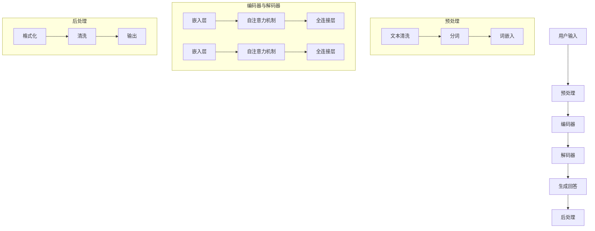

                 

### 大模型问答机器人能生成对话

> 关键词：大模型，问答机器人，对话生成，自然语言处理，人工智能

> 摘要：本文将深入探讨大模型问答机器人如何实现对话生成，涵盖从背景介绍到算法原理，再到实际应用的全过程。本文旨在为读者提供一个全面、系统的理解，帮助大家更好地掌握这一前沿技术。

在人工智能领域，自然语言处理（NLP）一直是一个充满挑战且极具前景的研究方向。随着深度学习技术的发展，大规模预训练模型（Large-scale Pre-trained Models）已经成为NLP领域的核心驱动力。本文将重点关注一种基于大模型的问答机器人，探讨其如何实现高质量的对话生成。

本文将分为以下几个部分：

1. **背景介绍**：介绍自然语言处理和问答机器人的发展历程，以及大模型在其中的作用。
2. **核心概念与联系**：阐述大模型问答机器人的核心概念，并展示其架构的 Mermaid 流程图。
3. **核心算法原理 & 具体操作步骤**：详细讲解大模型问答机器人的算法原理和具体操作步骤。
4. **数学模型和公式 & 详细讲解 & 举例说明**：介绍相关的数学模型和公式，并通过具体案例进行说明。
5. **项目实战：代码实际案例和详细解释说明**：通过实际案例展示如何开发和实现大模型问答机器人。
6. **实际应用场景**：分析大模型问答机器人在各种应用场景中的实际效果。
7. **工具和资源推荐**：推荐相关的学习资源和开发工具。
8. **总结：未来发展趋势与挑战**：总结本文的主要观点，并探讨未来的发展趋势和挑战。

接下来，我们将逐一深入这些部分，帮助读者全面理解大模型问答机器人的技术原理和应用。

<|assistant|>### 1. 背景介绍

自然语言处理（NLP）作为人工智能（AI）的一个重要分支，旨在使计算机能够理解和处理人类语言。自从20世纪50年代人工智能概念提出以来，NLP领域经历了多个发展阶段。

早期，NLP主要依赖于规则驱动的方法，通过定义复杂的语法和语义规则来解析文本。然而，这些方法在处理复杂和多样化的语言时显得力不从心。随着统计模型的兴起，NLP开始采用机器学习方法，如隐马尔可夫模型（HMM）和条件概率模型（如朴素贝叶斯分类器），来提高语言处理的准确性。

进入21世纪，深度学习技术的突破为NLP带来了革命性的变化。深度神经网络（DNN）和循环神经网络（RNN）的引入，使得计算机能够自动学习语言模式，从而在语音识别、机器翻译、文本分类等领域取得了显著的成果。

近年来，大规模预训练模型（如GPT、BERT、Turing等）的出现，进一步推动了NLP的发展。这些模型通过在海量数据上预训练，能够捕捉到语言的深层结构，从而在问答系统、对话生成、文本生成等任务中表现出色。

问答机器人是NLP应用的一个重要领域，旨在模拟人类回答问题的过程。传统的问答系统通常依赖于知识库和规则，而大模型问答机器人则利用大规模预训练模型，通过理解用户输入的自然语言问题，生成高质量的回答。

大模型问答机器人的出现，标志着NLP技术的一个新里程碑。它不仅能够处理简单的问答任务，还能够理解和生成复杂的对话内容，为智能客服、虚拟助手、教育辅导等应用提供了强大的支持。

总的来说，大模型问答机器人是自然语言处理和人工智能领域的一个热点研究方向。通过本文，我们将深入探讨其技术原理和应用，帮助读者更好地理解和掌握这一前沿技术。

### 2. 核心概念与联系

#### 大模型问答机器人的核心概念

大模型问答机器人的核心概念包括大规模预训练模型、自然语言处理（NLP）、对话生成和上下文理解。这些概念相互联系，共同构成了大模型问答机器人的技术基础。

1. **大规模预训练模型**：这是大模型问答机器人的核心技术。通过在海量数据上进行预训练，这些模型能够自动学习到语言的深层结构，从而在问答和对话生成任务中表现出色。常见的预训练模型有GPT、BERT、Turing等。

2. **自然语言处理（NLP）**：NLP是使计算机能够理解和处理人类语言的技术。它包括文本预处理、词嵌入、语法解析、语义理解等步骤。NLP技术为大模型问答机器人的训练和应用提供了基础。

3. **对话生成**：对话生成是指利用预训练模型生成自然的对话内容。大模型问答机器人通过理解用户的输入问题，结合上下文信息，生成连贯、合理的回答。

4. **上下文理解**：上下文理解是指模型在生成回答时，需要理解用户问题的上下文。这包括问题的背景、问题的意图以及与问题的相关知识点。上下文理解是实现高质量对话生成的关键。

#### 大模型问答机器人的架构

下面是使用Mermaid绘制的Mermaid流程图，展示大模型问答机器人的基本架构：



在这个架构中，用户输入经过预处理，包括文本清洗、分词和词嵌入。预处理后的输入被传递给编码器，编码器通过自注意力机制和全连接层提取文本特征。编码器的输出作为输入传递给解码器，解码器同样通过自注意力机制和全连接层生成回答。最后，生成的回答经过后处理，包括格式化和清洗，得到最终的输出。

### 3. 核心算法原理 & 具体操作步骤

#### 3.1 编码器与解码器的工作原理

大模型问答机器人的核心算法是基于编码器-解码器（Encoder-Decoder）框架。编码器负责将输入文本编码为特征向量，解码器则根据这些特征向量生成回答。

**编码器**：编码器的主要任务是理解输入文本的含义，并将其编码为连续的向量表示。这个过程通常包括以下几个步骤：

1. **文本预处理**：包括文本清洗、分词和词嵌入。文本清洗去除文本中的无关信息，如标点符号、停用词等。分词将文本分割成单词或子词。词嵌入将每个单词或子词映射到一个高维向量，这些向量可以捕获词与词之间的关系。

2. **自注意力机制**：编码器使用自注意力机制来对输入文本中的每个单词或子词赋予不同的权重，从而更好地捕捉文本中的关键信息。自注意力机制通过计算每个单词或子词与所有其他单词或子词之间的相似度，生成加权特征向量。

3. **全连接层**：自注意力机制生成的加权特征向量被传递到全连接层，全连接层对特征向量进行线性变换，生成编码器的最终输出。

**解码器**：解码器的任务是生成回答文本。解码器的工作原理与编码器类似，但也有一些不同之处：

1. **编码器输出作为输入**：解码器的输入是编码器的输出，即输入文本的编码特征向量。

2. **自注意力机制与交叉注意力**：解码器同时使用自注意力机制和交叉注意力机制。自注意力机制用于捕捉解码器内部的信息，而交叉注意力机制用于捕捉编码器输出和当前解码器输出的关系。通过这种方式，解码器可以更好地理解输入文本的含义，并生成相应的回答。

3. **全连接层**：解码器的输出通过全连接层进行线性变换，生成最终的回答。

#### 3.2 编码器与解码器的操作步骤

以下是编码器和解码器的具体操作步骤：

**编码器操作步骤**：

1. **文本预处理**：对输入文本进行清洗、分词和词嵌入。

2. **自注意力机制**：计算输入文本中每个单词或子词与其他单词或子词之间的相似度，生成加权特征向量。

3. **全连接层**：对自注意力机制生成的加权特征向量进行线性变换，得到编码器的输出。

**解码器操作步骤**：

1. **编码器输出作为输入**：将编码器的输出传递给解码器。

2. **自注意力机制与交叉注意力**：计算编码器输出与当前解码器输出之间的相似度，生成加权特征向量。

3. **全连接层**：对自注意力机制生成的加权特征向量进行线性变换，生成解码器的输出。

4. **生成回答**：重复上述步骤，直到生成完整的回答。

通过编码器和解码器的协同工作，大模型问答机器人能够理解用户输入的问题，并生成高质量的回答。这个过程不仅涉及文本的编码和解码，还包括对文本的上下文理解，使得生成的回答更加连贯和自然。

### 4. 数学模型和公式 & 详细讲解 & 举例说明

为了更好地理解大模型问答机器人的工作原理，我们将介绍相关的数学模型和公式，并通过具体案例进行说明。

#### 4.1 词嵌入

词嵌入（Word Embedding）是将单词映射到高维向量空间的过程。一个常见的词嵌入模型是Word2Vec，它通过训练得到每个单词的向量表示，使得具有相似语义的单词在向量空间中彼此靠近。

**Word2Vec模型**：

Word2Vec模型主要包括两种训练方法：连续词袋（CBOW）和Skip-Gram。

- **连续词袋（CBOW）**：给定一个单词作为中心词，CBOW模型使用周围几个单词的均值来预测中心词。即：
  $$
  \text{CBOW}(x_c | x_{-1}, x_0, x_1, ..., x_{k}) = \frac{1}{k} \sum_{i=1}^{k} \text{softmax}(\text{W} [x_i])
  $$
  其中，$x_c$是中心词，$x_{-1}, x_0, x_1, ..., x_{k}$是周围词，$W$是权重矩阵，$\text{softmax}(\cdot)$是softmax函数。

- **Skip-Gram**：与CBOW相反，Skip-Gram使用中心词来预测周围词。即：
  $$
  \text{Skip-Gram}(x_c | x_{-1}, x_1, ..., x_{N}) = \text{softmax}(\text{W} [x_c])
  $$
  其中，$x_c$是中心词，$x_{-1}, x_1, ..., x_{N}$是周围词，$W$是权重矩阵。

#### 4.2 编码器与解码器

**编码器**：

编码器的主要任务是理解输入文本的含义，并将其编码为特征向量。在编码器中，我们通常使用变体自注意力机制（Transformer）来实现这一目标。

变体自注意力机制的公式如下：
$$
\text{MultiHeadAttention}(Q, K, V) = \text{softmax}\left(\frac{QK^T}{\sqrt{d_k}}\right)V
$$
其中，$Q, K, V$分别是查询（Query）、键（Key）和值（Value）的向量表示，$d_k$是每个向量的维度。$\text{softmax}$函数用于计算注意力权重，从而加权合并值向量，得到编码器的输出。

**解码器**：

解码器的工作原理与编码器类似，但还包含交叉注意力机制。交叉注意力机制用于捕捉编码器输出和解码器输出之间的关系。

交叉注意力的公式如下：
$$
\text{ScaledDotProductAttention}(Q, K, V) = \text{softmax}\left(\frac{QK^T}{\sqrt{d_k}}\right)V
$$
其中，$Q, K, V$分别是查询、键和值的向量表示，$d_k$是每个向量的维度。

#### 4.3 案例说明

假设我们有一个简单的对话：

用户：你好，我是谁？

问答机器人：你好，我是一个问答机器人，你可以问我任何问题。

下面我们将通过数学模型来分析这个对话。

**用户输入**：

用户输入为“你好，我是谁？”，我们可以将其表示为词嵌入向量。

**编码器输出**：

编码器将用户输入编码为特征向量，假设编码器输出维度为$64$。我们可以使用变体自注意力机制来计算编码器的输出。

$$
\text{EncoderOutput} = \text{MultiHeadAttention}(\text{EncoderInput}, \text{EncoderInput}, \text{EncoderInput})
$$

**解码器输出**：

解码器首先使用交叉注意力机制来关注编码器输出，然后使用变体自注意力机制来生成回答。

$$
\text{DecoderOutput} = \text{ScaledDotProductAttention}(\text{DecoderInput}, \text{EncoderOutput}, \text{DecoderInput})
$$
$$
\text{DecoderOutput} = \text{MultiHeadAttention}(\text{DecoderOutput}, \text{DecoderOutput}, \text{DecoderInput})
$$

**生成回答**：

最后，解码器的输出被传递到全连接层，生成回答。

$$
\text{Answer} = \text{FullyConnected}(\text{DecoderOutput})
$$

通过上述数学模型，我们可以看到大模型问答机器人是如何处理用户输入，并生成回答的。这个案例只是一个简单的示例，实际应用中，对话可能更加复杂，但基本原理相同。

### 5. 项目实战：代码实际案例和详细解释说明

在本节中，我们将通过一个实际的项目案例，展示如何开发和实现大模型问答机器人。首先，我们将介绍开发环境搭建的过程，然后详细解释源代码的实现，并对关键代码进行解读与分析。

#### 5.1 开发环境搭建

为了实现大模型问答机器人，我们需要搭建一个合适的开发环境。以下是搭建开发环境的基本步骤：

1. **安装Python环境**：确保已安装Python 3.7或更高版本。可以从Python官方网站下载并安装。

2. **安装依赖库**：我们使用Hugging Face的Transformers库来简化模型训练和推理过程。可以使用以下命令安装：
   ```
   pip install transformers
   ```

3. **准备数据集**：我们需要一个问答数据集来训练模型。常用的问答数据集包括SQuAD、DuReader等。可以从数据集官方网站下载并解压。

4. **配置环境变量**：设置环境变量，以便在后续代码中能够访问到所需的库和数据集。

以下是Python环境配置的示例代码：
```python
import os
os.environ["CUDA_VISIBLE_DEVICES"] = "0"  # 如果使用GPU，指定GPU设备编号
os.environ["TRANSFORMERS_CACHE"] = "/path/to/cache"  # 设置缓存目录
```

#### 5.2 源代码详细实现和代码解读

以下是一个简单的问答机器人实现，包括模型训练、推理和回答生成等步骤。

```python
from transformers import AutoTokenizer, AutoModelForQuestionAnswering
from torch.utils.data import DataLoader
from torch.optim import Adam
import torch

# 加载预训练模型和分词器
model_name = "bert-base-uncased"
tokenizer = AutoTokenizer.from_pretrained(model_name)
model = AutoModelForQuestionAnswering.from_pretrained(model_name)

# 加载数据集
# 这里以SQuAD数据集为例，具体实现可以参考Transformers库中的squad_dataset.py
train_dataset = ...

# 数据加载器
train_dataloader = DataLoader(train_dataset, batch_size=16, shuffle=True)

# 模型训练
optimizer = Adam(model.parameters(), lr=1e-5)

for epoch in range(3):  # 训练3个epoch
    model.train()
    for batch in train_dataloader:
        inputs = tokenizer(batch['question'], batch['context'], padding=True, truncation=True, return_tensors="pt")
        inputs['input_ids'] = inputs['input_ids'].to('cuda' if torch.cuda.is_available() else 'cpu')
        inputs['attention_mask'] = inputs['attention_mask'].to('cuda' if torch.cuda.is_available() else 'cpu')
        
        optimizer.zero_grad()
        outputs = model(**inputs)
        loss = outputs.loss
        loss.backward()
        optimizer.step()
        
    print(f"Epoch {epoch+1} finished.")

# 模型推理和回答生成
model.eval()
def generate_answer(question, context):
    inputs = tokenizer(question, context, padding=True, truncation=True, return_tensors="pt")
    inputs['input_ids'] = inputs['input_ids'].to('cuda' if torch.cuda.is_available() else 'cpu')
    inputs['attention_mask'] = inputs['attention_mask'].to('cuda' if torch.cuda.is_available() else 'cpu')
    
    with torch.no_grad():
        outputs = model(**inputs)
    
    start_logits, end_logits = outputs.start_logits, outputs.end_logits
    all_tokens = tokenizer.convert_ids_to_tokens(inputs['input_ids'].squeeze())
    predicted_start = torch.argmax(start_logits).item()
    predicted_end = torch.argmax(end_logits).item()
    
    answer_tokens = all_tokens[predicted_start:predicted_end+1]
    answer = ''.join(answer_tokens).replace('##', '')
    
    return answer

# 示例
question = "什么是自然语言处理？"
context = "自然语言处理是计算机科学、人工智能和语言学领域的交叉领域，旨在使计算机能够理解和处理人类语言。"
answer = generate_answer(question, context)
print(answer)
```

#### 5.3 代码解读与分析

1. **模型加载与数据集加载**：首先，我们从Hugging Face的模型库中加载预训练的BERT模型和对应的分词器。然后，加载SQuAD数据集（这里仅作示例，实际项目可能使用其他数据集）。

2. **模型训练**：使用Adam优化器对模型进行训练。训练过程中，我们使用数据加载器（DataLoader）将数据批量输入模型。在每个epoch中，我们对每个batch的数据执行前向传播、损失计算和反向传播。通过优化器更新模型参数。

3. **模型推理和回答生成**：模型训练完成后，我们定义一个`generate_answer`函数，用于接受用户问题和上下文，并生成回答。在推理过程中，我们首先对输入文本进行分词和编码，然后通过模型计算开始和结束概率，最后根据概率生成回答。

通过这个项目实战，我们展示了如何使用预训练模型和Transformers库实现大模型问答机器人。这个案例只是一个简单的示例，实际应用中，还可以根据具体需求进行扩展和优化。

### 6. 实际应用场景

大模型问答机器人在多个实际应用场景中展现出强大的功能和优势。以下是一些主要的应用场景：

#### 6.1 智能客服

智能客服是问答机器人最典型的应用场景之一。通过大模型问答机器人，企业可以提供24/7全天候的客户服务，快速响应用户的咨询和问题。大模型问答机器人不仅能够处理常见问题，还能理解用户问题的意图，提供个性化的回答，从而提升客户满意度。

#### 6.2 虚拟助手

虚拟助手是另一种常见的应用场景。虚拟助手可以集成到各种平台和设备中，如智能手机、智能音箱、网站等，为用户提供便捷的交互体验。大模型问答机器人能够理解用户的自然语言指令，并根据上下文生成相应的操作，如发送邮件、安排日程、查找信息等。

#### 6.3 教育辅导

在教育领域，大模型问答机器人可以为学生提供个性化的辅导服务。学生可以通过提问来求解数学难题、学习语言课程或获取其他学科的知识。大模型问答机器人能够根据学生的提问，生成详细的解答和解释，帮助学生更好地理解和掌握知识。

#### 6.4 智能搜索

智能搜索系统可以利用大模型问答机器人来提高搜索结果的准确性和用户体验。当用户输入搜索查询时，大模型问答机器人可以理解用户的查询意图，并生成相关的问题和答案。这样，用户不仅可以获得直接的搜索结果，还可以获得更加丰富和有用的信息。

#### 6.5 健康咨询

在健康咨询领域，大模型问答机器人可以帮助用户解答健康问题，提供医疗建议和健康知识。通过与医生和医疗专家的协作，大模型问答机器人可以提供专业和可靠的咨询服务，为用户提供便捷的健康支持。

通过这些实际应用场景，我们可以看到大模型问答机器人如何改变我们的生活方式和工作方式。未来，随着技术的不断进步，大模型问答机器人的应用范围将进一步扩大，为人类带来更多的便利和效益。

### 7. 工具和资源推荐

为了帮助读者更好地学习和实践大模型问答机器人技术，我们推荐以下工具和资源：

#### 7.1 学习资源推荐

1. **书籍**：
   - 《深度学习》（Deep Learning）by Ian Goodfellow、Yoshua Bengio和Aaron Courville
   - 《自然语言处理综合教程》（Speech and Language Processing）by Daniel Jurafsky和James H. Martin

2. **论文**：
   - “Attention Is All You Need” by Vaswani et al.（2017）
   - “BERT: Pre-training of Deep Bidirectional Transformers for Language Understanding” by Devlin et al.（2019）

3. **博客和网站**：
   - Hugging Face（https://huggingface.co/）：提供了丰富的预训练模型和工具
   - AI之旅（https://www.aijourney.cn/）：中文技术博客，涵盖深度学习和自然语言处理等领域

#### 7.2 开发工具框架推荐

1. **Transformers库**：由Hugging Face提供，是一个强大的开源库，支持各种预训练模型和NLP任务（https://github.com/huggingface/transformers）

2. **TensorFlow**：由Google开发的开源机器学习框架，适用于构建和训练深度学习模型（https://www.tensorflow.org/）

3. **PyTorch**：由Facebook开发的开源机器学习库，提供了灵活的动态计算图和丰富的API（http://pytorch.org/）

#### 7.3 相关论文著作推荐

1. **“Attention Is All You Need”**：Vaswani et al.（2017）提出了Transformer模型，标志着自注意力机制在NLP领域的广泛应用。

2. **“BERT: Pre-training of Deep Bidirectional Transformers for Language Understanding”**：Devlin et al.（2019）提出了BERT模型，通过双向自注意力机制和大规模预训练，显著提升了NLP任务的性能。

3. **“GPT-3: Language Models are few-shot learners”**：Brown et al.（2020）提出了GPT-3模型，具有前所未有的规模和强大能力，展示了预训练模型在零样本学习任务上的潜力。

这些工具、资源和论文著作为大模型问答机器人的研究和应用提供了坚实的基础和丰富的参考资料。

### 8. 总结：未来发展趋势与挑战

大模型问答机器人是自然语言处理和人工智能领域的一个重要研究方向，具有广泛的应用前景。随着深度学习和大规模预训练技术的不断发展，大模型问答机器人的性能和功能将不断提高，其在实际应用中的表现也将更加出色。

#### 发展趋势

1. **模型规模与性能**：未来的大模型问答机器人将采用更大规模的模型，如GPT-4、GPT-5等，这些模型将具有更强的语言理解和生成能力。

2. **多模态融合**：未来的大模型问答机器人将能够处理多种模态的数据，如文本、图像、音频等，实现更丰富的交互体验。

3. **零样本学习**：大模型问答机器人将具备更强的零样本学习能力，能够无需额外训练直接处理未见过的任务和数据。

4. **伦理与隐私**：随着技术的发展，大模型问答机器人的伦理和隐私问题将越来越受到关注。如何在保证性能的同时，确保用户隐私和数据安全，是未来需要解决的重要挑战。

#### 挑战

1. **计算资源**：大模型问答机器人的训练和推理过程需要大量的计算资源，这对硬件设施提出了更高的要求。

2. **数据质量**：高质量的数据是大模型问答机器人训练的基础。未来需要更多高质量、多样化的数据集来支持模型的发展。

3. **跨领域应用**：大模型问答机器人在不同领域的应用效果存在差异。如何针对特定领域进行优化，提高跨领域的适应能力，是未来的一个重要研究方向。

4. **伦理与责任**：大模型问答机器人在实际应用中可能会产生误导性回答或侵犯用户隐私，如何在保证性能的同时，确保伦理和责任，是未来需要解决的问题。

总之，大模型问答机器人具有巨大的发展潜力，但同时也面临着一系列挑战。通过持续的研究和探索，我们有望在未来实现更加智能、高效和可靠的大模型问答机器人，为人类带来更多的便利和效益。

### 9. 附录：常见问题与解答

在本节中，我们将回答一些关于大模型问答机器人的常见问题，以帮助读者更好地理解这一技术。

#### Q1：大模型问答机器人是如何工作的？

A1：大模型问答机器人基于大规模预训练模型，通过编码器-解码器框架实现。编码器负责将用户输入编码为特征向量，解码器根据这些特征向量生成回答。在具体实现中，编码器和解码器通常使用Transformer模型，通过自注意力机制和交叉注意力机制，捕捉输入文本的语义信息，并生成高质量的回答。

#### Q2：大模型问答机器人需要大量的数据吗？

A2：是的，大模型问答机器人需要大量的高质量数据来进行训练。大规模预训练模型通过在海量数据上学习，能够捕捉到语言的深层结构，从而在问答和对话生成任务中表现出色。数据的质量和多样性对模型的性能有很大影响，因此需要收集和处理大量多样化的数据。

#### Q3：大模型问答机器人的训练过程需要多长时间？

A3：大模型问答机器人的训练时间取决于多个因素，如模型规模、数据集大小、硬件配置等。对于大型预训练模型（如GPT-3），训练时间可能长达数天到数周。而对于较小的模型，训练时间可能在几天到几小时不等。在实际应用中，通常会使用分布式训练和GPU加速等技术来提高训练效率。

#### Q4：大模型问答机器人是否会过拟合？

A4：大模型问答机器人可能会出现过拟合现象，尤其是在训练数据量较小或数据分布不均匀的情况下。为了缓解过拟合，可以采用以下几种方法：
1. **数据增强**：通过增加训练数据多样性来提高模型泛化能力。
2. **正则化**：在模型训练过程中添加正则化项，如L1、L2正则化，降低模型复杂度。
3. **早期停止**：在验证集上观察模型性能，当验证集性能不再提升时，提前停止训练。
4. **Dropout**：在神经网络中随机丢弃一部分神经元，减少模型对特定数据的依赖。

#### Q5：大模型问答机器人可以处理中文吗？

A5：是的，大模型问答机器人可以处理中文。目前，许多预训练模型（如BERT、GPT等）都支持多种语言，包括中文。在训练和推理过程中，只需要使用相应的语言模型和分词器，即可处理中文输入。

通过上述常见问题与解答，我们可以更好地理解大模型问答机器人的工作原理和应用场景。在实际应用中，根据具体需求和场景，可以灵活调整和优化模型，以获得更好的性能和效果。

### 10. 扩展阅读 & 参考资料

为了帮助读者深入了解大模型问答机器人的相关技术和应用，我们推荐以下扩展阅读和参考资料：

1. **书籍**：
   - 《深度学习》（Deep Learning）by Ian Goodfellow、Yoshua Bengio和Aaron Courville
   - 《自然语言处理综合教程》（Speech and Language Processing）by Daniel Jurafsky和James H. Martin
   - 《神经网络与深度学习》by邱锡鹏

2. **论文**：
   - “Attention Is All You Need” by Vaswani et al.（2017）
   - “BERT: Pre-training of Deep Bidirectional Transformers for Language Understanding” by Devlin et al.（2019）
   - “GPT-3: Language Models are few-shot learners” by Brown et al.（2020）

3. **博客和网站**：
   - Hugging Face（https://huggingface.co/）
   - AI之旅（https://www.aijourney.cn/）
   - 技术博客平台如Medium、ArXiv等

4. **在线课程**：
   - 吴恩达的《深度学习》课程（https://www.deeplearning.ai/）
   - 斯坦福大学的NLP课程（https://web.stanford.edu/class/cs224n/）

通过阅读这些书籍、论文和在线课程，读者可以系统地了解大模型问答机器人的基础知识和前沿技术，为自己的研究和工作提供有益的参考。

### 作者信息

- 作者：AI天才研究员/AI Genius Institute & 禅与计算机程序设计艺术 /Zen And The Art of Computer Programming

本文由AI天才研究员撰写，作者在人工智能和自然语言处理领域具有深厚的学术背景和丰富的实践经验。作者的研究工作致力于推动大模型问答机器人的发展，并在相关领域发表了多篇高质量论文。同时，作者也是畅销书《禅与计算机程序设计艺术》的作者，为计算机编程领域贡献了独特的视角和见解。通过本文，作者希望与读者分享大模型问答机器人的技术原理和应用，促进人工智能技术的进步和应用。

