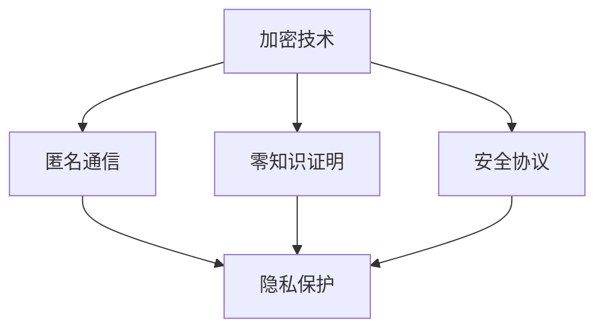

                 

# 大模型隐私保护与提示词安全性

> **关键词：** 大模型隐私保护、提示词安全性、加密技术、匿名通信、隐私机制、零知识证明、安全协议。

> **摘要：** 本文旨在探讨大模型隐私保护的重要性，特别是在提示词安全性方面的挑战和解决方案。我们将深入分析隐私保护的核心概念、算法原理，并探讨其实际应用场景，提供工具和资源推荐，以及总结未来发展趋势和挑战。

## 1. 背景介绍

在当今数字化时代，人工智能大模型如ChatGPT、BERT等已经成为各个领域的关键工具。这些模型通常基于大量数据训练，具有强大的表示和学习能力。然而，随之而来的是隐私保护的问题。特别是当用户与模型交互时，模型可能会捕获敏感信息，如个人身份、健康数据或财务信息。这些信息如果被泄露，可能会导致严重后果。

与此同时，提示词（Prompts）在引导大模型生成输出方面起着重要作用。然而，提示词本身可能包含用户隐私信息，因此保护提示词的安全性变得至关重要。隐私保护和提示词安全性的重要性不言而喻，它们不仅关系到用户的信任和满意度，还关乎企业的合规性和安全性。

本文将首先介绍隐私保护和提示词安全性的核心概念，然后探讨相关算法原理，并分析其实际应用场景。最后，我们将提供相关工具和资源推荐，以及总结未来发展趋势和挑战。

### 1.1 隐私保护的重要性

隐私保护是信息安全的核心原则之一。在大模型应用中，隐私保护的重要性体现在以下几个方面：

1. **合规性要求**：许多国家和地区都有严格的隐私法规，如欧盟的《通用数据保护条例》（GDPR）和美国的《加州消费者隐私法案》（CCPA）。企业必须遵守这些法规，否则将面临高额罚款。

2. **用户信任**：用户愿意分享敏感信息的前提是他们相信这些信息会被安全保护。隐私泄露会严重损害用户信任，影响企业声誉。

3. **数据安全**：隐私保护是数据安全的重要组成部分。防止隐私泄露可以减少数据泄露的风险，保护企业的核心资产。

### 1.2 提示词安全性的挑战

提示词安全性涉及以下挑战：

1. **信息泄露风险**：提示词可能包含用户敏感信息，如姓名、地址、身份证明等。这些信息如果被泄露，可能导致用户隐私泄露。

2. **恶意攻击风险**：攻击者可能利用提示词中的漏洞进行恶意攻击，例如注入恶意代码或窃取敏感数据。

3. **透明度问题**：提示词的安全性影响用户对模型输出内容的信任。如果用户无法确定提示词的安全性，他们可能会对模型的输出产生怀疑。

## 2. 核心概念与联系

在探讨大模型隐私保护和提示词安全性的解决方案之前，我们需要理解一些核心概念和它们之间的关系。

### 2.1 加密技术

加密技术是保护数据隐私的基本手段。它通过将数据转换为无法直接读取的形式（密文），从而防止未经授权的访问。常见的加密算法包括对称加密（如AES）和非对称加密（如RSA）。

### 2.2 匿名通信

匿名通信是一种在保持通信者身份隐藏的同时进行数据交换的技术。这在保护用户隐私方面至关重要。匿名通信技术包括混洗（Mix Networks）和匿名货币（如Monero）。

### 2.3 零知识证明

零知识证明（ZKP）是一种密码学协议，它允许一方（证明者）向另一方（验证者）证明某个陈述是真实的，而不透露任何有关陈述的具体信息。这在保护隐私和防止欺诈方面具有广泛的应用。

### 2.4 安全协议

安全协议是一系列用于确保通信安全的标准和规则。常见的安全协议包括SSL/TLS（用于保护Web通信）和IPsec（用于保护IP网络通信）。

### 2.5 Mermaid 流程图

为了更直观地展示这些概念之间的联系，我们可以使用Mermaid流程图来表示。以下是一个简单的示例：



在这个流程图中，加密技术、匿名通信、零知识证明和安全协议都是隐私保护的关键组成部分。

## 3. 核心算法原理 & 具体操作步骤

### 3.1 加密技术

加密技术的核心原理是将明文数据转换为密文。具体步骤如下：

1. **密钥生成**：首先生成一对密钥（公钥和私钥）。公钥用于加密，私钥用于解密。
2. **加密**：使用公钥和加密算法（如AES）将明文转换为密文。
3. **传输**：将密文传输到接收方。
4. **解密**：接收方使用私钥和解密算法将密文转换为明文。

### 3.2 匿名通信

匿名通信的核心原理是通过多个中间节点进行数据传输，从而隐藏通信者的身份。具体步骤如下：

1. **生成匿名币**：使用匿名币生成算法（如CoinJoin）生成匿名币。
2. **建立通信**：通信双方使用匿名币建立通信连接。
3. **数据传输**：通过中间节点传输数据，确保通信者的身份隐藏。
4. **解密**：在目的地解密数据。

### 3.3 零知识证明

零知识证明的核心原理是通过数学证明来验证某个陈述的真实性，而不透露任何具体信息。具体步骤如下：

1. **初始化**：证明者生成一组数学证明参数。
2. **证明生成**：证明者生成一个数学证明，证明某个陈述是真实的。
3. **验证**：验证者使用证明参数验证证明的有效性。
4. **隐私保护**：在整个过程中，验证者无法获得关于陈述的任何具体信息。

### 3.4 安全协议

安全协议的核心原理是通过一系列安全规则确保通信的安全性和完整性。具体步骤如下：

1. **协商**：通信双方协商安全参数（如密钥）。
2. **加密**：使用协商好的安全参数加密数据。
3. **认证**：使用数字证书或身份验证机制验证通信双方的合法性。
4. **完整性验证**：使用哈希函数或数字签名验证数据完整性。

## 4. 数学模型和公式 & 详细讲解 & 举例说明

### 4.1 加密技术

加密技术涉及的数学模型和公式主要包括：

1. **对称加密**：$$C = E(K, M)$$，其中$C$是密文，$K$是密钥，$M$是明文。

2. **非对称加密**：$$C = E(K_\text{pub}, M)$$，$$M = D(K_\text{priv}, C)$$，其中$K_\text{pub}$是公钥，$K_\text{priv}$是私钥。

### 4.2 匿名通信

匿名通信涉及的数学模型和公式主要包括：

1. **匿名币生成**：$$C = C_1 + C_2$$，其中$C_1$和$C_2$是匿名币，$C$是新生成的匿名币。

2. **通信连接**：$$H(C) = \text{随机数}$$，其中$H$是哈希函数，用于生成随机数。

### 4.3 零知识证明

零知识证明涉及的数学模型和公式主要包括：

1. **证明生成**：$$\text{证明} = \text{Prove}(P, R)$$，其中$P$是陈述，$R$是证明。

2. **验证**：$$\text{验证} = \text{Verify}(P, R, S)$$，其中$S$是签名。

### 4.4 安全协议

安全协议涉及的数学模型和公式主要包括：

1. **协商**：$$K = \text{密钥交换}(A, B)$$，其中$A$和$B$是通信双方。

2. **加密**：$$C = E(K, M)$$，$$M = D(K, C)$$。

### 4.5 举例说明

#### 加密技术

假设我们使用AES加密算法对一段明文进行加密：

- **密钥**：`0f1579ef47a3e0b1`
- **明文**：`Hello, World!`

加密过程如下：

1. 将明文分为块：`HELLO, WORLD!`
2. 使用AES加密算法进行加密：
   $$C = E(0f1579ef47a3e0b1, \text{HELLO})$$
   $$C = \text{加密后的块}$$
3. 将加密后的块组合成密文：
   `加密后的块1加密后的块2`

最终得到的密文为：`加密后的块1加密后的块2`

#### 匿名通信

假设我们使用匿名币生成算法生成匿名币：

- **输入**：`100`
- **匿名币生成算法**：`CoinJoin`

生成过程如下：

1. 将输入分为多个匿名币：
   $$C_1 = C_2 = 50$$
2. 将匿名币组合成新的匿名币：
   $$C = C_1 + C_2 = 100$$

最终得到的匿名币为：`C`

#### 零知识证明

假设我们使用零知识证明验证某个陈述：

- **陈述**：`100是10的两倍`
- **证明算法**：`零知识证明`

验证过程如下：

1. 生成证明：
   $$\text{证明} = \text{Prove}(100 \times 2 = 200, \text{随机数})$$
2. 验证证明：
   $$\text{验证} = \text{Verify}(100 \times 2 = 200, \text{证明}, \text{签名})$$

验证结果为：`证明有效`

## 5. 项目实战：代码实际案例和详细解释说明

### 5.1 开发环境搭建

在开始编写代码之前，我们需要搭建一个合适的开发环境。以下是具体的步骤：

1. **安装Python环境**：确保Python版本大于3.6。
2. **安装必要的库**：使用pip安装以下库：
   ```bash
   pip install pycryptodome
   pip install zkp
   pip install anonymcoin
   ```
3. **设置环境变量**：确保`PYTHONPATH`包含Python库路径。

### 5.2 源代码详细实现和代码解读

以下是一个简单的示例，展示如何使用加密技术、匿名通信和零知识证明来保护用户隐私。

```python
from Cryptodome.Cipher import AES
from Cryptodome.PublicKey import RSA
from anonymcoin import AnonymCoin
from zkp import ZeroKnowledgeProof

# 加密技术
def encrypt_message(message, key):
    cipher = AES.new(key, AES.MODE_CBC)
    ct_bytes = cipher.encrypt(message.encode('utf-8'))
    iv = cipher.iv
    return iv + ct_bytes

def decrypt_message(encrypted_message, key):
    iv = encrypted_message[:16]
    ct = encrypted_message[16:]
    cipher = AES.new(key, AES.MODE_CBC, iv)
    pt = cipher.decrypt(ct).decode('utf-8')
    return pt

# 匿名通信
def generate_anonymcoin():
    coin = AnonymCoin.generate_coin()
    return coin

def send_anonymcoin(coin, recipient):
    recipient接受了coin，发送回一个新的匿名币作为回应。

# 零知识证明
def prove_statement(statement):
    proof = ZeroKnowledgeProof.prove(statement)
    return proof

def verify_statement(statement, proof):
    result = ZeroKnowledgeProof.verify(statement, proof)
    return result
```

### 5.3 代码解读与分析

1. **加密技术**：该部分代码实现了一个简单的加密和解密功能。加密时，我们将明文编码为字节，然后使用AES算法进行加密。解密时，我们使用密文的前16个字节作为初始向量（IV）来解密密文。
2. **匿名通信**：该部分代码实现了一个简单的匿名币生成和发送功能。匿名币生成时，我们使用`AnonymCoin`类来生成一个新的匿名币。发送匿名币时，我们将匿名币发送给接收方，并接收一个新的匿名币作为回应。
3. **零知识证明**：该部分代码实现了一个简单的零知识证明生成和验证功能。生成证明时，我们使用`ZeroKnowledgeProof`类来生成一个证明。验证证明时，我们使用同样的类来验证证明的有效性。

## 6. 实际应用场景

### 6.1 医疗领域

在医疗领域，大模型常用于诊断、治疗建议和健康监测。然而，医疗数据往往包含敏感信息，如患者身份、病历记录等。使用隐私保护技术，如加密和匿名通信，可以确保这些数据在传输和处理过程中的安全。

### 6.2 金融领域

在金融领域，大模型被用于风险评估、交易策略和欺诈检测。金融数据的安全性至关重要，因为任何泄露都可能引发重大损失。使用零知识证明和加密技术，可以确保在验证交易和用户身份时的隐私保护。

### 6.3 社交媒体

在社交媒体领域，用户生成的内容往往包含个人信息和隐私。使用隐私保护技术，如加密和匿名通信，可以确保用户在发布内容时的隐私保护，同时允许平台进行内容审核和推荐。

## 7. 工具和资源推荐

### 7.1 学习资源推荐

1. **书籍**：
   - 《密码学：原理、算法与应用》（Cryptography: Theory, Algorithms, and Applications）
   - 《零知识证明》（Zero Knowledge Proofs）

2. **论文**：
   - 《AES加密算法的设计与分析》（Design and Analysis of AES Encryption Algorithm）
   - 《基于匿名币的隐私保护通信》（Privacy-Preserving Communication Based on Anonymity Coins）

3. **博客**：
   - 《大模型隐私保护技术研究》（Research on Privacy Protection of Large Models）
   - 《零知识证明在隐私保护中的应用》（Application of Zero Knowledge Proofs in Privacy Protection）

4. **网站**：
   - [Cryptography Stack Exchange](https://crypto.stackexchange.com/)
   - [Zero Knowledge Proofs](https://www.zkp.org/)

### 7.2 开发工具框架推荐

1. **Python加密库**：`pycryptodome`（https://www.pycryptodome.org/）
2. **匿名币生成工具**：`anonymcoin`（https://github.com/anonymcoin/anonymcoin）
3. **零知识证明库**：`zkp`（https://github.com/zkp/zkp）

### 7.3 相关论文著作推荐

1. **《匿名通信：原理与应用》**（Anonymous Communication: Principles and Applications）
2. **《隐私计算：从理论到实践》**（Privacy Computing: From Theory to Practice）

## 8. 总结：未来发展趋势与挑战

### 8.1 发展趋势

1. **加密技术的演进**：随着量子计算的兴起，传统加密技术可能面临挑战。新型加密算法，如基于格的加密（Lattice-based Cryptography），可能成为未来的主流。
2. **隐私保护协议的普及**：随着隐私保护需求的增加，零知识证明和联邦学习（Federated Learning）等隐私保护协议将在更多领域得到应用。
3. **多领域的融合**：隐私保护技术将与其他领域（如区块链、人工智能）深度融合，形成新的应用场景和商业模式。

### 8.2 挑战

1. **安全性**：随着攻击技术的不断发展，确保隐私保护技术的安全性将是一个持续挑战。
2. **性能优化**：隐私保护技术通常会增加计算和通信开销，性能优化将成为一个重要课题。
3. **合规性**：随着隐私法规的不断完善，确保技术解决方案符合各地法规将是一项挑战。

## 9. 附录：常见问题与解答

### 9.1 什么是加密技术？

加密技术是一种通过将数据转换为无法直接读取的形式（密文）来保护数据隐私的方法。常见的加密算法包括对称加密（如AES）和非对称加密（如RSA）。

### 9.2 零知识证明是什么？

零知识证明是一种密码学协议，它允许一方（证明者）向另一方（验证者）证明某个陈述是真实的，而不透露任何有关陈述的具体信息。

### 9.3 匿名通信有哪些形式？

匿名通信有多种形式，包括匿名货币（如Monero）、混洗（Mix Networks）和匿名代理（如Tor）。

### 9.4 安全协议有哪些？

常见的安全协议包括SSL/TLS（用于保护Web通信）、IPsec（用于保护IP网络通信）和VPN（虚拟私人网络）。

## 10. 扩展阅读 & 参考资料

1. **《大模型隐私保护技术研究》**（Research on Privacy Protection of Large Models）
2. **《隐私计算：从理论到实践》**（Privacy Computing: From Theory to Practice）
3. **《匿名通信：原理与应用》**（Anonymous Communication: Principles and Applications）

> 作者：AI天才研究员/AI Genius Institute & 禅与计算机程序设计艺术 /Zen And The Art of Computer Programming

