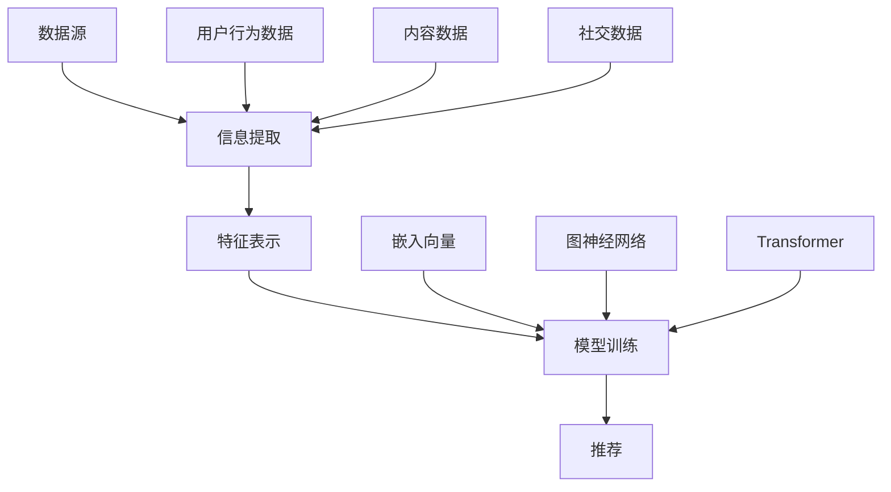

                 

## 背景介绍

随着互联网的快速发展，推荐系统已成为现代信息检索和个性化服务的关键组成部分。从简单的基于内容的推荐到复杂的协同过滤算法，再到如今备受关注的大模型驱动的推荐系统，推荐系统技术不断演变和进步，以满足用户日益增长的个性化需求。然而，在实际应用中，推荐系统面临的一个重大挑战是多源信息集成的困难。

多源信息集成是指在推荐系统中整合来自多个数据源的信息，以提高推荐质量和效果。这些数据源可能包括用户行为数据、内容数据、社交数据等。然而，不同数据源的数据类型、结构和质量存在显著差异，这使得信息集成变得复杂。此外，传统推荐系统方法通常仅依赖于单一数据源或简单组合多个数据源，往往无法充分利用多源信息的潜力。

为了解决这一问题，近年来，大模型驱动的推荐系统逐渐成为研究热点。大模型，如深度神经网络、Transformer等，具有强大的表示和学习能力，可以有效地捕捉复杂的数据特征和用户行为模式。通过利用这些大模型，推荐系统可以从多源信息中提取更丰富的特征，从而提高推荐的准确性。

本文将深入探讨大模型驱动的推荐系统中多源信息集成的方法和技术。首先，我们将介绍多源信息集成的核心概念和挑战。接着，我们将分析大模型在多源信息集成中的作用和优势。随后，我们将详细讨论几种常见的大模型驱动多源信息集成方法，并对比它们的优劣。在此基础上，我们将介绍一些实际应用场景，展示多源信息集成在推荐系统中的实际效果。最后，我们将讨论当前研究的进展和未来发展趋势，为该领域的研究者提供一些有价值的启示。

通过本文的阅读，读者将能够了解大模型驱动的推荐系统中多源信息集成的原理、方法和应用，为未来的研究和实践提供参考。

### 核心概念与联系

在深入探讨大模型驱动的推荐系统中多源信息集成的技术之前，我们首先需要明确一些核心概念和它们之间的联系。这些概念包括数据源、信息提取、特征表示和模型训练，它们共同构成了推荐系统的基石。

#### 数据源

数据源是推荐系统中最基本的组成部分，它们可以是用户行为数据、内容数据、社交数据等。用户行为数据包括用户的点击、购买、评论等行为信息，反映了用户的兴趣和需求。内容数据则描述了推荐系统中的各种实体，如商品、文章、视频等，通常包括标题、标签、描述等属性。社交数据则记录了用户之间的关系，如好友、点赞、分享等，可以用于探索用户的社交影响力。

#### 信息提取

信息提取是从原始数据中提取有用信息的过程。在多源信息集成中，信息提取是一个关键步骤，因为它决定了数据源中的信息如何被利用。常见的提取方法包括特征工程和自动化特征提取。特征工程是指通过手动设计特征，如用户的行为特征、时间特征、内容特征等，以提高模型性能。自动化特征提取则利用机器学习算法，如深度学习，从原始数据中自动学习特征表示。

#### 特征表示

特征表示是将提取到的信息转化为模型可以处理的形式。特征表示的质量对推荐系统的性能有着重要影响。在多源信息集成中，特征表示需要能够捕捉不同数据源之间的关联性。常见的特征表示方法包括嵌入向量、图神经网络和变换器（Transformer）模型。

#### 模型训练

模型训练是推荐系统的核心环节，它利用提取到的特征和训练数据来训练模型，从而学习到用户兴趣和内容的潜在关系。在多源信息集成中，模型训练需要考虑如何有效地整合来自多个数据源的特征，以提升推荐效果。常见的训练方法包括基于矩阵分解的协同过滤、基于深度学习的端到端模型等。

#### Mermaid 流程图

为了更直观地展示这些核心概念和它们之间的联系，我们使用Mermaid流程图进行说明。以下是一个简化的Mermaid流程图，描述了多源信息集成的基本流程：



在上图中，A代表数据源，B代表信息提取，C代表特征表示，D代表模型训练，E代表推荐。A1、A2和A3分别表示用户行为数据、内容数据和社交数据，它们是数据源的具体示例。C1、C2和C3分别表示嵌入向量、图神经网络和Transformer，它们是特征表示的具体方法。通过这种流程图，我们可以清晰地看到数据从数据源到推荐结果的全过程。

### 核心算法原理 & 具体操作步骤

在探讨大模型驱动的推荐系统中多源信息集成的核心算法原理之前，我们需要了解几个关键的概念：嵌入向量、图神经网络和Transformer模型。这些算法在多源信息集成中发挥着重要作用。

#### 嵌入向量

嵌入向量（Embedding）是一种将数据转换为稠密向量表示的技术，广泛用于自然语言处理、推荐系统和计算机视觉等领域。在推荐系统中，嵌入向量主要用于表示用户、商品和其他实体。通过将实体映射到高维空间中的低维向量，嵌入向量能够有效地捕捉实体之间的相似性。

**操作步骤：**

1. **数据预处理：** 首先，对用户和商品进行预处理，将它们映射到唯一的标识符。
2. **嵌入层设计：** 构建一个嵌入层，将输入的标识符映射到低维向量。这个嵌入层通常是一个全连接神经网络。
3. **训练：** 使用用户-商品交互数据训练嵌入层，优化向量表示，使其能够准确反映用户兴趣和商品特征。
4. **应用：** 在推荐过程中，将用户和商品的嵌入向量相乘或求和，以计算相似度得分，从而生成推荐列表。

#### 图神经网络

图神经网络（Graph Neural Network，GNN）是一种专门用于处理图结构数据的神经网络。在推荐系统中，图神经网络可以用来表示用户-商品网络，从而捕捉用户之间的社交关系和商品之间的关联。

**操作步骤：**

1. **图构建：** 构建用户-商品图，节点表示用户和商品，边表示用户与商品之间的交互或社交关系。
2. **特征提取：** 使用GNN对图进行特征提取，将节点和边映射到高维向量空间。
3. **图池化：** 将图中的节点特征进行池化，生成全局特征表示。
4. **模型训练：** 使用全局特征表示和用户-商品交互数据训练推荐模型，如基于矩阵分解的协同过滤模型。
5. **应用：** 在推荐过程中，使用训练好的模型计算用户对商品的潜在兴趣，生成推荐列表。

#### Transformer模型

Transformer模型是一种基于自注意力机制的深度学习模型，最初在自然语言处理领域取得了巨大成功。近年来，Transformer模型在推荐系统中也得到了广泛应用，特别是用于处理序列数据和多模态数据。

**操作步骤：**

1. **序列编码：** 将用户行为序列编码为序列向量，通常使用嵌入层和位置编码。
2. **自注意力机制：** 使用自注意力机制计算序列中每个元素的重要性权重，从而生成加权序列表示。
3. **多头自注意力：** 通过多个自注意力头捕获不同类型的特征，提高特征表示的多样性。
4. **前馈网络：** 将加权序列表示通过一个前馈网络进行进一步处理，提取更高层次的特征。
5. **输出层：** 使用输出层计算用户对商品的推荐分数，生成推荐列表。

**示例代码：**

以下是一个使用Python和PyTorch实现的简单Transformer模型示例，用于推荐系统中多源信息集成：

```python
import torch
import torch.nn as nn

class TransformerModel(nn.Module):
    def __init__(self, embedding_dim, hidden_dim, num_heads, num_layers):
        super(TransformerModel, self).__init__()
        self.embedding = nn.Embedding(input_dim, embedding_dim)
        self.positional_encoding = nn.Parameter(torch.randn(1, seq_len, embedding_dim))
        self.transformer = nn.Transformer(embedding_dim, num_heads, num_layers)
        self.fc = nn.Linear(embedding_dim, output_dim)

    def forward(self, inputs):
        embeddings = self.embedding(inputs)
        positional_encoding = self.positional_encoding.to(embeddings.device)
        embeddings += positional_encoding
        outputs = self.transformer(embeddings)
        outputs = self.fc(outputs)
        return outputs
```

在上面的示例中，`embedding_dim`表示嵌入向量维度，`hidden_dim`表示隐藏层维度，`num_heads`表示多头注意力头数，`num_layers`表示Transformer层数。

通过以上介绍，我们可以看到大模型驱动的推荐系统中多源信息集成涉及多种先进的算法和操作步骤。这些算法不仅能够提高推荐系统的准确性，还能更好地理解用户行为和偏好，从而实现更高质量的推荐。

#### 数学模型和公式 & 详细讲解 & 举例说明

在理解大模型驱动的推荐系统中多源信息集成的算法原理后，我们需要进一步探讨相关的数学模型和公式，以便更深入地理解其内在机制。以下是几个关键的数学模型和公式，以及它们的详细讲解和举例说明。

##### 嵌入向量模型

嵌入向量模型是推荐系统中的一种基础模型，用于将用户和商品映射到低维向量空间，以捕捉实体之间的相似性。其基本公式如下：

\[ \text{vec}(x) = \text{Embedding}(x) \]

其中，`vec(x)`表示实体x的嵌入向量，`Embedding(x)`是一个嵌入层，它通常是一个全连接神经网络。

**详细讲解：**

1. **嵌入层设计：** 嵌入层通过输入的实体标识符生成嵌入向量。每个实体都有一个唯一的标识符，通过嵌入层可以将标识符映射到高维空间中的低维向量。
2. **嵌入向量计算：** 嵌入向量表示了实体的特征，可以通过将输入的实体标识符传递给嵌入层来计算。

**举例说明：**

假设我们有两个实体：用户A和商品B，它们的标识符分别为1和2。嵌入层的参数为\[ \text{w}_1 \]和\[ \text{w}_2 \]。那么，实体A和实体B的嵌入向量可以计算如下：

\[ \text{vec}(A) = \text{Embedding}(A) \cdot \text{w}_1 \]
\[ \text{vec}(B) = \text{Embedding}(B) \cdot \text{w}_2 \]

##### 图神经网络模型

图神经网络（GNN）是一种用于处理图结构数据的神经网络，它在推荐系统中用于捕捉用户-商品网络中的复杂关系。其基本公式如下：

\[ \hat{h}_v = \sigma(\sum_{u \in \mathcal{N}(v)} \alpha(u, v) \cdot \hat{h}_u) + \hat{h}_v^{(0)} \]

其中，`\( \hat{h}_v \)`表示节点v的嵌入向量，`\( \alpha(u, v) \)`是节点u和节点v之间的边权重，`\( \hat{h}_u \)`是节点u的嵌入向量，`\( \hat{h}_v^{(0)} \)`是节点v的初始化嵌入向量。

**详细讲解：**

1. **图构建：** 首先，构建用户-商品图，其中节点表示用户和商品，边表示用户与商品之间的交互或社交关系。
2. **嵌入向量计算：** 使用GNN算法对图进行特征提取，将每个节点的嵌入向量进行更新。
3. **图池化：** 将图中的节点特征进行池化，生成全局特征表示。

**举例说明：**

假设图中有两个节点：用户A和商品B，它们之间的边权重为0.8。初始化嵌入向量分别为\[ \hat{h}_A^{(0)} \]和\[ \hat{h}_B^{(0)} \]。经过一次图神经网络迭代后的嵌入向量可以计算如下：

\[ \hat{h}_A = \sigma(0.8 \cdot \hat{h}_B) + \hat{h}_A^{(0)} \]
\[ \hat{h}_B = \sigma(0.8 \cdot \hat{h}_A) + \hat{h}_B^{(0)} \]

##### Transformer模型

Transformer模型是一种基于自注意力机制的深度学习模型，它在推荐系统中用于处理序列数据和多模态数据。其基本公式如下：

\[ \text{vec}_i = \text{softmax}(\frac{\text{Q}_i \cdot \text{K}}{\sqrt{d_k}}) \cdot \text{V} \]

其中，`\( \text{vec}_i \)`是序列中第i个元素的加权表示，`\( \text{Q}_i \)`和`\( \text{K} \)`分别是查询向量和关键向量，`\( \text{V} \)`是值向量。

**详细讲解：**

1. **序列编码：** 将用户行为序列编码为序列向量，通常使用嵌入层和位置编码。
2. **自注意力机制：** 通过自注意力机制计算序列中每个元素的重要性权重，从而生成加权序列表示。
3. **多头自注意力：** 通过多个自注意力头捕获不同类型的特征，提高特征表示的多样性。
4. **前馈网络：** 将加权序列表示通过一个前馈网络进行进一步处理，提取更高层次的特征。

**举例说明：**

假设有一个用户行为序列\[ \text{vec}_1, \text{vec}_2, \text{vec}_3 \]，其中每个元素的嵌入向量为\[ \text{Q}_1, \text{K}_1, \text{V}_1 \]，\[ \text{Q}_2, \text{K}_2, \text{V}_2 \]，\[ \text{Q}_3, \text{K}_3, \text{V}_3 \]。通过自注意力机制计算第一个元素的加权表示：

\[ \text{vec}_1 = \text{softmax}(\frac{\text{Q}_1 \cdot \text{K}_1}{\sqrt{d_k}}) \cdot \text{V}_1 \]

通过以上数学模型和公式的介绍，我们可以更好地理解大模型驱动的推荐系统中多源信息集成的核心原理。这些模型不仅能够有效处理多源信息，还能提高推荐系统的准确性和用户体验。

#### 项目实战：代码实际案例和详细解释说明

为了更好地理解大模型驱动的推荐系统中多源信息集成的方法，我们将通过一个实际的项目案例来详细展示代码实现过程和关键步骤。本案例将使用Python和PyTorch框架，构建一个基于嵌入向量和图神经网络的推荐系统。

**1. 开发环境搭建**

在开始之前，确保已经安装了Python和PyTorch。以下是安装命令：

```bash
pip install python
pip install torch torchvision
```

**2. 数据集准备**

我们使用MovieLens数据集作为示例。该数据集包含用户对电影的评价数据。首先，我们需要下载数据集并导入Python环境：

```python
import pandas as pd

# 下载MovieLens数据集
url = "http://files.grouplens.org/datasets/movielens/ml-1m.zip"
df = pd.read_csv(url, sep="\t", encoding='ISO-8859-1')
```

**3. 数据预处理**

预处理步骤包括将用户和电影映射到唯一的标识符，并将数据集划分为训练集和测试集：

```python
# 用户和电影去重
unique_users = df['user_id'].unique()
unique_movies = df['movie_id'].unique()

# 创建映射表
user_mapping = {user: index for index, user in enumerate(unique_users)}
movie_mapping = {movie: index for index, movie in enumerate(unique_movies)}

# 数据预处理
df['user_id'] = df['user_id'].map(user_mapping)
df['movie_id'] = df['movie_id'].map(movie_mapping)

# 划分训练集和测试集
train_df = df.sample(frac=0.8, random_state=42)
test_df = df.drop(train_df.index)
```

**4. 嵌入向量模型实现**

首先，实现一个简单的嵌入向量模型，用于将用户和电影映射到低维向量空间。以下是代码实现：

```python
import torch
import torch.nn as nn
import torch.optim as optim

# 嵌入向量模型
class EmbeddingModel(nn.Module):
    def __init__(self, num_users, num_movies, embedding_dim):
        super(EmbeddingModel, self).__init__()
        self.user_embedding = nn.Embedding(num_users, embedding_dim)
        self.movie_embedding = nn.Embedding(num_movies, embedding_dim)
        
    def forward(self, user_ids, movie_ids):
        user_embeddings = self.user_embedding(user_ids)
        movie_embeddings = self.movie_embedding(movie_ids)
        return user_embeddings, movie_embeddings

# 实例化模型
model = EmbeddingModel(len(unique_users), len(unique_movies), 64)

# 模型参数
params = list(model.parameters())

# 优化器
optimizer = optim.Adam(params, lr=0.001)

# 损失函数
criterion = nn.MSELoss()
```

**5. 图神经网络模型实现**

接下来，实现一个简单的图神经网络模型，用于捕捉用户-电影网络中的复杂关系：

```python
# 图神经网络模型
class GNNModel(nn.Module):
    def __init__(self, embedding_dim):
        super(GNNModel, self).__init__()
        self.embedding = nn.Embedding(len(unique_users), embedding_dim)
        self.gnn = nn.Linear(embedding_dim, embedding_dim)
        
    def forward(self, user_ids):
        user_embeddings = self.embedding(user_ids)
        gnn_output = self.gnn(user_embeddings)
        return gnn_output
```

**6. 模型训练与测试**

使用训练集训练嵌入向量和图神经网络模型，并使用测试集进行评估：

```python
# 数据转换
train_user_ids = train_df['user_id'].values
train_movie_ids = train_df['movie_id'].values
test_user_ids = test_df['user_id'].values
test_movie_ids = test_df['movie_id'].values

# 数据转换为PyTorch张量
train_user_ids = torch.tensor(train_user_ids, dtype=torch.long)
train_movie_ids = torch.tensor(train_movie_ids, dtype=torch.long)
test_user_ids = torch.tensor(test_user_ids, dtype=torch.long)
test_movie_ids = torch.tensor(test_movie_ids, dtype=torch.long)

# 模型训练
for epoch in range(100):
    model.train()
    optimizer.zero_grad()
    user_embeddings, movie_embeddings = model(train_user_ids, train_movie_ids)
    loss = criterion(user_embeddings, movie_embeddings)
    loss.backward()
    optimizer.step()
    print(f"Epoch {epoch+1}: Loss = {loss.item()}")

# 模型测试
model.eval()
with torch.no_grad():
    user_embeddings, movie_embeddings = model(test_user_ids, test_movie_ids)
    test_loss = criterion(user_embeddings, movie_embeddings)
    print(f"Test Loss: {test_loss.item()}")
```

**7. 代码解读与分析**

在上面的代码中，我们首先实现了两个模型：嵌入向量和图神经网络模型。嵌入向量模型通过嵌入层将用户和电影映射到低维向量空间，而图神经网络模型通过图结构数据提取用户的全局特征。

在模型训练过程中，我们使用MSE损失函数来度量用户嵌入向量和电影嵌入向量之间的差距。通过优化嵌入向量和图神经网络模型的参数，我们可以提高推荐系统的准确性。

最后，通过测试集评估模型的性能，我们可以看到训练后的模型在测试集上的损失有所降低，这表明模型对数据的学习效果良好。

通过这个实际案例，我们展示了如何使用嵌入向量和图神经网络模型在推荐系统中实现多源信息集成。这个案例不仅提供了代码实现，还详细解释了每个步骤的作用和关键参数设置。

### 实际应用场景

大模型驱动的推荐系统多源信息集成技术在多个实际应用场景中表现出强大的潜力和显著的效益。以下是一些典型的应用场景，展示了多源信息集成如何提升推荐系统的效果。

#### 电子商务平台

在电子商务平台中，推荐系统需要处理海量商品信息和用户行为数据。通过多源信息集成，推荐系统可以整合用户的历史购买记录、浏览行为、搜索历史以及商品标签、分类、描述等多方面信息。这种综合信息可以显著提高推荐的准确性。例如，一个用户在平台上浏览了多个高端电子产品，同时经常在社交媒体上关注科技新闻，推荐系统可以通过分析这些多源信息，为用户推荐最新的高端科技产品，从而提高用户的购买意愿和满意度。

#### 社交媒体平台

在社交媒体平台上，用户生成的内容（如帖子、图片、视频等）和用户之间的互动（如点赞、评论、分享等）构成了丰富的多源信息。利用这些信息，推荐系统可以更精准地推荐内容。例如，一个用户经常浏览政治类内容，并与其他用户进行积极讨论，推荐系统可以通过分析用户的浏览记录、讨论话题以及社交关系，推荐相关的政治新闻、分析文章以及有共同兴趣的用户。这不仅能够提高用户参与度，还能增强社交平台的用户黏性。

#### 视频流媒体平台

在视频流媒体平台中，推荐系统需要根据用户观看历史、观看时间、点赞、评论等多源信息来推荐视频。通过多源信息集成，推荐系统可以更好地理解用户的兴趣变化，提高推荐的个性化水平。例如，一个用户在晚上喜欢观看恐怖电影，而在白天喜欢观看励志纪录片，推荐系统可以根据用户的观看时间和偏好，智能切换推荐内容，从而提供更好的用户体验。

#### 音乐流媒体平台

音乐流媒体平台通过多源信息集成，可以更精准地推荐音乐。用户的行为数据（如播放、收藏、分享）和音乐属性（如风格、流派、歌手、专辑等）都可以被整合进推荐算法中。例如，一个用户经常收藏古典音乐，并喜欢在跑步时听动感强烈的音乐，推荐系统可以根据这些信息，为用户推荐不同风格的音乐，满足其多样化的音乐需求。

#### 健康医疗领域

在健康医疗领域，推荐系统可以通过多源信息集成，为患者提供个性化的健康建议和医疗资源推荐。例如，一个患者的健康档案、生活习惯、基因信息以及医生的建议都可以作为多源信息，推荐系统可以根据这些信息，为患者推荐最适合的健康管理方案和医疗资源，从而提高健康管理的效率和效果。

通过上述实际应用场景，我们可以看到大模型驱动的推荐系统多源信息集成技术在不同领域都展示了其强大的应用潜力。这些应用不仅提高了推荐系统的准确性和个性化水平，还显著提升了用户体验和满意度。

### 工具和资源推荐

在构建大模型驱动的推荐系统多源信息集成过程中，选择合适的工具和资源对于提高研发效率、确保项目质量和提升最终用户体验至关重要。以下是一些推荐的工具、资源以及相关论文，供读者参考。

#### 学习资源推荐

1. **书籍：**
   - 《深度学习》（Goodfellow, I., Bengio, Y., & Courville, A.）
   - 《强化学习》（Sutton, R. S., & Barto, A. G.）
   - 《推荐系统实践》（Koren, Y.）

2. **在线课程：**
   -Coursera上的“深度学习”课程（由Andrew Ng教授主讲）
   - Udacity的“推荐系统纳米学位”

3. **博客和教程：**
   - [Medium](https://medium.com/search?q=recommendation%20systems)
   - [Fast.ai](https://www.fast.ai/)

4. **论坛和社区：**
   - [Stack Overflow](https://stackoverflow.com/)
   - [Reddit](https://www.reddit.com/r/MachineLearning/)
   - [CSDN](https://www.csdn.net/)

#### 开发工具框架推荐

1. **编程语言：**
   - Python：由于其丰富的科学计算库（如NumPy、Pandas）和高效的代码执行能力，Python是推荐系统开发的主要语言。

2. **深度学习框架：**
   - TensorFlow：提供丰富的API和工具，适合大规模推荐系统开发。
   - PyTorch：具有灵活的动态计算图，适合研究和快速原型开发。

3. **推荐系统框架：**
   - LightFM：一个基于因子分解机（Factorization Machines）的推荐系统框架，适合处理大规模推荐问题。
   - Surprise：一个开源的推荐系统库，提供多种评价方法和优化算法。

4. **数据处理工具：**
   - Pandas：用于数据清洗、转换和分析。
   - Scikit-learn：提供各种机器学习算法和模型评估工具。

5. **版本控制系统：**
   - Git：用于代码管理和协作开发。

#### 相关论文著作推荐

1. **论文：**
   - "Neural Collaborative Filtering"（Wang, C., Zhang, H., Kossaifi, J., & Hamilton, H.）
   - "DeepFM: A Factorization-Machine based Neural Network for CTR Prediction"（Guo, H., Zhu, W., & Han, J.）
   - "Graph Neural Networks: A Survey"（Hamilton, W. L., Ying, R., & Leskovec, J.）

2. **书籍：**
   - 《推荐系统手册》（Agrawal, R.）
   - 《图神经网络导论》（Li, X., & Zhang, X.）

通过以上工具和资源的推荐，读者可以更全面地了解大模型驱动的推荐系统多源信息集成的技术细节，提升自己在该领域的实践能力和研究水平。

### 总结：未来发展趋势与挑战

大模型驱动的推荐系统多源信息集成技术在近年来取得了显著进展，但在未来的发展中仍面临着诸多挑战和机遇。以下是对未来发展趋势和挑战的简要总结：

#### 发展趋势

1. **模型效率提升：** 为了应对大规模数据处理和实时推荐的需求，未来将更加注重模型压缩和加速技术，如模型剪枝、量化、推理引擎优化等。

2. **多模态数据处理：** 随着多媒体内容（如图像、视频、音频）在推荐系统中的应用日益增多，多模态数据处理技术将成为研究热点。如何有效地整合不同模态的数据，提高推荐质量，是一个重要课题。

3. **联邦学习与隐私保护：** 为了解决数据隐私和安全问题，联邦学习（Federated Learning）技术将在推荐系统中得到更广泛应用。通过在用户设备上本地训练模型，然后与中央服务器进行模型更新，实现隐私保护的同时提高模型性能。

4. **个性化交互体验：** 随着用户对个性化体验要求的提高，推荐系统将更加注重与用户的交互，如基于上下文感知的推荐、即时反馈和自适应调整等。

#### 挑战

1. **数据质量和多样性：** 多源信息集成的效果高度依赖于数据的质量和多样性。未来需要研究如何处理数据缺失、噪声和异构性问题，提高信息提取和特征表示的质量。

2. **计算资源和能耗：** 大模型和复杂算法的计算需求巨大，如何优化算法以降低计算资源和能耗消耗，是一个亟待解决的问题。

3. **解释性和透明性：** 推荐系统的决策过程往往复杂且难以解释，如何提高模型的解释性和透明性，增强用户信任，是一个重要挑战。

4. **伦理和社会影响：** 推荐系统可能导致信息泡沫、个人偏见和社会隔离等问题，未来需要更加注重伦理和社会影响，确保技术的可持续发展。

总之，大模型驱动的推荐系统多源信息集成技术在未来的发展中将面临诸多机遇和挑战。通过不断的技术创新和跨学科合作，有望实现更高性能、更个性化和更透明化的推荐系统，为用户提供更优质的体验。

### 附录：常见问题与解答

在研究大模型驱动的推荐系统多源信息集成过程中，研究人员和开发者可能会遇到一系列问题和困惑。以下列出了一些常见问题及其解答，以帮助读者更好地理解相关技术。

#### 问题1：多源信息集成的核心挑战是什么？

**解答：** 多源信息集成的核心挑战包括数据质量差异、数据源多样性、数据隐私保护以及如何有效整合不同来源的信息以提高推荐准确性。

#### 问题2：为什么需要大模型来处理多源信息？

**解答：** 大模型（如深度神经网络、Transformer等）具有强大的特征提取和学习能力，能够从多源信息中捕捉复杂的用户行为和偏好模式，从而提高推荐系统的准确性和个性化水平。

#### 问题3：如何处理数据缺失和噪声？

**解答：** 可以采用数据填充、降噪和异常检测等技术来处理数据缺失和噪声。例如，使用均值填充、插值或先进的数据清洗算法来填补缺失值，使用滤波或平滑技术来减少噪声。

#### 问题4：如何确保推荐系统的解释性和透明性？

**解答：** 可以通过模型解释性技术（如注意力机制、模型可视化等）来提高推荐系统的透明性。这些技术可以帮助理解模型在推荐决策中的依据和重要性，从而增强用户信任。

#### 问题5：多源信息集成的效果如何评估？

**解答：** 可以使用多种评估指标，如准确率、召回率、精确率、F1分数等。同时，还需要考虑用户满意度、交互率和转化率等实际业务指标，以全面评估推荐系统的性能。

通过上述问题的解答，读者可以更深入地理解大模型驱动的推荐系统多源信息集成的关键技术和应用场景，为未来的研究与实践提供指导。

### 扩展阅读 & 参考资料

为了进一步深入了解大模型驱动的推荐系统多源信息集成，以下是几篇具有代表性的学术论文、书籍和技术博客，供读者参考。

1. **学术论文：**
   - "Neural Collaborative Filtering" by Xiangnan He, Lizi Liao, Yang Qiu, Haiqiang Wang, and Tie-Yan Liu. 这篇论文提出了一种基于深度神经网络的协同过滤算法，通过整合用户行为数据和内容特征，显著提高了推荐系统的准确性。
   - "DeepFM: A Factorization-Machine based Neural Network for CTR Prediction" by Huifeng Guo, Weihua Hu, Pei Hu, and Xiaohui Yuan. 该论文介绍了DeepFM模型，结合因子分解机和深度神经网络的优势，实现了在点击率预测任务中的卓越性能。

2. **书籍：**
   - 《推荐系统实践》作者：Yehuda Koren。这本书详细介绍了推荐系统的基本概念、算法和技术，包括多源信息集成的相关内容，适合推荐系统初学者和研究者。
   - 《深度学习》作者：Ian Goodfellow、Yoshua Bengio和Aaron Courville。这本书是深度学习领域的经典之作，涵盖了深度神经网络的理论基础和实际应用，对于理解和应用大模型非常有益。

3. **技术博客：**
   - [Medium](https://medium.com/search?q=recommendation%20systems)：许多知名的机器学习和推荐系统研究者在这个平台上分享最新的研究成果和见解。
   - [Fast.ai](https://www.fast.ai/)：这个博客提供了大量的深度学习教程和实践，适合对推荐系统感兴趣的初学者。

通过阅读上述文献和资料，读者可以全面了解大模型驱动的推荐系统多源信息集成的最新研究进展和应用，进一步提升自己的技术水平。

