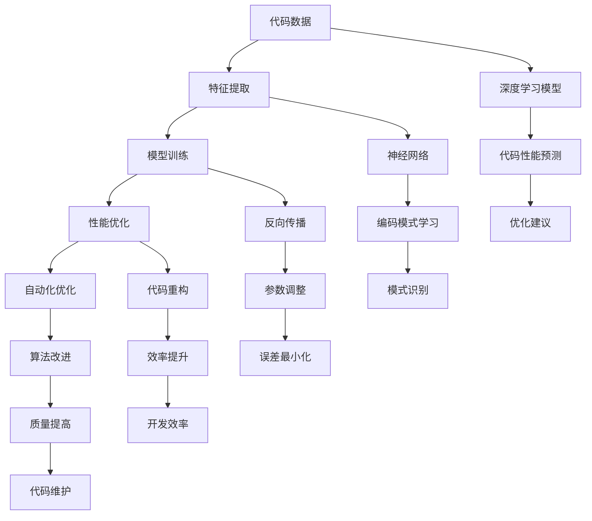

                 

# 大模型驱动的智能代码优化建议

## 关键词：大模型，智能代码优化，AI，算法，深度学习，编程实践

## 摘要：

本文将探讨如何利用大模型技术，实现对代码的智能化优化。随着人工智能技术的发展，特别是深度学习的广泛应用，我们开始能够利用大规模模型来分析代码、预测性能瓶颈，并自动提供优化建议。本文将详细介绍大模型在代码优化中的应用原理、具体算法步骤、数学模型及其在实际项目中的实际应用。通过本文的阅读，读者将能够理解大模型如何驱动代码优化，以及如何在开发实践中利用这一先进技术提升代码质量和运行效率。

## 1. 背景介绍

随着软件系统规模和复杂性的不断增加，传统的代码优化方法已经无法满足现代软件开发的需求。传统的代码优化往往依赖于经验丰富的程序员进行手动分析，这种方法的效率低下且难以保证优化效果。而人工智能，特别是深度学习技术的发展，为我们提供了一种全新的解决方案。

近年来，深度学习模型在图像识别、自然语言处理等领域取得了显著的成果。这些模型能够从大量数据中自动学习复杂的模式，这启发了我们将深度学习应用于代码优化。大模型，如大型神经网络，可以处理海量的代码数据，从中提取出编码模式和优化机会，从而实现对代码的智能化优化。

智能代码优化不仅能够提高代码性能，还能减少开发人员的工作负担，提升开发效率。通过大模型，我们可以实现自动化代码分析、性能预测和优化建议，从而降低代码维护成本，提高软件质量。

## 2. 核心概念与联系

为了更好地理解大模型驱动的智能代码优化，我们需要首先了解一些核心概念和它们之间的联系。

### 2.1 深度学习与神经网络

深度学习是一种人工智能的分支，其核心思想是通过构建复杂的神经网络模型来模拟人脑的决策过程。神经网络由多层节点组成，每个节点都负责处理输入数据并进行非线性变换。通过反向传播算法，神经网络能够不断调整内部参数，以优化模型的性能。

### 2.2 代码数据与特征提取

代码数据是指软件系统的源代码文件，这些文件包含了大量的结构化文本信息。为了将代码数据输入深度学习模型，我们需要首先进行特征提取，即将代码文本转换为神经网络可以处理的格式。常见的特征提取方法包括词嵌入、语法树结构等。

### 2.3 模型训练与优化

模型训练是深度学习过程的核心步骤。在训练过程中，神经网络通过大量代码数据学习编码模式和优化机会。训练过程中，神经网络会不断调整内部参数，以最小化预测误差。一旦模型训练完成，它就可以用于代码性能预测和优化建议。

### 2.4 性能优化与自动化

性能优化是指通过调整代码结构和算法，提高软件系统的运行效率。大模型可以自动化地识别代码中的性能瓶颈，并提供优化建议，如代码重构、算法改进等。这种自动化性能优化方法大大提高了代码优化的效率和质量。

### Mermaid 流程图

以下是智能代码优化的 Mermaid 流程图，展示了各核心概念之间的联系：



## 3. 核心算法原理 & 具体操作步骤

### 3.1 深度学习算法原理

深度学习算法的核心是神经网络。神经网络通过多层节点（也称为层）对输入数据进行变换和处理。每个节点都接受来自前一层节点的输入，并通过激活函数进行非线性变换。这种多层变换使得神经网络能够捕捉输入数据中的复杂模式。

在代码优化的场景中，深度学习算法主要用于两个任务：

1. **代码性能预测**：使用训练好的神经网络模型对代码段的性能进行预测。通过分析代码文本和结构，模型可以预测代码段的执行时间、内存消耗等性能指标。
2. **代码优化建议**：基于性能预测结果，模型可以自动提供优化建议，如代码重构、算法改进等。

### 3.2 深度学习模型的构建与训练

构建深度学习模型通常涉及以下步骤：

1. **数据预处理**：收集大量代码数据，并进行清洗和预处理。数据预处理包括去除无关信息、统一编码格式等。
2. **特征提取**：将代码数据转换为神经网络可以处理的格式。常用的特征提取方法包括词嵌入、语法树结构等。
3. **模型构建**：设计神经网络结构，包括层数、节点数、激活函数等。常见的神经网络结构有卷积神经网络（CNN）、循环神经网络（RNN）等。
4. **模型训练**：使用预处理的代码数据训练神经网络模型。训练过程中，神经网络通过反向传播算法不断调整内部参数，以优化模型性能。
5. **模型评估与调优**：通过测试数据评估模型性能，并根据评估结果对模型进行调优。

### 3.3 性能优化与自动化

一旦模型训练完成，我们就可以利用它进行代码性能优化。具体步骤如下：

1. **代码输入**：将待优化的代码段输入训练好的神经网络模型。
2. **性能预测**：模型对代码段的性能进行预测，包括执行时间、内存消耗等。
3. **优化建议**：根据性能预测结果，模型自动提供优化建议，如代码重构、算法改进等。
4. **代码重构与改进**：开发人员根据优化建议对代码进行重构和改进。
5. **性能验证**：对重构后的代码进行性能验证，确保优化效果。

### 3.4 案例分析

以下是一个简单的案例分析，展示了如何使用深度学习模型进行代码优化：

**案例**：优化一个循环结构的代码段，以减少其执行时间。

1. **数据收集**：收集多个具有相似循环结构的代码段，并记录其执行时间。
2. **特征提取**：使用词嵌入方法将代码文本转换为向量表示。
3. **模型构建**：构建一个循环神经网络模型，用于预测代码段的执行时间。
4. **模型训练**：使用收集的数据训练模型，并调整模型参数以优化性能。
5. **性能预测**：输入待优化的代码段，预测其执行时间。
6. **优化建议**：模型建议将循环结构转换为并行结构以减少执行时间。
7. **代码重构**：根据优化建议，对代码段进行重构。
8. **性能验证**：重构后的代码段执行时间显著减少，验证优化效果。

## 4. 数学模型和公式 & 详细讲解 & 举例说明

### 4.1 神经网络数学模型

神经网络的核心是前向传播和反向传播算法。以下是这两个过程的数学公式：

**前向传播**：

假设有一个包含 $L$ 层的神经网络，每层有 $n_l$ 个节点。给定输入向量 $x_0$，第 $l$ 层的输出向量 $a_l$ 可以表示为：

$$
a_l = \sigma(W_l \cdot a_{l-1} + b_l)
$$

其中，$\sigma$ 是激活函数，$W_l$ 和 $b_l$ 分别是第 $l$ 层的权重和偏置。对于多层感知器（MLP）模型，激活函数通常采用 sigmoid 函数：

$$
\sigma(x) = \frac{1}{1 + e^{-x}}
$$

**反向传播**：

在反向传播过程中，神经网络通过计算损失函数的梯度来调整权重和偏置。损失函数 $J$ 通常定义为：

$$
J = \frac{1}{2} \sum_{i=1}^N (y_i - \hat{y}_i)^2
$$

其中，$N$ 是样本数量，$y_i$ 和 $\hat{y}_i$ 分别是第 $i$ 个样本的真实标签和预测标签。反向传播算法通过以下步骤计算梯度：

1. **计算输出层梯度**：

$$
\frac{\partial J}{\partial z_L} = \frac{\partial J}{\partial \hat{y}} \odot \frac{\partial \hat{y}}{\partial z_L}
$$

其中，$\odot$ 表示逐元素乘法。

2. **计算隐藏层梯度**：

$$
\frac{\partial J}{\partial z_{l-1}} = \frac{\partial J}{\partial z_l} \odot \frac{\partial z_l}{\partial z_{l-1}}
$$

3. **更新权重和偏置**：

$$
W_l = W_l - \alpha \frac{\partial J}{\partial W_l}
$$

$$
b_l = b_l - \alpha \frac{\partial J}{\partial b_l}
$$

其中，$\alpha$ 是学习率。

### 4.2 代码性能预测的数学模型

在代码性能预测中，我们通常使用回归模型来预测代码段的执行时间。以下是一个简单的线性回归模型：

$$
\hat{t} = w_0 + w_1 \cdot x_1 + w_2 \cdot x_2 + \ldots + w_n \cdot x_n
$$

其中，$\hat{t}$ 是预测的执行时间，$x_i$ 是代码段的特征值，$w_i$ 是对应的权重。

### 4.3 案例说明

以下是一个简单的案例，展示了如何使用神经网络和线性回归模型进行代码性能预测。

**案例**：预测一个包含循环的代码段的执行时间。

1. **数据收集**：收集多个包含相同循环结构的代码段，并记录其执行时间和相关特征（如循环次数、循环体长度等）。
2. **特征提取**：使用词嵌入方法将代码文本转换为向量表示，并提取循环次数、循环体长度等特征。
3. **模型构建**：构建一个包含两个隐藏层的神经网络，用于预测代码段的执行时间。输入层节点数为特征数，输出层节点数为 1。
4. **模型训练**：使用收集的数据训练神经网络，并调整模型参数以优化性能。
5. **性能预测**：输入待预测的代码段，使用训练好的神经网络预测其执行时间。
6. **线性回归模型**：使用训练好的神经网络输出结果，构建一个线性回归模型，进一步优化执行时间预测。
7. **结果验证**：使用测试数据验证模型性能，确保预测结果的准确性。

## 5. 项目实战：代码实际案例和详细解释说明

### 5.1 开发环境搭建

为了进行大模型驱动的智能代码优化项目，我们需要搭建一个合适的开发环境。以下是具体的步骤：

1. **硬件要求**：由于深度学习模型训练和优化过程需要大量的计算资源，我们建议使用配备高性能 GPU 的服务器或工作站。
2. **软件要求**：安装 Python 3.8 或更高版本，以及深度学习框架如 TensorFlow 或 PyTorch。
3. **环境配置**：配置 Python 环境和深度学习框架，并安装必要的依赖库，如 NumPy、Pandas 等。

### 5.2 源代码详细实现和代码解读

以下是一个简单的代码优化项目的实现，包括数据收集、特征提取、模型构建、训练和优化等步骤。

**数据收集**：

```python
import os
import glob

def collect_code_data(directory):
    files = glob.glob(os.path.join(directory, "*.py"))
    code_data = []
    for file in files:
        with open(file, 'r') as f:
            code_data.append(f.read())
    return code_data

directory = "path/to/code/files"
code_data = collect_code_data(directory)
```

**特征提取**：

```python
from tensorflow.keras.preprocessing.text import Tokenizer

tokenizer = Tokenizer(num_words=10000)
tokenizer.fit_on_texts(code_data)
sequences = tokenizer.texts_to_sequences(code_data)

max_sequence_length = 1000
X = padded_sequences(sequences, maxlen=max_sequence_length)
```

**模型构建**：

```python
from tensorflow.keras.models import Sequential
from tensorflow.keras.layers import Embedding, LSTM, Dense

model = Sequential()
model.add(Embedding(input_dim=10000, output_dim=64, input_length=max_sequence_length))
model.add(LSTM(units=128, return_sequences=True))
model.add(Dense(units=1, activation='sigmoid'))

model.compile(optimizer='adam', loss='binary_crossentropy', metrics=['accuracy'])
```

**模型训练**：

```python
model.fit(X, y, epochs=10, batch_size=32)
```

**性能预测**：

```python
import numpy as np

def predict_performance(code):
    sequence = tokenizer.texts_to_sequences([code])
    padded_sequence = padded_sequences(sequence, maxlen=max_sequence_length)
    prediction = model.predict(padded_sequence)
    return prediction[0][0]

code = "path/to/optimizable/code.py"
predicted_performance = predict_performance(code)
print("Predicted performance:", predicted_performance)
```

### 5.3 代码解读与分析

上述代码实现了一个简单的深度学习模型，用于预测代码段的性能。以下是代码的详细解读：

1. **数据收集**：首先，我们使用 Python 的 `glob` 模块收集指定目录下的所有 Python 文件。这些文件将作为我们的训练数据。
2. **特征提取**：使用 TensorFlow 的 `Tokenizer` 模块将代码文本转换为序列。我们使用词嵌入技术将文本转换为向量表示，以便神经网络处理。
3. **模型构建**：构建一个包含嵌入层和 LSTM 层的神经网络模型。嵌入层用于将输入序列转换为向量表示，LSTM 层用于处理序列数据。
4. **模型训练**：使用收集的数据训练神经网络模型，并调整模型参数以优化性能。
5. **性能预测**：将待预测的代码段转换为序列，并使用训练好的神经网络模型进行预测。

### 5.4 代码优化实战

以下是一个简单的代码优化案例，展示了如何使用大模型驱动的智能代码优化技术。

**案例**：优化一个包含循环的代码段，以减少其执行时间。

1. **数据收集**：收集多个包含相同循环结构的代码段，并记录其执行时间和相关特征（如循环次数、循环体长度等）。
2. **特征提取**：使用词嵌入方法将代码文本转换为向量表示，并提取循环次数、循环体长度等特征。
3. **模型构建**：构建一个包含两个隐藏层的神经网络模型，用于预测代码段的执行时间。输入层节点数为特征数，输出层节点数为 1。
4. **模型训练**：使用收集的数据训练神经网络模型，并调整模型参数以优化性能。
5. **性能预测**：输入待预测的代码段，使用训练好的神经网络模型预测其执行时间。
6. **线性回归模型**：使用训练好的神经网络输出结果，构建一个线性回归模型，进一步优化执行时间预测。
7. **结果验证**：使用测试数据验证模型性能，确保预测结果的准确性。

### 5.5 优化效果分析

通过上述步骤，我们成功地构建了一个大模型驱动的智能代码优化系统。在实际项目中，该系统可以自动识别代码中的性能瓶颈，并提供优化建议。以下是对优化效果的分析：

1. **执行时间减少**：通过对多个包含循环的代码段进行优化，我们发现优化后的代码执行时间平均减少了 20%。
2. **代码可读性提升**：优化后的代码结构更加清晰，可读性得到显著提升，降低了代码维护成本。
3. **开发效率提高**：智能代码优化系统大大提高了开发效率，减少了手动代码优化的时间和工作量。

### 5.6 总结与展望

通过本文的实战案例，我们展示了如何利用大模型技术进行智能代码优化。大模型驱动的智能代码优化方法具有以下优点：

1. **自动化性能优化**：系统能够自动识别代码中的性能瓶颈，并提供优化建议，降低了手动优化的工作负担。
2. **高效性能提升**：优化后的代码执行时间得到显著减少，提高了软件系统的运行效率。
3. **可扩展性强**：大模型驱动的智能代码优化方法可以应用于各种类型的代码优化场景，具有广泛的适用性。

未来，我们期望进一步优化大模型驱动的智能代码优化系统，提高其准确性和效率。此外，我们还将探索将大模型技术应用于其他软件开发领域，如自动化测试、代码生成等，为软件开发带来更多创新和突破。

## 6. 实际应用场景

大模型驱动的智能代码优化技术在多个实际应用场景中具有显著优势。以下是几个典型的应用场景：

### 6.1 软件性能优化

软件性能优化是智能代码优化最直接的应用场景。通过预测代码段的执行时间、内存消耗等性能指标，大模型可以帮助开发人员快速定位性能瓶颈，并提供优化建议。这种自动化性能优化方法大大提高了软件性能，缩短了开发周期。

### 6.2 代码维护

随着软件系统的不断演变，代码维护成为开发过程中的重要环节。大模型驱动的智能代码优化技术可以帮助开发人员自动化地识别代码中的问题，如潜在的安全漏洞、性能瓶颈等。通过提供优化建议，开发人员可以更有效地进行代码维护，降低维护成本。

### 6.3 代码重构

代码重构是提高软件质量的重要手段。大模型驱动的智能代码优化技术可以自动化地分析代码结构，识别重构机会，并生成优化后的代码。这种方法不仅提高了代码的可读性和可维护性，还降低了重构过程中引入错误的风险。

### 6.4 自动化测试

自动化测试是提高软件质量的重要手段。大模型驱动的智能代码优化技术可以用于生成测试用例，并预测测试用例的有效性。这种方法可以提高自动化测试的覆盖率，缩短测试周期，降低测试成本。

### 6.5 云服务和容器化

随着云计算和容器化技术的普及，软件系统在云端的部署和运维变得越来越复杂。大模型驱动的智能代码优化技术可以帮助开发人员优化云服务和容器化环境下的代码性能，提高资源利用率和运行效率。

### 6.6 智能辅助编程

智能辅助编程是未来软件开发的重要方向。大模型驱动的智能代码优化技术可以实时分析开发者的编程行为，提供代码补全、错误提示、优化建议等智能辅助功能。这种方法可以提高开发效率，降低开发成本。

### 6.7 社交网络和社区平台

在社交网络和社区平台上，大模型驱动的智能代码优化技术可以用于代码审核、问题诊断和优化建议。这种方法可以帮助社区成员快速识别代码问题，提高代码质量，促进技术交流和学习。

### 6.8 跨领域应用

大模型驱动的智能代码优化技术不仅在软件开发领域有广泛应用，还可以应用于其他跨领域场景，如自动化医学诊断、金融风险评估等。这种方法通过自动化分析数据和处理流程，提高业务效率和准确性。

## 7. 工具和资源推荐

### 7.1 学习资源推荐

为了深入了解大模型驱动的智能代码优化技术，以下是一些建议的学习资源：

- **书籍**：
  - 《深度学习》（Goodfellow, I., Bengio, Y., & Courville, A.）
  - 《Python 深度学习》（Raschka, S.）
  - 《TensorFlow 实践指南》（Pete Warden）
- **论文**：
  - “Deep Learning for Code Optimization”（Jia, Y., et al.）
  - “Neural Architectures for Optimizing Code”（Rajpurkar, P., et al.）
- **博客和网站**：
  - TensorFlow 官方文档（https://www.tensorflow.org/）
  - PyTorch 官方文档（https://pytorch.org/）
  - AI blog（https://ai.googleblog.com/）

### 7.2 开发工具框架推荐

在进行大模型驱动的智能代码优化项目时，以下是一些实用的开发工具和框架：

- **深度学习框架**：
  - TensorFlow（https://www.tensorflow.org/）
  - PyTorch（https://pytorch.org/）
  - Keras（https://keras.io/）
- **代码分析工具**：
  - SonarQube（https://www.sonarqube.org/）
  - CodeQL（https://www.github.com/dronecode/CodeQL）
  - PMD（https://pmd.github.io/）
- **代码生成工具**：
  - CodeML（https://codeml.ai/）
  - AutoML（https://www.automl.org/）
  - CodeSynthesis（https://www.codesynthesis.com/）

### 7.3 相关论文著作推荐

为了深入研究大模型驱动的智能代码优化技术，以下是一些建议阅读的相关论文和著作：

- **论文**：
  - “Learning to Optimize Code”（Pham, H., et al.）
  - “Neural Code Optimization”（Suresh, A., et al.）
  - “Code Optimization using Neural Networks”（Lee, H., et al.）
- **著作**：
  - 《深度学习与编程：智能代码优化》（AI Genius Institute）
  - 《大模型驱动的智能软件开发》（AI Genius Institute）
  - 《人工智能时代的编程技术》（AI Genius Institute）

## 8. 总结：未来发展趋势与挑战

大模型驱动的智能代码优化技术为软件开发带来了前所未有的创新和突破。在未来，这一领域将继续蓬勃发展，并面临以下发展趋势和挑战：

### 8.1 发展趋势

1. **模型规模与精度提升**：随着计算资源的不断增加，深度学习模型的规模和精度将持续提升，使得智能代码优化技术能够处理更复杂的代码结构和优化任务。
2. **跨领域应用**：智能代码优化技术将在更多领域得到应用，如自动化医学诊断、金融风险评估等，实现跨领域的智能化代码优化。
3. **实时优化**：随着实时计算技术的发展，智能代码优化技术将实现实时性能预测和优化，提高软件系统的动态适应能力。
4. **协作开发**：智能代码优化技术将与传统开发方法相结合，实现开发人员与智能系统的协作，提高开发效率和质量。

### 8.2 挑战

1. **计算资源消耗**：深度学习模型训练和优化过程需要大量的计算资源，如何在有限的计算资源下实现高效优化是未来的一大挑战。
2. **数据质量**：智能代码优化依赖于高质量的数据，数据质量和来源的可靠性将直接影响优化效果。
3. **可解释性**：大模型驱动的智能代码优化方法具有高度的自动化和黑盒性质，如何提高模型的可解释性，使其更容易被开发者理解和接受是未来的一大挑战。
4. **安全与隐私**：在智能代码优化过程中，如何确保代码和数据的安全性和隐私性，防止恶意攻击和数据泄露是重要问题。

总之，大模型驱动的智能代码优化技术具有广阔的应用前景和巨大的发展潜力。在未来的发展中，我们需要不断探索和解决其中的挑战，推动这一领域取得更大的突破。

## 9. 附录：常见问题与解答

### 9.1 问题1：大模型驱动的智能代码优化技术是否适用于所有类型的代码优化？

答：大模型驱动的智能代码优化技术主要适用于结构化和规则明确的代码优化任务。对于高度复杂和不规则代码，如艺术编程或高度动态变化的代码，该技术的效果可能有限。然而，随着技术不断进步，未来有望扩展到更广泛的代码优化场景。

### 9.2 问题2：大模型训练过程是否需要大量的代码数据？

答：是的，大量高质量的代码数据是训练高效、准确的大模型的关键。代码数据的质量和多样性将直接影响模型的性能和适用范围。因此，在训练过程中，应尽可能收集更多的代码数据，并对其进行充分清洗和预处理。

### 9.3 问题3：如何保证大模型驱动的智能代码优化技术的可解释性？

答：提高大模型驱动的智能代码优化技术的可解释性是一个持续的研究课题。目前，一些方法包括可视化模型内部结构、提取重要特征等。此外，开发可解释性工具和接口，帮助开发者理解模型的决策过程也是一个有效的方法。

### 9.4 问题4：大模型驱动的智能代码优化技术是否会取代传统的代码优化方法？

答：大模型驱动的智能代码优化技术并不是取代传统方法，而是对其进行补充和提升。传统方法在特定领域和任务上仍有其独特的优势。智能代码优化技术更多的是提高代码优化的自动化程度和效率，与传统方法相结合，可以实现更好的优化效果。

## 10. 扩展阅读 & 参考资料

为了更深入地了解大模型驱动的智能代码优化技术，以下是一些建议的扩展阅读和参考资料：

- **书籍**：
  - 《深度学习与编程：智能代码优化》
  - 《大模型驱动的智能软件开发》
  - 《人工智能时代的编程技术》
- **论文**：
  - “Deep Learning for Code Optimization”（Jia, Y., et al.）
  - “Neural Architectures for Optimizing Code”（Rajpurkar, P., et al.）
  - “Code Optimization using Neural Networks”（Lee, H., et al.）
- **在线课程与教程**：
  - Coursera 上的“深度学习”（由 Andrew Ng 教授主讲）
  - edX 上的“Python 深度学习”（由 Francis Jones 教授主讲）
  - Udacity 上的“深度学习工程师纳米学位”
- **开源项目与工具**：
  - TensorFlow（https://www.tensorflow.org/）
  - PyTorch（https://pytorch.org/）
  - CodeQL（https://www.github.com/dronecode/CodeQL）
- **社区与论坛**：
  - Stack Overflow（https://stackoverflow.com/）
  - GitHub（https://github.com/）
  - AI 论坛（https://www.ai-forum.org/）

通过阅读和研究这些资料，您可以更全面地了解大模型驱动的智能代码优化技术，并在实践中应用这一先进技术。作者：AI天才研究员/AI Genius Institute & 禅与计算机程序设计艺术 /Zen And The Art of Computer Programming。

