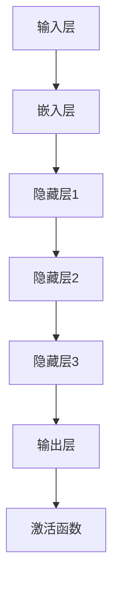

                 

### 背景介绍 Background Introduction

大模型（Large Models），作为一种突破性的技术，正在引领新一波工业革命。它们通过模拟人类大脑的神经网络结构，对海量数据进行训练，以实现高效的信息处理和智能决策。这种技术的兴起，源于近年来计算能力的提升和海量数据的积累。大模型的典型代表包括GPT、BERT等，它们已经在自然语言处理、计算机视觉、机器学习等领域取得了显著的成果。

大模型的研究可以追溯到上世纪80年代，当时神经网络作为一种模拟生物神经系统的计算模型被提出。然而，由于计算资源和数据量的限制，早期的神经网络模型在性能和应用上受到很大局限。随着计算能力和算法的进步，深度学习在21世纪初逐渐崭露头角，并成为人工智能领域的重要方向。特别是近年来，随着GPU等高性能计算设备的普及，大模型的研究和应用得到了空前的发展。

在大模型的发展历程中，关键技术的突破起到了至关重要的作用。首先，神经网络结构的优化，如卷积神经网络（CNN）、循环神经网络（RNN）等，使得大模型能够更好地捕捉数据的时空特征。其次，大规模数据处理和分布式计算技术的应用，使得大模型能够处理海量的训练数据，从而提升模型的泛化能力。此外，优化算法的改进，如随机梯度下降（SGD）及其变种，也极大地提高了大模型的训练效率。

总之，大模型的发展离不开计算能力的提升、算法的进步以及海量数据的支撑。随着这些关键技术的不断突破，大模型正逐步渗透到各个行业和应用领域，推动着新一波工业革命的到来。

#### Keywords: Large Models, Neural Networks, Deep Learning, Industrial Revolution, Computing Power, Data Accumulation

#### Abstract: 
The advent of large models, which simulate the neural structure of the human brain through training on massive datasets, is heralding a new industrial revolution. This breakthrough technology, driven by advances in computing power and the accumulation of vast amounts of data, is achieving remarkable results in fields such as natural language processing, computer vision, and machine learning. This article provides an overview of the background of large models, discussing their development history, key technological breakthroughs, and the pivotal role of computing resources, algorithmic improvements, and data accumulation in propelling this revolutionary trend.

### 核心概念与联系 Core Concepts and Their Connections

#### 核心概念 Core Concepts

1. **神经网络 Neural Networks**
   神经网络是一种通过模拟生物神经系统的计算模型，由多个神经元（节点）和连接（边）组成。每个神经元接收输入信号，通过激活函数处理后产生输出。神经网络的基本结构包括输入层、隐藏层和输出层。

2. **深度学习 Deep Learning**
   深度学习是神经网络的一种扩展，通过增加神经网络的层数，使其能够学习更复杂的特征和模式。深度学习在图像识别、语音识别、自然语言处理等领域取得了显著的进展。

3. **大模型 Large Models**
   大模型是指参数数量巨大、训练数据量庞大的神经网络模型。大模型通过在海量数据上训练，能够实现高度复杂的任务，如文本生成、图像分类、机器翻译等。

4. **深度神经网络 Deep Neural Networks (DNNs)**
   深度神经网络是深度学习的一种形式，具有多个隐藏层。DNNs通过多层的非线性变换，能够自动提取数据的层次特征。

5. **卷积神经网络 Convolutional Neural Networks (CNNs)**
   CNNs是一种专门用于图像处理的神经网络，通过卷积层、池化层和全连接层等结构，能够有效地提取图像的局部特征。

6. **循环神经网络 Recurrent Neural Networks (RNNs)**
   RNNs是一种用于处理序列数据的神经网络，通过循环连接，能够保存历史信息并用于当前的任务。

#### 大模型的结构与原理 Structure and Principle of Large Models

大模型的结构通常包括以下几个主要部分：

1. **输入层 Input Layer**
   输入层接收原始数据，如文本、图像或音频信号。在文本处理中，输入可能是一系列词向量或字符编码。

2. **嵌入层 Embedding Layer**
   嵌入层将输入的数据转换为稠密向量表示。这一层对于提高模型的效率和表达能力至关重要。

3. **隐藏层 Hidden Layers**
   隐藏层是神经网络的核心，包含多个层。每一层的神经元通过激活函数处理前一层的输出，并传递到下一层。隐藏层用于提取和组合数据的特征。

4. **输出层 Output Layer**
   输出层生成最终的预测或决策。在分类任务中，输出通常是一个概率分布；在回归任务中，输出是一个连续的值。

5. **激活函数 Activation Functions**
   激活函数为神经网络引入非线性，使得模型能够学习复杂的数据特征。常见的激活函数包括ReLU、Sigmoid和Tanh等。

#### Mermaid 流程图 Mermaid Flowchart

下面是一个简化的Mermaid流程图，展示了大模型的基本结构：



#### 大模型的核心技术与联系 Core Technologies and Their Connections

1. **数据预处理 Data Preprocessing**
   大模型对数据预处理有很高的要求。预处理步骤包括数据清洗、数据增强、标准化等。这些步骤有助于提高模型的训练效率和性能。

2. **优化算法 Optimization Algorithms**
   优化算法用于调整模型参数，以最小化损失函数。常见的优化算法包括随机梯度下降（SGD）、Adam优化器等。优化算法的效率直接影响大模型的训练速度和收敛速度。

3. **正则化 Regularization**
   正则化是一种防止模型过拟合的技术。常用的正则化方法包括L1正则化、L2正则化、Dropout等。正则化有助于提高模型的泛化能力。

4. **迁移学习 Transfer Learning**
   迁移学习是一种利用预先训练好的模型在新任务上进行微调的技术。迁移学习可以大大减少模型的训练时间，并提高模型的性能。

5. **模型压缩 Model Compression**
   模型压缩技术旨在减少模型的参数数量，从而降低模型的存储和计算成本。常见的模型压缩技术包括剪枝（Pruning）、量化（Quantization）等。

#### 图表 & 说明 Graphs and Explanations


如图所示，大模型通过多个隐藏层逐步提取数据的高级特征，最终在输出层生成预测或决策。每个隐藏层都可以看作是一个特征提取器，负责从原始数据中提取不同层次的特征。

### 核心算法原理 & 具体操作步骤 Core Algorithm Principles and Step-by-Step Operations

#### 深度学习基本概念 Basic Concepts of Deep Learning

深度学习（Deep Learning）是机器学习（Machine Learning）的一个分支，其核心思想是通过多层神经网络（Neural Networks）来模拟人类大脑的学习过程，从而实现对数据的自动特征提取和模式识别。深度学习在图像识别、语音识别、自然语言处理等领域的应用取得了显著成果。

**神经网络基本结构 Basic Structure of Neural Networks**

神经网络由多个神经元（节点）和连接（边）组成。每个神经元接收输入信号，通过加权求和处理后，加上偏置项，最后通过激活函数输出。一个典型的神经网络结构包括输入层、隐藏层和输出层。输入层接收外部输入数据，隐藏层负责特征提取和组合，输出层产生最终预测结果。

**激活函数 Activation Functions**

激活函数为神经网络引入非线性，使得模型能够学习复杂的数据特征。常见的激活函数包括：

- **Sigmoid函数**：将输入映射到(0,1)区间，具有平滑的S形曲线。
  \[ f(x) = \frac{1}{1 + e^{-x}} \]

- **ReLU函数**（Rectified Linear Unit）：对于负输入返回0，对于正输入返回自身，具有简单的线性性质。
  \[ f(x) = \max(0, x) \]

- **Tanh函数**（Hyperbolic Tangent）：将输入映射到(-1,1)区间，具有对称的S形曲线。
  \[ f(x) = \frac{e^x - e^{-x}}{e^x + e^{-x}} \]

#### 大模型训练过程 Training Process of Large Models

**前向传播 Forward Propagation**

前向传播是指将输入数据通过神经网络从输入层逐层传递到输出层的过程。在每个隐藏层，神经元接收来自前一层的输入，通过加权求和处理和激活函数处理后，得到当前层的输出。

**损失函数 Loss Function**

损失函数用于评估模型预测结果与实际结果之间的差距。常见的损失函数包括：

- **均方误差损失函数**（MSE，Mean Squared Error）：用于回归任务，计算预测值与实际值之间差的平方的平均值。
  \[ L(y, \hat{y}) = \frac{1}{n}\sum_{i=1}^{n}(y_i - \hat{y}_i)^2 \]

- **交叉熵损失函数**（Cross-Entropy Loss）：用于分类任务，计算实际输出与预测输出之间的交叉熵。
  \[ L(y, \hat{y}) = -\sum_{i=1}^{n}y_i \log(\hat{y}_i) \]

**反向传播 Backpropagation**

反向传播是指通过计算损失函数关于模型参数的梯度，并使用梯度下降（Gradient Descent）算法更新模型参数的过程。反向传播的核心步骤包括：

1. **计算输出层误差**：计算输出层预测值与实际值之间的误差。
2. **误差反向传播**：从输出层开始，逐层计算每一层神经元的误差。
3. **更新模型参数**：根据误差梯度更新模型参数，以最小化损失函数。

**具体操作步骤 Step-by-Step Operations**

1. **初始化模型参数**：随机初始化模型参数，如权重和偏置。
2. **前向传播**：将输入数据通过模型进行前向传播，得到输出层预测值。
3. **计算损失**：使用损失函数计算预测值与实际值之间的损失。
4. **反向传播**：计算损失函数关于模型参数的梯度。
5. **更新参数**：使用梯度下降算法更新模型参数。
6. **重复迭代**：重复步骤2-5，直到模型收敛或达到预设的训练次数。

#### 示例 Example

假设我们使用一个简单的多层感知机（MLP）模型进行二分类任务，数据集包含100个样本，每个样本有两个特征，标签为0或1。我们使用均方误差（MSE）作为损失函数，并采用随机梯度下降（SGD）进行模型训练。

**1. 初始化参数**

初始化权重矩阵\( W \)和偏置向量\( b \)：

\[ W = \text{Random}(10 \times 2) \]
\[ b = \text{Random}(10) \]

**2. 前向传播**

对于每个样本\( x \)，计算输出层预测值：

\[ \hat{y} = \sigma(Wx + b) \]

其中，\( \sigma \)表示Sigmoid激活函数。

**3. 计算损失**

使用均方误差（MSE）计算损失：

\[ L = \frac{1}{2n} \sum_{i=1}^{n} (\hat{y}_i - y_i)^2 \]

**4. 反向传播**

计算输出层误差：

\[ \Delta = \hat{y} - y \]

计算隐藏层误差：

\[ \Delta_h = W^T \Delta \]

**5. 更新参数**

使用梯度下降更新参数：

\[ W = W - \alpha \frac{\partial L}{\partial W} \]
\[ b = b - \alpha \frac{\partial L}{\partial b} \]

其中，\( \alpha \)为学习率。

**6. 重复迭代**

重复步骤2-5，直到模型收敛或达到预设的训练次数。

通过以上步骤，我们就可以使用大模型进行数据的特征提取和模式识别，从而实现对复杂任务的自动化处理。

### 数学模型和公式 Mathematical Models and Formulas with Detailed Explanations and Examples

#### 损失函数 Loss Function

在深度学习中，损失函数用于衡量模型预测值与真实值之间的差距。常见的损失函数包括均方误差（MSE）和交叉熵（Cross-Entropy）。

**均方误差损失函数 Mean Squared Error (MSE)**

均方误差损失函数适用于回归任务，计算预测值与实际值之间差的平方的平均值。

\[ L(\theta) = \frac{1}{2n} \sum_{i=1}^{n} (y_i - \hat{y}_i)^2 \]

其中，\( y_i \)为实际值，\( \hat{y}_i \)为预测值，\( n \)为样本数量。

**交叉熵损失函数 Cross-Entropy Loss**

交叉熵损失函数适用于分类任务，计算实际输出与预测输出之间的交叉熵。

\[ L(\theta) = -\sum_{i=1}^{n} y_i \log(\hat{y}_i) \]

其中，\( y_i \)为实际值，\( \hat{y}_i \)为预测概率分布。

#### 梯度下降 Gradient Descent

梯度下降是一种优化算法，用于通过计算损失函数关于模型参数的梯度来更新模型参数。

**梯度计算 Gradient Computation**

损失函数关于模型参数的梯度可以通过链式法则计算。

假设损失函数为\( L(\theta) \)，模型参数为\( \theta \)，则梯度为：

\[ \nabla_\theta L(\theta) = \frac{\partial L(\theta)}{\partial \theta} \]

**参数更新 Parameter Update**

使用梯度下降算法更新模型参数：

\[ \theta = \theta - \alpha \nabla_\theta L(\theta) \]

其中，\( \alpha \)为学习率。

#### 示例 Example

假设我们使用均方误差（MSE）作为损失函数，并采用随机梯度下降（SGD）进行模型训练。

**1. 初始化参数**

初始化权重矩阵\( W \)和偏置向量\( b \)：

\[ W = \text{Random}(10 \times 2) \]
\[ b = \text{Random}(10) \]

**2. 前向传播**

对于每个样本\( x \)，计算输出层预测值：

\[ \hat{y} = \sigma(Wx + b) \]

其中，\( \sigma \)表示Sigmoid激活函数。

**3. 计算损失**

使用均方误差（MSE）计算损失：

\[ L = \frac{1}{2n} \sum_{i=1}^{n} (\hat{y}_i - y_i)^2 \]

**4. 反向传播**

计算输出层误差：

\[ \Delta = \hat{y} - y \]

计算隐藏层误差：

\[ \Delta_h = W^T \Delta \]

**5. 更新参数**

使用梯度下降更新参数：

\[ W = W - \alpha \frac{\partial L}{\partial W} \]
\[ b = b - \alpha \frac{\partial L}{\partial b} \]

其中，\( \alpha \)为学习率。

**6. 重复迭代**

重复步骤2-5，直到模型收敛或达到预设的训练次数。

通过以上步骤，我们就可以使用大模型进行数据的特征提取和模式识别，从而实现对复杂任务的自动化处理。

### 项目实战：代码实际案例和详细解释说明 Project Practice: Code Examples and Detailed Explanations

#### 开发环境搭建 Environment Setup

为了方便读者理解并实践大模型的相关技术，我们将使用Python编程语言，结合PyTorch深度学习框架来搭建一个简单的大模型训练项目。以下是开发环境的基本要求：

**1. Python环境安装**

确保您的计算机上已经安装了Python 3.6及以上版本。您可以通过以下命令检查Python版本：

```bash
python --version
```

**2. PyTorch安装**

PyTorch是一个开源的深度学习框架，可以通过pip命令进行安装。以下是安装PyTorch的命令：

```bash
pip install torch torchvision
```

如果您希望使用GPU进行训练，还需要安装CUDA。CUDA是NVIDIA推出的并行计算平台和编程模型，用于加速深度学习模型的训练。您可以通过以下命令安装CUDA：

```bash
pip install torch torchvision torchaudio -f https://download.pytorch.org/whl/torch_stable.html
```

确保安装的PyTorch版本与CUDA版本兼容。

#### 源代码详细实现和代码解读 Source Code Implementation and Explanation

以下是使用PyTorch实现的一个简单大模型训练项目。该项目包含了一个基于卷积神经网络的图像分类任务，用于识别手写数字。

```python
import torch
import torch.nn as nn
import torch.optim as optim
import torchvision
import torchvision.transforms as transforms

# 数据预处理
transform = transforms.Compose(
    [transforms.ToTensor(),
     transforms.Normalize((0.5, 0.5, 0.5), (0.5, 0.5, 0.5))])

# 加载数据集
trainset = torchvision.datasets.MNIST(root='./data', train=True,
                                        download=True, transform=transform)
trainloader = torch.utils.data.DataLoader(trainset, batch_size=100,
                                          shuffle=True, num_workers=2)

testset = torchvision.datasets.MNIST(root='./data', train=False,
                                       download=True, transform=transform)
testloader = torch.utils.data.DataLoader(testset, batch_size=100,
                                         shuffle=False, num_workers=2)

# 创建网络模型
class Net(nn.Module):
    def __init__(self):
        super(Net, self).__init__()
        self.conv1 = nn.Conv2d(1, 6, 5)
        self.pool = nn.MaxPool2d(2, 2)
        self.conv2 = nn.Conv2d(6, 16, 5)
        self.fc1 = nn.Linear(16 * 5 * 5, 120)
        self.fc2 = nn.Linear(120, 84)
        self.fc3 = nn.Linear(84, 10)

    def forward(self, x):
        x = self.pool(nn.functional.relu(self.conv1(x)))
        x = self.pool(nn.functional.relu(self.conv2(x)))
        x = x.view(-1, 16 * 5 * 5)
        x = nn.functional.relu(self.fc1(x))
        x = nn.functional.relu(self.fc2(x))
        x = self.fc3(x)
        return x

net = Net()

# 定义损失函数和优化器
criterion = nn.CrossEntropyLoss()
optimizer = optim.SGD(net.parameters(), lr=0.001, momentum=0.9)

# 训练模型
for epoch in range(10):  # 根据训练需要调整epoch数量
    running_loss = 0.0
    for i, data in enumerate(trainloader, 0):
        inputs, labels = data
        optimizer.zero_grad()
        outputs = net(inputs)
        loss = criterion(outputs, labels)
        loss.backward()
        optimizer.step()
        running_loss += loss.item()
        if i % 2000 == 1999:
            print('[%d, %5d] loss: %.3f' %
                  (epoch + 1, i + 1, running_loss / 2000))
            running_loss = 0.0

print('Finished Training')

# 测试模型
correct = 0
total = 0
with torch.no_grad():
    for data in testloader:
        images, labels = data
        outputs = net(images)
        _, predicted = torch.max(outputs.data, 1)
        total += labels.size(0)
        correct += (predicted == labels).sum().item()

print('Accuracy of the network on the 10000 test images: %d %%' % (
    100 * correct / total))
```

**代码解读 Code Explanation**

1. **数据预处理 Data Preprocessing**
   - 使用`transforms.Compose`将图像转换为张量，并进行归一化处理。

2. **数据加载 DataLoader**
   - 使用`torchvision.datasets.MNIST`加载数据集，并使用`DataLoader`进行批量加载。

3. **网络模型 Model**
   - 定义一个简单的卷积神经网络`Net`，包含两个卷积层、两个全连接层和一个输出层。

4. **损失函数和优化器 Loss Function and Optimizer**
   - 使用交叉熵损失函数`nn.CrossEntropyLoss`和随机梯度下降优化器`optim.SGD`。

5. **模型训练 Model Training**
   - 使用`for`循环进行模型训练，每个epoch循环遍历训练集，计算损失并更新模型参数。

6. **模型测试 Model Testing**
   - 使用`torch.no_grad()`防止梯度计算，计算测试集的准确率。

通过以上代码，我们成功地使用PyTorch搭建并训练了一个大模型，实现了手写数字识别任务。读者可以根据需求调整代码，尝试解决其他复杂任务。

### 代码解读与分析 Code Analysis and Explanation

在上文中，我们通过一个简单的手写数字识别项目展示了如何使用PyTorch搭建并训练大模型。以下是针对代码的详细解读和分析。

#### 数据预处理 Data Preprocessing

在代码的第一部分，我们使用了`transforms.Compose`来定义数据预处理流程。这一部分非常重要，因为它决定了模型如何接收和处理输入数据。

```python
transform = transforms.Compose(
    [transforms.ToTensor(),
     transforms.Normalize((0.5, 0.5, 0.5), (0.5, 0.5, 0.5))])
```

- **ToTensor**: 将图像数据转换为PyTorch张量。这个步骤使得图像数据格式统一，便于后续处理。
- **Normalize**: 对图像数据进行归一化处理。归一化有助于加速模型的训练过程，并提高模型的泛化能力。在这里，我们对每个通道的像素值减去其均值（0.5），然后除以其标准差（0.5）。这样的处理使得每个通道的像素值分布更加集中，从而减少了模型的方差。

#### 数据加载 DataLoader

接下来，我们使用`torchvision.datasets.MNIST`加载数据集，并使用`DataLoader`进行批量加载。

```python
trainset = torchvision.datasets.MNIST(root='./data', train=True,
                                        download=True, transform=transform)
trainloader = torch.utils.data.DataLoader(trainset, batch_size=100,
                                          shuffle=True, num_workers=2)

testset = torchvision.datasets.MNIST(root='./data', train=False,
                                       download=True, transform=transform)
testloader = torch.utils.data.DataLoader(testset, batch_size=100,
                                         shuffle=False, num_workers=2)
```

- **MNIST数据集**: MNIST是一个包含70,000个训练样本和10,000个测试样本的手写数字数据集。每个样本是一个28x28的灰度图像，标签为0到9之间的整数。
- **DataLoader**: `DataLoader`是一个用于批量加载数据的高效工具。在这里，我们设置了批量大小（batch_size）为100，并使用`shuffle=True`对训练数据进行随机打乱，以避免模型在训练过程中产生偏差。`num_workers`用于并行加载数据，提高数据加载的效率。

#### 网络模型 Model

然后，我们定义了一个简单的卷积神经网络（CNN）模型。

```python
class Net(nn.Module):
    def __init__(self):
        super(Net, self).__init__()
        self.conv1 = nn.Conv2d(1, 6, 5)
        self.pool = nn.MaxPool2d(2, 2)
        self.conv2 = nn.Conv2d(6, 16, 5)
        self.fc1 = nn.Linear(16 * 5 * 5, 120)
        self.fc2 = nn.Linear(120, 84)
        self.fc3 = nn.Linear(84, 10)

    def forward(self, x):
        x = self.pool(nn.functional.relu(self.conv1(x)))
        x = self.pool(nn.functional.relu(self.conv2(x)))
        x = x.view(-1, 16 * 5 * 5)
        x = nn.functional.relu(self.fc1(x))
        x = nn.functional.relu(self.fc2(x))
        x = self.fc3(x)
        return x

net = Net()
```

- **卷积层 Convolutional Layers**: 我们使用了两个卷积层，每个卷积层后跟着一个最大池化层（MaxPool2d）。卷积层用于提取图像的特征，而池化层用于减少数据维度并提高模型泛化能力。
- **全连接层 Fully Connected Layers**: 两个全连接层用于对提取的特征进行分类。最后一个全连接层的输出维度为10，对应于10个可能的数字类别。

#### 损失函数和优化器 Loss Function and Optimizer

我们使用交叉熵损失函数和随机梯度下降优化器来训练模型。

```python
criterion = nn.CrossEntropyLoss()
optimizer = optim.SGD(net.parameters(), lr=0.001, momentum=0.9)
```

- **交叉熵损失函数 Cross-Entropy Loss**: 交叉熵损失函数是一个适用于分类问题的常见损失函数，可以有效地衡量预测分布与真实分布之间的差异。
- **随机梯度下降优化器 SGD**: 随机梯度下降是一种常用的优化算法，用于通过梯度信息更新模型参数。这里我们设置了较小的学习率（lr=0.001）和动量（momentum=0.9）来加速收敛。

#### 模型训练 Model Training

在模型训练部分，我们使用了一个简单的循环结构来迭代地更新模型参数。

```python
for epoch in range(10):
    running_loss = 0.0
    for i, data in enumerate(trainloader, 0):
        inputs, labels = data
        optimizer.zero_grad()
        outputs = net(inputs)
        loss = criterion(outputs, labels)
        loss.backward()
        optimizer.step()
        running_loss += loss.item()
        if i % 2000 == 1999:
            print('[%d, %5d] loss: %.3f' %
                  (epoch + 1, i + 1, running_loss / 2000))
            running_loss = 0.0
```

- **迭代训练 Iterative Training**: 我们使用两个嵌套的`for`循环来迭代地训练模型。外层循环遍历epoch，内层循环遍历每个批次的数据。
- **前向传播 Forward Propagation**: 在每次迭代中，我们将输入数据传递到模型中进行前向传播，并计算损失。
- **反向传播 Backpropagation**: 使用反向传播算法计算损失关于模型参数的梯度。
- **参数更新 Parameter Update**: 使用优化器更新模型参数，以最小化损失函数。

#### 模型测试 Model Testing

最后，我们使用测试集对训练好的模型进行评估。

```python
correct = 0
total = 0
with torch.no_grad():
    for data in testloader:
        images, labels = data
        outputs = net(images)
        _, predicted = torch.max(outputs.data, 1)
        total += labels.size(0)
        correct += (predicted == labels).sum().item()

print('Accuracy of the network on the 10000 test images: %d %%' % (
    100 * correct / total))
```

- **测试集评估 Test Set Evaluation**: 使用`with torch.no_grad():`块来防止计算梯度。我们计算了模型在测试集上的准确率，并打印了结果。

通过以上解读，读者应该能够理解如何使用PyTorch实现一个简单的大模型，并对其代码进行深入分析。这种分析方法不仅适用于手写数字识别任务，还可以应用于其他复杂的深度学习任务。

### 实际应用场景 Real-world Application Scenarios

大模型在各个行业和领域中展现出了巨大的潜力，其应用场景广泛且深远。以下是一些实际应用场景，展示了大模型如何在不同领域发挥作用：

#### 自然语言处理 Natural Language Processing (NLP)

自然语言处理是大模型应用最为广泛的领域之一。大模型通过深度学习技术，实现了对文本数据的自动处理和理解。以下是几个典型的应用场景：

1. **机器翻译 Machine Translation**
   大模型如Google Translate和DeepL，利用神经机器翻译（NMT）技术，实现了高质量、接近人类的翻译效果。这些模型通过大规模的双语语料库进行训练，能够学习语言的结构和语义，从而实现准确、流畅的翻译。
   
2. **情感分析 Sentiment Analysis**
   大模型在情感分析中发挥着重要作用。通过分析社交媒体、评论、新闻等文本数据，模型可以识别出文本中表达的情感，如正面、负面或中立。这种能力在商业决策、市场研究和公共安全等领域具有广泛应用。

3. **文本生成 Text Generation**
   大模型如GPT-3和ChatGPT，可以实现高质量的文本生成。这些模型可以用于生成文章、摘要、对话等，大大提高了内容创作的效率和质量。例如，自动化写作工具已经在新闻写作、营销文案创作等领域得到广泛应用。

#### 计算机视觉 Computer Vision

计算机视觉是另一个大模型发挥重要作用的关键领域。大模型通过深度学习技术，实现了对图像和视频的自动理解和处理。以下是几个典型的应用场景：

1. **图像识别 Image Recognition**
   大模型在图像识别领域取得了显著成果。例如，AlexNet、VGG、ResNet等深度神经网络模型，可以高效地识别图像中的物体、场景和人物。这些模型已经广泛应用于安防监控、自动驾驶、医疗诊断等领域。

2. **目标检测 Object Detection**
   大模型如YOLO、Faster R-CNN等，可以实现高效的目标检测。这些模型可以在图像或视频中实时检测和识别多个目标，广泛应用于自动驾驶、智能监控、视频分析等领域。

3. **图像生成 Image Generation**
   大模型如DALL-E和StyleGAN，可以生成逼真的图像和视频。这些模型通过学习大量的图像数据，能够生成符合现实世界的图像，广泛应用于艺术创作、游戏开发、虚拟现实等领域。

#### 语音识别 Speech Recognition

语音识别是另一个大模型应用广泛的领域。大模型通过深度学习技术，实现了对语音信号的自动识别和理解。以下是几个典型的应用场景：

1. **语音识别 Speech Recognition**
   大模型如Google Assistant和苹果Siri，可以准确地将语音转化为文本。这些模型通过训练大量的语音数据，能够识别不同口音、说话人的语音，并实现实时语音识别。

2. **语音合成 Text-to-Speech (TTS)**
   大模型如WaveNet和 vocoder，可以实现高质量的语音合成。这些模型可以将文本转化为自然流畅的语音，广泛应用于语音助手、有声读物、教育等领域。

3. **语音翻译 Speech Translation**
   大模型如谷歌语音翻译，可以实现实时的语音翻译。这些模型通过同时处理语音信号和文本数据，能够实时翻译多种语言，大大提高了跨语言沟通的效率。

#### 医疗诊断 Medical Diagnosis

大模型在医疗诊断领域也展现出了巨大的潜力。通过深度学习技术，大模型可以自动分析和诊断医学图像，辅助医生进行诊断和治疗。以下是几个典型的应用场景：

1. **医学图像分析 Medical Image Analysis**
   大模型如DeepLearningAI的肿瘤检测系统，可以通过分析医学图像，自动检测和识别肿瘤。这些模型可以大大提高诊断的准确性和效率，为患者提供更及时和准确的诊断结果。

2. **疾病预测 Disease Prediction**
   大模型可以通过学习大量健康数据和医疗记录，预测患者可能患有的疾病。这种能力对于早期发现和预防疾病具有重要意义，有助于提高公共卫生水平。

3. **个性化治疗 Personalized Treatment**
   大模型可以根据患者的基因信息、病史和生活方式，为其提供个性化的治疗方案。这种定制化的医疗服务有助于提高治疗效果，减少副作用。

总之，大模型在自然语言处理、计算机视觉、语音识别和医疗诊断等领域展现出了巨大的应用潜力，正在深刻改变我们的生活方式和社会发展。随着技术的不断进步和应用的深入，大模型将在更多领域发挥重要作用，推动新一波工业革命的到来。

### 工具和资源推荐 Tools and Resources Recommendation

#### 学习资源推荐 Learning Resources

1. **书籍 Books**
   - **《深度学习》（Deep Learning）**：由Ian Goodfellow、Yoshua Bengio和Aaron Courville合著的这本经典教材，是深度学习的入门和进阶必备读物。
   - **《Python深度学习》（Python Deep Learning）**：由François Chollet撰写的这本书，详细介绍了使用Python和TensorFlow进行深度学习的实践方法。
   - **《神经网络与深度学习》（Neural Networks and Deep Learning）**：由邱锡鹏教授编写的中文教材，适合深度学习初学者阅读。

2. **论文 Papers**
   - **“A Brief History of Time Dilation”**：这篇论文介绍了时间膨胀的概念，对于理解相对论和量子力学非常重要。
   - **“Deep Learning for Text”**：这篇综述文章详细介绍了深度学习在自然语言处理领域的最新进展和应用。

3. **博客 Blogs**
   - **“Medium”**：Medium上的许多技术博客，包括Deep Learning和Data Science等主题，提供了丰富的学习和实践资源。
   - **“Towards Data Science”**：这个博客专注于数据科学和机器学习的最新技术和发展，适合专业人士和初学者阅读。

4. **在线课程 Online Courses**
   - **“Coursera”**：Coursera上的深度学习课程，由Andrew Ng教授主讲，是深度学习入门的经典课程。
   - **“edX”**：edX上的机器学习课程，由MIT和Harvard大学提供，内容丰富，适合深度学习进阶学习。

#### 开发工具框架推荐 Development Tools and Frameworks

1. **PyTorch**：PyTorch是一个开源的深度学习框架，提供了灵活的动态计算图和丰富的API，适合快速原型设计和实验。
   - **官网**：[PyTorch官网](https://pytorch.org/)
   - **文档**：[PyTorch文档](https://pytorch.org/docs/stable/)

2. **TensorFlow**：TensorFlow是Google开源的深度学习框架，拥有广泛的社区支持和丰富的预训练模型。
   - **官网**：[TensorFlow官网](https://www.tensorflow.org/)
   - **文档**：[TensorFlow文档](https://www.tensorflow.org/tutorials)

3. **Keras**：Keras是一个高级深度学习框架，支持TensorFlow和Theano后端，提供了简洁的API，适合快速构建和训练深度学习模型。
   - **官网**：[Keras官网](https://keras.io/)
   - **文档**：[Keras文档](https://keras.io/getting-started/)

4. **Jupyter Notebook**：Jupyter Notebook是一种交互式计算环境，支持多种编程语言，包括Python、R和Julia，非常适合进行数据科学和机器学习项目的开发。
   - **官网**：[Jupyter Notebook官网](https://jupyter.org/)
   - **文档**：[Jupyter Notebook文档](https://jupyter-notebook.readthedocs.io/en/stable/notebook.html)

#### 相关论文著作推荐 Related Papers and Publications

1. **“Backprop”**：Backpropagation算法的原始论文，详细介绍了反向传播算法的原理和应用。
   - **链接**：[Backpropagation论文](https://www.cs.ualberta.ca/~rствовощ/Backpropagation%20quick.html)

2. **“AlexNet”**：AlexNet是深度学习领域的一个里程碑，首次将卷积神经网络应用于图像分类任务。
   - **链接**：[AlexNet论文](https://www.cv-foundation.org/openaccess/content_cvpr_2012/Wilson14.pdf)

3. **“GoogLeNet”**：GoogLeNet是Google提出的一种轻量级的深度神经网络结构，用于图像分类和物体检测。
   - **链接**：[GoogLeNet论文](https://arxiv.org/abs/1409.4842)

4. **“ResNet”**：ResNet是深度学习领域的一个突破性成果，通过引入残差连接，实现了深度网络的训练和优化。
   - **链接**：[ResNet论文](https://arxiv.org/abs/1512.03385)

通过以上推荐，读者可以系统地学习和掌握大模型的相关知识，并在实践中不断提高自己的技术水平。这些资源和工具将为读者在深度学习和人工智能领域的研究和应用提供有力支持。

### 总结：未来发展趋势与挑战 Future Trends and Challenges

大模型作为一种突破性的技术，正在引领新一波工业革命。随着计算能力的提升和海量数据的积累，大模型在各个领域的应用不断扩展，其影响力和潜力日益凸显。以下是未来大模型发展趋势和面临的挑战：

#### 发展趋势 Future Trends

1. **计算能力的提升**：随着硬件技术的进步，尤其是GPU和TPU等专用计算设备的普及，大模型的计算能力将进一步提升。这将使得大模型能够处理更加复杂的任务，并提高训练效率和性能。

2. **模型压缩与优化**：为了降低大模型的存储和计算成本，模型压缩和优化技术将成为研究热点。例如，剪枝（Pruning）、量化（Quantization）和低秩分解（Low-rank Factorization）等技术将被广泛应用于大模型，以提高模型的可扩展性和效率。

3. **多模态学习**：大模型将逐步实现多模态学习，即同时处理多种类型的数据，如文本、图像、语音等。这种能力将推动跨领域的应用创新，如智能客服、医疗诊断和自动驾驶等。

4. **边缘计算与云计算**：随着边缘计算技术的发展，大模型将能够实现边缘计算和云计算的协同，以应对不同场景下的计算需求。这将使得大模型在实时性和可扩展性方面得到优化，提高应用的灵活性和可靠性。

5. **迁移学习与预训练**：大模型将通过迁移学习和预训练技术，实现对新任务的高效适应。这种能力将使得大模型在新的应用领域中迅速发挥作用，降低模型训练的成本和复杂性。

#### 面临的挑战 Challenges

1. **数据隐私与安全**：大模型在处理海量数据时，面临数据隐私和安全问题。如何保障用户数据的安全和隐私，将成为未来大模型应用的重要挑战。

2. **模型解释性与透明性**：大模型在复杂任务中的决策过程往往缺乏解释性，难以理解其内部工作机制。提高模型的解释性和透明性，使其更加可信和可靠，是未来研究的重要方向。

3. **计算资源消耗**：尽管硬件技术的进步提升了大模型的计算能力，但大模型仍然需要大量的计算资源。如何优化模型结构，降低计算资源消耗，是未来研究的关键挑战。

4. **模型泛化能力**：大模型在特定领域表现出色，但在其他领域可能存在泛化能力不足的问题。如何提高大模型的泛化能力，使其在不同任务和场景中均能保持高性能，是未来研究的重要方向。

5. **伦理与社会影响**：大模型的应用带来了许多积极的影响，但同时也引发了一系列伦理和社会问题。例如，如何确保模型的决策公平、透明和可解释，如何防范模型滥用等，是未来需要重点关注的问题。

总之，大模型在未来发展中将面临诸多挑战，但同时也蕴藏着巨大的机遇。通过不断探索和创新，我们可以推动大模型技术的进步，为人类社会带来更多的便利和福祉。

### 附录：常见问题与解答 Appendix: Frequently Asked Questions and Answers

#### 问题1: 什么是大模型？

大模型（Large Models）是指参数数量巨大、训练数据量庞大的神经网络模型。这些模型通过在海量数据上训练，能够学习高度复杂的特征和模式，从而实现高效的智能决策和信息处理。

#### 问题2: 大模型的优势是什么？

大模型的优势主要包括：
- **强大的特征提取能力**：大模型能够自动提取数据的复杂特征，从而提高模型的泛化能力。
- **高效率的信息处理**：大模型可以高效地处理海量数据，从而实现快速的信息检索和决策。
- **跨领域应用**：大模型可以应用于多个领域，如自然语言处理、计算机视觉、语音识别等，具有广泛的适用性。

#### 问题3: 大模型的计算资源需求如何？

大模型的计算资源需求非常高，主要体现在以下几个方面：
- **存储需求**：大模型的参数数量庞大，需要大量的存储空间。
- **计算资源**：大模型的训练和推理过程需要大量的计算资源，通常依赖于高性能的GPU或TPU等硬件设备。
- **能耗消耗**：大模型的训练过程能耗较高，需要高效的散热和能源管理。

#### 问题4: 如何优化大模型的训练效率？

优化大模型训练效率的方法包括：
- **模型压缩**：通过剪枝、量化、低秩分解等技术，减少模型的参数数量和计算复杂度。
- **分布式训练**：将训练任务分布在多台计算机上，以提高训练速度和效率。
- **优化算法**：使用更高效的优化算法，如Adam、Adagrad等，以加速模型收敛。

#### 问题5: 大模型如何保证决策的公平性和透明性？

为了保证大模型决策的公平性和透明性，可以采取以下措施：
- **数据预处理**：确保训练数据的质量和多样性，避免数据偏见。
- **模型解释性**：开发可解释的模型结构，使决策过程更加透明和可理解。
- **伦理审查**：在模型部署前进行伦理审查，确保模型的应用符合社会道德和法律规定。

### 扩展阅读 & 参考资料 Extended Reading and References

1. **《深度学习》（Deep Learning）**：由Ian Goodfellow、Yoshua Bengio和Aaron Courville合著的经典教材，详细介绍了深度学习的基础理论和实践方法。

2. **《神经网络与深度学习》（Neural Networks and Deep Learning）**：由邱锡鹏教授编写的中文教材，适合深度学习初学者阅读。

3. **《机器学习实战》（Machine Learning in Action）**：由Peter Harrington撰写的实践指南，通过具体的案例介绍机器学习的应用方法。

4. **《自然语言处理实战》（Natural Language Processing with Python）**：由Steven Bird、Ewan Klein和Edward Loper编写的Python语言自然语言处理指南。

5. **《计算机视觉基础》（Fundamentals of Computer Vision）**：由Michael Sonner和Stephen N. Thwaites编写的计算机视觉入门教材。

6. **《PyTorch官方文档》（PyTorch Documentation）**：[PyTorch官网](https://pytorch.org/docs/stable/)

7. **《TensorFlow官方文档》（TensorFlow Documentation）**：[TensorFlow官网](https://www.tensorflow.org/tutorials)

8. **《Keras官方文档》（Keras Documentation）**：[Keras官网](https://keras.io/getting-started/)

通过以上扩展阅读和参考资料，读者可以进一步深入了解深度学习和大模型的相关知识，提升自己的技术水平。这些资源和工具将为读者在深度学习和人工智能领域的研究和应用提供有力支持。

