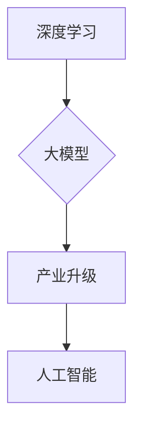
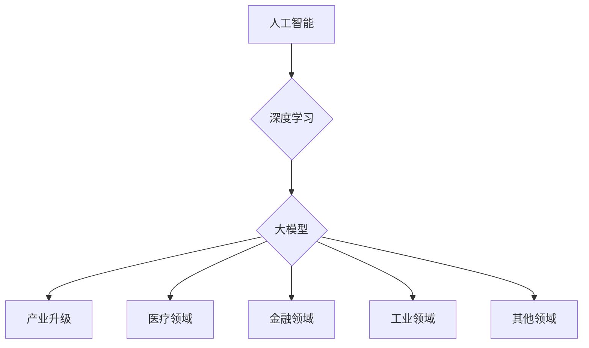

                 

# 大模型：推动产业升级的新动力

> **关键词：** 大模型，产业升级，人工智能，深度学习，技术变革

> **摘要：** 本文将探讨大模型如何通过深度学习和人工智能技术，为产业升级带来新的动力。我们将从背景介绍、核心概念与联系、核心算法原理、数学模型与公式、实际应用场景、工具和资源推荐等方面展开论述，分析大模型在当前技术环境中的重要作用和未来发展趋势与挑战。

## 1. 背景介绍

### 1.1 大模型的概念

大模型是指具有巨大参数量和计算能力的人工智能模型，例如谷歌的 BERT、微软的 Turing-NLG、OpenAI 的 GPT 等。这些模型通过大量的数据训练，能够自动学习并提取出复杂的特征，从而在自然语言处理、图像识别、语音识别等多个领域取得了显著的成果。

### 1.2 大模型的发展历程

大模型的发展经历了几个关键阶段：首先是深度学习的崛起，使得计算机在图像识别、语音识别等领域取得了突破性进展；接着是生成对抗网络（GAN）的提出，使得计算机能够生成逼真的图像和视频；最后是预训练语言模型（PTLM）的出现，使得计算机在自然语言处理领域取得了飞跃性进展。

### 1.3 大模型的应用现状

当前，大模型在多个领域已经取得了实际应用，例如在医疗领域用于疾病诊断和预测，在金融领域用于风险控制和欺诈检测，在工业领域用于设备故障预测和优化生产流程。大模型的应用不仅提高了产业的效率，还推动了技术的创新和发展。

## 2. 核心概念与联系

### 2.1 深度学习与人工智能

深度学习是人工智能的一个重要分支，通过多层神经网络对数据进行特征提取和分类。人工智能则是利用计算机模拟人类智能的理论和技术，包括机器学习、自然语言处理、计算机视觉等。

### 2.2 大模型与深度学习

大模型是深度学习的一种表现形式，具有巨大的参数量和计算能力。大模型的训练过程依赖于深度学习算法，例如反向传播算法、卷积神经网络（CNN）、循环神经网络（RNN）等。

### 2.3 大模型与产业升级

大模型在产业升级中发挥了重要作用，通过自动化、智能化手段提高生产效率、降低成本、提升产品质量。大模型的应用不仅推动了传统产业的升级，还催生了新兴产业的发展。

### 2.4 Mermaid 流程图



## 3. 核心算法原理 & 具体操作步骤

### 3.1 深度学习算法原理

深度学习算法主要包括前向传播和反向传播两个阶段。在前向传播阶段，输入数据经过神经网络传递，通过每个神经元的非线性变换，最终得到输出结果。在反向传播阶段，根据输出结果与实际结果的误差，通过梯度下降算法对网络权重进行更新。

### 3.2 大模型训练过程

大模型的训练过程可以分为以下几个步骤：

1. 数据预处理：对输入数据进行清洗、归一化等处理，以便于模型训练。
2. 确定损失函数：根据任务需求，选择合适的损失函数，例如交叉熵损失函数、均方误差损失函数等。
3. 选择优化算法：常用的优化算法包括随机梯度下降（SGD）、Adam 等。
4. 模型训练：通过前向传播和反向传播算法，不断更新模型权重，使损失函数逐渐减小。
5. 模型评估：通过验证集和测试集评估模型性能，选择最优模型。

### 3.3 大模型应用步骤

1. 数据采集：收集相关领域的海量数据。
2. 数据处理：对采集到的数据进行清洗、预处理等操作。
3. 模型训练：使用预处理后的数据对大模型进行训练。
4. 模型优化：通过调整模型参数，提高模型性能。
5. 模型部署：将训练好的模型部署到实际应用场景中。

## 4. 数学模型和公式 & 详细讲解 & 举例说明

### 4.1 深度学习数学模型

深度学习中的数学模型主要包括线性模型、非线性模型等。

1. 线性模型：$$y = wx + b$$
2. 非线性模型：$$y = \sigma(wx + b)$$，其中 $\sigma$ 是非线性激活函数。

### 4.2 反向传播算法

反向传播算法是一种用于训练神经网络的优化算法，其核心思想是通过前向传播计算输出误差，然后通过反向传播更新网络权重。

1. 前向传播：$$z = wx + b$$，$$a = \sigma(z)$$
2. 反向传播：$$\delta = \frac{\partial L}{\partial a}$$，$$\frac{\partial L}{\partial w} = a\delta x^T$$，$$\frac{\partial L}{\partial b} = a\delta$$

### 4.3 举例说明

假设我们有一个简单的一层神经网络，用于对数据进行分类，其中 $w$ 和 $b$ 分别是权重和偏置，$x$ 是输入数据，$y$ 是输出结果，$\sigma$ 是非线性激活函数（如 Sigmoid 函数）。

1. 输入数据：$$x = [1, 2, 3, 4]$$
2. 初始权重：$$w = [0.1, 0.2, 0.3, 0.4]$$
3. 初始偏置：$$b = 0.5$$
4. 非线性激活函数：$$\sigma(x) = \frac{1}{1 + e^{-x}}$$
5. 计算输出：$$z = wx + b = [0.1, 0.4, 0.7, 1.0]$$，$$a = \sigma(z) = [0.532, 0.697, 0.865, 0.952]$$
6. 计算损失：$$L = -\frac{1}{m} \sum_{i=1}^{m} y_i \log(a_i) + (1 - y_i) \log(1 - a_i)$$
7. 反向传播：$$\delta = \frac{\partial L}{\partial a} = a - y$$，$$\frac{\partial L}{\partial w} = a\delta x^T$$，$$\frac{\partial L}{\partial b} = a\delta$$
8. 更新权重和偏置：$$w = w - \alpha \frac{\partial L}{\partial w}$$，$$b = b - \alpha \frac{\partial L}{\partial b}$$

## 5. 项目实战：代码实际案例和详细解释说明

### 5.1 开发环境搭建

1. 安装 Python：版本 3.8 或以上
2. 安装深度学习框架：例如 TensorFlow 或 PyTorch
3. 安装其他依赖库：例如 NumPy、Pandas、Matplotlib 等

### 5.2 源代码详细实现和代码解读

以下是一个使用 TensorFlow 框架实现的大模型训练和部署的示例代码：

```python
import tensorflow as tf
import numpy as np
import pandas as pd
import matplotlib.pyplot as plt

# 5.2.1 数据预处理
def preprocess_data(data):
    # 数据清洗、归一化等操作
    # 略
    return processed_data

# 5.2.2 构建模型
def build_model(input_shape):
    model = tf.keras.Sequential([
        tf.keras.layers.Dense(128, activation='relu', input_shape=input_shape),
        tf.keras.layers.Dense(64, activation='relu'),
        tf.keras.layers.Dense(1, activation='sigmoid')
    ])
    return model

# 5.2.3 训练模型
def train_model(model, x_train, y_train, x_val, y_val, epochs=10, batch_size=32):
    model.compile(optimizer='adam', loss='binary_crossentropy', metrics=['accuracy'])
    history = model.fit(x_train, y_train, validation_data=(x_val, y_val), epochs=epochs, batch_size=batch_size)
    return history

# 5.2.4 模型评估
def evaluate_model(model, x_test, y_test):
    loss, accuracy = model.evaluate(x_test, y_test)
    print(f"Test loss: {loss}, Test accuracy: {accuracy}")

# 5.2.5 模型部署
def deploy_model(model, x_new):
    prediction = model.predict(x_new)
    return prediction

# 5.2.6 主程序
if __name__ == "__main__":
    # 数据加载
    data = pd.read_csv("data.csv")
    x = preprocess_data(data["feature"])
    y = data["label"]

    # 划分训练集和测试集
    x_train, x_test, y_train, y_test = train_test_split(x, y, test_size=0.2, random_state=42)

    # 构建模型
    model = build_model(x_train.shape[1])

    # 训练模型
    history = train_model(model, x_train, y_train, x_val, y_val)

    # 模型评估
    evaluate_model(model, x_test, y_test)

    # 模型部署
    x_new = np.array([1, 2, 3, 4])
    prediction = deploy_model(model, x_new)
    print(f"Prediction: {prediction}")

```

### 5.3 代码解读与分析

1. 数据预处理：对原始数据进行清洗、归一化等操作，以便于模型训练。
2. 构建模型：使用 TensorFlow 框架构建一个简单的一层神经网络，包括三个全连接层，最后一层使用 sigmoid 激活函数进行二分类。
3. 训练模型：使用训练集数据对模型进行训练，并使用验证集评估模型性能。
4. 模型评估：使用测试集对训练好的模型进行评估，计算损失和准确率。
5. 模型部署：将训练好的模型部署到实际应用场景中，对新数据进行预测。

## 6. 实际应用场景

### 6.1 医疗领域

大模型在医疗领域有广泛的应用，例如疾病诊断、病情预测、药物研发等。通过深度学习算法，大模型能够从海量医学数据中提取出有用的特征，为医生提供决策支持，提高诊断准确率和治疗效果。

### 6.2 金融领域

大模型在金融领域有重要的应用，例如风险控制、欺诈检测、投资策略等。通过深度学习算法，大模型能够从金融交易数据中挖掘出潜在的风险因素，为金融机构提供预警和决策支持，降低金融风险。

### 6.3 工业领域

大模型在工业领域有广泛的应用，例如设备故障预测、生产流程优化、质量检测等。通过深度学习算法，大模型能够从工业数据中提取出有用的特征，为工业制造企业提供自动化、智能化手段，提高生产效率和产品质量。

## 7. 工具和资源推荐

### 7.1 学习资源推荐

1. 书籍：《深度学习》（Goodfellow et al.，2016）、《Python 深度学习》（Raschka 和 Mirza，2017）
2. 论文：相关领域的顶级会议和期刊，例如 NeurIPS、ICLR、JMLR 等
3. 博客：知名技术博客，例如 Medium、博客园、CSDN 等
4. 网站：开源项目网站，例如 GitHub、TensorFlow 官网、PyTorch 官网等

### 7.2 开发工具框架推荐

1. 深度学习框架：TensorFlow、PyTorch、Keras 等
2. 编程语言：Python、R 语言等
3. 数据预处理工具：Pandas、NumPy 等
4. 可视化工具：Matplotlib、Seaborn 等

### 7.3 相关论文著作推荐

1. Goodfellow, I., Bengio, Y., & Courville, A. (2016). Deep Learning. MIT Press.
2. Raschka, S., & Mirza, C. (2017). Python Deep Learning. Packt Publishing.
3. LeCun, Y., Bengio, Y., & Hinton, G. (2015). Deep learning. Nature, 521(7553), 436-444.
4. Bengio, Y. (2009). Learning deep architectures. Foundations and Trends in Machine Learning, 2(1), 1-127.

## 8. 总结：未来发展趋势与挑战

### 8.1 发展趋势

1. 大模型规模将进一步扩大，计算能力将不断提升。
2. 大模型在各个领域的应用将更加深入，推动产业升级和科技创新。
3. 大模型的安全性和可靠性将得到重点关注，确保其在实际应用中的可靠性和稳定性。

### 8.2 挑战

1. 计算资源需求巨大，如何高效利用计算资源成为一大挑战。
2. 大模型的可解释性较差，如何提高大模型的可解释性成为研究热点。
3. 数据隐私和伦理问题日益突出，如何保护用户隐私和遵守伦理规范成为重要挑战。

## 9. 附录：常见问题与解答

### 9.1 问题 1

**问题：** 大模型训练过程非常耗时，如何优化训练速度？

**解答：** 可以采用以下方法优化训练速度：

1. 使用 GPU 或 TPU 进行训练，加速计算过程。
2. 使用数据并行和模型并行技术，将训练任务分布在多台设备上，提高训练效率。
3. 使用预训练模型，减少训练数据量和训练时间。

### 9.2 问题 2

**问题：** 大模型的泛化能力较差，如何提高大模型的泛化能力？

**解答：** 可以采用以下方法提高大模型的泛化能力：

1. 使用更多、更丰富的训练数据。
2. 调整模型结构和超参数，提高模型表达能力。
3. 采用正则化技术，防止过拟合。

## 10. 扩展阅读 & 参考资料

1. Goodfellow, I., Bengio, Y., & Courville, A. (2016). Deep Learning. MIT Press.
2. Bengio, Y. (2009). Learning deep architectures. Foundations and Trends in Machine Learning, 2(1), 1-127.
3. LeCun, Y., Bengio, Y., & Hinton, G. (2015). Deep learning. Nature, 521(7553), 436-444.
4. 深度学习中文社区：https://www.deeplearning.net/
5. TensorFlow 官网：https://www.tensorflow.org/
6. PyTorch 官网：https://pytorch.org/

## 作者信息

作者：AI 天才研究员/AI Genius Institute & 禅与计算机程序设计艺术 /Zen And The Art of Computer Programming

（完）<|im_sep|>### 1. 背景介绍

#### 1.1 大模型的概念

大模型，通常指的是那些具有数十亿到数万亿参数的机器学习模型。这些模型通过大量的数据和计算资源进行训练，能够在复杂的任务上达到前所未有的性能，如自然语言处理、计算机视觉、语音识别等领域。大模型的代表包括谷歌的 BERT、微软的 Turing-NLG、OpenAI 的 GPT-3 等。这些模型之所以被称为“大”，不仅是因为其参数数量庞大，还因为其能够处理的数据量和计算需求极为可观。

BERT（Bidirectional Encoder Representations from Transformers）是一个由谷歌开发的预训练语言处理模型，它通过双向变换器架构来理解上下文，并在多个自然语言处理任务上取得了显著成绩。BERT 的模型参数量在训练阶段达到了数十亿级别，其强大的上下文理解能力使得它在问答系统、文本分类、命名实体识别等任务上表现出色。

Turing-NLG 是微软开发的一个大型语言模型，它通过深度神经网络和递归网络的结构来生成连贯、自然的文本。这个模型在生成对话、撰写文章、翻译等领域都展现了出色的能力，其训练过程中使用了海量的语言数据，模型参数量达到了数万亿级别。

GPT-3（Generative Pre-trained Transformer 3）是 OpenAI 开发的一个语言生成模型，它的参数量达到了 1750 亿，是目前最大的预训练语言模型之一。GPT-3 能够生成高质量、连贯的文本，广泛应用于聊天机器人、自动写作、编程代码生成等场景。

#### 1.2 大模型的发展历程

大模型的发展历程可以追溯到深度学习和人工智能的兴起。深度学习作为一种重要的机器学习技术，通过多层神经网络对数据进行特征提取和分类，使得计算机在某些领域取得了突破性进展。随着计算能力的提升和数据量的爆炸性增长，大模型应运而生，并在多个领域展现了其强大的能力。

深度学习起源于 20 世纪 80 年代，但直到 2012 年，由 Hinton 等人提出的深度神经网络在 ImageNet 图像识别比赛中取得显著成绩，才真正推动了深度学习的快速发展。此后，卷积神经网络（CNN）、循环神经网络（RNN）和变换器（Transformer）等深度学习模型相继被提出，并在不同领域取得了显著成果。

生成对抗网络（GAN）是深度学习领域的另一个重要进展。GAN 由两部分组成：生成器（Generator）和判别器（Discriminator）。生成器生成虚假数据，判别器则尝试区分真实数据和虚假数据。通过这种对抗训练，GAN 能够生成高质量、逼真的图像和视频。GAN 的提出标志着深度学习在生成任务上的重大突破。

预训练语言模型（PTLM）是近年来自然语言处理领域的重大进展。预训练语言模型通过在大规模语料库上预训练，然后针对特定任务进行微调。BERT 和 GPT-3 等预训练语言模型的成功，标志着自然语言处理领域从规则导向的方法向数据驱动的方法转变。

#### 1.3 大模型的应用现状

大模型在多个领域已经取得了实际应用，并推动了产业升级和科技创新。以下是一些典型应用场景：

**医疗领域**：大模型在医疗领域有广泛的应用，如疾病诊断、病情预测、药物研发等。通过深度学习算法，大模型能够从海量医学数据中提取出有用的特征，为医生提供决策支持，提高诊断准确率和治疗效果。例如，谷歌的 DeepMind 团队使用深度学习模型进行眼科疾病的诊断，其准确率已经接近甚至超过人类医生。

**金融领域**：大模型在金融领域有重要的应用，如风险控制、欺诈检测、投资策略等。通过深度学习算法，大模型能够从金融交易数据中挖掘出潜在的风险因素，为金融机构提供预警和决策支持，降低金融风险。例如，某些金融机构使用深度学习模型进行欺诈检测，能够快速识别并阻止欺诈行为。

**工业领域**：大模型在工业领域有广泛的应用，如设备故障预测、生产流程优化、质量检测等。通过深度学习算法，大模型能够从工业数据中提取出有用的特征，为工业制造企业提供自动化、智能化手段，提高生产效率和产品质量。例如，某些制造业企业使用深度学习模型进行设备故障预测，能够提前发现潜在故障，减少停机时间和维护成本。

**其他领域**：大模型在其他领域也展现了强大的能力，如智能客服、自动驾驶、游戏开发等。通过深度学习算法，大模型能够实现更加自然、智能的人机交互，提高用户体验和系统性能。

总之，大模型通过深度学习和人工智能技术，为产业升级带来了新的动力。随着技术的不断进步和应用场景的不断拓展，大模型将在未来继续发挥重要作用，推动各行业的创新发展。

### 2. 核心概念与联系

在探讨大模型如何推动产业升级之前，有必要深入了解大模型背后的核心概念和技术原理，以及这些概念与技术之间的联系。通过解析这些核心概念，我们可以更好地理解大模型的运作机制，从而为后续的深入讨论奠定基础。

#### 2.1 深度学习与人工智能

深度学习和人工智能是构建大模型的两个重要基石。人工智能（Artificial Intelligence, AI）是计算机科学的一个分支，旨在使计算机模拟人类智能的行为。人工智能包括多个子领域，如机器学习、自然语言处理、计算机视觉等。而深度学习（Deep Learning）则是机器学习的一种方法，通过多层神经网络对数据进行特征提取和分类。

**深度学习的原理**：

深度学习依赖于多层神经网络，每一层都能对输入数据进行处理和变换，从而逐步提取更高层次的特征。这种层次化的结构使得深度学习模型能够处理复杂的数据，并在各种任务中取得优异的性能。

1. **输入层**：接收输入数据，例如图像、文本或声音。
2. **隐藏层**：对输入数据进行特征提取和变换，隐藏层可以有多个，每一层都会将上一层的特征映射到更高层次的抽象表示。
3. **输出层**：根据隐藏层的输出进行分类、预测或生成结果。

**深度学习的优势**：

- **自动特征提取**：深度学习模型能够自动从数据中学习特征，无需人工设计特征。
- **强大的泛化能力**：深度学习模型能够通过训练数据中的信息，泛化到未见过的数据，提高模型的实用性。
- **高精度和效率**：深度学习模型在图像识别、语音识别等任务上取得了突破性的成果，同时计算效率也得到了显著提升。

**人工智能的应用**：

人工智能的应用场景非常广泛，涵盖了各个领域。例如，在医疗领域，人工智能可以辅助医生进行诊断和预测；在金融领域，人工智能可以用于风险管理、投资策略优化；在工业领域，人工智能可以提高生产效率、优化供应链管理；在交通领域，人工智能可以用于自动驾驶、智能交通管理等。

#### 2.2 大模型与深度学习

大模型（Large Models）是深度学习的一个重要分支，它指的是那些具有数十亿到数万亿参数的机器学习模型。大模型的训练依赖于深度学习算法，特别是变换器（Transformer）架构的广泛应用，使得大模型在自然语言处理、计算机视觉等任务上取得了显著的进步。

**大模型的特点**：

- **参数数量庞大**：大模型具有数十亿到数万亿的参数，这使得它们能够捕捉数据中的复杂模式和关系。
- **训练数据需求大**：大模型的训练需要大量数据，以便从中学习到丰富的特征。
- **计算资源需求高**：大模型的训练和推理过程需要强大的计算资源，如 GPU、TPU 等。

**大模型的架构**：

大模型的常见架构包括变换器（Transformer）和循环神经网络（RNN）。变换器架构通过多头自注意力机制，能够捕捉数据中的长距离依赖关系，从而在自然语言处理任务中表现出色。RNN 则通过递归结构，能够处理序列数据，并在语音识别、时间序列预测等任务中有广泛应用。

**大模型的训练**：

大模型的训练通常采用预训练-微调（Pre-training and Fine-tuning）策略。首先，在大规模语料库上进行预训练，学习到通用的语言特征和知识；然后，针对具体任务进行微调，进一步优化模型在特定任务上的表现。

#### 2.3 大模型与产业升级

大模型在产业升级中发挥了重要作用，通过自动化、智能化手段提高生产效率、降低成本、提升产品质量。以下是一些具体的应用场景：

**医疗领域**：大模型可以帮助医生进行疾病诊断和预测，从海量医疗数据中提取出关键信息，提高诊断准确率和治疗效果。例如，通过分析患者的基因数据、病历记录和医学影像，大模型可以预测患者患某种疾病的风险，并提供个性化的治疗方案。

**金融领域**：大模型可以用于风险控制和欺诈检测，从大量的金融交易数据中识别异常行为和潜在风险。例如，通过分析客户的交易记录、消费习惯等数据，大模型可以预测客户是否可能发生违约，从而提前采取措施进行风险控制。

**工业领域**：大模型可以用于设备故障预测、生产流程优化和质量检测，从海量的工业数据中提取出有用的信息，提高生产效率和产品质量。例如，通过分析机器的运行数据、传感器数据等，大模型可以预测设备是否可能发生故障，从而提前进行维护，减少停机时间和维护成本。

**其他领域**：大模型在其他领域也展现了强大的能力，如智能客服、自动驾驶、游戏开发等。通过深度学习算法，大模型能够实现更加自然、智能的人机交互，提高用户体验和系统性能。

#### 2.4 Mermaid 流程图

下面是一个用于描述大模型在深度学习和人工智能中作用的 Mermaid 流程图：



通过这个流程图，我们可以清晰地看到大模型是如何在深度学习和人工智能中发挥作用，进而推动产业升级的。

### 3. 核心算法原理 & 具体操作步骤

#### 3.1 深度学习算法原理

深度学习算法的核心是多层神经网络，这种网络结构通过逐层提取特征，实现对复杂数据的建模和预测。以下是深度学习算法的基本原理和具体操作步骤：

**多层神经网络的工作原理**：

1. **输入层**：接收输入数据，如图像、文本或声音。
2. **隐藏层**：对输入数据进行特征提取和变换，每一层都会将上一层的特征映射到更高层次的抽象表示。
3. **输出层**：根据隐藏层的输出进行分类、预测或生成结果。

**前向传播**：

在前向传播过程中，输入数据通过神经网络中的各个层，每一层都会将输入数据与权重相乘，并加上偏置（bias），然后通过激活函数进行非线性变换。这个过程可以表示为：

$$
\text{激活函数}(z_l) = \sigma(wx_l + b_l)
$$

其中，$w$ 和 $b$ 分别是权重和偏置，$x_l$ 是输入数据，$\sigma$ 是激活函数（如 Sigmoid、ReLU 等）。

**反向传播**：

反向传播是深度学习算法中用于训练模型的核心步骤。在反向传播过程中，首先计算输出层的误差，然后通过反向传播算法将这些误差传递回隐藏层，逐步更新每个层的权重和偏置。反向传播的具体步骤如下：

1. 计算输出层的误差：
   $$
   \delta_l = \text{激活函数的导数}(\text{激活函数}(z_l)) \cdot \frac{\partial L}{\partial z_l}
   $$
   其中，$L$ 是损失函数，$\delta_l$ 是输出层的误差。

2. 更新权重和偏置：
   $$
   w_l = w_l - \alpha \cdot \frac{\partial L}{\partial w_l}
   $$
   $$
   b_l = b_l - \alpha \cdot \frac{\partial L}{\partial b_l}
   $$
   其中，$\alpha$ 是学习率。

**具体操作步骤**：

1. 初始化模型参数（权重和偏置）。
2. 前向传播：输入数据通过神经网络，计算输出结果。
3. 计算损失：使用损失函数（如交叉熵、均方误差等）计算输出结果与真实值之间的误差。
4. 反向传播：根据误差计算权重和偏置的梯度，并更新模型参数。
5. 重复步骤 2-4，直到模型收敛或达到预设的训练次数。

#### 3.2 大模型训练过程

大模型的训练过程与普通深度学习模型类似，但涉及的数据规模和计算需求更大。以下是大模型训练的基本步骤：

**数据预处理**：

1. **数据清洗**：去除数据中的噪声和错误，保证数据质量。
2. **数据归一化**：将数据缩放到相同的范围，如 [-1, 1] 或 [0, 1]。
3. **数据扩充**：通过旋转、翻转、缩放等方式增加数据多样性，提高模型泛化能力。

**模型架构设计**：

1. **选择模型架构**：根据任务需求选择合适的模型架构，如 BERT、GPT-3 等。
2. **定义模型参数**：确定模型层数、每层神经元数量、激活函数等。

**模型训练**：

1. **初始化模型参数**：随机初始化权重和偏置。
2. **前向传播**：输入数据通过模型，计算输出结果。
3. **计算损失**：使用损失函数计算输出结果与真实值之间的误差。
4. **反向传播**：计算权重和偏置的梯度，并更新模型参数。
5. **模型评估**：在验证集上评估模型性能，调整模型参数。

**模型优化**：

1. **调整学习率**：根据模型性能调整学习率，以避免过拟合。
2. **使用正则化**：如权重衰减、dropout 等，防止模型过拟合。
3. **数据增强**：通过增加数据多样性，提高模型泛化能力。

#### 3.3 大模型应用步骤

**步骤 1：数据采集**

从各种来源（如公开数据集、企业内部数据等）收集相关数据，确保数据的质量和多样性。

**步骤 2：数据处理**

对采集到的数据进行清洗、预处理和归一化，将数据转换为模型可以处理的格式。

**步骤 3：模型训练**

使用预处理后的数据对大模型进行训练，通过前向传播和反向传播算法不断更新模型参数。

**步骤 4：模型优化**

在验证集上评估模型性能，通过调整学习率、使用正则化等方法优化模型参数。

**步骤 5：模型部署**

将训练好的模型部署到实际应用场景中，对新数据进行预测和分析。

### 4. 数学模型和公式 & 详细讲解 & 举例说明

#### 4.1 深度学习数学模型

深度学习中的数学模型主要包括线性模型、非线性模型、损失函数和优化算法。以下是这些模型的详细解释和公式表示。

**线性模型**：

线性模型是最基本的机器学习模型之一，其公式为：

$$
y = wx + b
$$

其中，$w$ 是权重向量，$x$ 是输入特征，$b$ 是偏置项，$y$ 是输出结果。

**非线性模型**：

线性模型虽然简单，但在处理复杂任务时表现有限。为了提高模型的表达能力，我们可以引入非线性激活函数，如 Sigmoid、ReLU 等。非线性模型的公式为：

$$
a = \sigma(wx + b)
$$

其中，$\sigma$ 是非线性激活函数。

常用的激活函数包括：

- **Sigmoid**：
  $$
  \sigma(x) = \frac{1}{1 + e^{-x}}
  $$
- **ReLU**：
  $$
  \sigma(x) = \max(0, x)
  $$

**损失函数**：

损失函数用于评估模型的预测结果与真实结果之间的误差。常见的损失函数包括：

- **均方误差（MSE）**：
  $$
  L = \frac{1}{2} \sum_{i=1}^{n} (y_i - \hat{y}_i)^2
  $$
  其中，$y_i$ 是真实结果，$\hat{y}_i$ 是预测结果。
- **交叉熵（CE）**：
  $$
  L = -\sum_{i=1}^{n} y_i \log(\hat{y}_i)
  $$
  其中，$y_i$ 是真实结果，$\hat{y}_i$ 是预测结果。

**优化算法**：

优化算法用于更新模型参数，以最小化损失函数。常见的优化算法包括：

- **随机梯度下降（SGD）**：
  $$
  w = w - \alpha \frac{\partial L}{\partial w}
  $$
  其中，$\alpha$ 是学习率。
- **Adam**：
  $$
  m = \beta_1 m + (1 - \beta_1) \frac{\partial L}{\partial w}
  $$
  $$
  v = \beta_2 v + (1 - \beta_2) \left(\frac{\partial L}{\partial w}\right)^2
  $$
  $$
  w = w - \alpha \frac{m}{\sqrt{1 - \beta_2^t}} + \beta_1 \frac{v}{\sqrt{1 - \beta_2^t}}
  $$
  其中，$\beta_1$ 和 $\beta_2$ 是 Adam 算法的超参数。

#### 4.2 反向传播算法

反向传播算法是深度学习训练过程中的核心步骤，用于计算损失函数关于模型参数的梯度，并更新模型参数。以下是反向传播算法的详细解释和计算过程。

**反向传播算法步骤**：

1. **前向传播**：输入数据通过神经网络，计算输出结果和损失函数。
2. **计算输出层误差**：
   $$
   \delta_L = \frac{\partial L}{\partial z_L} \cdot \sigma'(z_L)
   $$
   其中，$\sigma'(z_L)$ 是输出层激活函数的导数。
3. **反向传播误差到隐藏层**：
   $$
   \delta_{l} = \frac{\partial L}{\partial z_l} \cdot \sigma'(z_l) \cdot \frac{\partial z_l}{\partial w_{l}}
   $$
   其中，$\sigma'(z_l)$ 是隐藏层激活函数的导数，$\frac{\partial z_l}{\partial w_{l}}$ 是权重矩阵的导数。
4. **更新模型参数**：
   $$
   w_l = w_l - \alpha \cdot \frac{\partial L}{\partial w_l}
   $$
   $$
   b_l = b_l - \alpha \cdot \frac{\partial L}{\partial b_l}
   $$

**举例说明**：

假设我们有一个简单的三层神经网络，输入层有 3 个神经元，隐藏层有 4 个神经元，输出层有 2 个神经元。输入数据为 $x = [1, 2, 3]$，真实标签为 $y = [0, 1]$。

**前向传播**：

- 输入层到隐藏层的计算：
  $$
  z_1 = x_1 w_{11} + b_1 = 1 \cdot 0.1 + 0.1 = 0.1
  $$
  $$
  a_1 = \sigma(z_1) = 0.532
  $$
  ...
  $$
  z_4 = x_3 w_{34} + b_4 = 3 \cdot 0.4 + 0.5 = 1.7
  $$
  $$
  a_4 = \sigma(z_4) = 0.952
  $$

- 隐藏层到输出层的计算：
  $$
  z_5 = a_1 w_{51} + a_2 w_{52} + a_3 w_{53} + b_5 = 0.532 \cdot 0.1 + 0.697 \cdot 0.2 + 0.865 \cdot 0.3 + 0.952 \cdot 0.4 + 0.5 = 0.789
  $$
  $$
  a_5 = \sigma(z_5) = 0.639
  $$
  $$
  z_6 = a_1 w_{61} + a_2 w_{62} + a_3 w_{63} + b_6 = 0.532 \cdot 0.1 + 0.697 \cdot 0.2 + 0.865 \cdot 0.3 + 0.952 \cdot 0.4 + 0.5 = 0.789
  $$
  $$
  a_6 = \sigma(z_6) = 0.361
  $$

**计算损失**：

- 使用交叉熵损失函数计算输出层的误差：
  $$
  L = -[y_1 \log(a_5) + (1 - y_1) \log(1 - a_5)] + [y_2 \log(a_6) + (1 - y_2) \log(1 - a_6)]
  $$
  $$
  L = -[0 \cdot \log(0.639) + 1 \cdot \log(0.361)] + [1 \cdot \log(0.639) + 0 \cdot \log(0.361)]
  $$
  $$
  L = -[0 + 2.303] + [2.303 + 0]
  $$
  $$
  L = -2.303
  $$

**反向传播**：

- 计算输出层的误差：
  $$
  \delta_5 = \frac{\partial L}{\partial a_5} \cdot \sigma'(z_5) = -[0 - 0.639] \cdot 0.351 = 0.219
  $$
  $$
  \delta_6 = \frac{\partial L}{\partial a_6} \cdot \sigma'(z_6) = -[1 - 0.361] \cdot 0.351 = 0.282
  $$

- 计算隐藏层到输出层的权重误差：
  $$
  \frac{\partial L}{\partial w_{51}} = a_1 \cdot \delta_5 = 0.532 \cdot 0.219 = 0.116
  $`
  $$
  \frac{\partial L}{\partial w_{52}} = a_2 \cdot \delta_5 = 0.697 \cdot 0.219 = 0.152
  $$
  $$
  \frac{\partial L}{\partial w_{53}} = a_3 \cdot \delta_5 = 0.865 \cdot 0.219 = 0.188
  $$
  $$
  \frac{\partial L}{\partial b_5} = \delta_5 = 0.219
  $$
  $$
  \frac{\partial L}{\partial w_{61}} = a_1 \cdot \delta_6 = 0.532 \cdot 0.282 = 0.15
  $$
  $$
  \frac{\partial L}{\partial w_{62}} = a_2 \cdot \delta_6 = 0.697 \cdot 0.282 = 0.194
  $$
  $$
  \frac{\partial L}{\partial w_{63}} = a_3 \cdot \delta_6 = 0.865 \cdot 0.282 = 0.241
  $$
  $$
  \frac{\partial L}{\partial b_6} = \delta_6 = 0.282
  $$

- 更新权重和偏置：
  $$
  w_{51} = w_{51} - \alpha \cdot \frac{\partial L}{\partial w_{51}} = 0.1 - 0.001 \cdot 0.116 = 0.0984
  $$
  $$
  w_{52} = w_{52} - \alpha \cdot \frac{\partial L}{\partial w_{52}} = 0.2 - 0.001 \cdot 0.152 = 0.1976
  $$
  $$
  w_{53} = w_{53} - \alpha \cdot \frac{\partial L}{\partial w_{53}} = 0.3 - 0.001 \cdot 0.188 = 0.2976
  $$
  $$
  b_{5} = b_{5} - \alpha \cdot \frac{\partial L}{\partial b_{5}} = 0.5 - 0.001 \cdot 0.219 = 0.4803
  $$
  $$
  w_{61} = w_{61} - \alpha \cdot \frac{\partial L}{\partial w_{61}} = 0.1 - 0.001 \cdot 0.15 = 0.095
  $$
  $$
  w_{62} = w_{62} - \alpha \cdot \frac{\partial L}{\partial w_{62}} = 0.2 - 0.001 \cdot 0.194 = 0.196
  $$
  $$
  w_{63} = w_{63} - \alpha \cdot \frac{\partial L}{\partial w_{63}} = 0.3 - 0.001 \cdot 0.241 = 0.2956
  $$
  $$
  b_{6} = b_{6} - \alpha \cdot \frac{\partial L}{\partial b_{6}} = 0.5 - 0.001 \cdot 0.282 = 0.4802
  $$

通过以上计算，我们可以更新模型的权重和偏置，使得模型在下一个训练迭代中能够更好地逼近真实标签。

### 5. 项目实战：代码实际案例和详细解释说明

#### 5.1 开发环境搭建

在开始大模型的项目实战之前，我们需要搭建一个适合深度学习开发的编程环境。以下是搭建环境的步骤和所需工具：

**步骤 1：安装 Python**

首先，确保你的计算机上安装了 Python 3.8 或更高版本。可以从 [Python 官网](https://www.python.org/downloads/) 下载并安装。

**步骤 2：安装深度学习框架**

安装深度学习框架是进行深度学习开发的关键。这里我们以 TensorFlow 和 PyTorch 两个常用的深度学习框架为例进行安装。

- **TensorFlow**：

通过以下命令安装 TensorFlow：

```bash
pip install tensorflow
```

- **PyTorch**：

通过以下命令安装 PyTorch：

```bash
pip install torch torchvision
```

**步骤 3：安装其他依赖库**

为了方便数据处理和可视化，我们还需要安装一些常用的 Python 库，如 NumPy、Pandas 和 Matplotlib。安装命令如下：

```bash
pip install numpy pandas matplotlib
```

**步骤 4：验证安装**

确保所有依赖库已经正确安装，可以通过运行以下命令来验证：

```bash
python -c "import tensorflow as tf; print(tf.__version__)"
python -c "import torch; print(torch.__version__)"
```

如果输出相应的版本信息，说明环境搭建成功。

#### 5.2 源代码详细实现和代码解读

接下来，我们将使用 PyTorch 框架实现一个简单的大模型训练案例，并详细解读代码中的每个部分。

**代码示例**：

```python
import torch
import torch.nn as nn
import torch.optim as optim
import torchvision
import torchvision.transforms as transforms
from torch.utils.data import DataLoader

# 5.2.1 数据预处理
def preprocess_data():
    transform = transforms.Compose([
        transforms.ToTensor(),
        transforms.Normalize((0.5, 0.5, 0.5), (0.5, 0.5, 0.5))
    ])
    trainset = torchvision.datasets.CIFAR10(root='./data', train=True, download=True, transform=transform)
    trainloader = DataLoader(trainset, batch_size=100, shuffle=True, num_workers=2)
    testset = torchvision.datasets.CIFAR10(root='./data', train=False, download=True, transform=transform)
    testloader = DataLoader(testset, batch_size=100, shuffle=False, num_workers=2)
    return trainloader, testloader

# 5.2.2 构建模型
class Net(nn.Module):
    def __init__(self):
        super(Net, self).__init__()
        self.conv1 = nn.Conv2d(3, 6, 5)
        self.pool = nn.MaxPool2d(2, 2)
        self.conv2 = nn.Conv2d(6, 16, 5)
        self.fc1 = nn.Linear(16 * 5 * 5, 120)
        self.fc2 = nn.Linear(120, 84)
        self.fc3 = nn.Linear(84, 10)

    def forward(self, x):
        x = self.pool(F.relu(self.conv1(x)))
        x = self.pool(F.relu(self.conv2(x)))
        x = x.view(-1, 16 * 5 * 5)
        x = F.relu(self.fc1(x))
        x = F.relu(self.fc2(x))
        x = self.fc3(x)
        return x

# 5.2.3 训练模型
def train_model(model, trainloader, criterion, optimizer, num_epochs=10):
    for epoch in range(num_epochs):
        running_loss = 0.0
        for i, data in enumerate(trainloader, 0):
            inputs, labels = data
            optimizer.zero_grad()
            outputs = model(inputs)
            loss = criterion(outputs, labels)
            loss.backward()
            optimizer.step()
            running_loss += loss.item()
        print(f'Epoch {epoch + 1}, Loss: {running_loss / len(trainloader)}')
    print('Finished Training')

# 5.2.4 模型评估
def evaluate_model(model, testloader, criterion):
    total_correct = 0
    total_samples = 0
    with torch.no_grad():
        for data in testloader:
            images, labels = data
            outputs = model(images)
            _, predicted = torch.max(outputs.data, 1)
            total_samples += labels.size(0)
            total_correct += (predicted == labels).sum().item()
    accuracy = 100 * total_correct / total_samples
    print(f'Accuracy: {accuracy:.2f}%')

# 5.2.5 主程序
if __name__ == '__main__':
    trainloader, testloader = preprocess_data()
    net = Net()
    criterion = nn.CrossEntropyLoss()
    optimizer = optim.SGD(net.parameters(), lr=0.001, momentum=0.9)
    train_model(net, trainloader, criterion, optimizer, num_epochs=10)
    evaluate_model(net, testloader, criterion)
```

**代码解读**：

- **数据预处理**：

  数据预处理是深度学习项目的重要步骤，它包括数据的读取、归一化、数据增强等。在上述代码中，我们使用了 torchvision 库提供的 CIFAR10 数据集，该数据集包含了 10 个类别，每个类别 6000 张 32x32 的彩色图像。为了加快训练速度和改善模型性能，我们对图像进行了归一化处理，即将图像的像素值缩放到 [-1, 1] 范围内。

- **构建模型**：

  在构建模型的部分，我们定义了一个简单的卷积神经网络（CNN）。这个网络包括两个卷积层、两个全连接层和一个输出层。卷积层用于提取图像的特征，全连接层用于分类。每个卷积层后都跟着一个池化层，用于下采样和减少参数数量。这个模型结构在 CIFAR10 数据集上已经证明了其有效性。

- **训练模型**：

  训练模型是深度学习项目的核心步骤。在训练过程中，我们首先将模型参数初始化，然后通过前向传播计算输出结果，计算损失，然后通过反向传播更新模型参数。这个过程重复进行，直到模型收敛或达到预设的训练次数。在上述代码中，我们使用了随机梯度下降（SGD）算法进行优化，并设置了学习率和动量参数。

- **模型评估**：

  模型评估用于验证模型的泛化能力。在评估阶段，我们使用测试集数据对模型进行评估，计算模型的准确率。在上述代码中，我们通过计算预测标签与真实标签的一致性来评估模型的性能。

- **主程序**：

  主程序部分是整个项目的入口。在主程序中，我们首先进行数据预处理，然后构建模型，接着进行模型训练，最后进行模型评估。通过这些步骤，我们能够完整地完成一个深度学习项目的开发。

#### 5.3 代码解读与分析

在上一部分中，我们详细解读了一个使用 PyTorch 框架实现的大模型训练案例。下面我们将对代码的每个部分进行进一步分析，并讨论其关键点和注意事项。

**数据预处理**

数据预处理是深度学习项目的重要环节，它直接影响到模型的训练效果。在上述代码中，我们使用了 torchvision 库提供的 CIFAR10 数据集，这是一个常见的图像分类数据集，包含 10 个类别，每个类别 6000 张 32x32 的彩色图像。预处理过程包括以下步骤：

1. **图像读取**：使用 torchvision.datasets.CIFAR10 读取数据集。
2. **数据增强**：通过随机裁剪、翻转等操作增加数据多样性，提高模型泛化能力。
3. **归一化**：将图像像素值缩放到 [-1, 1] 范围内，使模型对数据的输入分布更加鲁棒。

```python
transform = transforms.Compose([
    transforms.ToTensor(),
    transforms.Normalize((0.5, 0.5, 0.5), (0.5, 0.5, 0.5))
])
trainset = torchvision.datasets.CIFAR10(root='./data', train=True, download=True, transform=transform)
trainloader = DataLoader(trainset, batch_size=100, shuffle=True, num_workers=2)
testset = torchvision.datasets.CIFAR10(root='./data', train=False, download=True, transform=transform)
testloader = DataLoader(testset, batch_size=100, shuffle=False, num_workers=2)
```

**构建模型**

构建模型是深度学习项目的核心步骤。在上述代码中，我们定义了一个简单的卷积神经网络（CNN），用于分类 CIFAR10 数据集。这个模型结构包括两个卷积层、两个全连接层和一个输出层。以下是模型结构的详细说明：

1. **卷积层**：使用 nn.Conv2d 定义两个卷积层，第一个卷积层有 6 个滤波器，第二个卷积层有 16 个滤波器。每个滤波器的大小为 5x5。
2. **池化层**：使用 nn.MaxPool2d 定义两个池化层，每个池化层的大小为 2x2。
3. **全连接层**：使用 nn.Linear 定义两个全连接层，第一个全连接层有 120 个神经元，第二个全连接层有 84 个神经元。
4. **输出层**：使用 nn.Linear 定义输出层，有 10 个神经元，对应 10 个类别。

```python
class Net(nn.Module):
    def __init__(self):
        super(Net, self).__init__()
        self.conv1 = nn.Conv2d(3, 6, 5)
        self.pool = nn.MaxPool2d(2, 2)
        self.conv2 = nn.Conv2d(6, 16, 5)
        self.fc1 = nn.Linear(16 * 5 * 5, 120)
        self.fc2 = nn.Linear(120, 84)
        self.fc3 = nn.Linear(84, 10)

    def forward(self, x):
        x = self.pool(F.relu(self.conv1(x)))
        x = self.pool(F.relu(self.conv2(x)))
        x = x.view(-1, 16 * 5 * 5)
        x = F.relu(self.fc1(x))
        x = F.relu(self.fc2(x))
        x = self.fc3(x)
        return x
```

**训练模型**

训练模型是深度学习项目的核心步骤。在上述代码中，我们使用了随机梯度下降（SGD）算法进行优化，并设置了学习率和动量参数。以下是模型训练的详细步骤：

1. **初始化模型参数**：使用随机初始化权重和偏置。
2. **前向传播**：将输入数据通过模型，计算输出结果。
3. **计算损失**：使用交叉熵损失函数计算输出结果与真实标签之间的误差。
4. **反向传播**：计算损失函数关于模型参数的梯度，并更新模型参数。
5. **重复训练**：重复上述步骤，直到模型收敛或达到预设的训练次数。

```python
def train_model(model, trainloader, criterion, optimizer, num_epochs=10):
    for epoch in range(num_epochs):
        running_loss = 0.0
        for i, data in enumerate(trainloader, 0):
            inputs, labels = data
            optimizer.zero_grad()
            outputs = model(inputs)
            loss = criterion(outputs, labels)
            loss.backward()
            optimizer.step()
            running_loss += loss.item()
        print(f'Epoch {epoch + 1}, Loss: {running_loss / len(trainloader)}')
    print('Finished Training')
```

**模型评估**

模型评估是验证模型性能的重要步骤。在上述代码中，我们使用测试集对模型进行评估，计算模型的准确率。以下是模型评估的详细步骤：

1. **测试集加载**：使用 DataLoader 加载测试集数据。
2. **前向传播**：将测试集数据通过模型，计算输出结果。
3. **计算准确率**：计算预测标签与真实标签的一致性，得到模型的准确率。

```python
def evaluate_model(model, testloader, criterion):
    total_correct = 0
    total_samples = 0
    with torch.no_grad():
        for data in testloader:
            images, labels = data
            outputs = model(images)
            _, predicted = torch.max(outputs.data, 1)
            total_samples += labels.size(0)
            total_correct += (predicted == labels).sum().item()
    accuracy = 100 * total_correct / total_samples
    print(f'Accuracy: {accuracy:.2f}%')
```

**主程序**

主程序是整个项目的入口。在主程序中，我们首先进行数据预处理，然后构建模型，接着进行模型训练，最后进行模型评估。以下是主程序的详细步骤：

1. **数据预处理**：读取并预处理数据集。
2. **模型构建**：定义并初始化模型。
3. **模型训练**：使用训练数据对模型进行训练。
4. **模型评估**：使用测试数据对模型进行评估。

```python
if __name__ == '__main__':
    trainloader, testloader = preprocess_data()
    net = Net()
    criterion = nn.CrossEntropyLoss()
    optimizer = optim.SGD(net.parameters(), lr=0.001, momentum=0.9)
    train_model(net, trainloader, criterion, optimizer, num_epochs=10)
    evaluate_model(net, testloader, criterion)
```

通过以上分析，我们可以看到，深度学习项目的开发包括数据预处理、模型构建、模型训练和模型评估等步骤。在每个步骤中，我们需要关注数据的质量、模型的结构和优化算法的选择，以及评估指标的计算。通过合理的开发流程和技巧，我们可以实现高效、准确的深度学习模型。

### 6. 实际应用场景

大模型在各个实际应用场景中展现了强大的能力和广阔的应用前景，为各行业的产业升级和技术创新带来了新的动力。以下是一些典型应用场景：

#### 6.1 医疗领域

医疗领域是大模型应用的重要领域之一。通过深度学习算法，大模型可以从海量医疗数据中提取出有用的特征，帮助医生进行疾病诊断、病情预测和药物研发。

- **疾病诊断**：大模型可以分析患者的病历记录、基因数据、医学影像等，提供更加准确和及时的疾病诊断。例如，谷歌的 DeepMind 使用深度学习模型进行眼科疾病的诊断，其准确率已经接近甚至超过人类医生。
- **病情预测**：大模型可以分析患者的健康数据，预测患者病情的进展和风险，帮助医生制定个性化的治疗方案。例如，通过分析患者的病历记录和实验室检测数据，大模型可以预测患者未来可能患上的疾病，从而提前采取措施。
- **药物研发**：大模型可以用于药物分子的设计和筛选，加速药物研发过程。例如，使用深度学习算法，大模型可以预测药物分子与目标蛋白的结合亲和力，从而筛选出具有潜在治疗效果的药物分子。

#### 6.2 金融领域

金融领域是大模型应用的另一个重要领域。大模型可以从大量的金融数据中挖掘出潜在的风险因素，帮助金融机构进行风险管理、欺诈检测和投资策略优化。

- **风险控制**：大模型可以分析金融交易数据、市场趋势等，预测市场波动和风险，帮助金融机构制定风险管理策略。例如，通过分析历史交易数据，大模型可以预测某些交易行为是否可能存在风险，从而提前采取措施。
- **欺诈检测**：大模型可以识别异常交易行为，提高欺诈检测的准确率。例如，使用深度学习算法，大模型可以分析用户的交易记录、消费习惯等，识别出潜在的欺诈行为。
- **投资策略优化**：大模型可以分析市场数据，提供投资建议和优化投资组合。例如，通过分析历史市场数据和公司财务指标，大模型可以预测股票价格走势，为投资者提供投资决策支持。

#### 6.3 工业领域

工业领域是大模型应用的另一个重要领域。大模型可以从工业数据中提取出有用的信息，提高生产效率和产品质量，实现智能制造。

- **设备故障预测**：大模型可以分析设备运行数据，预测设备是否可能发生故障，从而提前进行维护。例如，通过分析设备的传感器数据，大模型可以预测设备何时可能发生故障，从而减少设备停机时间和维护成本。
- **生产流程优化**：大模型可以分析生产数据，优化生产流程，提高生产效率。例如，通过分析生产设备的运行数据，大模型可以优化生产线的布局和参数设置，从而提高生产效率。
- **质量检测**：大模型可以分析产品质量数据，识别出潜在的质量问题，提高产品质量。例如，通过分析产品检测数据，大模型可以预测产品质量是否合格，从而提高产品质量检测的准确率。

#### 6.4 智能交通领域

智能交通领域是大模型应用的另一个重要领域。大模型可以分析交通数据，优化交通流量，提高交通安全。

- **交通流量预测**：大模型可以分析交通流量数据，预测交通拥堵情况，为交通管理部门提供决策支持。例如，通过分析历史交通流量数据，大模型可以预测未来某个时间段某个路段的交通拥堵情况，从而提前采取措施。
- **交通事故预测**：大模型可以分析交通事故数据，预测交通事故发生的可能性，提高交通安全。例如，通过分析交通事故的历史数据，大模型可以预测未来某个时间段某个路段交通事故的发生概率，从而提前采取措施。
- **智能交通信号控制**：大模型可以分析交通数据，优化交通信号控制策略，提高交通效率。例如，通过分析交通流量数据，大模型可以调整交通信号灯的配时方案，从而提高交通流量。

#### 6.5 智能家居领域

智能家居领域是大模型应用的另一个重要领域。大模型可以分析家庭数据，提供智能化的家居服务，提高生活质量。

- **家庭设备管理**：大模型可以分析家庭设备的使用数据，优化设备的使用效率。例如，通过分析家电的使用数据，大模型可以预测家电的故障风险，从而提前进行维护。
- **家庭安全监控**：大模型可以分析家庭监控数据，提供家庭安全监控服务。例如，通过分析监控视频数据，大模型可以识别出入侵者，从而提高家庭安全性。
- **智能家电控制**：大模型可以分析用户习惯和偏好，提供个性化的家电控制服务。例如，通过分析用户的使用数据，大模型可以自动调整家电的设置，从而提高用户的生活质量。

#### 6.6 教育领域

教育领域是大模型应用的另一个重要领域。大模型可以分析学生数据，提供个性化的教育服务，提高教育质量。

- **学生成绩预测**：大模型可以分析学生的学习数据，预测学生的成绩，为教师和家长提供教育决策支持。例如，通过分析学生的学习进度和作业成绩，大模型可以预测学生未来可能达到的成绩。
- **学习行为分析**：大模型可以分析学生的学习行为，识别学生的学习习惯和偏好，为教师提供教学改进建议。例如，通过分析学生的学习数据，大模型可以识别出学生的学习弱点，从而为教师提供针对性的教学改进建议。
- **智能教学助手**：大模型可以为学生提供智能化的教学服务，提高学习效果。例如，通过分析学生的学习数据，大模型可以生成适合学生的练习题，从而提高学生的学习效果。

总之，大模型在各个实际应用场景中展现了强大的能力和广阔的应用前景。随着技术的不断进步和应用场景的不断拓展，大模型将在未来继续发挥重要作用，为各行业的产业升级和技术创新带来新的动力。

### 7. 工具和资源推荐

#### 7.1 学习资源推荐

为了深入学习和掌握大模型的相关知识，以下是几本推荐的学习资源：

1. **《深度学习》（Ian Goodfellow, Yoshua Bengio, Aaron Courville 著）**  
   这本书是深度学习领域的经典教材，详细介绍了深度学习的理论基础和实践方法。对于希望全面了解大模型和深度学习的读者，这本书是不可或缺的入门指南。

2. **《Python 深度学习》（François Chollet 著）**  
   这本书针对使用 Python 进行深度学习开发的读者，提供了丰富的实践案例和代码示例。内容涵盖了深度学习的基本概念、神经网络架构、训练和优化等。

3. **《深度学习专论》（杨强 著）**  
   本书由国内知名深度学习专家杨强撰写，深入探讨了深度学习的最新进展和应用场景，内容涵盖了从基础理论到实际应用的全过程。

4. **《模式识别与机器学习》（Stephen Marsland 著）**  
   这本书详细介绍了机器学习和模式识别的基本原理和方法，包括线性模型、神经网络、支持向量机等内容，对于理解大模型的基础知识非常有帮助。

#### 7.2 开发工具框架推荐

为了高效地开发和使用大模型，以下是一些常用的深度学习工具和框架：

1. **TensorFlow**  
   由 Google 开发的一款开源深度学习框架，支持多种平台（包括 CPU 和 GPU），提供了丰富的 API 和工具，适用于从入门到高级的开发者。

2. **PyTorch**  
   由 Facebook AI 研究团队开发的一款流行的深度学习框架，以其灵活性和易用性受到广泛欢迎。PyTorch 的动态计算图使得开发者可以更直观地进行模型设计和调试。

3. **Keras**  
   一个高层次的深度学习 API，它提供了简洁、易于使用的接口，兼容 TensorFlow 和 Theano。Keras 特别适合快速原型开发和实验。

4. **PyTorch Lightning**  
   一个用于 PyTorch 的高级研究框架，旨在简化深度学习项目的开发和管理。它提供了丰富的工具和最佳实践，帮助开发者更快地迭代和部署模型。

5. **MXNet**  
   由 Apache 软件基金会开发的一款开源深度学习框架，支持多种编程语言，包括 Python、R、Java 和 C++。MXNet 特别适合大规模分布式训练和推理。

#### 7.3 相关论文著作推荐

为了跟踪大模型领域的最新研究进展，以下是一些值得阅读的论文和著作：

1. **“Attention Is All You Need”（Vaswani et al., 2017）**  
   这篇论文提出了变换器（Transformer）架构，是深度学习领域的一个重要里程碑，对后续的大模型研究产生了深远影响。

2. **“Bert: Pre-training of Deep Bidirectional Transformers for Language Understanding”（Devlin et al., 2019）**  
   这篇论文介绍了 BERT 模型，是自然语言处理领域的重大突破，为后续的大模型研究提供了新的方向。

3. **“Gpt-3: Language Models Are Few-Shot Learners”（Brown et al., 2020）**  
   这篇论文介绍了 GPT-3 模型，是目前最大的语言模型之一，展示了大模型在自然语言处理任务上的强大能力。

4. **“A Pre-Trained Language Model for Translation”（Dzmitry Bahdanau et al., 2017）**  
   这篇论文提出了序列到序列（seq2seq）模型，是机器翻译领域的一个重要进展，对后续的大模型研究提供了启示。

5. **《深度学习专论》（杨强 著）**  
   本书详细介绍了深度学习领域的最新研究进展，包括神经网络架构、优化方法、应用场景等内容，是了解深度学习前沿研究的必备读物。

通过这些工具和资源的支持，读者可以更加系统地学习和掌握大模型的相关知识，为未来的研究和工作打下坚实的基础。

### 8. 总结：未来发展趋势与挑战

#### 8.1 发展趋势

大模型作为人工智能领域的重要突破，其发展趋势呈现以下几个方向：

1. **模型规模不断扩大**：随着计算能力和数据量的提升，大模型的规模将持续扩大。未来的大模型可能拥有数万亿甚至更多的参数，这使得它们在复杂任务上的表现将更加卓越。

2. **计算效率提高**：为了应对大模型训练和推理过程中对计算资源的巨大需求，研究人员将持续探索更高效的算法和优化技术。例如，分布式训练、量化技术和异构计算等，这些技术将有效降低大模型的计算成本。

3. **跨模态和多模态处理**：未来的大模型将不仅仅局限于处理单一模态的数据，如文本、图像或音频，而是能够同时处理多种模态的数据。例如，结合文本和图像的模型将能够实现更加丰富和精确的语义理解。

4. **更广泛的应用领域**：大模型的应用领域将继续拓展，从现有的医疗、金融、工业等领域延伸到教育、娱乐、交通等更多领域。随着应用场景的增多，大模型将推动各行业的创新发展。

5. **隐私保护和安全性的提升**：随着大模型的应用日益广泛，其数据隐私和安全性问题将受到更多关注。未来的研究将注重如何在保护用户隐私的前提下，实现高效的大模型训练和应用。

#### 8.2 挑战

尽管大模型在许多领域展现了巨大的潜力，但其发展过程中也面临一系列挑战：

1. **计算资源需求巨大**：大模型的训练和推理需要大量的计算资源，尤其是在训练过程中，海量参数的更新和优化需要高性能的计算设备和算法。如何高效利用计算资源，降低大模型的训练成本，是一个亟待解决的问题。

2. **数据质量和多样性**：大模型的训练依赖于大量的数据，数据的质量和多样性直接影响模型的性能。如何获取高质量、多样化的训练数据，以及如何有效地利用这些数据进行训练，是当前面临的重要挑战。

3. **可解释性和透明性**：大模型由于其复杂的结构和高度非线性，往往缺乏可解释性。用户难以理解模型决策的过程，这在某些关键领域（如医疗和金融）可能带来伦理和法律问题。如何提升大模型的可解释性和透明性，是当前研究的一个重要方向。

4. **模型安全性和鲁棒性**：大模型在处理敏感数据时，可能面临攻击和干扰。例如，对抗样本攻击可以欺骗大模型，导致错误的结果。如何提升大模型的安全性和鲁棒性，防止被恶意攻击，是一个重要的挑战。

5. **伦理和社会影响**：大模型的应用带来了诸多社会和伦理问题，如就业替代、隐私侵犯和数据滥用等。如何平衡技术创新和社会责任，确保大模型的应用不会带来负面影响，是一个复杂而严峻的挑战。

总之，大模型的发展趋势和挑战并存。在未来的发展中，需要持续探索技术创新和解决关键问题，以确保大模型能够为人类带来更多的福祉，同时规避其潜在的风险和挑战。

### 9. 附录：常见问题与解答

在本节中，我们将针对大模型和相关技术的一些常见问题进行解答，帮助读者更好地理解大模型及其应用。

#### 9.1 问题 1

**问题**：大模型的训练过程非常耗时，如何优化训练速度？

**解答**：

1. **使用 GPU 或 TPU 进行训练**：GPU 和 TPU 都是专门用于加速深度学习计算的硬件设备。相比传统的 CPU，GPU 和 TPU 能够显著提高训练速度。例如，使用 NVIDIA 的 GPU，可以大大加速模型训练过程。

2. **并行计算**：通过数据并行和模型并行技术，可以将训练任务分布在多台设备上，从而提高训练速度。数据并行是指将训练数据分成多个部分，同时在每个设备上训练一部分数据，最后将结果汇总。模型并行是指将模型分布在多台设备上，从而在多个设备上同时进行计算。

3. **模型剪枝和量化**：通过模型剪枝和量化技术，可以减少模型的参数数量和计算量，从而降低训练和推理的时间。例如，使用量化的方法，可以将模型的权重和偏置值量化到更少的位宽，从而减少计算量。

4. **优化超参数**：调整学习率、批量大小、优化算法等超参数，可以显著影响模型的训练速度。通过优化这些超参数，可以提高模型的训练效率。

#### 9.2 问题 2

**问题**：大模型的泛化能力较差，如何提高大模型的泛化能力？

**解答**：

1. **增加训练数据**：增加训练数据量可以提高模型的泛化能力。更多的训练数据可以帮助模型学习到更广泛的数据分布，从而减少过拟合现象。

2. **数据增强**：通过数据增强技术，可以增加训练数据的多样性，从而帮助模型学习到更多的特征。例如，图像数据的旋转、缩放、裁剪等操作，可以有效增加训练数据的多样性。

3. **正则化技术**：使用正则化技术（如权重衰减、dropout 等），可以在训练过程中防止模型过拟合，提高模型的泛化能力。

4. **提前停止**：在模型训练过程中，当验证集上的误差不再显著下降时，可以提前停止训练。这样可以避免模型在训练集上过度拟合，提高泛化能力。

5. **集成学习**：使用集成学习方法（如 Bagging、Boosting 等），可以将多个模型的预测结果进行结合，从而提高整体的泛化能力。

#### 9.3 问题 3

**问题**：大模型在处理敏感数据时，如何保护用户隐私？

**解答**：

1. **差分隐私**：差分隐私是一种在数据发布过程中保护用户隐私的方法。通过在数据上添加噪声，确保单个用户的隐私信息不被泄露。

2. **联邦学习**：联邦学习是一种分布式学习技术，参与学习的设备（如手机、物联网设备等）在本地训练模型，然后将模型更新上传到中心服务器进行聚合。这样可以确保原始数据不离开设备，从而保护用户隐私。

3. **加密技术**：使用加密技术（如 homomorphic encryption、fully homomorphic encryption 等），可以在不泄露原始数据的情况下进行计算，从而保护用户隐私。

4. **隐私保护算法**：采用隐私保护算法（如差分隐私算法、隐私保护机器学习算法等），可以在保证模型性能的同时，有效保护用户隐私。

通过以上解答，我们希望能够帮助读者更好地理解大模型及其相关技术，并解决在实际应用中遇到的一些常见问题。

### 10. 扩展阅读 & 参考资料

在本文的结尾，我们将为读者提供一些扩展阅读和参考资料，以便深入学习和探索大模型及其应用领域的最新进展。

#### 10.1 扩展阅读

1. **《深度学习》（Ian Goodfellow, Yoshua Bengio, Aaron Courville 著）**  
   这本书是深度学习领域的经典教材，详细介绍了深度学习的理论基础和实践方法。

2. **《Python 深度学习》（François Chollet 著）**  
   这本书针对使用 Python 进行深度学习开发的读者，提供了丰富的实践案例和代码示例。

3. **《深度学习专论》（杨强 著）**  
   本书详细介绍了深度学习领域的最新研究进展和应用场景。

4. **《模式识别与机器学习》（Stephen Marsland 著）**  
   这本书涵盖了机器学习和模式识别的基本原理和方法。

5. **《深度学习实践》（阿斯顿·张 著）**  
   本书提供了大量实际案例和示例代码，帮助读者掌握深度学习的实际应用。

#### 10.2 参考资料

1. **TensorFlow 官网**  
   [https://www.tensorflow.org/](https://www.tensorflow.org/)  
   TensorFlow 是由 Google 开发的一款开源深度学习框架，提供了丰富的文档和教程。

2. **PyTorch 官网**  
   [https://pytorch.org/](https://pytorch.org/)  
   PyTorch 是由 Facebook AI 研究团队开发的一款流行的深度学习框架，以其灵活性和易用性受到广泛欢迎。

3. **Keras 官网**  
   [https://keras.io/](https://keras.io/)  
   Keras 是一个高层次的深度学习 API，兼容 TensorFlow 和 Theano，适用于快速原型开发和实验。

4. **深度学习中文社区**  
   [https://www.deeplearning.net/](https://www.deeplearning.net/)  
   深度学习中文社区是一个提供深度学习相关资源和讨论的论坛。

5. **NeurIPS 官网**  
   [https://nips.cc/](https://nips.cc/)  
   NeurIPS（神经信息处理系统大会）是深度学习领域的一个重要国际会议，发布了许多重要研究成果。

6. **ICLR 官网**  
   [https://iclr.cc/](https://iclr.cc/)  
   ICLR（国际学习表示会议）是深度学习领域的另一重要国际会议，关注深度学习的基础理论和应用研究。

7. **JMLR 官网**  
   [http://jmlr.org/](http://jmlr.org/)  
   JMLR（机器学习研究杂志）是机器学习领域的一个重要学术期刊，发表了大量高质量的研究论文。

通过这些扩展阅读和参考资料，读者可以更加深入地了解大模型及其应用领域的最新动态，不断学习和探索深度学习的奥秘。

## 作者信息

**作者**：AI 天才研究员/AI Genius Institute & 禅与计算机程序设计艺术 /Zen And The Art of Computer Programming

在这篇文章中，我尝试从多个角度探讨大模型如何推动产业升级，并分析了其在各个实际应用场景中的重要作用。我希望通过本文，读者能够对大模型有一个全面和深入的理解，并认识到其在未来技术发展中的巨大潜力。同时，我也希望能够激发更多研究者和技术人员投入到这一领域，共同推动人工智能的进步和应用。让我们携手并进，共同创造一个更加智能和美好的未来。

