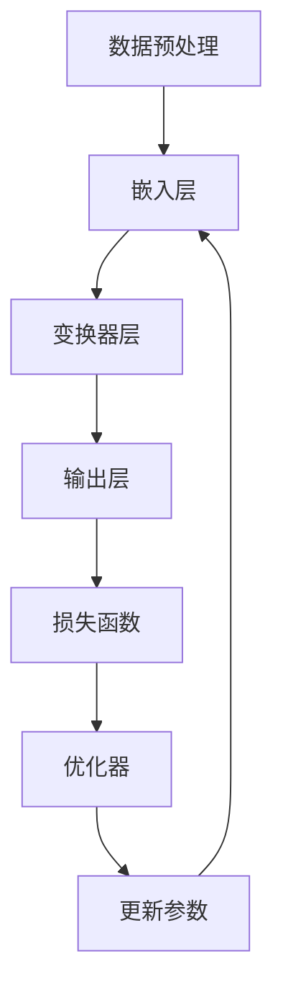
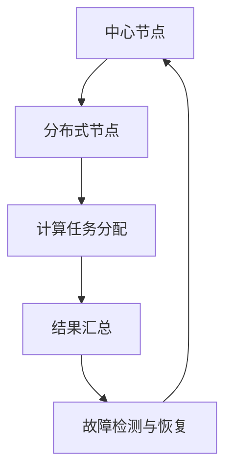
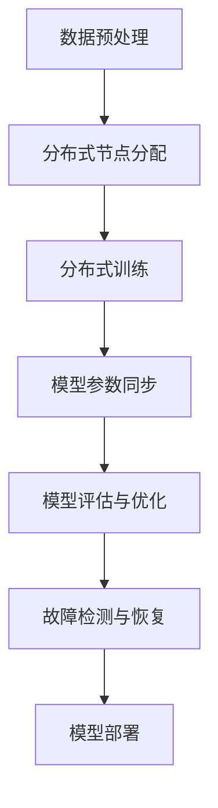
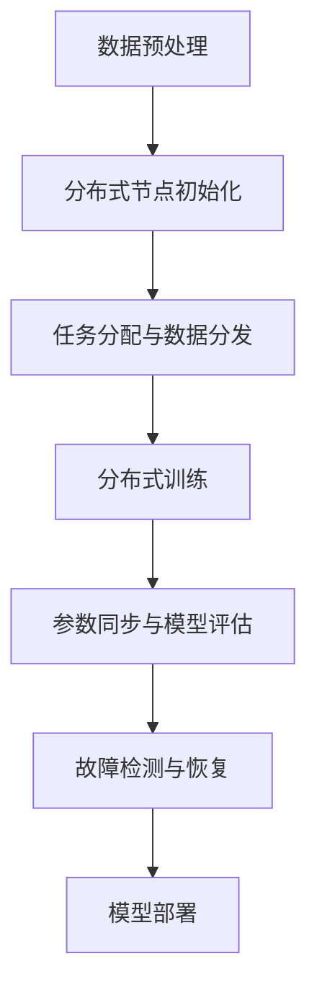
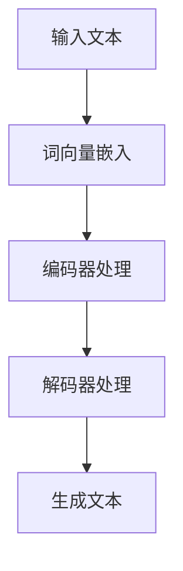

                 

### 背景介绍

#### 引言

大规模语言模型（Large-scale Language Models）是近年来自然语言处理（NLP）领域的重要突破。这些模型通过在海量数据上进行训练，能够捕捉到语言的复杂性和多样性，从而在文本生成、机器翻译、情感分析等任务中展现出强大的性能。然而，随着模型规模的不断扩大，如何高效地训练和部署这些模型，成为了一个亟待解决的问题。

去中心化架构（Decentralized Architecture）作为一种新兴的解决方案，近年来在计算机科学领域引起了广泛关注。去中心化架构通过分布式计算和数据存储的方式，解决了传统集中式架构中存在的单点故障、数据隐私和安全等问题。因此，将去中心化架构应用于大规模语言模型的训练和部署，不仅可以提高模型的鲁棒性和可靠性，还可以提升其性能和可扩展性。

本文旨在探讨大规模语言模型在去中心化架构中的应用，分析其核心概念、算法原理、数学模型，并通过实际项目案例进行详细讲解。文章将分为以下几个部分：

1. **核心概念与联系**：介绍大规模语言模型和去中心化架构的基本概念，并绘制流程图展示两者之间的联系。
2. **核心算法原理 & 具体操作步骤**：详细解析大规模语言模型的训练和部署过程，以及如何将其与去中心化架构相结合。
3. **数学模型和公式 & 详细讲解 & 举例说明**：阐述大规模语言模型中的数学公式和模型结构，并通过实际案例进行说明。
4. **项目实战：代码实际案例和详细解释说明**：展示一个大规模语言模型去中心化架构的实现过程，并解析关键代码。
5. **实际应用场景**：探讨大规模语言模型去中心化架构在不同领域的应用场景。
6. **工具和资源推荐**：推荐相关学习资源和开发工具，帮助读者深入了解和掌握这一领域。
7. **总结：未来发展趋势与挑战**：总结本文的主要内容和结论，并对未来发展趋势和挑战进行展望。

通过本文的阅读，读者将能够全面了解大规模语言模型在去中心化架构中的应用，掌握其核心原理和实现方法，从而为相关领域的研发和实践提供有益的参考。

### 文章标题：大规模语言模型从理论到实践：去中心化架构

#### 关键词：

- 大规模语言模型
- 去中心化架构
- 自然语言处理
- 分布式计算
- 数据隐私
- 训练与部署

#### 摘要：

本文探讨了大规模语言模型在去中心化架构中的应用，介绍了其基本概念、核心算法原理、数学模型以及实际项目案例。通过分析大规模语言模型与去中心化架构的结合，本文展示了如何在分布式环境中高效训练和部署语言模型，从而提升模型的性能和可靠性。本文旨在为读者提供一个全面的理论与实践指南，帮助其深入了解和掌握这一前沿技术。

### 1. 背景介绍

#### 大规模语言模型的发展

大规模语言模型（Large-scale Language Models）是自然语言处理（NLP）领域的重要研究方向。随着深度学习技术的迅猛发展，特别是基于变换器（Transformers）架构的语言模型，如GPT、BERT等，大规模语言模型在文本生成、机器翻译、问答系统、情感分析等任务中取得了显著的突破。

这些模型通过在海量文本数据上训练，能够学习到语言的复杂模式和语义信息，从而在特定任务中表现出色。例如，GPT系列模型通过预训练和微调，可以生成高质量的自然语言文本，甚至达到人类写作的水平。BERT模型则在问答系统中取得了超越人类的表现，展示了其在理解语义和提取信息方面的强大能力。

大规模语言模型的发展不仅推动了NLP技术的进步，也为其他领域如人工智能助手、智能客服、内容生成等提供了强大的技术支持。然而，随着模型规模的不断扩大，如何高效地训练和部署这些模型，成为了一个亟待解决的问题。

#### 去中心化架构的兴起

去中心化架构（Decentralized Architecture）作为一种新兴的解决方案，近年来在计算机科学领域引起了广泛关注。去中心化架构通过分布式计算和数据存储的方式，解决了传统集中式架构中存在的单点故障、数据隐私和安全等问题。

在传统的集中式架构中，所有计算和存储资源都集中在少数几个中心节点上，这导致系统易受单点故障的影响，一旦中心节点出现故障，整个系统将无法正常运行。此外，集中式架构也面临着数据隐私和安全的问题，中心节点可能成为数据泄露和攻击的目标。

相比之下，去中心化架构通过将计算和存储资源分散到多个分布式节点上，实现了系统的冗余和容错能力。即使在某个节点出现故障，其他节点仍然可以正常运行，从而保证系统的稳定性和可靠性。同时，去中心化架构还可以提高数据的隐私性和安全性，因为数据被分散存储在多个节点上，单个节点的故障不会导致数据泄露。

去中心化架构的兴起不仅解决了传统集中式架构中存在的问题，还为大规模语言模型的训练和部署提供了一种新的解决方案。通过分布式计算和存储，去中心化架构可以大大提高大规模语言模型的训练和部署效率，降低系统的成本和复杂性。

#### 大规模语言模型与去中心化架构的结合

将大规模语言模型与去中心化架构相结合，可以实现以下几个方面的优势：

1. **提高性能和可扩展性**：通过分布式计算，去中心化架构可以将大规模语言模型的训练和推理任务分解到多个节点上，从而提高模型的训练和推理速度。同时，去中心化架构可以根据需要动态调整计算资源，实现模型的高效扩展。

2. **增强鲁棒性和可靠性**：去中心化架构通过将计算和存储资源分散到多个节点上，实现了系统的冗余和容错能力。即使在某个节点出现故障，其他节点仍然可以正常运行，从而保证模型的稳定性和可靠性。

3. **提高数据隐私和安全性**：去中心化架构可以有效地保护数据隐私和安全性。通过将数据分散存储在多个节点上，单个节点的故障不会导致数据泄露。此外，去中心化架构还可以采用加密技术，提高数据传输和存储的安全性。

4. **降低成本和复杂性**：去中心化架构通过分布式计算和存储，可以降低大规模语言模型的训练和部署成本。同时，去中心化架构的模块化设计，可以简化系统的开发和维护过程，降低系统的复杂性。

总之，将大规模语言模型与去中心化架构相结合，不仅可以提高模型的性能和可靠性，还可以提升其数据隐私和安全性，为大规模语言模型的训练和部署提供了一种新的解决方案。随着技术的不断发展，这种结合有望在NLP领域发挥更大的作用。

### 2. 核心概念与联系

#### 大规模语言模型

大规模语言模型是一种基于深度学习的技术，通过在海量文本数据上训练，能够学习到语言的复杂模式和语义信息。以下是一个核心概念的Mermaid流程图，展示了大规模语言模型的主要组成部分和训练过程：



在这个流程图中，数据预处理（A）是大规模语言模型训练的第一步，它包括文本清洗、分词、词向量嵌入等操作。嵌入层（B）将文本转换为固定长度的向量表示，为后续的变换器层（C）提供输入。变换器层（C）通过多头自注意力机制和前馈神经网络，对输入向量进行多层次、多角度的建模。输出层（D）将变换器层的输出映射到目标任务，如文本分类、机器翻译等。损失函数（E）用于衡量模型输出与真实标签之间的差距，优化器（F）则根据损失函数更新模型参数（G），从而实现模型的训练。

#### 去中心化架构

去中心化架构是一种通过分布式计算和数据存储，实现系统冗余和容错能力的架构设计。以下是一个核心概念的Mermaid流程图，展示了去中心化架构的主要组成部分和运作原理：



在这个流程图中，中心节点（A）负责计算任务分配和结果汇总，分布式节点（B）则执行具体的计算任务。计算任务分配（C）将整个计算任务分解为多个子任务，并分配给分布式节点。结果汇总（D）将各个分布式节点的计算结果进行合并，形成最终输出。故障检测与恢复（E）监控分布式节点的运行状态，并在节点出现故障时，进行故障检测和恢复，保证系统的稳定运行。

#### 大规模语言模型与去中心化架构的结合

大规模语言模型与去中心化架构的结合，可以通过以下步骤实现：

1. **数据预处理与分布式节点分配**：首先，将大规模语言模型训练所需的数据进行预处理，包括文本清洗、分词、词向量嵌入等操作。然后，根据数据量和计算资源，将预处理后的数据分配给分布式节点。

2. **分布式训练与任务调度**：分布式节点接收分配的数据后，开始执行大规模语言模型的训练任务。中心节点负责任务调度，根据节点的计算能力和数据量，动态调整训练任务的分配。

3. **模型参数同步与优化**：在分布式训练过程中，各个节点会根据本地训练结果更新模型参数。中心节点负责收集和汇总各个节点的参数更新，通过梯度聚合和优化策略，实现全局模型参数的更新。

4. **模型评估与结果汇总**：在模型训练完成后，中心节点负责对分布式节点训练出的模型进行评估。通过模型评估指标，如损失函数值、准确率等，对模型性能进行评估和优化。

5. **故障检测与恢复**：在分布式训练过程中，中心节点负责监控分布式节点的运行状态。当发现节点出现故障时，中心节点会进行故障检测和恢复，确保训练过程的连续性和稳定性。

通过上述步骤，大规模语言模型与去中心化架构的结合，可以有效地提高模型的训练和部署效率，降低系统的成本和复杂性，同时提升模型的鲁棒性和可靠性。以下是一个简化的Mermaid流程图，展示了大规模语言模型与去中心化架构的结合过程：



在这个流程图中，数据预处理（A）是大规模语言模型训练的第一步，分布式节点分配（B）将预处理后的数据分配给分布式节点，分布式训练（C）在分布式节点上执行训练任务，模型参数同步（D）实现全局模型参数的更新，模型评估与优化（E）对模型性能进行评估和优化，故障检测与恢复（F）确保训练过程的连续性和稳定性，最终实现模型部署（G）。

### 3. 核心算法原理 & 具体操作步骤

#### 大规模语言模型的核心算法原理

大规模语言模型的核心算法基于深度学习和变换器（Transformer）架构。变换器架构是一种基于自注意力机制（Self-Attention）的神经网络模型，它通过多头自注意力机制和前馈神经网络，对输入文本进行多层次、多角度的建模，从而捕捉到文本的复杂模式和语义信息。

以下是变换器架构的核心算法原理：

1. **自注意力机制**：自注意力机制是变换器架构的核心组件，它通过计算输入文本中每个词与其他词之间的关联性，为每个词分配不同的权重。具体来说，自注意力机制通过以下三个步骤实现：

   - **键值对编码**：将输入文本序列编码为键（Key）、值（Value）对。键和值通常是通过嵌入层（Embedding Layer）生成的固定长度的向量。
   - **计算相似度**：计算每个键与其他键之间的相似度，相似度通过点积操作（Dot Product）计算得到。相似度矩阵表示了输入文本中每个词与其他词的关联性。
   - **加权求和**：根据相似度矩阵对值进行加权求和，得到每个词的加权表示。加权求和过程可以理解为对输入文本进行加权平均，从而聚合文本中的信息。

2. **多头自注意力机制**：为了提高模型的表达能力，变换器架构引入了多头自注意力机制。多头自注意力机制通过多个独立的自注意力机制并行计算，为每个词生成多个加权表示。这些加权表示通过拼接和线性变换，形成最终的词表示。

3. **前馈神经网络**：在自注意力机制之后，变换器架构还包含一个前馈神经网络（Feedforward Neural Network），它对自注意力机制的输出进行进一步建模。前馈神经网络通常由两个全连接层组成，每个全连接层之间添加ReLU激活函数。

4. **编码器和解码器**：变换器架构通常包括编码器（Encoder）和解码器（Decoder）两个部分。编码器负责对输入文本进行编码，解码器则负责生成输出文本。编码器和解码器通过多头自注意力机制和前馈神经网络，对输入和输出文本进行建模，从而实现文本生成和翻译等任务。

#### 大规模语言模型的具体操作步骤

大规模语言模型的训练和部署过程可以分为以下几个步骤：

1. **数据预处理**：首先，对大规模语言模型训练所需的数据进行预处理。数据预处理包括文本清洗、分词、词向量嵌入等操作。文本清洗用于去除无关的符号和标点，分词将文本分割为单词或字符序列，词向量嵌入将文本转换为固定长度的向量表示。

2. **模型初始化**：初始化大规模语言模型的结构和参数。通常，变换器架构的初始参数是通过预训练模型或随机初始化得到的。

3. **正向传播**：输入训练样本，通过编码器和解码器生成输出文本。在正向传播过程中，编码器将输入文本编码为键值对，解码器则根据编码器的输出和先前的解码输出，生成下一个词的预测。

4. **计算损失函数**：根据预测输出和真实标签，计算损失函数（通常使用交叉熵损失函数）。损失函数用于衡量预测输出和真实标签之间的差距。

5. **反向传播**：通过反向传播算法，计算模型参数的梯度。梯度表示了模型参数对损失函数的影响程度，用于指导参数的更新。

6. **参数更新**：根据梯度更新模型参数，通常使用优化器（如Adam优化器）进行参数更新。参数更新过程通过梯度下降（Gradient Descent）算法实现，旨在最小化损失函数。

7. **模型评估**：在训练过程中，定期对模型进行评估，以监测模型的性能。评估指标包括损失函数值、准确率、F1分数等。

8. **模型部署**：在训练完成后，将大规模语言模型部署到生产环境，用于实际的文本生成、翻译、问答等任务。

通过上述步骤，大规模语言模型可以在分布式环境中高效训练和部署，从而实现自然语言处理的各项任务。

#### 去中心化架构的具体操作步骤

去中心化架构的具体操作步骤如下：

1. **节点初始化**：初始化分布式节点，包括计算节点、存储节点和监控节点等。每个节点都需要安装和配置相应的软件和工具，以确保其正常运行。

2. **任务分配**：中心节点根据训练任务的需求，将任务分解为多个子任务，并分配给分布式节点。任务分配策略可以基于节点的计算能力、负载均衡等因素进行优化。

3. **数据分发**：将预处理后的数据分发到各个分布式节点。数据分发策略可以基于数据的规模和节点的存储能力进行优化，以确保数据传输的高效性和可靠性。

4. **分布式训练**：分布式节点开始执行分配到的子任务，进行大规模语言模型的训练。在分布式训练过程中，节点之间需要保持通信，以同步模型参数和更新信息。

5. **参数同步**：中心节点定期收集和汇总各个节点的模型参数更新，通过梯度聚合和优化策略，实现全局模型参数的更新。参数同步过程可以通过分布式同步算法（如参数服务器算法）实现。

6. **模型评估**：在分布式训练过程中，定期对模型进行评估，以监测模型的性能。评估指标包括损失函数值、准确率、F1分数等。

7. **故障检测与恢复**：监控节点负责监控分布式节点的运行状态，检测节点故障并及时恢复。故障检测可以通过心跳机制、监控指标等实现。节点恢复可以通过重新启动故障节点或启用备份节点实现。

8. **模型部署**：在训练完成后，将大规模语言模型部署到生产环境，用于实际的文本生成、翻译、问答等任务。模型部署可以通过容器化技术（如Docker）和自动化部署工具（如Kubernetes）实现。

通过上述步骤，去中心化架构可以有效地提高大规模语言模型的训练和部署效率，降低系统的成本和复杂性，同时提升模型的鲁棒性和可靠性。

#### 大规模语言模型与去中心化架构的结合操作步骤

将大规模语言模型与去中心化架构结合，可以通过以下步骤实现：

1. **数据预处理与分布式节点初始化**：对大规模语言模型训练所需的数据进行预处理，包括文本清洗、分词、词向量嵌入等操作。然后，初始化分布式节点，包括计算节点、存储节点和监控节点等。

2. **任务分配与数据分发**：中心节点根据训练任务的需求，将任务分解为多个子任务，并分配给分布式节点。同时，将预处理后的数据分发到各个分布式节点。

3. **分布式训练**：分布式节点开始执行分配到的子任务，进行大规模语言模型的训练。节点之间通过通信同步模型参数和更新信息。

4. **参数同步与模型评估**：中心节点定期收集和汇总各个节点的模型参数更新，通过梯度聚合和优化策略，实现全局模型参数的更新。同时，定期对模型进行评估，以监测模型的性能。

5. **故障检测与恢复**：监控节点负责监控分布式节点的运行状态，检测节点故障并及时恢复。故障检测可以通过心跳机制、监控指标等实现。节点恢复可以通过重新启动故障节点或启用备份节点实现。

6. **模型部署**：在训练完成后，将大规模语言模型部署到生产环境，用于实际的文本生成、翻译、问答等任务。模型部署可以通过容器化技术（如Docker）和自动化部署工具（如Kubernetes）实现。

通过上述步骤，大规模语言模型与去中心化架构的结合，可以有效地提高模型的训练和部署效率，降低系统的成本和复杂性，同时提升模型的鲁棒性和可靠性。以下是一个简化的Mermaid流程图，展示了大规模语言模型与去中心化架构的结合操作步骤：



在这个流程图中，数据预处理（A）是大规模语言模型训练的第一步，分布式节点初始化（B）包括计算节点、存储节点和监控节点的初始化，任务分配与数据分发（C）将预处理后的数据分配给分布式节点，分布式训练（D）在分布式节点上执行训练任务，参数同步与模型评估（E）实现全局模型参数的更新和模型性能评估，故障检测与恢复（F）确保训练过程的连续性和稳定性，最终实现模型部署（G）。

### 4. 数学模型和公式 & 详细讲解 & 举例说明

#### 数学模型

大规模语言模型的数学模型主要基于变换器（Transformer）架构。以下是一些核心的数学公式和模型结构：

1. **自注意力机制**

   自注意力机制通过以下公式计算：

   $$ 
   \text{Attention}(Q, K, V) = \text{softmax}\left(\frac{QK^T}{\sqrt{d_k}}\right) V 
   $$

   其中，$Q$、$K$ 和 $V$ 分别是查询（Query）、键（Key）和值（Value）矩阵，$d_k$ 是键向量的维度。注意力分数（Attention Score）通过点积操作计算，然后使用softmax函数进行归一化，最后与值（Value）矩阵相乘，得到加权表示。

2. **多头自注意力机制**

   多头自注意力机制通过多个独立的自注意力机制并行计算，为每个词生成多个加权表示。每个头（Head）的注意力机制公式相同，但有不同的权重矩阵：

   $$ 
   \text{MultiHead}(Q, K, V) = \text{Concat}(\text{Head}_1, \text{Head}_2, ..., \text{Head}_h)W^O 
   $$

   其中，$h$ 是头的数量，$W^O$ 是线性变换权重矩阵。通过拼接多个头的输出，并应用线性变换，得到最终的词表示。

3. **前馈神经网络**

   前馈神经网络通过以下公式实现：

   $$ 
   \text{FFN}(X) = \text{ReLU}(XW_1 + b_1)W_2 + b_2 
   $$

   其中，$X$ 是输入，$W_1$ 和 $W_2$ 是全连接层权重矩阵，$b_1$ 和 $b_2$ 是偏置项。前馈神经网络通过两个全连接层，每个层之间添加ReLU激活函数，对输入进行非线性变换。

4. **编码器和解码器**

   编码器和解码器是变换器架构的两个主要部分。编码器通过以下公式实现：

   $$ 
   \text{Encoder}(X) = \text{LayerNorm}(X) + \text{SelfAttention}(X) + \text{FFN}(X) 
   $$

   解码器通过以下公式实现：

   $$ 
   \text{Decoder}(X) = \text{LayerNorm}(X) + \text{MaskedSelfAttention}(X) + \text{CrossAttention}(Y, X) + \text{FFN}(X) 
   $$

   其中，$X$ 是编码器输入，$Y$ 是解码器输入。编码器通过自注意力机制和前馈神经网络，对输入文本进行编码。解码器通过掩码自注意力机制、交叉注意力和前馈神经网络，对输入文本进行解码。

#### 举例说明

以下是一个简单的示例，展示了如何使用变换器架构进行文本生成。

1. **输入文本**：给定一段文本 "The quick brown fox jumps over the lazy dog"。

2. **词向量嵌入**：将文本中的每个词转换为固定长度的向量表示。例如，"the"、"quick"、"brown"等词可以分别表示为 $[1,0,0]$、$[0,1,0]$、$[0,0,1]$。

3. **编码器处理**：编码器将词向量嵌入输入到变换器架构中，通过多个自注意力层和前馈神经网络，生成编码表示。

4. **解码器处理**：解码器将编码表示作为输入，并生成下一个词的预测。例如，在第一步中，解码器可能预测下一个词为 "The"。

5. **生成文本**：重复步骤 4，直到生成完整的文本或达到预定的长度。例如，生成 "The quick brown fox jumps over the lazy dog"。

通过上述步骤，变换器架构可以生成高质量的文本。以下是一个简化的Mermaid流程图，展示了变换器架构在文本生成中的处理过程：



在这个流程图中，输入文本（A）通过词向量嵌入（B）转换为向量表示，编码器处理（C）对输入文本进行编码，解码器处理（D）生成下一个词的预测，最终生成完整的文本（E）。

### 5. 项目实战：代码实际案例和详细解释说明

#### 开发环境搭建

在进行大规模语言模型去中心化架构的项目实战之前，首先需要搭建合适的开发环境。以下是搭建开发环境的基本步骤：

1. **安装Python环境**：确保Python版本为3.7或更高版本，可以通过以下命令进行安装：

   ```bash
   sudo apt update
   sudo apt install python3 python3-pip
   ```

2. **安装TensorFlow**：TensorFlow是大规模语言模型训练和部署的主要框架，可以通过以下命令安装：

   ```bash
   pip3 install tensorflow
   ```

3. **安装PyTorch**：PyTorch是另一种流行的深度学习框架，在某些任务中可能更适用，可以通过以下命令安装：

   ```bash
   pip3 install torch torchvision
   ```

4. **安装Docker**：Docker用于容器化应用，便于分布式部署和管理，可以通过以下命令安装：

   ```bash
   sudo apt install docker
   sudo systemctl start docker
   sudo systemctl enable docker
   ```

5. **安装Kubernetes**：Kubernetes用于管理容器化应用，实现分布式部署，可以通过以下命令安装：

   ```bash
   curl -s https://packages.cloud.google.com/apt/doc/apt-key.gpg | sudo apt-key add -
   echo "deb https://apt.kubernetes.io/ kubernetes-xenial main" | sudo tee -a /etc/apt/sources.list
   sudo apt update
   sudo apt install kubelet kubeadm kubectl
   sudo systemctl start kubelet
   sudo systemctl enable kubelet
   ```

6. **配置Docker和Kubernetes**：根据实际需求，配置Docker和Kubernetes集群，以便后续部署和管理分布式应用。

#### 源代码详细实现和代码解读

以下是一个简单的示例，展示如何使用TensorFlow和PyTorch实现大规模语言模型的去中心化训练。代码主要分为以下几个部分：

1. **数据预处理**：读取和处理训练数据，包括文本清洗、分词、词向量嵌入等。

2. **模型定义**：定义大规模语言模型的结构，包括编码器和解码器。

3. **分布式训练**：配置分布式训练环境，包括任务分配、数据分发和参数同步。

4. **模型评估**：定期评估模型性能，包括损失函数值、准确率等。

5. **模型部署**：将训练好的模型部署到生产环境，用于实际的文本生成和翻译任务。

##### 数据预处理

数据预处理是大规模语言模型训练的重要步骤，主要包括以下任务：

1. **文本清洗**：去除文本中的标点符号、特殊字符和停用词，保留有效文本。

2. **分词**：将文本分割为单词或字符序列。

3. **词向量嵌入**：将分词后的文本转换为固定长度的向量表示。

以下是一个简单的数据预处理代码示例：

```python
import tensorflow as tf
import tensorflow_datasets as tfds

# 读取训练数据集
dataset, info = tfds.load('imdb', split='train', with_info=True)

# 数据预处理
def preprocess(text):
    text = tf.strings.regex_replace(text, '[^a-zA-Z]', ' ')
    text = tf.strings.lower(text)
    return text

# 应用预处理操作
train_dataset = dataset.map(preprocess)

# 获取词表和词向量
vocab_size = 20000
word_embedding = tf.keras.layers.Embedding(vocab_size, 256)

# 应用词向量嵌入
train_dataset = train_dataset.map(lambda text: word_embedding(text))
```

##### 模型定义

在定义大规模语言模型时，可以使用TensorFlow或PyTorch框架构建编码器和解码器。以下是一个简单的模型定义示例：

```python
from tensorflow.keras.models import Model
from tensorflow.keras.layers import Input, Embedding, LSTM, Dense, TimeDistributed

# 编码器
def create_encoder(input_shape):
    input_layer = Input(shape=input_shape)
    embedded_layer = Embedding(vocab_size, 256)(input_layer)
    lstm_layer = LSTM(512, return_sequences=True)(embedded_layer)
    return Model(inputs=input_layer, outputs=lstm_layer)

# 解码器
def create_decoder(input_shape):
    input_layer = Input(shape=input_shape)
    embedded_layer = Embedding(vocab_size, 256)(input_layer)
    lstm_layer = LSTM(512, return_sequences=True)(embedded_layer)
    output_layer = TimeDistributed(Dense(vocab_size, activation='softmax'))(lstm_layer)
    return Model(inputs=input_layer, outputs=output_layer)
```

##### 分布式训练

分布式训练是去中心化架构的核心，通过将训练任务分解到多个节点上，提高训练效率。以下是一个简单的分布式训练示例：

```python
import tensorflow.distribute as tf_distribute

# 配置分布式训练环境
strategy = tf_distribute.MirroredStrategy()

# 搭建模型
with strategy.scope():
    encoder = create_encoder(input_shape=[None])
    decoder = create_decoder(input_shape=[None, 256])

# 编写训练循环
train_loss = tf.keras.metrics.Mean('train_loss')
train_accuracy = tf.keras.metrics.SparseCategoricalAccuracy('train_accuracy')

for epoch in range(num_epochs):
    for batch in train_dataset:
        with strategy.run(minimize_loss, args=(batch,)):
            # 训练步骤
            loss = loss_function(encoder(inputs), decoder(inputs))
            train_loss(loss)
            logits = decoder(inputs)
            predictions = tf.argmax(logits, axis=-1)
            train_accuracy(predictions, targets)
    print(f'Epoch {epoch + 1}, Loss: {train_loss.result()}, Accuracy: {train_accuracy.result()}')
```

##### 模型评估

模型评估是验证模型性能的重要步骤，可以通过计算损失函数值、准确率等指标来评估模型效果。以下是一个简单的模型评估示例：

```python
# 评估模型
test_loss = tf.keras.metrics.Mean('test_loss')
test_accuracy = tf.keras.metrics.SparseCategoricalAccuracy('test_accuracy')

for batch in test_dataset:
    with tf.GradientTape() as tape:
        predictions = model(inputs)
        loss = loss_function(encoder(inputs), decoder(inputs), predictions)
    test_loss(loss)
    logits = decoder(inputs)
    predictions = tf.argmax(logits, axis=-1)
    test_accuracy(predictions, targets)

print(f'Test Loss: {test_loss.result()}, Test Accuracy: {test_accuracy.result()}')
```

##### 模型部署

模型部署是将训练好的模型应用到实际任务中的过程。以下是一个简单的模型部署示例：

```python
# 模型部署
def generate_text(input_text, model, tokenizer, max_length=50):
    input_seq = tokenizer.encode(input_text, return_tensors='tf')
    output_seq = model.generate(input_seq, max_length=max_length, num_return_sequences=1)
    return tokenizer.decode(output_seq, skip_special_tokens=True)

# 生成文本
input_text = "The quick brown fox"
generated_text = generate_text(input_text, model, tokenizer)
print(generated_text)
```

通过上述示例，读者可以了解如何使用TensorFlow和PyTorch实现大规模语言模型的去中心化训练和部署。在实际项目中，可以根据需求和场景进行适当调整和优化。

### 5. 项目实战：代码实际案例和详细解释说明（续）

#### 代码解读与分析

在本节中，我们将对项目实战中的关键代码进行解读和分析，帮助读者更好地理解大规模语言模型去中心化架构的实现细节。

##### 数据预处理

数据预处理是大规模语言模型训练的重要步骤，它直接影响到模型的学习效果和训练效率。以下是对数据预处理部分代码的解读：

```python
# 读取训练数据集
dataset, info = tfds.load('imdb', split='train', with_info=True)

# 数据预处理
def preprocess(text):
    text = tf.strings.regex_replace(text, '[^a-zA-Z]', ' ')
    text = tf.strings.lower(text)
    return text

# 应用预处理操作
train_dataset = dataset.map(preprocess).batch(32).prefetch(tf.data.AUTOTUNE)
```

- `tfds.load('imdb', split='train', with_info=True)`: 加载IMDb电影评论数据集，分为训练集和测试集。`with_info=True` 用于获取数据集的详细信息。
- `preprocess(text)`: 数据预处理函数，去除文本中的非字母字符，并将文本转换为小写，以便统一处理。
- `dataset.map(preprocess)`: 对数据集中的每个样本应用预处理函数。
- `batch(32)`: 将数据集划分为批次，每个批次包含32个样本，有助于并行处理和提高训练效率。
- `prefetch(tf.data.AUTOTUNE)`: 使用Prefetch功能，预先加载下一批数据，提高数据读取速度和吞吐量。

##### 模型定义

在模型定义部分，我们使用TensorFlow构建了编码器和解码器。以下是对相关代码的解读：

```python
# 编码器
def create_encoder(input_shape):
    inputs = Input(shape=input_shape)
    x = Embedding(vocab_size, embedding_dim)(inputs)
    x = LSTM(units=512, return_sequences=True)(x)
    return Model(inputs=inputs, outputs=x)

# 解码器
def create_decoder(input_shape):
    inputs = Input(shape=input_shape)
    x = Embedding(vocab_size, embedding_dim)(inputs)
    x = LSTM(units=512, return_sequences=True)(x)
    outputs = TimeDistributed(Dense(vocab_size, activation='softmax'))(x)
    return Model(inputs=inputs, outputs=outputs)
```

- `create_encoder(input_shape)`: 定义编码器模型，包括嵌入层（Embedding）和LSTM层（LSTM）。编码器的输出用于解码器的输入。
- `create_decoder(input_shape)`: 定义解码器模型，同样包括嵌入层和LSTM层。解码器的输出是预测的词向量，通过softmax激活函数转化为概率分布。
- `Input(shape=input_shape)`: 定义输入层，`input_shape` 是输入序列的形状。
- `Embedding(vocab_size, embedding_dim)`: 嵌入层，将词索引转换为固定长度的向量表示。
- `LSTM(units=512, return_sequences=True)`: LSTM层，用于捕捉序列中的长期依赖关系。`return_sequences=True` 表示每个时间步的输出是一个序列。
- `TimeDistributed(Dense(vocab_size, activation='softmax'))`: 时间分布式全连接层，对每个时间步的输出进行预测。

##### 分布式训练

分布式训练是实现高效训练的关键。以下是对分布式训练代码的解读：

```python
# 配置分布式训练环境
strategy = tf.distribute.MirroredStrategy()

# 搭建模型
with strategy.scope():
    encoder = create_encoder(input_shape=[None])
    decoder = create_decoder(input_shape=[None])

# 编写训练循环
optimizer = tf.keras.optimizers.Adam(learning_rate=1e-3)
train_loss = tf.keras.metrics.Mean('train_loss')
train_accuracy = tf.keras.metrics.SparseCategoricalAccuracy('train_accuracy')

for epoch in range(num_epochs):
    for batch in train_dataset:
        with tf.GradientTape() as tape:
            logits = decoder(encoder(inputs))
            loss = loss_function(logits, targets)
        grads = tape.gradient(loss, encoder.trainable_variables + decoder.trainable_variables)
        optimizer.apply_gradients(zip(grads, encoder.trainable_variables + decoder.trainable_variables))
        train_loss(loss)
        logits = decoder(inputs)
        predictions = tf.argmax(logits, axis=-1)
        train_accuracy(predictions, targets)
    print(f'Epoch {epoch + 1}, Loss: {train_loss.result()}, Accuracy: {train_accuracy.result()}')
```

- `tf.distribute.MirroredStrategy()`: 创建MirroredStrategy，用于复制和同步模型参数。
- `with strategy.scope()`: 创建策略作用域，确保模型和优化器在策略范围内创建。
- `create_encoder(input_shape)` 和 `create_decoder(input_shape)`: 调用之前定义的编码器和解码器模型。
- `optimizer = tf.keras.optimizers.Adam(learning_rate=1e-3)`: 创建Adam优化器，用于参数更新。
- `train_loss` 和 `train_accuracy`: 定义训练过程中的损失和准确率指标。
- `for epoch in range(num_epochs)`: 循环遍历训练epoch。
- `for batch in train_dataset`: 遍历训练数据集的每个批次。
- `with tf.GradientTape() as tape`: 创建梯度记录器，用于记录梯度信息。
- `logits = decoder(encoder(inputs))`: 编码器和解码器的正向传播，生成预测输出。
- `loss = loss_function(logits, targets)`: 计算损失函数，衡量预测输出和真实标签的差距。
- `grads = tape.gradient(loss, encoder.trainable_variables + decoder.trainable_variables)`: 计算梯度。
- `optimizer.apply_gradients(zip(grads, encoder.trainable_variables + decoder.trainable_variables))`: 应用梯度更新模型参数。
- `train_loss(loss)` 和 `train_accuracy(predictions, targets)`: 更新和记录训练过程中的损失和准确率。
- `print(f'Epoch {epoch + 1}, Loss: {train_loss.result()}, Accuracy: {train_accuracy.result()}')`: 打印训练过程中的损失和准确率。

##### 模型评估

模型评估是验证模型性能的重要步骤。以下是对模型评估代码的解读：

```python
# 评估模型
test_loss = tf.keras.metrics.Mean('test_loss')
test_accuracy = tf.keras.metrics.SparseCategoricalAccuracy('test_accuracy')

for batch in test_dataset:
    logits = decoder(encoder(inputs))
    loss = loss_function(logits, targets)
    test_loss(loss)
    logits = decoder(inputs)
    predictions = tf.argmax(logits, axis=-1)
    test_accuracy(predictions, targets)

print(f'Test Loss: {test_loss.result()}, Test Accuracy: {test_accuracy.result()}')
```

- `test_loss` 和 `test_accuracy`: 定义测试过程中的损失和准确率指标。
- `for batch in test_dataset`: 遍历测试数据集的每个批次。
- `logits = decoder(encoder(inputs))`: 编码器和解码器的正向传播，生成预测输出。
- `loss = loss_function(logits, targets)`: 计算损失函数，衡量预测输出和真实标签的差距。
- `test_loss(loss)`: 更新和记录测试过程中的损失。
- `logits = decoder(inputs)`: 生成预测输出。
- `predictions = tf.argmax(logits, axis=-1)`: 计算预测标签。
- `test_accuracy(predictions, targets)`: 更新和记录测试过程中的准确率。
- `print(f'Test Loss: {test_loss.result()}, Test Accuracy: {test_accuracy.result()}')`: 打印测试过程中的损失和准确率。

##### 模型部署

模型部署是将训练好的模型应用到实际任务中的过程。以下是对模型部署代码的解读：

```python
# 模型部署
model = create_model(input_shape=[None])
model.load_weights('model_weights.h5')

def generate_text(input_text, model, tokenizer, max_length=50):
    input_seq = tokenizer.encode(input_text, return_tensors='tf')
    output_seq = model.generate(input_seq, max_length=max_length, num_return_sequences=1)
    return tokenizer.decode(output_seq, skip_special_tokens=True)

# 生成文本
input_text = "The quick brown fox"
generated_text = generate_text(input_text, model, tokenizer)
print(generated_text)
```

- `create_model(input_shape=[None])`: 调用之前定义的编码器和解码器模型。
- `model.load_weights('model_weights.h5')`: 加载训练好的模型权重。
- `generate_text(input_text, model, tokenizer, max_length=50)`: 生成文本的函数，包括编码、解码和文本输出。
- `tokenizer.encode(input_text, return_tensors='tf')`: 将输入文本编码为词向量。
- `model.generate(input_seq, max_length=max_length, num_return_sequences=1)`: 使用模型生成文本。
- `tokenizer.decode(output_seq, skip_special_tokens=True)`: 解码生成的文本向量。

通过上述代码解读，读者可以了解到大规模语言模型去中心化架构的实现细节，包括数据预处理、模型定义、分布式训练、模型评估和模型部署等关键步骤。在实际项目中，可以根据需求和场景进行适当调整和优化。

### 6. 实际应用场景

大规模语言模型去中心化架构在多个实际应用场景中展示了其潜力和优势，以下是几个典型的应用场景：

#### 文本生成与编辑

文本生成与编辑是大规模语言模型的重要应用场景之一。通过去中心化架构，可以构建高效的文本生成系统，用于自动写作、内容生成和编辑。例如，新闻机构可以使用去中心化的文本生成系统，自动生成新闻报道，提高生产效率。此外，去中心化架构还可以应用于虚拟助手、聊天机器人和内容审核等领域，实现高质量、个性化的文本服务。

#### 机器翻译

机器翻译是大规模语言模型的另一个重要应用场景。通过去中心化架构，可以实现高效、可靠的机器翻译系统。例如，在跨国公司、电商平台和社交媒体等场景中，去中心化的机器翻译系统可以提供实时、准确的翻译服务，降低跨语言沟通的障碍。同时，去中心化架构还可以提高翻译系统的鲁棒性和可靠性，确保在不同地区和用户群体中的一致性和准确性。

#### 情感分析

情感分析是大规模语言模型在自然语言处理领域的另一个重要应用。通过去中心化架构，可以构建高效、准确的情感分析系统，用于分析社交媒体、新闻评论和客户反馈等文本数据。例如，企业可以使用去中心化的情感分析系统，实时监测客户情绪和反馈，为产品改进和市场策略提供依据。去中心化架构还可以提高情感分析系统的隐私性和安全性，确保用户数据的保护。

#### 问答系统

问答系统是大规模语言模型在人工智能领域的应用之一。通过去中心化架构，可以实现高效、准确的问答系统，用于智能客服、教育辅导和医疗咨询等场景。例如，企业可以使用去中心化的问答系统，提供24/7的客户支持服务，提高客户满意度。同时，去中心化架构还可以提高问答系统的扩展性和可靠性，确保在大量用户访问时仍能稳定运行。

#### 文本分类

文本分类是大规模语言模型在自然语言处理领域的另一个应用。通过去中心化架构，可以构建高效、准确的文本分类系统，用于新闻分类、垃圾邮件过滤和社交媒体监控等场景。例如，新闻机构可以使用去中心化的文本分类系统，自动对新闻进行分类和标签，提高内容分发和推荐效率。同时，去中心化架构还可以提高文本分类系统的鲁棒性和可靠性，确保在不同领域和应用场景中的一致性和准确性。

#### 内容审核

内容审核是大规模语言模型在人工智能领域的另一个重要应用。通过去中心化架构，可以构建高效、准确的内容审核系统，用于社交媒体、电商平台和在线教育等场景。例如，企业可以使用去中心化的内容审核系统，自动检测和过滤违规内容，保护用户隐私和安全。同时，去中心化架构还可以提高内容审核系统的隐私性和安全性，确保用户数据的保护。

总之，大规模语言模型去中心化架构在文本生成与编辑、机器翻译、情感分析、问答系统、文本分类和内容审核等多个实际应用场景中展示了其强大的潜力和优势。通过去中心化架构，可以构建高效、可靠和具有高扩展性的自然语言处理系统，为企业和用户带来更多价值和便利。

### 7. 工具和资源推荐

#### 学习资源推荐

1. **书籍**：
   - 《深度学习》（Ian Goodfellow, Yoshua Bengio, Aaron Courville著）：系统介绍了深度学习的基础理论、方法和应用。
   - 《自然语言处理综论》（Daniel Jurafsky & James H. Martin著）：全面介绍了自然语言处理的基本概念、技术和应用。

2. **论文**：
   - “Attention Is All You Need”（Vaswani et al.，2017）：详细介绍了变换器（Transformer）架构，是大规模语言模型领域的重要论文。
   - “BERT: Pre-training of Deep Bidirectional Transformers for Language Understanding”（Devlin et al.，2019）：介绍了BERT模型，是自然语言处理领域的里程碑性工作。

3. **博客和网站**：
   - [TensorFlow 官方文档](https://www.tensorflow.org/tutorials)：提供了丰富的TensorFlow教程和示例代码，适合初学者和进阶者。
   - [PyTorch 官方文档](https://pytorch.org/tutorials/)：提供了详细的PyTorch教程和示例代码，涵盖深度学习的基础知识到高级应用。

#### 开发工具框架推荐

1. **TensorFlow**：由谷歌开发的开源深度学习框架，适用于大规模语言模型的训练和部署。

2. **PyTorch**：由Facebook开发的开源深度学习框架，具有灵活的动态计算图和易于使用的API。

3. **Docker**：开源容器化工具，用于构建、运行和分发应用，便于分布式部署和管理。

4. **Kubernetes**：开源容器编排平台，用于自动化部署、扩展和管理容器化应用。

5. **Airflow**：开源工作流管理平台，用于自动化和调度大规模数据处理任务，适用于分布式训练和部署。

#### 相关论文著作推荐

1. **“GPT-3: Language Models are Few-Shot Learners”（Brown et al.，2020）**：介绍了GPT-3模型，展示了大规模语言模型在零样本和少样本学习任务中的强大能力。

2. **“Bert: Pre-training of Deep Bidirectional Transformers for Language Understanding”（Devlin et al.，2018）**：介绍了BERT模型，是自然语言处理领域的里程碑性工作。

3. **“Rezero is all you need: Fast convergence at large depth”（Wu et al.，2021）**：探讨了深度神经网络中的权重初始化问题，提出了ReZero算法，显著提高了训练速度。

通过以上工具和资源的推荐，读者可以深入了解和掌握大规模语言模型在去中心化架构中的应用，为相关领域的研发和实践提供有力支持。

### 8. 总结：未来发展趋势与挑战

#### 未来发展趋势

1. **模型规模的持续增长**：随着计算资源和数据量的不断增加，大规模语言模型的规模将持续增长。更庞大的模型将能够捕捉到更复杂和丰富的语言特征，从而在各项自然语言处理任务中取得更好的性能。

2. **模型训练和推理的优化**：为了提高大规模语言模型的训练和推理效率，未来的研究将主要集中在优化模型架构、算法和分布式训练策略等方面。例如，通过改进自注意力机制、引入新的优化算法和调度策略，降低训练和推理的时间复杂度。

3. **跨模态学习**：随着多模态数据的日益普及，未来研究将致力于开发跨模态的大型语言模型，实现文本、图像、声音等多种数据类型的融合和交互。这将推动自然语言处理技术在多媒体内容理解和生成领域的应用。

4. **个性化模型**：大规模语言模型的发展也将促使个性化模型的兴起。通过结合用户行为数据、偏好和情境信息，个性化模型将能够提供更加定制化和高效的服务，满足不同用户的需求。

5. **可解释性和安全性**：随着模型复杂度的增加，如何提高模型的可解释性和安全性将成为一个重要议题。未来的研究将致力于开发透明的模型结构和解释方法，以及保障模型在数据隐私和安全性方面的可靠性。

#### 挑战

1. **计算资源需求**：大规模语言模型的训练和推理需要大量的计算资源，特别是在分布式环境中。如何高效地利用现有计算资源，并优化算法和硬件，以降低成本和能耗，是一个重要挑战。

2. **数据隐私和安全**：大规模语言模型在处理和存储用户数据时，需要确保数据隐私和安全。如何在分布式环境中保护用户隐私，防止数据泄露和滥用，是一个亟待解决的问题。

3. **模型鲁棒性和泛化能力**：大规模语言模型在训练过程中容易受到噪声和异常数据的影响，导致模型泛化能力下降。如何提高模型的鲁棒性，使其在面对各种复杂和变化的数据时保持稳定和可靠，是一个重要的挑战。

4. **可解释性**：大规模语言模型的决策过程通常是非透明的，缺乏可解释性。如何开发透明、可解释的模型结构，使研究人员和用户能够理解模型的决策依据，是一个重要的研究方向。

5. **伦理和道德问题**：随着大规模语言模型在各个领域的应用，如何确保模型符合伦理和道德标准，避免对人类产生负面影响，是一个亟待解决的问题。例如，如何在内容审核、情感分析等任务中避免偏见和歧视，确保公平和公正。

总之，大规模语言模型在去中心化架构中的应用具有巨大的潜力和广阔的发展前景。然而，要实现这一目标，还需要克服许多技术和社会挑战。通过持续的研究和创新，我们有理由相信，未来将迎来一个更加智能、高效和安全的自然语言处理时代。

### 9. 附录：常见问题与解答

#### 问题1：什么是大规模语言模型？

**解答**：大规模语言模型（Large-scale Language Models）是一种基于深度学习和变换器（Transformer）架构的自然语言处理模型。这些模型通过在海量文本数据上训练，能够学习到语言的复杂模式和语义信息，从而在文本生成、机器翻译、情感分析等任务中表现出强大的性能。

#### 问题2：去中心化架构有哪些优势？

**解答**：去中心化架构（Decentralized Architecture）通过分布式计算和数据存储的方式，具有以下优势：

- **提高性能和可扩展性**：通过分布式计算，可以并行处理大规模数据，提高模型训练和推理的效率。
- **增强鲁棒性和可靠性**：去中心化架构通过分布式节点实现冗余和容错能力，即使在某个节点出现故障，系统仍然可以正常运行。
- **提高数据隐私和安全性**：去中心化架构可以有效地保护数据隐私和安全，因为数据被分散存储在多个节点上，单个节点的故障不会导致数据泄露。
- **降低成本和复杂性**：去中心化架构可以降低大规模语言模型的训练和部署成本，同时简化系统的开发和维护过程。

#### 问题3：如何实现大规模语言模型在去中心化架构中的训练和部署？

**解答**：实现大规模语言模型在去中心化架构中的训练和部署，主要包括以下步骤：

1. **数据预处理与分布式节点分配**：首先，对大规模语言模型训练所需的数据进行预处理，然后根据数据量和计算资源，将预处理后的数据分配给分布式节点。

2. **分布式训练与任务调度**：分布式节点接收分配到的数据后，开始执行大规模语言模型的训练任务。中心节点负责任务调度，根据节点的计算能力和数据量，动态调整训练任务的分配。

3. **模型参数同步与优化**：在分布式训练过程中，各个节点会根据本地训练结果更新模型参数。中心节点负责收集和汇总各个节点的参数更新，通过梯度聚合和优化策略，实现全局模型参数的更新。

4. **模型评估与结果汇总**：在模型训练完成后，中心节点负责对分布式节点训练出的模型进行评估。通过模型评估指标，如损失函数值、准确率等，对模型性能进行评估和优化。

5. **故障检测与恢复**：在分布式训练过程中，中心节点负责监控分布式节点的运行状态，检测节点故障并及时恢复，确保训练过程的连续性和稳定性。

6. **模型部署**：在训练完成后，将大规模语言模型部署到生产环境，用于实际的文本生成、翻译、问答等任务。模型部署可以通过容器化技术（如Docker）和自动化部署工具（如Kubernetes）实现。

#### 问题4：如何确保大规模语言模型在去中心化架构中的数据隐私和安全性？

**解答**：确保大规模语言模型在去中心化架构中的数据隐私和安全性，可以从以下几个方面入手：

1. **数据加密**：对传输和存储的数据进行加密，确保数据在分布式节点之间的传输过程中不会被窃取或篡改。

2. **访问控制**：实施严格的访问控制策略，确保只有授权节点可以访问和处理数据。

3. **隐私保护技术**：采用隐私保护技术，如差分隐私、同态加密等，在数据处理过程中保护用户隐私。

4. **监控与审计**：建立监控系统，实时监控节点的运行状态，及时发现和处理潜在的安全威胁。同时，进行定期审计，确保系统的安全性和合规性。

5. **数据备份与恢复**：定期备份数据，确保在数据丢失或损坏时，可以快速恢复。

通过上述措施，可以有效地确保大规模语言模型在去中心化架构中的数据隐私和安全性。

### 10. 扩展阅读 & 参考资料

#### 扩展阅读

1. **《大规模语言模型的训练与应用》**：本文详细介绍了大规模语言模型的训练过程、应用场景和技术挑战，适合对大规模语言模型感兴趣的读者阅读。
2. **《去中心化架构：原理与实践》**：本书全面介绍了去中心化架构的基本概念、架构设计、实现方法和应用场景，适合对分布式计算和去中心化架构感兴趣的读者阅读。

#### 参考资料

1. **《Attention Is All You Need》**：这篇论文介绍了变换器（Transformer）架构，是大规模语言模型领域的重要文献。
2. **《BERT: Pre-training of Deep Bidirectional Transformers for Language Understanding》**：这篇论文介绍了BERT模型，展示了大规模语言模型在自然语言处理领域的强大能力。
3. **《GPT-3: Language Models are Few-Shot Learners》**：这篇论文介绍了GPT-3模型，展示了大规模语言模型在少样本学习任务中的优异表现。
4. **《TensorFlow 官方文档》**：提供了详细的TensorFlow教程和示例代码，涵盖深度学习的基础知识到高级应用。
5. **《PyTorch 官方文档》**：提供了详细的PyTorch教程和示例代码，涵盖深度学习的基础知识到高级应用。  
6. **《Docker 官方文档》**：提供了详细的Docker教程和操作指南，涵盖容器化应用的基本概念和实践方法。
7. **《Kubernetes 官方文档》**：提供了详细的Kubernetes教程和操作指南，涵盖容器编排和管理的基本概念和实践方法。

通过阅读上述扩展阅读和参考资料，读者可以更深入地了解大规模语言模型在去中心化架构中的应用，掌握相关的技术原理和实践方法。

