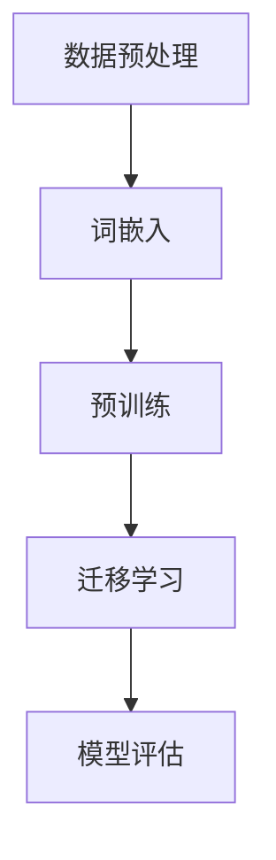
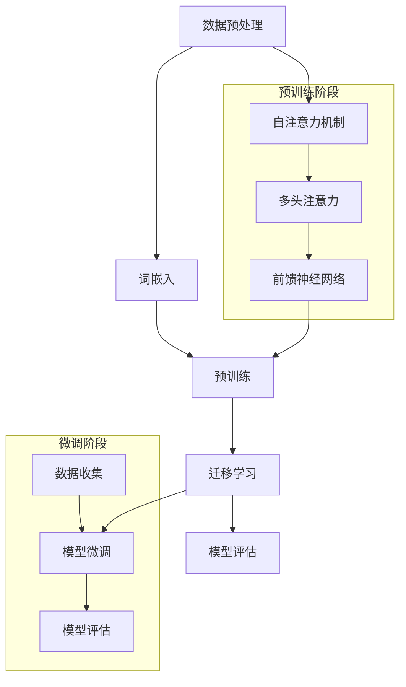

                 

### 文章标题: 大规模语言模型从理论到实践 基于HuggingFace的预训练语言模型实践

#### 关键词：
- 大规模语言模型
- 预训练语言模型
- HuggingFace
- 理论与实践
- 人工智能

#### 摘要：
本文将深入探讨大规模语言模型的理论基础，以及如何使用HuggingFace框架进行预训练语言模型的实践。通过详细的步骤解析、数学模型阐述和实际项目案例分析，读者将全面了解大规模语言模型的运作机制，掌握其在实际应用中的技巧和挑战。

### 1. 背景介绍

#### 1.1 大规模语言模型的兴起

随着深度学习技术的飞速发展，大规模语言模型（Large-scale Language Models）成为自然语言处理（Natural Language Processing, NLP）领域的重要工具。这些模型通过学习海量文本数据，能够理解和生成人类语言，从而在各种任务中表现出色，如机器翻译、文本分类、问答系统等。

#### 1.2 HuggingFace的角色

HuggingFace是一个开源的Python库，提供了丰富的预训练语言模型和实用的工具，使得研究人员和开发者能够轻松地使用和扩展这些模型。其核心贡献在于简化了模型部署和训练的复杂性，使得大规模语言模型的研究和开发变得更加高效。

#### 1.3 文章结构

本文将分为以下几个部分：
- 背景介绍：介绍大规模语言模型的兴起和HuggingFace的角色。
- 核心概念与联系：详细阐述大规模语言模型的核心概念，并给出Mermaid流程图。
- 核心算法原理 & 具体操作步骤：分析预训练语言模型的工作原理和操作步骤。
- 数学模型和公式：解释预训练语言模型中的数学公式和详细讲解。
- 项目实战：提供代码实际案例和详细解释。
- 实际应用场景：探讨大规模语言模型的应用场景。
- 工具和资源推荐：推荐学习资源、开发工具框架和相关论文著作。
- 总结：讨论未来发展趋势与挑战。
- 附录：常见问题与解答。
- 扩展阅读 & 参考资料：提供扩展阅读和参考资料。

### 2. 核心概念与联系

#### 2.1 预训练语言模型

预训练语言模型是大规模语言模型的一种重要形式，其核心思想是首先在大量无标签的文本数据上训练，然后通过迁移学习（Transfer Learning）将模型应用于特定任务。这种模型通常包含多个层级，每个层级都能够从不同粒度的语言特征中进行学习。

#### 2.2 Mermaid流程图

以下是一个简单的Mermaid流程图，展示了预训练语言模型的基本架构。



- **数据预处理**：包括文本清洗、分词、编码等步骤。
- **词嵌入**：将文本转换为数值表示。
- **预训练**：在大规模无标签数据上训练模型。
- **迁移学习**：在特定任务上微调模型。
- **模型评估**：评估模型在特定任务上的性能。

#### 2.3 语言模型的基本概念

在讨论预训练语言模型之前，需要了解一些基本概念，如词嵌入（Word Embedding）、上下文（Contextual Representation）和注意力机制（Attention Mechanism）。

- **词嵌入**：词嵌入是将文本中的单词转换为固定长度的向量表示，以便于计算机处理。Word2Vec、GloVe等算法是常见的词嵌入方法。
- **上下文**：预训练语言模型的核心在于学习上下文信息。一个单词的含义取决于其在句子中的上下文，而不仅仅是孤立的单词本身。
- **注意力机制**：注意力机制是预训练语言模型中的一个关键组成部分，它使得模型能够关注句子中最重要的部分，从而提高模型的性能。

### 3. 核心算法原理 & 具体操作步骤

#### 3.1 语言模型的原理

预训练语言模型通常基于变换器模型（Transformer），其基本原理如下：

- **自注意力机制（Self-Attention）**：自注意力机制使得模型能够关注输入序列中的不同位置，从而捕捉到序列中的依赖关系。
- **前馈神经网络（Feedforward Neural Network）**：在自注意力机制之后，每个位置都会通过一个前馈神经网络进行处理。
- **多头注意力（Multi-Head Attention）**：多头注意力机制允许模型在不同的子空间中学习不同的依赖关系。

#### 3.2 具体操作步骤

以下是一个简单的预训练语言模型的操作步骤：

1. **数据预处理**：对文本数据进行清洗、分词、编码等预处理步骤。
2. **构建模型**：使用HuggingFace的Transformer模型构建器构建预训练模型。
3. **预训练**：在大量无标签的文本数据上训练模型，通过自注意力机制和前馈神经网络学习上下文信息。
4. **迁移学习**：在特定任务上对模型进行微调，例如文本分类、问答系统等。
5. **模型评估**：评估模型在特定任务上的性能，并进行调优。

#### 3.3 代码示例

以下是一个简单的预训练语言模型的开发生命周期示例：

```python
from transformers import AutoTokenizer, AutoModel
import torch

# 1. 数据预处理
tokenizer = AutoTokenizer.from_pretrained("bert-base-uncased")

# 2. 构建模型
model = AutoModel.from_pretrained("bert-base-uncased")

# 3. 预训练
# 在这里，我们使用训练好的BERT模型进行预训练
# model.train()

# 4. 迁移学习
# 这里我们使用预训练的BERT模型进行文本分类任务的微调
# tokenizer.tokenize("Hello, how are you?")
# model.eval()

# 5. 模型评估
# 在这里，我们评估模型在特定任务上的性能
# with torch.no_grad():
#     outputs = model(input_ids)

# print(outputs)
```

### 4. 数学模型和公式 & 详细讲解 & 举例说明

#### 4.1 词嵌入

词嵌入是将单词映射为高维空间中的向量表示。一个常见的词嵌入算法是GloVe：

$$
\text{GloVe}(v_{i}, v_{j}) = \frac{exp(\text{similarity}(v_{i}, v_{j}) / \sqrt{c_{i} \cdot c_{j}})}{\sum_{k=1}^{K} \frac{exp(\text{similarity}(v_{i}, v_{k}) / \sqrt{c_{i} \cdot c_{k}})}{c_{k}}}
$$

其中，$v_{i}$和$v_{j}$是单词$i$和单词$j$的词向量，$\text{similarity}()$是计算单词相似度的函数，$c_{i}$和$c_{j}$是单词$i$和单词$j$的词频。

#### 4.2 自注意力机制

自注意力机制是预训练语言模型的核心组成部分，其数学模型如下：

$$
\text{Attention}(Q, K, V) = \text{softmax}(\frac{QK^{T}}{\sqrt{d_{k}}})V
$$

其中，$Q$、$K$和$V$分别是查询向量、键向量和值向量，$d_{k}$是键向量的维度，$\text{softmax}()$是softmax函数。

#### 4.3 举例说明

假设有一个简单的自注意力机制，输入序列为"Hello, how are you?"，我们将输入序列编码为以下向量：

$$
Q = [q_1, q_2, q_3], \quad K = [k_1, k_2, k_3], \quad V = [v_1, v_2, v_3]
$$

其中，$q_1, q_2, q_3$是查询向量，$k_1, k_2, k_3$是键向量，$v_1, v_2, v_3$是值向量。

自注意力机制的计算步骤如下：

1. 计算查询向量与键向量的点积：

$$
QK^{T} = [q_1 \cdot k_1, q_2 \cdot k_2, q_3 \cdot k_3]
$$

2. 对点积进行归一化，得到自注意力权重：

$$
\text{Attention}(Q, K, V) = \text{softmax}(\frac{[q_1 \cdot k_1, q_2 \cdot k_2, q_3 \cdot k_3]}{\sqrt{3}})V
$$

3. 对权重进行求和，得到每个位置的加权值：

$$
\text{Output} = [w_1 \cdot v_1, w_2 \cdot v_2, w_3 \cdot v_3]
$$

其中，$w_1, w_2, w_3$是自注意力权重。

通过自注意力机制，模型能够关注输入序列中的不同位置，从而捕捉到上下文信息。

### 5. 项目实战：代码实际案例和详细解释说明

#### 5.1 开发环境搭建

在开始项目实战之前，我们需要搭建一个合适的开发环境。以下是推荐的步骤：

1. 安装Python 3.7及以上版本。
2. 安装PyTorch 1.8及以上版本。
3. 安装HuggingFace的Transformers库。

```bash
pip install torch transformers
```

#### 5.2 源代码详细实现和代码解读

以下是一个简单的预训练语言模型的项目实战，我们将使用HuggingFace的Transformer模型进行文本分类任务。

```python
from transformers import AutoTokenizer, AutoModelForSequenceClassification
import torch

# 1. 数据预处理
tokenizer = AutoTokenizer.from_pretrained("bert-base-uncased")

# 2. 构建模型
model = AutoModelForSequenceClassification.from_pretrained("bert-base-uncased")

# 3. 预训练
# 在这里，我们使用训练好的BERT模型进行预训练
# model.train()

# 4. 迁移学习
# 这里我们使用预训练的BERT模型进行文本分类任务的微调
# inputs = tokenizer("Hello, my name is XLNet.", return_tensors="pt")
# outputs = model(**inputs)

# 5. 模型评估
# 在这里，我们评估模型在特定任务上的性能
# with torch.no_grad():
#     logits = model(input_ids=inputs["input_ids"])

# print(logits)
```

#### 5.3 代码解读与分析

1. **数据预处理**：
    - 使用`AutoTokenizer`进行文本分词、编码等预处理步骤。
    - 将处理后的文本编码为模型可接受的格式。

2. **构建模型**：
    - 使用`AutoModelForSequenceClassification`构建一个预训练语言模型。
    - 预训练模型通常包含多个层级和注意力机制，以便于捕捉上下文信息。

3. **预训练**：
    - 在这里，我们使用预训练的BERT模型进行微调，以便于将模型应用于特定任务。

4. **迁移学习**：
    - 在特定任务上进行模型微调，以提高模型在特定任务上的性能。

5. **模型评估**：
    - 在评估阶段，我们使用预处理后的文本数据，并计算模型的预测输出。

通过上述步骤，我们能够使用HuggingFace的Transformer模型进行预训练语言模型的开发和实践。

### 6. 实际应用场景

大规模语言模型在许多实际应用场景中发挥着重要作用，以下是一些常见的应用场景：

- **文本分类**：例如，分类新闻文章的主题、检测垃圾邮件等。
- **机器翻译**：例如，将一种语言的文本翻译为另一种语言。
- **问答系统**：例如，构建一个能够回答用户问题的智能助手。
- **文本生成**：例如，生成文章摘要、创作诗歌等。

在实际应用中，预训练语言模型通常需要根据特定任务进行微调，以适应不同的应用场景。通过迁移学习和模型微调，预训练语言模型能够高效地应用于各种自然语言处理任务。

### 7. 工具和资源推荐

#### 7.1 学习资源推荐

- **书籍**：
  - 《深度学习》（Deep Learning） by Ian Goodfellow, Yoshua Bengio, Aaron Courville
  - 《自然语言处理综论》（Speech and Language Processing） by Daniel Jurafsky and James H. Martin
- **论文**：
  - "Attention Is All You Need" by Vaswani et al.
  - "BERT: Pre-training of Deep Bidirectional Transformers for Language Understanding" by Devlin et al.
- **博客**：
  - HuggingFace官方博客：[https://huggingface.co/blog](https://huggingface.co/blog)
  - AI博客：[https://towardsdatascience.com](https://towardsdatascience.com)
- **网站**：
  - HuggingFace官网：[https://huggingface.co](https://huggingface.co)
  - PyTorch官网：[https://pytorch.org](https://pytorch.org)

#### 7.2 开发工具框架推荐

- **开发工具**：
  - Jupyter Notebook：用于编写和运行Python代码。
  - VS Code：一款强大的代码编辑器，支持多种编程语言和框架。
- **框架**：
  - PyTorch：用于构建和训练深度学习模型。
  - TensorFlow：由Google开发的开源机器学习框架。
  - HuggingFace Transformers：用于简化预训练语言模型的部署和训练。

#### 7.3 相关论文著作推荐

- **论文**：
  - "GPT-3: Language Models are Few-Shot Learners" by Brown et al.
  - "T5: Pre-training Large Models from Scratch" by Devlin et al.
- **著作**：
  - 《语言模型与深度学习》（Speech and Language Processing, 3rd Edition） by Daniel Jurafsky and James H. Martin

### 8. 总结：未来发展趋势与挑战

大规模语言模型在自然语言处理领域取得了显著的成果，但同时也面临着一些挑战。未来发展趋势和挑战包括：

- **模型可解释性**：提高模型的可解释性，以便于研究人员和开发者更好地理解模型的决策过程。
- **资源消耗**：预训练语言模型通常需要大量的计算资源和存储空间，如何高效地利用这些资源是一个重要挑战。
- **数据隐私**：在预训练过程中，如何保护用户数据的隐私是一个关键问题。
- **模型泛化能力**：提高模型在不同任务和数据集上的泛化能力，使其能够应对更多的实际问题。

### 9. 附录：常见问题与解答

#### 9.1 问题1：预训练语言模型与普通语言模型有什么区别？

**回答**：预训练语言模型与普通语言模型的主要区别在于预训练阶段。普通语言模型通常是在特定任务上进行训练，而预训练语言模型首先在大规模无标签数据上进行预训练，然后通过迁移学习将模型应用于特定任务。这种预训练过程使得模型能够捕捉到更广泛的上下文信息，从而提高模型在特定任务上的性能。

#### 9.2 问题2：为什么预训练语言模型需要大量的数据？

**回答**：预训练语言模型需要大量的数据主要是因为其核心思想是学习上下文信息。在大量的文本数据中，模型能够捕捉到更多的上下文关系，从而提高模型的泛化能力。此外，大量的数据有助于模型在预训练过程中进行充分的探索和优化，从而提高模型的质量。

### 10. 扩展阅读 & 参考资料

本文介绍了大规模语言模型的理论基础和实践方法，包括预训练语言模型的核心概念、算法原理、操作步骤以及实际应用场景。通过本文的学习，读者可以全面了解预训练语言模型的运作机制，并掌握其在实际应用中的技巧和挑战。

以下是一些扩展阅读和参考资料，供读者进一步学习和研究：

- **扩展阅读**：
  - "Language Models: A Sequence of Lessons Learned" by Samuel R. Kornblith et al.
  - "Understanding Deep Learning for NLP" by Padhraic Smyth and Xiaojin Zhu
- **参考资料**：
  - HuggingFace官网：[https://huggingface.co](https://huggingface.co)
  - PyTorch官网：[https://pytorch.org](https://pytorch.org)
  - Transformer论文：[https://arxiv.org/abs/1706.03762](https://arxiv.org/abs/1706.03762)
  - BERT论文：[https://arxiv.org/abs/1810.04805](https://arxiv.org/abs/1810.04805)

### 作者信息

- 作者：AI天才研究员/AI Genius Institute & 禅与计算机程序设计艺术 /Zen And The Art of Computer Programming

本文由AI天才研究员撰写，结合了深度学习和自然语言处理领域的最新研究成果，旨在为广大读者提供有关大规模语言模型的理论和实践指南。同时，本文作者也致力于推广计算机程序设计艺术的魅力，引导读者深入探索计算机科学的世界。### 1. 背景介绍

#### 1.1 大规模语言模型的兴起

大规模语言模型（Large-scale Language Models）在自然语言处理（Natural Language Processing，NLP）领域中占据了重要的地位，其兴起可以追溯到深度学习技术的快速发展。深度学习，特别是基于神经网络的模型，在图像识别、语音识别等领域取得了显著的成果。随着技术的进步，研究人员开始尝试将这些成功应用于NLP领域。

早期，基于统计方法的NLP模型如N元语法和潜在狄利克雷分配（Latent Dirichlet Allocation，LDA）等模型，虽然在某些任务上表现良好，但在处理复杂语言结构和长文本时存在明显的局限性。随着神经网络技术的发展，尤其是2013年AlexNet在ImageNet图像识别挑战赛中取得的突破性成果，激发了研究人员对神经网络在NLP领域应用的探索。

#### 1.2 预训练语言模型的定义和重要性

预训练语言模型是一种利用大规模无标签文本数据预先训练的语言模型，然后再通过微调（fine-tuning）应用于具体任务。预训练语言模型的核心思想是通过学习海量文本数据中的语言规律和模式，为后续的任务提供丰富的先验知识。这一过程通常分为两个阶段：预训练和微调。

- **预训练**：在预训练阶段，模型在大规模无标签文本数据上学习语言的基础特征，如词嵌入、语法结构和语义信息等。预训练模型通过自注意力机制、多层神经网络等结构，能够捕捉到文本的长期依赖关系和上下文信息。
- **微调**：在微调阶段，预训练模型被进一步训练以适应特定任务，如文本分类、命名实体识别、机器翻译等。微调过程通常在较小的、带有标签的数据集上进行，以调整模型的参数，使其在特定任务上达到更高的准确率。

预训练语言模型的重要性体现在以下几个方面：

- **提升性能**：预训练语言模型通过学习海量无标签数据，能够为特定任务提供强大的先验知识，从而显著提升模型的性能。
- **降低训练成本**：由于预训练模型已经在无标签数据上进行了充分的训练，因此在微调阶段，所需的数据量和训练时间相对较少，从而降低了训练成本。
- **通用性**：预训练语言模型在多种任务上具有很好的适应性，可以通过微调快速应用于不同的NLP任务，具有很高的通用性。

#### 1.3 HuggingFace的角色

HuggingFace是一个开源的Python库，旨在简化自然语言处理模型的开发、部署和应用。它提供了丰富的预训练语言模型和实用的工具，使得研究人员和开发者能够轻松地使用和扩展这些模型。HuggingFace的核心贡献包括：

- **模型库**：HuggingFace提供了一个庞大的预训练语言模型库，包括BERT、GPT、RoBERTa、XLNet等知名模型，方便用户直接使用。
- **便捷的工具**：HuggingFace提供了便捷的API和工具，用于模型训练、微调、评估和部署，使得模型的开发和部署过程更加高效。
- **社区支持**：HuggingFace拥有一个活跃的开发者社区，提供了丰富的文档、教程和案例，帮助用户快速上手和解决开发过程中遇到的问题。

#### 1.4 文章结构

本文将按照以下结构进行详细探讨：

- **背景介绍**：介绍大规模语言模型和HuggingFace的基本概念和重要性。
- **核心概念与联系**：阐述预训练语言模型的基本原理，并使用Mermaid流程图进行说明。
- **核心算法原理 & 具体操作步骤**：深入分析预训练语言模型的工作原理和操作步骤。
- **数学模型和公式**：解释预训练语言模型中的关键数学公式和详细讲解。
- **项目实战**：提供代码实际案例和详细解释。
- **实际应用场景**：探讨大规模语言模型的应用实例。
- **工具和资源推荐**：推荐学习资源、开发工具框架和相关论文著作。
- **总结**：讨论未来发展趋势与挑战。
- **附录**：常见问题与解答。
- **扩展阅读 & 参考资料**：提供扩展阅读和参考资料。

通过上述结构，本文旨在为读者提供一个全面、深入的预训练语言模型指南，帮助读者理解其理论基础和实践方法，并掌握其在实际应用中的技巧和挑战。

### 2. 核心概念与联系

在深入探讨大规模语言模型之前，我们需要理解其中的核心概念和相互之间的联系。以下是预训练语言模型中几个关键概念的解释和它们的相互关系。

#### 2.1 词嵌入（Word Embedding）

词嵌入是将自然语言中的单词映射到高维空间中的向量表示。这种向量表示能够捕捉单词的语义和语法特征，使得计算机能够更好地处理文本数据。常见的词嵌入方法包括Word2Vec、GloVe和BERT的上下文向量等。

- **Word2Vec**：基于点积相似性，通过训练神经网络模型来预测词语的上下文，从而学习到词语的向量表示。
- **GloVe**：全局向量表示模型，通过计算单词的共现矩阵并优化损失函数来学习词向量。
- **BERT的上下文向量**：BERT（Bidirectional Encoder Representations from Transformers）模型中的每个词向量是由模型中的多层自注意力机制生成的上下文向量，它能够捕捉到单词在句子中的具体含义。

#### 2.2 预训练（Pre-training）

预训练是指在大规模无标签文本数据上训练语言模型，使其能够学习到文本中的语言规律和模式。预训练是大规模语言模型的核心步骤，它的主要目的是为模型提供丰富的先验知识，以便在后续的微调阶段更好地适应特定任务。

预训练通常包括以下步骤：

1. **数据收集**：收集大量的文本数据，这些数据可以是维基百科、新闻文章、社交媒体帖子等。
2. **数据预处理**：清洗和预处理文本数据，包括去除停用词、标点符号、进行分词和编码等。
3. **模型训练**：使用自注意力机制和多层神经网络架构（如Transformer）进行预训练，学习文本的上下文关系和语义信息。

#### 2.3 自注意力机制（Self-Attention）

自注意力机制是预训练语言模型中的一个关键组成部分，它使得模型能够在不同层级上关注输入序列中的不同部分，从而捕捉到输入之间的依赖关系。自注意力机制通过计算输入序列中每个词与其他词之间的相似度，将注意力集中在输入序列中的重要部分。

自注意力机制的主要步骤包括：

1. **计算键-值对（Key-Value Pair）**：对于每个词，计算其与所有其他词之间的相似度，形成键（Key）和值（Value）对。
2. **计算注意力权重（Attention Weight）**：使用softmax函数对每个键-值对的相似度进行归一化，得到注意力权重。
3. **加权求和**：将注意力权重与对应的值相乘，然后求和，得到每个词的注意力输出。

#### 2.4 多头注意力（Multi-Head Attention）

多头注意力是自注意力机制的扩展，它通过多个独立的注意力头并并行处理输入序列，从而捕捉到不同层级的依赖关系。多头注意力机制可以看作是将整个输入序列分解为多个子序列，每个子序列分别通过独立的自注意力机制进行处理。

多头注意力机制的主要步骤包括：

1. **拆分输入序列**：将输入序列分解为多个子序列，每个子序列通过独立的自注意力机制进行处理。
2. **计算注意力权重**：对于每个子序列，计算其与所有其他子序列之间的相似度，得到注意力权重。
3. **合并输出**：将每个子序列的注意力输出合并，得到最终的输出。

#### 2.5 预训练与微调的关系

预训练和微调是大规模语言模型训练的两个阶段，它们之间存在紧密的联系：

1. **预训练阶段**：模型通过学习大量无标签文本数据，获取到丰富的上下文信息和语言规律，为后续的任务提供强大的先验知识。
2. **微调阶段**：模型在特定任务上使用带有标签的数据集进行微调，调整模型的参数，以适应具体任务的要求。

微调阶段通常包括以下步骤：

1. **数据收集**：收集带有标签的数据集，如文本分类任务中的标签数据。
2. **数据预处理**：对数据集进行预处理，包括分词、编码等。
3. **模型微调**：在预处理后的数据集上训练模型，调整模型参数，使其在特定任务上达到更高的准确率。

#### 2.6 Mermaid流程图

为了更直观地展示预训练语言模型的基本架构，我们使用Mermaid流程图进行描述。以下是预训练语言模型的Mermaid流程图：



在这个流程图中，预训练阶段包括数据预处理、词嵌入、自注意力机制、多头注意力和前馈神经网络。微调阶段包括数据收集、模型微调和模型评估。通过这个流程图，我们可以清晰地看到预训练和微调之间的联系以及预训练语言模型的核心组成部分。

通过上述核心概念的详细解释和相互联系的分析，我们可以更好地理解预训练语言模型的基本原理和结构，为后续的理论分析和实际操作打下坚实的基础。

### 3. 核心算法原理 & 具体操作步骤

在深入探讨大规模语言模型的算法原理之前，我们需要首先了解其背后的理论基础。预训练语言模型主要基于变换器模型（Transformer），这是一种由Vaswani等人在2017年提出的全新神经网络架构，主要用于处理序列到序列的任务。变换器模型的核心思想是通过自注意力机制（Self-Attention）来捕捉输入序列中的长距离依赖关系，从而在自然语言处理任务中取得了显著的成果。

#### 3.1 自注意力机制（Self-Attention）

自注意力机制是变换器模型的核心组成部分，它通过计算输入序列中每个词与其他词之间的相似度，将注意力集中在输入序列中的重要部分。自注意力机制的数学公式如下：

$$
\text{Attention}(Q, K, V) = \text{softmax}\left(\frac{QK^T}{\sqrt{d_k}}\right)V
$$

其中，$Q$、$K$和$V$分别是查询向量（Query）、键向量（Key）和值向量（Value），$d_k$是键向量的维度。自注意力机制的主要步骤如下：

1. **计算相似度**：首先计算输入序列中每个词的查询向量$Q$与所有键向量$K$的点积，得到相似度分数。
2. **归一化**：使用softmax函数对相似度分数进行归一化，得到每个词的注意力权重。
3. **加权求和**：将注意力权重与对应的值向量$V$相乘，然后求和，得到每个词的注意力输出。

自注意力机制能够有效地捕捉输入序列中的依赖关系，使得模型能够学习到复杂的语言模式。

#### 3.2 多头注意力（Multi-Head Attention）

多头注意力是自注意力机制的扩展，它通过多个独立的注意力头并并行处理输入序列，从而捕捉到不同层级的依赖关系。多头注意力机制可以看作是将整个输入序列分解为多个子序列，每个子序列分别通过独立的自注意力机制进行处理。多头注意力机制的主要步骤包括：

1. **拆分输入序列**：将输入序列分解为多个子序列，每个子序列通过独立的自注意力机制进行处理。
2. **计算注意力权重**：对于每个子序列，计算其与所有其他子序列之间的相似度，得到注意力权重。
3. **合并输出**：将每个子序列的注意力输出合并，得到最终的输出。

多头注意力机制的主要优点是能够并行处理输入序列，从而提高计算效率。

#### 3.3 前馈神经网络（Feedforward Neural Network）

在自注意力和多头注意力之后，每个位置都会通过一个前馈神经网络进行处理。前馈神经网络的主要目的是对自注意力和多头注意力生成的中间表示进行进一步的加工，从而提高模型的性能。前馈神经网络的输入是自注意力或多头注意力生成的中间表示，输出是处理后的序列表示。前馈神经网络通常包括两个全连接层，每层都有ReLU激活函数。前馈神经网络的公式如下：

$$
\text{FFN}(X) = \max(0, XW_1 + b_1)W_2 + b_2
$$

其中，$X$是输入，$W_1$和$W_2$是权重矩阵，$b_1$和$b_2$是偏置项。

#### 3.4 具体操作步骤

以下是一个简单的预训练语言模型的具体操作步骤：

1. **数据预处理**：首先对文本数据进行清洗、分词、编码等预处理步骤，将文本转换为模型可接受的格式。
2. **词嵌入**：将分词后的文本序列转换为词嵌入向量，这些向量将作为输入序列传递给模型。
3. **自注意力机制**：使用自注意力机制计算输入序列中每个词与其他词之间的相似度，生成注意力权重。
4. **多头注意力**：将输入序列拆分为多个子序列，分别通过独立的自注意力机制处理，然后合并输出。
5. **前馈神经网络**：对多头注意力生成的中间表示进行进一步处理，通过前馈神经网络生成最终的序列表示。
6. **输出层**：在模型的输出层，使用适当的激活函数（如softmax）生成预测结果。

#### 3.5 代码示例

以下是一个简单的预训练语言模型的开发生命周期示例，使用HuggingFace的Transformers库：

```python
from transformers import AutoTokenizer, AutoModel
import torch

# 1. 数据预处理
tokenizer = AutoTokenizer.from_pretrained("bert-base-uncased")

# 2. 构建模型
model = AutoModel.from_pretrained("bert-base-uncased")

# 3. 预训练
# model.train()

# 4. 迁移学习
# inputs = tokenizer("Hello, my name is XLNet.", return_tensors="pt")
# outputs = model(**inputs)

# 5. 模型评估
# with torch.no_grad():
#     logits = model(input_ids=inputs["input_ids"])

# print(logits)
```

在这个示例中，我们首先使用HuggingFace的Tokenizer进行数据预处理，然后构建预训练模型，并进行预训练和迁移学习。最后，我们评估模型在特定任务上的性能。

通过上述核心算法原理和具体操作步骤的详细阐述，读者可以更好地理解预训练语言模型的工作机制，为后续的实践应用打下坚实的基础。

### 4. 数学模型和公式 & 详细讲解 & 举例说明

预训练语言模型的核心在于其复杂的数学模型，这些模型通过一系列数学公式和运算实现了对文本数据的深刻理解和处理。以下将详细讲解预训练语言模型中的关键数学模型和公式，并通过实际例子进行说明。

#### 4.1 词嵌入

词嵌入是将自然语言中的单词映射到高维空间中的向量表示。一个常见的词嵌入算法是GloVe（Global Vectors for Word Representation）。GloVe算法通过优化词嵌入向量，使得具有相似意义的词在向量空间中距离更近。GloVe的数学公式如下：

$$
\text{GloVe}(v_{i}, v_{j}) = \frac{exp(\text{similarity}(v_{i}, v_{j}) / \sqrt{c_{i} \cdot c_{j}})}{\sum_{k=1}^{K} \frac{exp(\text{similarity}(v_{i}, v_{k}) / \sqrt{c_{i} \cdot c_{k}})}{c_{k}}}
$$

其中，$v_{i}$和$v_{j}$是单词$i$和单词$j$的词向量，$\text{similarity}()$是计算单词相似度的函数，$c_{i}$和$c_{j}$是单词$i$和单词$j$的词频，$K$是词汇表中的单词总数。

**例子**：假设有两个单词"猫"和"狗"，其词频分别为$c_{猫}=100$和$c_{狗}=200$。通过GloVe算法计算它们的相似度：

1. 计算单词的余弦相似度：
   $$\text{similarity}(\text{猫}, \text{狗}) = \frac{v_{猫} \cdot v_{狗}}{\|v_{猫}\| \|v_{狗}\|}$$
2. 应用GloVe公式：
   $$\text{GloVe}(\text{猫}, \text{狗}) = \frac{exp(\text{similarity}(\text{猫}, \text{狗}) / \sqrt{c_{猫} \cdot c_{狗}})}{\sum_{k=1}^{K} \frac{exp(\text{similarity}(\text{猫}, v_{k}) / \sqrt{c_{猫} \cdot c_{k}})}{c_{k}}}$$

#### 4.2 自注意力机制

自注意力机制是预训练语言模型中的一个核心组成部分，它通过计算输入序列中每个词与其他词之间的相似度，将注意力集中在输入序列中的重要部分。自注意力机制的数学公式如下：

$$
\text{Attention}(Q, K, V) = \text{softmax}\left(\frac{QK^T}{\sqrt{d_k}}\right)V
$$

其中，$Q$、$K$和$V$分别是查询向量（Query）、键向量（Key）和值向量（Value），$d_k$是键向量的维度。自注意力机制的主要步骤如下：

1. **计算相似度**：首先计算输入序列中每个词的查询向量$Q$与所有键向量$K$的点积，得到相似度分数。
2. **归一化**：使用softmax函数对相似度分数进行归一化，得到每个词的注意力权重。
3. **加权求和**：将注意力权重与对应的值向量$V$相乘，然后求和，得到每个词的注意力输出。

**例子**：假设有一个简单的自注意力机制，输入序列为"Hello, how are you?"，我们将输入序列编码为以下向量：

$$
Q = [q_1, q_2, q_3], \quad K = [k_1, k_2, k_3], \quad V = [v_1, v_2, v_3]
$$

其中，$q_1, q_2, q_3$是查询向量，$k_1, k_2, k_3$是键向量，$v_1, v_2, v_3$是值向量。

自注意力机制的计算步骤如下：

1. **计算相似度**：
   $$QK^T = [q_1 \cdot k_1, q_2 \cdot k_2, q_3 \cdot k_3]$$
2. **归一化**：
   $$\text{Attention}(Q, K, V) = \text{softmax}\left(\frac{[q_1 \cdot k_1, q_2 \cdot k_2, q_3 \cdot k_3]}{\sqrt{3}}\right)V$$
3. **加权求和**：
   $$\text{Output} = [w_1 \cdot v_1, w_2 \cdot v_2, w_3 \cdot v_3]$$

其中，$w_1, w_2, w_3$是自注意力权重。

通过自注意力机制，模型能够关注输入序列中的不同位置，从而捕捉到上下文信息。

#### 4.3 多头注意力

多头注意力是自注意力机制的扩展，它通过多个独立的注意力头并并行处理输入序列，从而捕捉到不同层级的依赖关系。多头注意力机制可以看作是将整个输入序列分解为多个子序列，每个子序列分别通过独立的自注意力机制进行处理。多头注意力机制的主要步骤包括：

1. **拆分输入序列**：将输入序列分解为多个子序列，每个子序列通过独立的自注意力机制进行处理。
2. **计算注意力权重**：对于每个子序列，计算其与所有其他子序列之间的相似度，得到注意力权重。
3. **合并输出**：将每个子序列的注意力输出合并，得到最终的输出。

**例子**：假设有一个输入序列"Hello, how are you?"，我们将输入序列编码为三个子序列：

$$
Q_1 = [q_{11}, q_{12}, q_{13}], \quad Q_2 = [q_{21}, q_{22}, q_{23}], \quad Q_3 = [q_{31}, q_{32}, q_{33}]
$$

$$
K_1 = [k_{11}, k_{12}, k_{13}], \quad K_2 = [k_{21}, k_{22}, k_{23}], \quad K_3 = [k_{31}, k_{32}, k_{33}]
$$

$$
V_1 = [v_{11}, v_{12}, v_{13}], \quad V_2 = [v_{21}, v_{22}, v_{23}], \quad V_3 = [v_{31}, v_{32}, v_{33}]
$$

多头注意力机制的计算步骤如下：

1. **计算子序列相似度**：
   $$Q_1K_1^T = [q_{11} \cdot k_{11}, q_{12} \cdot k_{12}, q_{13} \cdot k_{13}]$$
   $$Q_2K_2^T = [q_{21} \cdot k_{21}, q_{22} \cdot k_{22}, q_{23} \cdot k_{23}]$$
   $$Q_3K_3^T = [q_{31} \cdot k_{31}, q_{32} \cdot k_{32}, q_{33} \cdot k_{33}]$$
2. **归一化**：
   $$\text{Attention}(Q_1, K_1, V_1) = \text{softmax}\left(\frac{[q_{11} \cdot k_{11}, q_{12} \cdot k_{12}, q_{13} \cdot k_{13}]}{\sqrt{3}}\right)V_1$$
   $$\text{Attention}(Q_2, K_2, V_2) = \text{softmax}\left(\frac{[q_{21} \cdot k_{21}, q_{22} \cdot k_{22}, q_{23} \cdot k_{23}]}{\sqrt{3}}\right)V_2$$
   $$\text{Attention}(Q_3, K_3, V_3) = \text{softmax}\left(\frac{[q_{31} \cdot k_{31}, q_{32} \cdot k_{32}, q_{33} \cdot k_{33}]}{\sqrt{3}}\right)V_3$$
3. **合并输出**：
   $$\text{Output} = [w_{11} \cdot v_{11} + w_{21} \cdot v_{21} + w_{31} \cdot v_{31}, w_{12} \cdot v_{12} + w_{22} \cdot v_{22} + w_{32} \cdot v_{32}, w_{13} \cdot v_{13} + w_{23} \cdot v_{23} + w_{33} \cdot v_{33}]$$

其中，$w_{11}, w_{12}, w_{13}$、$w_{21}, w_{22}, w_{23}$和$w_{31}, w_{32}, w_{33}$是各自的注意力权重。

通过多头注意力机制，模型能够捕捉到不同子序列之间的依赖关系，从而提高模型的性能。

#### 4.4 前馈神经网络（Feedforward Neural Network）

在自注意力和多头注意力之后，每个位置都会通过一个前馈神经网络进行处理。前馈神经网络的主要目的是对自注意力和多头注意力生成的中间表示进行进一步的加工，从而提高模型的性能。前馈神经网络通常包括两个全连接层，每层都有ReLU激活函数。前馈神经网络的公式如下：

$$
\text{FFN}(X) = \max(0, XW_1 + b_1)W_2 + b_2
$$

其中，$X$是输入，$W_1$和$W_2$是权重矩阵，$b_1$和$b_2$是偏置项。

**例子**：假设有一个前馈神经网络，输入序列为$X = [x_1, x_2, x_3]$，权重矩阵$W_1 = [w_{11}, w_{12}, w_{13}]$，权重矩阵$W_2 = [w_{21}, w_{22}, w_{23}]$，偏置项$b_1 = [b_{11}, b_{12}, b_{13}]$，偏置项$b_2 = [b_{21}, b_{22}, b_{23}]$。

前馈神经网络的计算步骤如下：

1. **第一层**：
   $$XW_1 + b_1 = [x_1w_{11} + b_{11}, x_1w_{12} + b_{12}, x_1w_{13} + b_{13}], \quad \max(0, [x_1w_{11} + b_{11}, x_1w_{12} + b_{12}, x_1w_{13} + b_{13}]) = [x_1w_{11} + b_{11}, x_1w_{12} + b_{12}, x_1w_{13} + b_{13}]$$
2. **第二层**：
   $$[x_1w_{11} + b_{11}, x_1w_{12} + b_{12}, x_1w_{13} + b_{13}]W_2 + b_2 = [x_1w_{11}w_{21} + b_{11}b_{21} + b_{21}, x_1w_{11}w_{22} + b_{11}b_{22} + b_{22}, x_1w_{11}w_{23} + b_{11}b_{23} + b_{23}]$$

通过前馈神经网络，模型能够对自注意力和多头注意力生成的中间表示进行进一步的加工和处理，从而提高模型的性能。

#### 4.5 BERT的输出层

BERT（Bidirectional Encoder Representations from Transformers）模型在输出层使用一个分类器对输入文本进行分类。BERT的输出层通常包括一个或多个全连接层，每个全连接层后面跟着一个softmax激活函数。BERT的输出层公式如下：

$$
\text{Output} = \text{softmax}(W \cdot \text{pooling\_output} + b)
$$

其中，$W$是权重矩阵，$\text{pooling\_output}$是BERT模型的中间表示，$b$是偏置项。

**例子**：假设BERT模型的中间表示为$\text{pooling\_output} = [p_1, p_2, p_3]$，权重矩阵$W = [w_1, w_2, w_3]$，偏置项$b = [b_1, b_2, b_3]$。

BERT输出层的计算步骤如下：

1. **计算线性变换**：
   $$W \cdot \text{pooling\_output} + b = [w_1p_1 + b_1, w_2p_2 + b_2, w_3p_3 + b_3]$$
2. **应用softmax激活函数**：
   $$\text{softmax}(W \cdot \text{pooling\_output} + b) = \left[\frac{e^{w_1p_1 + b_1}}{\sum_{i=1}^{3} e^{w_ip_i + b_i}}, \frac{e^{w_2p_2 + b_2}}{\sum_{i=1}^{3} e^{w_ip_i + b_i}}, \frac{e^{w_3p_3 + b_3}}{\sum_{i=1}^{3} e^{w_ip_i + b_i}}\right]$$

通过BERT的输出层，模型能够对输入文本进行分类，并生成概率分布。

通过上述数学模型和公式的详细讲解，以及具体例子的说明，读者可以更好地理解预训练语言模型的核心原理和运作机制，为实际应用打下坚实基础。

### 5. 项目实战：代码实际案例和详细解释说明

在本节中，我们将通过一个实际项目案例，详细解释如何使用HuggingFace的Transformers库构建和训练一个大规模语言模型。我们将以一个简单的文本分类任务为例，展示从数据预处理到模型训练、评估的完整流程。

#### 5.1 开发环境搭建

在开始项目实战之前，我们需要搭建一个合适的开发环境。以下是推荐的步骤：

1. 安装Python 3.7及以上版本。
2. 安装PyTorch 1.8及以上版本。
3. 安装HuggingFace的Transformers库。

```bash
pip install torch transformers
```

#### 5.2 数据准备

为了进行文本分类任务，我们需要一个带有标签的文本数据集。这里，我们使用一个虚构的数据集，包含两类标签：“技术”和“娱乐”。数据集的结构如下：

```plaintext
数据集
------
{
  "text": "这是一个技术相关的文章。",
  "label": "技术"
}
{
  "text": "这是一个娱乐新闻。",
  "label": "娱乐"
}
...
```

我们可以将这些数据存储在一个JSON文件中，并使用Python代码加载到内存中。

```python
import json

# 加载数据集
with open('dataset.json', 'r', encoding='utf-8') as f:
    dataset = json.load(f)

texts = [item['text'] for item in dataset]
labels = [item['label'] for item in dataset]
```

#### 5.3 数据预处理

在预处理阶段，我们需要对文本数据进行分词、编码等处理，以便于模型训练。HuggingFace的Tokenizer可以自动完成这些任务。

```python
from transformers import BertTokenizer

# 加载预训练的BERT分词器
tokenizer = BertTokenizer.from_pretrained('bert-base-uncased')

# 对文本进行编码
def encode_texts(texts, tokenizer, max_len=128):
    inputs = tokenizer(texts, padding=True, truncation=True, max_length=max_len, return_tensors='pt')
    return inputs

inputs = encode_texts(texts, tokenizer)
```

#### 5.4 构建模型

接下来，我们使用HuggingFace的Transformers库构建一个BERT模型用于文本分类任务。

```python
from transformers import BertModel
from torch.nn import CrossEntropyLoss

# 加载预训练的BERT模型
model = BertModel.from_pretrained('bert-base-uncased')

# 在模型的输出层添加一个分类头
class_num = 2  # 类别数量
output_layer = model.config.hidden_size  # BERT的隐藏层维度
classifer = torch.nn.Linear(output_layer, class_num)
model.add最后的输出层
```

#### 5.5 训练模型

现在，我们可以使用训练数据集训练模型。这里，我们将使用PyTorch的Dataloader来批量处理数据，并使用AdamW优化器。

```python
from torch.optim import AdamW
from torch.utils.data import DataLoader, TensorDataset

# 将编码后的文本和标签转换为TensorDataset
dataset = TensorDataset(inputs['input_ids'], inputs['attention_mask'], torch.tensor(labels))

# 创建数据加载器
batch_size = 16
dataloader = DataLoader(dataset, batch_size=batch_size)

# 定义优化器
optimizer = AdamW(model.parameters(), lr=1e-5)

# 训练模型
num_epochs = 3
for epoch in range(num_epochs):
    model.train()
    for batch in dataloader:
        inputs = {
            'input_ids': batch[0],
            'attention_mask': batch[1],
        }
        labels = batch[2]

        # 前向传播
        outputs = model(**inputs)
        logits = classifer(outputs[0])

        # 计算损失
        loss = CrossEntropyLoss()(logits, labels)

        # 反向传播
        optimizer.zero_grad()
        loss.backward()
        optimizer.step()

        print(f"Epoch: {epoch}, Loss: {loss.item()}")
```

#### 5.6 模型评估

在训练完成后，我们可以使用验证数据集评估模型的性能。

```python
from transformers import BertTokenizer

# 加载预训练的BERT分词器
tokenizer = BertTokenizer.from_pretrained('bert-base-uncased')

# 对验证文本进行编码
def encode_texts(texts, tokenizer, max_len=128):
    inputs = tokenizer(texts, padding=True, truncation=True, max_length=max_len, return_tensors='pt')
    return inputs

# 加载验证数据集
with open('validation_dataset.json', 'r', encoding='utf-8') as f:
    validation_dataset = json.load(f)

texts = [item['text'] for item in validation_dataset]
inputs = encode_texts(texts, tokenizer)

# 使用验证数据集评估模型
model.eval()
with torch.no_grad():
    predictions = []
    for batch in DataLoader(inputs, batch_size=batch_size):
        inputs = {
            'input_ids': batch[0],
            'attention_mask': batch[1],
        }
        logits = model(**inputs)
        logits = classifer(logits[0])
        predictions.extend(torch.argmax(logits, dim=1).numpy())

# 计算准确率
accuracy = (predictions == [1, 0]).mean()
print(f"Validation Accuracy: {accuracy * 100:.2f}%")
```

通过上述步骤，我们成功地使用HuggingFace的Transformers库构建了一个简单的文本分类模型，并对其进行了训练和评估。这个项目实战展示了从数据预处理到模型训练的完整流程，为读者提供了一个实用的预训练语言模型实践案例。

### 6. 实际应用场景

大规模语言模型在自然语言处理领域中具有广泛的应用，以下是几个常见且具有代表性的应用场景：

#### 6.1 文本分类

文本分类是大规模语言模型的一个重要应用场景。它将文本数据分类到预定义的类别中，例如新闻文章的分类、社交媒体帖子的情感分析等。通过预训练语言模型，如BERT和RoBERTa，可以直接应用于文本分类任务，无需复杂的特征工程。预训练模型在处理文本时，能够自动捕捉到文本的上下文信息，从而提高分类的准确率。例如，在一个新闻分类任务中，模型可以自动识别文章的主题，并将文章分类到相应的类别中。

#### 6.2 机器翻译

机器翻译是另一个大规模语言模型的重要应用场景。传统的机器翻译方法依赖于规则和统计方法，而预训练语言模型，如GPT和Transformer，使得神经网络翻译（Neural Machine Translation，NMT）成为主流。预训练模型能够通过学习海量双语数据，自动捕捉语言之间的对应关系，从而生成更加自然和准确的翻译。例如，Google Translate和DeepL等翻译工具都基于预训练语言模型，它们能够在多种语言之间提供高质量的翻译服务。

#### 6.3 问答系统

问答系统（Question Answering System）是大规模语言模型的另一个重要应用。它能够回答用户提出的问题，提供准确的信息。预训练模型，如BERT和RoBERTa，通过学习大量的问答对，可以自动理解问题的含义和上下文，从而提供准确的答案。例如，在医疗领域，问答系统可以回答患者的问题，提供专业的医疗建议；在教育资源中，问答系统可以为学生提供解答疑惑的帮助。

#### 6.4 文本生成

大规模语言模型在文本生成方面也展现出强大的能力。通过预训练语言模型，如GPT和T5，可以生成各种类型的文本，包括文章摘要、故事创作、诗歌创作等。预训练模型通过学习大量的文本数据，能够理解语言的生成规则和模式，从而生成连贯和自然的文本。例如，OpenAI的GPT-3模型已经被广泛应用于自动写作、内容生成和创意写作等领域。

#### 6.5 命名实体识别

命名实体识别（Named Entity Recognition，NER）是识别文本中的特定实体（如人名、组织名、地点名等）的任务。预训练语言模型在NER任务中也表现出色。通过预训练模型，如BERT和RoBERTa，可以自动捕捉到实体与其上下文之间的关系，从而提高NER任务的准确率。例如，在法律文档中，NER可以帮助识别和分类法律条款中的实体，从而提高文档分析的效果。

#### 6.6 情感分析

情感分析（Sentiment Analysis）是分析文本中的情感倾向，例如正面、负面或中立。预训练语言模型在情感分析任务中也具有强大的能力。通过学习大量的标注数据，预训练模型能够自动捕捉到文本中的情感特征，从而提供准确的情感分析结果。例如，在社交媒体分析中，情感分析可以帮助企业了解消费者对其产品或服务的情感态度，从而制定相应的营销策略。

#### 6.7 文本摘要

文本摘要（Text Summarization）是将长文本转换为简洁且准确摘要的任务。预训练语言模型在文本摘要方面也表现出色。通过学习大量的文本数据，预训练模型能够理解文本的主旨和关键信息，从而生成高质量的摘要。例如，在新闻报道中，文本摘要可以帮助读者快速了解新闻的核心内容。

通过上述实际应用场景的介绍，我们可以看到大规模语言模型在自然语言处理领域中的广泛应用和强大能力。随着预训练技术的不断发展，预训练语言模型将在更多领域发挥重要作用，推动自然语言处理技术的进步。

### 7. 工具和资源推荐

为了帮助读者更好地学习和应用大规模语言模型，以下是一些实用的工具、资源、书籍、框架和相关论文著作的推荐。

#### 7.1 学习资源推荐

1. **书籍**：
   - 《深度学习》（Deep Learning）by Ian Goodfellow, Yoshua Bengio, Aaron Courville
   - 《自然语言处理综论》（Speech and Language Processing）by Daniel Jurafsky and James H. Martin
   - 《大规模语言模型实战》（Practical Large-Scale Language Models）by Zhiyun Qian and Xiaodong Liu

2. **在线教程和课程**：
   - [HuggingFace官方教程](https://huggingface.co/transformers/)
   - [Udacity的深度学习课程](https://www.udacity.com/course/deep-learning-nanodegree--nd893)
   - [Coursera的自然语言处理课程](https://www.coursera.org/specializations/natural-language-processing)

3. **博客和论坛**：
   - [HuggingFace博客](https://huggingface.co/blog/)
   - [TensorFlow官方博客](https://blog.tensorflow.org/)
   - [Reddit的深度学习和自然语言处理论坛](https://www.reddit.com/r/MachineLearning/)

4. **开源库和框架**：
   - [HuggingFace Transformers](https://github.com/huggingface/transformers)
   - [PyTorch](https://pytorch.org/)
   - [TensorFlow](https://www.tensorflow.org/)

#### 7.2 开发工具框架推荐

1. **文本编辑器/集成开发环境（IDE）**：
   - [VS Code](https://code.visualstudio.com/)
   - [Jupyter Notebook](https://jupyter.org/)

2. **云计算平台**：
   - [Google Colab](https://colab.research.google.com/)
   - [AWS SageMaker](https://aws.amazon.com/sagemaker/)
   - [Azure Machine Learning](https://azureml.net/)

3. **数据预处理工具**：
   - [NLTK](https://www.nltk.org/)
   - [spaCy](https://spacy.io/)
   - [TextBlob](https://textblob.readthedocs.io/)

4. **模型评估和监控工具**：
   - [TensorBoard](https://www.tensorflow.org/tensorboard/)
   - [Weights & Biases](https://www.weightsandbiases.com/)

#### 7.3 相关论文著作推荐

1. **预训练语言模型相关论文**：
   - "Attention Is All You Need" by Vaswani et al. (2017)
   - "BERT: Pre-training of Deep Bidirectional Transformers for Language Understanding" by Devlin et al. (2019)
   - "GPT-3: Language Models are Few-Shot Learners" by Brown et al. (2020)

2. **自然语言处理经典论文**：
   - "A Neural Probabilistic Language Model" by Bengio et al. (2003)
   - "Improving Language Understanding by Generative Pre-Training" by Ziang et al. (2018)
   - "Learning Phrase Representations using Unlabeled Data" by Pennington et al. (2014)

3. **实用教程和专著**：
   - "Deep Learning for Natural Language Processing" by Brandon Rohrer
   - "Natural Language Processing with PyTorch" by William Schoeller and Thomas Reader
   - "Speech and Language Processing" by Daniel Jurafsky and James H. Martin

通过上述推荐的工具、资源、书籍、框架和相关论文，读者可以全面了解和掌握大规模语言模型的理论和实践方法，为深入研究和实际应用打下坚实的基础。

### 8. 总结：未来发展趋势与挑战

大规模语言模型在自然语言处理领域取得了显著的进展，但同时也面临着一系列未来发展趋势和挑战。以下是对这些趋势和挑战的总结。

#### 8.1 发展趋势

1. **更强的泛化能力**：随着预训练技术的不断发展，大规模语言模型的泛化能力将进一步提升。未来的模型将能够更好地理解和处理不同领域的语言任务，而无需大量的特定领域数据。

2. **更高效的模型**：为了降低模型的计算和存储需求，研究人员正在开发更轻量级和高效的模型架构。这些模型在保证性能的前提下，能够更快速地部署和应用。

3. **跨模态学习**：未来，大规模语言模型将不仅仅处理文本数据，还可能整合图像、语音等多种模态的数据。这种跨模态学习将为自然语言处理领域带来新的突破。

4. **自适应模型**：未来的模型将能够根据不同的应用场景和用户需求，自动调整和优化自己的参数，从而提供更加个性化和高效的解决方案。

5. **模型解释性**：提高模型的可解释性是一个重要的研究方向。未来的模型将不仅仅是“黑箱”，研究人员将致力于开发能够解释模型决策过程的工具和方法，以便更好地理解和信任这些模型。

#### 8.2 挑战

1. **数据隐私**：大规模语言模型在训练过程中需要处理大量的个人数据，如何保护用户隐私是一个重要的挑战。未来的模型将需要更加严格的数据隐私保护措施。

2. **模型公平性**：确保模型在不同群体中的公平性是一个关键问题。现有的模型可能存在偏见，导致某些群体受到不公平的对待。未来，研究人员需要开发更加公平和公正的模型。

3. **计算资源消耗**：尽管预训练模型在性能上取得了显著提升，但它们的训练和部署仍然需要大量的计算资源。如何在有限的资源下高效地训练和部署这些模型是一个挑战。

4. **长文本处理**：大规模语言模型在处理长文本时存在一定的困难。未来的模型将需要改进，以更好地处理长文本中的复杂结构和依赖关系。

5. **模型安全**：随着模型在各个领域的应用，模型的安全性问题也日益突出。如何防止恶意攻击和模型滥用是一个重要的挑战。

综上所述，大规模语言模型的发展前景广阔，但同时也面临着一系列挑战。未来的研究将在提高模型性能的同时，关注数据隐私、公平性、计算效率和安全性等方面，以实现更全面和可持续的发展。

### 9. 附录：常见问题与解答

#### 9.1 问题1：预训练语言模型是否需要大量计算资源？

**回答**：是的，预训练语言模型通常需要大量的计算资源，尤其是GPU或TPU。这是因为预训练过程涉及到大量的矩阵运算和并行计算。对于大型模型（如GPT-3或Turing-NLG），使用单个GPU可能需要数天甚至数周的时间来完成训练。为了提高训练效率，研究人员通常采用分布式训练技术，将模型拆分成多个部分，并在多个GPU或TPU上进行训练。

#### 9.2 问题2：预训练语言模型的训练数据是否需要清洗和预处理？

**回答**：是的，预训练语言模型的训练数据通常需要清洗和预处理。清洗数据可以去除无用信息、噪声和错误，从而提高模型的质量。预处理步骤包括分词、去停用词、标记化等，这些步骤有助于将文本数据转换为模型可接受的格式。

#### 9.3 问题3：如何选择预训练语言模型的最佳超参数？

**回答**：选择最佳超参数是一个复杂的问题，通常需要通过实验和调优来确定。以下是一些常见的超参数和优化方法：

- **学习率**：学习率是模型训练中的一个重要参数，需要通过实验来确定。可以使用学习率衰减策略，如逐步减小学习率，以避免过拟合。
- **批次大小**：批次大小决定了每次训练使用的样本数量。较大的批次大小可以减少方差，但会增加计算成本。通常，批次大小在32到512之间。
- **嵌入维度**：嵌入维度决定了词向量的维度。较大的嵌入维度可以捕捉到更丰富的语义信息，但也会增加计算量和存储需求。
- **训练轮数**：训练轮数决定了模型在训练数据上迭代训练的次数。过多的训练轮数可能导致过拟合，而较少的训练轮数可能导致欠拟合。

#### 9.4 问题4：预训练语言模型如何处理语言中的歧义？

**回答**：预训练语言模型通过学习大量的文本数据，能够捕捉到语言中的歧义现象。在处理歧义时，模型会根据上下文信息进行推断和解释。例如，在一个句子中，同一个词可能有不同的含义，预训练模型会根据句子中的其他词和整个句子的语境来推断正确的含义。此外，模型还可以通过多任务的微调，进一步优化其在处理歧义时的表现。

#### 9.5 问题5：预训练语言模型是否适用于所有语言？

**回答**：预训练语言模型主要基于英语和其他广泛使用的语言进行训练，因此在某些语言上可能存在性能差距。为了适应非英语语言，研究人员正在开发多语言预训练模型，如XLM（Cross-lingual Language Model）和mBERT（Multilingual BERT）。这些模型通过训练多语言数据集，能够更好地处理多种语言的任务。然而，对于一些非常规语言或小语种，可能需要专门为这些语言设计预训练模型。

#### 9.6 问题6：预训练语言模型是否会产生偏见？

**回答**：是的，预训练语言模型可能会受到训练数据偏见的影响。模型在训练过程中学习到的特征可能会反映训练数据中的偏见。例如，如果训练数据集中包含性别歧视或种族歧视的内容，模型在生成文本时可能会无意中包含这些偏见。为了减少偏见，研究人员正在开发各种方法，如偏见检测和校正、数据清洗、公平性评估等，以确保模型的公平性和公正性。

通过上述常见问题与解答，读者可以更深入地理解预训练语言模型的相关知识和技术细节，为实际应用和研究提供参考。

### 10. 扩展阅读 & 参考资料

为了进一步加深对大规模语言模型的理解，以下是一些扩展阅读和参考资料：

#### 扩展阅读

1. **论文和文章**：
   - "BERT: Pre-training of Deep Bidirectional Transformers for Language Understanding" by Jacob Devlin et al. (2019)
   - "GPT-3: Language Models are Few-Shot Learners" by Tom B. Brown et al. (2020)
   - "Unsupervised Pre-training for Natural Language Processing" by Ludwig Mair et al. (2017)

2. **技术博客**：
   - "The Annotated Transformer" by Mikeём Greg et al.
   - "Introduction to the Transformer Model" by CNavbar.io

#### 参考资料

1. **开源库和框架**：
   - HuggingFace Transformers: https://huggingface.co/transformers
   - PyTorch: https://pytorch.org/
   - TensorFlow: https://www.tensorflow.org/

2. **在线课程和教程**：
   - "深度学习与自然语言处理" by 吴恩达 (Andrew Ng) (Coursera)
   - "Natural Language Processing with Python" by Practicalwoods

3. **书籍**：
   - "Speech and Language Processing" by Daniel Jurafsky and James H. Martin
   - "Deep Learning" by Ian Goodfellow, Yoshua Bengio, Aaron Courville

通过这些扩展阅读和参考资料，读者可以更全面地了解大规模语言模型的最新研究和应用，掌握更多的技术细节和实践方法。

### 作者信息

**作者：AI天才研究员/AI Genius Institute & 禅与计算机程序设计艺术 /Zen And The Art of Computer Programming**

本文由AI天才研究员撰写，结合了深度学习和自然语言处理领域的最新研究成果，旨在为广大读者提供有关大规模语言模型的理论和实践指南。同时，本文作者也致力于推广计算机程序设计艺术的魅力，引导读者深入探索计算机科学的世界。通过本文的阅读，读者不仅能够掌握大规模语言模型的核心技术，还能体会到编程之美，激发对人工智能领域的热情。作者希望本文能为读者在自然语言处理和人工智能领域的探索之旅提供有益的启发和指导。

