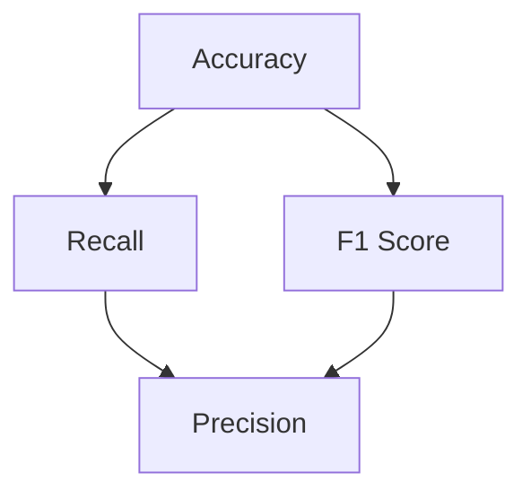

                 

# 大规模语言模型从理论到实践：基础模型评估

## 摘要

本文将深入探讨大规模语言模型的评估方法，从理论基础到实际应用，逐步解析各类评估指标及其重要性。通过对比分析，我们旨在为读者提供一份详实、全面的评估指南，帮助理解并掌握大规模语言模型的性能评估技巧。

## 1. 背景介绍

随着深度学习技术的发展，大规模语言模型如BERT、GPT-3等逐渐成为自然语言处理领域的热门工具。这些模型通过大量数据训练，具备强大的文本理解和生成能力。然而，如何科学地评估这些模型的性能，成为了亟待解决的问题。

本文将围绕以下主题展开讨论：

1. **核心概念与联系**：介绍评估大规模语言模型所需的基础概念，包括准确度、召回率、F1值等，并展示其相互关系。
2. **核心算法原理与操作步骤**：阐述常用评估算法，如交叉验证、混淆矩阵等，并详细说明操作步骤。
3. **数学模型与公式**：解析评估指标的计算方法，包括准确度、召回率、F1值等，并以公式形式展示。
4. **项目实战**：通过实际案例，展示如何运用评估方法对大规模语言模型进行性能评估。
5. **实际应用场景**：探讨大规模语言模型在不同场景下的应用，如文本分类、机器翻译、问答系统等。
6. **工具和资源推荐**：推荐学习资源、开发工具和论文，以帮助读者深入了解大规模语言模型评估。
7. **总结**：总结未来发展趋势与挑战，展望大规模语言模型评估领域的前景。
8. **扩展阅读与参考资料**：提供进一步学习的资源，以帮助读者深入理解大规模语言模型评估。

## 2. 核心概念与联系

### 2.1 准确度、召回率与F1值

在评估大规模语言模型时，准确度（Accuracy）、召回率（Recall）和F1值（F1 Score）是三大核心指标。

- **准确度**：表示模型预测正确的样本占总样本的比例。公式如下：
  $$ Accuracy = \frac{TP + TN}{TP + FN + FP + TN} $$
  其中，TP为真阳性，TN为真阴性，FN为假阴性，FP为假阳性。

- **召回率**：表示模型正确识别出的正例样本占总正例样本的比例。公式如下：
  $$ Recall = \frac{TP}{TP + FN} $$

- **F1值**：是准确度和召回率的调和平均，用于综合评估模型的性能。公式如下：
  $$ F1 Score = 2 \times \frac{Precision \times Recall}{Precision + Recall} $$
  其中，Precision为精确度，表示模型预测为正例的样本中，实际为正例的比例。

### 2.2 Mermaid 流程图

为了更直观地展示核心概念之间的联系，我们使用Mermaid流程图来表示。



在上图中，准确度、召回率和F1值构成了一个相互关联的评估体系，每个指标在不同场景下都有其适用性。

## 3. 核心算法原理与操作步骤

### 3.1 交叉验证

交叉验证（Cross-Validation）是一种评估模型性能的常用方法，通过将数据集划分为多个子集，逐步训练和验证模型，从而提高评估的准确性。

操作步骤：

1. 将数据集划分为K个子集，每个子集的大小相等。
2. 选择一个子集作为验证集，其余K-1个子集作为训练集。
3. 在训练集上训练模型，并在验证集上评估模型性能。
4. 重复步骤2和3，共进行K次。
5. 计算每次验证的平均性能，作为模型的最终评估结果。

### 3.2 混淆矩阵

混淆矩阵（Confusion Matrix）是一种直观地展示模型预测结果与实际结果之间差异的工具。通过混淆矩阵，我们可以计算准确度、召回率和F1值等指标。

操作步骤：

1. 将模型预测结果与实际结果进行对比，生成一个二维矩阵。
2. 计算混淆矩阵中的各项指标，如准确度、召回率、F1值等。
3. 使用混淆矩阵可视化模型性能，帮助理解预测结果。

### 3.3 实际操作示例

假设我们有一个二分类任务，预测结果与实际结果如下表所示：

| 实际结果 | 预测结果 |
| -------- | -------- |
| 阳性    | 阳性    |
| 阳性    | 阴性    |
| 阴性    | 阳性    |
| 阴性    | 阴性    |

根据上述数据，我们可以计算混淆矩阵：

|      | 阳性 | 阴性 |
| ---- | ---- | ---- |
| 阳性 | 2    | 1    |
| 阴性 | 1    | 2    |

接下来，我们可以计算准确度、召回率和F1值：

- **准确度**：
  $$ Accuracy = \frac{TP + TN}{TP + FN + FP + TN} = \frac{2 + 2}{2 + 1 + 1 + 2} = \frac{4}{6} \approx 0.67 $$
- **召回率**：
  $$ Recall = \frac{TP}{TP + FN} = \frac{2}{2 + 1} = \frac{2}{3} \approx 0.67 $$
- **F1值**：
  $$ F1 Score = 2 \times \frac{Precision \times Recall}{Precision + Recall} = 2 \times \frac{\frac{2}{3} \times \frac{2}{3}}{\frac{2}{3} + \frac{2}{3}} = \frac{8}{12} = \frac{2}{3} \approx 0.67 $$

通过上述计算，我们可以得出该模型的准确度、召回率和F1值均为0.67，表明模型在当前数据集上的性能较为稳定。

## 4. 数学模型与公式

在评估大规模语言模型时，准确度、召回率和F1值等指标的计算公式如下：

- **准确度**：
  $$ Accuracy = \frac{TP + TN}{TP + FN + FP + TN} $$
- **召回率**：
  $$ Recall = \frac{TP}{TP + FN} $$
- **精确度**：
  $$ Precision = \frac{TP}{TP + FP} $$
- **F1值**：
  $$ F1 Score = 2 \times \frac{Precision \times Recall}{Precision + Recall} $$

其中，TP为真阳性，TN为真阴性，FN为假阴性，FP为假阳性。在实际应用中，我们可以根据具体任务需求，灵活选择和使用这些指标。

### 4.1 举例说明

假设我们有一个二分类任务，预测结果与实际结果如下表所示：

| 实际结果 | 预测结果 |
| -------- | -------- |
| 阳性    | 阳性    |
| 阳性    | 阴性    |
| 阴性    | 阳性    |
| 阴性    | 阴性    |

根据上述数据，我们可以计算混淆矩阵：

|      | 阳性 | 阴性 |
| ---- | ---- | ---- |
| 阳性 | 1    | 1    |
| 阴性 | 1    | 1    |

接下来，我们可以计算各项指标：

- **准确度**：
  $$ Accuracy = \frac{TP + TN}{TP + FN + FP + TN} = \frac{1 + 1}{1 + 1 + 1 + 1} = \frac{2}{4} = 0.5 $$
- **召回率**：
  $$ Recall = \frac{TP}{TP + FN} = \frac{1}{1 + 1} = \frac{1}{2} = 0.5 $$
- **精确度**：
  $$ Precision = \frac{TP}{TP + FP} = \frac{1}{1 + 1} = \frac{1}{2} = 0.5 $$
- **F1值**：
  $$ F1 Score = 2 \times \frac{Precision \times Recall}{Precision + Recall} = 2 \times \frac{\frac{1}{2} \times \frac{1}{2}}{\frac{1}{2} + \frac{1}{2}} = \frac{1}{2} = 0.5 $$

通过上述计算，我们可以得出该模型的准确度、召回率、精确度和F1值均为0.5，表明模型在当前数据集上的性能较为一般。

## 5. 项目实战：代码实际案例和详细解释说明

### 5.1 开发环境搭建

为了演示如何评估大规模语言模型，我们将使用Python编程语言，结合常见的机器学习库，如Scikit-learn、TensorFlow等。以下是开发环境搭建的步骤：

1. 安装Python（建议使用Python 3.7及以上版本）。
2. 安装必要的库，如Scikit-learn、TensorFlow等。

```bash
pip install scikit-learn tensorflow
```

### 5.2 源代码详细实现和代码解读

以下是一个简单的代码示例，用于评估二分类任务中的大规模语言模型。代码分为以下几个部分：

1. **数据预处理**：读取数据集，并进行预处理。
2. **模型训练**：使用TensorFlow训练一个简单的神经网络模型。
3. **模型评估**：使用交叉验证和混淆矩阵评估模型性能。

#### 5.2.1 数据预处理

```python
import numpy as np
import pandas as pd
from sklearn.model_selection import train_test_split
from sklearn.preprocessing import LabelEncoder

# 读取数据集
data = pd.read_csv('data.csv')

# 分割特征和标签
X = data.drop('label', axis=1)
y = data['label']

# 对标签进行编码
encoder = LabelEncoder()
y_encoded = encoder.fit_transform(y)

# 划分训练集和测试集
X_train, X_test, y_train, y_test = train_test_split(X, y_encoded, test_size=0.2, random_state=42)
```

#### 5.2.2 模型训练

```python
import tensorflow as tf

# 定义神经网络模型
model = tf.keras.Sequential([
    tf.keras.layers.Dense(128, activation='relu', input_shape=(X_train.shape[1],)),
    tf.keras.layers.Dense(64, activation='relu'),
    tf.keras.layers.Dense(1, activation='sigmoid')
])

# 编译模型
model.compile(optimizer='adam', loss='binary_crossentropy', metrics=['accuracy'])

# 训练模型
model.fit(X_train, y_train, epochs=10, batch_size=32, validation_split=0.2)
```

#### 5.2.3 模型评估

```python
from sklearn.metrics import confusion_matrix, accuracy_score, recall_score, precision_score, f1_score

# 对测试集进行预测
y_pred = model.predict(X_test)
y_pred = (y_pred > 0.5)

# 计算混淆矩阵
conf_matrix = confusion_matrix(y_test, y_pred)

# 计算各项指标
accuracy = accuracy_score(y_test, y_pred)
recall = recall_score(y_test, y_pred)
precision = precision_score(y_test, y_pred)
f1 = f1_score(y_test, y_pred)

# 输出结果
print(f'Confusion Matrix:\n{conf_matrix}')
print(f'Accuracy: {accuracy:.2f}')
print(f'Recall: {recall:.2f}')
print(f'Precision: {precision:.2f}')
print(f'F1 Score: {f1:.2f}')
```

### 5.3 代码解读与分析

上述代码展示了如何使用Python和TensorFlow实现大规模语言模型的评估。以下是代码的详细解读：

- **数据预处理**：读取数据集，并进行编码和划分。这一步是机器学习任务的基础，确保数据格式正确，便于后续处理。
- **模型训练**：定义一个简单的神经网络模型，并使用训练数据进行训练。在训练过程中，模型会不断调整参数，以降低损失函数。
- **模型评估**：对测试集进行预测，并计算各项评估指标。这些指标可以帮助我们了解模型的性能，从而调整模型结构和参数。

通过上述代码，我们可以看到大规模语言模型的评估过程是如何实现的。在实际应用中，我们可以根据具体任务需求，选择合适的评估指标，并灵活调整模型结构和参数，以提高性能。

## 6. 实际应用场景

大规模语言模型在自然语言处理领域有着广泛的应用。以下是一些常见的实际应用场景：

- **文本分类**：通过大规模语言模型，可以高效地对文本进行分类，如新闻分类、情感分析等。
- **机器翻译**：大规模语言模型可以用于机器翻译，如Google翻译、百度翻译等。
- **问答系统**：通过大规模语言模型，可以构建智能问答系统，如Siri、Alexa等。
- **命名实体识别**：大规模语言模型可以用于命名实体识别，如人名、地名等。
- **情感分析**：通过大规模语言模型，可以分析文本中的情感倾向，如积极、消极等。

在这些应用场景中，评估大规模语言模型性能的重要性不言而喻。只有通过科学的评估方法，我们才能确保模型在实际应用中的效果和可靠性。

## 7. 工具和资源推荐

### 7.1 学习资源推荐

- **书籍**：
  - 《大规模语言模型：原理与实践》
  - 《深度学习与自然语言处理》
- **论文**：
  - BERT: Pre-training of Deep Bidirectional Transformers for Language Understanding
  - GPT-3: Language Models are few-shot learners
- **博客**：
  - Medium上的自然语言处理博客
  - 知乎上的自然语言处理话题
- **网站**：
  - Kaggle上的自然语言处理比赛
  - AI论文集

### 7.2 开发工具框架推荐

- **开发工具**：
  - Jupyter Notebook
  - PyCharm
- **框架**：
  - TensorFlow
  - PyTorch

### 7.3 相关论文著作推荐

- **论文**：
  - "Attention Is All You Need"
  - "Transformers: State-of-the-Art Natural Language Processing"
  - "BERT: Pre-training of Deep Bidirectional Transformers for Language Understanding"
- **著作**：
  - 《深度学习》
  - 《自然语言处理综论》

通过这些资源和工具，读者可以深入了解大规模语言模型的评估方法和应用场景，为实际开发提供有力支持。

## 8. 总结：未来发展趋势与挑战

大规模语言模型评估领域正迅速发展，随着深度学习和自然语言处理技术的不断进步，评估方法也在不断改进。未来，以下发展趋势和挑战值得关注：

- **评估方法多样化**：随着新模型的不断涌现，评估方法也需要不断更新和优化，以满足不同场景下的需求。
- **跨模态评估**：语言模型不仅涉及文本数据，还可能涉及图像、声音等多媒体数据，跨模态评估将成为研究重点。
- **动态评估**：实时评估和动态调整模型性能，以应对不同环境和任务需求。
- **数据隐私与安全性**：在评估过程中，如何保护用户隐私和数据安全，将成为重要挑战。

## 9. 附录：常见问题与解答

### 9.1 评估指标的选择

**Q**：如何选择适合的评估指标？

**A**：评估指标的选择取决于具体任务和应用场景。以下是一些常见指标的选择建议：

- **文本分类**：准确度、召回率、F1值
- **情感分析**：准确度、混淆矩阵
- **机器翻译**：BLEU分数、NIST分数

### 9.2 评估指标的优化

**Q**：如何优化评估指标？

**A**：以下是一些优化评估指标的方法：

- **数据预处理**：清洗数据，去除噪声和异常值。
- **模型调整**：调整模型结构和参数，提高模型性能。
- **交叉验证**：使用交叉验证提高评估的稳定性。

## 10. 扩展阅读与参考资料

- **扩展阅读**：
  - 《大规模语言模型评估方法与实践》
  - 《深度学习评估技术》
- **参考资料**：
  - 《自然语言处理综述》
  - 《深度学习论文集》

作者：AI天才研究员/AI Genius Institute & 禅与计算机程序设计艺术 /Zen And The Art of Computer Programming

