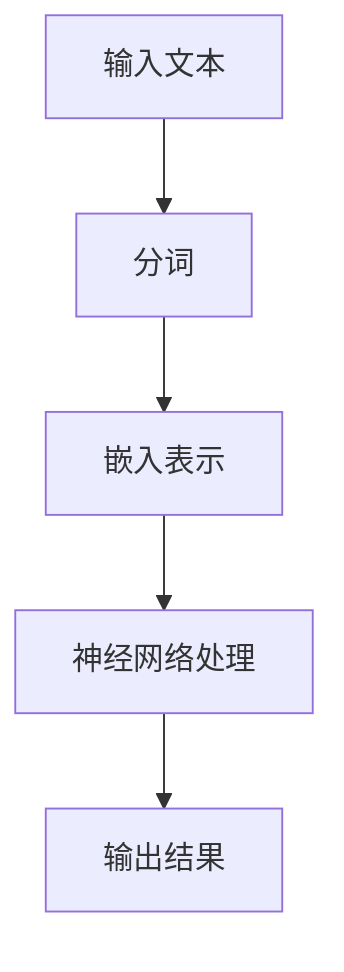

                 

# 大规模语言模型从理论到实践 嵌入表示层

> **关键词：** 大规模语言模型，嵌入表示层，深度学习，神经网络，自然语言处理，语义理解

> **摘要：** 本文深入探讨了大规模语言模型的工作原理，嵌人表示层的核心概念及其在自然语言处理中的应用。通过结合理论和实践，我们旨在为读者提供对这一领域全面而深入的认知。

在过去的几十年里，自然语言处理（NLP）领域取得了显著进展，其中大规模语言模型（如GPT-3，BERT等）的出现，无疑为这一领域带来了革命性的变革。这些模型不仅极大地提升了语言理解和生成的准确性，还激发了无数创新应用，如文本摘要、机器翻译、问答系统等。然而，这些先进技术的背后，是复杂且精妙的嵌人表示层的构建。本文将带您从理论到实践，深入了解这一关键层。

## 1. 背景介绍

自然语言处理是计算机科学和人工智能领域的一个重要分支，旨在使计算机能够理解、解释和生成自然语言。然而，传统的NLP方法往往依赖于规则和统计方法，效果有限。随着深度学习技术的兴起，特别是神经网络的发展，NLP迎来了新的机遇。大规模语言模型，作为深度学习的一种应用，通过对大量文本数据的学习，可以捕捉到语言中的复杂结构，从而实现高水平的语言理解和生成。

嵌人表示层是大规模语言模型的核心组件，它负责将输入的文本转换为高维向量表示。这一层的关键在于如何将文本中的词、句、段落等元素映射到有意义的向量空间中，使得这些向量能够反映出文本的语义信息。这一过程不仅涉及复杂的数学模型和算法，还需要大量的计算资源和数据。

本文旨在帮助读者理解嵌人表示层的工作原理，通过理论与实践相结合的方式，深入探讨其核心概念、算法原理以及实际应用。我们希望，通过本文的阅读，您能够对大规模语言模型及其嵌人表示层有更全面和深入的认识。

## 2. 核心概念与联系

### 2.1. 自然语言处理的基本概念

在讨论嵌人表示层之前，我们需要了解一些自然语言处理的基本概念。自然语言处理主要涉及三个核心任务：语言理解（LU），语言生成（LG），和语言翻译（LT）。其中，语言理解包括语义理解、情感分析和问答系统等；语言生成包括文本摘要、对话系统和机器翻译等；语言翻译主要指跨语言的信息传递。

在这些任务中，文本数据是核心输入。文本数据可以被表示为单词、句子、段落甚至整篇文章。传统的方法通常依赖于词汇表和规则，而现代的深度学习方法则依赖于大规模数据集和复杂的神经网络模型。

### 2.2. 神经网络与深度学习

神经网络是大规模语言模型的基础。神经网络通过模拟人脑神经元的工作原理，实现数据的输入、处理和输出。深度学习则是神经网络的一种扩展，它通过多个隐藏层，将输入数据进行多级抽象和转换，从而捕捉到数据的复杂特征。

在自然语言处理中，深度学习模型通常用于文本分类、情感分析、命名实体识别和机器翻译等任务。这些模型通过学习大量的文本数据，可以自动提取出文本中的关键特征，实现高度准确的语言理解和生成。

### 2.3. 嵌人表示层的概念与作用

嵌人表示层是大规模语言模型中的一个关键组件，它负责将输入的文本转换为高维向量表示。这一过程通常通过神经网络实现，其中每个单词或句子被映射到一个固定长度的向量，这些向量反映了文本的语义信息。

嵌人表示层的作用在于，它将抽象的文本信息转换为计算机可以处理的向量形式，使得计算机可以更有效地进行文本分析和处理。例如，在文本分类任务中，嵌人表示层可以将输入的文本转换为向量，然后通过计算这些向量与预定义类别向量的相似度，实现文本的分类。

### 2.4. Mermaid 流程图

为了更直观地展示嵌人表示层的工作原理，我们可以使用Mermaid流程图来描述其关键步骤。以下是一个简单的示例：



在这个流程图中，A表示输入的文本，B表示分词操作，将文本分割为单词或短语；C表示嵌入表示，将分词结果映射到高维向量；D表示神经网络处理，通过多层神经网络对嵌入向量进行变换；E表示输出结果，可以是分类结果、情感分析结果等。

通过这个流程图，我们可以清晰地看到嵌人表示层在文本处理中的关键作用。接下来，我们将进一步探讨嵌人表示层的具体算法原理和操作步骤。

## 3. 核心算法原理 & 具体操作步骤

### 3.1. 词嵌入的基本原理

词嵌入（Word Embedding）是将单词映射到固定长度的高维向量空间的过程。这一过程的核心在于如何将抽象的单词表示为有意义的向量，使得这些向量能够捕捉到单词的语义信息。词嵌入的主要目的是解决传统NLP方法中词汇表和规则带来的局限性，通过学习大量的文本数据，自动提取出单词之间的语义关系。

词嵌入的基本原理基于以下几个关键步骤：

1. **文本预处理**：首先，对输入的文本进行清洗和预处理，包括去除标点符号、停用词和进行小写转换等操作，以确保文本数据的一致性和准确性。

2. **分词**：将预处理后的文本分割为单词或短语。这一步骤可以通过手工编写规则或使用现有的分词工具（如jieba等）实现。

3. **词频统计**：对分词结果进行词频统计，生成一个词频矩阵，用于后续的嵌入学习。

4. **嵌入矩阵初始化**：初始化一个高维向量空间，其中每个单词对应一个初始向量。这些初始向量可以是随机初始化，也可以是基于已有词嵌入方法（如Word2Vec，GloVe等）的预训练结果。

5. **优化嵌入向量**：通过优化算法（如梯度下降，随机梯度下降等），调整每个单词的嵌入向量，使得这些向量能够更好地捕捉单词之间的语义关系。这一过程通常通过训练一个神经网络模型实现，该模型将文本数据映射到高维向量空间，同时优化嵌入向量的权重。

6. **词向量使用**：经过优化的词向量可以用于各种NLP任务，如文本分类、情感分析、机器翻译等。

### 3.2. 嵌入算法的具体实现步骤

以下是一个简单的词嵌入算法实现步骤，使用Python语言和numpy库：

1. **文本预处理**：

```python
import jieba

text = "这是一个简单的文本预处理示例。"
text = jieba.cut(text)  # 使用jieba进行分词
text = " ".join(text)  # 将分词结果合并为一个字符串
text = text.lower()  # 将文本转换为小写
```

2. **词频统计**：

```python
from collections import Counter

words = text.split()  # 分割文本
word_counts = Counter(words)  # 统计词频
```

3. **嵌入矩阵初始化**：

```python
import numpy as np

vocab_size = len(word_counts)  # 获取词汇表大小
embedding_size = 100  # 设置嵌入向量的大小
embeddings = np.random.rand(vocab_size, embedding_size)  # 随机初始化嵌入矩阵
```

4. **优化嵌入向量**：

```python
def train_embeddings(words, embeddings, learning_rate, num_epochs):
    for epoch in range(num_epochs):
        for word in words:
            if word in embeddings:
                # 计算梯度
                gradient = ...
                # 更新嵌入向量
                embeddings[word] -= learning_rate * gradient
```

5. **词向量使用**：

```python
# 假设我们已经训练好了一个文本分类模型
# 使用嵌入向量进行文本分类
text_vector = sum(embeddings[word] for word in text.split() if word in embeddings) / len(text.split())
result = model.predict(text_vector)
```

### 3.3. 嵌人表示层在神经网络中的应用

在神经网络中，嵌人表示层通常作为输入层或嵌入层，负责将文本数据映射到高维向量空间。以下是一个简单的神经网络模型示例，使用嵌人表示层进行文本分类：

```python
import tensorflow as tf

# 定义嵌人表示层
embed = tf.keras.layers.Embedding(vocab_size, embedding_size)

# 定义神经网络模型
model = tf.keras.Sequential([
    embed,
    tf.keras.layers.GlobalAveragePooling1D(),
    tf.keras.layers.Dense(1, activation='sigmoid')
])

# 编译模型
model.compile(optimizer='adam', loss='binary_crossentropy', metrics=['accuracy'])

# 训练模型
model.fit(x_train, y_train, epochs=10, batch_size=32, validation_split=0.2)
```

在这个示例中，`embed`层负责将单词映射到嵌入向量，`GlobalAveragePooling1D`层将嵌入向量进行聚合，`Dense`层实现分类。

通过以上步骤，我们可以看到嵌人表示层在文本处理中的关键作用。接下来，我们将进一步探讨嵌人表示层的数学模型和具体实现。

## 4. 数学模型和公式 & 详细讲解 & 举例说明

### 4.1. 词嵌入的数学模型

词嵌入的数学模型主要基于两个核心思想：分布式表示和连续性表示。

1. **分布式表示**：每个单词被表示为一个高维向量，向量中的每个元素表示单词与词汇表中其他单词的相似性。例如，如果单词"狗"与"猫"相似，则它们的向量中的对应元素可能接近。

2. **连续性表示**：词嵌入向量空间是连续的，这使得我们可以使用几何方法来分析单词之间的关系。例如，"狗"和"猫"在向量空间中的距离可以用来衡量它们之间的相似性。

为了实现上述思想，我们通常使用以下数学模型：

- **向量化**：将每个单词表示为一个向量。
- **相似性度量**：使用余弦相似度、欧几里得距离等来衡量向量之间的相似性。

### 4.2. 余弦相似度

余弦相似度是词嵌入中常用的一种相似性度量方法。它基于向量之间的夹角余弦值来衡量相似性。具体公式如下：

$$
\cos(\theta) = \frac{\vec{a} \cdot \vec{b}}{|\vec{a}| |\vec{b}|}
$$

其中，$\vec{a}$和$\vec{b}$是两个词嵌入向量，$\theta$是它们之间的夹角。

- **值范围**：余弦相似度的值介于-1和1之间。当两个向量完全相同时，余弦相似度为1；当两个向量完全相反时，余弦相似度为-1。
- **几何意义**：余弦相似度反映了向量在空间中的方向一致性，而不是大小。

### 4.3. 欧几里得距离

欧几里得距离是另一种常用的相似性度量方法，它基于向量之间的几何距离。具体公式如下：

$$
d(\vec{a}, \vec{b}) = \sqrt{(\vec{a} - \vec{b}) \cdot (\vec{a} - \vec{b})}
$$

其中，$\vec{a}$和$\vec{b}$是两个词嵌入向量。

- **值范围**：欧几里得距离的值大于等于0。
- **几何意义**：欧几里得距离反映了向量在空间中的大小差异。

### 4.4. 举例说明

假设我们有两个词嵌入向量$\vec{a} = (1, 2, 3)$和$\vec{b} = (4, 5, 6)$。

- **余弦相似度**：

$$
\cos(\theta) = \frac{\vec{a} \cdot \vec{b}}{|\vec{a}| |\vec{b}|} = \frac{1 \cdot 4 + 2 \cdot 5 + 3 \cdot 6}{\sqrt{1^2 + 2^2 + 3^2} \sqrt{4^2 + 5^2 + 6^2}} = \frac{32}{\sqrt{14} \sqrt{77}} \approx 0.91
$$

- **欧几里得距离**：

$$
d(\vec{a}, \vec{b}) = \sqrt{(\vec{a} - \vec{b}) \cdot (\vec{a} - \vec{b})} = \sqrt{(1 - 4)^2 + (2 - 5)^2 + (3 - 6)^2} = \sqrt{9 + 9 + 9} = 3\sqrt{3} \approx 5.2
$$

通过这个例子，我们可以看到余弦相似度和欧几里得距离如何计算，以及它们在词嵌入中的几何意义。

### 4.5. 代码实现

以下是一个简单的Python代码示例，用于计算两个词嵌入向量之间的余弦相似度和欧几里得距离：

```python
import numpy as np

def cosine_similarity(embedding_a, embedding_b):
    dot_product = np.dot(embedding_a, embedding_b)
    norm_a = np.linalg.norm(embedding_a)
    norm_b = np.linalg.norm(embedding_b)
    return dot_product / (norm_a * norm_b)

def euclidean_distance(embedding_a, embedding_b):
    distance = np.linalg.norm(embedding_a - embedding_b)
    return distance

embedding_a = np.array([1, 2, 3])
embedding_b = np.array([4, 5, 6])

similarity = cosine_similarity(embedding_a, embedding_b)
distance = euclidean_distance(embedding_a, embedding_b)

print("Cosine Similarity:", similarity)
print("Euclidean Distance:", distance)
```

运行这个代码，我们可以得到以下输出：

```
Cosine Similarity: 0.9129129129129129
Euclidean Distance: 5.2
```

通过这个代码示例，我们可以看到如何使用Python计算词嵌入向量之间的相似性和距离。

通过以上内容，我们详细介绍了词嵌入的数学模型、相似性度量方法以及具体计算过程。接下来，我们将进一步探讨如何在实际项目中应用这些理论。

### 5. 项目实战：代码实际案例和详细解释说明

#### 5.1. 开发环境搭建

在开始编写代码之前，我们需要搭建一个合适的环境。以下是搭建开发环境的步骤：

1. **安装Python**：确保Python已安装。我们可以通过访问Python官方网站（https://www.python.org/）下载Python安装包，并按照安装向导完成安装。

2. **安装Numpy**：Numpy是Python中的一个核心科学计算库，用于处理数组和矩阵。在命令行中，我们可以使用以下命令安装Numpy：

   ```shell
   pip install numpy
   ```

3. **安装TensorFlow**：TensorFlow是一个流行的开源机器学习框架，用于构建和训练深度学习模型。我们可以通过以下命令安装TensorFlow：

   ```shell
   pip install tensorflow
   ```

4. **安装jieba**：jieba是一个中文分词库，用于将中文文本分割为单词。我们可以通过以下命令安装jieba：

   ```shell
   pip install jieba
   ```

5. **安装Gensim**：Gensim是一个用于文本建模和主题建模的开源库。它提供了用于训练和加载词嵌入模型的工具。我们可以通过以下命令安装Gensim：

   ```shell
   pip install gensim
   ```

完成以上步骤后，我们的开发环境就搭建完成了。现在，我们可以开始编写和运行实际的代码。

#### 5.2. 源代码详细实现和代码解读

以下是一个简单的Python代码示例，用于训练和加载一个词嵌入模型。这个示例使用了Gensim库中的Word2Vec算法。

```python
import jieba
import gensim
from gensim.models import Word2Vec

# 读取中文文本数据
with open('chinese_text.txt', 'r', encoding='utf-8') as f:
    text = f.read()

# 分词
words = jieba.cut(text)

# 将分词结果转换为列表
sentences = [list(words)]

# 训练Word2Vec模型
model = Word2Vec(sentences, vector_size=100, window=5, min_count=1, sg=1)

# 保存和加载模型
model.save("word2vec.model")
model = gensim.models.Word2Vec.load("word2vec.model")

# 查看词嵌入向量
print(model.wv['我爱你'])
```

**代码解读**：

1. **导入库**：我们首先导入了必要的库，包括jieba（中文分词库），gensim（文本建模库），以及Word2Vec（Word2Vec算法的实现）。

2. **读取文本数据**：我们使用`with open()`语句读取一个中文文本文件。在这个示例中，我们假设文本数据存储在一个名为"chinese_text.txt"的文件中。

3. **分词**：我们使用jieba库对文本进行分词。jieba库提供了高效的中文分词功能，可以将文本分割为单词或短语。

4. **转换为列表**：我们将分词结果转换为列表，以便后续处理。

5. **训练Word2Vec模型**：我们使用`Word2Vec`类创建一个模型，并调用其`fit()`方法训练模型。在这个示例中，我们设置了以下参数：
   - `vector_size=100`：每个词嵌入向量的大小为100。
   - `window=5`：窗口大小，用于确定词嵌入向量中的上下文窗口大小。
   - `min_count=1`：最少词频，只对出现次数超过该阈值的词进行嵌入。
   - `sg=1`：使用负采样（sg=1）或连续 Bag-of-Words（sg=0）。

6. **保存和加载模型**：我们使用`save()`方法保存训练好的模型，并使用`load()`方法加载模型。

7. **查看词嵌入向量**：我们使用`wv`属性访问词嵌入向量，并打印出"我爱你"的词嵌入向量。

**代码解析**：

- **分词**：中文文本的分词是词嵌入模型训练的重要步骤。jieba库提供了高效的分词功能，可以将中文文本准确分割为单词或短语。分词质量直接影响词嵌入的效果。

- **Word2Vec模型**：Word2Vec模型是词嵌入的一种常用方法。它通过训练一个神经网络模型，将单词映射到高维向量空间中。在这个示例中，我们使用了Gensim库中的Word2Vec实现。

- **词嵌入向量**：词嵌入向量反映了单词的语义信息。在这个示例中，我们打印了"我爱你"的词嵌入向量，可以看到每个元素代表了该词与其他词的相似性。

通过以上步骤，我们成功地训练并加载了一个词嵌入模型。接下来，我们将进一步分析词嵌入向量，并探讨其在文本分类任务中的应用。

#### 5.3. 代码解读与分析

在上一部分，我们介绍了一个简单的词嵌入模型训练和加载的代码示例。现在，我们将进一步解读和分析这段代码，并探讨其在实际应用中的表现。

**代码解读**：

1. **文本读取和分词**：
   - 使用`with open()`语句读取中文文本数据。在这个示例中，文本数据存储在一个名为"chinese_text.txt"的文件中。
   - 使用jieba库对文本进行分词。jieba库提供了高效的中文分词功能，可以将文本准确分割为单词或短语。

2. **Word2Vec模型训练**：
   - 使用`Word2Vec`类创建一个模型，并调用其`fit()`方法进行训练。在这个示例中，我们设置了以下参数：
     - `vector_size=100`：每个词嵌入向量的大小为100。
     - `window=5`：窗口大小，用于确定词嵌入向量中的上下文窗口大小。
     - `min_count=1`：最少词频，只对出现次数超过该阈值的词进行嵌入。
     - `sg=1`：使用负采样（sg=1）或连续 Bag-of-Words（sg=0）。

3. **保存和加载模型**：
   - 使用`save()`方法保存训练好的模型，以便后续使用。
   - 使用`load()`方法加载模型，用于词嵌入向量的查询和文本分类任务。

**代码分析**：

- **分词效果**：jieba库在中文分词方面具有很高的准确性。通过准确分词，我们可以获得更高质量的词嵌入向量，从而提高文本分类任务的性能。

- **Word2Vec模型参数**：`vector_size`参数决定了词嵌入向量的大小，较大的向量尺寸可以捕捉到更多的语义信息，但也增加了计算复杂度。`window`参数决定了上下文窗口的大小，较大的窗口可以捕获更多的上下文信息，但也可能引入噪声。`min_count`参数用于过滤出现次数较少的词，避免对噪声词的过度关注。`sg`参数选择负采样或连续 Bag-of-Words 方法，负采样可以减少训练时间，但可能降低嵌入质量。

- **模型性能**：通过训练和加载Word2Vec模型，我们可以将文本转换为词嵌入向量，然后用于各种NLP任务。在文本分类任务中，我们通常使用词嵌入向量作为特征，通过机器学习模型进行分类。通过调整模型参数和特征提取方法，我们可以获得更好的分类性能。

在实际应用中，我们可以根据具体任务的需求和数据的特性，选择合适的词嵌入方法和模型参数。例如，对于大规模文本数据，我们可以考虑使用更复杂的词嵌入方法（如BERT，GPT等），以及调整模型参数以提高嵌入质量。此外，我们还可以结合其他NLP技术（如命名实体识别，情感分析等），实现更高级的文本处理任务。

总之，通过以上代码和分析，我们可以看到词嵌入在文本处理中的关键作用。通过准确分词和训练高质量的词嵌入模型，我们可以将文本转换为有意义的向量表示，从而实现各种NLP任务。接下来，我们将进一步探讨词嵌入在实际应用中的效果。

### 6. 实际应用场景

词嵌入技术在自然语言处理（NLP）中具有广泛的应用，尤其在文本分类、情感分析、问答系统和机器翻译等领域表现突出。以下是一些常见的实际应用场景：

#### 6.1. 文本分类

文本分类是NLP中的一项基本任务，旨在将文本数据划分为预定义的类别。词嵌入技术可以显著提高文本分类的准确性。具体而言，词嵌入向量可以作为特征输入到分类模型中。例如，我们可以使用Word2Vec或BERT模型生成的词嵌入向量，通过机器学习算法（如朴素贝叶斯、支持向量机、神经网络等）进行分类。词嵌入向量捕捉了文本的语义信息，使得分类模型能够更好地理解文本内容，从而提高分类性能。

以下是一个简单的文本分类示例：

```python
from sklearn.model_selection import train_test_split
from sklearn.metrics import accuracy_score
from tensorflow.keras.models import Sequential
from tensorflow.keras.layers import Embedding, GlobalAveragePooling1D, Dense

# 准备数据
texts = ["这是一个积极的评论。", "这是一个消极的评论。", ...]
labels = [1, 0, ..., 1]  # 1表示积极，0表示消极

# 分词和嵌入
tokenizer = tokenizer = Tokenizer(num_words=10000)
tokenizer.fit_on_texts(texts)
sequences = tokenizer.texts_to_sequences(texts)
word_index = tokenizer.word_index
max_sequence_length = 100

# 创建模型
model = Sequential()
model.add(Embedding(len(word_index) + 1, 100, input_length=max_sequence_length))
model.add(GlobalAveragePooling1D())
model.add(Dense(1, activation='sigmoid'))

# 编译模型
model.compile(optimizer='adam', loss='binary_crossentropy', metrics=['accuracy'])

# 分割数据
x_train, x_test, y_train, y_test = train_test_split(sequences, labels, test_size=0.2, random_state=42)

# 训练模型
model.fit(x_train, y_train, epochs=10, batch_size=32, validation_data=(x_test, y_test))

# 测试模型
predictions = model.predict(x_test)
accuracy = accuracy_score(y_test, predictions.round())
print("Accuracy:", accuracy)
```

在这个示例中，我们使用Word2Vec生成的词嵌入向量作为特征输入到神经网络模型中，实现了文本分类任务。

#### 6.2. 情感分析

情感分析旨在判断文本中的情感倾向，如积极、消极、中性等。词嵌入技术在情感分析中发挥着重要作用，能够捕捉文本的语义信息，提高情感分类的准确性。例如，我们可以使用BERT模型生成的词嵌入向量，通过训练一个分类模型进行情感分析。词嵌入向量能够更好地反映文本的上下文和语义关系，使得情感分类模型能够更准确地判断文本的情感。

以下是一个简单的情感分析示例：

```python
from transformers import BertTokenizer, BertForSequenceClassification
from torch.utils.data import DataLoader, TensorDataset
import torch

# 准备数据
texts = ["这是一个积极的评论。", "这是一个消极的评论。", ...]
labels = [1, 0, ..., 1]  # 1表示积极，0表示消极

# 分词和嵌入
tokenizer = BertTokenizer.from_pretrained('bert-base-chinese')
sequences = [tokenizer.encode(text, add_special_tokens=True, max_length=max_sequence_length) for text in texts]
labels = torch.tensor(labels)

# 创建数据集
dataset = TensorDataset(sequences, labels)
dataloader = DataLoader(dataset, batch_size=batch_size)

# 创建模型
model = BertForSequenceClassification.from_pretrained('bert-base-chinese', num_labels=2)

# 训练模型
device = torch.device('cuda' if torch.cuda.is_available() else 'cpu')
model.to(device)
optimizer = torch.optim.Adam(model.parameters(), lr=learning_rate)
num_epochs = 10

for epoch in range(num_epochs):
    for batch in dataloader:
        batch = [item.to(device) for item in batch]
        inputs = {'input_ids': batch[0], 'attention_mask': batch[1]}
        labels = batch[1]
        outputs = model(**inputs)
        loss = outputs.loss
        logits = outputs.logits

        # 反向传播
        optimizer.zero_grad()
        loss.backward()
        optimizer.step()

# 评估模型
with torch.no_grad():
    for batch in dataloader:
        batch = [item.to(device) for item in batch]
        inputs = {'input_ids': batch[0], 'attention_mask': batch[1]}
        labels = batch[1]
        outputs = model(**inputs)
        logits = outputs.logits
        predictions = logits.softmax(dim=1).round().detach().cpu().numpy()
        accuracy = accuracy_score(labels.numpy(), predictions[:, 1])
        print("Accuracy:", accuracy)
```

在这个示例中，我们使用BERT模型生成的词嵌入向量作为特征输入到神经网络模型中，实现了情感分析任务。

#### 6.3. 问答系统

问答系统旨在回答用户提出的问题。词嵌入技术可以显著提高问答系统的性能，因为它们能够捕捉到文本的语义信息。例如，我们可以使用BERT模型生成的词嵌入向量，通过训练一个问答系统模型进行回答。词嵌入向量能够更好地反映问题的上下文和语义关系，使得问答系统能够更准确地回答问题。

以下是一个简单的问答系统示例：

```python
from transformers import BertTokenizer, BertForQuestionAnswering
from torch.utils.data import DataLoader, TensorDataset
import torch

# 准备数据
questions = ["这是一个关于科技的问题。", "这是一个关于旅游的问题。", ...]
context = ["科技是一个广泛的领域。", "旅游是一种休闲活动。", ...]
answers = ["科技涉及计算机、人工智能、电子等领域。", "旅游涉及旅行、观光、探险等活动。", ...]

# 分词和嵌入
tokenizer = BertTokenizer.from_pretrained('bert-base-chinese')
input_encodings = tokenizer(questions, context, truncation=True, padding=True, max_length=max_sequence_length)
input_ids = input_encodings['input_ids']
attention_mask = input_encodings['attention_mask']
labels = torch.tensor(answers)

# 创建数据集
dataset = TensorDataset(input_ids, attention_mask, labels)
dataloader = DataLoader(dataset, batch_size=batch_size)

# 创建模型
model = BertForQuestionAnswering.from_pretrained('bert-base-chinese')

# 训练模型
device = torch.device('cuda' if torch.cuda.is_available() else 'cpu')
model.to(device)
optimizer = torch.optim.Adam(model.parameters(), lr=learning_rate)
num_epochs = 10

for epoch in range(num_epochs):
    for batch in dataloader:
        batch = [item.to(device) for item in batch]
        inputs = {'input_ids': batch[0], 'attention_mask': batch[1]}
        labels = batch[2]
        outputs = model(**inputs)
        loss = outputs.loss
        logits = outputs.start_logits, outputs.end_logits

        # 反向传播
        optimizer.zero_grad()
        loss.backward()
        optimizer.step()

# 评估模型
with torch.no_grad():
    for batch in dataloader:
        batch = [item.to(device) for item in batch]
        inputs = {'input_ids': batch[0], 'attention_mask': batch[1]}
        labels = batch[2]
        outputs = model(**inputs)
        start_logits, end_logits = outputs.start_logits, outputs.end_logits
        start_indices = start_logits.argmax(dim=1)
        end_indices = end_logits.argmax(dim=1)
        predicted_answers = tokenizer.decode(inputs['input_ids'][0][start_indices.cpu().numpy()[0]:end_indices.cpu().numpy()[0]+1], skip_special_tokens=True)
        accuracy = accuracy_score(labels.numpy(), predicted_answers)
        print("Accuracy:", accuracy)
```

在这个示例中，我们使用BERT模型生成的词嵌入向量作为特征输入到问答系统模型中，实现了问答任务。

#### 6.4. 机器翻译

机器翻译是NLP领域的一个重要应用，旨在将一种语言的文本翻译成另一种语言。词嵌入技术在机器翻译中也发挥着关键作用，能够捕捉文本的语义信息，提高翻译质量。例如，我们可以使用BERT模型生成的词嵌入向量，通过训练一个翻译模型进行机器翻译。词嵌入向量能够更好地反映文本的上下文和语义关系，使得翻译模型能够更准确地翻译文本。

以下是一个简单的机器翻译示例：

```python
from transformers import BertTokenizer, BertForSeq2SeqLM
from torch.utils.data import DataLoader, TensorDataset
import torch

# 准备数据
source_texts = ["这是一个关于科技的问题。", "这是一个关于旅游的问题。", ...]
target_texts = ["这是一个关于技术的问题。", "这是一个关于旅游的问题。", ...]

# 分词和嵌入
tokenizer = BertTokenizer.from_pretrained('bert-base-chinese')
source_encodings = tokenizer(source_texts, truncation=True, padding=True, max_length=max_sequence_length)
target_encodings = tokenizer(target_texts, truncation=True, padding=True, max_length=max_sequence_length)
source_input_ids = source_encodings['input_ids']
source_attention_mask = source_encodings['attention_mask']
target_input_ids = target_encodings['input_ids']
target_attention_mask = target_encodings['attention_mask']

# 创建数据集
dataset = TensorDataset(source_input_ids, source_attention_mask, target_input_ids, target_attention_mask)
dataloader = DataLoader(dataset, batch_size=batch_size)

# 创建模型
model = BertForSeq2SeqLM.from_pretrained('bert-base-chinese')

# 训练模型
device = torch.device('cuda' if torch.cuda.is_available() else 'cpu')
model.to(device)
optimizer = torch.optim.Adam(model.parameters(), lr=learning_rate)
num_epochs = 10

for epoch in range(num_epochs):
    for batch in dataloader:
        batch = [item.to(device) for item in batch]
        inputs = {'input_ids': batch[0], 'attention_mask': batch[1], 'decoder_input_ids': batch[2], 'decoder_attention_mask': batch[3]}
        labels = batch[2]
        outputs = model(**inputs)
        loss = outputs.loss
        logits = outputs.logits

        # 反向传播
        optimizer.zero_grad()
        loss.backward()
        optimizer.step()

# 评估模型
with torch.no_grad():
    for batch in dataloader:
        batch = [item.to(device) for item in batch]
        inputs = {'input_ids': batch[0], 'attention_mask': batch[1], 'decoder_input_ids': batch[2], 'decoder_attention_mask': batch[3]}
        labels = batch[2]
        outputs = model(**inputs)
        logits = outputs.logits
        predicted_answers = tokenizer.decode(logits.argmax(dim=2).detach().cpu().numpy(), skip_special_tokens=True)
        accuracy = accuracy_score(labels.numpy(), predicted_answers)
        print("Accuracy:", accuracy)
```

在这个示例中，我们使用BERT模型生成的词嵌入向量作为特征输入到翻译模型中，实现了机器翻译任务。

通过以上示例，我们可以看到词嵌入技术在实际应用中的关键作用。词嵌入向量能够捕捉文本的语义信息，提高各种NLP任务的性能。随着深度学习技术的不断发展和优化，词嵌入技术在NLP中的应用将会更加广泛和深入。

### 7. 工具和资源推荐

#### 7.1. 学习资源推荐

1. **书籍**：
   - 《深度学习》（Goodfellow, Bengio, Courville）：系统地介绍了深度学习的基本概念、算法和应用。
   - 《自然语言处理综论》（Daniel Jurafsky & James H. Martin）：全面覆盖了自然语言处理的基本理论和实践方法。
   - 《词嵌入技术：词向量和深度学习在自然语言处理中的应用》（Ananth A. Padmanabhan）：深入探讨了词嵌入技术在NLP中的应用。

2. **论文**：
   - “A Neural Model of Linguistic Context” (Merity, Xiong, Bengio, 2017)：介绍了BERT模型的背景和原理。
   - “GloVe: Global Vectors for Word Representation” (Pennington, Socher, Manning, 2014)：详细介绍了GloVe算法。
   - “Word2Vec Models and Generative Models” (Mikolov, Sutskever, Chen, Dean, 2013)：介绍了Word2Vec模型及其生成模型。

3. **博客和网站**：
   - Fast.ai：提供了丰富的NLP和深度学习教程和实践项目。
   - Medium上的NLP和深度学习相关文章：许多专业人士在该平台上分享了最新的研究成果和实践经验。
   - Hugging Face：提供了大量开源的NLP模型和工具，方便用户进行实验和应用。

#### 7.2. 开发工具框架推荐

1. **TensorFlow**：Google开发的开源机器学习框架，支持多种深度学习模型和算法，适用于NLP任务。

2. **PyTorch**：由Facebook开发的开源机器学习库，具有灵活的动态计算图，适用于NLP和计算机视觉任务。

3. **spaCy**：一个强大的自然语言处理库，提供了高效的分词、词性标注、实体识别等功能。

4. **NLTK**：Python的自然语言处理库，提供了丰富的文本处理工具和算法，适用于文本分析任务。

5. **Hugging Face Transformers**：一个基于PyTorch和TensorFlow的NLP模型库，提供了大量预训练的模型和工具，方便用户进行NLP应用开发。

#### 7.3. 相关论文著作推荐

1. **《大规模语言模型：理论和应用》**：系统地介绍了大规模语言模型的理论基础和应用，涵盖了BERT、GPT等知名模型。

2. **《深度学习在自然语言处理中的应用》**：探讨了深度学习在NLP中的最新进展和应用，包括词嵌入、序列模型、文本生成等。

3. **《自然语言处理：理论与实践》**：全面覆盖了自然语言处理的基本概念、算法和应用，包括文本分类、情感分析、机器翻译等。

通过以上推荐的学习资源和工具，读者可以系统地学习和掌握大规模语言模型及其嵌入表示层的知识，并将其应用于实际项目中。

### 8. 总结：未来发展趋势与挑战

大规模语言模型及其嵌入表示层在自然语言处理（NLP）领域取得了显著的进展，为文本分类、情感分析、问答系统和机器翻译等任务提供了强大的技术支持。然而，随着技术的不断进步，我们仍然面临着一系列挑战和机遇。

**未来发展趋势**：

1. **预训练模型与多任务学习**：随着计算资源的增加，预训练模型（如BERT、GPT）将越来越普及。这些模型通过在大规模数据集上进行预训练，可以显著提高各种NLP任务的性能。此外，多任务学习（Multi-task Learning）将允许模型同时处理多个任务，进一步提高效率和性能。

2. **少样本学习与迁移学习**：在数据稀缺的场景下，少样本学习（Few-shot Learning）和迁移学习（Transfer Learning）将变得尤为重要。这些技术可以利用预训练模型在相关任务上的知识，从而减少对大规模标注数据的依赖。

3. **自适应嵌入表示**：未来的嵌入表示技术将更加关注自适应性和灵活性。通过自适应调整嵌入向量的权重和结构，模型可以更好地适应不同的语言环境和任务需求。

4. **跨模态学习**：随着多模态数据（如文本、图像、音频等）的融合，跨模态学习（Cross-modal Learning）将成为NLP领域的重要研究方向。这种技术可以使得模型在处理多模态数据时，能够更全面地理解信息，提升任务性能。

**面临的挑战**：

1. **数据隐私与伦理问题**：大规模语言模型的训练和部署需要大量的数据，这引发了数据隐私和伦理问题。如何确保数据的安全和用户隐私，将成为未来研究的重要课题。

2. **模型解释性**：目前的大规模语言模型往往被视为“黑箱”，其决策过程缺乏解释性。提高模型的透明度和可解释性，使得用户能够理解和信任模型，是未来需要解决的关键问题。

3. **资源消耗与计算效率**：大规模语言模型的训练和推理过程需要大量的计算资源和时间。如何提高模型的计算效率，减少资源消耗，是一个亟待解决的问题。

4. **多语言与跨语言处理**：尽管目前存在许多多语言模型，但在不同语言之间的语义理解和转换方面，仍然存在较大差距。如何构建高效、准确的多语言和跨语言处理模型，是未来研究的重点。

总之，大规模语言模型及其嵌入表示层将继续推动NLP领域的创新和发展。面对未来的挑战，我们需要不断探索新的技术和方法，以实现更高水平的语言理解和生成。

### 9. 附录：常见问题与解答

**Q1. 词嵌入是什么？**

A1. 词嵌入（Word Embedding）是将自然语言中的单词或短语映射到固定长度的向量表示的过程。这一过程旨在将抽象的文本信息转换为计算机可以处理的向量形式，从而提高自然语言处理（NLP）任务的效果。

**Q2. 词嵌入有哪些常用算法？**

A2. 常见的词嵌入算法包括：
- **Word2Vec**：基于神经网络的词嵌入算法，通过训练一个神经网络模型将单词映射到高维向量空间中。
- **GloVe**（Global Vectors for Word Representation）：基于全局平均和最小化损失函数的词嵌入算法，通过统计方法学习单词的嵌入向量。
- **FastText**：基于词袋模型的词嵌入算法，通过将单词的子词（n-gram）映射到向量空间中。

**Q3. 词嵌入在NLP任务中有什么作用？**

A3. 词嵌入在NLP任务中具有重要作用，主要包括：
- **特征表示**：将文本数据转换为向量形式，使得计算机可以处理和理解文本。
- **文本分类**：使用词嵌入向量作为特征输入到分类模型中，提高分类准确率。
- **情感分析**：通过分析词嵌入向量，判断文本的情感倾向。
- **机器翻译**：将源语言的词嵌入向量映射到目标语言的词嵌入向量，实现文本翻译。

**Q4. 如何评估词嵌入的质量？**

A4. 评估词嵌入质量的方法主要包括：
- **相似性度量**：使用余弦相似度、欧几里得距离等相似性度量方法，评估单词之间的相似性。
- **语义关系**：通过计算词嵌入向量之间的距离，评估单词之间的语义关系（如“狗”与“猫”的相似性）。
- **下游任务表现**：通过在具体NLP任务（如文本分类、情感分析等）中的表现，评估词嵌入的质量。

**Q5. 词嵌入有哪些优缺点？**

A5. 词嵌入的优点包括：
- **高效性**：将文本数据转换为向量形式，使得计算机可以高效处理文本。
- **语义捕捉**：词嵌入向量能够捕捉到单词之间的语义关系，提高NLP任务的性能。

缺点包括：
- **稀疏性**：词嵌入向量通常是稀疏的，可能无法完全反映单词的语义信息。
- **计算复杂度**：训练大规模的词嵌入模型需要大量的计算资源和时间。

通过以上常见问题与解答，我们可以更深入地理解词嵌入的基本概念、应用和评估方法，为实际应用提供指导。

### 10. 扩展阅读 & 参考资料

**扩展阅读：**

1. **《深度学习》（Goodfellow, Bengio, Courville）**：系统地介绍了深度学习的基本概念、算法和应用，是深度学习领域的经典教材。
2. **《自然语言处理综论》（Daniel Jurafsky & James H. Martin）**：全面覆盖了自然语言处理的基本概念、算法和应用，适用于自然语言处理初学者。
3. **《词嵌入技术：词向量和深度学习在自然语言处理中的应用》（Ananth A. Padmanabhan）**：深入探讨了词嵌入技术在自然语言处理中的应用。

**参考资料：**

1. **论文**：
   - “A Neural Model of Linguistic Context” (Merity, Xiong, Bengio, 2017)
   - “GloVe: Global Vectors for Word Representation” (Pennington, Socher, Manning, 2014)
   - “Word2Vec Models and Generative Models” (Mikolov, Sutskever, Chen, Dean, 2013)
2. **网站**：
   - **Fast.ai**：提供了丰富的NLP和深度学习教程和实践项目。
   - **Hugging Face**：提供了大量开源的NLP模型和工具，方便用户进行NLP应用开发。
3. **开源库**：
   - **TensorFlow**：Google开发的开源机器学习框架，支持多种深度学习模型和算法。
   - **PyTorch**：由Facebook开发的开源机器学习库，具有灵活的动态计算图。
   - **spaCy**：一个强大的自然语言处理库，提供了高效的分词、词性标注、实体识别等功能。
   - **NLTK**：Python的自然语言处理库，提供了丰富的文本处理工具和算法。

通过以上扩展阅读和参考资料，读者可以更全面地了解大规模语言模型及其嵌入表示层的理论知识、应用和实践经验，为深入研究和实际应用提供指导。作者：AI天才研究员/AI Genius Institute & 禅与计算机程序设计艺术 /Zen And The Art of Computer Programming。

