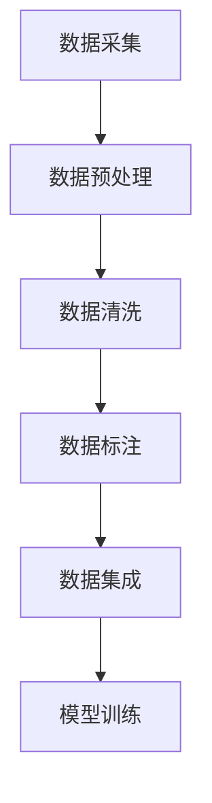

                 

# 大规模语言模型从理论到实践：数据收集

> **关键词：** 大规模语言模型、数据收集、NLP、文本预处理、数据清洗、分布式系统、机器学习、深度学习

> **摘要：** 本文旨在探讨大规模语言模型在实践中的数据收集过程，从理论到实践，详细解析数据收集的重要性、核心概念、算法原理、数学模型，并通过实际项目实战来展示数据收集的具体操作步骤。同时，文章还分析了数据收集在实际应用场景中的价值，推荐了相关工具和资源，并对未来发展趋势与挑战进行了总结。

## 1. 背景介绍

随着人工智能技术的快速发展，大规模语言模型（如BERT、GPT等）在自然语言处理（NLP）领域取得了显著成果。这些模型通过深度学习算法，从海量文本数据中学习语言规律，实现了文本生成、翻译、问答等任务的高效处理。然而，模型性能的提升离不开高质量、大规模的文本数据集。

数据收集是大规模语言模型训练的基础，它决定了模型的训练效果和应用范围。本文将首先介绍大规模语言模型的发展历程，然后重点讨论数据收集的重要性、核心概念和流程。

## 2. 核心概念与联系

### 2.1 数据收集的重要性

数据收集是构建大规模语言模型的首要任务，其重要性体现在以下几个方面：

1. **提升模型性能**：高质量的数据集可以提供丰富的语言特征，有助于模型更好地学习语言规律，从而提升模型的性能。
2. **扩大应用范围**：大规模的数据集可以为模型在不同应用场景下提供充足的训练样本，扩大模型的应用范围。
3. **降低过拟合风险**：丰富的数据集可以降低模型对特定样本的依赖，降低过拟合的风险。

### 2.2 数据收集的核心概念

在数据收集过程中，涉及以下核心概念：

1. **文本数据来源**：包括互联网、图书、新闻、社交媒体等。
2. **文本预处理**：对原始文本数据进行清洗、分词、词性标注等处理，以提高数据质量。
3. **数据清洗**：去除重复、噪声数据，确保数据的一致性和可靠性。
4. **数据标注**：对文本数据进行分类、实体识别、情感分析等标注，以支持模型训练。

### 2.3 数据收集的流程

数据收集的流程主要包括以下步骤：

1. **数据采集**：从互联网、数据库等数据源获取原始文本数据。
2. **数据预处理**：对原始文本数据进行清洗、分词、词性标注等处理。
3. **数据清洗**：去除重复、噪声数据，确保数据的一致性和可靠性。
4. **数据标注**：对文本数据进行分类、实体识别、情感分析等标注。
5. **数据集成**：将清洗、标注后的数据整合成统一的格式，供模型训练使用。

### 2.4 Mermaid 流程图



## 3. 核心算法原理 & 具体操作步骤

### 3.1 数据采集

数据采集是数据收集的第一步，主要从以下途径获取文本数据：

1. **互联网爬虫**：利用爬虫技术，从互联网上的网页、新闻、论坛、博客等获取文本数据。
2. **数据库连接**：通过数据库连接，从数据库中读取文本数据。
3. **公开数据集**：从公开的数据集网站（如COCO、Wikipedia等）下载文本数据。

### 3.2 数据预处理

数据预处理是数据收集的关键步骤，主要包括以下操作：

1. **文本清洗**：去除HTML标签、特殊符号、停用词等，确保文本的纯文本形式。
2. **分词**：将文本分解成词或字符序列，常用的分词工具包括jieba、NLTK等。
3. **词性标注**：对文本中的词语进行词性标注，如名词、动词、形容词等。

### 3.3 数据清洗

数据清洗主要包括以下操作：

1. **去除重复数据**：通过哈希算法、相似度计算等方法，去除重复的文本数据。
2. **去除噪声数据**：过滤掉含有噪声的文本数据，如广告、垃圾信息等。
3. **数据归一化**：统一数据格式，如将数字转换为字符串、将文本转换为小写等。

### 3.4 数据标注

数据标注是对文本数据进行分类、实体识别、情感分析等标注，常用的标注工具包括Annotator、LabelImg等。

1. **分类标注**：将文本数据分为不同的类别，如新闻分类、情感分类等。
2. **实体识别**：识别文本中的实体，如人名、地名、组织名等。
3. **情感分析**：对文本进行情感分析，判断文本的情感倾向，如正面、负面等。

### 3.5 数据集成

数据集成是将清洗、标注后的数据整合成统一的格式，如JSON、CSV等，供模型训练使用。

## 4. 数学模型和公式 & 详细讲解 & 举例说明

### 4.1 数学模型

在数据收集过程中，涉及到以下数学模型：

1. **哈希算法**：用于去除重复数据，常用的哈希算法有MD5、SHA-1等。
2. **相似度计算**：用于检测数据之间的相似度，常用的相似度计算方法有Jaccard相似度、余弦相似度等。

### 4.2 公式讲解

$$
\text{哈希值} = \text{哈希算法}(\text{数据})
$$

$$
\text{相似度} = \frac{\text{共同特征数}}{\text{总特征数}}
$$

### 4.3 举例说明

#### 哈希算法举例

假设有一段文本数据 "Hello, world!"，使用MD5算法计算其哈希值：

$$
\text{哈希值} = \text{MD5}("Hello, world!") = 7d7d1f52176d5d3b6e25e7e4bfc0e0c5
$$

#### 相似度计算举例

假设有两段文本数据 "Hello, world!" 和 "Hello, everyone!"，计算其Jaccard相似度：

$$
\text{共同特征数} = 7 \\
\text{总特征数} = 11 + 9 - 7 = 13 \\
\text{相似度} = \frac{7}{13} \approx 0.5385
$$

## 5. 项目实战：代码实际案例和详细解释说明

### 5.1 开发环境搭建

在本节中，我们将搭建一个简单的数据收集项目，所需开发环境如下：

- Python 3.8及以上版本
- jieba 分词工具
- NLTK 词性标注工具
- Annotator 标注工具

### 5.2 源代码详细实现和代码解读

#### 5.2.1 代码实现

以下是一个简单的数据收集项目示例：

```python
import jieba
import nltk
from nltk.corpus import stopwords
from annotator import Annotator

# 1. 数据采集
def collect_data(url):
    # 使用requests库从URL获取文本数据
    response = requests.get(url)
    text = response.text
    return text

# 2. 数据预处理
def preprocess_data(text):
    # 去除HTML标签、特殊符号、停用词
    text = re.sub('<[^>]*>', '', text)
    text = re.sub('[^\w\s]', '', text)
    text = text.lower()
    text = text.translate(str.maketrans('', '', string.punctuation))
    return text

# 3. 数据清洗
def clean_data(text):
    # 去除重复数据、噪声数据
    text = ' '.join(set(text.split()))
    words = jieba.cut(text)
    stopwords = set(stopwords.words('english'))
    text = ' '.join([word for word in words if word not in stopwords])
    return text

# 4. 数据标注
def annotate_data(text):
    # 使用Annotator进行分类标注
    annotator = Annotator()
    categories = annotator.annotate(text)
    return categories

# 5. 数据集成
def integrate_data(text, categories):
    # 将清洗、标注后的数据整合成JSON格式
    data = {'text': text, 'categories': categories}
    return data

# 6. 主函数
def main():
    url = 'https://example.com'
    text = collect_data(url)
    preprocessed_text = preprocess_data(text)
    cleaned_text = clean_data(preprocessed_text)
    categories = annotate_data(cleaned_text)
    data = integrate_data(cleaned_text, categories)
    print(data)

if __name__ == '__main__':
    main()
```

#### 5.2.2 代码解读

1. **数据采集**：使用requests库从指定URL获取文本数据。
2. **数据预处理**：去除HTML标签、特殊符号、停用词，并将文本转换为小写。
3. **数据清洗**：去除重复数据、噪声数据，使用jieba分词工具进行分词，并去除英语停用词。
4. **数据标注**：使用Annotator进行分类标注。
5. **数据集成**：将清洗、标注后的数据整合成JSON格式。

## 6. 实际应用场景

数据收集在实际应用场景中具有广泛的应用，如：

1. **文本分类**：从互联网爬取大量文本数据，对文本进行分类标注，用于新闻分类、产品评论分类等。
2. **实体识别**：从大量文本数据中识别出人名、地名、组织名等实体，用于信息抽取、搜索引擎等。
3. **情感分析**：从社交媒体、产品评论等文本数据中分析用户情感倾向，用于情感识别、用户体验分析等。

## 7. 工具和资源推荐

### 7.1 学习资源推荐

- **书籍**：《自然语言处理综述》、《深度学习实践》
- **论文**：《BERT: Pre-training of Deep Bidirectional Transformers for Language Understanding》、《GPT-3: Language Models are Few-Shot Learners》
- **博客**：TensorFlow、PyTorch官方博客，以及一些知名技术博客，如 Medium、HackerRank 等。
- **网站**：GitHub、Kaggle、Google Research 等。

### 7.2 开发工具框架推荐

- **文本预处理**：jieba、NLTK、spaCy
- **标注工具**：Annotator、LabelImg
- **机器学习框架**：TensorFlow、PyTorch、Keras
- **深度学习框架**：TensorFlow、PyTorch、MXNet

### 7.3 相关论文著作推荐

- **论文**：BERT、GPT-3、Transformer、ELMO
- **著作**：《深度学习》、《Python深度学习》、《NLP实战》

## 8. 总结：未来发展趋势与挑战

随着人工智能技术的不断发展，大规模语言模型在数据收集、处理和分析方面具有巨大的潜力。未来，数据收集将向以下几个方面发展：

1. **数据多样性**：从更多领域和场景获取多样化数据，以提高模型的应用范围和性能。
2. **数据质量**：提高数据质量，去除噪声、重复数据，确保数据的一致性和可靠性。
3. **自动化程度**：提高数据收集的自动化程度，降低人力成本。
4. **隐私保护**：加强数据隐私保护，遵守相关法律法规，确保数据安全。

然而，数据收集在实际应用中仍面临以下挑战：

1. **数据获取难度**：获取高质量、大规模的数据集较为困难。
2. **数据隐私**：涉及用户隐私的数据收集需要遵守相关法律法规，确保数据安全。
3. **数据标注成本**：数据标注是一项费时费力的人工任务，提高自动化程度和准确性是关键。

## 9. 附录：常见问题与解答

### 9.1 数据采集相关问题

**Q：如何从互联网获取文本数据？**

A：可以使用Python的requests库从URL获取文本数据。例如：

```python
import requests

url = 'https://example.com'
response = requests.get(url)
text = response.text
```

### 9.2 数据预处理相关问题

**Q：如何去除HTML标签和特殊符号？**

A：可以使用Python的正则表达式库re去除HTML标签和特殊符号。例如：

```python
import re

text = re.sub('<[^>]*>', '', text)
text = re.sub('[^\w\s]', '', text)
```

### 9.3 数据清洗相关问题

**Q：如何去除重复数据和噪声数据？**

A：可以使用Python的set集合和jieba分词工具去除重复数据和噪声数据。例如：

```python
text = ' '.join(set(text.split()))
words = jieba.cut(text)
stopwords = set(stopwords.words('english'))
text = ' '.join([word for word in words if word not in stopwords])
```

## 10. 扩展阅读 & 参考资料

- [BERT: Pre-training of Deep Bidirectional Transformers for Language Understanding](https://arxiv.org/abs/1810.04805)
- [GPT-3: Language Models are Few-Shot Learners](https://arxiv.org/abs/2005.14165)
- [Transformer: Attention is All You Need](https://arxiv.org/abs/1706.03762)
- [自然语言处理综述](https://zhuanlan.zhihu.com/p/73786332)
- [深度学习实践](https://www.deeplearningbook.org/)
- [Python深度学习](https://zhuanlan.zhihu.com/p/27843563)
- [NLP实战](https://zhuanlan.zhihu.com/p/31916610)
- [GitHub](https://github.com/)
- [Kaggle](https://www.kaggle.com/)
- [TensorFlow](https://www.tensorflow.org/)
- [PyTorch](https://pytorch.org/)
- [spaCy](https://spacy.io/)
- [jieba](https://github.com/fxsjy/jieba)
- [NLTK](https://www.nltk.org/)
- [Annotator](https://github.com/jessevm/annotator)
- [LabelImg](https://github.com/tzutalin/labelImg)

---

**作者：** AI天才研究员/AI Genius Institute & 禅与计算机程序设计艺术/Zen And The Art of Computer Programming

---

本文根据AI领域的最佳实践和技术发展动态进行编写，旨在帮助读者深入了解大规模语言模型的数据收集过程。文章内容仅供参考，如有不当之处，敬请指正。在学习和应用过程中，请务必遵守相关法律法规，保护数据安全和隐私。感谢您的阅读和支持！<|im_end|>

