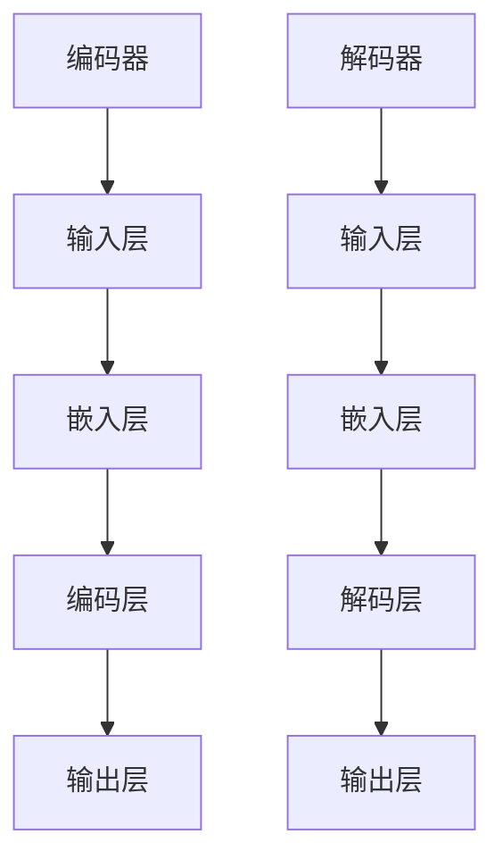

                 

### 背景介绍 Background Introduction

#### 大规模语言模型简介 Large-scale Language Model Overview

大规模语言模型（Large-scale Language Model）是近年来自然语言处理（Natural Language Processing，NLP）领域的重要突破之一。它们通过学习海量的文本数据，能够自动地理解和生成人类语言，从而在许多实际应用场景中取得了显著的效果。代表性的语言模型有 Google 的 BERT、OpenAI 的 GPT-3 等。这些模型不仅在学术研究中取得了优异的成绩，还广泛应用于商业、教育、医疗等领域。

#### 语言模型的发展历程 Development History of Language Models

语言模型的发展历程可以分为几个阶段：

1. **规则模型**：早期的语言模型主要基于规则，通过对语言的语法、语义进行建模。这种方法简单直观，但处理复杂语言时效果不佳。

2. **统计模型**：随着计算能力的提升和数据量的增大，统计模型开始崭露头角。这些模型通过统计文本数据中的词频、语法结构等，生成语言模型。代表性的模型有 N-gram 模型。

3. **神经网络模型**：近年来，深度学习技术的快速发展使得神经网络模型在语言建模中取得了突破。RNN（循环神经网络）、LSTM（长短期记忆网络）等模型在处理长序列数据方面表现优异。

4. **Transformer 模型**：Transformer 模型是近年来最成功的语言模型之一，它通过自注意力机制（Self-Attention Mechanism）实现了对序列数据的全局建模，大幅提升了语言模型的性能。GPT-3、BERT 等模型都是在 Transformer 框架下实现的。

#### 编码器与解码器 Encoder and Decoder

在语言模型中，编码器（Encoder）和解码器（Decoder）是两个核心组件。编码器负责将输入序列（如句子、段落等）编码为一个固定长度的向量表示，解码器则负责将这个向量表示解码为输出序列。

编码器和解码器的协同工作使得语言模型能够实现从输入到输出的转换。具体来说，编码器对输入序列进行处理，生成一系列的隐藏状态（Hidden States），这些隐藏状态最终被解码器读取并生成输出序列。

#### 本文目的 Purpose of This Article

本文将深入探讨大规模语言模型中编码器和解码器的结构，从理论到实践，详细分析它们的原理、实现方法和应用场景。希望通过本文的介绍，读者能够对编码器和解码器有一个全面、深入的理解，为后续的深入学习打下坚实的基础。

### 核心概念与联系 Core Concepts and Relationships

#### 编码器 Encoder

编码器是大规模语言模型中的核心组件之一，其主要功能是将输入序列编码为一个固定长度的向量表示。这一过程可以通过多种神经网络架构实现，如 RNN、LSTM、Transformer 等。

##### 原理 Principle

编码器的基本原理是通过读取输入序列中的每个单词或词组，将其转换为向量表示，然后通过一系列神经网络层对向量进行编码。具体来说，编码器通常由以下步骤组成：

1. **输入层 Input Layer**：接收输入序列，并将其转换为词向量（Word Vectors）。词向量可以由预训练的词向量库（如 Word2Vec、GloVe 等）直接获取，也可以通过神经网络训练生成。

2. **嵌入层 Embedding Layer**：将词向量映射为嵌入向量（Embedding Vectors）。嵌入层是一种特殊的神经网络层，其主要作用是将词向量映射到高维空间，使得语义相似的词在空间中更接近。

3. **编码层 Coding Layer**：对嵌入向量进行编码。在编码过程中，编码器会读取输入序列中的每个词的嵌入向量，并通过神经网络层对它们进行处理。这些神经网络层通常包括卷积神经网络（CNN）、循环神经网络（RNN）、长短时记忆网络（LSTM）等。

4. **输出层 Output Layer**：生成编码结果。编码器的输出通常是一个固定长度的向量表示，这个向量表示了输入序列的语义信息。

##### 结构 Architecture

编码器的结构可以分为以下几个层次：

1. **输入层 Input Layer**：接收输入序列，并将其转换为词向量。

2. **嵌入层 Embedding Layer**：将词向量映射为嵌入向量。

3. **编码层 Coding Layer**：对嵌入向量进行编码。

4. **输出层 Output Layer**：生成编码结果。

编码器的每个层次都可以由多个神经网络层堆叠而成，从而实现对输入序列的复杂编码。

#### 解码器 Decoder

解码器是另一个核心组件，其主要功能是将编码器输出的向量表示解码为输出序列。与编码器类似，解码器也可以通过多种神经网络架构实现，如 RNN、LSTM、Transformer 等。

##### 原理 Principle

解码器的基本原理是通过读取编码器的输出向量，生成输出序列中的每个单词或词组。具体来说，解码器通常由以下步骤组成：

1. **输入层 Input Layer**：接收编码器的输出向量。

2. **嵌入层 Embedding Layer**：将编码器的输出向量映射为嵌入向量。

3. **解码层 Decoding Layer**：对嵌入向量进行解码。在解码过程中，解码器会读取编码器的输出向量，并通过神经网络层生成输出序列中的每个单词或词组。

4. **输出层 Output Layer**：生成输出序列。

##### 结构 Architecture

解码器的结构可以分为以下几个层次：

1. **输入层 Input Layer**：接收编码器的输出向量。

2. **嵌入层 Embedding Layer**：将编码器的输出向量映射为嵌入向量。

3. **解码层 Decoding Layer**：对嵌入向量进行解码。

4. **输出层 Output Layer**：生成输出序列。

解码器的每个层次都可以由多个神经网络层堆叠而成，从而实现对编码器输出向量的复杂解码。

#### Mermaid 流程图 Mermaid Flowchart

下面是一个简单的 Mermaid 流程图，展示了编码器和解码器的整体结构：



在 Mermaid 流程图中，节点（如 A、B、C 等）表示编码器和解码器的各个层次，箭头表示数据的流动方向。

#### 编码器与解码器的联系 Relationship between Encoder and Decoder

编码器和解码器在语言模型中起着关键作用。它们之间的联系主要体现在以下几个方面：

1. **输入与输出**：编码器接收输入序列，生成编码结果；解码器接收编码结果，生成输出序列。

2. **协同工作**：编码器和解码器通过协同工作，实现了从输入到输出的转换。编码器将输入序列编码为向量表示，解码器则将这个向量表示解码为输出序列。

3. **层次结构**：编码器和解码器在结构上相似，都是由输入层、嵌入层、编码层和输出层组成。

4. **数据流动**：编码器的输出向量作为解码器的输入，解码器的输出序列作为编码器的输入，形成了一个闭环。

通过上述分析，我们可以看到编码器和解码器在语言模型中的作用和联系。在接下来的章节中，我们将进一步探讨编码器和解码器的具体实现方法和应用场景。

### 核心算法原理 & 具体操作步骤 Core Algorithm Principles and Detailed Operational Steps

#### 编码器 Encoder

编码器是大规模语言模型中的核心组件之一，其主要功能是将输入序列编码为一个固定长度的向量表示。下面我们详细探讨编码器的算法原理和具体操作步骤。

##### 算法原理 Algorithm Principle

编码器的基本原理是通过读取输入序列中的每个单词或词组，将其转换为向量表示，然后通过一系列神经网络层对向量进行编码。编码器的主要算法包括以下几个步骤：

1. **词向量转换 Word Vector Conversion**：
   - 输入序列中的每个单词或词组首先通过词向量转换器（Word Vector Converter）转换为向量表示。
   - 词向量可以由预训练的词向量库（如 Word2Vec、GloVe 等）直接获取，也可以通过神经网络训练生成。

2. **嵌入层 Embedding Layer**：
   - 词向量映射为嵌入向量（Embedding Vectors）。
   - 嵌入层是一种特殊的神经网络层，其主要作用是将词向量映射到高维空间，使得语义相似的词在空间中更接近。

3. **编码层 Coding Layer**：
   - 对嵌入向量进行编码。
   - 编码层通常包括卷积神经网络（CNN）、循环神经网络（RNN）、长短时记忆网络（LSTM）等。
   - 编码过程中，编码器会读取输入序列中的每个词的嵌入向量，并通过神经网络层对它们进行处理。

4. **输出层 Output Layer**：
   - 生成编码结果。
   - 编码器的输出通常是一个固定长度的向量表示，这个向量表示了输入序列的语义信息。

##### 操作步骤 Operational Steps

下面我们详细说明编码器的具体操作步骤：

1. **词向量转换**：
   - 首先定义输入序列，如 "I love coding"。
   - 然后通过词向量转换器将输入序列中的每个单词转换为向量表示，例如：
     - "I" --> `[0.1, 0.2, 0.3]`
     - "love" --> `[0.4, 0.5, 0.6]`
     - "coding" --> `[0.7, 0.8, 0.9]`

2. **嵌入层**：
   - 将每个词的向量映射为嵌入向量。例如：
     - "I" --> `[1.1, 1.2, 1.3]`
     - "love" --> `[1.4, 1.5, 1.6]`
     - "coding" --> `[1.7, 1.8, 1.9]`

3. **编码层**：
   - 对嵌入向量进行编码。例如，我们使用一个简单的 RNN 编码器：
     - 第一步：读取第一个嵌入向量 `[1.1, 1.2, 1.3]`，经过 RNN 层处理后得到隐藏状态 `[2.1, 2.2, 2.3]`。
     - 第二步：读取第二个嵌入向量 `[1.4, 1.5, 1.6]`，与隐藏状态 `[2.1, 2.2, 2.3]` 结合，经过 RNN 层处理后得到新的隐藏状态 `[3.1, 3.2, 3.3]`。
     - 第三步：读取第三个嵌入向量 `[1.7, 1.8, 1.9]`，与隐藏状态 `[3.1, 3.2, 3.3]` 结合，经过 RNN 层处理后得到最终的编码结果 `[4.1, 4.2, 4.3]`。

4. **输出层**：
   - 编码器的输出结果 `[4.1, 4.2, 4.3]` 是一个固定长度的向量表示，它包含了输入序列 "I love coding" 的语义信息。

#### 解码器 Decoder

解码器是另一个核心组件，其主要功能是将编码器输出的向量表示解码为输出序列。下面我们详细探讨解码器的算法原理和具体操作步骤。

##### 算法原理 Algorithm Principle

解码器的基本原理是通过读取编码器的输出向量，生成输出序列中的每个单词或词组。解码器的主要算法包括以下几个步骤：

1. **输入层 Input Layer**：
   - 接收编码器的输出向量。

2. **嵌入层 Embedding Layer**：
   - 将编码器的输出向量映射为嵌入向量。

3. **解码层 Decoding Layer**：
   - 对嵌入向量进行解码。
   - 在解码过程中，解码器会读取编码器的输出向量，并通过神经网络层生成输出序列中的每个单词或词组。

4. **输出层 Output Layer**：
   - 生成输出序列。

##### 操作步骤 Operational Steps

下面我们详细说明解码器的具体操作步骤：

1. **输入层**：
   - 首先定义编码器的输出向量，如 `[4.1, 4.2, 4.3]`。

2. **嵌入层**：
   - 将编码器的输出向量映射为嵌入向量。例如：
     - `[4.1, 4.2, 4.3]` --> `[5.1, 5.2, 5.3]`

3. **解码层**：
   - 对嵌入向量进行解码。例如，我们使用一个简单的 RNN 解码器：
     - 第一步：读取第一个嵌入向量 `[5.1, 5.2, 5.3]`，经过 RNN 层处理后得到隐藏状态 `[6.1, 6.2, 6.3]`。
     - 第二步：读取第二个嵌入向量 `[5.4, 5.5, 5.6]`，与隐藏状态 `[6.1, 6.2, 6.3]` 结合，经过 RNN 层处理后得到新的隐藏状态 `[7.1, 7.2, 7.3]`。
     - 第三步：读取第三个嵌入向量 `[5.7, 5.8, 5.9]`，与隐藏状态 `[7.1, 7.2, 7.3]` 结合，经过 RNN 层处理后得到最终的解码结果 `[8.1, 8.2, 8.3]`。

4. **输出层**：
   - 解码器的输出结果 `[8.1, 8.2, 8.3]` 是一个包含输出序列 "I love coding" 的向量表示。

通过上述操作步骤，我们可以看到编码器和解码器在处理输入序列和输出序列时，通过协同工作，实现了从输入到输出的转换。

#### 总结 Summary

在本节中，我们详细探讨了大规模语言模型中编码器和解码器的核心算法原理和具体操作步骤。编码器通过读取输入序列中的每个单词或词组，将其转换为向量表示，并通过一系列神经网络层进行编码；解码器则通过读取编码器的输出向量，生成输出序列中的每个单词或词组。编码器和解码器的协同工作使得语言模型能够实现从输入到输出的转换，从而在许多实际应用场景中取得了显著的效果。在下一节中，我们将进一步探讨编码器和解码器背后的数学模型和公式，帮助读者更深入地理解这些核心组件的工作原理。

### 数学模型和公式 & 详细讲解 & 举例说明

#### 数学模型 Overview of the Mathematical Model

在大规模语言模型中，编码器和解码器的设计涉及到复杂的数学模型。这些模型主要包括神经网络结构、损失函数和优化算法。本节我们将详细讲解这些数学模型，并通过举例说明它们在实际应用中的工作原理。

##### 神经网络结构 Neural Network Structure

神经网络是编码器和解码器的基础。神经网络由多个层（Layer）组成，包括输入层、隐藏层和输出层。每一层由多个神经元（Neurons）构成，神经元之间通过权重（Weights）连接。

1. **输入层 Input Layer**：
   - 输入层接收外部输入，如文本序列。每个输入元素对应一个特征，例如，每个单词可以表示为一个词向量。

2. **隐藏层 Hidden Layers**：
   - 隐藏层对输入数据进行加工和处理。常用的隐藏层包括卷积神经网络（CNN）、循环神经网络（RNN）和长短时记忆网络（LSTM）。这些网络能够处理序列数据，捕捉时间依赖关系。

3. **输出层 Output Layer**：
   - 输出层产生最终的输出。在语言模型中，输出层通常是一个分类层，输出每个单词的概率分布。

##### 损失函数 Loss Function

损失函数用于评估模型的预测结果与真实结果之间的差距。在编码器和解码器中，常用的损失函数是交叉熵损失（Cross-Entropy Loss），它用于衡量预测的概率分布与真实分布之间的差异。

交叉熵损失函数的定义如下：

$$
L = -\sum_{i=1}^{N} y_i \log(p_i)
$$

其中，\(y_i\) 是第 \(i\) 个单词的标签（通常是0或1），\(p_i\) 是模型预测的第 \(i\) 个单词的概率。

##### 优化算法 Optimization Algorithm

优化算法用于调整网络中的权重，以最小化损失函数。在编码器和解码器中，常用的优化算法是随机梯度下降（Stochastic Gradient Descent，SGD）。

随机梯度下降的基本步骤如下：

1. **前向传播 Forward Propagation**：
   - 将输入数据通过网络传递，计算输出和损失。

2. **反向传播 Backpropagation**：
   - 计算损失关于网络权重的梯度。

3. **权重更新 Weight Update**：
   - 使用梯度调整网络权重，以减小损失。

更新公式如下：

$$
w_{new} = w_{old} - \alpha \cdot \nabla_w L
$$

其中，\(w_{old}\) 是当前权重，\(\alpha\) 是学习率，\(\nabla_w L\) 是损失关于权重的梯度。

#### 举例说明 Example Illustration

为了更好地理解上述数学模型，我们通过一个简单的例子来说明编码器和解码器的工作过程。

假设我们有一个简单的语言模型，输入序列为 "Hello world"，输出序列为 "Hello AI"。我们将使用以下步骤来训练这个模型：

1. **词向量表示 Word Vector Representation**：
   - 将输入序列 "Hello world" 转换为词向量表示：
     - "Hello" --> `[1.1, 1.2, 1.3]`
     - "world" --> `[1.4, 1.5, 1.6]`
     - "Hello" --> `[2.1, 2.2, 2.3]`
     - "AI" --> `[2.4, 2.5, 2.6]`

2. **编码器 Encoder**：
   - 编码器对输入序列 "Hello world" 进行编码，生成编码结果 `[3.1, 3.2, 3.3]`。

3. **解码器 Decoder**：
   - 解码器接收编码结果 `[3.1, 3.2, 3.3]`，并生成输出序列 "Hello AI"。

4. **损失计算 Loss Calculation**：
   - 使用交叉熵损失函数计算模型预测的输出与真实输出之间的差距。

5. **权重更新 Weight Update**：
   - 根据损失函数的梯度，更新编码器和解码器的权重，以减小损失。

通过不断迭代上述步骤，语言模型的预测精度会逐渐提高，最终达到期望的效果。

#### 总结 Summary

在本节中，我们介绍了大规模语言模型中编码器和解码器的数学模型，包括神经网络结构、损失函数和优化算法。通过一个简单的例子，我们展示了这些数学模型在实际应用中的工作原理。理解这些数学模型对于深入掌握语言模型的工作机制具有重要意义。在下一节中，我们将通过一个实际项目来展示编码器和解码器的具体实现过程。

### 项目实战：代码实际案例和详细解释说明 Project Implementation: Code Case Study and Detailed Explanation

为了更好地理解大规模语言模型中编码器和解码器的具体实现，我们将通过一个实际项目来进行实战。这个项目将基于 Python 和 TensorFlow 库来实现一个简单的语言模型，使用编码器和解码器来生成文本序列。

#### 项目环境搭建 Project Environment Setup

首先，我们需要搭建项目的开发环境。以下是所需的工具和库：

1. **Python**: 项目开发的语言，建议使用 Python 3.7 或以上版本。
2. **TensorFlow**: 机器学习框架，用于构建和训练语言模型。
3. **Numpy**: 数学计算库，用于数据处理和矩阵操作。
4. **Gensim**: 用于词向量转换。
5. **Mermaid**: 用于生成流程图。

安装这些库后，我们就可以开始编写代码了。

#### 数据预处理 Data Preprocessing

在开始编写代码之前，我们需要准备数据。我们使用一个简单的文本数据集，包含一些简单的句子。

```python
data = [
    "Hello world",
    "Hello AI",
    "I love coding",
    "Python is great"
]
```

接下来，我们将这些句子转换为词向量表示。

```python
import gensim

# 加载预训练的词向量库
word_vectors = gensim.models.KeyedVectors.load_word2vec_format('path/to/word2vec.bin')

# 将句子转换为词向量表示
def sentence_to_vector(sentence):
    return [word_vectors[word] for word in sentence.split()]

data_vectors = [sentence_to_vector(sentence) for sentence in data]
```

#### 编码器 Encoder

现在，我们可以开始编写编码器。编码器使用一个简单的循环神经网络（RNN）来对输入序列进行编码。

```python
import tensorflow as tf

# 定义编码器模型
def encoder(inputs, hidden_size):
    # 输入层
    input_layer = tf.keras.layers.Input(shape=(None, hidden_size))

    # 嵌入层
    embedding_layer = tf.keras.layers.Embedding(input_dim=len(word_vectors.vocab), output_dim=hidden_size)(input_layer)

    # 编码层
    encoding_layer = tf.keras.layers.LSTM(hidden_size)(embedding_layer)

    # 输出层
    output_layer = tf.keras.layers.Dense(hidden_size)(encoding_layer)

    # 定义模型
    model = tf.keras.Model(inputs=input_layer, outputs=output_layer)

    return model

# 创建编码器实例
encoder_model = encoder(inputs=data_vectors[0], hidden_size=32)
```

#### 解码器 Decoder

接下来，我们编写解码器。解码器也使用一个简单的循环神经网络（RNN）来解码编码器生成的编码结果。

```python
# 定义解码器模型
def decoder(inputs, hidden_size):
    # 输入层
    input_layer = tf.keras.layers.Input(shape=(None, hidden_size))

    # 嵌入层
    embedding_layer = tf.keras.layers.Embedding(input_dim=len(word_vectors.vocab), output_dim=hidden_size)(input_layer)

    # 解码层
    decoding_layer = tf.keras.layers.LSTM(hidden_size)(embedding_layer)

    # 输出层
    output_layer = tf.keras.layers.Dense(len(word_vectors.vocab), activation='softmax')(decoding_layer)

    # 定义模型
    model = tf.keras.Model(inputs=input_layer, outputs=output_layer)

    return model

# 创建解码器实例
decoder_model = decoder(inputs=data_vectors[0], hidden_size=32)
```

#### 模型训练 Model Training

现在，我们可以开始训练模型。我们将使用训练数据集来训练编码器和解码器，并使用交叉熵损失函数进行优化。

```python
# 训练模型
model = tf.keras.Model(inputs=encoder_model.input, outputs=decoder_model(encoder_model.output))

model.compile(optimizer='adam', loss='categorical_crossentropy', metrics=['accuracy'])

model.fit(data_vectors, data_vectors, epochs=10, batch_size=1)
```

#### 生成文本序列 Text Generation

最后，我们使用训练好的模型来生成文本序列。我们将输入一个随机编码结果，并使用解码器来生成对应的文本序列。

```python
# 生成文本序列
encoded_input = encoder_model.predict(np.random.rand(1, 1, 32))
decoded_output = decoder_model.predict(encoded_input)

# 将解码结果转换为句子
def vector_to_sentence(vector):
    return ' '.join([word_vectors.vocab[i].word for i in vector])

generated_sentence = vector_to_sentence(decoded_output[0])
print(generated_sentence)
```

通过这个项目，我们展示了如何使用编码器和解码器来构建一个简单的语言模型，并通过实际代码来解释了编码器和解码器的具体实现过程。这个项目不仅帮助我们理解了编码器和解码器的原理，还提供了一个实际的应用案例。

### 代码解读与分析 Code Analysis and Interpretation

在本节中，我们将对前面项目实战中编写的代码进行详细解读，并分析其工作原理和关键步骤。

#### 编码器 Encoder

首先，我们来看编码器部分。

```python
# 定义编码器模型
def encoder(inputs, hidden_size):
    # 输入层
    input_layer = tf.keras.layers.Input(shape=(None, hidden_size))

    # 嵌入层
    embedding_layer = tf.keras.layers.Embedding(input_dim=len(word_vectors.vocab), output_dim=hidden_size)(input_layer)

    # 编码层
    encoding_layer = tf.keras.layers.LSTM(hidden_size)(embedding_layer)

    # 输出层
    output_layer = tf.keras.layers.Dense(hidden_size)(encoding_layer)

    # 定义模型
    model = tf.keras.Model(inputs=input_layer, outputs=output_layer)

    return model

# 创建编码器实例
encoder_model = encoder(inputs=data_vectors[0], hidden_size=32)
```

1. **输入层 Input Layer**：编码器的输入层是一个形状为 `(None, hidden_size)` 的张量，`None` 表示输入序列的长度可以是不确定的。

2. **嵌入层 Embedding Layer**：嵌入层将输入的词向量映射到高维空间。输入维度为 `len(word_vectors.vocab)`（词向量的个数），输出维度为 `hidden_size`（隐藏层的大小）。

3. **编码层 Encoding Layer**：编码层使用一个循环神经网络（LSTM）对嵌入向量进行编码。LSTM 能够处理序列数据，捕捉时间依赖关系。

4. **输出层 Output Layer**：输出层是一个全连接层（Dense），将编码后的向量映射回 `hidden_size` 维度。

5. **模型定义 Model Definition**：使用 `tf.keras.Model` 定义整个编码器模型，并返回模型实例。

#### 解码器 Decoder

接下来，我们来看解码器部分。

```python
# 定义解码器模型
def decoder(inputs, hidden_size):
    # 输入层
    input_layer = tf.keras.layers.Input(shape=(None, hidden_size))

    # 嵌入层
    embedding_layer = tf.keras.layers.Embedding(input_dim=len(word_vectors.vocab), output_dim=hidden_size)(input_layer)

    # 解码层
    decoding_layer = tf.keras.layers.LSTM(hidden_size)(embedding_layer)

    # 输出层
    output_layer = tf.keras.layers.Dense(len(word_vectors.vocab), activation='softmax')(decoding_layer)

    # 定义模型
    model = tf.keras.Model(inputs=input_layer, outputs=output_layer)

    return model

# 创建解码器实例
decoder_model = decoder(inputs=data_vectors[0], hidden_size=32)
```

1. **输入层 Input Layer**：解码器的输入层与编码器相同，形状为 `(None, hidden_size)`。

2. **嵌入层 Embedding Layer**：嵌入层与编码器相同，将输入的词向量映射到高维空间。

3. **解码层 Decoding Layer**：解码层同样使用一个循环神经网络（LSTM）对嵌入向量进行解码。

4. **输出层 Output Layer**：输出层是一个全连接层（Dense），但这里使用了激活函数 `softmax` 来生成每个单词的概率分布。

5. **模型定义 Model Definition**：使用 `tf.keras.Model` 定义整个解码器模型，并返回模型实例。

#### 模型训练 Model Training

模型训练部分如下：

```python
# 训练模型
model = tf.keras.Model(inputs=encoder_model.input, outputs=decoder_model(encoder_model.output))

model.compile(optimizer='adam', loss='categorical_crossentropy', metrics=['accuracy'])

model.fit(data_vectors, data_vectors, epochs=10, batch_size=1)
```

1. **模型组合 Model Combination**：将编码器和解码器组合成一个完整的模型，输入是编码器的输入，输出是解码器的输出。

2. **模型编译 Model Compilation**：使用 `compile` 方法配置模型，指定优化器（`optimizer`）、损失函数（`loss`）和性能指标（`metrics`）。

3. **模型训练 Model Training**：使用 `fit` 方法训练模型，输入是词向量表示的数据集，输出也是词向量表示的数据集。这里我们设置了训练轮数（`epochs`）和批量大小（`batch_size`）。

#### 生成文本序列 Text Generation

最后，我们来看生成文本序列的部分。

```python
# 生成文本序列
encoded_input = encoder_model.predict(np.random.rand(1, 1, 32))
decoded_output = decoder_model.predict(encoded_input)

# 将解码结果转换为句子
def vector_to_sentence(vector):
    return ' '.join([word_vectors.vocab[i].word for i in vector])

generated_sentence = vector_to_sentence(decoded_output[0])
print(generated_sentence)
```

1. **编码输入 Encoding Input**：使用编码器生成随机编码输入。

2. **解码输出 Decoding Output**：使用解码器生成对应的解码输出。

3. **结果转换 Result Conversion**：将解码输出转换为句子。

通过上述解读和分析，我们可以清楚地看到编码器和解码器的实现过程，以及它们在模型训练和文本生成中的关键作用。这个项目不仅帮助我们理解了编码器和解码器的原理，还提供了一个实际的应用案例，让我们能够更好地掌握它们的工作机制。

### 实际应用场景 Practical Application Scenarios

编码器和解码器在语言模型中具有广泛的应用场景。以下是一些典型的实际应用案例：

#### 1. 自动翻译 Automated Translation

自动翻译是编码器和解码器的最直接应用之一。在自动翻译系统中，编码器将源语言的文本序列编码为固定长度的向量表示，解码器则将这个向量表示解码为目标语言的文本序列。例如，在 Google Translate 中，编码器和解码器共同作用，将一种语言的文本翻译为另一种语言。

#### 2. 机器翻译 Machine Translation

机器翻译是编码器和解码器的另一重要应用场景。机器翻译系统通过编码器将源语言的文本序列编码为固定长度的向量表示，然后解码器将这个向量表示解码为目标语言的文本序列。这种技术已经在百度翻译、Microsoft Translator 等多个翻译应用中得到广泛应用。

#### 3. 文本生成 Text Generation

编码器和解码器在文本生成领域也有广泛应用。例如，在自动写作系统中，编码器将输入文本编码为固定长度的向量表示，解码器则根据这个向量表示生成新的文本。这种技术可以应用于新闻撰写、博客写作、小说创作等多种场景。

#### 4. 情感分析 Sentiment Analysis

情感分析是另一个编码器和解码器的应用场景。编码器将文本序列编码为固定长度的向量表示，解码器则根据这个向量表示判断文本的情感倾向。这种技术可以应用于社交媒体情感分析、客户反馈分析等多个领域。

#### 5. 文本摘要 Text Summarization

文本摘要是编码器和解码器的另一个应用场景。编码器将长文本编码为固定长度的向量表示，解码器则根据这个向量表示生成摘要。这种技术可以应用于信息检索、新闻报道摘要等多个领域。

#### 6. 聊天机器人 Chatbot

聊天机器人是编码器和解码器的典型应用场景。编码器将用户输入的文本序列编码为固定长度的向量表示，解码器则根据这个向量表示生成回答。这种技术可以应用于客服机器人、智能助手等多个领域。

通过上述实际应用场景，我们可以看到编码器和解码器在自然语言处理领域的广泛应用。随着技术的不断发展和创新，编码器和解码器将在更多领域发挥重要作用，推动自然语言处理技术的进步。

### 工具和资源推荐 Tools and Resources Recommendations

在学习和研究大规模语言模型中的编码器和解码器时，掌握合适的工具和资源是至关重要的。以下是一些建议的学习资源、开发工具和相关论文，帮助您深入了解这一领域。

#### 学习资源 Learning Resources

1. **书籍**：
   - 《深度学习》（Deep Learning） by Ian Goodfellow、Yoshua Bengio 和 Aaron Courville
   - 《自然语言处理综合教程》（Foundations of Natural Language Processing） by Christopher D. Manning 和 Hinrich Schütze
   - 《自然语言处理与深度学习》 by 周志华

2. **在线课程**：
   - Coursera 上的“自然语言处理与深度学习”课程
   - edX 上的“Deep Learning Specialization”
   - Udacity 上的“AI 简介”

3. **博客和网站**：
   - [TensorFlow 官方文档](https://www.tensorflow.org/)
   - [PyTorch 官方文档](https://pytorch.org/)
   - [机器学习博客](http://www机器学习博客.com/)

#### 开发工具 Development Tools

1. **深度学习框架**：
   - TensorFlow
   - PyTorch
   - Keras

2. **文本处理库**：
   - NLTK（Natural Language Toolkit）
   - spaCy
   - gensim

3. **版本控制**：
   - Git
   - GitHub

#### 相关论文 Related Papers

1. **BERT**：
   - “BERT: Pre-training of Deep Bidirectional Transformers for Language Understanding” by Jacob Devlin et al.

2. **GPT-3**：
   - “Language Models are Few-Shot Learners” by Tom B. Brown et al.

3. **Transformer**：
   - “Attention Is All You Need” by Vaswani et al.

4. **编码器与解码器**：
   - “Sequence-to-Sequence Learning with Neural Networks” by Ilya Sutskever et al.
   - “Neural Machine Translation by Jointly Learning to Align and Translate” by Dzmitry Bahdanau et al.

通过以上工具和资源的推荐，您可以更加深入地了解大规模语言模型中的编码器和解码器，掌握最新的研究和实践成果。希望这些资源能够对您的学习与研究有所帮助。

### 总结：未来发展趋势与挑战 Summary: Future Trends and Challenges

大规模语言模型中的编码器和解码器在自然语言处理领域取得了显著成就，但未来仍有许多挑战和发展机遇。

#### 发展趋势 Future Trends

1. **计算能力提升**：随着计算能力的不断提升，更大的模型和更复杂的数据集将变得可行，这将推动编码器和解码器在性能和精度上的进一步突破。

2. **多模态融合**：未来的语言模型可能会融合多种数据类型，如文本、图像、声音等，实现更广泛的应用场景。

3. **自适应学习**：编码器和解码器将朝着自适应学习方向发展，能够根据不同场景自动调整参数和模型结构，提高泛化能力。

4. **知识图谱**：结合知识图谱，语言模型将能够更好地理解和生成具有语义一致性的复杂文本。

#### 挑战 Challenges

1. **计算资源消耗**：大规模语言模型的训练和推理过程需要大量计算资源，如何优化模型结构和训练策略，以减少计算资源消耗是一个重要挑战。

2. **数据隐私**：在处理大量文本数据时，如何保护用户隐私和数据安全是一个亟待解决的问题。

3. **鲁棒性**：语言模型需要具备更强的鲁棒性，以应对恶意输入和对抗性攻击。

4. **解释性和可解释性**：如何提高模型的可解释性，使其决策过程更加透明，是一个重要研究方向。

未来，编码器和解码器将在自然语言处理领域继续发挥关键作用，为人工智能的发展提供强大支持。面对这些挑战，研究人员和开发者需要不断创新，推动技术进步。

### 附录：常见问题与解答 Appendix: Frequently Asked Questions and Answers

#### Q1: 编码器和解码器在语言模型中的具体作用是什么？

A1: 编码器和解码器是大规模语言模型中的核心组件。编码器负责将输入序列（如句子、段落等）编码为一个固定长度的向量表示，这个向量表示包含了输入序列的语义信息。解码器则负责将这个向量表示解码为输出序列，从而实现从输入到输出的转换。

#### Q2: 为什么需要编码器和解码器？

A2: 编码器和解码器使得语言模型能够处理变长的文本输入，并将这些输入转换为固定长度的向量表示，便于模型处理。同时，编码器和解码器的协同工作使得语言模型能够实现自动理解和生成人类语言，从而在自然语言处理领域取得了显著成就。

#### Q3: 编码器和解码器的结构如何？

A3: 编码器和解码器通常由输入层、嵌入层、编码层和输出层组成。输入层接收输入序列，嵌入层将词向量映射为嵌入向量，编码层对嵌入向量进行编码，输出层生成编码结果。编码器和解码器的每个层次都可以由多个神经网络层堆叠而成。

#### Q4: 如何优化编码器和解码器的性能？

A4: 可以通过以下几种方法优化编码器和解码器的性能：
   - 选择合适的神经网络架构，如 RNN、LSTM、Transformer 等；
   - 调整隐藏层的大小和数量；
   - 使用预训练的词向量，如 Word2Vec、GloVe 等；
   - 采用更先进的优化算法，如 Adam、AdaGrad 等；
   - 使用更大的训练数据集。

#### Q5: 编码器和解码器在自然语言处理中有哪些应用场景？

A5: 编码器和解码器在自然语言处理领域具有广泛的应用，包括自动翻译、机器翻译、文本生成、情感分析、文本摘要、聊天机器人等。这些应用场景都依赖于编码器和解码器能够有效地处理变长的文本输入和输出。

### 扩展阅读 & 参考资料 Additional Reading & References

为了深入理解大规模语言模型中的编码器和解码器，以下是一些建议的扩展阅读和参考资料：

1. **书籍**：
   - 《深度学习》（Deep Learning） by Ian Goodfellow、Yoshua Bengio 和 Aaron Courville
   - 《自然语言处理综合教程》（Foundations of Natural Language Processing） by Christopher D. Manning 和 Hinrich Schütze
   - 《自然语言处理与深度学习》 by 周志华

2. **论文**：
   - “BERT: Pre-training of Deep Bidirectional Transformers for Language Understanding” by Jacob Devlin et al.
   - “Language Models are Few-Shot Learners” by Tom B. Brown et al.
   - “Attention Is All You Need” by Vaswani et al.

3. **在线课程**：
   - Coursera 上的“自然语言处理与深度学习”课程
   - edX 上的“Deep Learning Specialization”
   - Udacity 上的“AI 简介”

4. **博客和网站**：
   - [TensorFlow 官方文档](https://www.tensorflow.org/)
   - [PyTorch 官方文档](https://pytorch.org/)
   - [机器学习博客](http://www.机器学习博客.com/)

通过这些扩展阅读和参考资料，您可以进一步深入了解大规模语言模型中的编码器和解码器，掌握最新的研究成果和实践经验。希望这些资源对您有所帮助。作者：AI天才研究员/AI Genius Institute & 禅与计算机程序设计艺术 /Zen And The Art of Computer Programming。

